#### 今日内容大纲介绍

* 数据库基本介绍
  * 什么是数据库
  * DBMS和数据库之间的关系
  * 关系型数据库和非关系型区别
* 数据库环境搭建**(重要)**
  * 安装MySQL 或者 小皮
  * 安装MySQL的可视化工具: DataGrip 或者 PyCharm
* SQL语句介绍**(重要)**
  * 分类(DDL, DML, DQL, DCL)
  * 通用语法
  * 常用的数据类型
* SQL语句详解**(非常重要)**
  * DDL语句操作**数据库, 数据表, 列**
  * DML语句操作**表数据(增删改)**
  * DQL语句操作**表数据(查询)**

---

#### 1.数据库的基本概述

* 问题1: 你知道的存储数据的方式有哪些?

  ```sql
  -- 方式1: 变量, 列表等. 只能临时存储数据, 程序执行结束, 数据就丢失了. 
  -- 方式2: 文件存储, 可以永久存储数据, 但是不方便用户进行精细化管理.
  -- 方式3: 数据库方式存储数据库.
  
  数据库指的是存储数据的仓库, 本质是1个文件系统, 可以有规律的对数据进行存储, 方便用户进行精细化操作.
  CURD: 增删改查,  Create(增), Update(改), Read(查), Delete(删)
  ```

* 问题2: 我们常说的数据库指的是DBMS(数据库管理系统), 那么DBMS和数据库之间有什么关系?

  

* 问题3:我们常说的数据库大多数都是关系型数据库, 那么什么是关系型数据库, 什么是非关系型数据库?

  ```sql
  -- 关系型数据库, 指的是 采用 数据表(二维表)的形式存储数据, 且表之间有关系
  -- 例如: 一对多, 多对多, 一对一
  -- 关系型数据库也称之为: RDBMS(RelationShip DataBase Management System)
  
  
  -- 非关系型数据库, 指的是 采用 键值对(Key-Value), 文档等形式来存储数据.
  ```

* 问题4: 常见的数据库有哪些?

  ```sql
  -- 关系型数据库, RDBMS型数据库
  MySQL, Oracle, SQLServer, DB2, SyBase, SQLite
  
  -- 非关系型数据库, NoSQL型数据库.
  Redis, HBase, MongoDB
  ```


#### 2.MySQL-环境搭建

* 安装方式

  * 方式1: 去官网下载 MySQL的安装包, 然后手动安装.

    * 官网地址: https://dev.mysql.com/downloads/mysql/

  * 方式2: 通过 **小皮(PhpStudy)**方式安装

    > 推荐使用 小皮 方式 安装, 如果搞不定或者不支持, 就用手动方式安装. 

    * 官网地址: https://www.xp.cn/

* 具体的安装步骤: 

  * 略, 下一步下一步即可, 装好软件之后, 记得配置Path环境变量.

* 配置Path环境变量的流程

  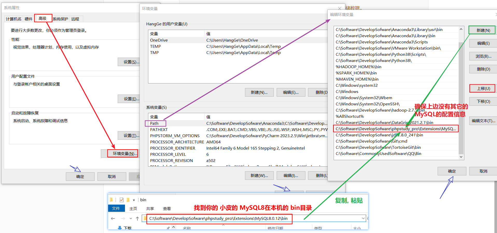

* 验证是否搭建成功

  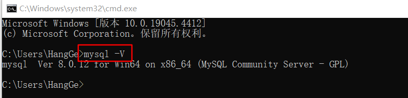


#### 3.遇到的问题及小皮设置

* 遇到的问题-卸载后如何清理注册表

  

* 小皮安装不了MySQL8.X

  * 解决方案1: 卸载小皮, 去 小皮官网下载最新版, 尝试下.
  * 解决方案2: 去MySQL官网, 手动下载MySQL8.X, 安装即可. 

* 装好小皮之后, 需要设置下数据库的引擎 和 密码(选做)

  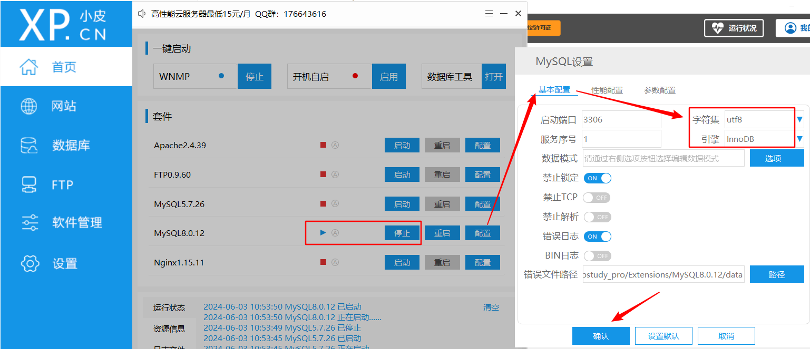

  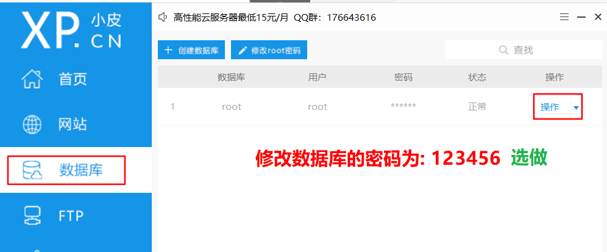


#### 4. 命令行方式-MySQL登陆和登出

* 方式1: 本地方式登陆.

  ```sql
  -- 写法1: 明文写法.
  格式: mysql -u账号 -p密码			然后敲回车.
  -- 例如:
  mysql -uroot -p123456
  
  
  -- 写法2: 暗文写法.
  格式: mysql -u 账号 -p    敲回车, 输入密码, 敲回车.
  -- 例如:
  mysql -u root -p			敲回车
  输入密码					 敲回车
  ```

  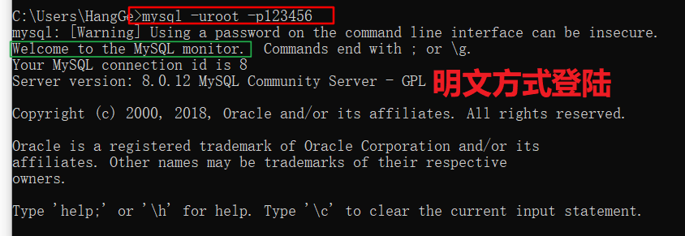

  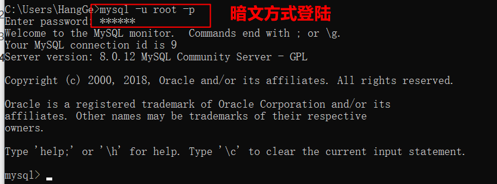

* 方式2: 远程方式登陆.

  ```sql
  -- 格式: mysql --host=主机地址 --user=账号 --password=密码
  -- 例如:
  mysql --host=127.0.0.1 --user=root --password=123456
  ```

  

* 登出

  ```sql
  -- 方式1: 输入 exit
  -- 方式2: 输入 quit
  -- 方式3: 点右上角的 ×
  ```


#### 5.MySQL的图形化管理工具

* 背景

  在DOS窗口中写SQL语句, 一方面没有提示, 另一方面写错了还无法及时修改, 总而言之, 弊端大于好处. 

  实际开发中, 我们一般会使用SQL的图形化管理工具来编写SQL.

* SQL的图形化管理工具

  * SQLyog

  * Navicat

  * DataGrip**(推荐)**

  * PyCharm**(非常推荐)**

    > DataGrip 和 PyCharm都是属于 JetBrains公司的产品, 这家公司是专门制作各种语言的IDE的. 
    >
    > 其公司总部位于 捷克共和国首都 布拉格. 
    >
    > IDE解释: Integrate Develop Environment(集成开发环境) = 软件, 集代码的编写, 编译, 运行, 调试, 排除, 提示等一系列功能于一体的软件. 

* DataGrip软件下载和安装

  * 官网地址: https://www.jetbrains.com/

  * 安装步骤: 略, 详见讲义.

  * 激活步骤:

    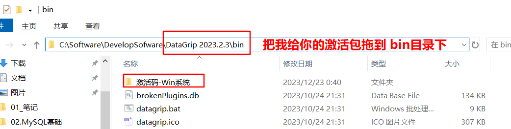


#### 6.DataGrip连接MySQL

1. 通过DataGrip新建工程.

   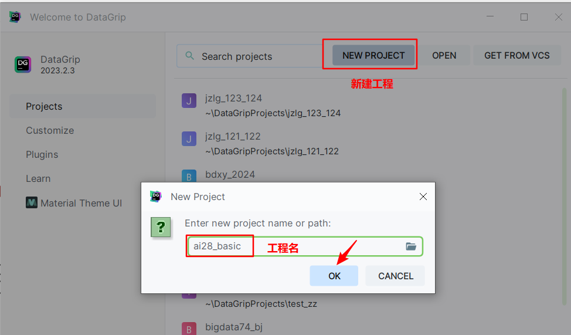

2. 新建连接-连接MySQL数据库

   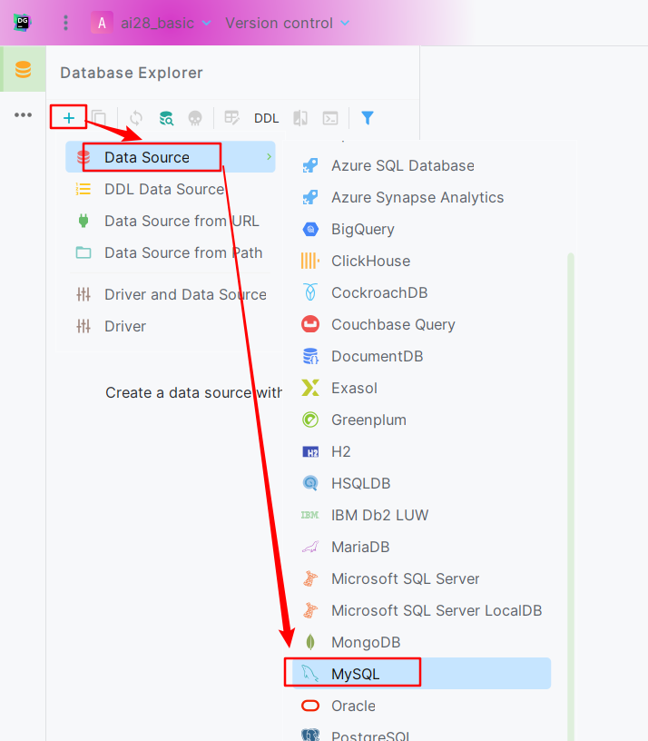

3. 填写连接信息即可, 具体如下:

   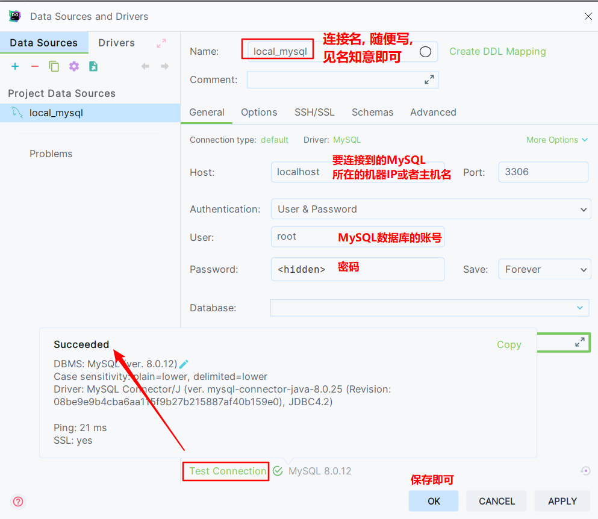

4. 首次连接, 需要配置对应的驱动, 要么用我给的驱动, 要么联网下载.

   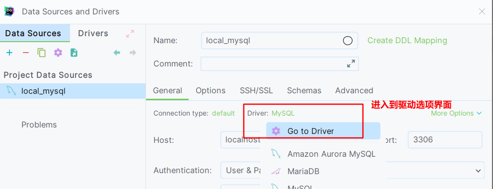

   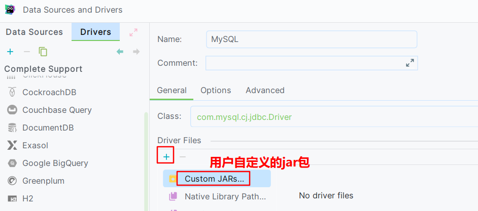

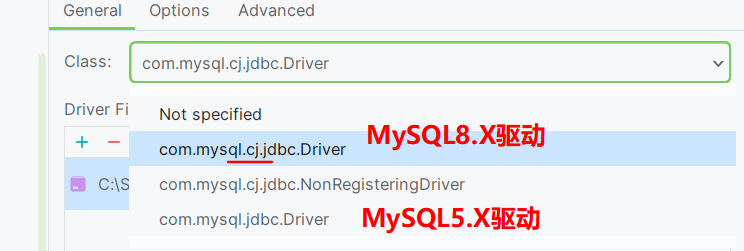

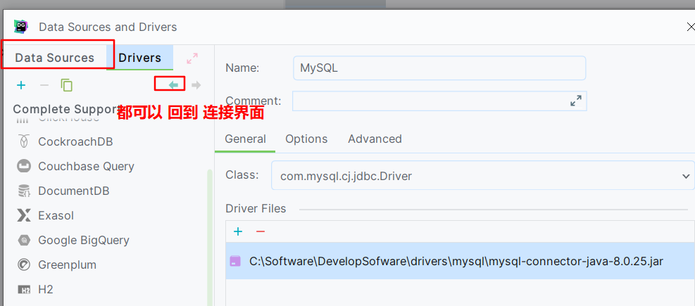

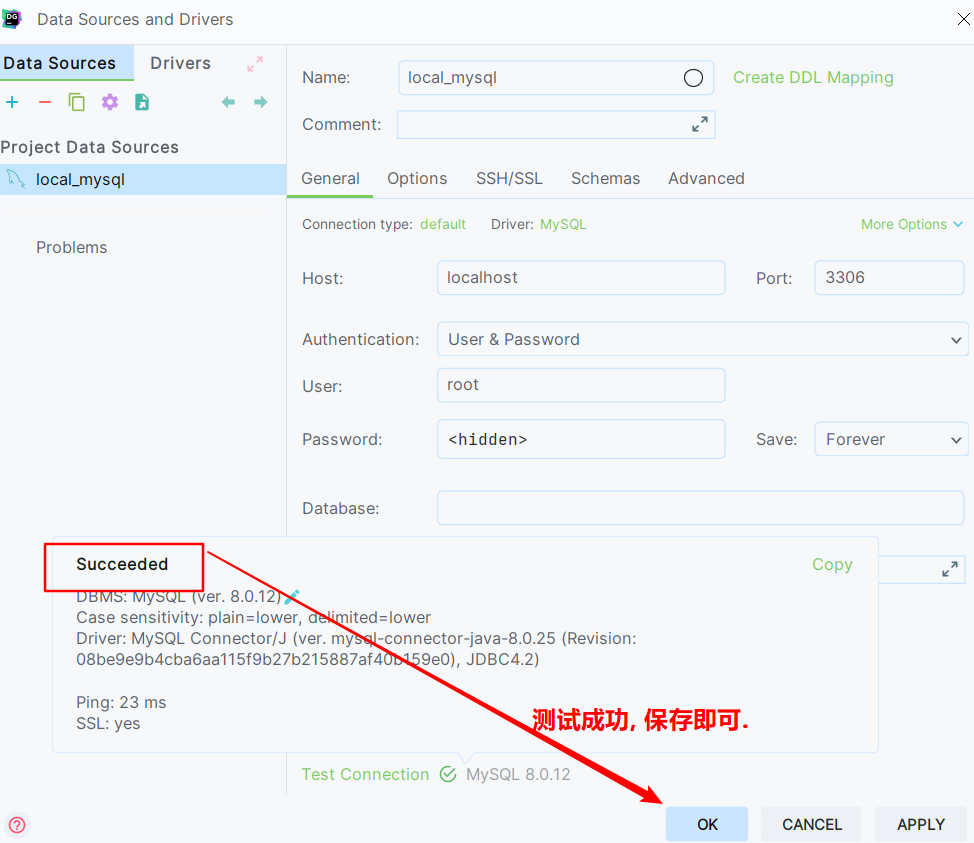


#### 7.DataGrip的基本设置

* 修改字体, 码表, 主题等.

  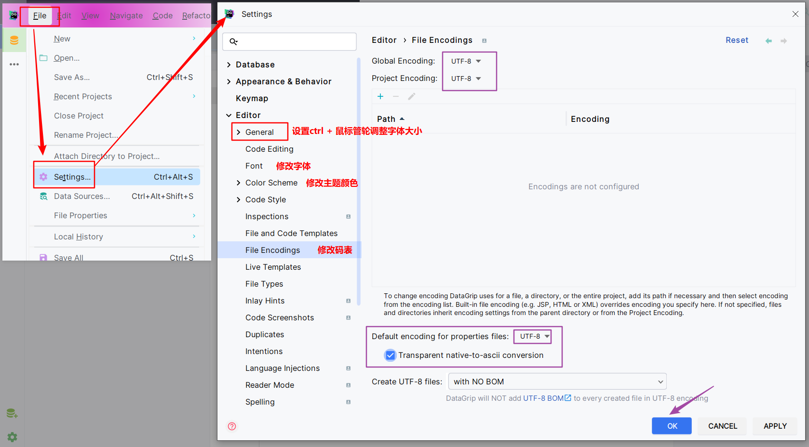

* 安装插件(可选)

  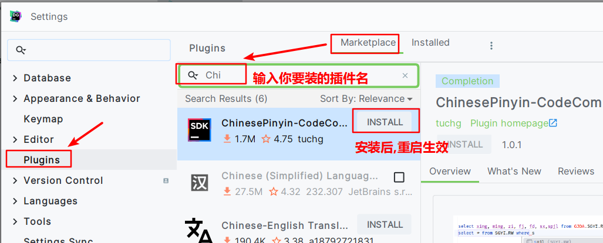

  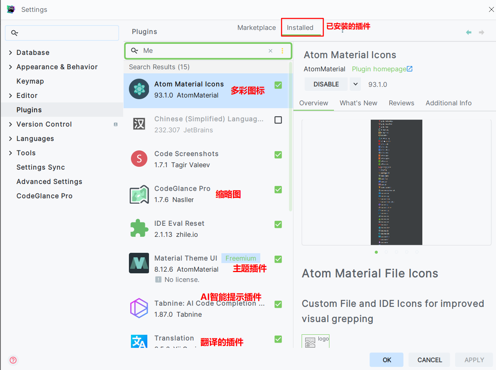

* 扩展: DataGrip连接虚拟机的MySQL

  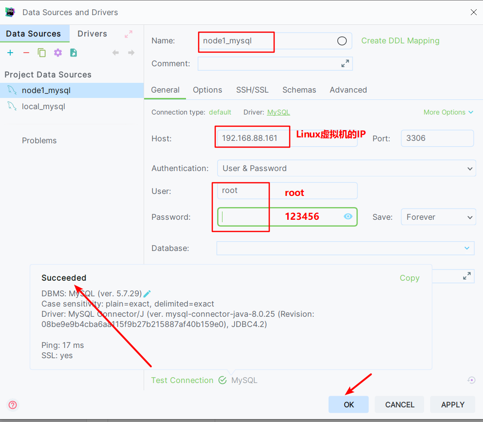


#### 8. SQL语句详解

* 分类

  ```sql
  -- DDL: 数据定义语言, 主要是操作: 数据库, 数据表, 列名.
  -- 关键字: create, drop, alter, show...
  
  -- DML: 数据操作语言, 主要是操作: 表数据, 更新操作(增删改)
  -- 关键字: insert, delete, update
  
  -- DQL: 数据查询语言, 主要是操作: 表数据, 查询操作.
  -- 关键字: select, from, where
  
  -- DCL: 数据控制语言, 主要是操作: 用户, 设置权限, 隔离级别.
  
  
  ```

  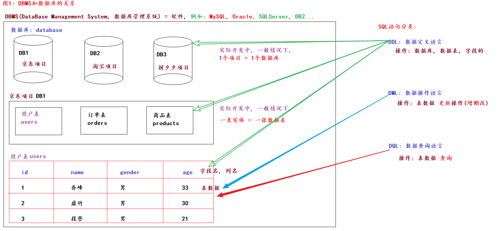

* 通用语法

  1. SQL语句以 分号 结尾.

  2. SQL语句可以写一行, 也可以写多行, 为了阅读方便, 我们加入空格, 水平制表符来修改SQL语句格式.

  3. SQL语句不分区大小写,  为了阅读方便, 建议关键字大写, 其它都小写.

  4. SQL语句注释的写法.

     ```sql
     注释介绍: 
     	概述:
     		用来给程序员看的, 对程序进行解释和说明的文字. 
     	特点:
     		被注释的内容, 程序执行时, 不会执行它. 
     	写法:
     		-- 单行注释, 空格必须加. 
     		# 单行注释, 空格写不写都行, 为了好看, 建议写. 
     		/*
     			多行
     			注释
     		*/
     		
     		
     注释的快捷键: 	ctrl + /			设置或者取消注释.
     格式化代码快捷键:  ctrl + alt + 字母L	 格式化代码.
     
     ```

* 常用的数据类型

  * 目的
    * 用来限制数据表的某列数据值, 可以是什么, 不可以是什么.
  * 常用的数据类型
    * 整型: int
    * 浮点型(小数型): float, double, decimal
    * 字符串: varchar(长度)
    * 日期类型: date, datetime


#### 9.DDL语句-操作数据库

```sql
# -------------------- DDL语句 操作数据库 --------------------
-- 1. 查看所有的数据库
show databases;

-- 格式: create database if not exists 数据库名 charset '码表名';
-- 2. 创建数据库, 采用默认码表.
create database day01;                  -- 默认码表: utf8

-- 3. 创建数据库, 采用: 指定码表.
create database day02 charset 'gbk';    -- 指定码表: gbk


-- 4. 创建数据库, 如果数据库不存在.   (掌握)
create database if not exists day01;    -- day01数据库不存在就创建, 存在就: 啥也不做.

-- 5. 查看(单个)数据库的详细信息(码表)
show create database day01;
show create database day02;

-- 6. 修改数据库的(码表).
alter database day02 charset 'utf8';

-- 7. 删除指定的数据库.
-- 格式: drop database 数据库名;
# drop database day02;
# drop database day03;

-- 8. 切库.    (掌握)
use day01;

-- 9. 查看当前使用的是哪个数据库.
select database();
```


#### 10.DDL语句-操作数据表

```sql
# -------------------- DDL语句 操作数据表 --------------------
-- 0. 切库.
use day01;

-- 1. 查看(当前数据库中)所有的数据表
show tables;

-- 2. 创建数据表.    (掌握)
/*
格式:
    create table [if not exists] 数据表名(
        列名1 数据类型 [约束],
        列名2 数据类型 [约束],
        列名3 数据类型 [约束],
        ...
        列名n 数据类型 [约束]       # 最后1个列名的结尾, 没有逗号.
    );
 */
-- 需求: 创建学生表student, 字段(学生编号, 姓名 非空约束, 性别, 年龄)
create table if not exists student(
    id int,                      # 学生编号
    name varchar(20) not null,   # 学生姓名, 非空
    gender varchar(10),          # 学生性别
    age int                      # 学生年龄
);

-- 3. 查看(单个)数据表的详细信息(码表)
show create table student;

# 需要你记忆的格式.   (掌握)
desc student;       # 查看表的字段(有哪些字段, 字段的数据类型, 约束等...),  describe: 描述.
desc stu;

-- 4. 修改数据表的(表名).
-- 格式: rename table 旧表名 to 新表名;
rename table student to stu;

-- 5. 删除指定的数据表.
drop table stu;
```


#### 11.DDL语句-操作字段

```sql
# -------------------- DDL语句 操作字段(了解) --------------------
-- 1. 查看表的所有(列)
desc student;

-- 2. 给表 新增列, 这个语句还有可能会用到, 理解即可.
-- 格式: alter table 表名 add 列名 数据类型 [约束];
alter table student add kongfu varchar(20) not null;

-- 3. 修改列, 数据类型 和 约束.    kongfu列, varchar(20) -> int
-- 格式: alter table 表名 modify 列名 数据类型 [约束];
alter table student modify kongfu int ;      -- 不加约束, 则会取消之前的约束.

-- 4. 修改列, 列名, 数据类型 和 约束.   kongfu -> gf varchar(10) 非空
-- 格式: alter table 表名 change 旧列名 新列名 数据类型 [约束];
alter table student change kongfu gf varchar(10) not null;

-- 5. 删除指定的列.
-- 格式: alter table 表名 drop 列名;
alter table student drop gf;
```


#### 12.DML语句-操作表数据

> DML: 数据操作语言, 主要是对表数据进行 **更新操作的, 即: 增, 删, 改.**

```sql
-- DML语句: 数据操作语言, 主要是对表数据进行更新操作的, 即: 增删改.
-- 关键字: insert, delete, update

-- 切库.
use day01;

# -------------------- 案例1: DML语句 操作数据表 增 --------------------
/*
格式:
    insert into 表名(列名1, 列名2...) values(值1, 值2...);
    insert into 表名 values(值1, 值2...);
    insert into 表名 values(null, 值2...);

    insert into 表名 values
        (值1, 值2...),
        (值1, 值2...),
        ......
        (值1, 值2...);

细节:
    1. 添加表数据的时候, 值的个数和类型, 要和 列名保持一致.
    2. 如果不写列名, 则默认是全列名, 即: 必须给所有的列依次赋值.
    3. 如果是主键列且配合有自增, 则: 传值的时候, 可以直接传入null, 系统会根据最大主键值 +1, 然后存储.
    4. 如果同时添加多行值, 多组值之间用逗号隔开, 最后一组值的后边写分号.
*/
-- 1. 添加单条数据.
insert into student(id, name, gender, age) values(1, '乔峰', '男', 33);
insert into student(name, age) value('虚竹', 30);
insert into student(gender, age) value('男', 21);    -- 报错, 姓名不能为空
insert into student(name,gender, age) value('段誉', '男', 21);    -- 正确

-- 2. 同时添加多条数据.
insert into student values
    (1, '阿朱', '女', 30),
    (2, '李清露', '女', 24),
    (3, '王语嫣', '女', 19);

-- 注意: 在进行修改或者删除操作的时候, 一定一定一定要加where条件, 一个老屌丝的含泪忠告.
# -------------------- 案例2: DML语句 操作数据表 改 --------------------
-- 格式: update 表名 set 字段名1=新值, 字段名2=新值... where 条件;
update student set id=10, name='萧峰' where id = 1;

-- 如果不写where条件, 一下子改变所有.
update student set id=1, name='无崖子';


# -------------------- 案例3: DML语句 操作数据表 删 --------------------
-- 格式: delete from 表名 where 条件;
delete from student where age > 25;

-- 不写where条件, 一次删除所有.
delete from student;

-- 还有一个删除语句叫: truncate table 表名, 明天详解, 要结合 主键约束, 才会更好的演示.

# -------------------- 扩展: DQL语句 操作数据表 查 --------------------
-- 简单查询, 查询表中所有的数据.
-- select * from day01.student;        # 数据库名.数据表名
select * from student;              # 如果直接写数据表用, 默认用的是 当前库中的表.

```

