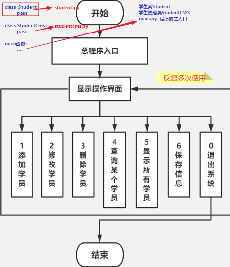

#### 今日内容大纲介绍

* 面向对象版: 学生管理系统
  * Student学生类
  * StudentCMS学生管理类
  * main.py 程序的主入口
  * 加入文件: student.txt存储学生信息
* 深拷贝和浅拷贝
  * 可变类型
  * 不可变类型

---

#### 1.学生管理系统-分析

* 涉及到的知识点

  * 面向对象
  * 列表, 字典
  * for, if, input...
  * 文件操作
  * ......

* 需求分析

  

* 结论: 分模块(.py文件)进行开发

  * **main.py**	程序的主入口

  * **student.py**   存储学生类(Student类)的信息

    > 学生的属性: **姓名, 年龄, 性别, 手机号, 备注**

  * **studentcms.py** 存储学生管理类(StudentCms类)的信息

    > CMS全称: Content Management System, 内容管理系统
    >
    > 具体的**操作学生信息, 例如: 增删改查, 保存, 退出系统等**都是在这里完成的.

#### 2.学生类代码实现

* 如下的代码是在  **student.py** 文件中写的

  ```python
  
  # 定义学生类, 属性为: 姓名, 年龄, 性别, 联系方式, 描述信息.
  class Student(object):
      # 1. 在__init__()魔法方法中, 完成 对象属性(实例属性) 的初始化.
      def __init__(self, name, age, gender, mobile, des):
          """
          完成对象属性的初始化
          :param name: 姓名
          :param age: 年龄
          :param gender: 性别
          :param mobile: 手机号
          :param des: 描述信息(备注)
          """
          self.name = name
          self.age = age
          self.gender = gender
          self.mobile = mobile
          self.des = des
  
      # 2. 重写__str__魔法方法, 打印(学生)对象的各个属性值.
      def __str__(self):
          return f'姓名: {self.name}, 年龄: {self.age}, 性别: {self.gender}, 手机号: {self.mobile}, 备注: {self.des}'
  
  
  # 3. 在main函数中测试学生类的内容, 加main函数的目的: 防止如下的测试代码在 调用者中被执行.
  if __name__ == '__main__':
      s = Student('乔峰', 33, '男', '13112345678', '丐帮帮主')
      print(s)
  ```


#### 3.学生管理类-初始化及打印界面

* 如下的代码是在  **studentcms.py** 文件中写的

  ```python
  # 导包
  
  
  # 自定义的学生管理类, 负责完成对学生信息的管理操作, 例如: 增删改查, 保存等...
  class StudentCms(object):
      # 1. 重构 __init__()函数, 初始化info变量, 它是列表嵌套字典的形式, 存储学生信息.
      def __init__(self):
          self.info = []      # 对象属性(实例属性, 对象变量, 实例变量)
  
      # 2. 定义函数show_view(), 用于打印提示界面
      def show_view(self):
          print('*' * 31)
          print('欢迎来到黑马学生管理系统V2.0')
          print('\t1.添加学生信息')
          print('\t2.删除学生信息')
          print('\t3.修改学生信息')
          print('\t4.查询单个学生信息')
          print('\t5.显示所有学生信息')
          print('\t6.保存学生信息')
          print('\t0.退出系统')
          print('*' * 31)
  
  ```

#### 4.学生管理类-基本框架搭建

* 如下的代码是在  **studentcms.py** 文件中写的

  ```python
  # 导包
  import time
  
  # 自定义的学生管理类, 负责完成对学生信息的管理操作, 例如: 增删改查, 保存等...
  class StudentCms(object):
      # 1. 重构 __init__()函数, 初始化info变量, 它是列表嵌套字典的形式, 存储学生信息.
      def __init__(self):
          self.info = []      # 对象属性(实例属性, 对象变量, 实例变量)
  
      # 2. 定义函数show_view(), 用于打印提示界面
      def show_view(self):
          print('*' * 31)
          print('欢迎来到黑马学生管理系统V2.0')
          print('\t1.添加学生信息')
          print('\t2.删除学生信息')
          print('\t3.修改学生信息')
          print('\t4.查询单个学生信息')
          print('\t5.显示所有学生信息')
          print('\t6.保存学生信息')
          print('\t0.退出系统')
          print('*' * 31)
  
      # 3. 定义函数add_student, 负责: 添加学生信息
      def add_student(self):
          pass
  
      # 4. 定义函数del_student, 负责: 删除学生信息
      def del_student(self):
          pass
  
      # 5. 定义函数update_student, 负责: 修改学生信息
      def update_student(self):
          pass
  
      # 6. 定义函数search_student, 负责: 查询单个学生信息
      def search_student(self):
          pass
  
      # 7. 定义函数show_all_student, 负责: 显示所有学生信息
      def show_all_student(self):
          pass
  
      # 8. 定义函数save_student, 负责: 保存学生信息到文件
      def save_student(self):
          pass
  
      # 9. 定义函数load_student(), 负责: 从文件中加载学生信息到 self.info 列表中.
      def load_student(self):
          pass
  
      # 10. 定义函数start(), 表示具体的业务逻辑, 即: 用户录入编号, 进行对应的操作.
      def start(self):
          # 10.1
  
          # 10.2 循环提示用户录入操作的编号, 然后进行对应的操作.
          while True:
              # 10.3 为了让效果更好, 更真实, 我们加入: 休眠功能.
              time.sleep(1)
              # 10.4 打印提示界面
              self.show_view()
              # 10.5 提示用户录入要操作的编号, 并接收.
              num = input('请录入要操作的编号: ')
              # 10.6 根据用户录入的编号, 进行对应的操作.
              if num == '1':
                  print('添加学生\n')
                  self.add_student()
              elif num == '2':
                  print('删除学生\n')
                  self.del_student()
              elif num == '3':
                  print('修改学生\n')
                  self.update_student()
              elif num == '4':
                  print('查询单个学生\n')
                  self.search_student()
              elif num == '5':
                  print('显示所有学生\n')
                  self.show_all_student()
              elif num == '6':
                  print('保存学生信息\n')
                  self.save_student()
              elif num == '0':
                  # 细节: 增加二次退出判断.
                  s = input('请确认要退出吗(Y/N): ')
                  if s.lower() == 'y':        # 字符串的lower()函数, 目的是: 把字母转成小写形式.
                      print('谢谢您的使用, 我们下次再会!')
                      break
              else:
                  print('录入有误, 请重新录入!\n')
  
  
  # 11. 测试学生管理类的代码.
  if __name__ == '__main__':
      stu_cms = StudentCms()
      stu_cms.start()
  ```

#### 5.程序主入口-编写

* 如下的代码是在  **main.py** 文件中写的

  ```python
  # 导包
  from student_cms import StudentCms
  
  # main函数, 作为程序的主入口, 即: 整个学生管理系统的代码是从这里开始执行的.
  if __name__ == '__main__':
      # 1. 创建学生管理类对象.
      stu_cms = StudentCms()
      # 2. 调用start()函数, 启动: 学生管理系统.
      stu_cms.start()
  ```

#### 6.增删改查学生信息-代码实现

* 添加学生信息

  ```python
  # 3. 定义函数add_student, 负责: 添加学生信息
  def add_student(self):
      # 3.1 提示用户录入要添加的学生信息.
      name = input('请录入要添加的学生姓名: ')
      age = int(input('请录入要添加的学生年龄: '))
      gender = input('请录入要添加的学生性别(男/女): ')
      mobile = input('请录入要添加的学生手机号: ')
      des = input('请录入要添加的学生备注: ')
      # 3.2 把上述的学生信息, 封装成: 学生对象.
      stu = Student(name, age, gender, mobile, des)
      # 3.3 把上述的学生对象, 添加到 self.info 列表中.
      self.info.append(stu)
      # 3.4 提示即可.
      print('添加学员信息成功!\n')
  ```

* 查看所有学生信息

  ```python
  # 7. 定义函数show_all_student, 负责: 显示所有学生信息
  def show_all_student(self):
  	# 7.1 判断是否有学生信息, 有: 则遍历输出.
  	if len(self.info) > 0:
  		for stu in self.info:
  			print(stu)
  		print() # 加个换行, 代码效果更好.
  	else:
  		# 7.2 无, 则提示: 先添加, 后查询.
  		print('暂无学生信息, 请添加后查询!\n')
  ```

* 删除学生信息

  ```python
  # 4. 定义函数del_student, 负责: 删除学生信息
  def del_student(self):
  	# 4.1 请录入要删除的学员的姓名.
  	del_name = input('请录入要删除的学员的姓名: ')
  	# 4.2 遍历info列表, 看是否有该学员.
  	for stu in self.info:
  		if stu.name == del_name:
  			# 4.3 如果有同名学员, 就删除该学生.
  			self.info.remove(stu)
  			print(f'删除 {del_name} 学生信息成功!\n')
  			# 4.4 核心细节, 记得: break
  			break
  	else:
  		# 4.5 走这里, 没找到, 提示即可.
  		print('查无此人, 请校验后再删除!\n')
  ```

* 修改学生信息

  ```python
  # 5. 定义函数update_student, 负责: 修改学生信息
  def update_student(self):
  	# 5.1 请录入要修改的学员的姓名.
  	update_name = input('请录入要修改的学员的姓名: ')
  	# 5.2 遍历info列表, 看是否有该学员.
  	for stu in self.info:
  		if stu.name == update_name:
  			# 4.3 如果有同名学员, 就修改该学生信息.
  			stu.age = int(input('请录入要添加的学生年龄: '))
  			stu.gender = input('请录入要添加的学生性别(男/女): ')
  			stu.mobile = input('请录入要添加的学生手机号: ')
  			stu.des = input('请录入要添加的学生备注: ')
  
  			print(f'修改 {update_name} 学生信息成功!\n')
  			# 4.4 核心细节, 记得: break
  			break
  	else:
  		# 4.5 走这里, 没找到, 提示即可.
  		print('查无此人, 请校验后再修改!\n')
  ```

* 查询单个学生信息

  ```python
  # 6. 定义函数search_student, 负责: 查询单个学生信息
  def search_student(self):
  	# 6.1 请录入要查询的学员的姓名.
  	search_name = input('请录入要查询的学员的姓名: ')
  	# 6.2 遍历info列表, 看是否有该学员.
  	for stu in self.info:
  		if stu.name == search_name:
  			# 6.3 如果有同名学员, 就打印该学生.
  			print(stu, end='\n\n')
  			# 6.4 核心细节, 记得: break
  			break
  	else:
  		# 6.5 走这里, 没找到, 提示即可.
  		print('查无此人, 请校验后再查询!\n')
  ```

#### 7.扩展-dict属性

```python
"""
__dict__ 属性介绍:
    作用:
        1. 它是每个类的内置属性, 类似于 魔法方法一样, 每个类都有, 可以直接拿来使用.
        2. 它可以把对象变成字典形式, 即: {属性名:属性值, 属性名:属性值}
"""
from student import Student

# 1. 创建学生类对象.
s1 = Student('乔峰', 33, '男', '111', '帮主')
s2 = Student('虚竹', 29, '男', '222', '和尚')
s3 = Student('段誉', 23, '男', '333', '渣男')


# 2. 需求1: 把s1对象, 封装成 字典形式.
# 方式1: 手动配置
dict1 = {'name': s1.name, 'age': s1.age, 'gender': s1.gender, 'mobile': s1.mobile, 'des': s1.des}
print(dict1)

# 方式2: 通过类内置的 __dict__属性实现.
dict2 = s1.__dict__
print(dict2)
print('-' * 31)

# 3. 需求2: 把s1, s2, s3对象添加到列表中, 形成: 列表嵌套字典的形式, 存储学生数据.
# 即: [学生对象, 学生对象, 学生对象]  =>  [{学生信息}, {学生信息}, {学生信息}]
# 3.1 定义列表, 记录 学生对象.
info = [s1, s2, s3]
# print(info)   # [<student.Student object at 0x000001E84547E5E0>, <student.Student object at 0x000001E84547E520>, <student.Student object at 0x000001E84547E2B0>]

# 3.2 把上述的学生列表, 转成 列表嵌套字典形式.
# 方式1: 完整版.
list_data = []
for stu in info:
    list_data.append(stu.__dict__)
print(list_data) # [{'name': '乔峰', 'age': 33, 'gender': '男', 'mobile': '111', 'des': '帮主'}, {...}, {...}]

# 方式2: 列表推导式版
list_data2 = [stu.__dict__ for stu in info]
print(list_data2)
```


#### 8.保存学生信息

```python
# 8. 定义函数save_student, 负责: 保存学生信息到文件
def save_student(self):
	# 8.1 获取文件对象, 往 student.data 文件中, 添加学生数据.
	with open('./student.data', 'w', encoding='utf-8') as my_f:
		# 8.2 把self.info列表, 从 [学生对象, 学生对象...]  =>  "[{学生信息}, {学生信息}, ...]"
		list_data = str([stu.__dict__ for stu in self.info])
		# print(f'list_data: {list_data}')
		# print(type(list_data))      # <class 'str'>
		# 8.3 把上述的 字符串形式的 列表嵌套字典(即: 所有学生的数据), 写到目的地文件中.
		my_f.write(list_data)
		# 8.4 提示即可.
		print('保存学生信息成功!\n')
```


#### 9.加载学生信息

```python
# 9. 定义函数load_student(), 负责: 从文件中加载学生信息到 self.info 列表中.
def load_student(self):
	# 9.1 创建文件对象, 负责从 student.data文件中 读取数据.
	try:
		with open('./student.data', 'r', encoding='utf-8') as my_f:
			# 9.2 一次性从文件中读取所有的数据.
			data = my_f.read()      # data的格式: "[{学生信息}, {学生信息}, {学生信息}]"
			# 9.3 对读取到的数据做判断, 如果文件为空, 则给data赋一个默认值.
			if len(data) <= 0:
				data = "[]"
			# 9.4 把上述的data转成 列表
			list_data = eval(data)    # 相当于把两端的引号去掉, 是啥就是转成啥.  [{学生信息}, {学生信息}, {学生信息}]
			# 9.5 列表推导式方式实现, 把上述的list_data(列表嵌套字典)数据, 封装成学生对象, 然后添加到self.info列表中.
			# self.info = [Student('乔峰', 33, '男', '111', '帮主') for stu_dict in list_data]
			self.info = [
				Student(stu_dict['name'], stu_dict['age'], stu_dict['gender'], stu_dict['mobile'], stu_dict['des'])
						 for stu_dict in list_data
			]
	except:
		# 9.6 走这里, 说明程序出问题了, 原因是: 存储学生信息的 student.data文件不存在.
		my_f = open('./student.data', 'w', encoding='utf-8')    # 写的操作, 目的地文件不存在, 会自动创建.
		my_f.close()
```

#### 10.什么情况下用静态方法

* 改造 **studentcms.py**文件中的 show_view()函数为: 静态方法

  ```python
  # 2. 定义函数show_view(), 用于打印提示界面. 因为该函数不涉及self和cls, 所以定义为: 静态方法.
  @staticmethod
  def show_view():
  	print('*' * 31)
  	print('欢迎来到黑马学生管理系统V2.0')
  	print('\t1.添加学生信息')
  	print('\t2.删除学生信息')
  	print('\t3.修改学生信息')
  	print('\t4.查询单个学生信息')
  	print('\t5.显示所有学生信息')
  	print('\t6.保存学生信息')
  	print('\t0.退出系统')
  	print('*' * 31)
  ```

* 同理, 修改下调用的代码, **具体是 10.4 步骤的代码**

  ```python
  # 10. 定义函数start(), 表示具体的业务逻辑, 即: 用户录入编号, 进行对应的操作.
  def start(self):
  	# 10.1 调用load_student()函数, 加载学生数据.
  	self.load_student()
  
  	# 10.2 循环提示用户录入操作的编号, 然后进行对应的操作.
  	while True:
  		# 10.3 为了让效果更好, 更真实, 我们加入: 休眠功能.
  		time.sleep(1)
  		# 10.4 打印提示界面
  		StudentCms.show_view()  # 静态方法调用方式1: 类名. 的方式.  推荐.
  		# self.show_view()      # 静态方法调用方式2: 对象名.的方式  虽然支持, 但是: 不推荐.
  
  		# 10.5 提示用户录入要操作的编号, 并接收.
  		num = input('请录入要操作的编号: ')
  		# 10.6 根据用户录入的编号, 进行对应的操作.
  		if num == '1':
  			# print('添加学生\n')
  			self.add_student()
  		elif num == '2':
  			# print('删除学生\n')
  			self.del_student()
  		elif num == '3':
  			# print('修改学生\n')
  			self.update_student()
  		elif num == '4':
  			# print('查询单个学生\n')
  			self.search_student()
  		elif num == '5':
  			# print('显示所有学生\n')
  			self.show_all_student()
  		elif num == '6':
  			# print('保存学生信息\n')
  			self.save_student()
  		elif num == '0':
  			# 细节: 增加二次退出判断.
  			s = input('请确认要退出吗(Y/N): ')
  			if s.lower() == 'y':  # 字符串的lower()函数, 目的是: 把字母转成小写形式.
  				print('谢谢您的使用, 我们下次再会!')
  				break
  		else:
  			print('录入有误, 请重新录入!\n')
  
  ```

#### 11.完整版的学生管理系统

* **student.py** 文件中的代码

  ```python
  # 定义学生类, 属性为: 姓名, 年龄, 性别, 联系方式, 描述信息.
  class Student(object):
      # 1. 在__init__()魔法方法中, 完成 对象属性(实例属性) 的初始化.
      def __init__(self, name, age, gender, mobile, des):
          """
          完成对象属性的初始化
          :param name: 姓名
          :param age: 年龄
          :param gender: 性别
          :param mobile: 手机号
          :param des: 描述信息(备注)
          """
          self.name = name
          self.age = age
          self.gender = gender
          self.mobile = mobile
          self.des = des
  
      # 2. 重写__str__魔法方法, 打印(学生)对象的各个属性值.
      def __str__(self):
          return f'姓名: {self.name}, 年龄: {self.age}, 性别: {self.gender}, 手机号: {self.mobile}, 备注: {self.des}'
  
  
  # 3. 在main函数中测试学生类的内容, 加main函数的目的: 防止如下的测试代码在 调用者中被执行.
  if __name__ == '__main__':
      s = Student('乔峰', 33, '男', '13112345678', '丐帮帮主')
      print(s)
  ```

* **studentcms.py** 文件中的代码

  ```python
  # 导包
  import time
  
  from student import Student
  
  
  # 自定义的学生管理类, 负责完成对学生信息的管理操作, 例如: 增删改查, 保存等...
  class StudentCms(object):
      # 1. 重构 __init__()函数, 初始化info变量, 它是列表嵌套字典的形式, 存储学生信息.
      def __init__(self):
          # info格式, 例如: [<student.Student object at 0x000001FDD1479670>, <student.Student object at 0x000001FDD1B961C0>]
          self.info = []  # 对象属性(实例属性, 对象变量, 实例变量)
  
      # 2. 定义函数show_view(), 用于打印提示界面. 因为该函数不涉及self和cls, 所以定义为: 静态方法.
      @staticmethod
      def show_view():
          print('*' * 31)
          print('欢迎来到黑马学生管理系统V2.0')
          print('\t1.添加学生信息')
          print('\t2.删除学生信息')
          print('\t3.修改学生信息')
          print('\t4.查询单个学生信息')
          print('\t5.显示所有学生信息')
          print('\t6.保存学生信息')
          print('\t0.退出系统')
          print('*' * 31)
  
      # 3. 定义函数add_student, 负责: 添加学生信息
      def add_student(self):
          # 3.1 提示用户录入要添加的学生信息.
          name = input('请录入要添加的学生姓名: ')
          age = int(input('请录入要添加的学生年龄: '))
          gender = input('请录入要添加的学生性别(男/女): ')
          mobile = input('请录入要添加的学生手机号: ')
          des = input('请录入要添加的学生备注: ')
          # 3.2 把上述的学生信息, 封装成: 学生对象.
          stu = Student(name, age, gender, mobile, des)
          # 3.3 把上述的学生对象, 添加到 self.info 列表中.
          self.info.append(stu)
          # 3.4 提示即可.
          print('添加学员信息成功!\n')
  
      # 4. 定义函数del_student, 负责: 删除学生信息
      def del_student(self):
          # 4.1 请录入要删除的学员的姓名.
          del_name = input('请录入要删除的学员的姓名: ')
          # 4.2 遍历info列表, 看是否有该学员.
          for stu in self.info:
              if stu.name == del_name:
                  # 4.3 如果有同名学员, 就删除该学生.
                  self.info.remove(stu)
                  print(f'删除 {del_name} 学生信息成功!\n')
                  # 4.4 核心细节, 记得: break
                  break
          else:
              # 4.5 走这里, 没找到, 提示即可.
              print('查无此人, 请校验后再删除!\n')
  
  
      # 5. 定义函数update_student, 负责: 修改学生信息
      def update_student(self):
          # 5.1 请录入要修改的学员的姓名.
          update_name = input('请录入要修改的学员的姓名: ')
          # 5.2 遍历info列表, 看是否有该学员.
          for stu in self.info:
              if stu.name == update_name:
                  # 4.3 如果有同名学员, 就修改该学生信息.
                  stu.age = int(input('请录入要添加的学生年龄: '))
                  stu.gender = input('请录入要添加的学生性别(男/女): ')
                  stu.mobile = input('请录入要添加的学生手机号: ')
                  stu.des = input('请录入要添加的学生备注: ')
  
                  print(f'修改 {update_name} 学生信息成功!\n')
                  # 4.4 核心细节, 记得: break
                  break
          else:
              # 4.5 走这里, 没找到, 提示即可.
              print('查无此人, 请校验后再修改!\n')
  
      # 6. 定义函数search_student, 负责: 查询单个学生信息
      def search_student(self):
          # 6.1 请录入要查询的学员的姓名.
          search_name = input('请录入要查询的学员的姓名: ')
          # 6.2 遍历info列表, 看是否有该学员.
          for stu in self.info:
              if stu.name == search_name:
                  # 6.3 如果有同名学员, 就打印该学生.
                  print(stu, end='\n\n')
                  # 6.4 核心细节, 记得: break
                  break
          else:
              # 6.5 走这里, 没找到, 提示即可.
              print('查无此人, 请校验后再查询!\n')
  
      # 7. 定义函数show_all_student, 负责: 显示所有学生信息
      def show_all_student(self):
          # 7.1 判断是否有学生信息, 有: 则遍历输出.
          if len(self.info) > 0:
              for stu in self.info:
                  print(stu)
              print() # 加个换行, 代码效果更好.
          else:
              # 7.2 无, 则提示: 先添加, 后查询.
              print('暂无学生信息, 请添加后查询!\n')
  
  
      # 8. 定义函数save_student, 负责: 保存学生信息到文件
      def save_student(self):
          # 8.1 获取文件对象, 往 student.data 文件中, 添加学生数据.
          with open('./student.data', 'w', encoding='utf-8') as my_f:
              # 8.2 把self.info列表, 从 [学生对象, 学生对象, 学生对象]  =>  "[{学生信息}, {学生信息}, {学生信息}]"
              list_data = str([stu.__dict__ for stu in self.info])
              # print(f'list_data: {list_data}')
              # print(type(list_data))      # <class 'str'>
              # 8.3 把上述的 字符串形式的 列表嵌套字典(即: 所有学生的数据), 写到目的地文件中.
              my_f.write(list_data)
              # 8.4 提示即可.
              print('保存学生信息成功!\n')
  
  
      # 9. 定义函数load_student(), 负责: 从文件中加载学生信息到 self.info 列表中.
      def load_student(self):
          # 9.1 创建文件对象, 负责从 student.data文件中 读取数据.
          try:
              with open('./student.data', 'r', encoding='utf-8') as my_f:
                  """
                  数据变化流程如下:
                      data的数据格式:
                          "[{'name': '张三', 'age': 23, 'gender': '男', 'mobile': '111', 'des': '程序员'}, {学生信息}...]"
                     如果 student.data文件为空, 则: data的数据格式为: 
                          "[]"
                     list_data的数据格式:
                          [{'name': '张三', 'age': 23, 'gender': '男', 'mobile': '111', 'des': '程序员'}, {学生信息}...]
                     for stu_dict in list_data:
                          遍历list_data列表, 获取到每个元素(即: 字典形式的数据), 然后赋值给变量 stu_dict
                     stu_dict的数据格式:
                          {'name': '张三', 'age': 23, 'gender': '男', 'mobile': '111', 'des': '程序员'}
                         回顾:
                              问题: 如何获取字典的值呢? 
                              答案: 字典名['键名']  或者  字典名.get('键名')
                         例如:
                              stu_dict['name']        张三
                              stu_dict['age']         23
                              stu_dict['gender']      男
                              stu_dict['mobile']      111
                              stu_dict['des']         程序员
                     把上述的数据封装成学生对象, 即:
                          Student('张三', 23, '男', '111', '程序员')
                          Student(stu_dict['name'], stu_dict['age'], stu_dict['gender'], stu_dict['mobile'], stu_dict['des'])
                     大白话总结:
                          self.info = 列表推导式[ Student(字典形式的学生数据-获取每组值) for 字典形式的学生数据 in 列表嵌套字典形式的学生数据]
                  """
                  # 9.2 一次性从文件中读取所有的数据.
                  data = my_f.read()      # data的格式: "[{学生信息}, {学生信息}, {学生信息}]"
                  # 9.3 对读取到的数据做判断, 如果文件为空, 则给data赋一个默认值.
                  if len(data) <= 0:
                      data = "[]"
                  # 9.4 把上述的data转成 列表
                  list_data = eval(data)    # 相当于把两端的引号去掉, 是啥就是转成啥.  [{学生信息}, {学生信息}, {学生信息}]
                  # 9.5 列表推导式方式实现, 把上述的list_data(列表嵌套字典)数据, 封装成学生对象, 然后添加到self.info列表中.
                  # self.info = [Student('乔峰', 33, '男', '111', '帮主') for stu_dict in list_data]
                  self.info = [
                      Student(stu_dict['name'], stu_dict['age'], stu_dict['gender'], stu_dict['mobile'], stu_dict['des'])
                               for stu_dict in list_data
                  ]
          except:
              # 9.6 走这里, 说明程序出问题了, 原因是: 存储学生信息的 student.data文件不存在.
              my_f = open('./student.data', 'w', encoding='utf-8')    # 写的操作, 目的地文件不存在, 会自动创建.
              my_f.close()
  
      # 10. 定义函数start(), 表示具体的业务逻辑, 即: 用户录入编号, 进行对应的操作.
      def start(self):
          # 10.1 调用load_student()函数, 加载学生数据.
          self.load_student()
  
          # 为了让测试效果更明显, 我们先给几个测试数据. 项目正式上线的时候, 注释掉或者删除掉即可.
          # s1 = Student('乔峰', 33, '男', '111', '帮主')
          # s2 = Student('虚竹', 29, '男', '222', '和尚')
          # s3 = Student('段誉', 23, '男', '333', '渣男')
          # self.info.append(s1)
          # self.info.append(s2)
          # self.info.append(s3)
  
          # 10.2 循环提示用户录入操作的编号, 然后进行对应的操作.
          while True:
              # 10.3 为了让效果更好, 更真实, 我们加入: 休眠功能.
              time.sleep(1)
              # 10.4 打印提示界面
              StudentCms.show_view()  # 静态方法调用方式1: 类名. 的方式.  推荐.
              # self.show_view()      # 静态方法调用方式2: 对象名.的方式  虽然支持, 但是: 不推荐.
  
              # 10.5 提示用户录入要操作的编号, 并接收.
              num = input('请录入要操作的编号: ')
              # 10.6 根据用户录入的编号, 进行对应的操作.
              if num == '1':
                  # print('添加学生\n')
                  self.add_student()
              elif num == '2':
                  # print('删除学生\n')
                  self.del_student()
              elif num == '3':
                  # print('修改学生\n')
                  self.update_student()
              elif num == '4':
                  # print('查询单个学生\n')
                  self.search_student()
              elif num == '5':
                  # print('显示所有学生\n')
                  self.show_all_student()
              elif num == '6':
                  # print('保存学生信息\n')
                  self.save_student()
              elif num == '0':
                  # 细节: 增加二次退出判断.
                  s = input('请确认要退出吗(Y/N): ')
                  if s.lower() == 'y':  # 字符串的lower()函数, 目的是: 把字母转成小写形式.
                      print('谢谢您的使用, 我们下次再会!')
                      break
              else:
                  print('录入有误, 请重新录入!\n')
  
  
  # 11. 测试学生管理类的代码.
  if __name__ == '__main__':
      stu_cms = StudentCms()
      stu_cms.start()
  ```

* **main.py** 文件中的代码

  ```python
  # 导包
  from student_cms import StudentCms
  
  # main函数, 作为程序的主入口, 即: 整个学生管理系统的代码是从这里开始执行的.
  if __name__ == '__main__':
      # 1. 创建学生管理类对象.
      stu_cms = StudentCms()
      # 2. 调用start()函数, 启动: 学生管理系统.
      stu_cms.start()
  ```

* **student.data** 文件中的数据格式为:

  ```python
  [{'name': '张三', 'age': 23, 'gender': '男', 'mobile': '111', 'des': '程序员'},{}...]
  ```

#### 12.普通赋值-代码讲解

```python
"""
深拷贝和浅拷贝介绍:
    概述:
        大白话解释就是 深拷贝拷贝的多, 浅拷贝拷贝的少.
    细节(记忆):
        1. 深浅拷贝区别就是: 拷贝的层级的多与少.
        2. 深浅拷贝都能操作可变类型 和 不可变类型, 但是深浅拷贝一般操作的都是 可变类型, 几乎不会出操作不可变类型的.
        3. 回顾, 我们之前学过 可变类型 和 不可变类型的划分依据: 在不改变地址值的情况下, 元素值是否可以发生改变, 可以: 可变类型, 不可以: 不可变类型.
            可变类型:   列表, 字典, 集合
            不可变类型:  整型, 浮点型, 字符串, 布尔型, 元组
        4. 深浅拷贝指的是 copy模块下的不同的函数.
            浅拷贝: copy.copy()
            深拷贝: copy.deepcopy()
"""

# 需求: 演示可变和不可变类型.
# a = 10
# print(id(a))    # 140711071459392
# a = 20          # 内容变了.
# print(id(a))    # 140711071459712, 内容变了, 地址值也变了 = 不可变类型.
# print('-' * 31)
#
# list1 = [11, 22, 33]
# print(id(list1))    # 1675417267008
# list1[1] = 200
# print(id(list1))    # 1675417267008
# print(list1)        # [11, 200, 33], 内容变了, 地址值没变 = 可变类型.

# python的赋值操作属于引用赋值(eg:b是a的别名, 形参是实参的别名)
def dm01_普通赋值():
    # 1 python中的赋值操作, 属于引用赋值 (把a的地址赋值给b)
    # 2 b是a的别名, b和a都指向相同的内存空间
    a = 10
    b = a
    print('id(a)-->', id(a))    # 1
    print('id(b)-->', id(b))    # 1
    print('id(10)-->', id(10))  # 1

    # 3 也是引用赋值 c和d指向相同的内存空间
    a = [1, 2, 3]
    b = [11, 22, 33]
    c = [a, b]
    d = c
    print('id(c)-->', id(c))    # 2
    print('id(d)-->', id(d))    # 2

    # 4 值的方式赋值 a 指向一块内存空间、b 也指向一块内存空间
    # b = a python中不支持, 这样做传参效率高

dm01_普通赋值()
```

#### 13.浅拷贝-代码讲解

```python
import copy


# 需求1: 浅拷贝可变类型: 只拷贝第1层数据, 深层次数据不拷贝
def dm02_浅拷贝可变类型():
    a = [1, 2, 3]
    b = [11, 22, 33]
    c = [6, 7, a, b]

    # 测试1 id(c)和id(d)
    d = copy.copy(c)
    print('id(c)-->', id(c))    # 1
    print('id(d)-->', id(d))    # 2
    print("id(c)和id(d)值不一样, 说明浅拷贝第1层(最外面一层的数据)")

    # 测试2
    print(id(c[2])) # 3
    print(id(a))    # 3
    print("id(c[2])和id(a)值一样, 说明浅拷贝第2层的数据")

    # 修改a[2] = 22
    a[2] = 22
    print('c->', c)  # [6, 7, [1, 2, 22], [11, 22, 33]]
    print('d->', d)  # [6, 7, [1, 2, 22], [11, 22, 33]]

# dm02_浅拷贝可变类型()


# 浅拷贝不可变类型: 不会给拷贝的对象c开辟新的内存空间,
# 而只是拷贝了这个对象的引用
def dm03_浅拷贝不可变类型():

    # 不可变类型 a b c
    a = (1, 2, 3)
    b = (11, 22, 33)
    c = (6, 7, a, b)

    d = copy.copy(c)
    print('id(c)-->', id(c))    # 1
    print('id(d)-->', id(d))    # 1
    print("id(c)和id(d)值一样, 说明c和d指向相同的内存空间")
    # 不可变类型本身值都是不能被修改的,没有再浪费内存空,
    # 所以程序员要copy不可变类型,
    # python解释器直接返回值地址(别名/引用)

dm03_浅拷贝不可变类型()
```

#### 14.深拷贝-代码讲解

```python
import copy


# 需求1: 深拷贝可变类型: 只要是可变类型, 每一层都会拷贝.
def dm02_深拷贝可变类型():
    a = [1, 2, 3]
    b = [11, 22, 33]
    c = [6, 7, a, b]

    # 测试1 id(c)和id(d)
    d = copy.deepcopy(c)
    print('id(c)-->', id(c))    # 1
    print('id(d)-->', id(d))    # 2

    # 测试2
    print(id(c[2])) # 3
    print(id(a))    # 3

    # 修改a[2] = 22
    a[2] = 22
    print('c->', c)  # [6, 7, [1, 2, 22], [11, 22, 33]]
    print('d->', d)  # [6, 7, [1, 2, 3], [11, 22, 33]]

# dm02_深拷贝可变类型()


# 深拷贝不可变类型: 不会给拷贝的对象c开辟新的内存空间, 而只是拷贝了这个对象的引用
def dm03_深拷贝不可变类型():

    # 不可变类型 a b c
    a = (1, 2, 3)
    b = (11, 22, 33)
    c = (6, 7, a, b)

    d = copy.deepcopy(c)
    print('id(c)-->', id(c))    # 1
    print('id(d)-->', id(d))    # 1
    print("id(c)和id(d)值一样, 说明c和d指向相同的内存空间")
    # 不可变类型本身值都是不能被修改的,没有再浪费内存空,
    # 所以程序员要copy不可变类型,
    # python解释器直接返回值地址(别名/引用)

dm03_深拷贝不可变类型()
```


