#### 今日内容大纲

* 计算机相关概述
* Linux系统简介
* Linux系统环境搭建
  * 安装Vmware虚拟化软件
  * 安装Linux虚拟机**(了解)** 或者 直接挂载我给的Linux虚拟机**(推荐)**
  * 安装Linux远程连接工具, 例如: FinalShell, CRT, Tabby
  * **配置FinalShell连接虚拟机(重点)**
    * 修改虚拟机的IP(不用做了, 如果用的是我给的虚拟机, 我配置好了)
    * 修改Vmware软件的IP信息
    * 修改本地VMNet8网卡信息
    * 配置FinalShell软件的连接信息
    * 注意: 上述动作只需要做一次, 之后可以直接登陆
* Linux的基础命令
  * 命令格式**(重点)**
  * ls
  * cd
  * mv
  * ......

---

#### 1.计算机初识

* 概述

  * 全称叫电子计算机, 俗称叫: 电脑, Computer, PC, 就是由**硬件**和**软件**组成的设备.

* 组成

  * 硬件

    > 看得见, 摸得着.

    * CPU(运算器 + 控制器)
    * 存储器
      * 内存: 内存条, DDR4, 3233...
      * 外存:  SSD(固态硬盘), HSD(混合硬盘), HDD(机械硬盘)
    * 输入设备
      * 键鼠组合
    * 输出设备
      * 音响
      * 显示器
      * 打印机
      * ....

  * 软件

    > 看不见, 摸不着, 但是可以直接使用的.

    * 系统软件
      * PC端: Windows, Linux, Mac...
      * 移动端: Android, IOS, 鸿蒙...
    * 用户软件

* 记忆(理解)

  * **操作系统是用户和计算机硬件之间的桥梁, 用户通过操作 操作系统, 控制硬件干活.**
  * 没有操作系统的电脑称之为: 裸机.


#### 2.Linux系统简介

* 概述
  * 它是目前服务器端用到的最多的操作系统, 支持 7 * 24小时高性能服务.
* Linux之父
  * 林纳斯·托瓦兹
* 吉祥物
  * 企鹅
* Linux的发行版:
  * Linux的发行版 = Linux内核 + 系统库 + 系统软件.
  * Linux的内核下载地址: https://mirrors.edge.kernel.org/pub/linux/kernel/
  * 常用的发行版:
    * RedHat: IBM公司的产品, 功能强大, 收费.
    * CentOS: RedHat的免费版.
    * Ubantu: 做界面做的比较好的, 适合小白.
    * 中标麒麟, 红旗: 国内的.
  * 我们本次课程用的是: CentOS7.X


#### 3.虚拟机和宿主机关系图

* 虚拟机介绍

  * 通过软件, 模拟计算机硬件, 并给其安装真实的操作系统, 称之为: 虚拟机.

* 虚拟化软件介绍:

  * Vmware WorkStation
  * Virtual BoX
  * ....

* 关系图如下:

  


#### 4.Vmware软件安装

* 下载

  * 官网: https://www.vmware.com/

* 安装

  1. 安装路径要合法, 不要出现中文, 空格, 特殊符号等.
  2. 最好不要直接安装到盘符目录下, 否则以后盘符下的内容会越来越多.

* 检查是否安装成功, 即: 查看本机是否有 VMNet1 和 VMNet8两个网卡即可, 具体如下:

  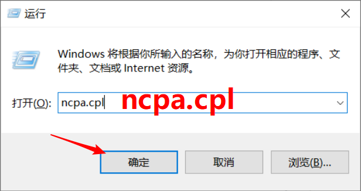

  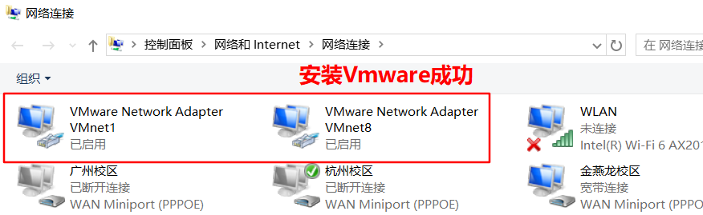

* 如果没有上述的两个网卡信息, 解决方案如下:

  1. 卸载重装Vmware软件.

  2. 可以在Vmware软件中, 重置网卡信息.

     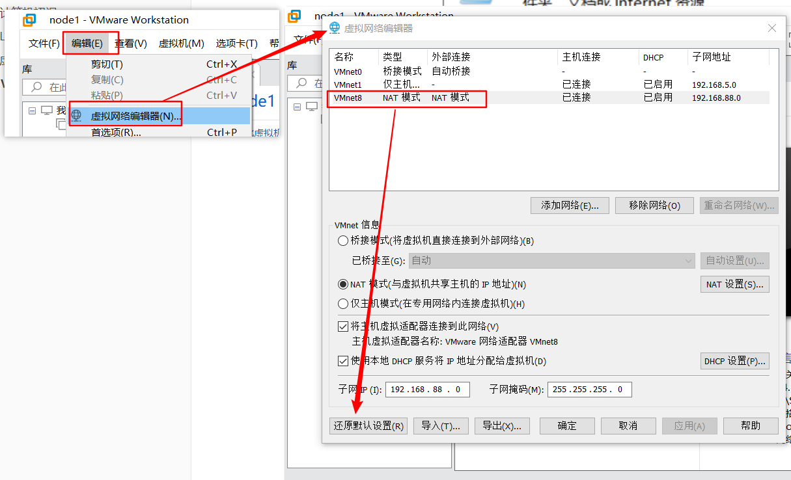


#### 5.VMware安装虚拟机(了解)

* 详见安装文档.


#### 6.VMware挂载虚拟机(掌握)

* **方式1:** 双击 *.vmx 挂载即可.

  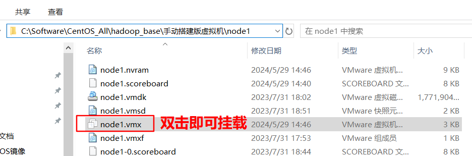

* **方式2:** 在VMware软件中直接打开.

  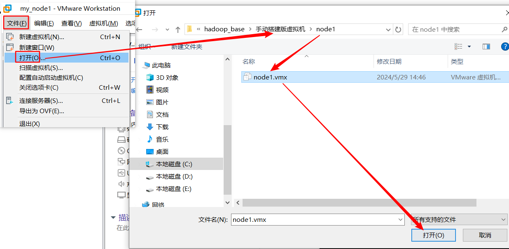

  > 细节: 首次运行, 弹框选择"**我已移动...**"


#### 7. FinalShell连接Linux虚拟机

* 安装FinalShell

  * 略, 详见安装文档.

* FinalShell连接Linux虚拟机的流图:

  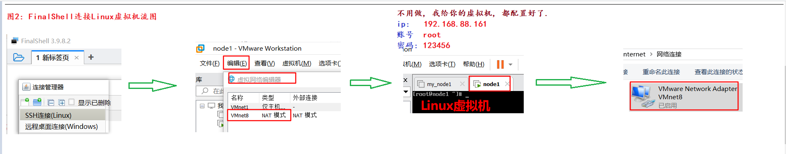

* 具体修改如下:

  * 修改VMware的信息

    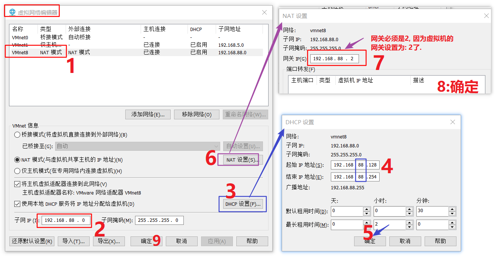

  * 修改本机VMNet8网卡信息

    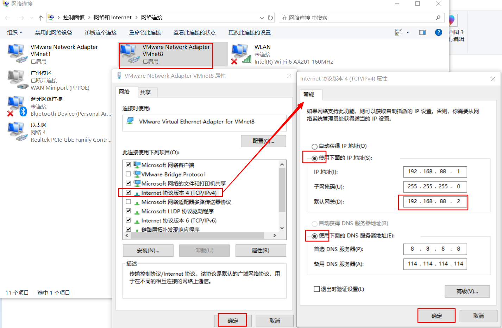

  * 修改FinalShell的连接信息.

    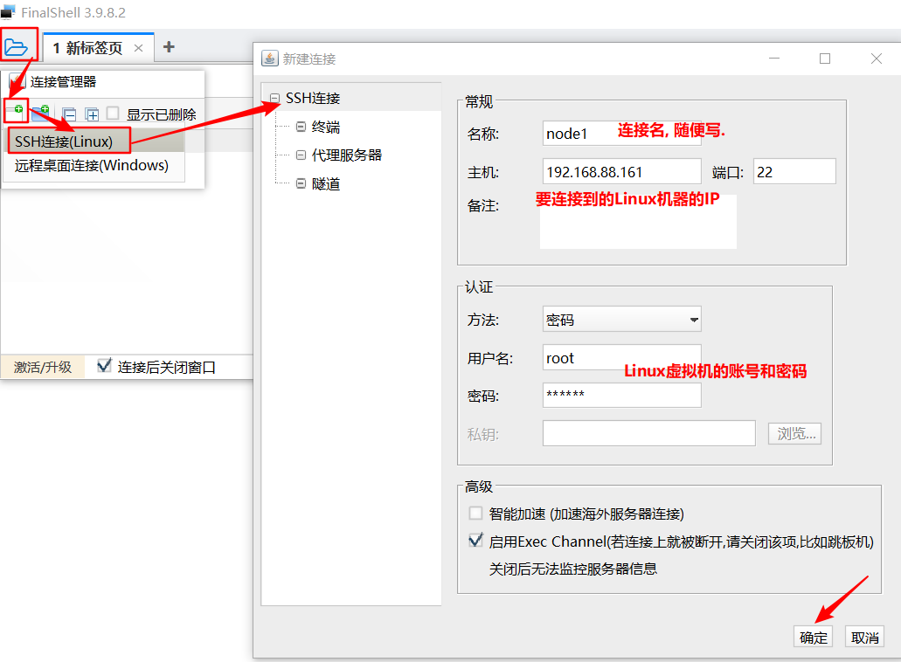

    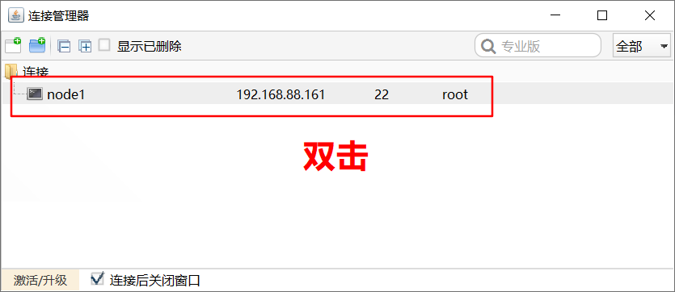

    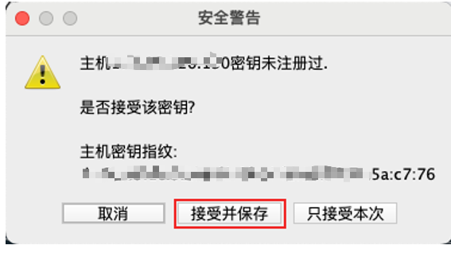

* 验证连接成功:

  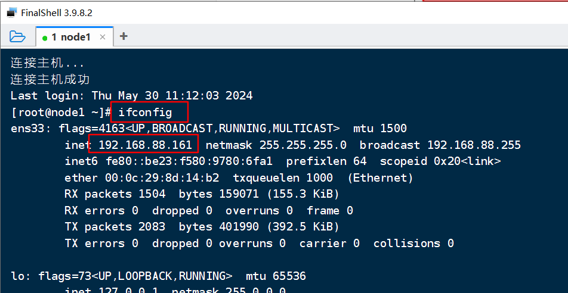


#### 8.Linux虚拟机-快照管理

* **拍摄快照, 目的:**

  * 提高容错率.

* 操作步骤:

  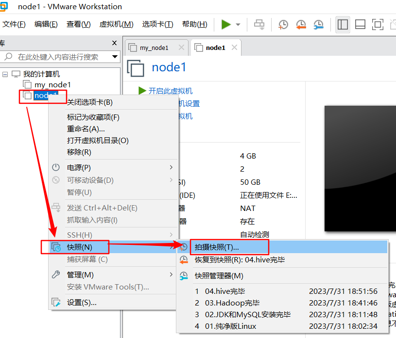


#### 9.Linux的目录结构介绍

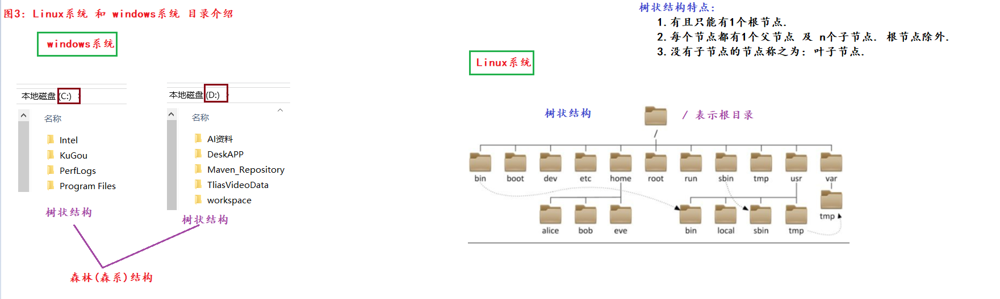


#### 10.Linux-基础命令

* Linux命令的格式

  ```sh
  # Linux命令格式, 如下的中括号表示: 可选. 
  command [-options] [parameter]		# 命令名 [-选项] [参数]
  ```


* ls命令

  ```shell
  # 来源于 list 单词, 列表的意思, 即: 查看某个路径下所有的子级(不包括子级的子级)
  # 选项介绍: all(所有),  line(行),  human(人性化)
  
  ls			# 查看当前目录的子级(不包括隐藏的), 等价于: ls ./
  ls -a		# 查看当前目录的子级(包括隐藏的)
  ls -al		# 以行的方式, 查看当前目录的子级(包括隐藏的), 无意义, 因为要结合-h一起使用.
  ls -alh		# 以行, 人性化的方式, 查看当前目录的子级(包括隐藏的)
  
  ls /		# 查看根目录下的所有子级(不包括隐藏)
  ls -l /		# 以行的方式, 查看根目录下的所有子级(不包括隐藏)
  ll /		# 效果同上, 即:  ll 等价于 ls -l
  ```

* cd命令

  ```sh
  # 来源于 change directory, 改变目录.
  cd			# 回家, 即: root账号的家目录是 /root, 其它账号的家目录是: /home
  cd /etc		# 切换到etc目录.
  
  # 几个特殊的路径.
  # 绝对路径: 以 / 开头的, 固定的, 写死的路径, 例如:  /root/aa/bb/cc
  # 相对路径: 即以当前路径来讲的, 不以/开头, 例如:  1.txt 
  ..			# 代表上1级路径.
  ../			# 效果同上.
  
  ../..		# 代表: 上上级路径.
  ./			# 代表: 当前路径.
  ~			# 代表: 家目录, 即:  cd ~  等价于 cd 命令
  -			# 代表: 在最近操作过的两个路径之间做切换. 
  ```

* pwd命令

  ```sh
  #来源于 print work directory, 打印工作目录
  pwd			# 当前在哪个目录, 就打印什么路径.
  ```

* mkdir命令

  ```sh
  # 来源于 Make Directory, 创建文件夹.
  # 格式: mkdir [-p] 目录路径		-p表示创建多级目录.
  
  # 创建 单级 目录
  mkdir ./aa			# 在当前目录下创建 aa文件夹.
  mkdir ./1.txt		# 在当前目录下创建 1.txt文件夹.
  
  mkdir aa/bb/cc		# 创建多级目录, 如果aa/bb目录不存在, 则: 报错.
  
  
  # 创建 多级 目录.
  mkdir -p aa/bb/cc	# -p表示多级目录.
  ```

* 文件相关的命令

  ```sh
  # touch, 创建文件.
  # 例如
  touch 1.txt 2.mp3 abc.jpg		# 同时创建多个文件.
  
  # cat, 来源于 catch(捕获), 查看文件中所有的内容, 如果内容较多, 则: 只显示最后1页.
  cat 文件路径
  
  # more, 可以分页查看数据. 
  more 文件路径		# d(down), 往下翻页.  b(back): 往上翻页, q(quit): 退出
  
  # cp, 来源于: copy, 拷贝文件 或者 文件夹的.
  cp 1.txt /aa			# 拷贝1.txt 到 /aa目录下.
  cp 1.txt /aa/2.txt		# 拷贝1.txt 到 /aa目录下, 并改名为 2.txt
  
  cp -r aa test			# 拷贝 aa文件夹到 test文件夹下, -r递归拷贝.
  
  # mv, 来源于: move, 剪切, 也可以改名.
  mv 1.txt 2.txt			# 改名
  
  # rm, 来源于: remove, 删除的意思, 一般结合两个参数: -r(recursive: 递归),  -f(force: 强制)
  rm -rf 1.txt		# 删除(当前目录下的)1.txt文件
  rm -rf *.txt		# 删除(当前目录下的)所有的.txt文件
  
  rm -rf aa			# 删除aa文件夹.
  
  rm -rf /			# "坐牢命令", 等价于格式化C盘. 
  rm -rf /*			# 效果同上.
  
  ```

* 查找命令相关

  ```sh
  # which命令, 查看命令所在的路径.
  which ls	# /usr/bin/
  which cd	# /usr/bin
  
  which ifconfig  # /usr/sbin/
  
  # find命令, 查找 符合条件的文件的.
  # 格式: find 路径 -name '文件名'		# 根据文件名进行查找
  find / -name 'abc*'		# 去 根目录下查找, 所有以abc开头的文件
  
  # 格式: find 路径 -size +|-数字单位	   # 根据文件大小进行查找.
  find / -size +100M		# 去 根目录下查找, 文件大小 在100MB以上的文件. 
  
  ```

* echo命令 和 重定向命令

  ```sh
  # echo命令, 类似于Python的print(), 就是打印内容到 控制台.
  echo 'hello world'
  
  # 重定向, > 是覆盖,  >> 是追加.
  echo 'hello' > 1.txt		# 把 hello 字符串, 覆盖写入到 1.txt文件中. 
  
  echo 'hello' >> 1.txt		# 把 hello 字符串, 追加写入到 1.txt文件中. 
  ```
