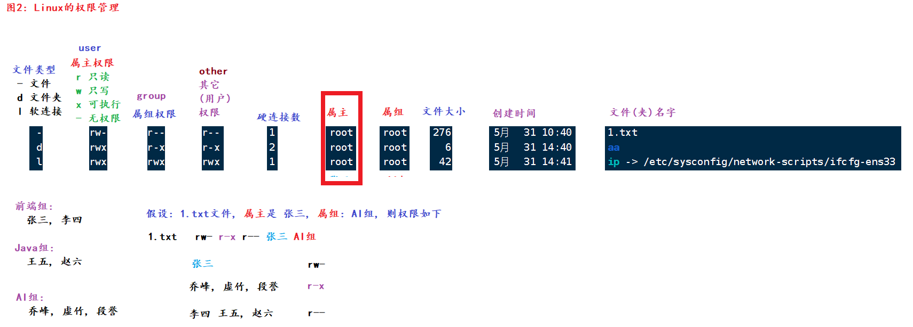
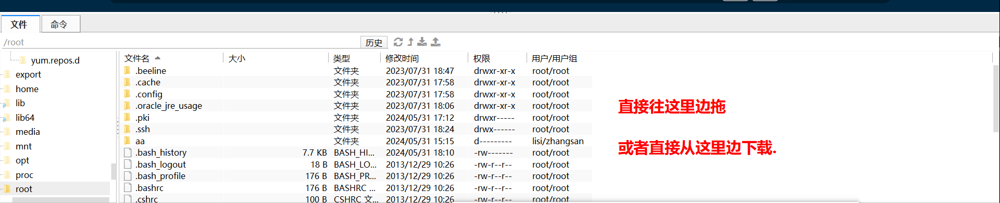

#### 今日内容大纲介绍

* vi编辑器**(重点)**
* 用户和用户组相关**(了解)**
* 权限相关**(重点)**
* Linux常用快捷键
* Linux如何安装软件**(了解)**
* 网络相关命令
* 进程相关命令
* 压缩和解压缩命令**(重点)**

---

#### 1.管道符, 统计, 过滤命令

```sh
# 准备数据
[root@node1 ~]# echo 'hello itcast python itheima' > 1.txt
[root@node1 ~]# echo 'world python itcast' >> 1.txt
[root@node1 ~]# cat 1.txt
hello itcast python itheima
world python itcast

# grep命令, 筛选符合条件的内容的.
# 格式: grep [-n] 要查找的内容 文件路径			-n: 显示行号
[root@node1 ~]# grep 'world' 1.txt
world python itcast
[root@node1 ~]# 
[root@node1 ~]# grep 'itcast' 1.txt
hello itcast python itheima
world python itcast
[root@node1 ~]# 
[root@node1 ~]# grep -n 'itcast' 1.txt
1:hello itcast python itheima
2:world python itcast
[root@node1 ~]# grep -n 'world' 1.txt
2:world python itcast

# wc命令, 来源于: wordcount, -l: 行数, -c:字节数, -w: 单词数, -m: 字符数
[root@node1 ~]# echo 'aa bbb' > 2.txt
[root@node1 ~]# wc 2.txt 		# 行数, 单词数, 字节数
1 2 7 2.txt						
[root@node1 ~]# wc -lwc 2.txt   # 效果同上, 不写默认就是: -lwc
1 2 7 2.txt
[root@node1 ~]# wc -lcw 2.txt 	# 效果同上, -lwc无顺序要求, 结果都一致.
1 2 7 2.txt
[root@node1 ~]# 

# | 管道命令, 即: 把前边命令的执行结果, 当做后边的数据源来处理.
[root@node1 ~]# ls /
bin  boot  dev  etc  export  home  lib  lib64  media  mnt  opt  proc  root  run  sbin  srv  sys  tmp  usr  var
[root@node1 ~]# 
[root@node1 ~]# ls / | wc -w
20

# 小练习, 对比.
[root@node1 ~]# cat 1.txt 			# 查看文件所有内容
hello itcast python itheima
world python itcast
[root@node1 ~]# 
[root@node1 ~]# grep 'world' 1.txt 	# 从文件中过滤出包含 world单词的所有行.
world python itcast
[root@node1 ~]# 
[root@node1 ~]# cat 1.txt | grep 'world'	# 把前边的查询结果, 当做后边的数据源来处理.
world python itcast
[root@node1 ~]# 
[root@node1 ~]# cat 1.txt | grep 'world' | wc -w	# 先查文件所有内容, 再过滤, 再统计
3
```


#### 2. 重定向, echo, tail, 反引号

```sh
# echo命令, 类似于Python的print()命令, 就是输出内容到控制台(终端)
[root@node1 ~]# echo 123
123
[root@node1 ~]# echo 'world'		# 建议: 数值直接写, 其它用单引号包裹
world

# 反引号, 可以把命令执行结果进行输出.
[root@node1 ~]# echo pwd
pwd
[root@node1 ~]# echo `pwd`		# 把反引号中的内容, 当做Linux命令来执行. 
/root

# 重定向, > 覆盖, >> 追加

# tail 查看文件末尾n行数据的, 一般用于: 查看日志.
# 格式: tail [-num -f] 要查看的文件		-num: 看(末尾)几行   -f: 持续追踪
[root@node1 ~]# tail 3.txt			# 查看文件的末尾10行(默认)数据.

[root@node1 ~]# tail -5 3.txt		# 查看文件的末尾5行数据.

[root@node1 ~]# tail -100f log.txt	# 动态查看文件的末尾的100行数据.
```


#### 3.vi命令详解

* vi解释
  * 全称叫: Visual Interface, 类似于windows的记事本, 就是用来编辑文本内容的.
  * vim是vi的升级版, 针对于文件内容(关键字), 会高亮显示.
  * 它们(vim, vi)用法都一样, 推荐使用: vim

* 入门操作**(重点)**

  

  ```sh
  # 1. 进入到 命令模式.
  vim 1.txt
  
  # 2. 进入到输入模式, 按字母 i 
  
  # 3. 正常的编辑内容.
  
  # 4. 按 esc 退出输入模式, 进入到 命令模式.
  
  # 5. 输入冒号, 进入到 底线模式.
  # 6. 输入wq, 保存退出即可.		write quit
  
  
  # 扩展: 如何修改虚拟机的IP地址.
  vim /etc/sysconfig/network-scripts/ifcfg-ens33	  # 进入修改即可.
  
  # 改完之后, 记得保存, 然后重启网卡即可.
  systemctl restart network
  ```

* 进阶操作-图解

  


#### 4.扩展_查看命令手册

* 关于我们学习的命令, 不需要每个都去背诵和记忆, 只要做好记录, 用到的时候能快速查到即可.

* 涉及到的某个命令,  如果不会了, 可以参考下手册, 命令如下:

  ```sh
  # 查看帮助文档.
  # 格式: 命令名 --help
  # 例如
  ls --help
  
  # 查看帮助手册
  # 格式: man 命令名
  # 例如
  man ls
  ```


#### 5.用户和用户组相关(了解)

* 用户组相关命令

  ```sh
  # 查看所有的用户组
  getent group
  
  # 创建用户组
  groupadd 组名
  
  # 删除用户组
  groupdel 组名
  ```

* 用户相关命令

  ```sh
  # 查看所有用户.
  getent passwd
  
  # 创建用户, -g是指定用户所在的组. 不写则默认会创建1个和该用户名一模一样的组, 然后添加用户到该组中.
  useradd [-g] [用户组] 用户名
  
  # 设置密码
  passwd 用户名
  
  # 删除用户, -r: 删除用户的同时, /home目录下 该用户的目录也同步删除.
  userdel [-r] 用户名
  
  # 查看用户信息
  id 用户名
  
  # 改变用户所在的组.
  usermod -aG 组名 用户名		# append group: 追加组
  ```

* 切换用户, "临时"借调权限相关命令

  ```sh
  su 用户名		# 切换用户, 来源于: switch user, 
  			  # root -> 其它, 无需密码,  否则: 需要密码.
  			  
  sudo Linux命令	# 临时借调权限, Linux会检查 /etc/sudoerrs文件, 
  				 # 如果没有权限, 则会记录该行为到日志.  如果有权限, 则可以执行执行该命令.
  				 # 临时借调权限, 默认持续时间: 5分钟.
  ```


#### 6.权限管理

* 图解

  

* 代码实操

  ```sh
  # 修改(属主, 属组, 其它用户) 权限, 来源于: change model
  # 格式: chmod [-R] 权限 文件或者文件夹      -R: 递归, 只针对于文件夹有效. 
  
  # 例如, 了解, 实际开发不写这个. 
  chmod u=rwx,g=rx,o=x 1.txt		# 属主权限:rwx, 属组权限:r-x, 其它用户权限: --x
  chmod -x 1.txt					# 属主, 属组, 其它权限都去掉 x 权限
  chmod u+x,g-r,o=rw 1.txt		# 属主+x权限, 属组-r权限, 其它权限为: rw-
  
  
  # 为了更好的表示权限, 引入了 数字权限的概念, 我们发现权限无外乎四种, r, w, x, -
  # 分别用数字: 4 -> r,  2 -> w,  1 -> x,  0 -> - 表示
  # 它们能组合的情况如下:
  数字		对应的权限
  0			---
  1			--x
  2			-w-
  3			-wx
  4			r--
  5			r-x
  6			rw-
  7			rwx
  
  # 实际开发写法, 遇到权限问题, 犹豫不决, 直接 777 
  chmod 777 1.txt		# 俗称: 满权限.
  
  
  
  # 改变用户 和 用户组, 来源于: change owner
  # 格式:  chown [-R] [用户][:][用户组] 文件或者文件夹路径     -R: 递归, 只针对于文件夹有效. 
  chown zhangsan 1.txt	# 改变: 属主
  chown :itcast 1.txt		# 改变: 属组
  
  chown lisi:itheima 1.txt # 改变: 属主 和 属组
  chown -R zhangsan aa	# 改变: 属主, 包括子级
  
  ```


#### 7.Linux的常用快捷键

```sh
ctrl + c		# 强制结束(执行)
ctrl + L		# 清屏, 等价于: clear


ctrl + d		# 强制登出
ctrl + a		# 跳转到命令 行首
ctrl + e		# 跳转到命令 行尾
ctrl + ←		# 上一个单词
ctrl + →		# 后一个单词
history			# 查看历史命令
!命令名		  # 倒序匹配第一个能匹配上的命令, 并执行.
ctrl + r		# 搜索命令, 并执行.
```


#### 8.Linux安装软件的方式-yum

* yum方式解释

  * 它类似于: windows系统 或者 Mac系统的应用商店, 直接从中查找并进行安装.

* 格式

  ```sh
  yum [-y] [install | search | remove] 要安装的命令名
  
  # 格式解释:
  yum			# 命令名
  -y			# 可选项, 表示在安装过程中, 只要询问, 默认输入: yes
  install		# 安装
  search		# 查找并安装.
  remove		# 卸载(移除)
  ```

* 实例

  ```sh
  # 安装 wget 命令, 可以联网下载资源
  yum -y install wget
  
  # wget命令的用法
  # 格式: wget url地址
  wget https://img.zjol.com.cn/mlf/dzw/zjczw/gun/202011/W020201118626559068829.jpeg
  ```


#### 9.systemctl-系统管理命令

```sh
# 格式
systemctl [start | stop | status | disable | enable | restart] 服务名

# 常用的服务
NetworkManager			# 主网络服务
network					# 副网络服务
firewalld				# 防火墙
sshd					# 远程连接服务

# 实例
systemctl status firewalld

# 如果你的虚拟机IP之前好好的, 没做任何修改, 突然变成了127.0.0.1, 解决方案为:
systemctl stop NetworkManager
systemctl disable NetworkManager
systemctl restart network
ifconfig
```


#### 10.软连接 和 硬链接

```sh
# 软连接, 类似于windows的快捷方式. 
# 格式: ln -s 要被连接的文件路径 软连接名
[root@node1 ~]# ln -s /etc/sysconfig/network-scripts/ifcfg-ens33 ip
[root@node1 ~]# 
[root@node1 ~]# ll
总用量 92
-rwxr-x--x 1 zhangsan itheima   276 5月  31 10:40 1.txt
d--------- 3 lisi     itheima    16 5月  31 15:15 aa
lrwxrwxrwx 1 root     root       42 5月  31 16:50 ip -> /etc/sysconfig/network-scripts/ifcfg-ens33
-rw-r--r-- 1 root     root    88048 11月 19 2020 W020201118626559068829.jpeg


# 硬链接, 类似于 动态备份(修改a.txt, c.txt也会同步变化)
# 格式: ln 要被连接的文件路径 硬连接名
[root@node1 ~]# ln a.txt c.txt
[root@node1 ~]# ll
总用量 104
-rw-r--r-- 2 root     root       12 5月  31 16:52 a.txt
-rw-r--r-- 1 root     root        6 5月  31 16:51 b.txt
-rw-r--r-- 2 root     root       12 5月  31 16:52 c.txt
```


#### 11.ip, 网络, 端口相关

```sh
# 查看本机ip
ifconfig

# ping命令, 测试网络是否通畅.
# 格式: ping [-c num] 要测试连接的网站 或者 ip
# 例如
ping www.baidu.com		# 一直ping, 一直发包.
ping -c 3 www.baidu.com	# 只发送3个包, 只测试3次.


# wget命令, 可以根据url地址, 联网下载资源
# 格式: wget url地址
# 例如
wget https://img.zjol.com.cn/mlf/dzw/zjczw/gun/202011/W020201118626559068829.jpeg


# curl命令, 可以模拟浏览器, 向URL地址发出请求, 获取响应信息.
curl https://ai.itheima.com/


# IP地址, 设备在网络中的唯一标识.
# 端口号, 程序在设备上的唯一标识, Linux系统端口号范围: 0 ~ 65535, 
# 其中0 ~ 1023已经被用作系统端口 或者 保留端口了, 我们自定义端口的时候, 尽量规避这个范围.
# 格式
netstat -anp					# 查看本机所有端口号, 来源: all network port

netstat -anp | grep 3306		# 查看3306端口号占用情况.
```


#### 12.进程相关

```sh
# 进程: 指的是可执行程序, 文件. 
ps -ef		# 查看本机运行的所有进程.

ps -ef | grep mysql	# 查看本机和MySQL相关的进程.

# 强制关闭进程
kill -9 进程的pid		# 根据pid值, 强制杀死进程. 
```


#### 13.上传和下载




#### 14.压缩和解压缩

```sh
# 区分压缩协议好坏, 可以参考三个维度: 压缩速度(写), 解压速度(读). 压缩后文件占比
# tarball: 归档操作.
# 压缩 格式,  z: gzip协议,  c: 创建,  v: 显示过程.  f: 文件
tar -cvf 压缩包名.tar 要被压缩的文件1 文件2 文件夹...  		# 只归档(多个文件 -> 1个文件), 不压缩
tar -zcvf 压缩包名.tar.gz 要被压缩的文件1 文件2 文件夹...  	# 采用tarball + gzip协议, 文件较小.

# 例如:
tar -zcvf 1.txt 2.txt 3.txt my.tar.gz


# 解压, x: 解压缩
tar -xvf 压缩包名.tar [-C] [解压到的路径]		    # 不写-C就默认解压到当前路径.
tar -zxvf 压缩包名.tar.gz [-C] [解压到的路径]		# 不写-C就默认解压到当前路径.

# 例如:
tar -zxvf my2.tar.gz -C aa	  # 把压缩包my2解压到 aa文件夹.

# zip协议
```


