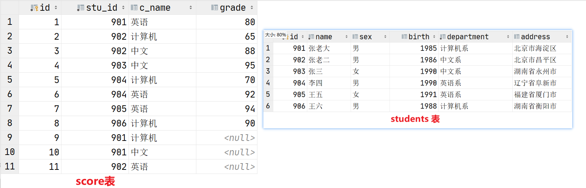

### 题目1（简答题）

题干：列举常见关系型数据库。

##### 参考答案 

```
oracle 银行,电信等项目
ms sql server：在微软的项目中使用
sqlite：轻量级数据库，主要应用在移动平台
mysql：web时代使用最广泛的关系型数据库
```

### 题目2（简答题）

题干：

1. 数据库中常用字段类型有哪些？
2. MySQL数据类型和Python类型有什么区别?

##### 参考答案：

```javascript
1.整数类型、浮点类型、字符串类型、枚举类型、日期类型
2.相同点: MySQL和Python都支持多种数据类型.
不同点: Python基本数据类型有数字int、布尔值bool、字符串str、列表list、元组tuple、字典dict等;
```

### 题目3（简答题）

题干：

1. 什么是约束？
2. 常见的约束有那些

##### 参考答案 

```html
1.约束是指数据在数据类型限定的基础上额外增加的要求.
2.主键 primary key: 物理上存储的顺序. MySQL 建议所有表的主键字段都叫 id, 类型为 int unsigned.
非空 not null: 此字段不允许填写空值.
惟一 unique: 此字段的值不允许重复.
默认 default: 当不填写字段对应的值会使用默认值，如果填写时以填写为准.
外键 foreign key: 对关系字段进行约束, 当为关系字段填写值时, 会到关联的表中查询此值是否存在, 如果存在则填写成功, 如果不存在则填写失败并抛出异常.
```

### 题目4（简答题）

题干：

1. 如何在终端查询所有数据库？
2. 如何创建一个名为chuanzhi的新数据库？

##### 参考答案 

```
1.show databases;
2.create database chuanzhi charset=utf8;
```

### 题目5（简答题）

题干： 

1. 如何查看user表中的数据？
2. 如何向user表中插入数据？请写出他的格式？

##### 考察知识点：

操作数据库表

##### 参考答案：

```
1.select * from 表名;
2.insert into 表名 values (字段1，字段2，字段3，，，，)
```

### 题目6（实操题）

题干：

1. 登录 mysql 然后创建一个名为py2888 数据库

2. 然后在这个数据库下创建一个 职工表worker(工号id,姓名name,能力值 level<整数>,所属部门dep_id）

3. 创建一个 部门表department(部门编号id,部门名称name,主管工号mid)

4. 现有职工数据如下  请使用 insert 语句插入到worker表中

   (1,'黄蓉',80,100),(2,'东邪',95,100),(3,'梅超风',90,100);

5. 现有职工数据如下  请使用 insert 语句插入到worker表中 

   ('尹志平',67,200),('丘处机',85,200),('周伯通',93,200);

6. 现有部门数据如下  请使用 insert 语句插入到departmen表中

​       (100, '桃花岛'),(200, '全真教');

7. 求出所有 职工中 能力值高于70的人的信息
8. 求出所有 职工中 能力值前三甲的人的信息
9. 求出所有 职工的 平均能力值
10. 使用 SQL 语句将 东邪  设置为桃花岛组的主管
11. 使用 SQL 语句将 丘处机设置为全真教组的主管

##### 考察知识点：

创建数据库、表格、聚合函数

##### 参考答案

```sql
-- 1 mysql -uroot -pmysql
create database py2888 charset=utf8;

-- 2 建职工表
-- 先切换数据库  不然表不知道保存到哪儿就会报错
use py2888;
create table worker(
id int unsigned primary key auto_increment,
name varchar(32) not null,
level tinyint unsigned default 0,
dep_ip int unsigned 
);

-- 3  建部门表
create table department(
id int unsigned primary key auto_increment,
name varchar(32) not null,
mid int unsigned   
);

-- 4 全列插入数据 可以省略 字段名
insert into worker values (1,'黄蓉',80,100),(2,'东邪',95,100),(3,'梅超风',90,100);

-- 5 部分列插入数据
insert into worker(name,level,dep_id) values ('尹志平',67,200),('丘处机',85,200),('周伯通',93,200);

-- 6 部分列插入数据
insert into department(id,name) values (100,'桃花岛'),(200, '全真教');

-- 7 用where条件对整个表中数据进行筛选
select * from worker where level > 70;

-- 8 先对整个员工表武力值降序排序 然后分页取前三
select * 
	from worker 
	order by level DESC
	limit 3;
-- 9 
select avg(level) from worker;
-- 10 东邪的用户 id 为 2 只需要将部门中主管 mid设置为 2 即可
update department set mid = 2 where id = 100;

-- 11 丘处机的用户 id 为 5, 只需要将部门中主管 mid设置为 5 即可
update department set mid = 5 where id = 200;
```

### 题目7（实操题）

题干：

1. 创建 公司 数据库 字符集 utf-8

2. 建立部门表,包含下列字段 
   部门编号 ： 整型，主键自动增长
   部门名称 ： 字符型 长度 20

3. 建立员工表，包含下列字段 ：
   员工编号 ： 整型，主键自动增长，
   员工姓名 ： 字符型  长度为20
   员工性别 ： 枚举类型 {‘male’，‘female’}
   员工年龄 ： 整型 
   员工工龄 ： 整型
   员工工资 ： 浮点类型，小数点保留两位
   员工部门编号：整型

4. 将以下语句插入到表格中，确保插入成功；（此题不用写答案）

   ```
   mysql> insert into t_department values(0,'人事部'),(0,'销售部'),(0,'开发部');
   
   mysql> insert into t_staff values(0,'Tom','male',25,1,4500,1),(0,'Jack','male',28,3,6500,1),(0,'Rose','female',24,1,8500,2),(0,'Alice','female',24,1,8500,2),(0,'Alex','female',26,1,8500,2),(0,'Tony','male',30,4,12000,2),(0,'Lily','female',35,7,25000,2),(0,'Lucy','female',32,4,20000,2),(0,'Rose','female',26,2,10000,3),(0,'Max','male',28,3,15000,3),(0,'Jean','female',22,1,10000,3),(0,'Kate','female',23,1,10000,3),(0,'Karry','male',42,15,50000,3),(0,'Finn','male',35,7,30000,3),(0,'Kylo','male',32,6,35000,3),(0,'Rose','female',24,1,15000,3);
   ```
   
5. 将Tony的部门调整到开发部 

6. 将工资低于10000的员工加薪1000

7. 删除工资大于30000 的员工

##### 考察知识点：

创建数据库、表格、sql更新语句、删除语句

##### 参考答案

```sql
1.mysql> create database itcast_db charset=utf8;

2.mysql> use itcast_db

mysql> create table t_department( id int(3) unsigned zerofill auto_increment primary key, name char(20) );

3.mysql> create table t_staff(
    -> id int(5) unsigned zerofill auto_increment primary key,
    -> name char(20),
    -> gender enum('male','female'),
    -> age int,
    -> working_years int,
    -> salary double(8,2),
    -> d_id int
    -> );
5.mysql> update t_staff set d_id = 3 where name = 'Tony';

6.mysql> update t_staff set salary = salary + 1000 where salary < 10000;

7.mysql> delete from t_staff where salary > 30000;
```

### 题目8（实操题）

题干：

1. 创建学生students表信息如下:（创建表格+插入数据）

| studentNo | name | sex  | hometown | age  | class_id | card |
| --------- | ---- | ---- | -------- | ---- | -------- | ---- |
|         1 | 王昭君       | 女   | 北京     |   20 |        1 | 340322199001247654 |
|         2 | 诸葛亮       | 男   | 上海     |   18 |        2 | 340322199002242354 |
|         3 | 张飞         | 男   | 南京     |   24 |        3 | 340322199003247654 |
|         4 | 白起         | 男   | 安徽     |   22 |        4 | 340322199005247654 |
|         5 | 大乔         | 女   | 天津     |   19 |        3 | 340322199004247654 |
|         6 | 孙尚香       | 女   | 河北     |   18 |        1 | 340322199006247654 |
|         7 | 百里玄策     | 男   | 山西     |   20 |        2 | 340322199007247654 |
|         8 | 小乔         | 女   | 河南     |   15 |        3 | NULL               |
|         9 | 百里守约     | 男   | 湖南     |   21 |        1 |                    |
|        10 | 妲己         | 女   | 广东     |   26 |        2 | 340322199607247654 |
|        11 | 李白         | 男   | 北京     |   30 |        4 | 340322199005267754 |
|        12 | 孙膑         | 男   | 新疆     |   26 |        3 | 340322199000297655 |
|           |      |      |          |      |          |      |

```sqlite
('王昭君', '女', '北京', 20, 1, '340322199001247654'),
('诸葛亮', '男', '上海', 18, 2, '340322199002242354'),
('张飞', '男', '南京', 24, 3, '340322199003247654'),
('白起', '男', '安徽', 22, 4, '340322199005247654'),
('大乔', '女', '天津', 19, 3, '340322199004247654'),
('孙尚香', '女', '河北', 18, 1, '340322199006247654'),
('百里玄策', '男', '山西', 20, 2, '340322199007247654'),
('小乔', '女', '河南', 15, 3, null),
('百里守约', '男', '湖南', 21, 1, ''),
('妲己', '女', '广东', 26, 2, '340322199607247654'),
('李白', '男', '北京', 30, 4, '340322199005267754'),
('孙膑', '男', '新疆', 26, 3, '340322199000297655')
```

1. 查询学生"百里守约"的基本信息
2. 查询学生"百里守约"或”百里玄策”的基本信息
3. 查询姓"张"学生的姓名，年龄，班级
4. 查询姓名中含有"约"字的学生的基本信息
5. 查询姓名长度为三个字，姓“孙”的学生的学号，姓名，年龄，班级，身份证号
6. 查询姓"百"或者姓”孙”的学生的基本信息
7. 查询姓"百"并且家乡是"山西"的学生信息
8. 查询家乡不是"北京"、"新疆"、"山东"、"上海"的学生的信息
9. 查询姓"孙"，但是家乡不是"河北"的学生信息
10. 查询家乡不是"北京"、"新疆"、"山东"、"上海"的学生的信息
11. 查询全部学生信息，并按照“性别”排序
12. 查询所有男生，并按年龄升序排序
13. 统计共有多少个学生
14. 统计年龄大于20岁的学生有多少个
15. 统计男生的平均年龄
16. 查询1班学生中的最大年龄是多少
17. 统计2班男女生各有多少人
18. 查询年龄最小的学生的全部信息

##### 考察知识点：

常见数据库

##### 参考答案 

```sql
1. create table students (
  studentNo int unsigned primary key auto_increment not null,
  name varchar(10),
  sex enum('男','女'),
  hometown varchar(20),
  age tinyint(4),
  class_id int not null,
  card varchar(20)
);

insert into students (name,sex,hometown,age,class_id,card)values
('王昭君', '女', '北京', 20, 1, '340322199001247654'),
('诸葛亮', '男', '上海', 18, 2, '340322199002242354'),
('张飞', '男', '南京', 24, 3, '340322199003247654'),
('白起', '男', '安徽', 22, 4, '340322199005247654'),
('大乔', '女', '天津', 19, 3, '340322199004247654'),
('孙尚香', '女', '河北', 18, 1, '340322199006247654'),
('百里玄策', '男', '山西', 20, 2, '340322199007247654'),
('小乔', '女', '河南', 15, 3, null),
('百里守约', '男', '湖南', 21, 1, ''),
('妲己', '女', '广东', 26, 2, '340322199607247654'),
('李白', '男', '北京', 30, 4, '340322199005267754'),
('孙膑', '男', '新疆', 26, 3, '340322199000297655');

2.select * from students where name='百里守约';

3.select * from students where name='百里守约' or name='百里玄策';

4.select name,age,class_id from students where name like '张%';

5.select * from students where name like '%约%';

6.select studentNo,name,age,class_id,card from students where name like '孙__'; 

7.select * from students where name like '百%' or name like '孙%';

8.select * from students where name like '百%' and hometown='山西';

9.select * from students where hometown in('北京','新疆','山东','上海');

10.select * from students where name like '孙%' and hometown!='河北';

11.select * from students where hometown not in('北京','新疆','山东','上海');

12.select * from students order by sex;

13.select * from students where sex='男' order by age;

14.select count(*) from students;

15.select count(*) from students where age>20;

16.select avg(age) from students where sex='男';

17.select max(age) from students where class_id=1;

18.select class_id,sex,count(*) from students where class_id=2 group by sex;

19.select * from students order by age limit 1;
```

### 题目9（简答题）

题干：接第一题：

1. 求出每个部门的  平均能力值
2. 求出部门平均值 > 40的所有部门及其相关平均能力值信息。
3. 使用连接求出所有 部门名称、主管姓名、主管能力值

##### 考察知识点：

分组、连接

##### 参考答案 

```sql
1.select dep_id, avg(level) 
	from worker 
	group by dep_id;
2.select dep_id, avg(level) 
	from worker 
	group by dep_id
	having avg(level) > 40;
3.select d.name,w.name,w.level
	from worker w 
	inner join department d
	on w.id = d.mid;
```

### 题目10（实操题）

题干：有表结构如下：



1. 针对上方的表结构，编写create table建表语句
2. 针对上方的数据要求，编写insert into语句
3. 查询student表的所有记录
4. 查询student表的第2条到4条记录
5. 从student表查询所有学生的学号（id）、姓名（name）和院系（department）的信息
6. 从student表中查询计算机系和英语系的学生的信息（写出两种答案）
7. 从student表中查询年龄18~29岁的学生信息（写出两种答案）
8. 从student表中查询每个院系有多少人
9. 从score表中查询每个科目的最高分
10. 计算每个考试科目的平均成绩
11. 将计算机考试成绩按从高到低进行排序

##### 考察知识点：

创建数据库、表格、分组聚合

##### 参考答案

```
1.create table student
(
    id int(10) primary key,
    name varchar(20) not null,
    sex varchar(4),
    birth year,
    department varchar(20) not null,
    address varchar(50)
);

create table score
(
    id int(10) primary key,
    stu_id int(10) not null,
    c_name varchar(20),
    grade int(10)
);
2.insert into student(id,name,sex,birth,department,address)
    values(901,'张老大','男',1985,'计算机系','北京市海淀区'),
        (902,'张老二','男',1986,'中文系','北京市昌平区'),
        (903,'张三','女',1990,'中文系','湖南省永州市'),
        (904,'李四','男',1990,'英语系','辽宁省阜新市'),
        (905,'王五','女',1991,'英语系','福建省厦门市'),
        (906,'王六','男',1988,'计算机系','湖南省衡阳市');
insert into score(id,stu_id,c_name,grade)
    values(1,901,'英语',80),
        (2,902,'计算机',65),
        (3,902,'中文',88),
        (4,903,'中文',95),
        (5,904,'计算机',70),
        (6,904,'英语',92),
        (7,905,'英语',94),
        (8,906,'计算机',90),
        (9,901,'计算机',null),
        (10,901,'中文',null),
        (11,902,'英语',null);

3.select * from student;
4.select * from student limit 1,3;
5.select id,name,department from student ;
6.select * from student where department='计算机系' or department ='英语系';
select * from student where department in ('英语系','计算机系');
7.select * from student where birth between (Year(curdate())-29) and (Year(curdate())-18);
select * from student where birth >= (Year(curdate())-29) and birth <= (Year(curdate())-18);
8.select count(*),department  from student group by department;
9.select max(grade),c_name from score group by c_name;
10.select avg(grade),c_name from score group by c_name;
11.select * from score where c_name = '计算机' order by grade desc;
```
