# 窗口函数

**学习目标**

- 掌握窗口函数的基本语法和OVER()的使用方法
- 掌握RANK、DENSE_RANK、ROW_NUMBER函数的使用方法
- 知道RANK、DENSE_RANK、ROW_NUMBER的不同之处
- 能够说出如何避免 SQL 注入问题

## 一、窗口函数基本用法

### 1.窗口函数简介

接下来的课程中我们来介绍**窗口函数window functions**.

- MYSQL 8.0 之后，加入了窗口函数功能，简化了数据分析工作中查询语句的书写
- 在没有窗口函数之前，我们需要通过定义临时变量和大量的子查询才能完成的工作，使用窗口函数实现起来更加简洁高效
- 窗口函数是数据分析工作中必须掌握的工具，在SQL笔试中也是高频考点
- 什么是窗口函数? 为什么说窗口函数可以使复杂的查询变得更加简单方便？

#### 1.1 什么是窗口函数

- 窗口函数是类似于可以返回聚合值的函数，例如SUM()，COUNT()，MAX()。但是窗口函数又与普通的聚合函数不同，它不会对结果进行分组，使得输出中的行数与输入中的行数相同。
- 一个窗口函数大概看起来是这样：

```sql
SELECT SUM() OVER(PARTITION BY ___ ORDER BY___) FROM Table 
```

这里有3点需要牢记：

- 聚合功能：在上述例子中，我们用了SUM()，但是你也可以用COUNT(), AVG()之类的计算功能
- PARTITION BY：你只需将它看成GROUP BY子句，但是在窗口函数中，你要写PARTITION BY
- ORDER BY：ORDER BY和普通查询语句中的ORDER BY没什么不同。注意，输出的顺序要仔细考虑

#### 1.2 窗口函数示例

示例：集合函数VS窗口函数

假设我们有如下这个表格：

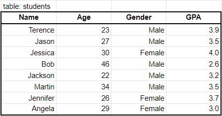

如果要按性别获取平均GPA，可以使用聚合函数并运行以下查询：

```sql
SELECT Gender, AVG(GPA) as avg_gpa FROM students GROUP BY Gender
```

结果如下：

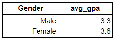

现在我们想得到如下结果：

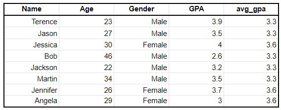

我们当然可以用我们刚刚提到的聚合函数，然后再将结果join到初始表，但这需要两个步骤。但如果我们使用窗口函数，我们则可以一步到位，并得到相同的结果：

```sql
SELECT *, AVG(GPA) OVER (PARTITION BY Gender) as avg_gpa FROM students 
```

通过上面的查询，就按性别对数据进行划分，并计算每种性别的平均GPA。然后，它将创建一个称为`avg_gpa`的新列，并为每行附加关联的平均GPA

#### 1.3 窗口函数的优点

- 简单，窗口函数更易于使用。在上面的示例中，与使用聚合函数然后合并结果相比，使用窗口函数仅需要一行就可以获得所需要的结果。
- 快速，这一点与上一点相关，使用窗口函数比使用替代方法要快得多。当你处理成百上千个千兆字节的数据时，这非常有用。
- 多功能性，最重要的是，窗口函数具有多种功能，比如，添加移动平均线，添加行号和滞后数据，等等。

### 2. 数据集准备

- 本节我们先介绍窗口函数中最重要的关键字 OVER
- 在介绍具体内容之前先熟悉一下要用到的数据，我们选择了很常见的业务来介绍窗口函数的使用
- 三张表：员工表，部门表，采购表
- 员工表：员工id，姓名，员工所属部门id（`department_id`），工资（`salary`），工龄（`years_worked`)
- 部门表：部门id，部门名称
- 采购表：每个部门（`department_id`）采购的物品明细（`item`)，物品价格（`price`）

#### 2.1 创建数据库

```sql
create database ai charset=utf8;
use ai;
```

#### 2.2 employee员工信息表

- 建表 employee

```sql
create table employee(
    id int unsigned primary key not null,
    first_name varchar(20) not null,
    last_name varchar(30) not null,
    department_id  tinyint not null,
    salary int not null,
    years_worked  tinyint not null
);
```

- 写入数据

```python
insert into employee values
(1, 'Diane', 'Turner', 1, 5330, 4),
(2, 'Clarence', 'Robinson', 1, 3617, 2),
(3, 'Eugene', 'Phillips', 1, 4877, 2),
(4, 'Philip', 'Mitchell', 1, 5259, 3),
(5, 'Ann', 'Wright', 2, 2094, 5),
(6, 'Charles', 'Wilson', 2, 5167, 5),
(7, 'Russell', 'Johnson', 2, 3762, 4),
(8, 'Jacqueline', 'Cook', 2, 6923, 3),
(9, 'Larry', 'Lee', 3, 2796, 4),
(10, 'Willie', 'Patterson', 3, 4771, 5),
(11, 'Janet', 'Ramirez', 3, 3782, 2),
(12, 'Doris', 'Bryant', 3, 6419, 1),
(13, 'Amy', 'Williams', 3, 6261, 1),
(14, 'Keith', 'Scott', 3, 4928, 8),
(15, 'Karen', 'Morris', 4, 6347, 6),
(16, 'Kathy', 'Sanders', 4, 6286, 1),
(17, 'Joe', 'Thompson', 5, 5639, 3),
(18, 'Barbara', 'Clark', 5, 3232, 1),
(19, 'Todd', 'Bell', 5, 4653, 1),
(20, 'Ronald', 'Butler', 5, 2076, 5)
;
```

- employee员工信息表字段说明
- id 员工id
- first_name 员工名字
- last_name 员工的姓
- department_id 员工所属部门id
- salary 员工工资
- years_worked 工龄

#### 2.3 department部门信息表[¶](#23-department)

- 建表 department

```python
create table department(
    id int unsigned primary key not null,
    name varchar(30) not null
);
```

- 写入数据

```python
insert into department values
(1, 'IT'),
(2, 'Management'),
(3, 'Human Resources'),
(4, 'Accounting'),
(5, 'Help Desk')
;
```

- department部门信息表字段说明
- id 部门id
- name 部门名称

#### 2.4 purchase采购信息表

- 建表 purchase

```python
create table purchase(
    id int unsigned primary key not null,
    department_id tinyint not null,
    item varchar(30) not null,
    price int not null
);
```

- 写入数据

```python
insert into purchase values
(1, 4, 'monitor', 531),
(2, 1, 'printer', 315),
(3, 3, 'whiteboard', 170),
(4, 5, 'training', 117),
(5, 3, 'computer', 2190),
(6, 1, 'monitor', 418),
(7, 3, 'whiteboard', 120),
(8, 3, 'monitor', 388),
(9, 5, 'paper', 37),
(10, 1, 'paper', 695),
(11, 3, 'projector', 407),
(12, 4, 'garden party', 986),
(13, 5, 'projector', 481),
(14, 2, 'chair', 180),
(15, 2, 'desk', 854),
(16, 2, 'post-it', 15),
(17, 3, 'paper', 60),
(18, 2, 'tv', 943),
(19, 2, 'desk', 478),
(20, 5, 'keyboard', 214)
;
```

- purchase采购信息表字段说明
- id 采购信息id
- department_id 进行采购的部门id
- item 采购物品名称
- price 采购物品价格

#### 2.5 所有表字段信息及逻辑关联关系

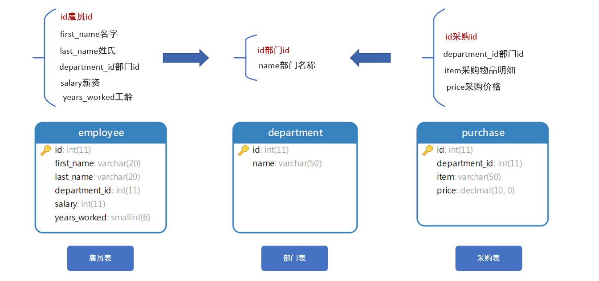

### 3.数据集介绍

本小结我们先介绍窗口函数中最重要的关键字 OVER()

在介绍具体内容之前先熟悉一下要用到的数据，我们选择了很常见的业务来介绍窗口函数的使用

三张表：员工表，部门表，采购表

- 员工表：员工id，姓名，员工所属部门id（`department_id`），工资（`salary`），工龄（`years_worked`)
- 部门表：部门id，部门名称
- 采购表：每个部门（`department_id`）采购的物品明细（`item`)，物品价格（`price`）

**员工表（employee）**

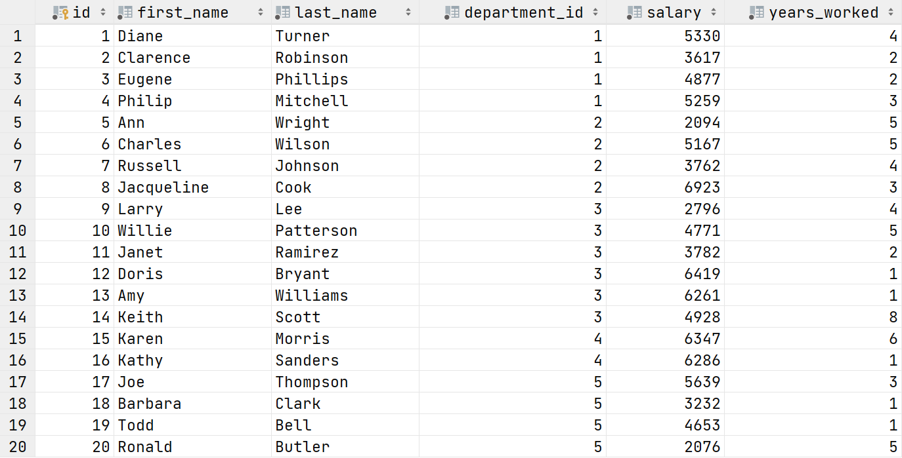

**部门表（DEPARTMENT）**

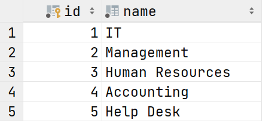

**采购表（purchase)**

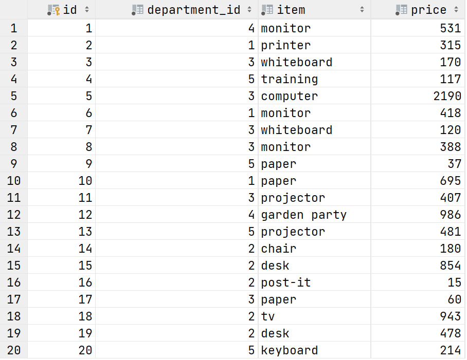

要用到的数据已经熟悉了，接下来我们使用上面的数据来介绍窗口函数

- 窗口函数是对表中**一组数据**进行计算的函数，**一组数据**跟当前行相关
- 例如：想计算每三天的销售总金额，就可以使用窗口函数，以当前行为基准，选前一行，后一行，三行一组如下图所示。之所以称之为窗口函数，是因为好像有一个固定大小的窗框划过数据集，滑动一次取一次，对窗口内的数据进行处理

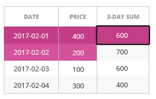

- 看下窗口函数的语法：

```sql
<window_function> OVER (...)

<window_function> 这里可以是我们之前已经学过的聚合函数，比如（COUNT(), SUM(), AVG()等等）
也以是其他函数，比如ranking 排序函数，分析函数等，后面的课程中会介绍
OVER(...)  窗口函数的窗框通过OVER(...)子句定义，窗口函数中很重要的部分就是通过OVER(...)  定义窗框 (开窗方式和大小)
```

### 4.OVER()基本用法

- 首先看`OVER (...)` 的最基本用法： `OVER()` 意思是所有的数据都在窗口中，看下面的SQL

```sql
SELECT
  first_name,
  last_name,
  salary,  
  AVG(salary) OVER()
FROM employee;
```

- SQL并不复杂，主要看跟 `OVER()` 相关的部分

```sql
AVG(salary) OVER()
```

- `AVG(salary)` 意思是要计算平均工资，加上 `OVER()` 意味着对全部数据进行计算，并将平均值添加到每行记录的后面
- 需要注意的是，我们没有使用`GROUP BY`进行分组，这样在查询结果中除了聚合函数的结果之外，我们还可以显示其他数据
- 如果使用`GROUP BY` 想将聚合结果与原始数据放到一个结果中，需要使用子查询，效率相对低

**练习1**

- 需求：创建报表，除了查询每个人的工资之外，还要统计出公司每月的工资支出

```sql
SELECT
  first_name,
  last_name,
  salary,  
  SUM(salary) OVER()
FROM employee;
```

**查询结果**

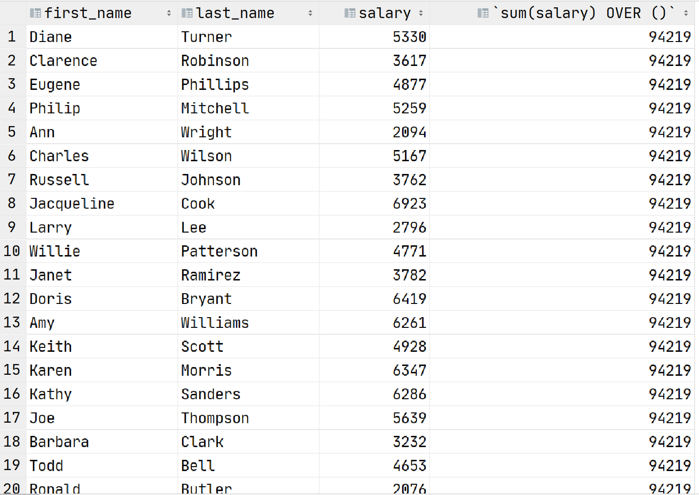

**练习2**

- 需求：统计采购表中的平均采购价格，并与明细一起显示（每件物品名称，价格）

```sql
SELECT
  item,
  price,
  AVG(price) OVER()
FROM purchase;
```

**查询结果**

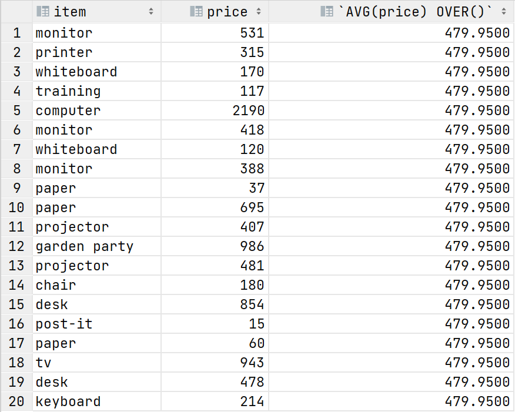

### 5. 将OVER()的结果用于进一步计算

- 通常，`OVER()`用于将当前行与一个聚合值进行比较，例如，我们可以计算出员工的薪水和平均薪水之间的差。

```sql
SELECT
  first_name,
  last_name,
  salary,
  AVG(salary) OVER(),
  salary - AVG(salary) OVER() as difference
FROM employee;
```

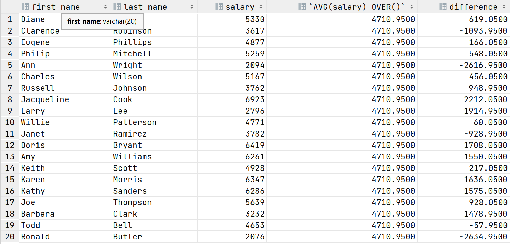

- 上面查询结果的最后一列显示了每名员工的工资和平均工资之间的差额，这就是**窗口函数的典型应用场景：将当前行与一组数据的聚合值进行比较**

**练习3**

- 需求：创建报表统计每个员工的工龄和平均工龄之间的差值
- 报表中包含如下字段：
- 员工的名字，员工的姓氏，员工的工龄，所有员工的平均工龄，员工工龄和平均工龄之间的差值

```sql
SELECT
  first_name,
  last_name,
  years_worked,
  AVG(years_worked) OVER() AS avg,
  years_worked - AVG(years_worked) OVER() AS difference
FROM employee;
```

**查询结果：**

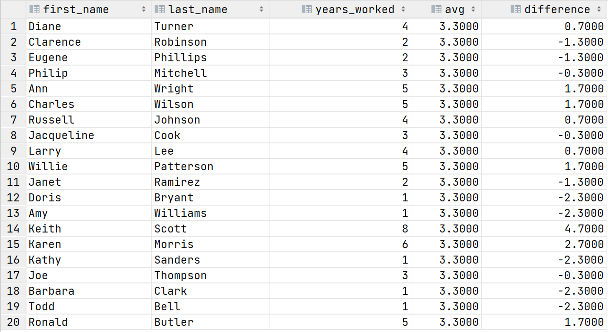

**练习4**

- 我们看下面的例子：

```sql
SELECT
  id,
  item,
  price,
  price / SUM(price) OVER()
FROM purchase
WHERE department_id = 2;
```

**查询结果**

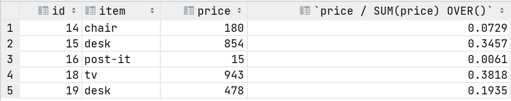

- 在上面的SQL中，我们查询了id为2的部门所采购的所有商品，并将计算了每项支出占总采购金额的占比
- 需求：统计人力资源部（部门ID为3） 的员工薪资，并将每名员工的薪资与部门平均薪资进行比较
- `first_name`，`last_name`，`salary` 和 `difference`（员工薪资与部门平均薪资的差值）

```sql
select 
  first_name,
  last_name,
  salary,
  salary-AVG(salary) over() as difference
  from employee
  where department_id = 3
```

**查询结果**

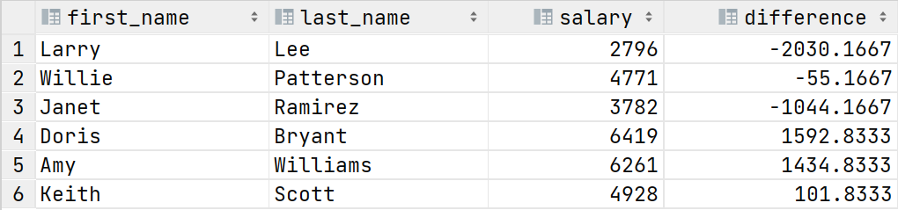

### 6.OVER()和COUNT()组合[¶](#6overcount)

- 接下来我们看一下， `OVER()` 与 `COUNT()` 如何组合使用

```sql
SELECT 
  id, 
  name, 
  COUNT(id) OVER()
FROM department
ORDER BY name;
```

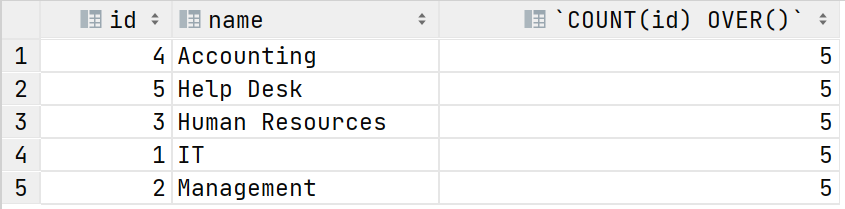

- 在上面的SQL中，我们查询出每个部门的 `id` 和 `name` 部门名称，以及所有部门的数量，最后通过部门名字排序

**练习5**

- 需求：查询月薪超过4000的员工，并统计所有月薪超过4000的员工数量
- 查询结果字段：`first_name`, `last_name`, `salary` 和 超过4000的员工数量

```sql
SELECT
  first_name,
  last_name,
  salary,
  COUNT(id) OVER()
FROM employee
WHERE salary > 4000;
```

**查询结果：**

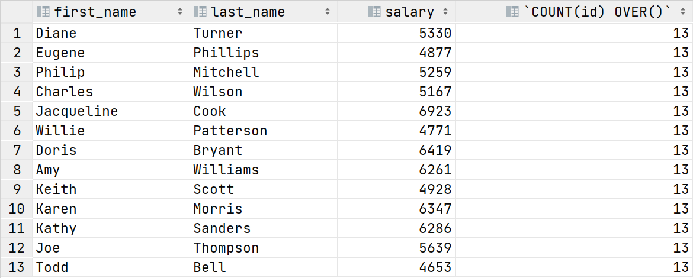

### 7.小结[¶](#7)

- 可以使用 OVER()，对全部查询结果进行聚合计算
- 在WHERE条件执行之后，才会执行窗口函数
- 窗口函数在执行聚合计算的同时还可以保留每行的其它原始信息
- 不能在WHERE子句中使用窗口函数

## 二、排序函数和窗口配合使用[¶](#_2)

到目前为止，我们已经介绍了如何在窗口函数中使用聚合计算函数`SUM()`, `COUNT()`, `AVG()`, `MAX()` 和 `MIN()`

接下来，我们将学习如何通过窗口函数实现排序，具体语法如下：

```sql
<ranking function> OVER (ORDER BY <order by columns>)
```

在后面的练习中我们会介绍常用的排序函数

### 1. 数据集准备与介绍

#### 1.1 数据集准备

创建game表

```sql
CREATE TABLE game  (
  id int(11) NOT NULL,
  name varchar(100) NULL DEFAULT NULL,
  platform varchar(20) NULL DEFAULT NULL,
  genre varchar(20) NULL DEFAULT NULL,
  editor_rating smallint(6) NULL DEFAULT NULL,
  size int(11) NULL DEFAULT NULL,
  released date NULL DEFAULT NULL,
  updated date NULL DEFAULT NULL,
  PRIMARY KEY (id) USING BTREE
);
```

插入game表数据

```sql
INSERT INTO game VALUES (1, 'Go Bunny', 'iOS', 'action', 5, 101, '2015-05-01', '2015-07-13');
INSERT INTO game VALUES (2, 'Fire Rescue', 'iOS', 'action', 9, 36, '2015-07-30', '2016-09-27');
INSERT INTO game VALUES (3, 'Eternal Stone', 'iOS', 'adventure', 10, 125, '2015-03-20', '2015-10-25');
INSERT INTO game VALUES (4, 'Froggy Adventure', 'iOS', 'adventure', 7, 127, '2015-05-01', '2015-07-02');
INSERT INTO game VALUES (5, 'Speed Race', 'iOS', 'racing', 7, 127, '2015-03-20', '2015-07-25');
INSERT INTO game VALUES (6, 'Monsters in Dungeon', 'Android', 'adventure', 9, 10, '2015-12-01', '2015-12-15');
INSERT INTO game VALUES (7, 'Shoot in Time', 'Android', 'shooting', 9, 123, '2015-12-01', '2016-03-20');
INSERT INTO game VALUES (8, 'Hit Brick', 'Android', 'action', 4, 54, '2015-05-01', '2016-01-05');
INSERT INTO game VALUES (9, 'The Square', 'Android', 'action', 4, 86, '2015-12-01', '2016-03-16');
INSERT INTO game VALUES (10, 'Duck Dash', 'Android', 'shooting', 4, 36, '2015-07-30', '2016-05-23');
INSERT INTO game VALUES (11, 'Perfect Time', 'Windows Phone', 'action', 6, 55, '2015-12-01', '2016-01-07');
INSERT INTO game VALUES (12, 'First Finish', 'Windows Phone', 'racing', 7, 44, '2015-10-01', '2016-02-20');
```

创建game_purchase表

```sql
CREATE TABLE game_purchase  (
  id int(11) NOT NULL,
  game_id int(11) NULL DEFAULT NULL,
  price decimal(10, 2) NULL DEFAULT NULL,
  date date NULL DEFAULT NULL,
  PRIMARY KEY (id) USING BTREE
);
```

插入game_purchase表数据

```sql
INSERT INTO game_purchase VALUES (1, 7, 15.99, '2016-03-07');
INSERT INTO game_purchase VALUES (2, 12, 13.99, '2016-08-13');
INSERT INTO game_purchase VALUES (3, 6, 11.99, '2016-01-21');
INSERT INTO game_purchase VALUES (4, 11, 7.99, '2016-10-21');
INSERT INTO game_purchase VALUES (5, 4, 12.99, '2016-05-03');
INSERT INTO game_purchase VALUES (6, 2, 1.99, '2016-07-08');
INSERT INTO game_purchase VALUES (7, 2, 5.99, '2016-03-29');
INSERT INTO game_purchase VALUES (8, 10, 18.99, '2016-01-05');
INSERT INTO game_purchase VALUES (9, 8, 3.99, '2016-07-18');
INSERT INTO game_purchase VALUES (10, 4, 7.99, '2016-06-04');
INSERT INTO game_purchase VALUES (11, 12, 14.99, '2016-10-16');
INSERT INTO game_purchase VALUES (12, 10, 15.99, '2016-08-23');
INSERT INTO game_purchase VALUES (13, 5, 13.99, '2016-09-20');
INSERT INTO game_purchase VALUES (14, 9, 14.99, '2016-07-17');
INSERT INTO game_purchase VALUES (15, 10, 10.99, '2016-06-07');
INSERT INTO game_purchase VALUES (16, 2, 1.99, '2016-06-09');
INSERT INTO game_purchase VALUES (17, 8, 8.99, '2016-04-13');
INSERT INTO game_purchase VALUES (18, 1, 6.99, '2016-01-12');
INSERT INTO game_purchase VALUES (19, 2, 3.99, '2016-06-18');
INSERT INTO game_purchase VALUES (20, 6, 19.99, '2016-08-07');
INSERT INTO game_purchase VALUES (21, 6, 7.99, '2016-04-06');
INSERT INTO game_purchase VALUES (22, 12, 5.99, '2016-07-24');
INSERT INTO game_purchase VALUES (23, 2, 10.99, '2016-08-05');
INSERT INTO game_purchase VALUES (24, 12, 16.99, '2016-07-21');
INSERT INTO game_purchase VALUES (25, 9, 4.99, '2016-10-05');
INSERT INTO game_purchase VALUES (26, 8, 11.99, '2016-02-27');
INSERT INTO game_purchase VALUES (27, 12, 15.99, '2016-05-26');
INSERT INTO game_purchase VALUES (28, 3, 17.99, '2016-01-30');
INSERT INTO game_purchase VALUES (29, 9, 7.99, '2016-01-21');
INSERT INTO game_purchase VALUES (30, 8, 19.99, '2016-06-28');
INSERT INTO game_purchase VALUES (31, 2, 7.99, '2016-07-09');
INSERT INTO game_purchase VALUES (32, 9, 1.99, '2016-10-14');
INSERT INTO game_purchase VALUES (33, 5, 15.99, '2016-07-04');
INSERT INTO game_purchase VALUES (34, 4, 19.99, '2016-01-27');
INSERT INTO game_purchase VALUES (35, 5, 14.99, '2016-04-06');
INSERT INTO game_purchase VALUES (36, 4, 13.99, '2016-03-27');
INSERT INTO game_purchase VALUES (37, 5, 12.99, '2016-07-19');
INSERT INTO game_purchase VALUES (38, 12, 7.99, '2016-06-20');
INSERT INTO game_purchase VALUES (39, 11, 4.99, '2016-01-02');
INSERT INTO game_purchase VALUES (40, 1, 8.99, '2016-08-17');
INSERT INTO game_purchase VALUES (41, 4, 18.99, '2016-06-02');
INSERT INTO game_purchase VALUES (42, 8, 7.99, '2016-04-20');
INSERT INTO game_purchase VALUES (43, 5, 14.99, '2016-06-05');
INSERT INTO game_purchase VALUES (44, 2, 7.99, '2016-04-08');
INSERT INTO game_purchase VALUES (45, 8, 17.99, '2016-06-03');
INSERT INTO game_purchase VALUES (46, 6, 16.99, '2016-10-10');
INSERT INTO game_purchase VALUES (47, 3, 13.99, '2016-10-04');
INSERT INTO game_purchase VALUES (48, 1, 9.99, '2016-09-29');
INSERT INTO game_purchase VALUES (49, 3, 9.99, '2016-03-25');
INSERT INTO game_purchase VALUES (50, 7, 13.99, '2016-02-01');
INSERT INTO game_purchase VALUES (51, 4, 15.99, '2016-08-29');
INSERT INTO game_purchase VALUES (52, 3, 9.99, '2016-03-13');
INSERT INTO game_purchase VALUES (53, 6, 14.99, '2016-04-29');
INSERT INTO game_purchase VALUES (54, 12, 6.99, '2016-05-09');
INSERT INTO game_purchase VALUES (55, 9, 14.99, '2016-06-07');
INSERT INTO game_purchase VALUES (56, 8, 18.99, '2016-09-24');
INSERT INTO game_purchase VALUES (57, 6, 8.99, '2016-10-30');
INSERT INTO game_purchase VALUES (58, 11, 4.99, '2016-05-11');
INSERT INTO game_purchase VALUES (59, 2, 8.99, '2016-08-22');
INSERT INTO game_purchase VALUES (60, 9, 2.99, '2016-03-24');
```

**game表**

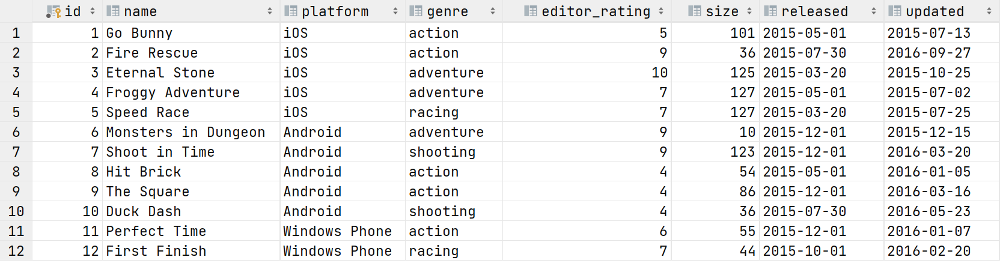

**game_purchase表**

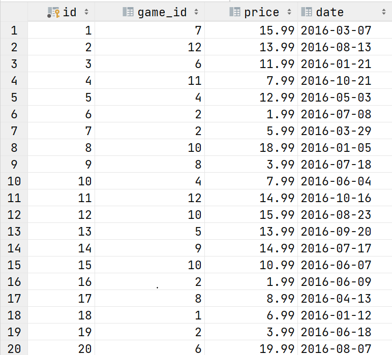

#### 1.2 所有表字段信息及逻辑关联关系[¶](#12_1)

- game游戏信息表
- id 游戏的id
- name 游戏名字
- platform 游戏平台，安卓IOS等
- genre 游戏题材种类
- editor_rating 评分
- size 游戏应用程序的大小
- released 游戏发布时间
- updated 最后更新时间
- game_purchase游戏销售表
- id 当次销售的编号
- game_id 游戏的id
- price 销售金额
- date 销售日期

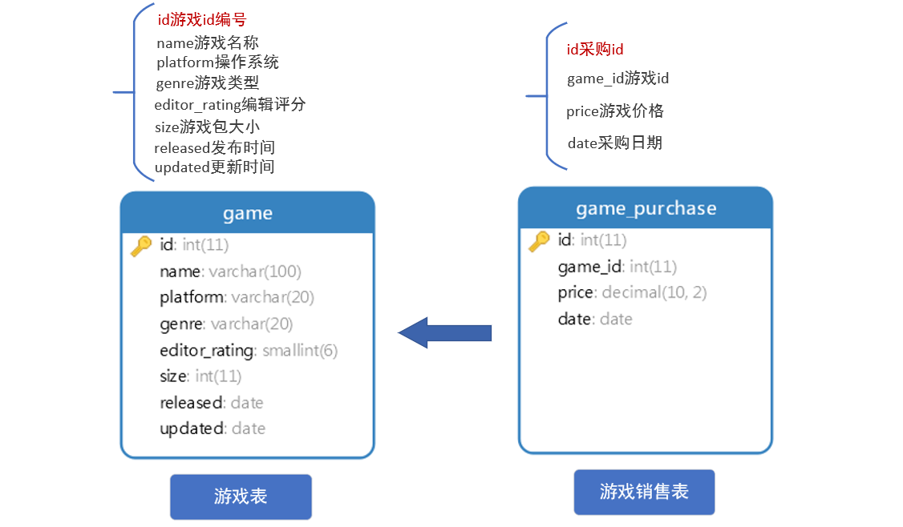

### 2. RANK()函数

> 根据某列进行排序，排序后返回排序序号；如果列值相同，排序的序号也是相同的，但序号不是连续的

#### 2.1 示例

作用及用法

- `RANK()`会返回每一行的等级（序号）
- `ORDER BY`对行进行排序将数据按升序或降序排列（DESC），`RANK（）OVER（ORDER BY ...）`是一个函数，与`ORDER BY` 配合返回序号

```sql
RANK() OVER (ORDER BY 列 DESC)
-- 根据列的值进行排序，返回排序的序号，DESC表示对ORDER BY的列排序采用倒序
```

- 具体看如下例子：

```sql
SELECT
  name,
  platform,
  editor_rating,
  RANK() OVER(ORDER BY editor_rating) as rank_
FROM game;
```

- 上面的SQL对所有数据按编辑评分排序，RANK()函数会返回排序后的排名序号

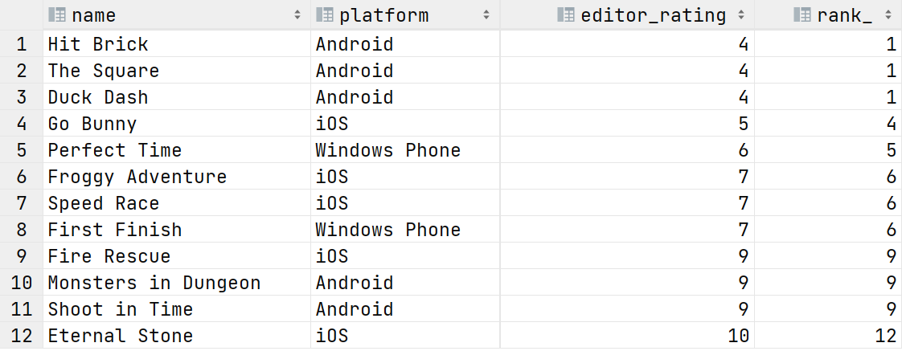

- 观察上面的查询结果：
- 最后一列 rank_ 中显示了游戏的得分排名，得分最低（4分）的三个游戏并列倒数第一
- 得分为5分的游戏，排名为4，这里并没有2和3 ，这个就是`rank()`函数的特点，当有并列的情况出现时，序号是不连续的

#### 2.2 练习

需求：统计每个游戏的名字，分类，更新日期，更新日期的顺序

```sql
SELECT
  name,
  genre,
  updated,
  RANK() OVER(ORDER BY updated) as date_rank
FROM game;
```

**查询结果**

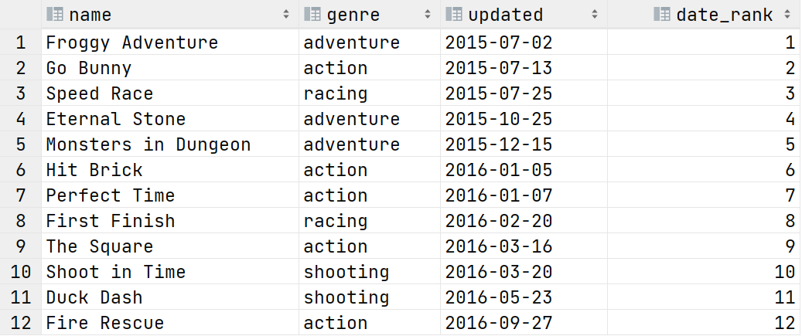

### 3. DENSE_RANK()函数

> 根据某列进行排序，排序后返回排序序号；如果列值相同，排序的序号也是相同的，和RANK函数的区别在于，序号是连续的

#### 3.1 示例

RANK() 函数返回的序号，可能会出现不连续的情况；如果想在有并列情况发生的时候仍然返回连续序号可以使用dense_rank()函数。将 2.1示例 中的代码做一个修改

```sql
SELECT
  name,
  platform,
  editor_rating,
  DENSE_RANK() OVER(ORDER BY editor_rating) as dense_rank_
FROM game;
-- 这里注意：在部分mysql版本中起的别名会出现语法冲突造成的异常错误，加一个下划线即可解决
```

**查询结果** 从结果中看出，dense_rank列的序号是连续的，1，2，3，4，5 （跟使用rank 有明显的区别，rank 会跳过2，3）

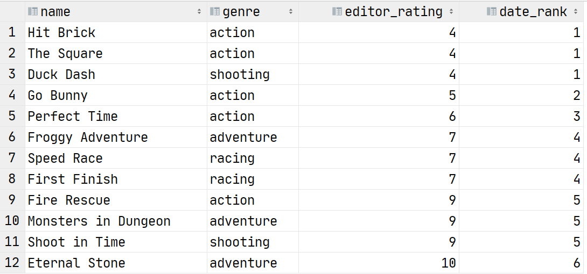

#### 3.2 练习

需求：对游戏的安装包大小进行排序，使用`DENSE_RANK()`，返回游戏名称，包大小以及序号

```sql
SELECT
  name,
  size,
  DENSE_RANK() OVER(ORDER BY size) AS dense_rank_ 
FROM game;
```

**查询结果**

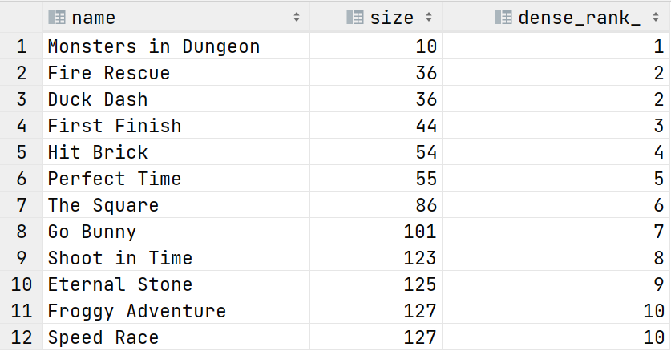

### 4. ROW_NUMBER()函数

- 想获取排序之后的序号，也可以通过ROW_NUMBER() 来实现，从名字上就能知道，意思是返回行号
- ROW_NUMBER()函数 根据某列进行排序，排序后返回排序序号；如果列值相同，排序的序号是不同的！

#### 4.1 示例

需求：对游戏的安装包大小进行排序，使用`ROW_NUMBER()`，返回游戏名称，包大小以及序号

```sql
SELECT
  name,
  size,
  ROW_NUMBER() OVER(ORDER BY size) AS `row_number`
FROM game;
-- 对于别名冲突，也可以使用``
```

**查询结果** 从结果可以看出，`ROW_NUMBER()`返回的是唯一行号（唯一序号），跟`RANK()` 和 `DENSE_RANK()` 返回的是序号，序号会有并列情况出现

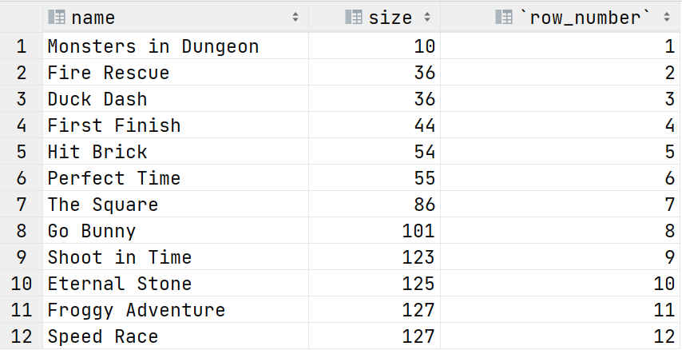

#### 4.2 练习1

需求，将游戏按发行时间排序，返回唯一序号

```sql
SELECT
  name,
  released,
  ROW_NUMBER() OVER(ORDER BY released) `row_number`
FROM game;
```

**查询结果**

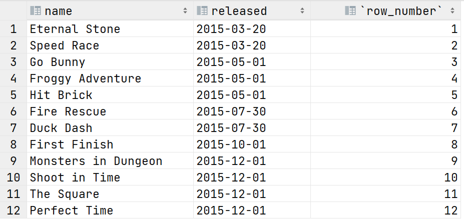

#### 4.3 练习2

对比 `RANK()`, `DENSE_RANK()`, `ROW_NUMBER()` 之间的区别，对上面的案例同时使用三个函数

```sql
SELECT
  name,
  genre,
  released,
  RANK() OVER(ORDER BY released) as rank_num,
  DENSE_RANK() OVER(ORDER BY released) as dense_rank_num,
  ROW_NUMBER() OVER(ORDER BY released) as row_num
FROM game;
```

**查询结果**

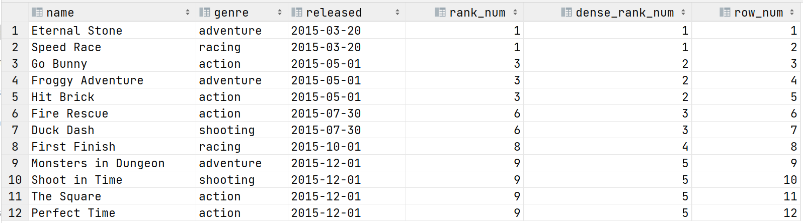

### 5.小结

- 最基本的排序函数: `RANK() OVER(ORDER BY column1, column2...)`.
- 通过排序获取序号的函数介绍了如下三个：
- `RANK()` – 返回排序后的序号 **rank** ，有并列的情况出现时序号不连续
- `DENSE_RANK()` – 返回 **'连续'** 序号
- `ROW_NUMBER()` – 返回连续唯一的行号，与排序`ORDER BY` 配合返回的是连续不重复的序号