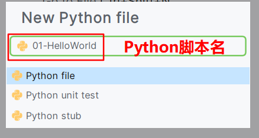
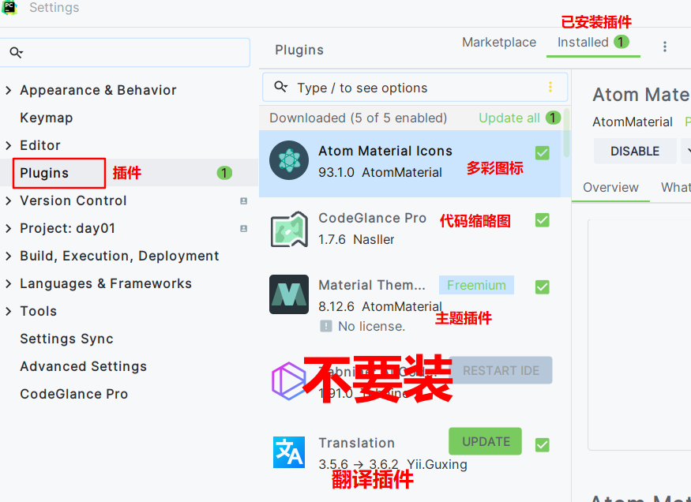

#### 今日内容大纲介绍

* 计算机相关概述
* 编程语言简介
* Python语言介绍
* Python环境搭建
  * 安装Python解释器 或者 Anaconda**(推荐)**
  * 安装PyCharm软件
* Python基础语法**(掌握)**
  * 入门案例: HelloWorld**(必须掌握)**
  * 注释
  * 标识符
  * 变量
  * 数据类型
  * 输入和输出
  * 类型转换

---

#### 1.计算机简介

* 概述

  * 全称叫电子计算机, 英文名叫Computer, 俗称叫: 电脑, 简称叫: PC, 就是用来实现**存储和计算**数据的电子设备.

* 组成

  * 计算机硬件 ->  **遵循"冯·诺依曼体系"**

    

  * 计算机软件

    * 系统软件: 负责用户和计算机硬件之间交互的桥梁.
    * 应用软件: 满足日常生活需求的


#### 2.计算机语言介绍

* 概述
  * 指的是 人 和 计算机之间交互的媒介, 载体. 即: 人 告诉计算机做什么. 
* 发展史(高级语言), 简单总结如下:
  * 第1代:
    * 特点: 面向过程 + 无GC(垃圾回收器)
    * 代表: C语言, 唯一一门可以直接和计算机硬件交互的高级语言. 
  * 第2代:
    * 特点: 面向对象 + 无GC
    * 代表: C++
  * 第3代:
    * 特点: 面向对象 + 有GC
    * 代表: Java, Python, Scala...
  * 第4代:
    * 特点: 面向问题编程, 告诉你做什么, 而不是怎么做.
    * 代表: Siri, AI(深度学习, NLP), 物联网...


#### 3.Python简介

* 概述

  * 它是一门以面向对象为基础的面向函数式编程语言, 强调的解决问题本身, 而不是语言的结构等...

* Python之父:

  * 吉多·范·罗苏姆, 简称: 龟叔
  * Java之父: 詹姆斯·高斯林
  * Scala之父: 马丁·奥德斯基,   他老师 尼古拉斯·沃斯(1984年图灵奖获得者)

* 吉祥物:

  * 蟒蛇

* 特点:

  * 简单, 易学, 开源, 免费, 可移植性, 丰富的库.

* 弊端:

  * Python属于解释型语言, 执行效率相对较慢. 

* 图解

  


#### 4.Python环境搭建

* 安装 Python解释器 或者 Anaconda数据科学库

  * Python解释器

    - 作用: 解析Python代码, 交由计算机执行的.

    - 分类:

      - **CPython**, 底层是用C语言写的, 官方推荐.   我们用这个.
      - JPython, 底层是用Java写的.
      - IconPython, 可以理解为是CPython的升级版, 提供更好的交互.

    - 下载:

      **Python官网:** https://www.python.org/downloads/release/python-382/

      

    - 安装:

      

      

      

    - 测试是否安装成功

      

  * Anaconda数据科学库

    * 它是1个数据科学库, 里边除了包含Python解释器之外, 还包含有常用的多达150+的Python库.
    * **推荐搭建安装这个**, 因为到就业班, Anaconda是必装的. 
    * 详见共享资料中, 提供的Anaconda的安装文档. 

* 安装PyCharm工具

  * 它和DataGrip一样, 都属于JetBrains公司的产品, 所以安装方式, 激活, 设置等都和DataGrip一样.
  * 此处略. 


#### 5.Python入门案例-HelloWorld

* 确保你的Python环境搭建成功

  

* 通过PyCharm新建1个工程(项目)

  

  

* 如果是第一次使用Anaconda, 没有环境, 具体配置如下:

  

  

  

* 新建Python脚本文件

  

  

  


#### 6.PyCharm-基本设置及常用插件

* 基本设置

  

* 常用插件

  


#### 7.变量入门

```python
"""
变量介绍:
    概述:
        变量指的是内存中的一小块区域, 该区域值可以在一定范围内发生改变.
    变量的定义格式:
        变量名 = 变量值
    细节:
        1. =号两端 建议加上 空格, 阅读性更好.
        2. 变量名命名要符合 标识符的 规则和规范.
        3. 如果要打印某个变量的值, 直接写变量名即可, 千万不能加引号, 否则就变成: 打印字符串了.
"""

# 1. 定义变量a, 其初始化值为 100
a = 100     # 把数字100 赋值给 变量a

# 2. 打印变量a的值.
print(a)    # 100
print('a')  # a, 这里加了引号, 表示是1个字符串a, 输出结果是: a,   类似于: print('hello world!')

# 3. 修改变量a的值为 200
a = 200

# 4. 重新打印修改后的变量a的值.
print('a')  # a
print(a)    # 200

```


#### 8.数据类型

```python
"""
数据类型介绍:
    概述:
        数据类型指的是 变量值的类型, 根据变量值不同, 类型也不同, 例如: int, float, bool, str
    常用的数据类型介绍:
        int     整形, 即: 所有的整数.
        float   浮点型, 即: 所有的小数.
        bool    布尔型, 值比较特殊, 只有 True 和 False两个值, 分别表示: 正确, 错误.
        str     字符串, 值比较特殊, 值必须用引号包裹, 单双引号均可.
    细节:
        通过 type()函数, 可以查看变量值的数据类型.
"""

# 1. 定义变量a, b, c, d, 分别存储上述的4种值.
a = 10
b = 10.3
c = True

d = '刘亦菲'
e = "胡歌"

# 细节: 多行字符串, 必须写成 三引号形式, 单双引号均可.
f = """
select
    *
from
    student;
"""

# 2. 打印上述的变量值.
print(a)
print(b)

# 3. 细节, Python独有写法, 同时输出多个变量值.
print(a, b, c, d, e)

print(f)    # 发现: 三引号会保留字符串格式.

# 4. 通过 type()函数, 可以查看变量值的数据类型.
# 格式: type(变量名 或者 变量值)
print(type(20))     # <class 'int'>

print(type(a))  # <class 'int'>
print(type(b))  # <class 'float'>
print(type(c))  # <class 'bool'>
print(type(d))  # <class 'str'>
```


#### 9.标识符和关键字

```python
"""
标识符解释:
    概述:
        就是用来给 类, 函数, 变量等起名字的规则 和 规范.
    命名规则:
        1. 必须有英文字母, 数字, 下划线组成, 且 数字不能开头.
        2. 区分大小写.
        3. 最好做到见名知意, 虽然这个是规范, 但是你要当做规则用.
        4. 不能和关键字重名.
    常用的命名规范:
        大驼峰命名法, 也叫: 双峰驼命名法
            要求:
                每个单词的首字母都大写, 其它全部小写.
            例如:
                HelloWorld, MaxValue, ZhangSanAge...
        小驼峰命名法, 也叫: 单峰驼命名法
            要求:
                从第2个单词开始, 每个单词的首字母都大写, 其它全部小写.
            例如:
                helloWorld, maxValue, zhangSanAge...
        蛇形命名法,
            要求:
                单词间用 下划线 隔开.
            例如:
                MAX_VALUE, max_value, Zhang_San_Age...

        串行命名法,  Python不支持.
            要求:
                单词间用 中划线 隔开.
            例如:
                MAX-VALUE, max-value, Zhang-San-Age...

关键字:
    概述:
        被python赋予了特殊含义的单词.
    特点:
        常见的编辑器针对于关键字都会 高亮 显示.

    常见的关键字如下:
        'False', 'None', 'True', 'and', 'as', 'assert', 'async', 'await', 'break',
        'class', 'continue', 'def', 'del', 'elif', 'else', 'except', 'finally',
        'for', 'from', 'global', 'if', 'import', 'in', 'is', 'lambda', 'nonlocal',
        'not', 'or', 'pass', 'raise', 'return', 'try', 'while', 'with', 'yield'
"""

# 1. 演示: 不符合 见名知意 规范的 变量名.
age = '张三'
print(age)

# 2. 演示 Python中的关键字.
import keyword      # 导包, 后续讲解.
print(keyword.kwlist)   # key word list: 关键字列表


MaxValue = 100
minValue = 10
middle_value = 50

print(minValue, middle_value, MaxValue)
```


#### 10.输出相关

```python
"""
输出介绍:
    概述:
        Python中的输出函数指的是 print()函数, 它可以把 小括号中的内容 输出到控制台.
    格式:
        print(变量值 或者 变量名)
    分类, 即: 常用的输出的写法
        1. 输出单个值.
        2. 同时输出多个值.
        3. 换行输出 和 不换行输出.
        4. 格式化输出 -> 占位符方式
        5. 格式化输出 -> 插值表达式
"""
# 准备动作, 定义多个变量值.
name = '威震天'
age = 99
salary = 1000.1235
flag = True  # 标记是否是反派, True: 是, False: 不是

# 演示 1. 输出单个值.
print('我的姓名是: ' + name)
print(age)
# print('我的年龄是: ' + age)      # 报错, Python中 字符串 和 整数不能进行 加法运算(拼接操作)
print('-' * 28)

# 演示 2. 同时输出多个值.
print(name, age, salary, flag)
print('-' * 28)

# 演示 3. 换行输出 和 不换行输出.
# 换行输出
print('hello')
print('world')

# 上述的代码, 完整写法如下.
print('hello', end='\n')  # end='\n', 是程序默认给 print()函数添加的, 即: 换行输出.
print('world', end='\n')

print('hello', end='\t')
print('world', end='\n')

# 不换行输出
print('hello', end='')
print('world')

# 换行输出
print('hello\nworld')   # \n, \t, \', \"  这些都是转移符, 有特殊的函数.

# 转义符演示
print("I'm Tom!")
print('I\'m Tom!')
print('-' * 28)

# 演示 4. 格式化输出 -> 占位符方式,  规则: %s -> 字符串, %d -> 整数, %f -> 小数
print('我叫%s' % name)        # 1个占位符的写法
print('我叫%s, 今年%d岁了, 我的工资是%f, 你猜我是反派吗? %s' % (name, age, salary, flag))        # 多个占位符的写法

# 占位符的特殊写法: %5d -> 期望得到5位数的整数, 不够前边补空格  %05d  -> 期望得到5位数的整数, 不够前边补0      %.2f  ->  保留两位小数, 会进行四舍五入.
print('我叫%s, 今年%5d岁了, 我的工资是%.3f, 你猜我是反派吗? %s' % (name, age, salary, flag))        # 多个占位符的写法
print('我叫%s, 今年%05d岁了, 我的工资是%.2f, 你猜我是反派吗? %s' % (name, age, salary, flag))        # 多个占位符的写法
# 特殊写法: 两个% -> %, 即:  %% -> %, 一般用于显示比例.
print('我叫%s, 今年%05d岁了, 我的工资是%.2f, 我的成绩全班排名前3%%' % (name, age, salary))        # 多个占位符的写法
print('-' * 28)

# 演示 5. 格式化输出 -> 插值表达式, 格式:  f'正常写你的内容 {变量名}'
print(f'我叫 {name}, 今年 {age} 岁了, 我的工资是{salary}')
print(f'我叫 {name}, 今年 {age:05d} 岁了, 我的工资是{salary:.3f}')


```


#### 11.输入相关

```python
"""
输入介绍:
    概述:
        输入指的是: 用户键盘录入数据, 我们来接收这些数据.
    格式:
        变量名 = input('提示信息')
    细节:
        无论用户录入什么数据, 我们默认都会当做 字符串来接收.
"""

# 1. 提示用户录入他/她的年龄, 并接收.
age = input('请录入您的年龄: ')

# 下下个知识点讲(类型转换).  把接收到的 数据, 转成 整数
new_age = int(age)      # 把 age变量 转成 int类型数据, 即: '20' -> 20

# 2. 打印上述接收到的变量的 类型.
print(type(age))            # <class 'str'>
print(type(new_age))        # <class 'int'>

# 3. 打印上述接收到的变量值.
print('您的年龄是: %d' % new_age)
```


#### 12.运算符详解

```python
"""
运算符解释:
    概述:
        用来连接 变量 或者 变量值的 符号, 就叫: 运算符.
    扩展:
        用 什么运算符 连接起来的式子 就叫什么表达式.
    例如:
        a + b =>  因为 + 是算术运算符, 所以 a + b 是 算术表达式.
        a > b =>  因为 > 是关系运算符, 所以 a > b 是 关系表达式.
        ......

    常用的运算符:
        算术运算符:
        赋值运算符:
        符合赋值运算符:

        关系(比较)运算符:
        逻辑运算符:
        三元表达式(三目运算符):

算术运算符:
    顾名思义, 就使用来做 算术运算的, 常用的有: +, -, *, /, //, **, %

赋值运算符:
    就是我们用的=, 即: 把 右边的内容, 赋值给左边的变量.

复合赋值运算符:
    常用的符号如下: +=, -=, *=, /=, //=, %=, **=
    先进行算术运算, 然后再进行赋值, 例如: a += b, 结果是: a = a + b, 即: 把 a + b的结果, 重新赋值给变量a

如果你要局部选中, 可以选中代码, 然后输入 shift + alt + E, 然后把选中的代码到 Python终端中运行.
"""

# 1. 演示 算术运算符
# a = 10
# b = 3
a, b = 10, 3        # 同时定义多个变量.

print(a + b)    # 13
print(a - b)    # 7
print(a * b)    # 30
print(a / b)    # 3.3333333333333335, 小数用的是近似于的思想.
print(a // b)   # 整除, 3
print(a % b)    # 1
print(a ** b)   # 1000
print('-' * 28)

# 2. 演示赋值运算符.
c = 100         # 把 整数100当做变量值, 赋值给变量c
print(c)
print('-' * 28)


# 3. 演示复合赋值运算符, 此处以 += 举例.
a += b          # 相当于 a = a + b
print(a, b)     # 13, 3

a //= b         # a = a // b = 13 // 3 = 4
print(a, b)     # 4, 3
```


#### 13.类型转换

```python
"""
类型转换解释:
    概述:
        就是用来把 某个类型的值 转成 其它类型的值.
    涉及到的函数:
        int()       把 字符串形式的整数 或者  float类型的小数, 转成 整数, 可能会丢失精度(慎用).
        float()     把 字符串形式的小数 或者 int类型的整数, 转成 小数.
        str()       把 整数 或者 小数, 转成 字符串.


        bool()      把值转成布尔类型的值,   0 -> False,  非零 -> True
        eval()      相当于去掉引号, 是什么就是什么.
                    例如: '10' -> 10, '10.3' -> 10.3,  'True' -> True,  'name' -> name变量, 没有这个变量, 就报错.
"""

# 1. 演示 int()       把 字符串形式的整数 或者  float类型的小数, 转成 整数, 可能会丢失精度(慎用).
print(int(10.3))
print(int('20'))
# print(int('10.3'))    # 报错.
print('-' * 28)

# 2. 演示 float()     把 字符串形式的数字 或者 int类型的整数, 转成 小数.
print(float(10))
print(float('20.3'))
print(float('111'))
print('-' * 28)

# 3. 演示 str()       把 整数 或者 小数, 转成 字符串.
print(str(10))
print(str(10.3))
print(str('name'))
print('-' * 28)

# 4. 演示 bool()      把值转成布尔类型的值,   0 -> False,  非零 -> True
print(bool(0))      # False
print(bool(1))      # True
print(bool(1.2))      # True
print(bool('张三'))      # True
print('-' * 28)

# 5. 演示 eval()      相当于去掉引号, 是什么就是什么.
print(eval('10.3'))
print(eval('22'))
print(eval('True'))

name = '夯哥'
print(eval('name'))   # 相当于去掉 'name'的引号, name就不是字符串了, 而是 变量名.


print(type(eval('10.3')))
print(type(eval('22')))
print(type(eval('True')))
```

