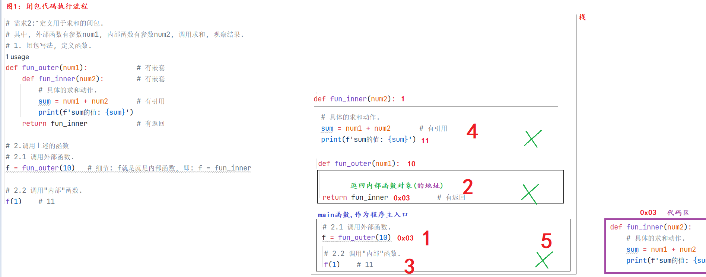
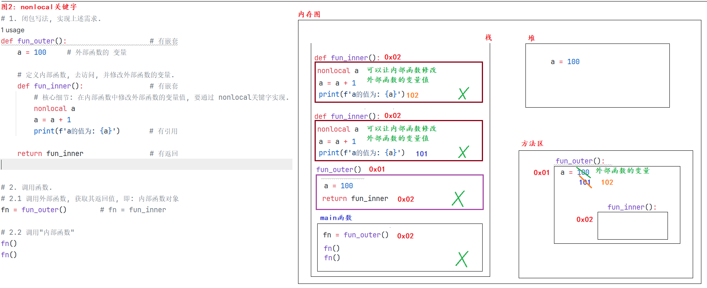
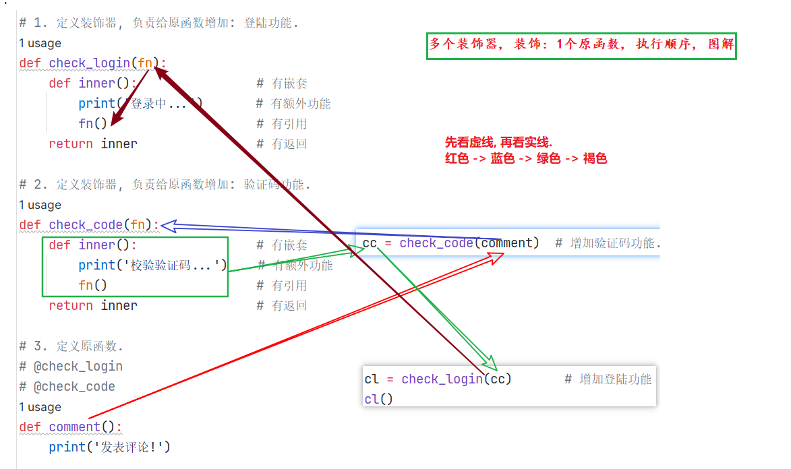

#### 今日内容大纲

* 函数名的用法
* 闭包详解
* 装饰器详解

---

#### 1.函数名-作为对象

```python
"""
细节(记忆):
    1. Python是一门以面向对象为基础的语言, 所以: 万物接对象.
    2. 我们之前写的函数, 其实也都是对象, 函数名代表就是该函数的内存地址(即: 函数入口)
       而 函数名() 表示调用函数.
    3. 函数名可以看做就是1个对象, 可以作为参数进行传递.
"""

# 需求: 定义1个无返回值的func01(), 并直接输出函数名.
# 1. 定义函数.
def func01():
    print('hello world!')

# 2. 在main函数中进行测试.
if __name__ == '__main__':
    # 3. 直接打印函数名.
    print(func01)       # 地址值, 说明: func01是对象, <function func01 at 0x00000288D53E8C10>

    # 4. 调用函数, 直接调用.
    print(func01())     # None, 调用函数, 获取结果, 并打印.

    # 5.既然函数名是对象, 那么它就可以进行赋值.
    f = func01
    print(f)            # 地址值, 说明: f也是对象, <function func01 at 0x0000015DD7118C10>

    # 6. 赋值后, f对象 就等价于 func01对象, 也是可以直接调用函数的.
    f()     # 间接调用了: func01()函数
```

#### 2.函数名-作为参数传递

```python

# 案例: 演示函数名(对象), 可以作为函数的 实参 传递.

# 1. 定义1个无参函数 method()
def method():
    print('我是 method 函数')

# 2. 定义1个有参数的函数 func()
def func(fn):   # Python中, 1个函数 接收 另1个函数对象, 且在其内部调用该函数的写法, 就叫: 回调函数.
    fn()


# 3. 调用: 把无参函数 method()的函数名 传递给 有参函数 func(), 并观察结果.
func(method)      # method是函数名, 也是对象, 可以作为: 实参 传递.

```

#### 3. 闭包-入门

```python
"""
闭包解释:
    概述:
        调用了外部函数变量的 内部函数, 就称之为: 闭包.
    作用:
        它可以保存函数内的变量, 即: 变量不会随着函数调用完毕而销毁.
    回顾:
       (局部)变量是随着函数的调用而存在, 函数的调用完毕而消失.
    闭包的三个必要条件:
        1. 有嵌套.     函数嵌套, 外函数, 内函数
        2. 有引用.     内部函数使用外部函数的变量(包括外部函数的形成那列表)
        3. 有返回.     外部函数返回内部函数名(对象)
    闭包格式:
        def 外部函数名(形参列表):            # 有嵌套
            ......
            def 内部函数名(形参列表):        # 有嵌套
                ....
                使用外部函数的变量           # 有引用
            return 内部函数名              # 有返回
"""

# 需求1: 非闭包写法, 定义1个函数用于保存变量10, 然后调用函数返回值变量, 并重复累加数值, 观察结果.
def func():
    return 10

# 调用函数.
print(func() + 1)   # 11
print(func() + 1)   # 11
print(func() + 1)   # 11
print('-' * 31)


# 需求2: 定义用于求和的闭包.
# 其中, 外部函数有参数num1, 内部函数有参数num2, 调用求和, 观察结果.
# 1. 闭包写法, 定义函数.
def fun_outer(num1):            # 有嵌套
    def fun_inner(num2):        # 有嵌套
        # 具体的求和动作.
        sum = num1 + num2       # 有引用
        print(f'sum的值: {sum}')
    return fun_inner            # 有返回

# 2.调用上述的函数
# 2.1 调用外部函数.
f = fun_outer(10)   # 细节: f就是就是内部函数, 即: f = fun_inner

# 2.2 调用"内部"函数.
f(1)    # 11
f(1)    # 11
f(1)    # 11


```

#### 4.闭包-执行图解



#### 5.闭包-nonlocal关键字介绍

```python
"""
关键字介绍:
    回顾:
        global  修饰的变量叫全局变量, 在当前的模块(.py)文件中, 均可使用.

    nonlocal: 在内部函数中使用, 它可以实现, 在内部函数中 修改外部函数的 变量.
"""

# 需求: 编写1个闭包, 让内部函数去访问外部函数的参数a = 100, 并观察效果.

# 1. 闭包写法, 实现上述需求.
def fun_outer():                    # 有嵌套
    a = 100     # 外部函数的 变量

    # 定义内部函数, 去访问, 并修改外部函数的变量.
    def fun_inner():                # 有嵌套
        # 核心细节: 在内部函数中修改外部函数的变量值, 要通过 nonlocal关键字实现.
        nonlocal a
        a = a + 1
        print(f'a的值为: {a}')       # 有引用

    return fun_inner                # 有返回


# 2. 调用函数.
# 2.1 调用外部函数, 获取其返回值, 即: 内部函数对象
fn = fun_outer()        # fn = fun_inner

# 2.2 调用"内部函数"
fn()
fn()
fn()

```

#### 6.闭包-nonlocal图解



#### 7.装饰器-入门

```python
"""
装饰器介绍:
    概述:
        它是闭包的一种写法, 本质上: 装饰器 = 闭包函数
    作用:
        在不改变原有函数的基础上, 对原有函数的功能做增强(扩展).
    前提:
        1. 有嵌套.         函数嵌套定义, 内部函数, 外部函数.
        2. 有引用.         内部函数使用外部函数的变量.
        3. 有返回值.       外部函数返回内部函数 对象.
        4. 有额外功能.     装饰器用于给 原有函数新增某些功能.
    装饰器的用法:
        方式1: 传统方式.
            变量名 = 装饰器名(要被装饰的函数名)
            变量名()       # 调用函数即可.

        方式2: 语法糖.
            在 要被装饰的函数上写  @装饰器名 即可.
            之后就是普通的调用函数格式即可, 已经实现了增强.
"""

# 需求: 在发表评论前, 都是需要先登录的. 即: 定义有发表评论的函数, 在不改变该函数的基础上, 需要提示用户先登录.

# 1.定义装饰器, 用于增加: 登陆功能.
def check_user(fn):         # 有嵌套
    """
    该函数就是充当装饰器的, 用于增加: 登陆功能.
    :param fn: 要被装饰的函数名.
    :return: 无
    """
    def inner():            # 有嵌套
        print('登录中...')     # 有额外功能.
        fn()                  # 有引用
    return inner            # 有返回


# 2. 定义函数, 表示发表评论.
@check_user
def comment():
    print('发表评论!')

# 3. 在main函数中测试.
if __name__ == '__main__':
    # 4. 直接调用comment()函数
    # comment()

    # 5. 用装饰器 check_user()给 原有函数comment 做功能增强.
    # 方式1: 传统写法.
    # comment = check_user(comment)
    # comment()

    # 方式2: 装饰器语法糖写法.
    comment()
```

#### 8.装饰器-无参无返回值

```python
"""
细节:
    装饰器的内部函数 格式必须和 (要被装饰的)原函数 格式保持一致, 即: 要么都是无参无返回, 要么都是无参有返回......
"""

# 案例: 演示装饰器 装饰 无参无返回值的函数.

# 需求: 定义函数 get_sum(), 用于计算两个整数和.  在不改变其源码的情况下, 实现: 添加一个友好提示.
# 1. 编写装饰器.
def print_info(fn):                                 # 有嵌套
    # 定义内部函数, 其格式必须和 原函数 格式保持一致.
    def inner():                                    # 有嵌套
        print('[友好提示] 正在努力计算中!')             # 有额外功能
        fn()                                        # 有引用
    return inner                                    # 有返回

# 2. 编写原函数: 无参无返回值.
@print_info
def get_sum():
    a = 10
    b = 20
    sum = a + b
    print(f'sum的值为: {sum}')


# 3. 在main函数中进行测试.
if __name__ == '__main__':
    # 方式1: 装饰器传统写法.
    # get_sum = print_info(get_sum)     # 变量名 = 装饰器名(原函数名)
    # get_sum()


    # 方式2: 装饰器语法糖写法.
    get_sum()

```

#### 9.装饰器-有参无返回值

```python
"""
细节:
    装饰器的内部函数 格式必须和 (要被装饰的)原函数 格式保持一致, 即: 要么都是无参无返回, 要么都是无参有返回......
"""

# 案例: 演示装饰器 装饰 有参无返回值的函数.

# 需求: 定义函数 get_sum(), 用于计算两个整数和.  在不改变其源码的情况下, 实现: 添加一个友好提示.
# 1. 编写装饰器.
def print_info(fn):                                 # 有嵌套
    # 定义内部函数, 其格式必须和 原函数 格式保持一致.
    def inner(a, b):                                # 有嵌套
        print('[友好提示] 正在努力计算中!')             # 有额外功能
        fn(a, b)                                    # 有引用
    return inner                                    # 有返回

# 2. 编写原函数: 有参无返回值.
@print_info
def get_sum(a, b):
    sum = a + b
    print(f'sum的值: {sum}')

# 3. 在main函数中进行测试.
if __name__ == '__main__':
    get_sum(10, 20)
    print('-' * 31)

    get_sum(111, 222)

```

#### 10.装饰器-有参有返回值

```python
"""
细节:
    装饰器的内部函数 格式必须和 (要被装饰的)原函数 格式保持一致, 即: 要么都是无参无返回, 要么都是无参有返回......
"""

# 案例: 演示装饰器 装饰 有参有返回值的函数.

# 需求: 定义函数 get_sum(), 用于计算两个整数和.  在不改变其源码的情况下, 实现: 添加一个友好提示.
# 1. 编写装饰器.
def print_info(fn):                                 # 有嵌套
    # 定义内部函数, 其格式必须和 原函数 格式保持一致.
    def inner(a, b):                                # 有嵌套
        print('[友好提示] 正在努力计算中!')             # 有额外功能
        result = fn(a, b)  # 调用原函数, 获取返回值(结果)
        return result      # 返回函数的执行结果.
    return inner                                    # 有返回

# 2. 编写原函数: 有参有返回值.
@print_info
def get_sum(a, b):
    sum = a + b
    return sum

# 3. 在main函数中进行测试.
if __name__ == '__main__':
    print(get_sum(1, 2))
    print('-' * 31)
    print(get_sum(111, 222))


```

#### 11.装饰器-无参有返回值

```python
"""
细节:
    装饰器的内部函数 格式必须和 (要被装饰的)原函数 格式保持一致, 即: 要么都是无参无返回, 要么都是无参有返回......
"""

# 案例: 演示装饰器 装饰 无参有返回值的函数.

# 需求: 定义函数 get_sum(), 用于计算两个整数和.  在不改变其源码的情况下, 实现: 添加一个友好提示.
# 1. 编写装饰器.
def print_info(fn):                                 # 有嵌套
    # 定义内部函数, 其格式必须和 原函数 格式保持一致.
    def inner():                                    # 有嵌套
        print('[友好提示] 正在努力计算中!')             # 有额外功能
        result =  fn()  # 调用原函数, 获取返回值(结果)
        return result   # 返回函数的执行结果.
    return inner                                    # 有返回

# 2. 编写原函数: 无参有返回值.
@print_info
def get_sum():
    a = 10
    b = 20
    sum = a + b
    return sum

# 3. 在main函数中进行测试.
if __name__ == '__main__':
    print(get_sum())

```

#### 12.装饰原函数-可变类型

```python
"""
细节:
    装饰器的内部函数 格式必须和 (要被装饰的)原函数 格式保持一致, 即: 要么都是无参无返回, 要么都是无参有返回......
"""

# 案例: 演示装饰器 装饰 有参(可变类型)有返回值的函数.

# 需求: 定义函数 get_sum(), 用于计算多个数据和.  在不改变其源码的情况下, 实现: 添加一个友好提示.
# 1. 编写装饰器.
def print_info(fn):                                 # 有嵌套
    # 定义内部函数, 其格式必须和 原函数 格式保持一致.
    def inner(*args, **kwargs):                     # 有嵌套
        print('[友好提示] 正在努力计算中!')             # 有额外功能
        return fn(*args, **kwargs)
    return inner                                    # 有返回

# 2. 编写原函数: 有参(可变参数)有返回值.
@print_info
def get_sum(*args, **kwargs):
    """
    该函数用于计算 多个数据的 和.
    :param args: 可变参数, 会接收所有的位置参数, 然后放到元组中
    :param kwargs: 可变参数, 会接收所有的关键字参数, 然后放到字典中
    :return: 多个数据的求和 结果.
    """
    # 2.1 定义sum变量, 记录求和结果.
    sum = 0

    # 2.2 先计算所有位置参数(元组)的和.  例如: (1, 2, 3, 4, 5)
    for i in args:
        sum += i

    # 2.3 再计算所有关键字参数(字典)的和. 例如: {'a': 10, 'b': 20, 'c': 30}
    for value in kwargs.values():
        sum += value

    # 2.4 返回值最终的计算结果.
    return sum

# 3. 在main函数中进行测试.
if __name__ == '__main__':
    print(get_sum(1, 2, 3, 4, 5, a = 10, b = 20, c = 30))

```

#### 13.多个装饰器装饰原函数



```python
"""
细节(记忆):
    1. 多装饰器装饰1个原函数, 会按照由内到外的顺序进行装饰(即: 传统装饰写法).
    2. 但是你看到的执行顺序是: 从上往下(从外到内)的顺序执行的. (语法糖写法)
"""

# 需求: 发表评论前, 需要先登录, 再进行验证码验证.

# 1. 定义装饰器, 负责给原函数增加: 登陆功能.
def check_login(fn):
    def inner():                # 有嵌套
        print('登录中...')       # 有额外功能
        fn()                    # 有引用
    return inner                # 有返回

# 2. 定义装饰器, 负责给原函数增加: 验证码功能.
def check_code(fn):
    def inner():                # 有嵌套
        print('校验验证码...')    # 有额外功能
        fn()                    # 有引用
    return inner                # 有返回

# 3. 定义原函数.
# @check_login
# @check_code
def comment():
    print('发表评论!')

# 4. 测试
if __name__ == '__main__':
    # 方式1: 传统方式.
    # comment = check_code(comment)   # 增加验证码功能.
    # comment = check_login(comment)       # 增加登陆功能
    # comment()

    cc = check_code(comment)  # 增加验证码功能.
    cl = check_login(cc)       # 增加登陆功能
    cl()

    # 方式2: 装饰器语法糖写法.
    # comment()
```

#### 14.带参数的装饰器

```python
"""
结论(记忆):
    1个装饰器的参数, 最多只能写1个.

    decorator: 单词意思, 装饰
"""

# 1. 定义装饰器, 能根据传入的符号, 分别对加法, 减法运算做出提示.
def logging(flag):
    def decorator(fn):        # 报错, 1个装饰器的参数列表: 只能有1个参数.
    # def decorator(fn, flag):        # 报错, 1个装饰器的参数列表: 只能有1个参数.
        def inner():
            # 判断flag变量的值, 看是加法, 还是减法, 并提示(增加不同的额外功能)
            if flag == '+':
                print('---[友好提示] 正在努力计算 加法 运算中 ---')
            elif flag == '-':
                print('---[友好提示] 正在努力计算 减法 运算中 ---')
            fn()
        return inner
    return decorator


# 2. 定义原函数, 表示: 加法.
@logging('+')
def add():
    print('我是加法运算!')

# 3. 定义原函数, 表示: 减法.
@logging('-')
def substract():
    print('我是减法运算!')

# 4. 测试
if __name__ == '__main__':
    # 4.1 测试加法.
    add()
    # 4.2 分割线.
    print('-' * 31)
    # 4.3 测试减法
    substract()


def decorator(fn):
    def inner():
        # 判断flag变量的值, 看是加法, 还是减法, 并提示(增加不同的额外功能)
        if fn == 'add':
            print('---[友好提示] 正在努力计算 加法 运算中 ---')
        elif fn == 'substract':
            print('---[友好提示] 正在努力计算 减法 运算中 ---')
        fn()
    return inner
```