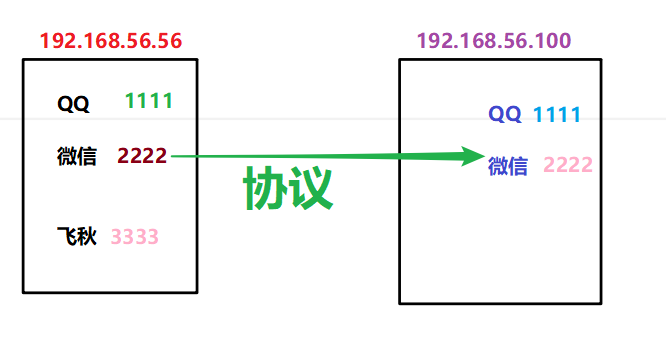
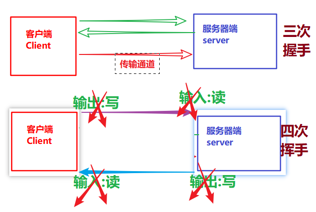
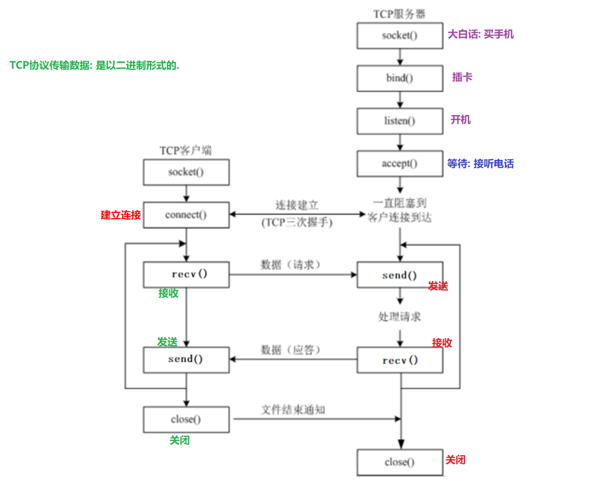
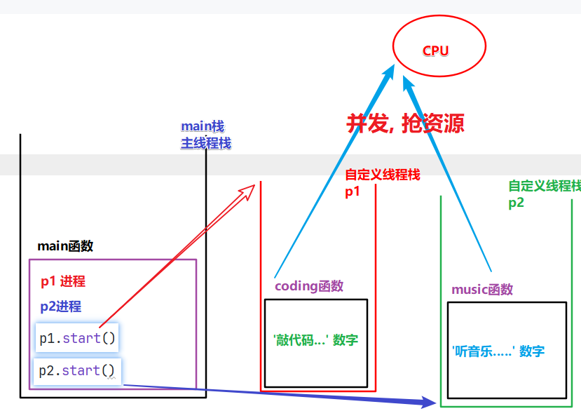

#### 今日内容大纲介绍

* 网络编程介绍
* 三要素
  * IP地址
  * 端口号
  * 协议
* 网络编程图解
* 网络编程案例
  * 客户端和服务器端交互-一句话
  * 服务器端升级-支持多客户端
  * 扩展: 客户端和服务器端交互-发送文件
* 单线程案例演示
* 多线程案例演示

---

#### 1.网络编程介绍

* 概述

  网络编程也叫Socket编程, 套接字编程.

  用来实现**网络互联**的**不同计算机**上**运行的程序间**可以进行**数据交互**, 就叫: 网络编程.

  大白话解释: 两台不同的电脑互相传输信息就叫: 网络编程.

* 三要素

  * IP地址

  * 端口号

  * 协议

    

#### 2.IP地址详解

* 概述

  **设备(电脑, 手机, 手表, IPad...)在网络中的唯一标识**, 用: **IPAddress**表示

* 分类

  * 简单来说主要分为 IpV4, IpV6

  * IpV4: 采用4个字节, 十进制的形式来表示ip, 例如: 192.168.88.161

    > 扩展:
    >
    > ​	IPV4写法, 往下分还有:  城域网, 广域网, 局域网的划分.

  * IpV6: 采用16个字节, 十六进制的形式来表示IP, 理论上无穷多, 可以让地球上的每一粒沙子都有自己的ip.

* 和IP相关的两个命令

  * ipconfig	  查看IP地址的(windows系统)
  * ifconfig     查看IP地址的(Linux, Mac系统)
  * ping IP地址或者域名    **测试网络是否通畅的**

* 两个特殊的IP

  * 127.0.0.1   代表本机, 在哪台电脑写, 它就代表谁. 
  * 255.255.255.255      广播地址, 类似于: 群发.

#### 3.端口号和协议

* 端口号解释

  * 概述

    软件(程序)在设备上的唯一标识.

  * 范围

    0 ~ 65535

  * 细节

    **0 ~ 1023**已经被系统占用, 或者用作保留端口了, 我们自定义端口号的时候, 尽量规避这个号段.

* 协议

  * 概述

    就是通信规则, 通信两端(**发送端和接收端**  或者  **客户端和服务器端**)都要遵守的规则.

  * TCP协议

    * 全称叫: Transmission Control Protocol, 传输控制协议. **类似于: 打电话.**
    * 特点
      1. 面向有连接.
      2. 采用字节流的方式发送数据, 理论上无大小限制.
      3. 安全(可靠)协议.
      4. 传输效率相对较低.
      5. 区分客户端和服务器端.

  * UDP协议

    1. 面向无连接.    **类似于:  群聊**
    2. 采用数据报包的形式传输数据, 每个包的大小不能超过64KB.
    3. 不安全(不可靠)协议.
    4. 传输效率相对较高.
    5. 不区分客户端和服务器端, 叫: 发送端和接收端.

#### 4.TCP协议-三次握手和四次挥手

* 连接的时候

  * 三次握手(**建立连接的时候**)

    1. 客户端像服务器端发起请求, 申请建立连接.
    2. 服务器端接收到客户端请求后, 审核(校验)信息完毕后, 给出回执, 可以连接.
    3. 客户端重新向服务器端发起请求, 建立连接.

  * 四次挥手(**断开连接的时候**)

    1. A => B方向,  A断开连接.
    2. B断开连接.
    3. B => A方向, B断开连接.
    4. A断开连接.

    

#### 5.socket-入门

```python
"""
Socket介绍:
    概述:
        它是套接字的意思, 也是网络编程的核心对象.
        即: 通信两端都独有自己的Socket对象, 数据在两个Socket之间通过 字节流(TCP协议) 或者 数据报包(UDP协议)的形式进行传输.

    大白话解释:
        你给你远方的朋友聊天, 通信双方(你, 你朋友), 要依赖两部手机(类似于: Socket)

    socket对象创建思路:
        1. 导包.
        2. 创建Socket对象, 指定: 地址族, 传输方式.
        3. 打印一下socket对象.
"""
# 1. 导包.
import socket

# 2. 创建Socket对象, 指定: 地址族, 传输方式.
# 参1: Address Family, 地址族, 即: 以何种方式解析IP地址, IPv4,  IPv6?...    AF_INET: 表示以IPv4的规则解析.
# 参2: 表示传输数据的方式,  Stream代表: 字节流
cli_socket = socket.socket(socket.AF_INET, socket.SOCK_STREAM)

# 3. 打印一下socket对象.
print(cli_socket)
```

#### 6.socket-tcp协议代码思路



#### 7.服务器端-收发一句话

```python
"""
案例:
    服务器端给客户端发送一句话: Welcome to study socket!,  客户端接收到并打印, 然后给出回执信息.

服务器端代码思路:
    1. 创建服务器端Socket对象, 指定: 地址族, 传输方式.
    2. 绑定ip地址 和 端口号.
    3. 设置监听. 范围: 1 ~ 128, 一般设置为: 5
    4. 等待客户端申请建立连接, 如果有, 则创建1个新的socket对象负责和该客户端交互.
    5. 给客户端写一句话.
    6. 接收客户端的回执信息.
    7. 释放资源.
"""
import socket

# 1. 创建服务器端Socket对象, 指定: 地址族, 传输方式.
# 参1: 地址族, Address Family, 即: 指定何种方式解析IP, 这里的 AF_INET代表 Ipv4
# 参2: 传输方式, 这里是: 字节流.
server_socket = socket.socket(socket.AF_INET, socket.SOCK_STREAM)
# 2. 绑定ip地址 和 端口号.
server_socket.bind(('127.0.0.1', 5555))     # 元组形式: (字符串形式的ip地址, int类型的端口号)
# 3. 设置监听. 范围: 1 ~ 128, 一般设置为: 5
server_socket.listen(5)
print('服务器端, 开始监听了...')

# 4. 等待客户端申请建立连接, 如果有, 则创建1个新的socket对象负责和该客户端交互.
# 参1: 负责和该客户端交互的 socket对象.
# 参2: 客户端的ip地址信息.
accept_socket, client_info = server_socket.accept()
# print(f'监听到客户端信息: {client_info}')

# 5. 给客户端写一句话.      二进制字符串形式.
accept_socket.send(b'Welcome to study socket!')

# 6. 接收客户端的回执信息.
recv_data_bytes = accept_socket.recv(1024)
recv_data = recv_data_bytes.decode(encoding='utf-8')
print(f'服务器端收到回执信息: {recv_data}')

# 7. 释放资源.
accept_socket.close()

```

#### 8.客户端-收发一句话

```python
"""
案例:
    服务器端给客户端发送一句话: Welcome to study socket!,  客户端接收到并打印, 然后给出回执信息.

服务器端代码思路:
    1. 创建客户端Socket对象, 指定: 地址族, 传输方式.
    2. 连接服务器端, 指定: 要连接到的服务器ip地址 和 端口号.
    3. 接收服务器端的发送的信息.
    4. 给服务端写一句话: 回执信息.
    5. 释放资源.
"""
import socket


# 1. 创建客户端Socket对象, 指定: 地址族, 传输方式.
cli_socket = socket.socket(socket.AF_INET, socket.SOCK_STREAM)

# 2. 连接服务器端, 指定: 要连接到的服务器ip地址 和 端口号.
cli_socket.connect(('127.0.0.1', 5555))

# 3. 接收服务器端的发送的信息.
# receive 单词: 接收的意思.
recv_data_bytes =  cli_socket.recv(1024)       # 1024: 表示最大接收字节数.  二进制形式的字符串.
# 细节: 把上述的信息转成字符串, 然后打印.
recv_data = recv_data_bytes.decode(encoding='utf-8')
print(f'客户端接收到: {recv_data}')

# 4. 给服务端写一句话: 回执信息.
cli_socket.send('收到, 已开始学习, So Easy!'.encode(encoding='utf-8'))

# 5. 释放资源.
cli_socket.close()
```

#### 9.端口号重用

* 遇到的问题

  * 服务器端关闭后, 它的端口号不会立即释放, 而是等待1 ~ 2分钟才会释放, 这个时候, 如果重新启动服务器端, 就会报错

* 解决方案

  1. 手动换1个新的端口号.

  2. 设置服务器端端口号重用, 即: 服务器端关闭, 端口号立即释放.

     > **server_socket.setsockopt(socket.SOL_SOCKET, socket.SO_REUSEADDR, True)**

     ```python
     """
     案例:
         服务器端给客户端发送一句话: Welcome to study socket!,  客户端接收到并打印, 然后给出回执信息.
     
     服务器端代码思路:
         1. 创建服务器端Socket对象, 指定: 地址族, 传输方式.
         2. 绑定ip地址 和 端口号.
         3. 设置监听. 范围: 1 ~ 128, 一般设置为: 5
         4. 等待客户端申请建立连接, 如果有, 则创建1个新的socket对象负责和该客户端交互.
         5. 给客户端写一句话.
         6. 接收客户端的回执信息.
         7. 释放资源.
     """
     import socket
     
     # 1. 创建服务器端Socket对象, 指定: 地址族, 传输方式.
     # 参1: 地址族, Address Family, 即: 指定何种方式解析IP, 这里的 AF_INET代表 Ipv4
     # 参2: 传输方式, 这里是: 字节流.
     server_socket = socket.socket(socket.AF_INET, socket.SOCK_STREAM)
     # 2. 绑定ip地址 和 端口号.
     server_socket.bind(('127.0.0.1', 5555))     # 元组形式: (字符串形式的ip地址, int类型的端口号)
     # server_socket.bind(('192.168.24.148', 5555))     # 元组形式: (字符串形式的ip地址, int类型的端口号)
     # 3. 设置监听. 范围: 1 ~ 128, 一般设置为: 5
     server_socket.listen(5)
     print('服务器端, 开始监听了...')
     
     # 4. 等待客户端申请建立连接, 如果有, 则创建1个新的socket对象负责和该客户端交互.
     # 参1: 负责和该客户端交互的 socket对象.
     # 参2: 客户端的ip地址信息.
     accept_socket, client_info = server_socket.accept()
     # print(f'监听到客户端信息: {client_info}')
     
     # 5. 给客户端写一句话.      二进制字符串形式.
     accept_socket.send(b'Welcome to study socket!')
     
     # 6. 接收客户端的回执信息.
     recv_data_bytes = accept_socket.recv(1024)
     recv_data = recv_data_bytes.decode(encoding='utf-8')
     print(f'服务器端收到回执信息: {recv_data}')
     
     # 7. 释放资源.
     accept_socket.close()
     
     # 8. 设置立即释放端口号.
     # 参1: 代表当前的socket对象, 即: server_socket
     # 参2: 选项, reuse address, 重用地址(是否立即释放端口号)
     # 参3: 选项值, True(正确), False(错误)
     server_socket.setsockopt(socket.SOL_SOCKET, socket.SO_REUSEADDR, True)
     ```

#### 10.服务器端-支持多客户端连接

```python
"""
案例:
     改造服务器端为 支持多客户端连接, 即: 咱们班同学开启你的客户端, 都可以给我发消息了.

服务器端代码思路:
    1. 创建服务器端Socket对象, 指定: 地址族, 传输方式.
    2. 绑定ip地址 和 端口号.
    3. 设置监听. 范围: 1 ~ 128, 一般设置为: 5
    4. 等待客户端申请建立连接, 如果有, 则创建1个新的socket对象负责和该客户端交互.
    5. 给客户端写一句话.
    6. 接收客户端的回执信息.
    7. 释放资源.
"""
import socket

# 1. 创建服务器端Socket对象, 指定: 地址族, 传输方式.
# 参1: 地址族, Address Family, 即: 指定何种方式解析IP, 这里的 AF_INET代表 Ipv4
# 参2: 传输方式, 这里是: 字节流.
server_socket = socket.socket(socket.AF_INET, socket.SOCK_STREAM)
# 2. 绑定ip地址 和 端口号.
server_socket.bind(('192.168.24.148', 5556))     # 元组形式: (字符串形式的ip地址, int类型的端口号)
# 3. 设置监听. 范围: 1 ~ 128, 一般设置为: 5
server_socket.listen(5)
print('服务器端, 开始监听了...')


# 用死循环包裹.
while True:
    # 4. 等待客户端申请建立连接, 如果有, 则创建1个新的socket对象负责和该客户端交互.
    # 参1: 负责和该客户端交互的 socket对象.
    # 参2: 客户端的ip地址信息.
    accept_socket, client_info = server_socket.accept()
    # print(f'监听到客户端信息: {client_info}')

    # 5. 给客户端写一句话.      二进制字符串形式.
    accept_socket.send(b'Welcome to study socket!')

    # 6. 接收客户端的回执信息.
    recv_data_bytes = accept_socket.recv(1024)
    recv_data = recv_data_bytes.decode(encoding='utf-8')
    print(f'服务器端收到回执信息: {recv_data}')

    # 7. 释放资源.
    accept_socket.close()

```

#### 11.网络编程-长连接

* 服务器端代码

  ```python
  """
  案例:  长连接代码演示.
  
  长连接 和 短连接介绍:
      短连接:  客户端发送完一句话(交互一次), 就会释放, 下次想重新发送, 必须再次新建连接.
      长连接:  客户端发送完消息后, 不会立即结束, 而是选择在特定的时机结束. 即: 可以实现重复发送. 一般适用于: 数据库连接.
  """
  import socket
  
  # 1. 创建服务器端Socket对象, 指定: 地址族, 传输方式.
  server_socket = socket.socket(socket.AF_INET, socket.SOCK_STREAM)
  # 2. 绑定ip地址 和 端口号.
  server_socket.bind(('127.0.0.1', 5555))
  # server_socket.bind(('192.168.24.148', 5555))
  
  # 3. 设置监听. 范围: 1 ~ 128, 一般设置为: 5
  server_socket.listen(5)
  print('服务器端, 开始监听了...')
  
  # 4. 等待客户端申请建立连接, 如果有, 则创建1个新的socket对象负责和该客户端交互.
  accept_socket, client_info = server_socket.accept()
  
  while True:
      # 5. 接收客户端的信息.
      recv_data_bytes = accept_socket.recv(1024)
      recv_data = recv_data_bytes.decode(encoding='utf-8')
      print(f'服务器端收到回执信息: {recv_data}')
  
      # 6. 判断接收到的信息是否是: 886, 如果是, 就结束.
      if recv_data == '886':
          break
  
  # 7. 释放资源.
  accept_socket.close()
  
  ```

* 客户端代码

  ```python
  """
  案例:  长连接代码演示.
  
  长连接 和 短连接介绍:
      短连接:  客户端发送完一句话(交互一次), 就会释放, 下次想重新发送, 必须再次新建连接.
      长连接:  客户端发送完消息后, 不会立即结束, 而是选择在特定的时机结束. 即: 可以实现重复发送. 一般适用于: 数据库连接.
  """
  import socket
  
  
  # 1. 创建客户端Socket对象, 指定: 地址族, 传输方式.
  cli_socket = socket.socket(socket.AF_INET, socket.SOCK_STREAM)
  
  # 2. 连接服务器端, 指定: 要连接到的服务器ip地址 和 端口号.
  cli_socket.connect(('127.0.0.1', 5555))
  
  # 3. 给服务端写一句话, 用循环改造.
  while True:
      # 3.1 提示用户录入, 要往服务器: 发送的消息, 并接收.
      result = input('请录入您要发给服务器的信息: ')
      # 3.2 发给服务器即可.
      cli_socket.send(result.encode(encoding='utf-8'))
      # 3.3 判断是否是 886, 如果是, 就结束发送.
      if result == '886':
          break
  
  # 5. 释放资源.
  cli_socket.close()
  ```

#### 12.网络编程-文件上传

* 服务器端

  ```python
  """
  案例: 演示客户端给服务器端上传1个文件.
  """
  import socket
  
  # 1. 创建socket对象.
  server_socket = socket.socket(socket.AF_INET, socket.SOCK_STREAM)
  # 2. 绑定ip, 端口号.
  server_socket.bind(('192.168.24.148', 6666))
  # server_socket.bind(('127.0.0.1', 6666))
  # 3. 设置监听.
  server_socket.listen(5)     # 允许等待的最大连接数.
  print('服务器端, 开始监听了...')
  
  # 4. 开启监听, 等待客户端建立连接.
  accept_socket, client_info = server_socket.accept()
  
  # 5. 将读取到的内容存储到 目的地文件中.
  with open('./data/hg.txt', 'wb') as dest_f:
      # 思路1: 一次性从客户端读取完 文件中 所有的内容.
      # # 5.1 接收客户端发送过来的文件(内容)
      # recv_data_bytes = accept_socket.recv(1024000)
      # # 5.2 具体的往目的地文件中 写数据的动作.
      # dest_f.write(recv_data_bytes)
  
      # 方式2: 一次性接收客户端写过来的1024个字节, 并写到目的地文件中.
      while True:
          # 5.1 读取客户端传过来的数据.
          data = accept_socket.recv(1024)
          # 5.2 判断接收到的内容, 是否不为空, 为空: 则立即结束, 即: 上传完毕.
          if len(data) <= 0:
              break
          # 5.3 走到这里, 说明读取到内容不为空, 写到目的地文件即可.
          dest_f.write(data)
  
  # 7. 释放资源.
  accept_socket.close()
  ```

* 客户端

  ```python
  """
  案例: 演示客户端给服务器端上传1个文件.
  """
  import socket
  
  
  # 1. 创建客户端socket对象.
  cli_socket = socket.socket(socket.AF_INET, socket.SOCK_STREAM)
  
  # 2. 连接服务器端.
  # cli_socket.connect((('127.0.0.1', 6666)))
  cli_socket.connect((('192.168.24.148', 6666)))
  
  # 3. 读取文件中的数据, 并写给服务器端.
  with open('d:/绕口令.txt', 'rb') as src_f:
      # 方式1: 一次性从源文件读取完 文件中 所有的内容.
      # # 3.1 读取文件中所有的数据.
      # data_bytes = src_f.read()
      # # 3.2 把上述的数据(文件内容)写给服务器端.
      # cli_socket.send(data_bytes)
  
      # 方式2: 一次读取1024个字节, 然后写出, 即: 循环读取, 写出.
      while True:
          # 3.1 一次从文件中读取1024个字节.
          data = src_f.read(1024)
          # 3.2 直接把读取到的内容写给 服务器端.
          cli_socket.send(data)
          # 3.3 判断, 如果文件内容读完, 程序结束.
          if len(data) <= 0:
              break
  
  # 4. 释放资源.
  cli_socket.close()
  ```

#### 13.多任务介绍

* 概述

  指的是同一时间, 执行多个任务.

* 好处

  充分利用CPU资源, 提高执行效率.

* 面试题: 并发 和 并行的区别是什么?

  * 并发:

    *  多个任务同时请求同一个CPU资源, 但是同一瞬间, CPU只能执行一个任务, 于是安排它们交替执行.
    *  看起来好像是同时执行的, 其实不是.
  * 并行
    * 多个任务同时执行.   **前提: 需要多核CPU.**

#### 14.多进程介绍

```python
# 进程解释
进程指的是Process, 是CPU分配资源的最小单位.  简单理解: CPU是按照进程为单位进行资源划分的.
一个.exe(可执行程序), 就是1个进程.

# 线程
指的是进程的执行路径, 执行单元.

# 多进程 和 多线程
多进程: 指的是多个 .exe 任务同时执行, 例如: QQ, 微信, 飞秋等一起执行.
多线程; 指的是进程内部, 多任务执行.  例如: 微信, 和张三, 李四同时聊天. 
    
# 大白话翻译:
进程 = 车
线程 = 车道,   如果是单车道: 就叫单线程,  如果是多车道: 就叫多线程.
```

#### 15.多进程代码演示

```python
"""
多进程解释:
    让多个任务同时执行.

思路:
    1. 导包.
    2. 创建进程类对象, 关联: 要执行的函数.
    3. 开启进程.
"""

# 0. 导包
import multiprocessing, time


# 1. 定义函数, 表示: 敲代码.
def coding():
    for i in range(10):
        print(f'敲代码...{i}')
        time.sleep(0.1)

# 2. 定义函数, 表示: 听音乐.
def music():
    for i in range(10):
        print(f'听音乐--------{i}')
        time.sleep(0.1)


# 3. 测试代码
if __name__ == '__main__':
    # 单线程: 前边不执行结束, 后续代码无法执行.
    # coding()
    # music()

    # 多线程(多进程): 代码演示.
    # 4. 创建进程类对象, 关联: 要执行的函数.
    p1 = multiprocessing.Process(target=coding)        # 创建进程1, 关联: coding函数
    p2 = multiprocessing.Process(target=music)         # 创建进程2, 关联: music函数

    # main的这个代码, 放这里, 会先走完, 然后才会创建后续的p1和p2进程, p1和p2才会抢资源.
    for i in range(10):
        print(f'main##{i}')
        time.sleep(0.1)

    # 5. 开启进程
    p1.start()
    p2.start()

```




