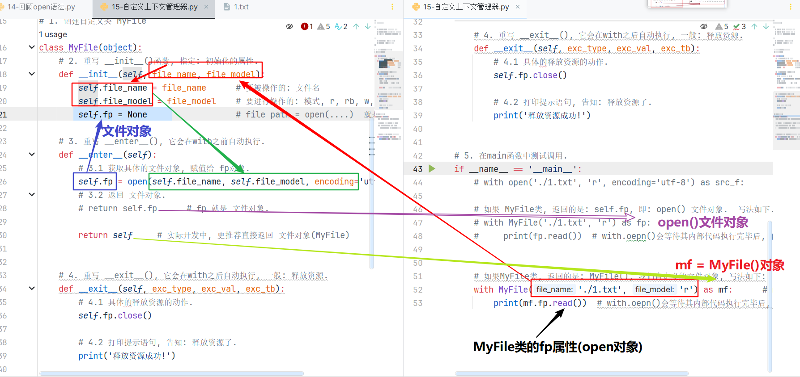

#### 今日内容大纲介绍

* 多进程案例

  * 带参数的多进程代码**(重点)**
  * 查看进程的id
  * 演示: 进程之间数据是相互隔离的

* 多线程案例

  * 入门案例
  * 带参数的多线程代码**(重点)**
  * 演示: 线程之间数据是相互共享的
  * 互斥锁

* 上下文管理器**(重点)**

  > 解析: with open原理, 为啥会自动释放资源.

* 生成器**(重点)**

  * 格式
  * yield关键字
  * 案例: 批量获取歌词

---

#### 1.带参数的多进程代码

```python
"""
多进程解释:
    让多个任务同时执行.

思路:
    1. 导包.
    2. 创建进程类对象, 关联: 要执行的函数.
    3. 开启进程.

案例: 演示带参数的多进程代码, 要求大家掌握进程的参数.
    target: 关联的是目标函数名, 即: 该进程要执行的目标函数对象.
    name:   表示当前进程的名字, 默认是: Process-1, Process-2, Process-n... 可以修改, 一般不做.
    args:   表示以元组的形式传参, 实参和形参的个数, 顺序都要保持一致.
    kwargs: 表示以字典的形式传参, 实参和形参的个数, 参数名都要保持一致.
"""

# 0. 导包
import multiprocessing, time


# 1. 定义函数, 表示: 敲代码.
def coding(name, num):
    for i in range(num):
        print(f'{name} 正在敲第 {i} 遍代码...')
        time.sleep(0.1)

# 2. 定义函数, 表示: 听音乐.
def music(name, count):
    for i in range(count):
        print(f'{name} 正在听第 {i} 首音乐...')
        time.sleep(0.1)


# 3. 测试代码
if __name__ == '__main__':
    # 多线程(多进程): 代码演示.
    # 4. 创建进程类对象, 关联: 要执行的函数.
    # args参数介绍: 传参时, 实参和形参的个数, 包括顺序都必须保持一致.
    p1 = multiprocessing.Process(target=coding, args=('乔峰', 10), name='进程1_QQ')                    # 创建进程1, 关联: coding函数
    print(f'进程p1的名字为: {p1.name}')
    # kwargs参数介绍: 传参时, 实参和形参的个数, 参数名 都必须保持一致.
    p2 = multiprocessing.Process(target=music, kwargs={'count': 5, 'name':'虚竹'}, name='进程2_微信')    # 创建进程2, 关联: music函数
    print(f'进程p2的名字为: {p2.name}')

    # 5. 开启进程
    p1.start()
    p2.start()
```

#### 2.多进程-获取进程id

```python
"""
案例: 演示如何 获取进程id

目的/作用:
    1. 在Python中, 1个进程 有1个 唯一的 进程号.  进程号是可以重复使用的(即: 进程结束, 进程号也会被释放).
    2. 知道了进程id, 方便我们管理进程(例如: 杀死指定进程, 查看指定进程的父进程)

格式:
    场景1: 获取当前进程的id
        方式1: os模块的 getpid()函数
        方式2: multiprocessing模块的 pid属性
    场景2: 获取当前进程的 父id
        os模块的 getppid()     # parent process, 父进程

"""

# 0. 导包
import multiprocessing, time, os


# 1. 定义函数, 表示: 敲代码.
def coding(name, num):
    for i in range(num):
        print(f'{name} 正在敲第 {i} 遍代码...')
        time.sleep(0.1)
        # 获取当前进程的pid, 以及父进程的id
        print(f'当前进程p1的pid为: {os.getpid()}, {multiprocessing.current_process().pid}, 父进程的pid为: {os.getppid()}')

# 2. 定义函数, 表示: 听音乐.
def music(name, count):
    for i in range(count):
        print(f'{name} 正在听第 {i} 首音乐...')
        time.sleep(0.1)
        print(f'当前进程p2的pid为: {os.getpid()}, {multiprocessing.current_process().pid}, 父进程的pid为: {os.getppid()}')


# 3. 测试代码
if __name__ == '__main__':
    # 多线程(多进程): 代码演示.
    # 4. 创建进程类对象, 关联: 要执行的函数.
    # args参数介绍: 传参时, 实参和形参的个数, 包括顺序都必须保持一致.
    p1 = multiprocessing.Process(target=coding, args=('乔峰', 10), name='进程1_QQ')                    # 创建进程1, 关联: coding函数
    print(f'进程p1的名字为: {p1.name}')
    # kwargs参数介绍: 传参时, 实参和形参的个数, 参数名 都必须保持一致.
    p2 = multiprocessing.Process(target=music, kwargs={'count': 5, 'name':'虚竹'}, name='进程2_微信')    # 创建进程2, 关联: music函数
    print(f'进程p2的名字为: {p2.name}')

    # 5. 开启进程
    p1.start()
    p2.start()

    # time.sleep(5)
    # 6. 打印main进程的id
    print(f'main进程的id为: {os.getpid()}, {multiprocessing.current_process().pid}')
```

#### 3.进程间-数据隔离

```python
"""
案例: 演示进程之间 数据是相互隔离的.

大白话解释:
    1. 微信 和 QQ都是进程, 它们之间的数据都是 相互隔离的. 即: 微信不能直接访问QQ的数据, QQ也不能直接访问微信的数据.
    2. 下述代码你会发现, 多个子进程相当于把 父进程的资源全部拷贝了一份(注意: main外资源), 即: 子进程相当于父进程的副本.

需求: 定义全局变量 my_list = [], 搞两个进程, 分别实现往里边添加数据, 从里边读取数据, 并观察结果.
"""

# 导包
import multiprocessing, time

# 1. 定义全局变量.
my_list = []

# 2. 定义函数 write_data(), 往: 列表中 添加数据.
def write_data():
    # 为了让效果更明显, 我们添加多个值.
    for i in range(1, 6):
        my_list.append(i)       # 具体添加元素到列表的动作.
        print(f'add: {i}')      # 打印添加细节(过程)
    print(f'write_data函数: {my_list}')       # 添加完毕后, 打印列表结果


# 3. 定义函数 read_data(), 从: 列表中 读取数据.
def read_data():
    # 休眠一会儿, 确保 write_data()函数执行完毕.
    time.sleep(3)
    print(f'read_data函数: {my_list}')       # 打印列表结果


# 4. 在main中测试
if __name__ == '__main__':
    # 4.1 创建两个进程对象.
    p1 = multiprocessing.Process(target=write_data)     # 进程1, 例如: QQ
    p2 = multiprocessing.Process(target=read_data)      # 进程2, 例如: 微信

    # 4.2 开启进程.
    p1.start()
    p2.start()

    # print('看看我打印了几遍? ')   # main函数内的内容, 只执行一次.

print('看看我打印了几遍? ')   # main外资源, 自身要执行一次,  p1进程拷贝1遍,  p2进程拷贝1遍 = 3次
```

#### 4.默认-主进程会等待子进程执行结束

```python
"""
案例:
    演示 默认情况下, 主进程会等待子进程执行结束在结束.

需求:
    创建1个子进程, 子进程执行完需要3秒钟, 让主进程1秒就结束, 观察: 整个程序是立即结束, 还是会等待子进程结束再结束.

结论:
    1. 默认情况下, 主进程会等待所有子进程执行结束再结束.
    2. 问: 如何实现, 当主进程结束的时候, 子进程也立即结束呢?
        方式1: 设置子进程为守护进程.   类似于: 公主 和 守护骑士.
        方式2: 手动关闭子进程.

"""

# 导包
import multiprocessing, time


# 1. 定义函数work(), 要被: 子进程关联.
def work():
    for i in range(10):
        print(f'工作中... {i}')
        time.sleep(0.3)     # 总计休眠时间: 0.3 * 10 = 3秒


# 2. 在main函数中测试.
if __name__ == '__main__':
    # 3. 创建子进程.
    p1 = multiprocessing.Process(target=work)
    # 4. 开启子进程.
    p1.start()

    # 5. 让主进程(main进程)休眠1秒.
    time.sleep(1)
    # 6. 主进程结束, 打印提示语句.
    print('主进程执行结束了!')
```

#### 5.主进程关闭-子进程同步关闭

```python
"""
案例:
    演示 默认情况下, 主进程会等待子进程执行结束在结束.

需求:
    创建1个子进程, 子进程执行完需要3秒钟, 让主进程1秒就结束, 观察: 整个程序是立即结束, 还是会等待子进程结束再结束.

结论:
    1. 默认情况下, 主进程会等待所有子进程执行结束再结束.
    2. 问: 如何实现, 当主进程结束的时候, 子进程也立即结束呢?
        方式1: 设置子进程为守护进程.   类似于: 公主 和 守护骑士.
        方式2: 手动关闭子进程.

细节:
    1. 当非守护进程结束的时候, 它的所有守护进程都会立即终止, 且释放资源.
    2. 如果是 terminate()方式, 子进程主动结束自己, 则会变成僵尸进程, 不会立即释放资源.

"""

# 导包
import multiprocessing, time


# 1. 定义函数work(), 要被: 子进程关联.
def work():
    for i in range(10):
        print(f'工作中... {i}')
        time.sleep(0.3)     # 总计休眠时间: 0.3 * 10 = 3秒


# 2. 在main函数中测试.
if __name__ == '__main__':
    # 3. 创建子进程.
    p1 = multiprocessing.Process(target=work)

    # 核心细节: 设置p1为守护线程, 因为p1的父进程是main, 所以p1是main的守护进程.
    # p1.daemon = True

    # 4. 开启子进程.
    p1.start()

    # 5. 让主进程(main进程)休眠1秒.
    time.sleep(1)

    # 方式2: 在主进程执行结束前, 子进程主动自己关闭自己.
    p1.terminate()  # 不推荐用, 会变成僵尸进程, 不会主动释放资源, 过段时间会交由(init进程, 充当父进程),来释放资源.

    # 6. 主进程结束, 打印提示语句.
    print('主进程执行结束了!')
```

#### 6.多线程-入门

```python
"""
多任务解释:
    概述:
        多个任务同时执行.
    目的:
        提高资源利用率, 提高效率.
    实现方式:
        方式1: 多进程.
        方式2: 多线程.

    回顾, 之前讲解的概述:
        进程:
            CPU分配资源的基本单位, 例如: 可执行程序, *.exe
            可以理解为: 车.
        线程:
            CPU调度资源的最小单位, 即: 进程的执行单元, 执行路径.
            可以理解为: 车道
        多进程:
            多个*.exe, 例如: 微信.exe, QQ.exe, 即: 不同的软件.
        多线程:
            同一个进程, 有多条执行路径, 例如: 微信.exe -> 查看钱包, 和张三聊天, 和李四聊天, 查看照片...

需求: 用多线程思路, 实现: 一边写代码, 一边听音乐.
"""

# 导包
import threading, time

# 1. 定义函数coding(), 表示: 敲代码
def coding():
    for i in range(10):
        print(f'正在敲第 {i} 遍代码! -------')
        time.sleep(0.1)

# 2. 定义函数music(), 表示: 听音乐.
def music():
    for i in range(10):
        print(f'正在听第 {i} 首音乐!')
        time.sleep(0.1)

# 3. 在main中测试.
if __name__ == '__main__':
    # 4. 创建两个线程对象.
    t1 = threading.Thread(target=coding)
    t2 = threading.Thread(target=music)

    # 5. 开启线程.
    t1.start()
    t2.start()
```

#### 7.多线程-带参数

```python
"""
多任务解释:
    概述:
        多个任务同时执行.
    目的:
        提高资源利用率, 提高效率.
    实现方式:
        方式1: 多进程.
        方式2: 多线程.

    回顾, 之前讲解的概述:
        进程:
            CPU分配资源的基本单位, 例如: 可执行程序, *.exe
            可以理解为: 车.
        线程:
            CPU调度资源的最小单位, 即: 进程的执行单元, 执行路径.
            可以理解为: 车道
        多进程:
            多个*.exe, 例如: 微信.exe, QQ.exe, 即: 不同的软件.
        多线程:
            同一个进程, 有多条执行路径, 例如: 微信.exe -> 查看钱包, 和张三聊天, 和李四聊天, 查看照片...

需求: 用多线程思路, 实现: 一边写代码, 一边听音乐.  带参数版.
"""

# 导包
import threading, time

# 1. 定义函数coding(), 表示: 敲代码
def coding(name, num):
    for i in range(num):
        print(f'{name} 正在敲第 {i} 遍代码! -------')
        time.sleep(0.1)

# 2. 定义函数music(), 表示: 听音乐.
def music(name, count):
    for i in range(count):
        print(f'{name} 正在听第 {i} 首音乐!', end='\n')
        time.sleep(0.1)

# 3. 在main中测试.
if __name__ == '__main__':
    # 4. 创建两个线程对象.
    # Thread()类中的参数如下:
    #   target      关联要执行的目标函数对象.
    #   name        设置线程名
    #   args        以元组形式传参, 个数, 顺序都要保持一致.
    #  kwargs       以字典形式传参, 个数, 参数名(键名和形参名)保持一致.
    t1 = threading.Thread(target=coding , args = ('乔峰', 9))
    t2 = threading.Thread(target=music, kwargs={'name': '虚竹', 'count': 10})

    # 5. 开启线程.
    t1.start()
    t2.start()
```

#### 8.多线程-执行顺序

```python
"""
案例:
    演示多线程代码 的执行顺序.

结论:
    1. 多线程的执行具有 随机性, 因为: 线程是由CPU调度的.
    2. 调度资源常用的两种方式:
        抢占式调度: 谁抢到资源, 谁执行.
            Python, Java用的都是这种思路.
        均分时间片: 每个任务获取CPU的时间都是固定的.
"""

# 导包
import threading
import time


# 1. 定义函数get_info(), 用来打印: 线程信息, 看看当前是哪个线程在执行.
def get_info():
    # 休眠一会儿, 让效果更明显.
    time.sleep(0.1)

    # 1.1 获取当前的线程对象.
    ct = threading.current_thread()

    # 1.2 打印当前线程对象即可.
    print(f'当前的线程对象是: {ct}')


# 2. 在main中测试.
if __name__ == '__main__':
    # 3. 为了让效果更明显, 创建多个线程.
    # t1 = threading.Thread(target=get_info)
    # t2 = threading.Thread(target=get_info)
    #
    # t1.start()
    # t2.start()

    for i in range(10):
        t1 = threading.Thread(target=get_info)
        t1.start()
```

#### 9.多线程-等待子线程结束再结束

```python
"""
案例:
    演示 默认情况下, 主线程会等待子线程执行结束在结束.

需求:
    创建1个子线程, 子线程执行完需要3秒钟, 让主线程1秒就结束, 观察: 整个程序是立即结束, 还是会等待子线程结束再结束.

结论:
    1. 默认情况下, 主线程会等待所有子线程执行结束再结束.
    2. 问: 如何实现, 当主线程结束的时候, 子线程也立即结束呢?
        设置子线程为守护线程.   类似于: 公主 和 守护骑士.

"""

# 导包
import threading, time


# 1. 定义函数work(), 要被: 子线程关联.
def work():
    for i in range(10):
        print(f'工作中... {i}')
        time.sleep(0.3)     # 总计休眠时间: 0.3 * 10 = 3秒


# 2. 在main函数中测试.
if __name__ == '__main__':
    # 3. 创建子线程.
    t1 = threading.Thread(target=work)
    # 4. 开启子线程.
    t1.start()

    # 5. 让主线程(main线程)休眠1秒.
    time.sleep(1)
    # 6. 主线程结束, 打印提示语句.
    print('主线程执行结束了!')
```

#### 10.多线程-守护线程

```python
"""
案例:
    演示 默认情况下, 主线程会等待子线程执行结束在结束.

需求:
    创建1个子线程, 子线程执行完需要3秒钟, 让主线程1秒就结束, 观察: 整个程序是立即结束, 还是会等待子线程结束再结束.

结论:
    1. 默认情况下, 主线程会等待所有子线程执行结束再结束.
    2. 问: 如何实现, 当主线程结束的时候, 子线程也立即结束呢?
        设置子线程为守护线程.   类似于: 公主 和 守护骑士.

结论:
    当非守护线程结束的时候, 和它关联的守护线程, 也会立即结束, 释放资源.
"""

# 导包
import threading, time


# 1. 定义函数work(), 要被: 子线程关联.
def work():
    for i in range(10):
        print(f'工作中... {i}')
        time.sleep(0.3)  # 总计休眠时间: 0.3 * 10 = 3秒


# 2. 在main函数中测试.
if __name__ == '__main__':
    # 3. 创建子线程.
    # 守护线程, 格式1: 创建线程对象的时候, 直接指定.
    # t1 = threading.Thread(target=work, daemon=True)

    t1 = threading.Thread(target=work)
    # 守护线程, 格式2: 创建线程对象后, 通过 daemon属性设置.
    # t1.daemon = True

    # 守护线程, 格式3: 创建线程对象后, 通过 setDaemon()函数设置.
    t1.setDaemon(True)      # 类似于以前我们学的: get_name(), set_name()

    # 4. 开启子线程.
    t1.start()

    # 5. 让主线程(main线程)休眠1秒.
    time.sleep(1)

    # 6. 主线程结束, 打印提示语句.
    print('主线程执行结束了!')
```

#### 11.多线程-共享资源

```python
"""
案例: 演示 同一进程的多个线程, 可以共享 该进程的资源.

结论:
    1. 进程之间, 数据相互隔离.        进程 = 软件.
    2. 线程之间, 数据共享.
"""

# 导包
import threading, time

# 1. 定义全局变量.
my_list = []


# 2. 定义函数write_data(), 实现: 往列表中添加数据.
def write_data():
    # 为了效果更明显, 我们添加多个元素.
    for i in range(1, 6):
        # time.sleep(0.1)
        # 往列表中添加元素.
        my_list.append(i)
        # 打印添加的细节
        print(f'add: {i}')

    # 添加之后, 打印结果.
    print(f'write_data函数: {my_list}')


# 3. 定义函数read_data(), 实现: 从列表中读取数据.
def read_data():
    time.sleep(2)     # 为了效果更好看, 加入休眠线程.
    print(f'read_data函数: {my_list}')


# 4. main函数中进行测试.
if __name__ == '__main__':
    # 4.1 创建两个线程对象, 分别关联: write_data(), read_data()函数.
    t1 = threading.Thread(target=write_data)
    t2 = threading.Thread(target=read_data)

    # 4.2 启动线程.
    t1.start()
    t2.start()
```

#### 12.多线程-操作共享资源-非法值

```python
"""
案例:  线程可以共享全局变量, 同时操作, 可能会出现: 安全问题.

遇到的问题:
    两个线程同时操作共享变量, 进行累加操作, 出现: 累计次数"不够"的情况, 我们要的效果是:  get_sum1: 100W,  get_sum2:200W, 但是结果不是.
产生原因:
    正常情况:
        假设g_num = 0
            第1次循环:  t1线程抢到资源, 对其累加1, 操作后 g_num = 1, t1线程本次操作完毕.
            第2次循环: 假设t2线程抢到了资源, 此时 g_num = 1, 操作之后(累加1), g_num = 2, t2线程本次操作完毕.
        这个是正常情况.

    非正常情况:
        1. 假设 g_num = 0
        2. 假设 t1 线程抢到了资源, 在还没有来得及对 g_num(全局变量)做 累加操作的时候, 被t2线程抢走了资源.
        3. t2线程也会去读取 g_num(全局变量)的值, 此时 g_num = 0
        4. 之后t1 和 t2线程分别开始了 累加操作:
            t1线程, 累加之后,   g_num = 0     ->    g_num = 1
            t2线程, 累加之后,   g_num = 0     ->    g_num = 1
        5. 上述一共累加了 2次, 但是 g_num的值最终只 累加了 1.


"""
import threading

# 需求: 定义两个函数, 分别对全局变量累加100W次, 并打印观察程序的最终运行结果.

# 1. 定义全局变量.
g_num = 0

# 2. 定义函数 get_sum1(), 实现对全局变量累加 100W次
def get_sum1():
    for i in range(1000000):
        global g_num
        g_num += 1      # 全局变量 + 1
    # 程序计算完毕后, 打印结果.
    print(f'get_sum1函数计算结果: {g_num}')       # 100W

# 3. 定义函数 get_sum2(), 实现对全局变量累加 100W次
def get_sum2():
    for i in range(1000000):
        global g_num
        g_num += 1      # 全局变量 + 1
    # 程序计算完毕后, 打印结果.
    print(f'get_sum2函数计算结果: {g_num}')       # 200W

# 4. 测试
if __name__ == '__main__':
    # 4.1 创建两个线程对象, 分别关联: 两个函数.
    t1 = threading.Thread(target=get_sum1)
    t2 = threading.Thread(target=get_sum2)

    # 4.2 启动线程.
    t1.start()
    t2.start()
```

#### 13.互斥锁

```python
"""
案例:  线程可以共享全局变量, 同时操作, 可能会出现: 安全问题.

遇到的问题:
    两个线程同时操作共享变量, 进行累加操作, 出现: 累计次数"不够"的情况, 我们要的效果是:  get_sum1: 100W,  get_sum2:200W, 但是结果不是.
产生原因:
    正常情况:
        假设g_num = 0
            第1次循环:  t1线程抢到资源, 对其累加1, 操作后 g_num = 1, t1线程本次操作完毕.
            第2次循环: 假设t2线程抢到了资源, 此时 g_num = 1, 操作之后(累加1), g_num = 2, t2线程本次操作完毕.
        这个是正常情况.

    非正常情况:
        1. 假设 g_num = 0
        2. 假设 t1 线程抢到了资源, 在还没有来得及对 g_num(全局变量)做 累加操作的时候, 被t2线程抢走了资源.
        3. t2线程也会去读取 g_num(全局变量)的值, 此时 g_num = 0
        4. 之后t1 和 t2线程分别开始了 累加操作:
            t1线程, 累加之后,   g_num = 0     ->    g_num = 1
            t2线程, 累加之后,   g_num = 0     ->    g_num = 1
        5. 上述一共累加了 2次, 但是 g_num的值最终只 累加了 1.

解决方案:
    采用 线程同步 解决.

线程同步解释:
    概述:
        线程同步, 也叫线程安全, 它是用来解决 多线程操作共享变量, 可能出现非法值的问题的.
    解决思路:
        加锁.
    步骤:
        1. 创建锁.
        2. 加锁.
        3. 释放锁.
    细节:
        1. 必须使用同一把锁, 否则可能出现锁不住的情况.
        2. 选择合适的时机要释放锁, 否则可能出现死锁的情况.
"""
import threading

# 需求: 定义两个函数, 分别对全局变量累加100W次, 并打印观察程序的最终运行结果.

# 1. 定义全局变量.
g_num = 0

# 核心细节, 创建: 锁(互斥锁)
mutex = threading.Lock()        # mutex是变量名, 符合规范即可. mutex单词 是 互斥的意思.
# mutex2 = threading.Lock()        # mutex是变量名, 符合规范即可. mutex单词 是 互斥的意思.

# 2. 定义函数 get_sum1(), 实现对全局变量累加 100W次
def get_sum1():

    # 加锁
    mutex.acquire()
    for i in range(1000000):
        global g_num
        g_num += 1      # 全局变量 + 1
    # 程序计算完毕后, 打印结果.
    # 解锁
    mutex.release()
    print(f'get_sum1函数计算结果: {g_num}')       # 100W

# 3. 定义函数 get_sum2(), 实现对全局变量累加 100W次
def get_sum2():
    # 加锁
    mutex.acquire()
    for i in range(1000000):
        global g_num
        g_num += 1      # 全局变量 + 1
    # 程序计算完毕后, 打印结果.
    # 解锁
    mutex.release()
    print(f'get_sum2函数计算结果: {g_num}')       # 200W

# 4. 测试
if __name__ == '__main__':
    # 4.1 创建两个线程对象, 分别关联: 两个函数.
    t1 = threading.Thread(target=get_sum1)
    t2 = threading.Thread(target=get_sum2)

    # 4.2 启动线程.
    t1.start()
    t2.start()

```

#### 14.回顾open语法

```python
"""
回顾: open() 操作文件的语法.


"""

# 1. 简单的读数据的代码
# src_f = open('./1.txt', 'r', encoding='utf-8')
# print(src_f.read())
# src_f.close()


# 2. 上述代码存在两个问题.  问题1: 有异常(数据源文件可能不存在), 需要解决.   问题2: 可能会忘记 close()释放资源.
# 解决方案: 用 try.except.finally解决.
# try:
#     src_f = open('./1.txt', 'r', encoding='utf-8')
#     print(src_f.read())
# except:
#     print('哎呀, 程序出问题了!')
# finally:
#     # src_f.close()     # 有可能忘记 关闭资源.
#     pass


# 3. 上述代码虽然解决了异常问题, 但是出现了新的问题:  问题1: 上述代码冗余, 阅读性相对较差.    问题2: 可能会忘记 close()释放资源.
# 解决方案: with...open()...  语句
with open('./1.txt', 'r', encoding='utf-8') as src_f:
    print(src_f.read())     # with.oepn()会等待其内部代码执行完毕后, 自动释放资源.


# 4. 为啥with.open()会自动释放资源呢? 我们很好奇呀, 所以我们来探究一下它的底层原理, 其实就是: 上下文管理器对象.
```

#### 15.自定义上下文管理器

```python
"""
案例: 演示自定义上下文管理器.

细节:
    1. with ... as ...  会在其内容执行完毕后, 自动使用.
    2. with ... as ... 功能之所以强大, 背后就是靠 上下文管理器来支撑的.
    3. 一个类, 只要重写了 __enter__(),  __exit__() 这两个函数, 它就是 上下文管理器.

特点:
    1. __enter__() 会在 with语句之前 自动执行.
    2. __exit__() 会在 with语句之后 自动执行.
"""

# 需求: 自定义一个 MyFile类, 实现读写文件的操作.
# 1. 创建自定义类 MyFile
class MyFile(object):
    # 2. 重写 __init__()函数, 指定: 初始化的属性.
    def __init__(self, file_name, file_model):
        self.file_name = file_name      # 要被操作的: 文件名
        self.file_model = file_model    # 要进行操作的: 模式, r, rb, w, wb...
        self.fp = None                  # file path = open(....)  就是1个文件对象.

    # 3. 重写 __enter__(), 它会在with之前自动执行.
    def __enter__(self):
        # 3.1 获取具体的文件对象, 赋值给 fp对象.
        self.fp = open(self.file_name, self.file_model, encoding='utf-8')
        # 3.2 返回 文件对象.
        # return self.fp      # fp 就是 文件对象.

        return self     # 实际开发中, 更推荐直接返回 文件对象(MyFile)


    # 4. 重写 __exit__(), 它会在with之后自动执行, 一般: 释放资源.
    def __exit__(self, exc_type, exc_val, exc_tb):
        # 4.1 具体的释放资源的动作.
        self.fp.close()

        # 4.2 打印提示语句, 告知: 释放资源了.
        print('释放资源成功!')


# 5. 在main函数中测试调用.
if __name__ == '__main__':
    # with open('./1.txt', 'r', encoding='utf-8') as src_f:

    # 如果 MyFile类, 返回的是: self.fp, 即: open() 文件对象.  写法如下.
    # with MyFile('./1.txt', 'r') as fp:
    #     print(fp.read())  # with.oepn()会等待其内部代码执行完毕后, 自动释放资源.


    # 如果MyFile类, 返回的是: MyFile(), 我们自定义的文件对象, 写法如下:
    with MyFile('./1.txt', 'r') as mf:      # mf = MyFile()对象
        print(mf.fp.read())  # with.oepn()会等待其内部代码执行完毕后, 自动释放资源.
```



