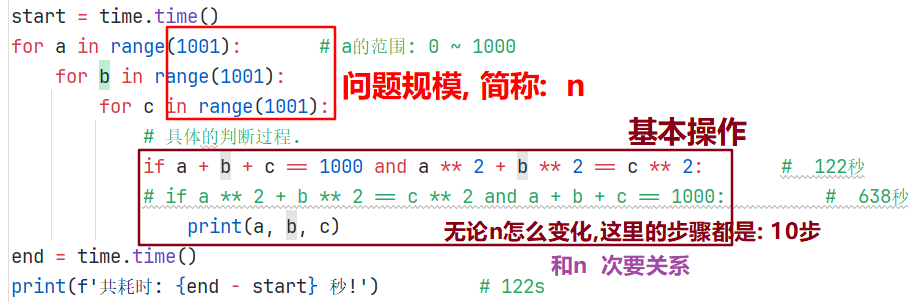
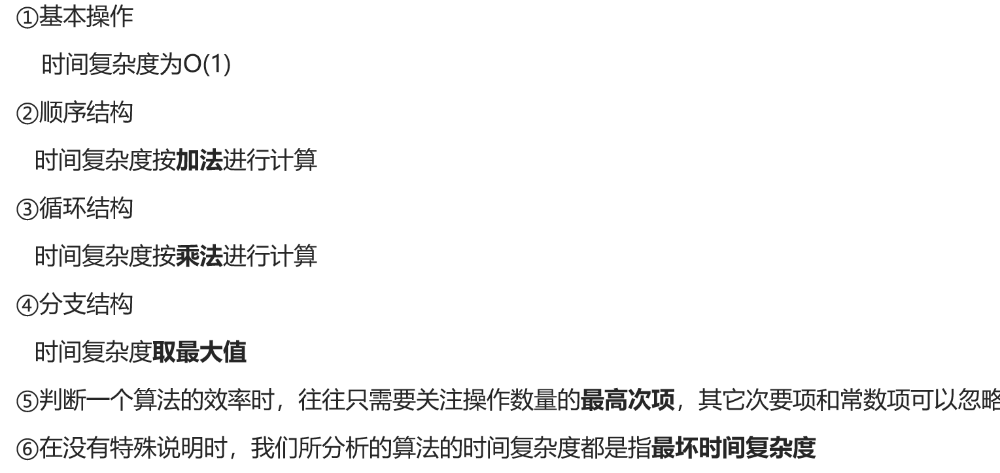
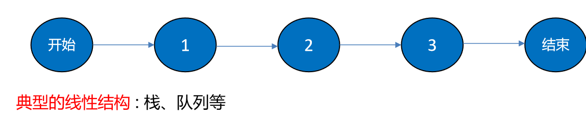
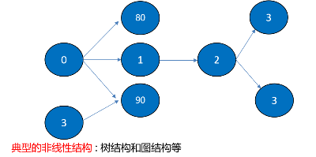
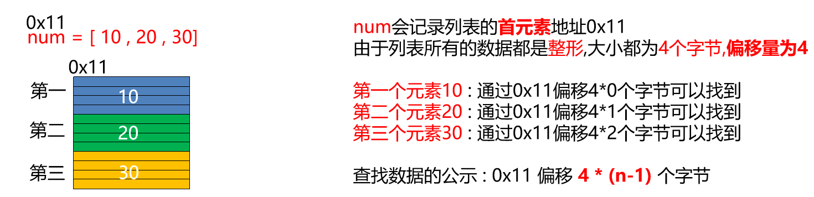
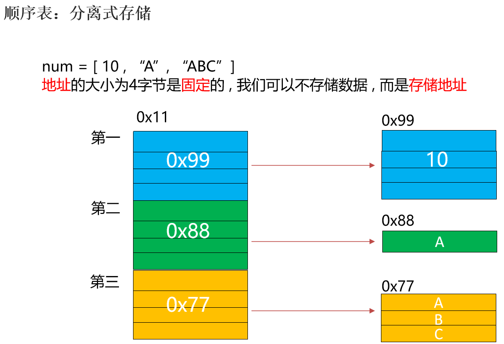

#### 今日内容大纲介绍

* 数据结构介绍
  * 列表
  * 链表
* 算法介绍
  * 排序相关(冒泡, 插入, 选择, 快速排序)

---

#### 1.数据结构和算法简介

* 程序

  大白话翻译, **程序 = 数据结构 + 算法**

* 数据结构

  指的是 **存储, 组织数据的方式.**

* 算法

  指的是 **为了解决实际业务问题而思考 思路和方法, 就叫: 算法.**

#### 2.算法的5大特性介绍

* 算法具有独立性

  算法是解决问题的思路和方式, 最重要的是思维, 而不是语言, 其(算法)可以通过多种语言进行演绎.

* 5大特性

  * 有输入,   需要传入1或者多个参数
  * 有输出,   需要返回1个或者多个结果
  * 有穷性,   执行一定次数循环后, 会自动终止, 不会死循环.
  * 确定性,   每一步都有其具体的含义, 不会出现二义性.
  * 可行性,   每一步都是可执行的, 且会在一定次数后结束.

  ```python
  # 需求1: 演示不同算法 解决相同问题, 观察 算法的优劣.
  
  # 结论: 算法最重要的是思维(即: 解决问题的方式, 思路), 而不是语言.
  
  # 需求: 已知 a + b + c = 1000,  且 a ** 2 + b ** 2 = c ** 2, 问: a, b, c的组合方式有几种?
  import time
  
  # 方式1: 穷举法, 把每个值的每种情况都列举出来.
  start = time.time()
  for a in range(1001):       # a的范围: 0 ~ 1000
      for b in range(1001):
          for c in range(1001):
              # 具体的判断过程.
              if a ** 2 + b ** 2 == c ** 2 and a + b + c == 1000:
                  print(a, b, c)
  end = time.time()
  print(f'共耗时: {end - start} 秒!')         # 122s
  
  # 方式2: 代入法.
  ```

#### 3.衡量算法的时间效率

* 细节

  单纯的依靠时间维度来衡量算法的优劣不一定客观准确, 还要考虑 机器(硬件环境)带来的影响.

* 算法的时间维度横向

  算法的总执行时间 = 操作步骤 * 每步骤执行时间

#### 4.时间复杂度介绍

* 概述

  时间复杂度表示1个算法 **随着问题规模不断变化的 最主要趋势**, 可以用来衡量一个算法的优劣.

  

* 大O标记法

  大O标记法即为: 算法的时间复杂度随数据量变化的关系曲线, 

  将次要关系都省略掉, 只分析**主干(问题规模变化, 直接受影响的)**, 最终形成1个表达式, 这种方式就叫: 大O标记法.

#### 5.时间复杂度计算规则



> **细节: 与问题的大小规模(n)无关, 且操作步骤恒定的算法, 称之为: O(1)复杂度.**
>
> 例如:
>
> ​	a = 100
>
> ​	b = 200
>
> ​	c = a + b
>
> **上述代码, 与问题规模(a, b)无关, 操作步骤都是3步, 所以 上述算法的时间复杂度为: O(1)**

#### 6.最优和最坏时间复杂度介绍

* 最优时间复杂度

  表示算法**最少**需要多少基本步骤, 能完成操作.  是最理想, 最乐观的状态.

* 最坏时间复杂度

  表示算法**最多**需要多少基本步骤, 能完成操作.  是算法的一种保证.

  **默认情况, 我们分析算法, 都是依据: 最坏时间复杂度来分析的.**

#### 7.常见的时间复杂度

* 分类

  * O(1)		常数阶
  * O(logn)   对数阶
  * O(n)         线数阶
  * O(n²)        平方阶
  * O(n³)         立方阶

* 效率高到低分别是

  O(1) > O(logn) > O(n) > O(n logn) > O(n²) > O(n³)

#### 8.空间复杂度介绍(了解)

* 概述

  指的是算法在计算过程中, **临时占用内存空间**的大小.

* 资源占用从低到高分别是

  O(1) > O(logn) > O(n) > O(n logn) > O(n²) > O(n³)

* 扩展:  时空转换

  * 即: 拿时间换空间,  还是拿空间换时间.

#### 9.数据结构的划分

* 概述

  存储, 组织数据的方式.

* 分类

  * 线性结构

    * 特点:  每个节点最多只有1个前驱节点 和 1个后继节点.

    * 代表:  栈, 队列.

      

  * 非线程结构

    * 特点: 每个节点都可以有N个前驱节点 和 N个后继节点.

    * 代表: 树, 图.

      

#### 10.线性结构介绍

* 存储

  线性结构存储数据主要有 **顺序表** 和 **链表**方式

  > **顺序表:** 连续的一块存储空间.
  >
  > **链表**: 不连续的存储空间.

* 顺序表存储方式

  * 一体式存储(**信息区和数据区在一起**)

    

  * 分离式存储(**信息区 和 数据区不在一起**)

    

#### 11.顺序表的存储结构

* 顺序表的存储结构, 分为

  * 信息区

    存顺序表的信息的, 例如: 容量, 元素个数.

  * 数据区

    存储具体的数据的.

* 顺序表扩容思路

  * 每次增加固定的条数目.
    * 消耗时间, 节省空间.  拿时间换空间.
  * 每次容量翻倍.
    * 可能浪费空间, 比较节省时间, 拿 空间换时间, 推荐.
  * 细节
    * 如果是一体式存储, 扩容时需要 **整体搬迁****(因为信息区和数据区在一起)**
    * 如果可用区域不足, 则: 扩容失败.

#### 12.顺序表添加和删除元素

* 添加和删除元素都有三种方式
  * 末尾(添加 或者 删除), 时间复杂度为:  O(1)
  * 中间插入, 不保序, **该场景相对较少.**   时间复杂度为:  O(1)
  * 中间插入, 保序.   时间复杂度: O(n)

#### 13.链表-初始

```python
"""
案例: 自定义代码, 模拟链表.

背景:
    顺序表在存储数据的时候, 需要使用到连续的空间, 如果空间不够, 就会导致扩容失败, 针对于这种情况, 我们可以通过链表实现.
    链表在内存中存储的时候, 可以不是连续的空间, "有地儿就行", 所以: 增删相对更好操作.

链表介绍:
    概述:
        它属于线性结构, 即: 每个节点都只有1个前驱节点 和 1个后继节点.
    组成:
        链表是由节点组成的, 根据节点的不同, 链表又分为: 单向链表, 单向循环链表, 双向链表, 双向循环链表.
        节点划分:
            单向链表, 单向循环链表:
                节点是由 1个数值域 和 1个地址域组成, 也叫: 元素域 和 链接域组成.
            双向链表, 双向循环链表:
                节点是由 1个数值域 和 2个地址域组成, 也叫: 元素域 和 链接域组成.
    划分:
        单向链表:         节点是由 1个数值域 和 1个地址域组成, 最后1个节点的地址域为: None
        单向循环链表:      节点是由 1个数值域 和 1个地址域组成, 最后1个节点的地址域为: 第1个节点的 地址.
        双向链表:         节点是由 1个数值域 和 2个地址域组成, 分别指向前一个节点 和 后一个节点的地址, 第1个节点的前地址域 和 最后1个节点的后地址域为 None
        双向循环链表:      1个数值域, 2个地址域.  第1个节点的前地址域指向最后1个节点的地址, 最后1个节点的后地址域指向第1个节点的 地址.

需求: 通过面向对象思维, 实现自定义链表.

分析流程:
    节点类: SingleNode
        属性:
            item    代表: 数值域
            next    代表: (下个节点的)地址域

    单向链表类: SingleLinkedList:
        属性:
            head    代表: 链表的第一个节点(头结点), 如无, 则为: None
        行为:
            is_empty(self) 链表是否为空
            length(self) 链表长度
            travel(self. ) 遍历整个链表
            add(self, item) 链表头部添加元素
            append(self, item) 链表尾部添加元素
            insert(self, pos, item) 指定位置添加元素
            remove(self, item) 删除节点
            search(self, item) 查找节点是否存在
"""
```

#### 14.自定义代码-模拟链表

```python
"""
案例: 自定义代码, 模拟链表.

背景:
    顺序表在存储数据的时候, 需要使用到连续的空间, 如果空间不够, 就会导致扩容失败, 针对于这种情况, 我们可以通过链表实现.
    链表在内存中存储的时候, 可以不是连续的空间, "有地儿就行", 所以: 增删相对更好操作.

链表介绍:
    概述:
        它属于线性结构, 即: 每个节点都只有1个前驱节点 和 1个后继节点.
    组成:
        链表是由节点组成的, 根据节点的不同, 链表又分为: 单向链表, 单向循环链表, 双向链表, 双向循环链表.
        节点划分:
            单向链表, 单向循环链表:
                节点是由 1个数值域 和 1个地址域组成, 也叫: 元素域 和 链接域组成.
            双向链表, 双向循环链表:
                节点是由 1个数值域 和 2个地址域组成, 也叫: 元素域 和 链接域组成.
    划分:
        单向链表:         节点是由 1个数值域 和 1个地址域组成, 最后1个节点的地址域为: None
        单向循环链表:      节点是由 1个数值域 和 1个地址域组成, 最后1个节点的地址域为: 第1个节点的 地址.
        双向链表:         节点是由 1个数值域 和 2个地址域组成, 分别指向前一个节点 和 后一个节点的地址, 第1个节点的前地址域 和 最后1个节点的后地址域为 None
        双向循环链表:      1个数值域, 2个地址域.  第1个节点的前地址域指向最后1个节点的地址, 最后1个节点的后地址域指向第1个节点的 地址.

需求: 通过面向对象思维, 实现自定义链表.

分析流程:
    节点类: SingleNode
        属性:
            item    代表: 数值域
            next    代表: (下个节点的)地址域

    单向链表类: SingleLinkedList:
        属性:
            head    代表: 链表的第一个节点(头结点), 如无, 则为: None
        行为:
            is_empty(self) 链表是否为空
            length(self) 链表长度
            travel(self. ) 遍历整个链表
            add(self, item) 链表头部添加元素
            append(self, item) 链表尾部添加元素
            insert(self, pos, item) 指定位置添加元素
            remove(self, item) 删除节点
            search(self, item) 查找节点是否存在
"""


# 1. 定义节点类.
class SingleNode(object):
    # 2. 初始化属性.
    def __init__(self, item):
        self.item = item  # 代表: 数值域
        self.next = None  # 代表: (下个节点的)地址域


# 3. 定义单向链表类.
class SingleLinkedList(object):
    # 4. 初始化属性.
    def __init__(self, node=None):
        self.head = node  # head: 代表头结点

    # 如下是: 基于需求, 要完成的具体功能.
    # 5. is_empty(self) 链表是否为空
    def is_empty(self):
        # 思路: 判断头结点(self.head) 是否为 None, 是: 空, 否: 不为空.
        # if self.head == None:
        #     return True
        # else:
        #     return False

        # 思路2: 上述代码的, 三元写法.
        # return True if self.head == None else False

        # 思路3: 最终版, ==的结果本身就是: True 或者 False, 直接返回.
        return self.head == None

    # 6. length(self) 链表长度
    def length(self):
        # 6.1 定义变量 cur, 记录当前节点, 从头结点开始.
        cur = self.head  # current: 当前
        # 6.2 定义count变量, 计数.
        count = 0
        # 6.3 判断当前节点是否为None, 如果不是, 就循环.
        while cur is not None:
            # 6.4 每次循环, 计数器都+1, 然后获取下个节点.
            count += 1
            cur = cur.next  # 获取下个节点.
        # 6.5 走到这里, 循环结束, 即: 链表长度统计完成, 返回结果即可.
        return count

    # 7. travel(self. ) 遍历整个链表
    def travel(self):
        # 7.1 获取头结点, 充当: 当前节点.
        cur = self.head
        # 7.2 只要当前节点不为空, 就一直遍历.
        while cur is not None:
            # 7.3 先打印当前节点的 数值域, 然后获取下个节点.
            print(cur.item)
            cur = cur.next

    # 8. add(self, item) 链表头部添加元素
    def add(self, item):  # item是要添加的元素.
        # 8.1 把要添加的元素封装成 新节点.
        new_node = SingleNode(item)
        # 8.2 用 新节点的地址域 指向 头结点的地址.
        new_node.next = self.head
        # 8.3 设置 新节点为 新的头结点即可.
        self.head = new_node

    # 9. append(self, item) 链表尾部添加元素
    def append(self, item):
        # 9.1 把要添加的元素封装成 新节点.
        new_node = SingleNode(item)

        # 9.2 判断链表是否为空, 如果为空, 则: 新节点直接充当头结点.
        if self.length() == 0:
            self.head = new_node
        else:
            # 9.3 走这里, 链表不为空, 获取链表的最后一个节点即可.
            # 最后1个节点的判断语句: 它的next = None, 它的下个节点是None, 它就是最后1个节点.
            cur = self.head
            while cur.next is not None:
                cur = cur.next
            # 9.4 走到这里, cur.next = None, 即: cur就是最后1个节点.
            # 设置最后1个节点, 地址域指向 新节点的地址即可.
            cur.next = new_node

    # 10. insert(self, pos, item) 指定位置添加元素
    def insert(self, pos, item):  # pos: 要插入的位置(索引), item: 要插入的元素.
        # 10.1 判断插入位置是否 小于等于 0, 如果是, 就: 插入到最前(头部)
        if pos <= 0:
            self.add(item)
        elif pos >= self.length():
            # 10.2 判断插入位置是否 大于等于 链表长度, 如果是, 就: 插入到末尾
            self.append(item)
        else:
            # 10.3 如果是中间插入, 就走如下的逻辑.
            # 10.4 把要插入的元素封装成: 新节点.
            new_node = SingleNode(item)
            # 10.5 定义变量cur, 表示: 插入位置前的那个节点.
            cur = self.head
            # 10.6 定义变量count, 初值为0, 表示插入位置前的哪个"索引"
            count = 0
            # 10.7 只要 count < pos - 1 就一直循环, 并逐个获取下个节点.
            while count < pos - 1:  # 因为我们获取的地址域(即: 下个节点的地址), 只要找到前前对象, 它的地址域, 就是前对象.
                                    # 比如说: 要第2个节点, 只要找到第1个节点即可, 它的地址域(next)就是: 第2个节点.
                cur = cur.next
                count += 1          # 计数器+1
            # 10.8 循环结束后, cur就是要插入位置前的 那个节点. 把它(cur)的地址域赋值 给 新节点的地址域.
            new_node.next = cur.next
            # 10.9 把新节点的 地址 赋值给 cur节点的 地址域.
            cur.next = new_node

    # 11. remove(self, item) 删除节点
    def remove(self):
        pass

    # 12. search(self, item) 查找节点是否存在
    def search(self):
        pass


# 在main方法中做测试.
if __name__ == '__main__':
    # 1. 测试节点类.
    sn = SingleNode('乔峰')
    print(sn)
    print(sn.item)  # 乔峰
    print(sn.next)  # None
    print('-' * 31)

    # 2. 测试链表类.
    # linked_list = SingleLinkedList()
    linked_list = SingleLinkedList(sn)
    print(linked_list.head)  # 头结点.
    # print(linked_list.head.item)  # 头结点的 数值域(元素域): 乔峰
    print('-' * 31)

    # 3. 测试: is_empty(self) 链表是否为空
    print(linked_list.is_empty())
    print('-' * 31)

    # 4. 测试: length(self) 链表长度
    print(linked_list.length())
    print('-' * 31)

    # 5. 测试: travel(self. ) 遍历整个链表
    linked_list.travel()

    # 6. 测试: add(self, item) 链表头部添加元素
    linked_list.add('虚竹')
    linked_list.add('段誉')

    # 7. 测试: append(self, item) 链表尾部添加元素
    linked_list.append('阿朱')
    linked_list.append('梦姑')

    # 8. 测试: insert(self, pos, item) 指定位置添加元素
    linked_list.insert(2, '扫地僧')
    linked_list.insert(5, '无崖子')

    # 9. 测试: remove(self, item) 删除节点
    # 10. 测试: search(self, item) 查找节点是否存在

    print('-' * 31)
    linked_list.travel()  # 段誉, 虚竹, 乔峰, 阿朱, 梦姑
```

