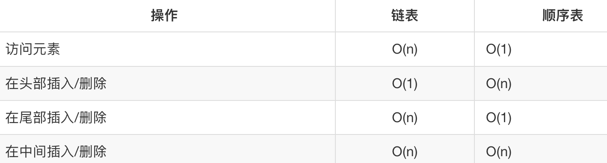
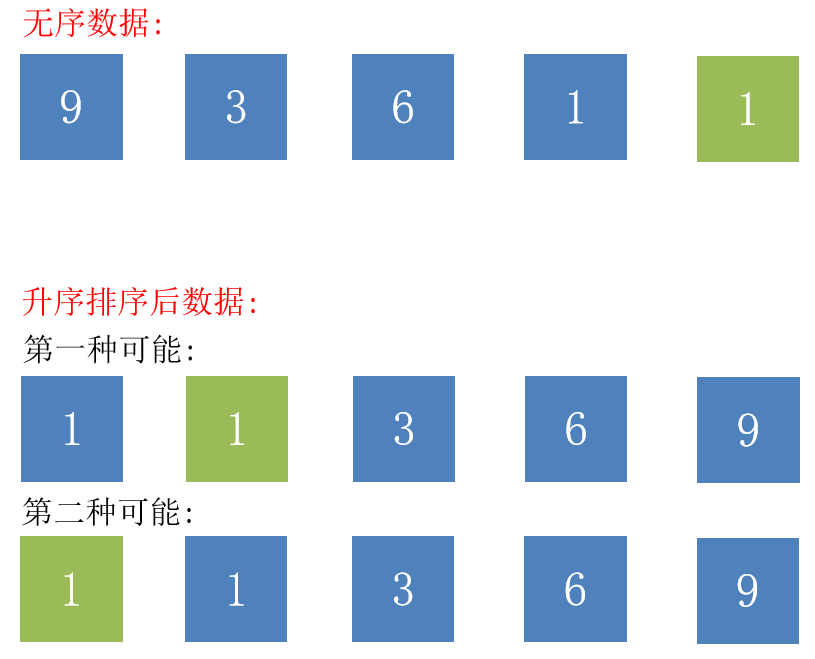
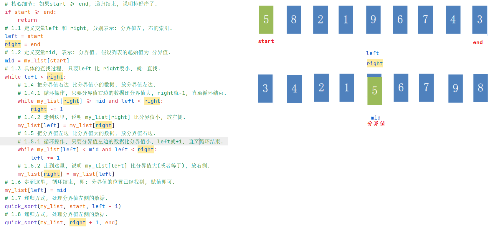
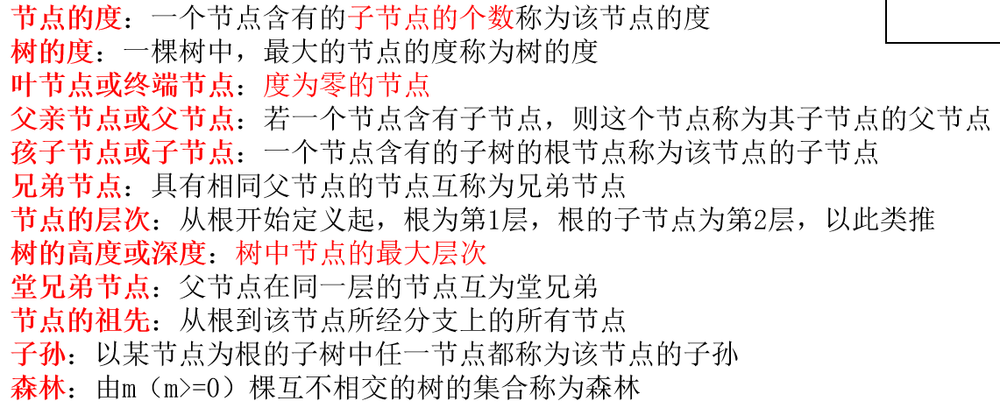
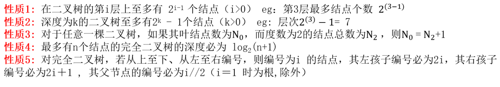
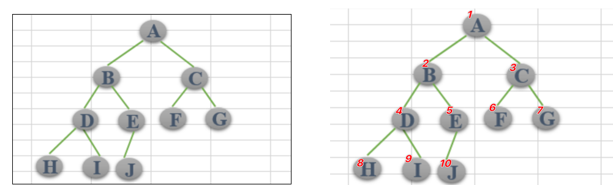

#### 今日内容大纲介绍

* 自定义代码-模拟链表
  * 删除节点
  * 查找节点
* 算法入门-排序类的
  * 冒泡排序
  * 选择排序
  * 插入排序
  * 快速排序
* 算法入门-查找类的
  * 二分查找-递归版
  * 二分查找-非递归版
* 分线性结构-树介绍
  * 基本概述
  * 特点和分类
  * 自定义代码-模拟二叉树

---

#### 1.自定义代码-模拟链表完整版

```python
"""
案例: 自定义代码, 模拟链表.

背景:
    顺序表在存储数据的时候, 需要使用到连续的空间, 如果空间不够, 就会导致扩容失败, 针对于这种情况, 我们可以通过链表实现.
    链表在内存中存储的时候, 可以不是连续的空间, "有地儿就行", 所以: 增删相对更好操作.

链表介绍:
    概述:
        它属于线性结构, 即: 每个节点都只有1个前驱节点 和 1个后继节点.
    组成:
        链表是由节点组成的, 根据节点的不同, 链表又分为: 单向链表, 单向循环链表, 双向链表, 双向循环链表.
        节点划分:
            单向链表, 单向循环链表:
                节点是由 1个数值域 和 1个地址域组成, 也叫: 元素域 和 链接域组成.
            双向链表, 双向循环链表:
                节点是由 1个数值域 和 2个地址域组成, 也叫: 元素域 和 链接域组成.
    划分:
        单向链表:         节点是由 1个数值域 和 1个地址域组成, 最后1个节点的地址域为: None
        单向循环链表:      节点是由 1个数值域 和 1个地址域组成, 最后1个节点的地址域为: 第1个节点的 地址.
        双向链表:         节点是由 1个数值域 和 2个地址域组成, 分别指向前一个节点 和 后一个节点的地址, 第1个节点的前地址域 和 最后1个节点的后地址域为 None
        双向循环链表:      1个数值域, 2个地址域.  第1个节点的前地址域指向最后1个节点的地址, 最后1个节点的后地址域指向第1个节点的 地址.

需求: 通过面向对象思维, 实现自定义链表.

分析流程:
    节点类: SingleNode
        属性:
            item    代表: 数值域
            next    代表: (下个节点的)地址域

    单向链表类: SingleLinkedList:
        属性:
            head    代表: 链表的第一个节点(头结点), 如无, 则为: None
        行为:
            is_empty(self) 链表是否为空
            length(self) 链表长度
            travel(self. ) 遍历整个链表
            add(self, item) 链表头部添加元素
            append(self, item) 链表尾部添加元素
            insert(self, pos, item) 指定位置添加元素
            remove(self, item) 删除节点
            search(self, item) 查找节点是否存在
"""


# 1. 定义节点类.
class SingleNode(object):
    # 2. 初始化属性.
    def __init__(self, item):
        self.item = item  # 代表: 数值域
        self.next = None  # 代表: (下个节点的)地址域


# 3. 定义单向链表类.
class SingleLinkedList(object):
    # 4. 初始化属性.
    def __init__(self, node=None):
        self.head = node  # head: 代表头结点

    # 如下是: 基于需求, 要完成的具体功能.
    # 5. is_empty(self) 链表是否为空
    def is_empty(self):
        # 思路: 判断头结点(self.head) 是否为 None, 是: 空, 否: 不为空.
        # if self.head == None:
        #     return True
        # else:
        #     return False

        # 思路2: 上述代码的, 三元写法.
        # return True if self.head == None else False

        # 思路3: 最终版, ==的结果本身就是: True 或者 False, 直接返回.
        return self.head == None

    # 6. length(self) 链表长度
    def length(self):
        # 6.1 定义变量 cur, 记录当前节点, 从头结点开始.
        cur = self.head  # current: 当前
        # 6.2 定义count变量, 计数.
        count = 0
        # 6.3 判断当前节点是否为None, 如果不是, 就循环.
        while cur is not None:
            # 6.4 每次循环, 计数器都+1, 然后获取下个节点.
            count += 1
            cur = cur.next  # 获取下个节点.
        # 6.5 走到这里, 循环结束, 即: 链表长度统计完成, 返回结果即可.
        return count

    # 7. travel(self. ) 遍历整个链表
    def travel(self):
        # 7.1 获取头结点, 充当: 当前节点.
        cur = self.head
        # 7.2 只要当前节点不为空, 就一直遍历.
        while cur is not None:
            # 7.3 先打印当前节点的 数值域, 然后获取下个节点.
            print(cur.item)
            cur = cur.next

    # 8. add(self, item) 链表头部添加元素
    def add(self, item):  # item是要添加的元素.
        # 8.1 把要添加的元素封装成 新节点.
        new_node = SingleNode(item)
        # 8.2 用 新节点的地址域 指向 头结点的地址.
        new_node.next = self.head
        # 8.3 设置 新节点为 新的头结点即可.
        self.head = new_node

    # 9. append(self, item) 链表尾部添加元素
    def append(self, item):
        # 9.1 把要添加的元素封装成 新节点.
        new_node = SingleNode(item)

        # 9.2 判断链表是否为空, 如果为空, 则: 新节点直接充当头结点.
        if self.length() == 0:
            self.head = new_node
        else:
            # 9.3 走这里, 链表不为空, 获取链表的最后一个节点即可.
            # 最后1个节点的判断语句: 它的next = None, 它的下个节点是None, 它就是最后1个节点.
            cur = self.head
            while cur.next is not None:
                cur = cur.next
            # 9.4 走到这里, cur.next = None, 即: cur就是最后1个节点.
            # 设置最后1个节点, 地址域指向 新节点的地址即可.
            cur.next = new_node

    # 10. insert(self, pos, item) 指定位置添加元素
    def insert(self, pos, item):  # pos: 要插入的位置(索引), item: 要插入的元素.
        # 10.1 判断插入位置是否 小于等于 0, 如果是, 就: 插入到最前(头部)
        if pos <= 0:
            self.add(item)
        elif pos >= self.length():
            # 10.2 判断插入位置是否 大于等于 链表长度, 如果是, 就: 插入到末尾
            self.append(item)
        else:
            # 10.3 如果是中间插入, 就走如下的逻辑.
            # 10.4 把要插入的元素封装成: 新节点.
            new_node = SingleNode(item)
            # 10.5 定义变量cur, 表示: 插入位置前的那个节点.
            cur = self.head
            # 10.6 定义变量count, 初值为0, 表示插入位置前的哪个"索引"
            count = 0
            # 10.7 只要 count < pos - 1 就一直循环, 并逐个获取下个节点.
            while count < pos - 1:  # 因为我们获取的地址域(即: 下个节点的地址), 只要找到前前对象, 它的地址域, 就是前对象.
                                    # 比如说: 要第2个节点, 只要找到第1个节点即可, 它的地址域(next)就是: 第2个节点.
                cur = cur.next
                count += 1          # 计数器+1
            # 10.8 循环结束后, cur就是要插入位置前的 那个节点. 把它(cur)的地址域赋值 给 新节点的地址域.
            new_node.next = cur.next
            # 10.9 把新节点的 地址 赋值给 cur节点的 地址域.
            cur.next = new_node

    # 11. remove(self, item) 删除节点
    def remove(self, item):
        # 11.1 定义变量cur, 代表: 当前节点, 即: 要删除的节点.
        cur = self.head
        # 11.2 定义变量pre(previous), 代表: 当前节点的前一个节点.
        pre = None
        # 11.3 遍历链表, 获取到每个节点.
        while cur is not None:
            # 11.4 判断当前节点的 数值域 是否和要被删除的内容一致.
            if cur.item == item:
                # 11.5 如果一致, 判断当前节点是否是头结点, 是, 就直接指向它的地址域(第2个节点)即可.
                if cur == self.head:
                    self.head = cur.next        # 如果要删头结点, 直接让 head指向 第2个节点即可.
                else:
                    # 11.6 如果要删除的节点不是头结点,
                    pre.next = cur.next
                # 核心细节: 删除完毕后, 记得: break, 结束删除操作.
                break
            else:
                # 11.6 如果不一致, 当前就是(前1个节点了), 然后当前节点为: 它的下个节点.
                pre = cur       # 当前节点: 就是下次判断的 前个节点
                cur = cur.next  # 当前节点: 变更为它的下个节点.

    # 12. search(self, item) 查找节点是否存在
    def search(self, item):
        # 12.1 定义变量cur, 表示当前节点, 默认从: 头结点开始.
        cur = self.head
        # 12.2 遍历链表, 获取到每个节点.
        while cur is not None:
            # 12.3 判断当前节点的数值域 是否和 要查找的值一致, 如果一致, 就返回True
            if cur.item == item:
                return True
            # 12.4 如果没找到, 当前节点就变更为: 它的下个节点
            cur = cur.next

        # 12.5 走到这里, 循环结束, 表示没有找到. 返回False即可.
        return False

# 在main方法中做测试.
if __name__ == '__main__':
    # 1. 测试节点类.
    sn = SingleNode('乔峰')
    print(sn)
    print(sn.item)  # 乔峰
    print(sn.next)  # None
    print('-' * 31)

    # 2. 测试链表类.
    # linked_list = SingleLinkedList()
    linked_list = SingleLinkedList(sn)
    print(linked_list.head)  # 头结点.
    # print(linked_list.head.item)  # 头结点的 数值域(元素域): 乔峰
    print('-' * 31)

    # 3. 测试: is_empty(self) 链表是否为空
    print(linked_list.is_empty())
    print('-' * 31)

    # 4. 测试: length(self) 链表长度
    print(linked_list.length())
    print('-' * 31)

    # 5. 测试: travel(self. ) 遍历整个链表
    linked_list.travel()

    # 6. 测试: add(self, item) 链表头部添加元素
    linked_list.add('虚竹')
    linked_list.add('段誉')

    # 7. 测试: append(self, item) 链表尾部添加元素
    linked_list.append('阿朱')
    linked_list.append('梦姑')

    # 8. 测试: insert(self, pos, item) 指定位置添加元素
    linked_list.insert(2, '扫地僧')
    linked_list.insert(5, '无崖子')

    # 9. 测试: remove(self, item) 删除节点
    # linked_list.remove('虚竹')
    linked_list.remove('阿朱')

    # 10. 测试: search(self, item) 查找节点是否存在
    # print(linked_list.search('扫地僧'))
    # print(linked_list.search('萧远山'))

    print('-' * 31)
    linked_list.travel()  # 段誉, 虚竹, 乔峰, 阿朱, 梦姑

```

#### 2.顺序表和链表对比

* 特点

  * 顺序表
    * 存储要占用连续的空间, 占用少量资源.
    * 元素有索引, 可以根据索引值快速查找对应内容.
    * 扩容时, 如果可用(连续空间)资源不足, 可能会导致扩容失败.
  * 链表
    * 存储无需连续空间, 有地儿就行. 
    * 因为既要存储数据, 也要存储下个节点的地址, 所以相对较消耗资源.
    * 元素无索引, 每次查找(头结点除外)都需要遍历.
    * 扩容时, 资源充足即可, 是否连续无所谓.

* 对比图

  

#### 3.算法的稳定性介绍

* 概述

  * 排序类算法有稳定性 和  不稳定性两者之分.

  * 区分依据是: 对数据进行排序后, 相同元素的 相对位置是否发生改变.

    * 改变: 不稳定算法.
    * 不改变: 稳定算法.

    

* 例如:

  * 稳定算法: 冒泡排序, 插入排序...
  * 不稳定算法: 选择排序, 快速排序...

#### 4.冒泡排序-代码实现

```python
"""
排序类算法有稳定性 和 不稳定性区分:
    依据: 排序后, 相同元素的相对位置是否发生改变.
    改变: 不稳定算法.
    不改变: 稳定算法.

冒泡排序介绍:
    原理:
        相邻元素两两比较, 大的往后走, 这样第一轮比较完毕后, 最大值就在最大索引处.
        重复此步骤, 直至任意相邻两元素无需交换, 排序完毕.
    推理思路:
        比较的轮数           每轮比较的次数             公式
            0                   4                   5 - 1 - 0       # 0表示: 第1轮,  4表示: 第1轮比较的总次数.  5表示: 列表长度.
            1                   3                   5 - 1 - 1
            2                   2                   5 - 1 - 2
            3                   1                   5 - 1 - 3

    核心3点:
        1. 比较的轮数.       列表的长度 - 1       for i in range(n - 1):
        2. 每轮比较次数.     列表长度 - 1 - 轮数   for j in range(n - 1 - i):
        3. 谁和谁交换.       j索引 和 j+1索引  对应的元素, 比较, 然后决定是否交换.
"""

# 1. 定义函数 bubble_sort(my_list), 实现: 对列表元素 升序排列.
def bubble_sort(my_list):   # 回顾: 如果参数是可变类型, 则: 形参的改变, 直接影响实参.
    # 1.1 获取列表的长度.
    n = len(my_list)
    # 1.2 定义外循环, 表示: 比较的轮数.
    for i in range(n - 1):      # i就代表比较的轮数,  0, 1, 2, 3        分别代表: 第1轮, 第2轮, 第3轮, 第4轮
        count = 0       # 记录: 具体的交换次数
        # 1.3 定义内循环, 表示: 每轮比较的次数.
        for j in range(n - 1 - i):
            # 1.4 相邻元素两两比较, 如果前边元素 比 后边元素大, 就交换.
            if my_list[j] > my_list[j + 1]:
                count += 1      # 如果有交换, 计数器就 + 1
                # 具体的交换过程, 即:  a, b = b, a
                my_list[j], my_list[j + 1] = my_list[j + 1], my_list[j]

        if count == 0:  # 说明无需交换, 即: 本身就是有序数据.
            break


# 在main函数中测试.
if __name__ == '__main__':
    # 1. 创建列表, 记录要排序的元素.
    my_list = [11, 3, 22, 55, 66]
    # my_list = [3, 11, 22, 55, 66]

    # 2. 打印排序前的元素.
    print(f'排序前: {my_list}')
    # 3. 调用函数, 实现排序.
    bubble_sort(my_list)
    # 4. 打印排序后的结果.
    print(f'排序后: {my_list}')
```

#### 5.选择排序-代码实现

```python
"""
排序类算法有稳定性 和 不稳定性区分:
    依据: 排序后, 相同元素的相对位置是否发生改变.
    改变: 不稳定算法.
    不改变: 稳定算法.

选择排序介绍:
    原理:
        第1轮操作: 假设列表的第1个元素是最小值, 然后去剩下所有元素中找"真正的最小值", 只要找到的最小值 比 第1个元素值小, 就交换.
                  这样能保证, 第1轮操作完毕后, 最小值就在最小索引处.

        第2轮操作: 假设列表的第2个元素是最小值,  然后去剩下所有元素中找"真正的最小值", 只要找到的最小值 比 第2个元素值小, 就交换.
                  这样能保证, 第2轮操作完毕后, 次小值就在次小索引处.
        .......
        依次查找列表中的最小值, 依次填充到列表的最小索引处, 直至结束.

    推理思路:
        比较的轮数           每轮比较的次数             公式
            0                   4                   0和1, 0和2, 0和3, 0和4
            1                   3                   1和2, 1和3, 1和4
            2                   2                   2和3, 2和4
            3                   1                   3和4

    核心3点:
        1. 比较的轮数.       列表的长度 - 1       for i in range(n - 1):
        2. 每轮比较次数.      i + 1 ~ 列表最后1个元素
        3. 谁和谁交换.       i索引 和 j索引  对应的元素, 比较, 然后决定是否交换.
"""

# 1. 定义函数 select_sort(my_list), 实现: 对列表元素 升序排列.
def select_sort(my_list):   # 回顾: 如果参数是可变类型, 则: 形参的改变, 直接影响实参.
    # 1.1 获取列表的长度.
    n = len(my_list)
    # 1.2 定义外循环, 表示: 比较的轮数.
    for i in range(n - 1):      # i就代表比较的轮数,  0, 1, 2, 3        分别代表: 第1轮, 第2轮, 第3轮, 第4轮
        # 1.3 定义变量, min_index 代表: 最小值的索引.
        min_index = i
        # 1.4. 定义内循环, 获取: 所有要比较(待排序的数字)
        for j in range(i + 1, n):
            # 1.5 具体的比较过程
            if my_list[j] < my_list[min_index]:
                min_index = j       # 用min_index 记录最小值的索引.

        # 1.6 走到这里, 说明一轮结束, 判断 min_index(真正的最小值的索引) 和 i是否一致, 不一致, 就交换.
        if min_index != i:
            my_list[i], my_list[min_index] = my_list[min_index], my_list[i]


# 在main函数中测试.
if __name__ == '__main__':
    # 1. 创建列表, 记录要排序的元素.
    my_list = [11, 3, 22, 55, 66]
    # my_list = [3, 11, 22, 55, 66]

    # 2. 打印排序前的元素.
    print(f'排序前: {my_list}')
    # 3. 调用函数, 实现排序.
    select_sort(my_list)
    # 4. 打印排序后的结果.
    print(f'排序后: {my_list}')

```

#### 6.插入排序-代码实现

```python
"""
排序类算法有稳定性 和 不稳定性区分:
    依据: 排序后, 相同元素的相对位置是否发生改变.
    改变: 不稳定算法.
    不改变: 稳定算法.

插入排序介绍:
    原理:
        把列表分成两部分, 假设第1个元素是 有序列表, 之后的元素是无序列表, 然后遍历, 获取到"无序列表"中每个元素,
        然后依次和"有序列表"的元素比较, 决定其存放位置, 直至: 所有的"无序列表"元素操作完毕.

    推理思路:
        比较的轮数           每轮比较的次数             公式(下述都是索引)
            1                   1                   1和0
            2                   2                   2和1, 2和0
            3                   3                   3和2, 3和1, 3和0
            4                   4                   4和3, 4和2, 4和1, 4和0

    核心3点:
        1. 比较的轮数.       列表的长度 - 1       for i in range(1, n):
        2. 每轮比较次数.      等于轮数.           for j in range(i, 0, -1)
        3. 谁和谁交换.       索引 j 和 j-1比较
"""


# 1. 定义函数 insert_sort(my_list), 实现: 对列表元素 升序排列.
def insert_sort(my_list):  # 回顾: 如果参数是可变类型, 则: 形参的改变, 直接影响实参.
    # 1.1 获取列表的长度.
    n = len(my_list)
    # 1.2 定义外循环, 表示: 比较的轮数.
    for i in range(1, n):  # i就代表比较的轮数, 1, 2, 3, 4        分别代表: 第1轮, 第2轮, 第3轮, 第4轮
        # 1.3 获取每轮具体要比较的数据.
        for j in range(i, 0, -1):  # range(起始值, 结束值, 步长), 包括: 起始值, 不包括结束值. 所以这里写0, j的值, 最小为: 1
            # 1.4 具体的比较过程,  索引 j 和 j-1比较
            if my_list[j] < my_list[j - 1]:
                my_list[j], my_list[j - 1] = my_list[j - 1], my_list[j]
            else:
                break


# 在main函数中测试.
if __name__ == '__main__':
    # 1. 创建列表, 记录要排序的元素.
    my_list = [11, 3, 22,  66, 55]
    # my_list = [3, 11, 22, 55, 66]

    # 2. 打印排序前的元素.
    print(f'排序前: {my_list}')
    # 3. 调用函数, 实现排序.
    insert_sort(my_list)
    # 4. 打印排序后的结果.
    print(f'排序后: {my_list}')
```

#### 7.快速排序-代码实现

```python
"""
排序类算法有稳定性 和 不稳定性区分:
    依据: 排序后, 相同元素的相对位置是否发生改变.
    改变: 不稳定算法.
    不改变: 稳定算法.

插入排序介绍:
    原理:
       (1)首先设定一个分界值，通过该分界值将数组分成左右两部分
        (2)将大于或等于分界值的数据集中到数组右边，小于分界值的数据集中到数组的左边
        此时，左边部分中各元素都小于或等于分界值，而右边部分中各元素都大于或等于分界值
        (3)然后，左边和右边的数据可以独立排序。对于左侧的数组数据，又可以取一个分界值，
        将该部分数据分成左右两部分，同样在左边放置较小值，右边放置较大值。右侧的数组数据也做类似处理
        (4)重复上述过程，可以看出，这是一个递归定义。通过递归将左侧部分排好序后，再递归排好右侧部分的顺序
        当左、右两个部分各数据排序完成后，整个数组的排序也就完成了
    大白话解释:
        第1轮: 1个分界值, 假设第1个元素为分界值, 次数: 比该值小的的都放左边, 比该值大于或者等于 放右边.        小   分界  大
        第2轮: 2个分界值, 上一轮分界值左边数据 找个分界值.   上一轮分界值右边数据 找个分界值
        第3轮: 4个分界值... 以此类推.
        ......
        递归思想, 每次需要传入: 列表, 起始位置, 结束位置
"""


# 1. 定义函数 quick_sort(my_list), 实现: 对列表元素 升序排列.
def quick_sort(my_list, start, end):    # start: 0, end: 列表长度-1
    """
    快速排序思路, 实现对列表元素排序
    :param my_list: 要操作的列表
    :param start: 操作的数据, 起始索引
    :param end:   操作的数据, 结束索引
    :return:
    """
    # 核心细节: 如果start >= end, 递归结束, 说明排好序了.
    if start >= end:
        return
    # 1.1 定义变量left 和 right, 分别表示: 分界值左, 右的索引.
    left = start
    right = end
    # 1.2 定义变量mid, 表示: 分界值, 假设列表的起始值为 分界值.
    mid = my_list[start]
    # 1.3 具体的查找过程, 只要left 比 right要小, 就一直找.
    while left < right:
        # 1.4 把分界值右边 比分界值小的数据, 放分界值左边.
        # 1.4.1 循环操作, 只要分界值右边的数据比分界值大, right就-1, 直至循环结束.
        while my_list[right] >= mid and left < right:
            right -= 1
        # 1.4.2 走到这里, 说明 my_list[right] 比分界值小, 放左侧.
        my_list[left] = my_list[right]
        # 1.5 把分界值左边 比分界值大的数据, 放分界值右边.
        # 1.5.1 循环操作, 只要分界值左边的数据比分界值小, left就+1, 直至循环结束.
        while my_list[left] < mid and left < right:
            left += 1
        # 1.5.2 走到这里, 说明 my_list[left] 比分界值大(或者等于), 放右侧.
        my_list[right] = my_list[left]
    # 1.6 走到这里, 循环结束, 即: 分界值的位置已经找到, 赋值即可.
    my_list[left] = mid
    # 1.7 递归方式, 处理分界值左侧的数据.
    quick_sort(my_list, start, left - 1)
    # 1.8 递归方式, 处理分界值左侧的数据.
    quick_sort(my_list, right + 1, end)


# 在main函数中测试.
if __name__ == '__main__':
    # 1. 创建列表, 记录要排序的元素.
    my_list = [11, 3, 22,  66, 55]
    # my_list = [3, 11, 22, 55, 66]

    # 2. 打印排序前的元素.
    print(f'排序前: {my_list}')
    # 3. 调用函数, 实现排序.
    quick_sort(my_list, 0, len(my_list) - 1)
    # 4. 打印排序后的结果.
    print(f'排序后: {my_list}')

```



#### 8.递归版-二分查找

```python
"""
二分查找介绍:
    概述:
        它是一个经典的查找类算法, 效率相对较高.
    前提:
        数据必须是有序的.
    原理:
        1. 找到中间值, 然后看要查找的值, 和中间值的关系.
        2. 如果和中间值相等, 直接返回即可.
        3. 如果比中间值小: 去前边找.
        4. 如果比中间值大: 去后边找.
"""


# 1. 定义函数 binary_search(my_list, item), 实现: 二分查找.
def binary_search(my_list, item):
    """
    自定义代码, 实现: 二分查找,  递归版.
    :param my_list: 记录数据的列表
    :param item: 要被查找的元素
    :return: True找到了, False没找到.
    """
    # 1.1 获取列表的长度.
    n = len(my_list)

    # 1.2 如果列表为空, 直接返回False
    if n <= 0:
        return False

    # 1.3 获取中间值(的索引), 列表长度 // 2
    mid = n // 2

    # 1.4 判断要找的值, 是否等于中值, 如果等, 就直接返回True
    if item == my_list[mid]:
        return True
    elif item < my_list[mid]:
        # 1.5 如果要找的值比中间值小, 就往 中值前找.
        return binary_search(my_list[:mid], item)
    else:
        # 1.6 走到这里, 说明要找的值比中间值大, 就往 中值后找.
        return binary_search(my_list[mid + 1:], item)

    # 1.5 走到这里, 说明列表元素都遍历完了, 还没找到, 返回False即可.
    return False


# 在main中测试
if __name__ == '__main__':
    # 2. 创建列表, 必须有序.
    my_list = [2, 9, 13, 25, 33, 45, 56, 66, 71, 92, 99]
    # 3. 测试二分查找.
    print(binary_search(my_list, 10))
    print(binary_search(my_list, 33))
```

#### 9.非递归版-二分查找

```python
"""
二分查找介绍:
    概述:
        它是一个经典的查找类算法, 效率相对较高.
    前提:
        数据必须是有序的.
    原理:
        1. 找到中间值, 然后看要查找的值, 和中间值的关系.
        2. 如果和中间值相等, 直接返回即可.
        3. 如果比中间值小: 去前边找.
        4. 如果比中间值大: 去后边找.
"""


# 1. 定义函数 binary_search(my_list, item), 实现: 二分查找. 非递归版.
def binary_search(my_list, item):
    """
    自定义代码, 实现: 二分查找,  递归版.
    :param my_list: 记录数据的列表
    :param item: 要被查找的元素
    :return: True找到了, False没找到.
    """
    # 1. 定义变量start 和 end, 分别记录: 要查找的列表的范围.
    start = 0
    end = len(my_list) - 1

    # 2. 循环实现查找, 只要 start <= end 就一直查找.
    while start <= end:
        # 3. 计算中间索引, 每次操作范围变化, 中间索引都要改变.
        mid = (start + end) // 2

        # 4. 判断要找的元素 和 中间值是否相等.
        if item == my_list[mid]:
            return True
        elif item < my_list[mid]:
            # 比中间值小, 就修改 end的值.
            end = mid - 1
        else:
            # 比中间值大, 就修改start的值.
            start = mid + 1

    # 5. 走到这里, 说明找完了, 还没找到, 就返回False
    return False


# 在main中测试
if __name__ == '__main__':
    # 2. 创建列表, 必须有序.
    my_list = [2, 9, 13, 25, 33, 45, 56, 66, 71, 92, 99]
    # 3. 测试二分查找.
    print(binary_search(my_list, 10))
    print(binary_search(my_list, 33))

```

#### 10.树形结构介绍

* 概述

  它属于 非线性结构, 每个节点都可以有1个父节点, n个子节点.

* 特点

  1. 树形结构的根节点有且只能有 1个.
  2. 每个节点都只有1个父节点及任意个子节点, 根节点除外(它没有父节点)
  3. 没有子节点的节点称之为: 叶子节点.

* 树相关名词

  

#### 11.树的种类和存储

* 分类
  * 有序树
  * 无序树
* 常用的树
  * 完全二叉树
  * 满二叉树
  * 平衡二叉树
* 树的存储
  * 采用列表(数组)来存储, 占用空间, 存数据 和 对应关系.
  * 采用链表来存储, 采用节点形式, 1个数值域, 2个地址域分别指向2个子节点.

#### 12.二叉树的性质

* 几个维度的计算方式

  

  

#### 13.自定义代码-模拟二叉树

```python
# 案例: 链表形式模拟二叉树.


# 1. 定义节点类.
class Node:
    def __init__(self, item):
        self.item = item        # 节点的内容.
        self.lchild = None      # 节点的: 左子树
        self.rchild = None      # 节点的: 右子树


# 2. 定义二叉树类
class BinaryTree:
    def __init__(self, root = None):
        self.root = root        # 充当: 根节点, 等价于之前 链表的时候的 self.head(头结点)

    # 3. 添加元素
    def add(self, item):
        # 3.1 判断 根节点是否为空, 如果为空, 当前节点即为: 根节点.
        if self.root == None:
            self.root = Node(item)
            return

        # 3.2 定义列表(充当: 队列), 把根节点添加到: 队列中.
        queue = []
        queue.append(self.root)

        # 3.3 循环判断, 哪个节点的左子树 或者 右子树为空, 就把新节点添加到哪里.
        while True:
            # 3.3 从队列中获取到 根节点.
            node = queue.pop(0)
            # 3.5 判断当前节点的 左子树是否为空.
            if node.lchild == None:
                # 左子树为空, 新节点添加到这里, 程序结束.
                node.lchild = Node(item)
                return
            else:
                # 左子树不为空, 就添加到: 队列中.
                queue.append(node.lchild)

            # 3.6 判断当前节点的 右子树是否为空.
            if node.rchild == None:
                # 右子树为空, 新节点添加到这里, 程序结束.
                node.rchild = Node(item)
                return
            else:
                # 右子树不为空, 就添加到: 队列中.
                queue.append(node.rchild)


    # 4. 遍历二叉树, 广度优先: 逐层获取.
    def breadth_travel(self):
        # 4.1 判断如果根结点为空, 直接return
        if self.root == None:
            return

        # 4.2 定义队列, 记录节点.
        queue = []
        # 4.3 添加根节点到队列中.
        queue.append(self.root)

        # 4.4 循环获取, 只要队列有数据(节点), 就循环获取.
        while len(queue) > 0:
            # 4.5 获取节点信息.
            node = queue.pop(0)
            # 4.6 打印节点内容.
            print(node.item, end=' ')

            # 4.7 判断当前节点是否有 左子树, 有就添加到 队列.
            if node.lchild != None:
                queue.append(node.lchild)

            # 4.8 判断当前节点是否有 左子树, 有就添加到 队列.
            if node.rchild != None:
                queue.append(node.rchild)


    # 5. 遍历二叉树, 深度优先: 前序(根左右)
    def preorder_travel(self, root):    # 节点.
        # 5.1 判断节点是否不为空, 不为空就输出内容.
        if root is not None:
            print(root.item, end=' ')                    # 根
            self.preorder_travel(root.lchild)   # 递归获取 左子树
            self.preorder_travel(root.rchild)   # 递归获取 右子树

    # 6. 遍历二叉树, 深度优先: 中序(左根右)
    def inorder_travel(self, root):
        # 6.1 判断节点是否不为空, 不为空就输出内容.
        if root is not None:
            self.inorder_travel(root.lchild)  # 递归获取 左子树
            print(root.item, end=' ')  # 根
            self.inorder_travel(root.rchild)  # 递归获取 右子树

    # 7. 遍历二叉树, 深度优先: 后序(左右根)
    def postorder_travel(self, root):
        # 7.1 判断节点是否不为空, 不为空就输出内容.
        if root is not None:
            self.postorder_travel(root.lchild)  # 递归获取 左子树
            self.postorder_travel(root.rchild)  # 递归获取 右子树
            print(root.item, end=' ')  # 根

# 3. 定义函数 dm01_演示创建节点和二叉树()
def dm01_演示创建节点和二叉树():
    # 3.1 创建节点.
    node = Node('乔峰')
    # 3.2 打印节点的信息.
    print(node.item)        # 内容
    print(node.lchild)      # 左子树
    print(node.rchild)      # 右子树
    print('-' * 31)

    # 3.2 创建二叉树
    bt = BinaryTree(node)
    print(bt.root)          # 打印 根节点 的地址
    print(bt.root.item)     # 打印 根节点 的内容

# 4. 测试队列  queue.
def dm02_测试队列():    # 即: 模拟先进先出.
    # 4.1 创建队列.
    queue = []

    # 4.2 添加元素.
    queue.append('A')
    queue.append('B')
    queue.append('C')

    # 4.3 获取队列最前的元素.
    print(queue.pop(0)) # ['A', 'B', 'C'] => A
    print(queue.pop(0)) # ['B', 'C'] => B
    print(queue.pop(0)) # ['C'] => C

# 5. 测试广度优先.
def dm03_广度优先():
    # 5.1 创建二叉树.
    bt = BinaryTree()
    # 5.2 添加元素.
    bt.add('A')
    bt.add('B')
    bt.add('C')
    bt.add('D')
    bt.add('E')
    bt.add('F')
    bt.add('G')
    # 5.3 遍历, 广度优先.
    bt.breadth_travel()

# 6. 测试深度优先
def dm04_深度优先():
    bt = BinaryTree()
    bt.add(0)
    bt.add(1)
    bt.add(2)
    bt.add(3)
    bt.add(4)
    bt.add(5)
    bt.add(6)
    bt.add(7)
    bt.add(8)
    bt.add(9)

    # 测试前序
    print("前序结果为: ")
    bt.preorder_travel(bt.root) # 传入根节点, 从根节点开始找.

    print("\n中序结果为: ")
    bt.inorder_travel(bt.root)  # 传入根节点, 从根节点开始找.

    print("\n后序结果为: ")
    bt.postorder_travel(bt.root)  # 传入根节点, 从根节点开始找.


# 7. 在main中测试.
if __name__ == '__main__':
    # dm01_演示创建节点和二叉树()
    # dm02_测试队列()
    # dm03_广度优先()
    dm04_深度优先()

```

