#### 今日内容大纲介绍

* 计算机简介
* Linux系统介绍
* Linux环境搭建
* Linux基础命令

---

#### 1.计算机简介

* 概述

  全称叫电子计算机, 英文名叫Computer, 俗称叫: 电脑, 简称叫: PC, 就是有**硬件**和**软件**组成的电子设备.

* 组成

  * 计算机硬件
    * CPU, 中央处理器, 由 运算器 + 控制器 组成
    * 存储器
      * 内存: 内存条, DDR4, 3233睿频,  8G... 
      * 外存: 硬盘(SSD,  HSD, HDD), U盘, 光盘...
  * 计算机软件
    * 系统软件: windows...
    * 应用软件:  微信, QQ...

* 操作系统介绍

  * 作用
    * 负责用户 和 计算机硬件之间, 沟通交流的 桥梁.
  * 分类
    * 移动端: Android, IOS, 鸿蒙...
    * PC端: windows, Mac, Linux...

#### 2.Linux系统介绍

* 概述

  * 年份: 1991年, 作者上大学期间做处理来的.
  * 作者: 林纳斯·托瓦兹
  * 吉祥物: 企鹅

* 内核下载地址:

  https://mirrors.edge.kernel.org/pub/linux/kernel/

* Linux发行版介绍

  > 背景: Linux内核是免费的, 不同公司都可以基于内核封装自己的 系统库 和 系统软件.

  * Linux发行版 = **Linux内核(林纳斯团队维护) + 系统库 + 系统软件**

  * 常用的Linux发行版

    * RedHat: IBM公司, 功能强大, 收费版. 

    * CentOS: IBM公司, 可以理解为"RedHat"的阉割版.

    * Ubantu: 界面做的不错, 适合初学者. 

    * 国内: 中标麒麟, 红旗..

      > 我们课程中用 **CentOS 7.X**

#### 3.虚拟化软件介绍

* 虚拟化软件

  * 通过软件实现, 基于计算机硬件, 模拟出操作系统, 相当于**帮我们买电脑.**

* 常用的

  * Vmware:  我们用这个, 建议装**Vmware17.**
  * Virtual Box: 轻量级的, Sun公司的.

* 虚拟机

  * 通过虚拟化软件, 模拟出来的"电脑", 可以在上边装操作系统, 应用软件等...

    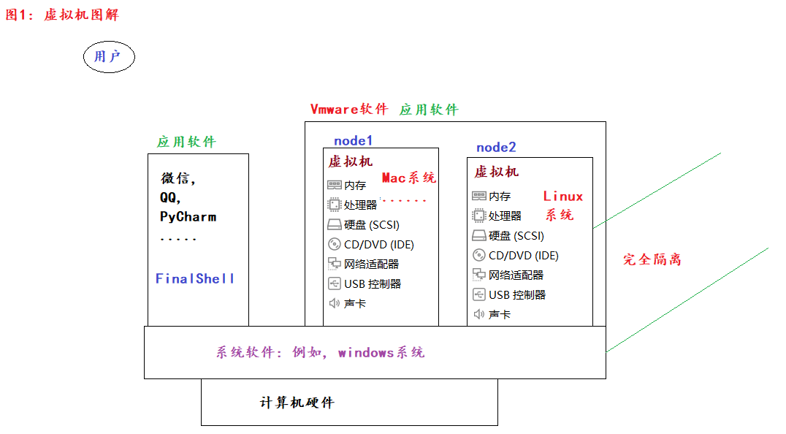

#### 4.Linux环境搭建

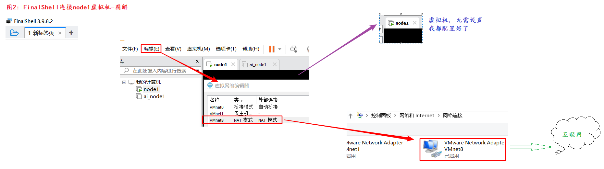

1. 安装虚拟化软件, Vmware17

   > 参考安装文档, 傻瓜式安装, 下一步下一步即可. 
   >
   > 建议安装路径要合法, 不要出现中文, 空格, 特殊符号等.

   * 如何校验安装成功?

   * 详见下图: 本机出现VMNet1 和 VMNet8两个网卡即可.

     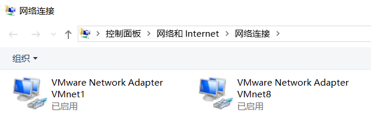

2. 安装虚拟机

   * 方式1: 手动安装.  

     * 详见讲义, 除了**配置静态IP动作不一致**以外, 其它都一样.

       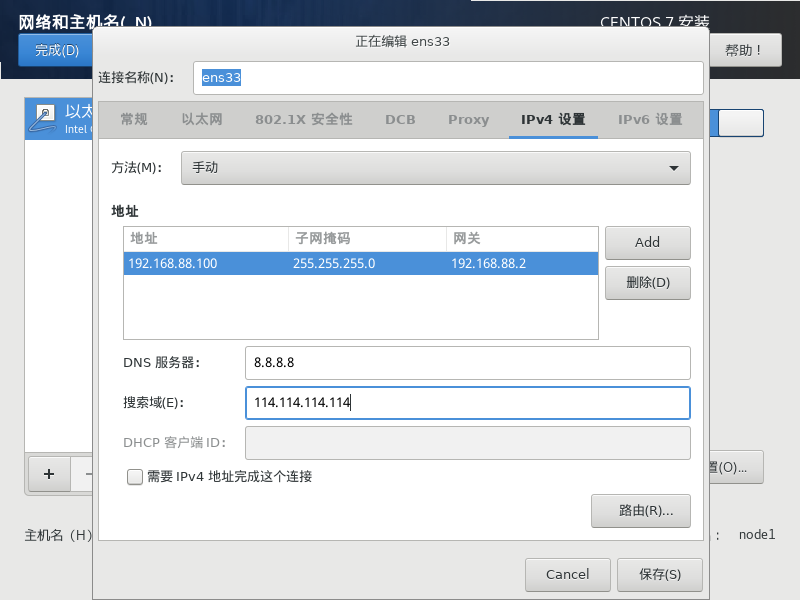

   * 方式2: 直接挂载我给的虚拟机.

     * 虚拟机的硬件要求:  建议 4核8线程, 8G内存起.    也可以2核 4线程(2C4T Core Thread),  4G内存起...

     * 双击 *.vmx, 挂载即可.

     * **账号: root**

     * **密码: 123456**

     * 首次启动, 请选择"我已移动".

       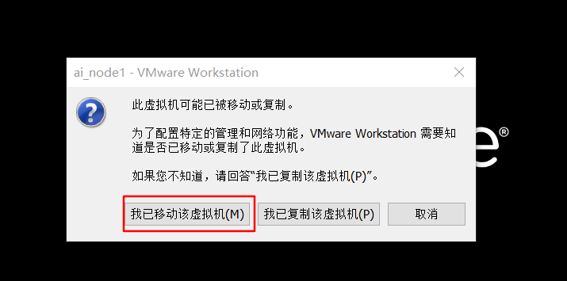

3. 安装远程连接工具FinalShell, 连接node1虚拟机

   1. 安装Finalshell工具.

   2. 修改**Vmware软件的: 虚拟网络编辑器.**

      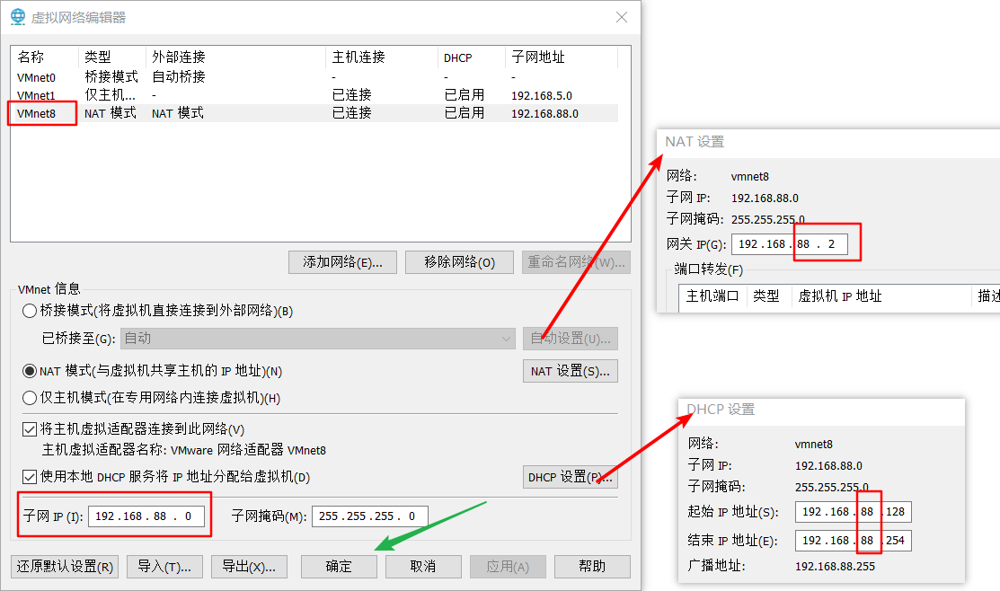

   3. 修改**windows本地VMNet8网卡**信息.

      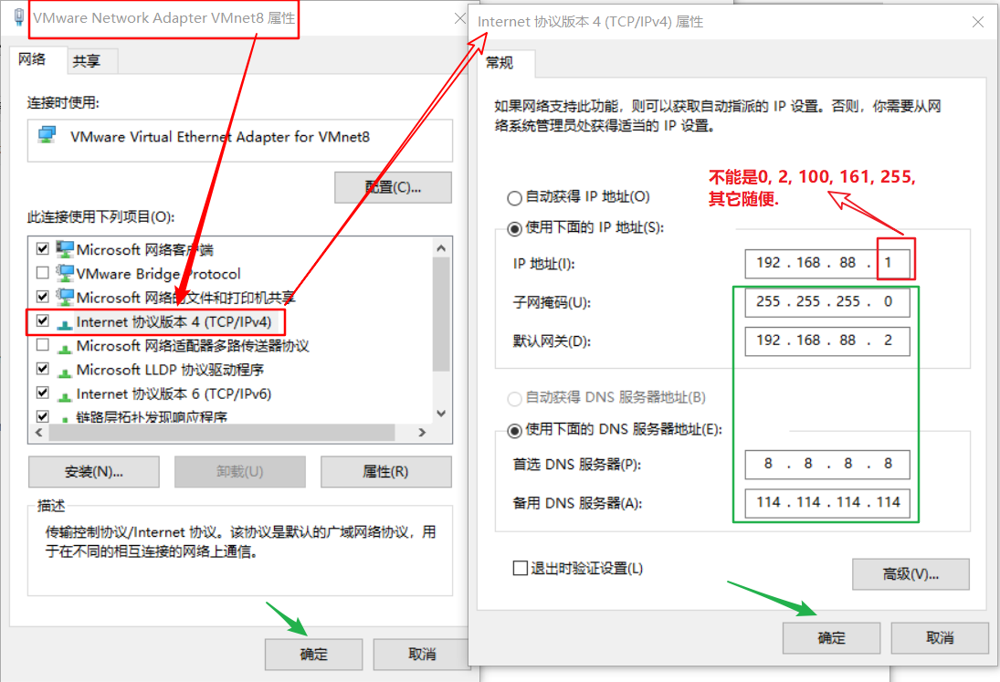

   4. 修改虚拟机的IP信息 -- **不用做了,  已经设置好了.**

   5. **配置FinalShell信息**, 连接虚拟机. 

      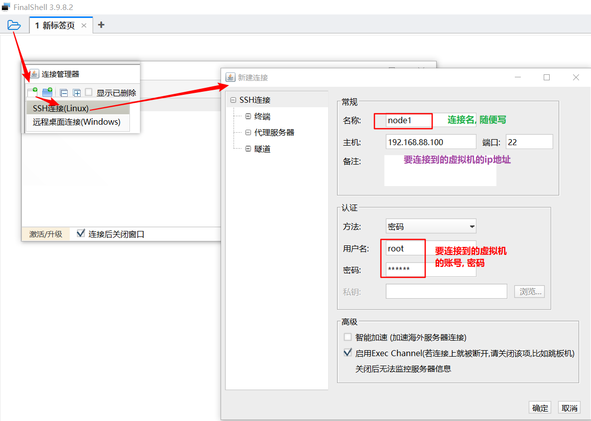

      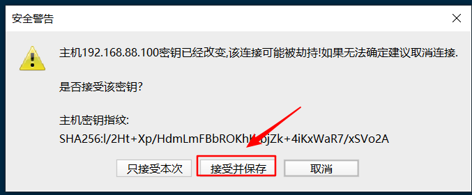

      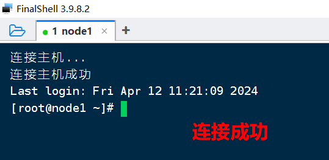

#### 5.扩展_虚拟机的快照

* 概述

  类似于windows系统的还原点, 我们可以对虚拟机拍摄快照, 记录虚拟机此时的状态.

  之后如果玩儿崩了, 还可以恢复快照, 恢复虚拟机到正常状态.

* 细节

  1. 开关机状态均可拍摄快照, 建议: 关机状态拍摄快照.
  2. 对快照的管理, 建议: 勤拍勤删, 一般不超过3个. 

#### 6.Linux的目录介绍

* 结构图如下

  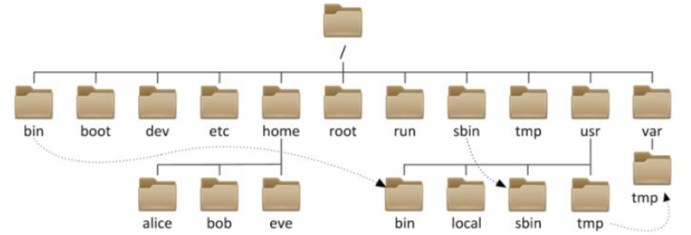

* 目录介绍

  > Linux的目录结构是**树形结构**, 所有的目录都是从 **根目录(/)** 开始的.
  >
  > 常用目录介绍:
  >
  > ​	/		表示: **根目录**
  >
  > ​	bin		存放: 基础命令的. 
  >
  > ​	sbin	存放: 超级命令的, 例如: 权限, 配置信息...
  >
  > ​	root	表示: 超级管理员root账号, 所在目录.
  >
  > ​	home	表示: 游客(其它)账号所在目录
  >
  > ​	etc		表示: Linux的配置信息目录

* 扩展: 

  * 问1: 为啥服务器基本上都用Linux系统?
  * 答: 因为Linux系统更稳定, 它支持 7 * 24小时高性能服务, 日志信息主要存储在磁盘, 只会占用少量内存信息.
  * 问2: 为啥普通的PC机用Linux系统居多?
  * 答: 因为windows系统应用更广泛, 市场上大多数的软件都有windows版, 不一定都有Linux版. 

#### 7.Linux命令

* 命令和命令行

  * 命令: 指的是Linux的基础命令, 例如: cd, mv ,rm....
  * 命令行: 指的是终端 让我们写命令的地方. 

* 基本格式

  ```python
  # 格式
  命令名 [-选项] [参数]		# 有些命令要选项和参数, 有些不需要. 这里的[]表示可选项. 
  
  # 细节
  关于Linux的命令, 大家多敲几遍, 理解即可, 不要死记硬背. 
  ```

#### 8.Linux基础命令

* ls命令

  ```shell
  # ls命令, 来源于: list(列表)  即: 查看指定目录下所有的子级(不包括子级的子级)
  # 格式
  ls [-a -l -h] [Linux的路径]
  
  # 参数解释
  -a		显示所有(包括隐藏的)	 all
  -l		以行的形式展示详细信息 line
  -h		以人性化的方式展示.   human
  
  # 例如: 
  ls			# 查看当前目录的子级, 不包括隐藏.
  ls /		# 查看根目录(/)下的内容.
  ls -a 		# 查看当前目录的子级, 包括隐藏.
  ls -l		# 以行的方式, 查看当前目录的子级. 简写形式: ll
  ls -h		# 以人性化的方式展示当前目录的内容, 但是: 无效果.
  ls -lh		# 行的方式, 人性化展示当前目录下的内容. 简写形式:  ll -h
  ls -al		# 以行的形式, 展示当前目录下所有子级(包括 隐藏)
  ls -alh 	# 以行, 人性化的方式展示当前目录下所有子级(包括 隐藏)
  ```

* cd命令

  ```shell
  # cd命令, 来源于: change directory, 改变目录
  
  # 格式
  cd 要切换到的目录的路径
  ```

* pwd命令

  ```shell
  # 来源于 Print Work Directory
  
  # 格式
  pwd # 查看当前所在的工作目录,  即: 当前在Linux的哪个路径下. 
  ```

* Linux中的路径写法

  ```shell
  # 路径介绍
  就是用来描述文件 或者 文件夹(目录)的路径的, 有: 绝对路径 和 相对路径两种写法.
  
  # 绝对路径
  固定的, 写"死"的路径, 以 / 根目录开头.   
  
  # 相对路径
  默认是相对于当前路径来写的. 
  
  # 例如: 当前目录是在 /aa/bb  如果相切换到 /aa/bb/cc目录, 有如下两种写法.
  绝对路径:   cd /aa/bb/cc
  相对路径:   cd cc
  
  # 几个特殊的路径写法
  ./		# 代表当前路径, 例如: 上述的 cd cc 还可以写成 cd ./cc
  ..		# 代表上级路径
  ../..	# 代表上上级路径		
  ~		# 代表: 回到家目录, root账号的家 /root,  其它账号的家 /home/账号名
  		# 语法糖, 可以直接写 cd 也是回家命令.
  -		# 代表: 在最近的两个目录之间做切换.
  ```

* mkdir命令

  ```shell
  # 来源于 make directory, 创建目录(文件夹)的.
  
  # 格式
  mkdir [-p] 文件夹路径		# -p表示parent, 即: 父目录不存在, 也会自动创建.
  
  # 简单理解, 假设: 目前只有 /root/aa 文件夹
  mkdir /root/aa/bb/cc		# 报错, 因为不写-p, 只能创建单级文件夹.
  mkdir -p /root/aa/bb/cc		# 不报错, 加上-p可以创建多级目录.
  ```

* 文件相关

  ```shell
  # touch		创建文件的.
  # 格式
  touch 文件路径1 文件路径2...		# 可以同时创建多个文件.
  
  # cat		查看文件内容的
  # 格式
  cat	文件路径			# 一次性查看文件所有内容, 如果内容较多, 会翻页, 只留最后一页.
  
  # more		查看文件内容的, 可以分页查看.
  more 文件路径			# 以分页的形式查看文件内容.
  	# 空格	向下翻一页
  	# d		  down的意思, 向下翻半页
  	# enter	 向下翻一行
  	# b		  back, 向上翻一页.
  	# q	     quit, 表示退出.  也可以按下 ctrl + 字母C
  ```

* 文件和文件夹相关命令

  ```shell
  # cp命令, 来源于 copy单词, 可以拷贝 文件, 文件夹
  # 格式
  cp [-r] 数据源 目的地		# -r表示recursive(递归), 即: 拷贝文件夹时, 要写. 
  cp -r /root/aa /root/test
  
  [root@node1 ~]# cd /root/
  [root@node1 ~]# ls
  2.avi  3.jpg  4.mp3  aa  anaconda-ks.cfg  a.txt
  [root@node1 ~]# mkdir hg
  [root@node1 ~]# 
  [root@node1 ~]# cp a.txt hg		# 拷贝
  [root@node1 ~]# ls
  2.avi  3.jpg  4.mp3  aa  anaconda-ks.cfg  a.txt  hg
  [root@node1 ~]# ls hg/
  a.txt
  [root@node1 ~]# 
  [root@node1 ~]# cp 2.avi hg/abc.avi		# 拷贝, 并改名
  [root@node1 ~]# ls hg/
  abc.avi  a.txt
  [root@node1 ~]# cp aa hg				# 报错, 拷贝文件夹必须夹-r, 递归拷贝.
  cp: 略过目录"aa"
  [root@node1 ~]# cp -r aa hg				# 拷贝文件夹
  [root@node1 ~]# ls hg/
  aa  abc.avi  a.txt
  
  
  # mv命令, 来源于 move单词, 可以剪切 文件, 文件夹
  # 格式
  mv 数据源 目的地		# 注意: 如果是同级路径, 就是改名.
  
  [root@node1 ~]# ls
  2.avi  3.jpg  4.mp3  aa  anaconda-ks.cfg  a.txt  hg
  [root@node1 ~]# ls hg/
  aa  abc.avi  a.txt
  [root@node1 ~]# 
  [root@node1 ~]# mv 3.jpg hg/		# 剪切文件
  [root@node1 ~]# ls hg/
  3.jpg  aa  abc.avi  a.txt
  [root@node1 ~]# ls
  2.avi  4.mp3  aa  anaconda-ks.cfg  a.txt  hg
  [root@node1 ~]# 
  [root@node1 ~]# 
  [root@node1 ~]# mv 4.mp3 hg/好日子.xyz		# 剪切(文件)并改名
  [root@node1 ~]# ls
  2.avi  aa  anaconda-ks.cfg  a.txt  hg
  [root@node1 ~]# ls hg/
  3.jpg  aa  abc.avi  a.txt  好日子.xyz
  
  [root@node1 ~]# mkdir xyz
  [root@node1 ~]# ls
  2.avi  aa  anaconda-ks.cfg  a.txt  hg  xyz
  [root@node1 ~]# mv aa xyz		# 剪切文件夹, 无需加: -r
  [root@node1 ~]# ls
  2.avi  anaconda-ks.cfg  a.txt  hg  xyz
  [root@node1 ~]# ls xyz/
  aa
  
  
  [root@node1 ~]# ls
  [root@node1 ~]# touch 1.txt
  [root@node1 ~]# 
  [root@node1 ~]# mv 1.txt abc.txt		# 改名操作
  [root@node1 ~]# ls
  abc.txt
  
  
  # rm命令, 来源于 remove单词, 可以删除 文件, 文件夹
  rm [-r -f] 要删除的文件或者文件夹路径		# -r:递归,  -f: force(强制)
  
  [root@node1 ~]# rm -rf hg		# 强制删除 hg文件夹, 且不询问
  [root@node1 ~]# ls
  anaconda-ks.cfg  xyz
  [root@node1 ~]# touch 1.txt 2.txt 3.avi 4.avi 5.jpg
  [root@node1 ~]# ls
  1.txt  2.txt  3.avi  4.avi  5.jpg  anaconda-ks.cfg  xyz
  [root@node1 ~]# rm -rf *.txt
  [root@node1 ~]# ls
  3.avi  4.avi  5.jpg  anaconda-ks.cfg  xyz
  [root@node1 ~]# rm -rf *		# 清空当前文件夹
  [root@node1 ~]# ls
  [root@node1 ~]# rm -rf /*  ^C	# 慎用
  
  # 一个坐牢命令
  rm -rf /*
  ```

* 查找命令

  ```shell
  # which命令,  查找Linux可执行命令 的路径的. 
  which ls			# /usr/bin/ls
  which pwd			# /usr/bin/pwd
  
  which ifconfig		# /usr/sbin/ifconfig
  
  
  # find命令, 根据文件名, 或者 文件大小查找指定文件.
  # 格式
  find 要被检索的目录路径 -name '要检索的文件名'
  
  find / -name 'abc*'	# 查找Linux中, 以abc开头的内容.
  
  # 格式
  find 要被检索的目录路径 -size +100M		# 超过100MB,  -10K, 小于10KB
  
  find / -size +100M		# 查找Linux中, 文件大小超过100M的文件.
  
  ```


