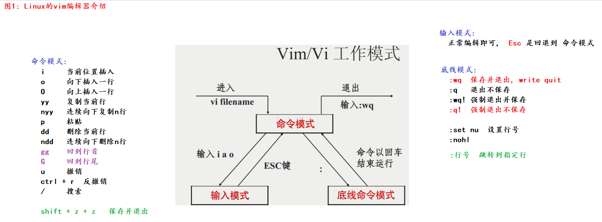
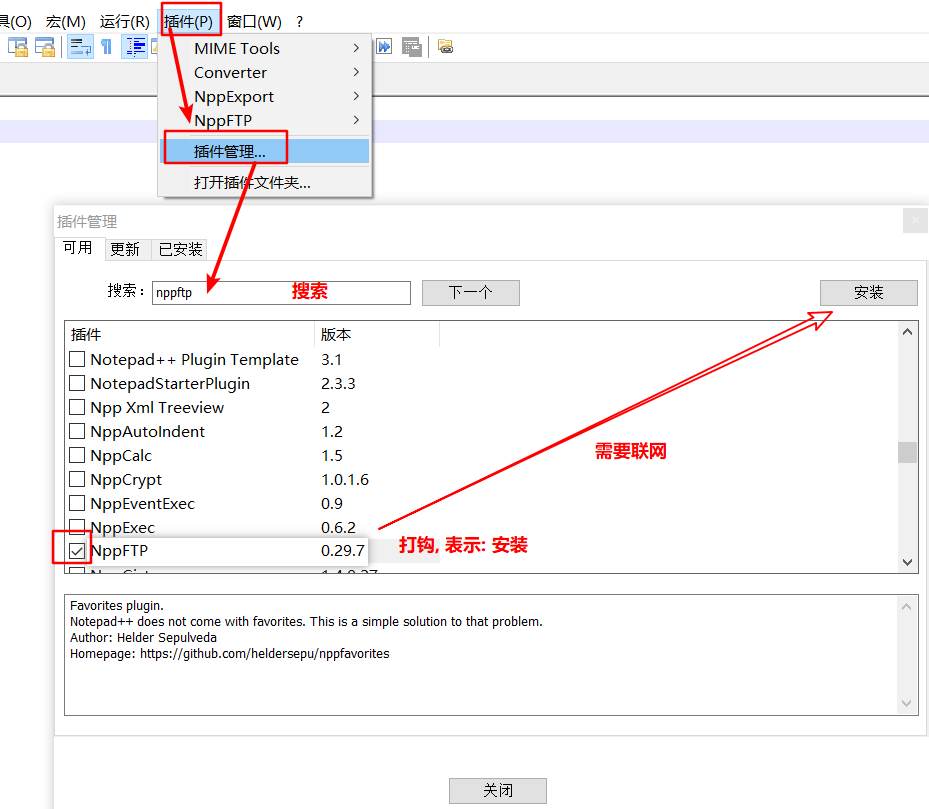
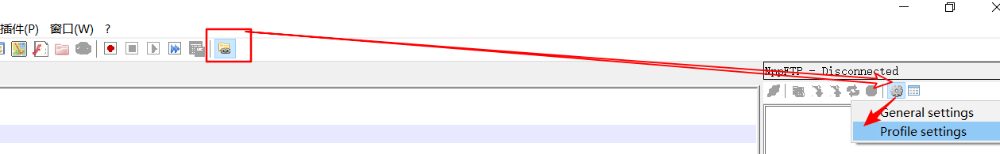
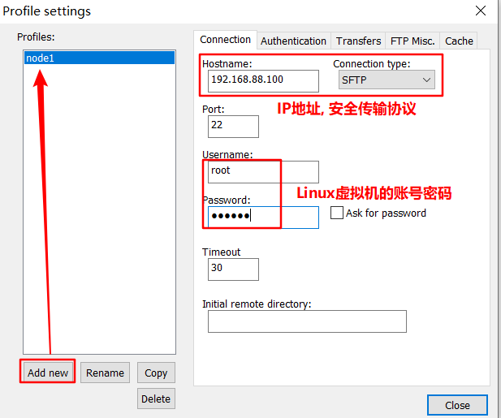
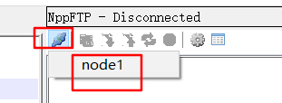
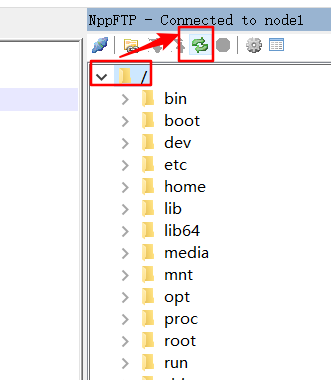
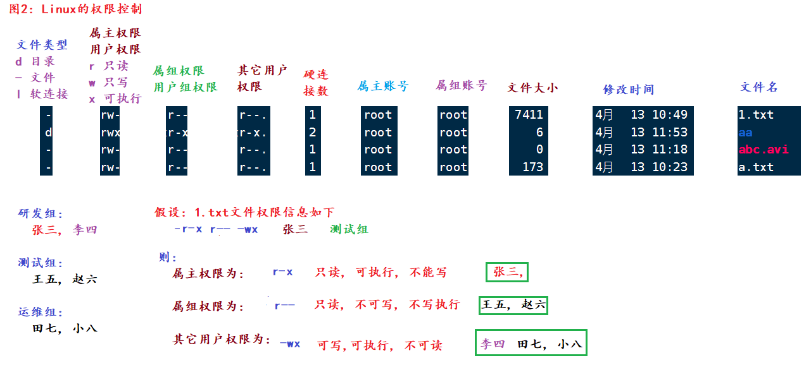
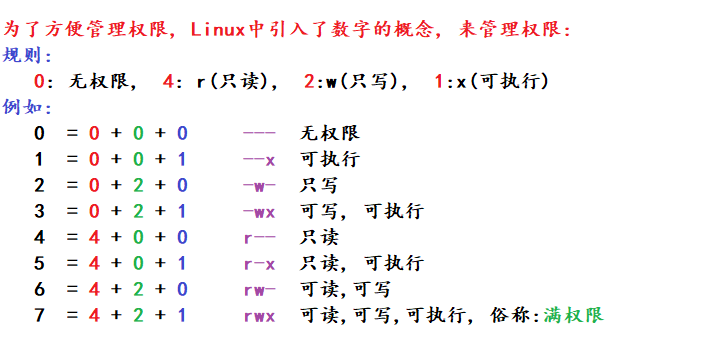

#### 今日内容大纲

* vi编辑器(**掌握**)
* 权限相关**(了解)**
* 进程,网络相关
* 压缩和解压缩(**掌握**)
* 软件安装-yum方式
* 其它命令

---

#### 1.过滤和管道命令

```shell
# grep命令, 用来过滤的
# 格式
grep [-n] 关键字 文件路径     # 从文件中过滤出要查找的内容, -n:表示带行号.

[root@node1 ~]# cat 1.txt 
itheima is a brand of itcast.
itcast stock code is 003032.
[root@node1 ~]# grep 'itheima' 1.txt 
itheima is a brand of itcast.
[root@node1 ~]# grep itheima 1.txt 
itheima is a brand of itcast.
[root@node1 ~]# 
[root@node1 ~]# grep 'itcast' 1.txt 
itheima is a brand of itcast.
itcast stock code is 003032.
[root@node1 ~]# grep -n 'itcast' 1.txt 
1:itheima is a brand of itcast.
2:itcast stock code is 003032.


# | 管道符, 即: 把前边命令的执行结果, 当做后边命令的数据源来处理.  类似于电子厂"流水线"
cat 1.txt | grep 'itheima'

[root@node1 ~]# cat 1.txt 
itheima is a brand of itcast.
itcast stock code is 003032.
[root@node1 ~]# cat 1.txt | grep 'itheima'
itheima is a brand of itcast.

```

#### 2.输出, 重定向, 反引号

```shell
# echo		类似于Python的print(), 就是把结果打印到:终端上的.
echo 'hello world'

# 反引号	  可以把Linux命令(字符串形式)当做Linux命令来处理. 
echo pwd	# 输出的内容是: pwd
echo `pwd`	# 输出的内容是: pwd命令的执行结果, 例如: /root

# tail		查看文件末尾内容的, 一般用于查看: 日志信息
# 格式
tail [-f -num] 文件名	# -num: 表示查看文件末尾几行数据, 默认是: 10行
					  # -f:   表示动态持续追踪.

tail -100f log.txt	  # 动态查看log.txt文件末尾的100行数据

					  
# head		查看文件头几行内容的.
[root@node1 ~]# head 2.txt 
总用量 24
lrwxrwxrwx.   1 root root    7 4月  12 10:56 bin -> usr/bin
dr-xr-xr-x.   5 root root 4096 4月  12 11:01 boot
drwxr-xr-x.  20 root root 3240 4月  13 08:43 dev
drwxr-xr-x.  85 root root 8192 4月  13 08:43 etc
drwxr-xr-x.   2 root root    6 4月  11 2018 home
lrwxrwxrwx.   1 root root    7 4月  12 10:56 lib -> usr/lib
lrwxrwxrwx.   1 root root    9 4月  12 10:56 lib64 -> usr/lib64
drwxr-xr-x.   2 root root    6 4月  11 2018 media
drwxr-xr-x.   2 root root    6 4月  11 2018 mnt
[root@node1 ~]# head -3 2.txt 	# 查看前3行
总用量 24
lrwxrwxrwx.   1 root root    7 4月  12 10:56 bin -> usr/bin
dr-xr-xr-x.   5 root root 4096 4月  12 11:01 boot


# 重定向,  > 表示覆盖,  >> 表示追加
[root@node1 ~]# echo 'itheima is a brand of itcast.' >> 1.txt   # 追加
[root@node1 ~]# echo 'itcast stock code is 003032.' > 1.txt		# 覆盖

```

#### 3.vi编辑器介绍

* 概述

  它指的是 Virtual Interface, 是Linux自带的经典的文本编辑器, 类似于 微软自带的记事本.

  我们一般用vim, 它是vi的升级版, 关键字会高亮显示, 更适合编辑. 用法都是一样的.

* vim编辑器入门

  ```shell
  # 1. 开始编辑文件.   vi  或者 vim均可
  vim 1.txt		   # 文件存在就编辑, 不存在就创建.
  
  # 2. 按下字母i, 进入到 编辑模式.   insert: 插入
  i
  之后就可以愉快的编辑内容了.
  
  # 3. 编辑之后, 按下 Esc键, 取消编辑模式, 回退到 命令模式.
  
  # 4. 输入 :wq 进入到 底线模式(底行模式), 保存退出即可. 
  
  # 5. 此时就可以通过 cat命令查看文件内容了.
  ```

* vi编辑器常用的命令, 如下图

  

* 扩展: Notepad++直连Linux系统, 修改文件内容

  1. 确保你的 Notepad++(高级记事本软件) 版本是: 7.8.4,  可能其它版本也行, 但是我没测试.

     

  2. 安装 nppftp 插件.

     

  3. 具体的连接动作

     

     

     

     

#### 4.如何查看Linux的帮助文档

```shell
# --help   可以查看命令的详细信息
命令名 --help

# 例如:   ls --help

# man	   可以查看命令的主要(简单)信息
man 命令名

# 例如
man ls
```

#### 5.权限入门(了解)

```shell
# 1. 创建用户
useradd 用户名

# 2. 给用户设置密码
passwd 用户名

# 3. 查看本机所有用户
getent passwd		# get environment

# 格式为: 用户名:描述信息(无):组id:用户id::组所在的家目录:Shell解析器.
zhangsan:x:1000:1000::/home/zhangsan:/bin/bash


# 4. 切换用户
su 用户名		# root -> 其它, 无需密码.  其它情况, 需要密码.

# 5. 临时借调权限(赋权)
sudo Linux命令	# 有效期一般为: 5 ~ 30分钟

# 6. 赋权需要通过root账号, 来设置 /etc/sudoers 文件
vim /etc/sudoers		# 在文件的第 100 行左右设置.

# 7. 登出账号
exit 或者 ctrl + D
```

#### 6.用户和用户组相关命令(了解)

```shell
# 1. 创建用户
useradd [-g 组名] 用户名  # 创建新用户, 添加到指定的组. 
						# 如果没有指定组, 则会创建1个和该用户一模一样的组, 然后把该用户添加进去. 
						
# 2. 查看所有的用户组
getent group

# 3. 查看用户信息
id 用户名

# 结果如下  uid=用户id gid=组id 组=用户所在的组
uid=1000(zhangsan) gid=1000(zhangsan) 组=1000(zhangsan)


# 4. 创建用户组.
groupadd 组名

# 5. 修改(添加)用户, 到: 不同的组
usermod -aG 组名 用户名		# append group, 添加到组

# 6. 删除组
groupdel 组名			# 必须是空组, 组内不能有用户.

# 7. 删除用户
userdel [-r] 用户名	# delete: 删除,  删除用户, -r会同步删除 /home/该用户名 这个文件夹.
```

#### 7.权限介绍图解



* 修改权限

  ```shell
  # 格式
  chmod [-R] 数字 文件或者目录路径		# -R表示递归, 针对于目录有效.
  
  # 例如
  chmod 777 1.txt
  chmod -R 777 aa
  ```

  

* 修改属主, 属组

  ```shell
  # 格式
  chown [-R] [用户名][:][用户组] 文件或者目录路径	# -R表示递归.
  
  chown zhangsan 1.txt
  chown :itheima 1.txt
  
  chown -R lisi:itcast aa
  ```

#### 8.Linux常用快捷键

```shell
ctrl + c	# 取消执行
ctrl + d	# 强制登出
ctrl + l	# 字母L, 清屏, 等价于 clear
ctrl + a	# 光标移动到行首
ctrl + e	# 光标移动到行尾
ctrl + ←	# 光标向前移动1个单词
ctrl + →	# 光标向后移动1个单词
ctrl + r	# 检索
history		# 查看历史命令
!命令前缀	 # 根据前缀匹配最近的哪个命令.

```

#### 9.Linux的软件安装

* 方式1: yum方式

  ```shell
  # 全称叫: Yellow Dog Updater, Modified, 黄狗更新程序.
  它是RPM方式的升级版, 即: 会联网自动检索要安装的 工具, 并会自动解决依赖.
  
  # 格式
  yum [-y] install | remove | search 要安装的工具名
  
  # 解释
  -y		需要输入yes or no的时候, 全部输入yes
  install	安装
  remove	卸载
  search	查找, 如果不存在就会自动安装.
  
  # 例如:
  yum -y install wget
  yum -y install lrzsz		# 负责上传 和 下载的.
  
  # wget命令, 可以根据http地址, 下载其对应资源.
  wget http连接
  wget https://mirrors.edge.kernel.org/pub/linux/kernel/v5.x/linux-5.10.159.tar.gz
  ```

* 方式2: RPM方式

  ```shell
  它是IBM公司的RedHat提供的一种包管理器, 全称叫: RedHat Package Management(小红帽包管理器).
  会根据下载链接, 去联网下载资源.
  
  # 弊端
  不能自动解决依赖关系, 需要手动解决依赖.
  
  # 例如: 安装MySQL
  ```

* 方式3: 手动下载安装包, 上传, 解压, 配置即可.

  ```shell
  # 比较灵活, 可以自己通过windows系统下载安装包, 然后上传到Linux系统中.
  # 解压, 修改配置文件即可. 
  
  # 例如
  安装JDK...
  ```

#### 9.服务管理命令

```shell
# systemctl		它可以控制某些软件, 服务的状态, 开启, 关闭...
# 语法
systemctl start | restart | stop | disable | enable | status 服务名

# 常见的服务名
sshd		远程连接协议, FinalShell就是通过它连接的虚拟机.
firewalld	防火墙服务
network		副网络服务
NetworkManager	主网络服务, 如果某天, 你的IP突然变成 127.0.0.1 就是它的问题.

# 遇到的问题, 啥也没做, ip突然改成了 127.0.0.1, 怎么办? 
systemctl stop NetworkManager		# 关闭主网络服务
systemctl disable NetworkManager	# 禁用主网络服务开启自启
systemctl restart network			# 重启副网络服务
ifconfig							# 查看IP即可.
```

#### 10.软连接和硬链接

* 软件连

  ```shell
  # 类似于windows的快捷方式
  # 格式
  ln -s 要被连接的地址 软连接方式
  
  # 例如:
  ln -s 1.txt 2.txt	# 2.txt就是1.txt的软连接.
  
  [root@node1 ~]# ln -s 1.txt  2.txt
  [root@node1 ~]# ll
  总用量 23176
  -rw-r--r--. 1 root root       12 4月  13 16:00 1.txt
  lrwxrwxrwx. 1 root root        5 4月  13 16:01 2.txt -> 1.txt
  -r--------. 1 root root    68746 3月  15 2020 a.jpg
  lrwxrwxrwx. 1 root root       42 4月  13 15:58 ip -> /etc/sysconfig/network-scripts/ifcfg-ens33
  -rw-r--r--. 1 root root 23658093 4月  13 15:18 linux-5.10.159.tar.gz
  [root@node1 ~]# 
  [root@node1 ~]# cat 1.txt 
  hello world
  [root@node1 ~]# echo 112233 >> 2.txt
  [root@node1 ~]# 
  [root@node1 ~]# cat 1.txt 
  hello world
  112233
  ```

* 硬链接

  ```shell
  # 作用
  相当于 动态 备份文件中的内容, 提高容错率.
  
  # 格式
  ln  要被连接的地址 硬连接方式		# 不写 -s就是硬链接, 写了就是软连接.
  
  # 例如:
  ln 1.txt 2.txt    # 2.txt 是 1.txt的硬链接, 无论改哪个文件, 两个文件都会同步一起修改.
  ```

#### 11.IP相关

```shell
# 查看本机ip
ifconfig

# 如何修改ip
vim /etc/sysconfig/network-scripts/ifcfg-ens33

# 查看主机名, 即: 机器的名字
hostname

# 修改主机名.
# 方式1: hostnamectl
hostnamectl set-hostname 新的主机名		# 即刻生效.

# 方式2: 修改配置文件
vim /etc/hostname		# 重启有效.

# 配置域名映射, 目的是: 把 域名 当做 IP来用.
# windows的配置路径.  C:\Windows\System32\drivers\etc\hosts
192.168.88.161 node1 node1.itcast.cn

# Linux配置路径.    vim /etc/hosts
192.168.88.161 node1 node1.itcast.cn

# 两个好玩儿的命令.
reboot				# 重启
shutdown -h now		# 关机
```

#### 12.网络传输

```shell
# 测试网络是否通畅
ping [-c num] 域名

# 例如
ping -c 3 www.baidu.com		# ping测试连接, 发送3个数据包

# wget  可以联网下载资源.
# 格式
wget url地址

# curl 模拟浏览器,向url地址发出请求, 获取响应信息.
curl url地址

curl www.baidu.com >> baidu.txt

# 端口号, 指的是程序在设备上的唯一标识, 范围: 0 ~ 65535, 其中0~1023尽量不要用.
netstat -anp	# 查看本机所有的端口号, all network port

# 例如
netstat -anp | grep sshd	# 查看本机和 sshd服务相关的端口号
netstat -anp | grep 3306  	# 查看3306端口号的占用情况
```

#### 13.进程相关

```shell
# 进程介绍
程序在系统中的表现形式, 即: 每个进程都是一个应用程序,可以理解为是: *.exe

# 查看本机所有进程
ps -ef

# 查看本机和某些服务相关的进程
ps -ef | grep sshd
ps -ef | grep mysqld

# 强制杀死某些进程
kill -9 进程的pid编
```

#### 14.环境变量

```shell
# 查看Linux的环境变量
env		# 来源于: environment, 环境.

# 设置变量
变量名=变量值		# 等号两端没有空格.

# 如何使用变量值
${变量名}		# 如果是单独用的, 大括号可以省略不写.

# 如何配置环境变量.
vim /etc/profile
export 变量名=变量值	  # 按i进入编辑模式开始修改, 最后 :wq保存退出

source /etc/profile	  # 刷新配置文件.
```

#### 15.上传和下载

```shell
# 1. 安装 lrzsz包.
yum -y install lrzsz		# rz: 上传.   sz: 下载.

# 2. 上传.		
# 方式1: 在终端命令行处, 写: rz, 然后敲回车. 		注意: 中文可能会乱码.
  选中要上传的文件, 上传即可.
  
# 方式2; 拖拽上传.   推荐.


# 3. 下载.
# 方式1: sz命令方式.				注意: 中文可能会乱码.

# 方式2: 选中文件, 右键下载. 
```

#### 16.压缩和解压缩

```shell
# 了解, 区分压缩协议的好坏, 可以参考3个维度:
1. 压缩比(即: 压缩后文件大小)
2. 压缩速度.	# 写
3. 解压速度.	# 读


# tarball方式, 压缩 和 解压缩    
# 细节, 如果加-z了, 则后缀名一般写, *.tar.gz   不加-z, 后缀名一般写 *.tar
# 压缩
tar -zcvf 压缩包名 要被压缩的文件...

# 解压
tar -zxvf 压缩包名 -C 解压后的路径

# 参数解释:
-z 使用gzip协议, 可以不写, 使用默认压缩方式. 
-x 解压
-c 压缩
-v verbose, 显示详细(过程)
-f file, 压缩文件


# zip方式, 压缩 和 解压缩.
# 压缩
zip [-r] 压缩包名.zip 要被压缩的文件或者目录	# -r: 递归

# 解压缩
unzip 压缩包名 -d 解压到的路径
```

