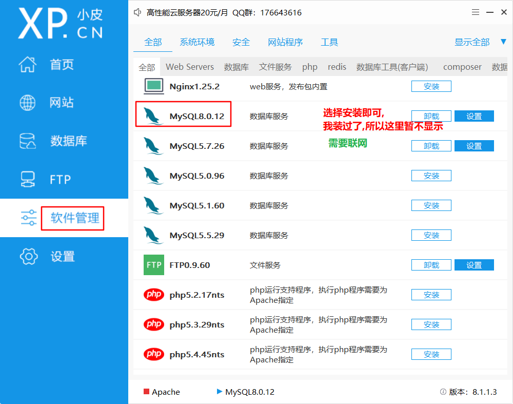

#### 今日内容大纲介绍

* 数据库的相关概述
* 环境搭建
* SQL语句分类
  * DDL
  * DML
  * DCL
  * DQL
* DDL语句之操作数据库
* DDL语句之操作数据表
* DML语句之操作表数据(增删改)
* DQL语句之操作表数据(查)

---

#### 1.数据库的相关概述

* **问1:** 你知道的存储数据的方式有哪些?

  ```sql
  -- 方式1: 变量, 列表, 字典...
  只能对数据临时存储, 程序执行结束, 数据就丢失了.
  
  -- 方式2: 文件存储
  可以对数据永久存储, 但是不方便用户进行精细化管理.
  
  -- 方式3: 数据库存储
  数据库才是实际开发中, 真正存储数据的地方.
  数据库指的是存储数据的仓库, 本质是一个文件系统, 可以有规律的对数据进行存储, 方便用户进行CURD操作.
  -- C: Create, 增
  -- U: Update, 改
  -- R: Read,   查
  -- D: Delete, 删
  ```

* **问2:** 我们常说的数据库指的是DMBS(数据库管理系统), 那么DBMS和数据库之间有什么关系?

  ```sql
  -- 包含关系.
  DBMS: DataBase Management System, 数据库管理系统, 即: 软件, 例如: MySQL, Oracle...
  DB:   DataBase, 数据库, 即: 一个项目 = 1个数据库.
  ```

  

* **问3:** 我们常用的数据库, 大多都是关系型数据库, 那么什么是关系型数据库, 什么是非关系型数据库?

  ```sql
  -- 关系型数据库(RDBMS, Relationship DataBase Management System)
  即: 以数据表的形式来存储数据, 且表与表之间有关系, 例如: 一对多, 多对多, 一对一...
  
  -- 非关系型数据库(NoSQL, Not Only SQL, 不仅仅是SQL)
  即: 大多采用 键值对 的形式来存储数据, 没有一对多, 多对多, 一对一等关系...
  ```

* **问4:** 常见的数据库有哪些?

  ```sql
  -- 关系型数据库
  MySQL, Oracle, SQLServer, DB2, SQLite...
  
  -- 非关系型数据库
  Redis, HBase, MongoDB...
  ```

#### 2.MySQL的基本介绍

* 概述

  它属于关系型数据库的一种, 最早属于瑞典的MySQLAB公司, 后来被Sun公司收购, 后来被Oracle收购.

  MySQL6.X版起, 开始收费了.

* 安装

  ```sql
  -- 方式1: 直接使用我给大家的Linux虚拟机即可, 已经安装好了.
  
  -- 方式2: 在你的windows本机, 安装MySQL, 使用即可.
  思路1: 去MySQL官网下载 mysql的安装包, 然后下一步下一步安装即可.
  下载链接:
  	https://dev.mysql.com/downloads/mysql/
  
  思路2: 安装小皮软件(Phpstudy, 运维工具, 可以帮助我们快速安装MySQL)
  推荐使用.
  ```

  

  

  

  

* 配置path环境变量(**如果你是在windows中安装MySQL**)

  

#### 3.MySQL的登陆方式

* 登陆方式

  ```sql
  -- 方式1: 暗文方式, 格式如下:
  mysql -u root -p		-- 敲回车
  输入密码				 -- 敲回车
  
  -- 方式2: 明文方式, 格式如下:
  mysql -uroot -p密码	   -- 敲回车
  
  -- 方式3: 远程连接, 格式如下:
  mysql --host=ip地址 --user=账号 --password=密码
  
  
  -- 登出
  1. 直接点右上角的 ×
  2. exit
  3. quit
  ```

* 常见的两个问题

  ```sql
  -- ERROR 2003 (HY000): Can't connect to MySQL server on 'localhost' (10061)
  -- 产生原因: MySQL服务没有启动.
  -- 解决方案: 启动MySQL即可.
  
  
  -- using password: YES
  -- 产生原因: 用户名或者密码错误.
  -- 解决方案: 输入正确的账号或者密码即可.
  ```

  

#### 4.MySQL的可视化工具

* 解释

  MySQL的可视化工具, 指的是可以远程连接MySQL, 快速编写SQL语句, 有提示, 排错等一些列功能.

* 常用的MySQL可视化工具如下

  * Navicat
  * SQLYog
  * DataGrip
  * ..........

* DataGrip软件介绍

  它是JetBrains公司推出的, 专门用来连接 各种数据库的 工具, 功能强大, 稳定, 推荐使用.

  > 当然, 你要是不想装DataGrip, 你可以直接使用PyCharm来连接MySQL数据库, 也是一样的.
  >
  > 前提, 你的PyCharm必须是专业版, 不能是社区版.

  * 下载

    https://www.jetbrains.com/datagrip/download/other.html

  * 安装

    和 PyCharm的安装方式一模一样, 这里: 略.

* 配置DataGrip 或者 PyCharm连接MySQL

  * 连接本地(例如: windows系统)的MySQL

    

    

  * 连接虚拟机(例如: Linux系统)的MySQL

    

#### 5.SQL语句分类

* 概述

  全称叫: Structured Query Language, 结构化查询语言, 即: **通过SQL语句可以实现操作数据库**

* 特点

  目前我们所学的SQL语句, 是**标准的SQL语句,** 即: 所有的关系型数据库基本都支持, 未来大家主要用哪种数据库, 再单独学习下该数据库的 独有语法即可.

* 分类

  * DDL语句,   DataBase Definition Language, 数据定义语言

    > 主要是操作: 数据库, 数据表, 列的, 进行: CURD.
    >
    > **关键字:  create, drop, alter, show**

  * DML语句, DataBase Manipulation Language, 数据操作语言.

    > 主要是操作: 表数据的, 进行: 增删改操作, 统称为: **更新语句**
    >
    > **关键字:  insert, delete, update**

  * DQL语句, DataBase Query Language, 数据查询语言.

    > 主要是操作: 表数据的, 进行: 查询操作.
    >
    > **关键字: select, from, where...**

  * DCL语句, DataBase Control Language, 数据控制语言.

    > 主要是: 设置权限, 访问级别(隔离级别), 创建用户等的...

    

#### 6.SQL语句-通用语法

```sql
-- 1. SQL语句可以写单行, 也可以写多行, 最后以 分号; 结尾.

-- 2. 为了阅读方便, 我们可以用 \t 或者 空格来隔开SQL语句. 

-- 3. SQL语句不区分大小写, 为了阅读方便, 建议: 关键字大写, 其它小写.

-- 4. SQL的注释写法如下
	-- 单行注释
	# 单行注释
	/*
		多行
		注释
	*/
	
-- 5. 我们目前在PyCharm或者DataGrip中写SQL语句, 是选中执行的, 即: 你不要漏选, 防止出错.
```

#### 7.SQL中常用的数据类型

```sql
-- SQL中也是有数据类型的概念的, 根据每列值的不同, 数据类型也不同, 常用的如下.
整数: 	int
小数; 	decimal, float, double
字符串:   varchar(长度), char(长度)
日期:		date, datetime

```

#### 8.DDL语句-操作数据库

```sql
-- ------------------------------- 案例1: DDL语句 操作数据库 -------------------------------
-- 1. 查看所有的数据库.
show databases;         # ctrl + 回车, 执行该行代.

-- 2. 删除数据.
drop database day01;            # 删除数据库, 如果数据库存在就删除, 不存在就: 报错.
drop database if exists day01;  # 删除数据库, 如果数据库存在就删除, 不存在就: 啥也不做.

# 3. 创建数据库.
create database day01 character set 'utf8';                 # 创建day01数据库, 采用: utf8 码表.  库不存在就创建, 存在就: 报错.
create database if not exists day01 character set 'utf8';   # 创建day01数据库, 采用: utf8 码表.  库不存在就创建, 存在就: 啥也不做.

# 上述格式, 语法糖1: character set => 可以写成 charset
create database day02 charset 'utf8';

# 上述格式, 语法糖2: 可以不指定码表, 会采用默认码表.  windows系统: MySQL默认码表是 utf8,   Linux系统: MySQL默认码表是 latin1
create database day03;

# 4. 查看数据库.
show create database day01;     # utf8
show create database day03;     # utf8

# 5. 修改数据库的码表.
alter database day03 charset ='gbk';

# 6. 切换数据库, 之后: 建表, 查表, 查数据等操作, 都是基于数据库完成的.
use day01;
```

#### 9.DDL语句-操作数据表

```sql
-- ------------------------------- 案例2: DDL语句 操作数据表 -------------------------------
-- 细节: 记得先切库.
use day01;

-- 1. 查看当前库中, 所有的数据表.
show tables;

-- 2. 查看表结构.
show create table student;      # 查看建表的详细过程.

describe student;               # 语法糖,  desc student;


-- 3. 创建数据表.
/*
格式:
    create table [if not exists] 数据表名(
        列名 数据类型(长度) [约束],
        列名 数据类型(长度) [约束],
        列名 数据类型(长度) [约束],
        ......
    );
格式解释:
    1. varchar类型, 表示变长字符串, 需要指定长度.  例如: varchar(20), 表示该列, (每行)至多存储20个字符.
    2. 上述的 [] 表示可选的意思, 即: if not exists 判断表不存在 和 约束, 都是可选项.
    3. 约束简单介绍:
        就是用来限定该列值的, 能加啥, 不能加啥, 例如: 不能重复, 不能为空...
        后续详解, 目前先了解. 先写几个基础的.
            primary key     主键约束, 一般修饰id列, 且: 一张表中, 主键约束最多只能有1个.
            not null        非空约束, 即: 该列值不能为空.
 */
# 需求: 创建学生表, 字段有: 学号(主键), 姓名(非空), 性别, 年龄.
create table if not exists student(
    sid int primary key,        # 学生id, primary key: 主键约束, 特点为: 唯一, 非空.
    name varchar(20) not null,  # 学生姓名, 非空约束(即: 不能为空)
    gender varchar(2),          # 学生性别
    age int                     # 学生年龄, 整数.
);

# 4. 删除数据表.
drop table if exists student;

# 5. 修改表(名字)
# 格式: rename table 旧表名 to 新表名;
rename table student to stu;
```

#### 10.DDL语句-操作列

```sql
-- ------------------------------- 案例3: DDL语句 操作 字段 -------------------------------
-- 1. 查看表结构.
desc stu;

-- 2. 给表新增一列, desc varchar(200), 非空约束.
-- 格式: alter table 表名 add 新列名 数据类型 约束;
alter table stu add `desc` varchar(200) not null;       # 如果列名和关键字重名, 记得用 反引号包裹.

-- 3. 修改表的字段(列), 只修改: 数据类型, 约束.  将desc列改为: int类型.
-- 格式: alter table 表名 modify 旧列名 数据类型 约束;
alter table stu modify `desc` int;      # 因为没有加非空约束, 所以本次会认为, 不要非空约束了, 即: 会删除它.

# 4. 修改表的字段(列), 修改: 列名, 数据类型, 约束.  把 desc int 无约束 => address varchar(10) 非空约束
-- 格式: alter table 表名 change 旧列名 新列名 数据类型 约束;
alter table stu change `desc` address varchar(10) not null;

# 5. 删除表的字段.
# 格式: alter table 表名 drop 旧列名;
alter table stu drop address;
```

#### 11.DML语句-添加数据

```sql
/*
DML语句详解:
    概述:
        数据操作语言, 主要是: 操作表数据的, 对表数据进行更新操作, 例如: 增, 删, 改.
    细节:
        1. 在进行删除, 或者修改数据之前, 一定一定一定要先备份你的数据, 或者记得加where条件, 一个老屌丝的含泪忠告.
        2. 在添加数据的时候, 值的个数及类型, 必须和前边列的个数及对应保持一致.
        3. 添加数据时, 如果没有写列名, 则: 默认是全列名, 即:
            insert into stu values(这里要按照顺序, 给每一列, 填充值);
*/

-- ------------------------------- 案例1: DML语句操作表数据 - 增 -------------------------------

# 1. 切库.
use day01;

# 2. 查表.
show tables;

# 3. 查看表数据, 这个数据DQL语句, 我们先用一下, 稍后详解.
select * from stu;
# 查看表结构.
desc stu;

# 4. 添加表数据.
# 4.1 场景1: 添加单条数据, 格式为: insert into 表名(列名1, 列名2, 列名3...) values(值1, 值2, 值3...);
insert into stu(sid, name, gender, age) values (1, '乔峰', null, 38);
insert into stu(sid, name, gender, age) values (2, null, null, 38);     # 报错, name列有非空约束, 不能为null

# 4.2 场景2: 添加多条数据, 格式为: insert into 表名(列名1, 列名2, 列名3...) values(值1, 值2, 值3...), (...), (...);
insert into stu(sid, name, gender, age)
values
    (2, '虚竹', null, 26),
    (3, '段誉', '男', 21),
    (4, '阿朱', '女', 35),
    (5, '梦姑', '女', 23),
    (6, '钟灵儿', '女', 19);

# 4.3 上述格式的变形版.  不一定非得是全列名, 只要值的个数, 类型 和 列名的个数, 类型保持一致即可.
insert into stu(sid, name) values (7, '木婉清');

# 4.4 上述格式的语法糖, 掌握, 实际开发一般是用这个.
insert into stu values (8, '鸠摩智', '男', 49);      # 如果不写列名, 则默认是: 全列名, 需要给每一个列都要传入值.
```

#### 12.DML语句-修改数据

```sql
-- ------------------------------- 案例2: DML语句操作表数据 - 改 -------------------------------
# 格式: update 表名 set 字段名=值, 字段名=值, 字段名=值... where 条件
# 1. 查表.
select * from stu;

# 2. 修改 sid为3的数据, 姓名为: 段氏小王子, 渣男
update stu set name='段氏小王子', gender='渣男' where sid = 3;

# 3. 危险操作, 修改数据时, 没有写 where条件, 则会一次性修改表中所有的数据.
update stu set name='段氏小王子', gender='渣男';

```

#### 13.DML语句-删除数据

```sql

-- ------------------------------- 案例3: DML语句操作表数据 - 删 -------------------------------
/*
删除表数据:
    方式1: delete from 表名 where 条件;
    方式2: truncate table 表名;

面试题: delete from 和 truncate table之间的区别是什么?
    区别1: 是否会重置主键id
        delete from:    仅仅是清空表数据, 不会重置主键id
        truncate table: 会重置主键id, 相当于把表摧毁了, 然后创建一张和该表一模一样的表.
    区别2: 本质不同.
        truncate table 属于 DDL语句, 一般不结合 事务 一起使用.
        delete from 属于 DM L语句, 一般可以结合 事务 一起使用.
*/

# 1. 查看表数据.
select * from stu;

# 2. 正常删除数据, 删除id > 3的数据.
delete from stu where sid > 3;

# 3. 需求: 删除表中所有的数据.
# 方式1: delete from
delete from stu;

# 方式2: truncate table
truncate table stu;

# 4. 深入研究下 上述的两种删除方式, 看: 是否会重置主键id.
# 主键约束 如果结合了 自增一起使用, 则一会传入主键的时候, 不需要在手动传值了, 传入null即可, 因为主键会根据最大值+1, 即: 自增存储.
# 4.1 建表
create table hero(      # 英雄表
    hid int primary key auto_increment,     # 英雄id, 主键(唯一, 非空), auto_increment表示自动增长.    主键约束不参与具体业务, 仅仅是标记数据的唯一性的.
    name varchar(10),   # 英雄名
    role varchar(10)    # 角色定位
);

# 4.2 添加表数据.
insert into hero values(null, '钟无艳', '战士'), (null, '貂蝉', '法师'), (null, '百里玄策', '刺客'), (null, '孙尚香', '射手'), (null, '明世隐', '辅助');

# 4.3 删除表数据.
delete from hero;       # 不会重置主键id,   DML语句.
truncate table hero;    # 会重置主键id, 相当于把表摧毁了, 然后创建了一张和该表一模一样的表.   DDL语句
# 上述格式语法糖.
truncate hero;      # table可以省略不写.

# 4.4 查询表数据.
select * from hero;

```

#### 14.备份表数据

```sql
-- ------------------------------- 案例4: 如何快速备份表数据 -------------------------------
# 1. 查看所有的数据表.
show tables;
# 2. 准备数据源表, 即: 英雄表.
select * from hero;
desc hero;

# 细节: 备份表只备份字段名, 数据类型 和 表数据, 不会备份(主键)约束.
# 3. 演示如何备份表, 场景1: 备份表不存在.
# 格式: create table 备份表名 select * from 要备份的数据表名 where...;
create table hero_tmp select * from hero;


# 4. 演示如何备份表, 场景2: 备份表存在.
# 格式: insert into 备份表名 select * from 要备份的数据表名 where...;
insert into hero_tmp select * from hero;

# 5. 查看备份表的数据.
select * from hero_tmp;

# 6. 查看备份表的数据结构.
desc hero_tmp;

# 7. 清空备份表的数据.
truncate hero_tmp;
```


