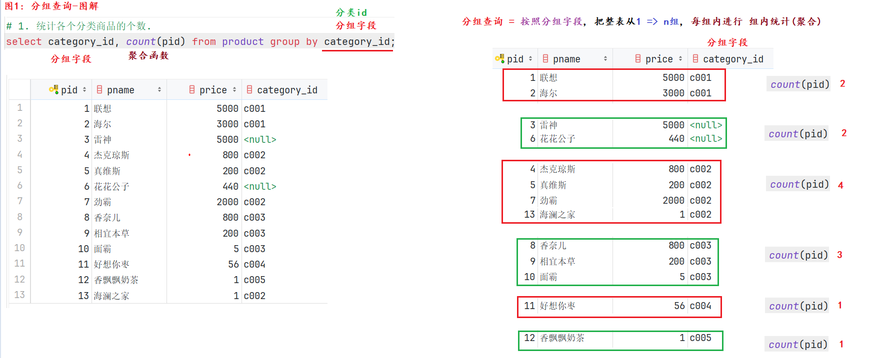

#### 今日内容大纲介绍

* 约束详解
  * 单表约束
  * 多表约束
* DQL语句详解
  * 简单查询
  * 条件查询
  * 聚合查询
  * 分组查询
  * 排序查询
  * 模糊查询
  * 分页查询
* 多表查询
  * 交叉连接
  * 连接查询
  * 子查询
  * 自关联(自连接)查询
* 扩展: 多表建表
  * 一对多
  * 多对多
  * 一对一

---

#### 1.主键约束详解

```sql
/*
约束详解:
    概述:
        SQL中的约束分为: 单表约束, 多表约束, 目的是在数据类型的基础上, 对该列值继续做限定, 例如: 不能为空, 不能重复...
    作用:
        保证数据的完整性, 一致性, 安全性.
    分类:
        单表约束:
            主键约束: primary key,
                特点: 非空, 唯一.  一般结合自动增长(auto_increment)一起使用.  前提: 主键列必须是整数.

            非空约束: not null
                特点: 该列值不能为空.

            唯一约束: unique
                特点: 该列值不能重复.

            默认约束: default
                特点: 插入数据的时候, 如果没有给该列赋值, 就用默认值, 类似于Python中的 缺省参数.

        多表约束: foreign key
            稍后讲.

    细节:
        1. 一张表, 主键只能有1个.
*/

-- ------------------------------- 案例1: 单表约束之 主键约束 -------------------------------
# 1. 建库, 切库, 查表.
drop database if exists day02;
create database day02 charset 'utf8';
use day02;
show tables;

# 2. 建表, 学生表, 字段(id, 姓名, 年龄)
drop table if exists student;
create table student(
    # 设置主键约束的方式1
    sid int primary key auto_increment,  # 主键列, 特点: 非空, 唯一.   结合 自增一起用.

    # 设置主键约束的方式2
#     sid int auto_increment,
#     name varchar(20),
#     age int,
#     primary key (sid)


    # 设置主键约束的方式3, 即: 建表后添加.
#     sid int,
    name varchar(20),
    age int
);

# 3. 添加表数据.
insert into student values(null, '乔峰', 39);     # 因为主键列结合了自增, 所以可以直接传入null, 它会自动增长.
insert into student(name, age) values('虚竹', 29);     # 因为主键列结合了自增, 所以可以直接传入null, 它会自动增长.

# 4. 查询表数据.
select * from student;

# 5. 查看表结构.
desc student;

# 6. 删除主键约束. 注意: 只会删除主键约束, 不会移除自动增长, 一会儿还需手动删除 自增.
# 6.1 移除自增.
alter table student modify sid int;
# 6.2 删除主键约束.
alter table student drop primary key ;  # 必须先移除自增, 然后再删除主键.

# 7. 建表后, 添加主键约束.
# 7.1 添加主键约束.
alter table student add primary key(sid);
# 7.2 设置自增.
alter table student modify sid int auto_increment;
```

#### 2.单表约束-总结

```sql
-- ------------------------------- 案例2: 单表约束之 其它约束 -------------------------------
# 演示: 非空约束, 唯一约束, 默认约束.
# 需求: 定义老师表(teacher), 字段(id, name: 非空, 手机号: 唯一, 住址: 默认背景)
# 1. 建表.
create table teacher(
    id int primary key auto_increment,  # 主键, 自增.
    name varchar(20) not null ,         # 姓名, 非空约束
    phone varchar(11) unique ,          # 手机号, 唯一约束
    address varchar(10) default '北京'   # 住址, 默认约束
);

# 2. 查询表数据.
select * from teacher;

# 3. 添加表数据.
# 3.1 测试: 非空约束.
insert into teacher values(null, null, 111, '新乡');      # 报错, 姓名不能为空.
insert into teacher values(null, '夯哥', 111, '新乡');     # 正确

# 3.2 测试: 唯一约束.
insert into teacher values(null, '乔峰', 111, '郑州');     # 报错, 手机号必须唯一
insert into teacher values(null, '乔峰', 222, '郑州');     # 正确
insert into teacher values(null, '乔峰', null, '上海');    # 正确, 唯一约束, 不限定: null值, 可以任意添加.
insert into teacher values(null, '乔峰', null, '深圳');    # 正确, 唯一约束, 不限定: null值, 可以任意添加.

# 3.3 测试: 默认约束.
insert into teacher values(null, '乔峰', 333);            # 报错, 值的个数(3个) 和 列的个数(4个)不匹配
insert into teacher(id, name, phone) values(null, '乔峰', 333);     # 正确: 姓名不为空(重不重复无所谓), 手机号: 唯一
```

#### 3.单表查询-简单查询

```sql
-- ----------------------------- 案例1: 单表查询 准备数据 -------------------------------
# 1. 切库
use day02;
# 2. 建表.
# 创建商品表：
create table product
(
    pid         int primary key auto_increment, # 商品id, 主键,自增.
    pname       varchar(20),    # 商品名
    price       double,         # 商品价格
    category_id varchar(32)     # 商品分类id
);

# 3. 添加表数据.
INSERT INTO product(pid,pname,price,category_id) VALUES(null,'联想',5000,'c001');
INSERT INTO product(pid,pname,price,category_id) VALUES(null,'海尔',3000,'c001');
INSERT INTO product(pid,pname,price,category_id) VALUES(null,'雷神',5000,'c001');
INSERT INTO product(pid,pname,price,category_id) VALUES(null,'杰克琼斯',800,'c002');
INSERT INTO product(pid,pname,price,category_id) VALUES(null,'真维斯',200,'c002');
INSERT INTO product(pid,pname,price,category_id) VALUES(null,'花花公子',440,null);
INSERT INTO product(pid,pname,price,category_id) VALUES(null,'劲霸',2000,'c002');
INSERT INTO product(pid,pname,price,category_id) VALUES(null,'香奈儿',800,'c003');
INSERT INTO product(pid,pname,price,category_id) VALUES(null,'相宜本草',200,'c003');
INSERT INTO product(pid,pname,price,category_id) VALUES(null,'面霸',5,'c003');
INSERT INTO product(pid,pname,price,category_id) VALUES(null,'好想你枣',56,'c004');
INSERT INTO product(pid,pname,price,category_id) VALUES(null,'香飘飘奶茶',1,'c005');
INSERT INTO product(pid,pname,price,category_id) VALUES(null,'海澜之家',1,'c002');

# 4. 查看表数据.
select * from product;

-- ------------------------------- 案例2: 单表查询 之 简单查询 ----------------------------
# 格式: select distinct 列1, 列2... | * from 表名;
# 1.查询所有的商品.
select pid, pname, price, category_id from product;

# 上述格式的语法糖, * 代表全列名.
select * from product;

# 2.查询商品名和商品价格.
select pname, price from product;

# 3.查询结果是表达式（运算查询）：将所有商品的价格+10元进行显示.
select pname, price + 10 from product;      # 细节: 只是展示的时候 + 10 展示, 底层存储的还是: 原值.

# 4. 扩展: 给列起别名, 即: 别名查询.
select pname, price + 10 as price from product;
# 上述格式的: 语法糖, as 可以省略不写.
select pname, price + 10 price from product;

# 5. 扩展: 去重查询.
select distinct price from product;                 # distinct: 去重的意思, 这里是: 价格去重,    去重后: 9条
select distinct category_id from product;           # distinct: 去重的意思, 这里是: 分类id去重,  去重后: 6条.
select distinct category_id, price from product;    # distinct: 去重的意思, 这里是: 分类id 和 价格作为整体去重的, 即: c001,5000 和 c001,3000 不是同一个值.
```

#### 4.单表查询-条件查询

```sql
-- ----------------------------- 案例3: 单表查询 条件查询 -------------------------------
# 1. 演示 比较运算符 相关.
# 查询商品名称为“花花公子”的商品所有信息：
select * from product where pname = '花花公子';
# 查询价格为800商品
select * from product where price = 800;
# 查询价格不是800的所有商品
select * from product where price != 800;
select * from product where price <> 800;
# 查询商品价格大于60元的所有商品信息
select * from product where price > 60;
# 查询商品价格小于等于800元的所有商品信息
select * from product where price <= 800;


# 2. 演示 范围 查询.
# 查询商品价格在200到800之间所有商品
select * from product where price between 200 and 800;     # between 值1 and 值2; 包左包右.  范围的校验.
select * from product where price >= 200 and price <= 800; # 扩展: 逻辑运算符, and(并且的意思)

# 查询商品价格是200或800的所有商品
select * from product where price in (200, 800);        # in (值1, 值2...)  固定值的校验.
select * from product where price=200 or price=800;        # in (值1, 值2...)  固定值的校验.


# 3. 演示 逻辑运算符 相关
# 查询商品价格在200到1000之间所有商品
select * from product where price >= 200 and price <= 800; # 扩展: 逻辑运算符, and(并且的意思)
# 查询商品价格是200或800的所有商品
select * from product where price=200 or price=800;        # in (值1, 值2...)  固定值的校验.
# 查询价格不是800的所有商品
select * from product where price != 800;
select * from product where price <> 800;
select * from product where price not in (800);
select * from product where not price = 800;
select * from product where price > 800 or price < 800;


# 4. 演示 模拟查询 相关,  格式: 列名 like '内容'
# 细节: _表示1个占位符(类似于正则的: .    %表示任意个占位符(类似于正则的: .*)
# 查询以'香'开头的所有商品
select * from product where pname like '香%';
# 查询第二个字为'想'的所有商品
select * from product where pname like '_想%';


# 5. 演示 非空查询.   细节: 非空不能写 字段名 != null, 而是: is not null  和 is null
update product set category_id = null where pid = 3;
# 查询没有分类的商品
select * from product where category_id = null;       # 错误演示
select * from product where category_id is null;      # 正确演示

# 查询有分类的商品
select * from product where category_id is not null;
```

#### 5.单表查询-排序查询

```sql
# 格式: select * from 表名 order by 排序的列 asc | desc;
# 细节: asc(ascending, 升序, 默认的),   desc(降序)
# 1.使用价格排序.
select * from product order by price;           # 默认: 升序
select * from product order by price asc;       # 默认: 升序
select * from product order by price desc;      # desc: 降序


# 2.在价格排序(降序)的基础上，以分类排序(降序)
select * from product order by price desc, category_id desc;
```

#### 6.单表查询-聚合查询

```sql
-- ----------------------------- 案例5: 单表查询 聚合查询 -------------------------------
/*
聚合查询介绍:
    概述:
        之前我们写的SQL, 都是整行数据操作的, 如果要操作某列的数据, 就需要使用到 聚合函数了.
    分类:
        count()     统计数据表 总数据条数的.
        max()       求某列值的: 最大值
        min()       求某列值的: 最小值
        sum()       求某列值的: 和
        avg()       求某列值的: 平均值
    细节:
        1. 面试题: count(*), count(1), count(列)的区别?
            区别1: 统计范围不同.
                count(列):            只统计该列的 非null值.
                count(*), count(1):   无论是否为null, 都统计.
            区别2: 效率不同.
                从高到低分别是: count(主键列) > count(1) > count(*) > count(普通列)

        2. 计算平均值的时候, 即使某列都是整数, 结果也可能是: 小数.
*/
# 1、查询商品的总条数
select count(*) from product;       # 13
select count(1) from product;       # 13
select count(price) from product;   # 13
select count(category_id) from product;   # 11

# 2、查询价格大于200商品的总条数
select count(pid) total_cnt from product where price > 200;     # total count: 总条数

# 3、查询分类为'c001'的所有商品价格的总和
select sum(price) total_price from product where category_id = 'c001';

# 4、查询分类为'c002'所有商品的平均价格
select avg(price) from product where category_id='c002';

# 5、查询商品的最大价格和最小价格
select max(price) max_price, min(price) min_price from product;

# 6. 扩展: 查询商品的平均价格, 保留3位小数.
select avg(price) avg_price from product;               # 1346.3846153846155
select round(avg(price), 3) avg_price from product;     # 1346.3846153846155 => 1346.385

# 扩展, 四舍五入函数.
select round(5.12345);  # 不写第二个参数, 表示: 获取整数, 即: 不要小数位.
select round(5.345, 2); # 四舍五入, 保留2位小数, 5.35
```

#### 7.单表查询-分组查询

```sql
-- ------------------------------- 案例6: 单表查询 分组查询 -------------------------------
/*
概述:
    分组查询就是 根据分组字段 把整表分成N个组, 然后对每组进行 聚合运算.
    即: 分组查询一般结合聚合函数一起用, 否则: 无意义.
格式:
    select
        分组字段, 聚合函数...
    from
        数据表名
    where
        组前筛选
    group by
        分组字段
    having
        组后筛选;
细节:
    1. 分组查询其实就是: 按照条件(分组字段), 把 1 => n, 然后进行聚合操作.
    2. 分组查询的 查询列, 只能出现分组字段 及 聚合函数.
    3. 面试题: where 和 having的区别?
        where:  组前筛选, 后边不能跟: 聚合函数.
        having: 组后筛选, 后边可以跟: 聚合函数.
*/
# 1. 统计各个分类商品的个数.
select category_id, count(pid) from product group by category_id;

# 2. 统计各个分类商品的个数, 且只显示个数大于1的信息.
select
    category_id, count(pid)
from
    product
group by
    category_id             # 分组操作
having count(pid) > 1;      # 组后筛选


# 3. 扩展, 统计各个分类的商品总价格, 只统计单价在500以上的商品信息, 且只统计总金额在1000以上的信息, 并按照总金额进行升序排列.
select
    category_id, sum(price) total_price
from
    product
where
    price > 500             # 组前筛选
group by
    category_id             # 分组操作
having
   total_price > 1000       # 组后筛选
order by
    total_price;            # 排序查询.
```



#### 8.单表查询-分页查询

```sql
-- ------------------------------- 案例7: 单表查询 分页查询 -------------------------------
/*
概述:
    实际开发中, 分页查询是一个必备动作, 因为如果服务器数据较多, 一次性给用户所有的数据, 对于服务器 和 用户来讲, (资源)压力都是比较大的,
    针对于这种情况, 我们可以把服务器的数据分成N份(N页), 每份都是固定的条数目, 用户请求一次, 我们返回一份(一页)数据即可.
格式:
    limit 起始索引, 数据条数;
细节:
    1. MySQL中, 数据表的每条数据都是有索引的, 且索引从0开始, 即: 假设共13条数据, 则它们的索引值分别是: 0 ~ 12
    2. 如果分页时, 是从0索引开始获取数据的, 则 0 索引可以省略不写.
    3. 关于分页的几个名字, 计算方式如下:
        总数据条数:          count(*), count(1)
        每页的数据条数:       产品经理, 项目经理, 你
        每页的起始索引:       (当前页数 - 1) * 每页的数据条数
        总页数:              (总条数 + 每页的数据条数 - 1) // 每页的数据条数,   注意: 这里是整除, 即:  10 // 3 = 3
                            (23 + 5 - 1) // 5 = 5
                            (25 + 5 - 1) // 5 = 5
*/
# 1. 查询商品表的数据.
select * from product;

# 2. 按照 5条/页, 获取第 1 页数据.
select * from product limit 0, 5;   # 即: 第1条 ~ 第5条
# 上述格式语法糖.
select * from product limit 5;   # 即: 第1条 ~ 第5条

# 3. 按照 5条/页, 获取第 2 页数据.
select * from product limit 5, 5;   # 即: 第6条 ~ 第10条

# 4. 按照 5条/页, 获取第 3 页数据.
select * from product limit 10, 5;   # 即: 第11条 ~ 第15条
```

#### 9.多表关系-一对多

* 图解

  

* 代码演示

  ```sql
  /*
  多表建表:
      概述:
          MySQL是一种关系型数据库, 它是采用 数据表 来存储数据的, 数据表与数据表之间是有关系的, 例如: 一对多, 多对多, 一对一.
          那, 多表关系中, 如何建表呢?
      分类:
          一对多, 建表原则:
              在"多"的一方新建一列, 充当外键列, 去关联"一"的一方的主键列.
          多对多, 建表原则:
              新建中间表, 该表至少有2列, 充当外键列, 分别去关联"多"的两方的主键列.
              一般中间表有3列, 除了2个外键列外, 还有1个自身的id列(主键列)
          一对一, 建表原则:
              方式1: 主键对应.
              方式2: 唯一外键关联.
              方式3: 直接放到一张表中.      推荐做法.
      例如:
          一对多:
              班级 和 学生, 部门 和 员工,  用户 和 订单,  分类 和 商品......
          多对多:
              老师 和 学生, 学生 和 选修课, 商品 和 订单...
          一对一:
              1家公司, 只有1个法人,
              1家公司, 只有有1个注册地址.
              1个人, 只有1个身份证号
              ......
  
  外键约束介绍:
      概述:
          它属于多表约束的一种, 一般用于描述 多表关系, 定义的时候, 要在 外表中写.
      格式:
          1. 在建表的时候, 直接设置.
              即, 在写完字段信息, 最后一行加上, [constraint 外键约束名] foreign key(外键列名) references 主表名(主键列名);
          2. 在建表后, 再设置.
              alter table 外表名 add [constraint 外键约束名] foreign key(外键列名) references 主表名(主键列名);
  
      回顾: 约束的作用
          保证数据的完整性, 安全性, 一致性.
  
      删除外键约束, 格式如下:
          alter table 外表名 drop foreign key 外键约束名;
  
      细节:
          1. 主外键关系中, 有外键列的表, 叫: 外表(从表),  有主键列的表, 叫: 主表.
          2. 外表的外键列 不能出现 主表的主键列, 没有的数据.
  */
  
  -- ------------------------------- 案例1: 多表建表 一对多 -------------------------------
  # 1. 切库, 查表
  use day02;
  show tables;
  
  # 2. 建表: 部门表 和 员工表
  drop table dept;
  create table dept(      # 部门表
      did int primary key auto_increment,  # 部门id
      name varchar(20)                     # 部门名称
  );
  
  drop table employee;
  create table employee(  # 员工表
      eid int primary key auto_increment, # 员工id
      name varchar(10),                   # 员工姓名
      gender varchar(2),                  # 员工性别
      money int,                          # 员工工资
      dept_id int                        # 外键列, 表示: 员工所在的部门id
  
      # 添加外键约束, 方式1: 建表时直接添加.
      # constraint fk_emp_dept foreign key (dept_id) references dept(did)
  );
  
  # 3. 添加 外键约束.
  alter table employee add constraint fk_emp_dept foreign key (dept_id) references dept(did);
  
  # 4. 添加数据.
  # 4.1 添加 部门 信息.
  insert into dept values(null, '人事部'), (null, '研发部'), (null, '财务部'), (null, '行政部');
  
  # 4.2 添加 员工 信息.
  insert into employee values
      (null, '乔峰', '男', 30000, 1),
      (null, '虚竹', '男', 155000, 2),
      (null, '段誉', '男', 66666, 1),
      (null, '王语嫣', '女', 9000, 3);
  
  # 报错, 没有id为10的部门.  即: 外表的外键列, 不能出现主表的主键列没有的数据.
  insert into employee values (null, '鸠摩智', '男', 2000, 10);
  
  # 5. 查看数据.
  select * from dept;         # 部门表
  select * from employee;     # 员工表
  
  # 6. 尝试删除数据.
  delete from dept where did = 4;         # 删除部门id为4的部门, 因为该部门没有员工, 可以直接删除.
  delete from dept where did = 1;         # 删除部门id为1的部门, 报错.  保证: 数据的安全性, 一致性, 完整性.
  
  # 7. 删除外键约束.
  alter table employee drop foreign key fk_emp_dept;
  ```

#### 10.多表关系-多对多

* 图解

  

* 代码实现

  ```sql
  -- ------------------------------- 案例2: 多表建表 多对多 -------------------------------
  # 例如: 学生表 和 选修课表.
  # 1. 建表, 学生表.
  create table stu(       # 学生表
      sid int primary key auto_increment, # 学生id
      name varchar(20)                    # 学生姓名
  );
  
  # 2. 建表, 课程表.
  create table course(
      cid int primary key auto_increment, # 课程id
      name varchar(20)                    # 课程姓名
  );
  
  # 3. 建表, 中间表.
  create table stu_cur(       # 中间表, 学生 和 选修课 关系表
      id int unique not null auto_increment,     # "伪"主键, 非空, 唯一, 自增
      sid int,    # 学生id
      cid int     # 课程id
  );
  
  # 4. 建表后, 添加: 外键约束.
  # 4.1 配置 中间表 和 学生表的 外键约束.
  alter table stu_cur add foreign key(sid) references stu(sid);
  # 4.2 配置 中间表 和 课程表的 外键约束.
  alter table stu_cur add foreign key (cid) references course(cid);
  # 5. 设置中间表的 两个外键列为: 联合主键.
  alter table stu_cur add primary key (sid, cid);
  # 6. 添加学生信息.
  insert into stu values(null, '乔峰'), (null, '虚竹'), (null, '段誉');
  # 7. 添加课程信息.
  insert into course values(null, 'AI人工智能'), (null, 'Py大数据'), (null, '鸿蒙');
  # 8. 添加中间表信息.
  insert into stu_cur values(null, 1, 1);         # 乔峰, AI人工智能.
  insert into stu_cur values(null, 1, 2);         # 乔峰, Py大数据
  insert into stu_cur values(null, 2, 2);         # 虚竹, Py大数据
  insert into stu_cur values(null, 2, 3);         # 虚竹, 鸿蒙
  
  insert into stu_cur values(null, 2, 3);         # 虚竹, 鸿蒙, 报错.
  
  
  # 9. 查询结果.
  select * from stu;      # 学生表
  select * from course;   # 课程表
  select * from stu_cur;  # 中间表
  ```

#### 11.多表关系-一对一


#### 12.多表查询-交叉连接

```sql
/*
多表查询解释:
    概述:
        多表查询的精髓是 根据关联条件, 把多张表组成一张表, 然后进行单表查询.
    多表查询方式:
        1. 交叉连接.
            查询结果: 两张表的笛卡尔积. 即: 表A总条数 * 表B总条数.   无意义.
            实际开发, 一般只有你写错的时候, 才会遇到.

        2. 连接查询.
            内连接:
                查询结果: 表的交集.

            外连接:
                左外连接, 查询结果: 左表全集 + 交集
                右外连接, 查询结果: 右表全集 + 交集

        3. 子查询
            概述:
                一个SQL语句的查询条件, 需要依赖另一个SQL语句的查询结果, 即为: 子查询.
                外边的查询叫: 父查询, 里边的查询叫: 子查询.
            写法:
                select * from A where 字段 = (select 字段 from B....);

*/
-- ------------------------------- 案例4: 多表查询 交叉连接 -------------------------------
# 1. 创建英雄表 和 功夫表.
# 创建hero表
CREATE TABLE hero(
    hid   INT PRIMARY KEY,      # 英雄id
    hname VARCHAR(255),         # 英雄名
    kongfu_id INT               # 功夫id
);
# 创建kongfu表
CREATE TABLE kongfu (
    kid     INT PRIMARY KEY,    # 功夫id
    kname   VARCHAR(255)        # 功夫名
);

# 2. 添加表数据.
# 插入hero数据
INSERT INTO hero VALUES(1, '鸠摩智', 9),(3, '乔峰', 1),(4, '虚竹', 4),(5, '段誉', 12);

# 插入kongfu数据
INSERT INTO kongfu VALUES(1, '降龙十八掌'),(2, '乾坤大挪移'),(3, '猴子偷桃'),(4, '天山折梅手');

# 3. 查看表数据.
select * from hero;     # 英雄表

select * from kongfu;   # 功夫表

# 4. 演示: 交叉连接.
# 格式: select * from A, B;       查询结果是: 两张表的笛卡尔积, 即: 表A的总条数 * 表B的总条数.
select * from hero, kongfu;

```

#### 13.多表查询-连接查询

* 内连接查询

  ```sql
  -- ------------------------------- 案例5: 多表查询 连接查询 -------------------------------
  #
  /*
   演示:  内连接.
  
   分为:
      显式内连接:
          格式:
              select * from A inner join B on 关联条件 where...;
  
      隐式内连接:
          格式:
              select * from A, B where 关联条件...;
  
   查询结果:
      无论是 显式内连接 还是 隐式内连接, 查询结果都是: 表的 交集.
   */
  
  # 需求: 查看每个英雄, 及其掌握的技能.
  # 方式1: 显式内连接.
  select * from hero h inner join kongfu kf on h.kongfu_id = kf.kid;
  
  # 上述格式语法糖: inner可以省略不写.
  select * from hero h join kongfu kf on h.kongfu_id = kf.kid;
  
  # 方式2: 隐式内连接.
  select * from hero h, kongfu kf where h.kongfu_id = kf.kid;
  ```

* 外连接查询

  ```sql
  
  # 演示:  外连接.
  /*
  格式:
      左外连接, select * from A left outer join B on 关联条件;
          结果:
              左表全集 + 交集.
  
      右外连接, select * from A right outer join B on 关联条件;
          结果:
              右表全集 + 交集.
  */
  # 1. 演示左外连接.
  select * from hero h left outer join kongfu kf on h.kongfu_id = kf.kid;
  
  # 上述格式: 语法糖.
  select * from hero h left join kongfu kf on h.kongfu_id = kf.kid;       # outer可以省略不写.
  
  
  
  # 2. 演示右外连接.
  select * from hero h right outer join kongfu kf on h.kongfu_id = kf.kid;
  
  # 上述格式: 语法糖.
  select * from hero h right join kongfu kf on h.kongfu_id = kf.kid;       # outer可以省略不写.
  
  
  # 3. 关于左外和右外连接, 推荐大家掌握一种就行了, 例如; 左外连接.  因为如果调换表顺序, 左外和右外查询结果一致.
  select * from hero h left outer join kongfu kf on h.kongfu_id = kf.kid;     # 左外连接
  select * from kongfu kf right outer join hero h on h.kongfu_id = kf.kid;    # 右外连接
  
  ```
