#### 内容大纲

* 数据组合
  * concat
  * merge 
  * join(了解)
* 缺失值处理
* apply方法详解

---

#### 1.DataFrame数据组合-concat连接

* 概述

  * 连接是指把某行或某列追加到数据中, 数据被分成了多份可以使用连接把数据拼接起来
  * 把计算的结果追加到现有数据集，也可以使用连接

* df对象与df对象拼接

  > **行拼接参考: 列名,   列拼接参考: 行号**

  ```python
  import pandas as pd
  
  
  # 1. 加载数据
  df1 = pd.read_csv('data/concat_1.csv')
  df2 = pd.read_csv('data/concat_2.csv')
  df3 = pd.read_csv('data/concat_3.csv')
  
  # 2. 查看数据
  df1
  df2
  df3
  
  # 3. 通过concat()函数, 拼接上述的3个df对象.
  row_concat = pd.concat([df1, df2, df3])                 # 默认是纵向拼接(行拼接), 结果为: 12行4列
  row_concat = pd.concat([df1, df2, df3], axis='rows')    # 效果同上
  row_concat = pd.concat([df1, df2, df3], axis=0)         # 效果同上, 0: 表示行, 1表示列. 
  
  row_concat = pd.concat([df1, df2, df3], axis='columns') # 按列拼接,  4行12列
  row_concat = pd.concat([df1, df2, df3], axis=1)         # 效果同上, 0: 表示行, 1表示列. 
  row_concat
  
  # 通过设置 ignore_case参数, 可以实现: 重置索引
  # 行拼接, 重置索引, 结果为: 行索引变为 0 ~ n
  pd.concat([df1, df2, df3], ignore_index=True)	
  
  # 列拼接, 重置索引, 结果为: 列名变为 0 ~ n
  pd.concat([df1, df2, df3], axis='columns', ignore_index=True)	# 
  ```

  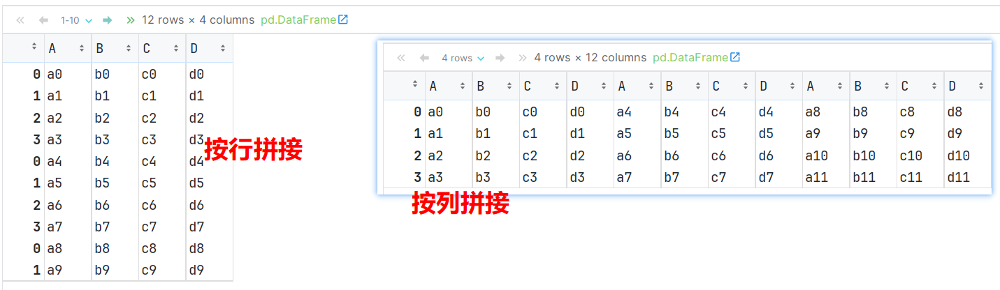

* **测试df按行拼接时, 参考: 列名**

  ```python
  # 5. 自定义df对象, 设置列名, 然后拼接, 并观察结果.
  df4 = pd.DataFrame(['n1', 'n2', 'n3'])
  df4.columns = ['B']      # 加和不加该行, 观察效果.
  
  pd.concat([df1, df4], axis=0)   # 按行拼接, axis=0 可省略不写.
  ```

  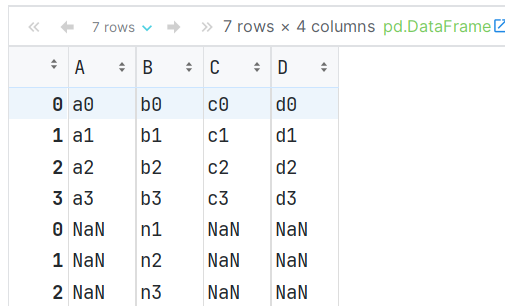

* df对象和Series对象拼接

  ```python
  # 6. 使用concat连接 df 和 Series
  new_series = pd.Series(['n1', 'n2', 'n3', 'n4'])
  # 由于Series是列数据(没有行索引), concat()默认是添加行, 所以 它们拼接会新增一列. 缺值用NaN填充
  pd.concat([df1, new_series], axis='rows')   # 按行拼接    
  pd.concat([df1, new_series], axis=0)        # 0: 行,  1: 列
  
  pd.concat([df1, new_series], axis='columns')    # 0: 行,  1: 列
  pd.concat([df1, new_series], axis=1)            # 0: 行,  1: 列
  ```

  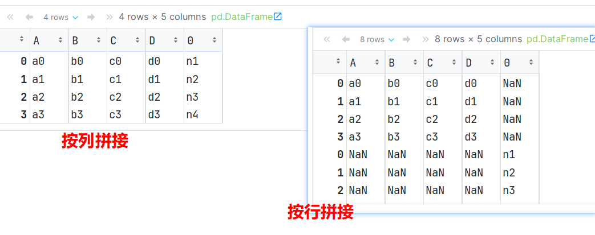

#### 2.DataFrame数据组合-添加行和列

* 如果想将['n1','n2','n3','n4']作为行连接到df1后，可以创建DataFrame并指定列名.

  ```python
  # 传入二维数组, 即: 1行4列数据.
  df5 = pd.DataFrame([['n1', 'n2', 'n3', 'n4']], columns=['A', 'B', 'C', 'D'])
  
  pd.concat([df1, df5])
  ```

  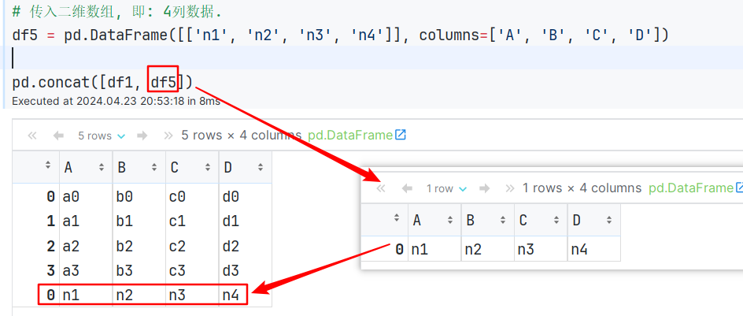

* append函数演示

  > append()函数已过时, 它作用和concat()类似, 在新版的pandas中这个方法已经被删除了.

  ```python
  # concat可以连接多个对象, 例如: df1, df2, df3...
  # 但如果只需要像现有的df对象, 添加1个对象, 可以使用 append()函数实现.
  
  # 演示 append函数, 实现: 追加1个df对象 到 另1个df对象中.
  df1.append(df2)  # 只能行拼接, 且没有axis参数
  
  # ignore_index: 忽略索引, 即: 索引会重置. 
  df1.append(df2, ignore_index=True)
  
  # df对象 使用append追加一个字典时, 必须传入 ignore_index=True 参数
  data_dict = {'A': 'n1', 'B': 'n2', 'C': 'n3'}
  df1.append(data_dict, ignore_index=True)
  ```

  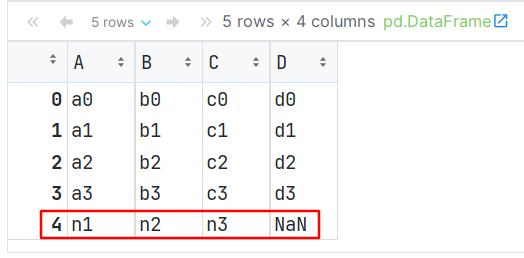

* **向DataFrame添加一列**

  ```python
  # 方式1: 通过 df[列名] = [列值1, 列值2...] 的方式, 可以给 df添加列.
  df1['new_col'] = ['n1', 'n2', 'n3', 'n4']       # 正确
  # df1['new_col'] = ['n1', 'n2', 'n3', 'n4', 'n5'] # 报错, 值的个数 和 行数(4行)不匹配
  # df1['new_col'] = ['n1', 'n2', 'n3']             # 报错, 值的个数 和 行数(4行)不匹配
  df1
  
  
  # 方式2: 通过 df[列名] = Series对象 的方式, 添加1列.      # 值的个数和列的个数, 匹不匹配均可.
  df1['new_col2'] = pd.Series(['n1', 'n2', 'n3'])
  df1['new_col2'] = pd.Series(['n1', 'n2', 'n3', 'n4'])
  df1['new_col2'] = pd.Series(['n1', 'n2', 'n3', 'n4', 'n5'])
  df1
  ```

  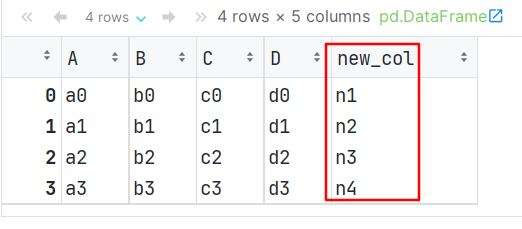

#### 3.df数据组合-merge方式-一对一

* 概述

  * 在使用concat连接数据时，涉及到了参数**join（join = 'inner',join = 'outer'）**

  * 数据库中可以依据共有数据把两个或者多个数据表组合起来，即join操作

  * **DataFrame 也可以实现类似数据库的join操作**

    * Pandas可以通过**pd.join**命令组合数据，

    * 也可以通过**pd.merge**命令组合数据

      > merge更灵活，如果想依据行索引来合并DataFrame可以考虑使用join函数

* 配置PyCharm 连接 Sqlite, 步骤类似于: PyCharm连接MySQL

  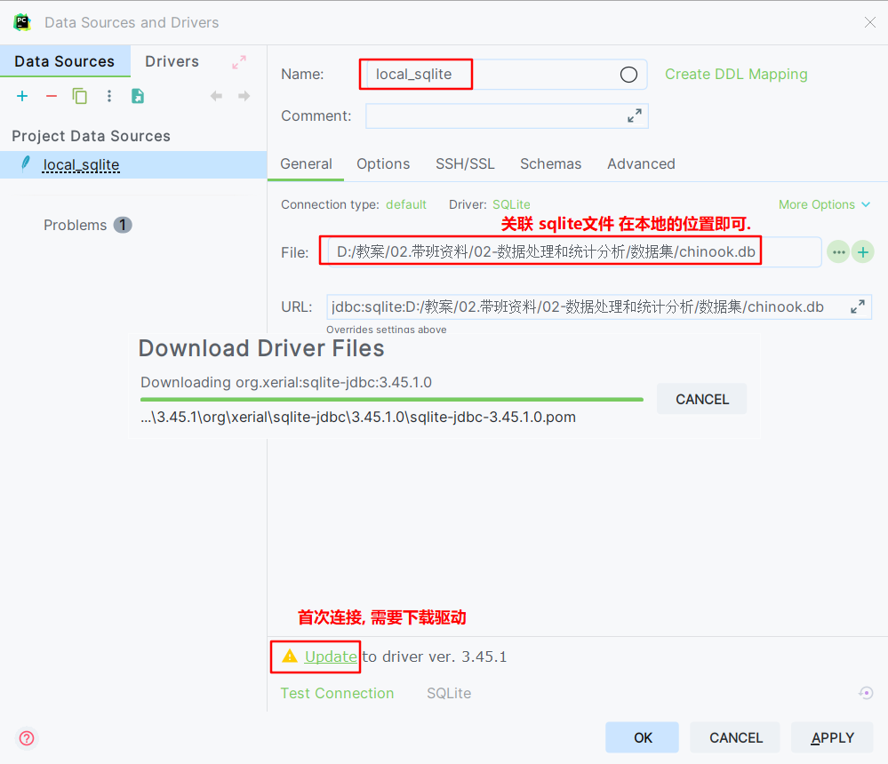

* 代码演示

  * 准备数据

    ```python
    import sqlite3
    
    # 1. 创建连接对象, 关联: Sqlite文件.
    con = sqlite3.connect('data/chinook.db')
    # 2. 读取SQL表数据, 参1: SQL语句, 参2: 连接对象
    tracks = pd.read_sql_query('select * from tracks', con) # track: 歌曲表
    # 3. 查看数据.
    tracks.head()
    
    # 4. read_sql_query()函数, 从数据库中读取表, 参1: SQL语句, 参2: 连接对象.
    genres = pd.read_sql_query('select * from genres', con) #genre:(歌曲流派)歌曲类别表
    genres.head()   # 数据介绍, 列1: 风格id, 列2: 风格名(爵士乐, 金属...)
    ```

  * 从歌曲表中, 抽取部分数据

    ```python
    # 5. 从track表(歌曲表)提取部分数据, 使其不含重复的'GenreID'值
    tracks_subset = tracks.loc[[0, 62, 76, 98, 110, 193, 204, 281, 322, 359], ]
    tracks_subset
    ```

  * 一对一合并

    ```python
    # 歌曲分类表.merge(歌曲表子集的 歌曲id, 分类id, 歌曲时长)   on表示关联字段, how表示连接方式
    # left 类似于SQL的 左外连接, 即: 左表的全集 + 交集.
    genre_track = genres.merge(tracks_subset[['TrackId', 'GenreId', 'Milliseconds']], on='GenreId', how='left')
    
    # right 类似于SQL的 右外连接, 即: 右表的全集 + 交集.
    genre_track = genres.merge(tracks_subset[['TrackId', 'GenreId', 'Milliseconds']], on='GenreId', how='right')
    
    # outer 类似于SQL的 满外连接, 即: 左表的全集 + 右表全集 + 交集.
    genre_track = genres.merge(tracks_subset[['TrackId', 'GenreId', 'Milliseconds']], on='GenreId', how='outer')
    
    # inner 类似于SQL的 内连接, 即: 交集.
    genre_track = genres.merge(tracks_subset[['TrackId', 'GenreId', 'Milliseconds']], on='GenreId', how='inner')
    
    # 如果两张表有相同的列名, 则会分别给其加上 _x, _y的后缀, 来源于: merge()函数自带参数: suffixes,  如下代码, 加入 Name字段, 然后观察显示结果.
    genre_track = genres.merge(tracks_subset[['TrackId', 'Name', 'GenreId', 'Milliseconds']], on='GenreId', how='inner')
    genre_track
    ```

    > 细节:
    >
    > 1. on 连接的字段, 如果**左右两张表 连接的字段名字相同**直接使用 on='关联字段名'
    >
    > 2. 如果名字不同, left_on 写左表字段,  right_on 写右表字段.	
    >
    >  3. 连接之后, 两张表中如果有相同名字的字段, 默认会加上后缀 默认值 _x, _y_
    >
    >     _suffixes:("_ x", "_ y")

* 字段介绍

  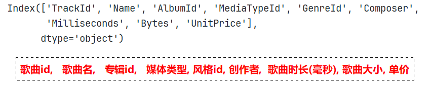

#### 4.df数据组合-merge方式-多对一

* 需求1: 计算每种类型音乐的 平均时长. 

  ```python
  # 1. 获取连接数据, 本次是: tracks(歌曲表) 所有的数据
  genre_track = genres.merge(tracks[['TrackId', 'GenreId', 'Milliseconds']], on='GenreId', how='left')
  genre_track.head()
  
  # 2. 转换时间单位.
  # 需求1: 计算每种类型音乐的 平均时长. 
  # 2.1 根据 类型名分组, 统计时长 平均值即可.
  genre_time = genre_track.groupby('Name')['Milliseconds'].mean()
  
  # 2.2 代码解释
  # pd.to_timedelta(genre_time, unit='ms'):  把 genre_time 转成 timedelta 时间类型.
  # dt.floor('s') 日期类型数据, 按指定单位截断数据, s 表示: 秒
  pd.to_timedelta(genre_time, unit='ms').dt.floor('s').sort_values()
  ```

  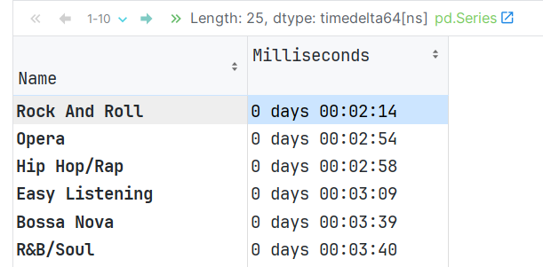

* 需求2(**作业**): 计算每个用户的平均消费


#### 5.df数据组合-join方式

* 概述

  * 使用join合并，可以是依据两个DataFrame的行索引，
  * 或者一个DataFrame的行索引另一个DataFrame的列索引进行数据合并

* 代码演示

  ```python
  # 场景1: 依据两个DataFrame的行索引
  # 如果合并的两个数据有相同的列名，需要通过lsuffix，和rsuffix，指定合并后的列名的后缀
  stocks_2016.join(stocks_2017, lsuffix='_2016', rsuffix='_2017', how='outer') # 默认是: 左外连接.
  
  # 场景2: 将两个DataFrame的Symbol设置为行索引，再次join数据
  stocks_2016.set_index('Symbol').join(stocks_2018.set_index('Symbol'),lsuffix='_2016', rsuffix='_2018')
  
  # 场景3: 将一个DataFrame的Symbol列设置为行索引，与另一个DataFrame的Symbol列进行join
  stocks_2016.join(stocks_2018.set_index('Symbol'),lsuffix='_2016', rsuffix='_2018',on='Symbol')
  
  # 回顾: merge(), concat() 也可以实现拼接.
  stocks_2016.merge(stocks_2018, on='Symbol', how='left')  # 左外连接
  stocks_2016.merge(stocks_2018, on='Symbol', how='outer') # 满外连接 
  ```

  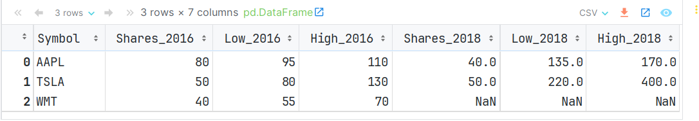


#### 6.缺失值简介和判断

* 简介

  * 好多数据集都含缺失数据。缺失数据有多重表现形式

    * 数据库中，缺失数据表示为NULL
    * 在某些编程语言中用NA表示
    * 缺失值也可能是空字符串（’’）或数值
    * 在Pandas中使用NaN表示缺失值

  * Pandas中的NaN值来自NumPy库，NumPy中缺失值有几种表示形式：

    * NaN，NAN，nan，他们都一样
    * **缺失值和其它类型的数据不同，它毫无意义，NaN不等于0，也不等于空串**

  * 数据中出现缺失值是很常见的

    - 计算的过程中, 两个表join 可能会有缺失
    - 原始的数据中也有可能直接带着缺失值

    - 数据处理和模型训练的时候, 有很多场景要求必须先把缺失值处理掉, 
    - 想处理缺失值先要在数据中找到缺失值

* 代码演示

  ```python
  # 导包
  import numpy as np
  
  # 1. 缺失值不是 True, False, 空字符串, 0等, 它"毫无意义"
  print(np.NaN == False)
  print(np.NaN == True)
  print(np.NaN == 0)
  print(np.NaN == '')
  
  # 2. np.nan np.NAN np.NaN 都是缺失值, 这个类型比较特殊, 不同通过 == 方式判断, 只能通过API
  print(np.NaN == np.nan)
  print(np.NaN == np.NAN)
  print(np.nan == np.NAN)
  
  # 3. Pandas 提供了 isnull() / isna()方法, 用于测试某个值是否为缺失值
  import pandas as pd
  
  print(pd.isnull(np.NaN))    # True
  print(pd.isnull(np.nan))    # True
  print(pd.isnull(np.NAN))    # True
  
  print(pd.isna(np.NaN))  # True
  print(pd.isna(np.nan))  # True
  print(pd.isna(np.NAN))  # True
  
  # isnull() / isna()方法 还可以判断数据.
  print(pd.isnull(20))    # False
  print(pd.isnull('abc'))    # False
  
  # 4. Pandas的notnull() / notna() 方法可以用于判断某个值是否为缺失值
  print(pd.notnull(np.NaN))   # False
  print(pd.notnull('abc'))   # True
  ```


#### 7.加载缺失值

* 读取包含缺失值的数据

  ```python
  # 加载数据时可以通过keep_default_na 与 na_values 指定加载数据时的缺失值
  pd.read_csv('data/survey_visited.csv')
  
  # 加载数据，不包含默认缺失值,  
  # 参数解释: keep_default_na = False  表示加载数据时, 不加载缺失值.
  pd.read_csv('data/survey_visited.csv', keep_default_na=False)
  
  # 加载数据，手动指定缺失值, 例如: 指定619, 734为缺失值
  # 参数解释: na_values=[值1, 值2...]	表示加载数据时, 设定哪些值为缺失值.
  pd.read_csv('data/survey_visited.csv', na_values=['619', '734'], keep_default_na=False)
  ```

  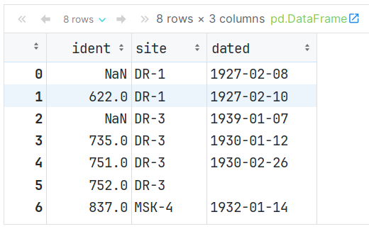


#### 8.缺失值可视化

* 代码演示

  ```python
  # 1. 加载数据
  train = pd.read_csv('data/titanic_train.csv')
  test = pd.read_csv('data/titanic_test.csv')
  train.shape
  train.head()
  
  # 2. 查看是否获救数据.
  train['Survived'].value_counts()    # 0: 没获救.   1: 获救
  
  
  # 3. 缺失值可视化(了解)
  # 如果没有安装这个包, 需要先装一下.
  # pip install missingnode
  
  # 导包
  import missingno as msno
  
  # 柱状图, 展示: 每列的 非空值(即: 非缺失值)个数.
  msno.bar(train) 
  
  # 绘制缺失值热力图, 发现缺失值之间是否有关联, 是不是A这一列缺失, B这一列也会缺失.
  msno.heatmap(train) 
  ```

* 表字段介绍

  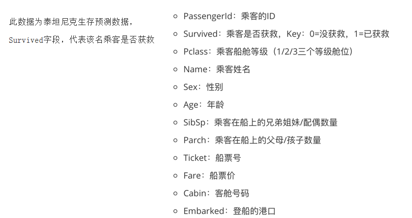


#### 9.缺失值处理和非时序数据缺失值填充

* 删除缺失值

  > dropna()函数, 参数介绍如下:
  >
  > * subset=None  默认是: 删除有缺失值的行, 可以通过这个参数来指定, 哪些列有缺失值才会被删除
  >
  > * 例如: subset = ['Age']  只有当年龄有缺失才会被删除
  >
  > * inplace=False  通用参数, 是否修改原始数据默认False
  >
  > * axis=0 通用参数 按行按列删除 默认行
  >
  > * how='any'  只要有缺失就会删除 还可以传入'all' 全部都是缺失值才会被删除

  ```python
  train.shape     # 原始数据, 891行, 12列
  
  # 方式1: 删除缺失值
  # 删除缺失值会损失信息，并不推荐删除，当缺失数据占比较低的时候，可以尝试使用删除缺失值
  # 按行删除: 删除包含缺失值的记录
  # train.dropna().shape        # 默认按行删(该行只要有空值, 就删除该行), 结果为: 183行, 12列
  train.loc[:10].dropna()       # 获取前11行数据, 删除包含空值的行. 
  
  # any: 只要有空值就删除该行|列, all: 该行|列 全为空才删除  subset: 参考哪些列的空值.  inplace=True 在原表修改  
  train.dropna(subset=['Age'], how='any')
  
  # 该列值只要有空, 就删除该列值.
  train.dropna(how='any', axis=1)  # 0(默认): 行,  1: 列 
  
  train.isnull().sum() # 快速计算是否包含缺失值
  ```

* 非时序数据填充

  ```python
  # 方式2: 填充缺失值, 填充缺失值是指用一个估算的值来去替代缺失数
  # 场景1: 非时间序列数据, 可以使用常量来替换（默认值）
  
  # 用 0 来填充 空值.
  train.fillna(0) 
  # 查看填充后, 每列缺失值 情况.
  train.fillna(0).isnull().sum()
  
  # 需求: 用平均年龄, 来替换 年龄列的空值.
  train['Age'].fillna(train['Age'].mean())
  
  ```

  > 非时序数据的缺失值填充, 直接使用fillna(值, inplace=True)
  >
  > - 可以使用统计量  众数 , 平均值, 中位数 ...
  > - 也可以使用默认值来填充  


#### 10.时序数据填充

* 代码演示

  ```python
  # 1. 加载时间序列数据，数据集为印度城市空气质量数据（2015-2020）
  # parse_dates: 把某些列转成时间列. 
  # index_col:   设置指定列为 索引列
  city_day = pd.read_csv('data/city_day.csv', parse_dates=['Date'], index_col='Date')
  
  # 2. 查看缺失值情况.
  city_day.isnull().sum()
  
  # 3. 数据中有很多缺失值，比如 Xylene（二甲苯）和 PM10 有超过50%的缺失值
  # 3.1 查看包含缺失数据的部分
  city_day['Xylene'][50:64]
  
  # 3.2 用固定值填充, 例如: 该列的平均值.
  # 查看平均值.
  city_day['Xylene'].mean()  # 3.0701278234985114
  # 用平均值来填充.
  city_day.fillna(city_day['Xylene'].mean())[50:64]['Xylene']
  
  # 3.3 使用ffill 填充，用时间序列中空值的上一个非空值填充
  # NaN值的前一个非空值是0.81，可以看到所有的NaN都被填充为0.81
  city_day.fillna(method='ffill')[50:64]['Xylene']
  
  # 3.4 使用bfill填充，用时间序列中空值的下一个非空值填充
  # NaN值的后一个非空值是209，可以看到所有的NaN都被填充为209
  city_day.fillna(method='bfill')[50:64]['Xylene']
  
  # 3.5 线性插值方法填充缺失值
  # 时间序列数据，数据随着时间的变化可能会较大。使用bfill和ffill进行插补并不是解决缺失值问题的最优方案。
  # 线性插值法是一种插补缺失值技术，它假定数据点之间存在线性关系，利用相邻数据点中的非缺失值来计算缺失数据点的值。
  # 参数limit_direction: 表示线性填充时, 参考哪些值(forward: 向前, backward:向后, both:前后均参考)
  city_day.interpolate(limit_direction="both")[50:64]['Xylene']
  ```

* 缺失值处理的套路
  - 能不删就不删 , 如果某列数据, 有大量的缺失值(50% 以上是缺失值, 具体情况具体分析)
  - 如果是类别型的, 可以考虑使用 '缺失' 来进行填充
  - 如果是数值型 可以用一些统计量 (均值/中位数/众数) 或者业务的默认值来填充

#### 11.Series的apply方法

* 概述

  * 当Pandas自带的API不能满足需求, 例如: 我们需要遍历的对Series中的每一条数据/DataFrame中的一列或一行数据做相同的自定义处理, 就可以使用Apply自定义函数
  * apply函数可以接收一个自定义函数, 可以将DataFrame的行/列数据传递给自定义函数处理
  * apply函数类似于编写一个for循环, 遍历行/列的每一个元素,但比使用for循环效率高很多

* 代码演示

  ```python
  import pandas as pd
  
  # 1. 准备数据
  df = pd.DataFrame({'a': [10, 20, 30], 'b': [20, 30, 40]})
  df
  
  
  # 2. 创建1个自定义函数.
  def my_func(x):
      # 求平方
      return x ** 2
  
  
  def my_func2(x, e):
      # 求x的e次方 
      return x ** e
  
  
  # 3. apply方法有一个func参数, 把传入的函数应用于Series的每个元素
  # 注意, 把 my_func 传递给apply的时候,不要加上小括号.
  df['a'].apply(my_func)          # 传入函数对象.
  df['a'].apply(my_func2, e = 2)  # 传入函数对象, e次幂(这里是平方)
  df['a'].apply(my_func2, e = 3)  # 传入函数对象, e次幂(这里是立方)
  ```


#### 12.DataFrame的apply方法

* 格式

  * df.apply(func, axis = )

    > axis = 0 按列传递数据 传入一列数据(Series)
    >
    > axis = 1 按行传递数据 传入一列数据(Series)

* 代码演示

  ```python
  # 1. 把上面创建的 my_func, 直接应用到整个DataFrame中
  df.apply(my_func)   # my_func函数会作用到 df对象的每一个值.
  
  # 2. 报错, df对象是直接传入一列数据的, 并不是 一个值一个值传入的
  def avg_3(x, y, z):
      return (x + y + z) / 3
  df.apply(avg_3)
  
  
  # 3. 演示 df对象, 到底传入啥.
  def my_func3(x):
      print(x)
      print(f'x的数据类型是: {type(x)}')
  
  # 每次传入 1 列    
  # df.apply(my_func3, axis=0)  # 0(默认): 列,  1: 行
  # 每次传入 1 行    
  df.apply(my_func3, axis=1)  # 0(默认): 列,  1: 行
  ```


#### 13.apply应用练习

* 需求1: 计算泰坦尼克数据中, 每列的null值总数, 缺失值占比, 非缺失值占比

  ```python
  # 1. 加载数据
  titanic = pd.read_csv('data/titanic_train.csv')
  titanic.info()
  
  # 2. 该数据集有891行,15列, 其中age 和 deck 两列中包含缺失值
  # 2.1 定义函数, 计算: 数据中有多少null 或 NaN值
  def count_missing(col):
      # 计算一列中, 缺失值的个数.
      return pd.isnull(col).sum()
  
  # 2.2 缺失值占比
  def prop_missing(col):
      # 缺失值总数 / 该列数据总数
      return count_missing(col) / col.size
      
  # 2.3 非缺失值占比
  def prop_complete(col):
      # 缺失值总数 / 该列数据总数
      return 1 - prop_missing(col)
  
  # 3. 调用上述的函数.
  titanic.apply(count_missing)    # 不要加小括号, 传入的是: 函数对象.
  titanic.apply(prop_missing)    # 不要加小括号, 传入的是: 函数对象.
  titanic.apply(prop_complete)    # 不要加小括号, 传入的是: 函数对象.
  ```

* 需求2: 统计泰坦尼克 的数据中, 各年龄段总人数.

  ```python
  # 1. 定义函数, 实现把 年龄 转成 年龄段
  def cut_age(age):
      if age < 18:
          return '未成年'
      elif 18 <= age < 40:
          return '青年'
      elif 40 <= age < 60:
          return '中年'
      elif 60 <= age < 81:
          return '老年'
      else:
          return '未知'
      
  # 2. 调用上述的函数. 
  titanic['Age'].apply(cut_age)
  
  # 3. 统计每个年龄段, 共有多少人.
  titanic['Age'].apply(cut_age).value_counts()
  ```

* 需求3: 统计VIP 和 非VIP的客户总数

  ```python
  # 定义函数, 判断是否是VIP客户
  # 条件: 乘客船舱等级为 1     并且 名字中带 'Master', 'Dr' 或者 'Sir' 
  def get_vip(x):
      if x['Pclass'] == 1 and ('Master' in x['Name'] or 'Dr' in x['Name'] or 'Sir' in x['Name']):
          return 'VIP'
      else:
          return 'Normal'
  
  
  # axis = 1, 表示以行的方式传入. 
  titanic.apply(get_vip, axis=1).value_counts()
  ```


