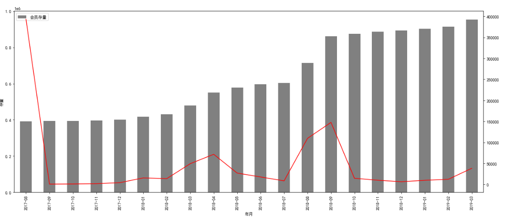
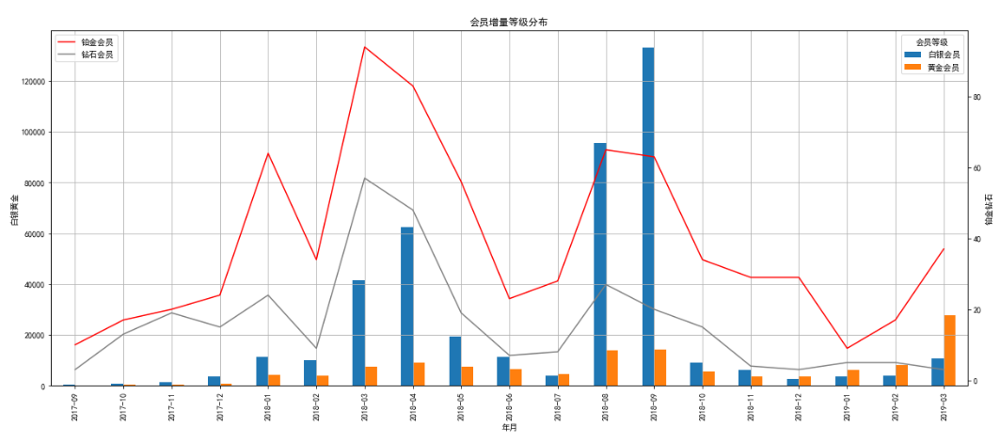
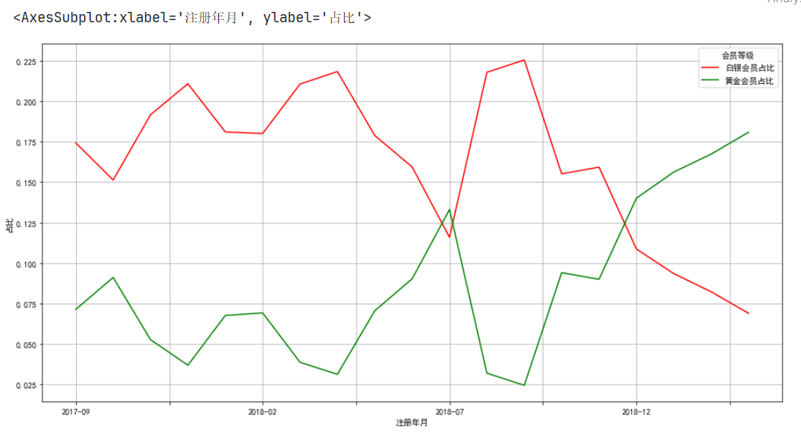

#### 内容大纲介绍

* 向量化函数及Lambda表达式
* 分组操作相关
  * 分组聚合
  * 分组转换
  * 分组过滤
* DataFrameGroupBy对象介绍
* 会员分析案例-数据透视表

---

#### 1.向量化函数

* 分析代码

  ```python
  def avg_test2(x,y):
      if x==20:
          return np.NaN
      else:
          return (x+y)/2
  avg_test2(df['a'],df['b'])
  ```

* 报错原因

  * 上面的方法调用之所以报错, 就是因为if 需要传入的是 一个True/False .
  *  但是我们传入的是一个 True/False 组成的Series  此时if 不能做出判断, 抛出了错误
  * 想让上面的代码正常的执行, 我们需要把 Series里的每一个值遍历的传递给if 做多次判断, 
  * 此时必须要自己写for循环, 可以通过 np.vectorize(avg_test2) 这种方式, 
  * 把这个方法变成一个向量化的方法(会遍历每一个值(分量)多次调用这个方法)

* 具体代码演示

  ```python
  import numpy as np
  import pandas as pd
  
  # 1. 创建1个df对象
  df = pd.DataFrame({'a': [10, 20, 30], 'b': [20, 30, 40]})
  # 2. 查看数据
  df
  
  # 3. 创建自定义函数.
  def avg_2(x, y):
      return (x + y) / 2
  
  # 4. 调用自定义函数.
  avg_2(df['a'], df['b'])
  
  
  
  # 5. 修改上述的函数. 
  @ np.vectorize      # 装饰器方式实现向量化
  def avg_2_mod(x, y):
      if x == 20: # 报错, x是向量(一列数据), 20是标量(1个数据)
          return np.NAN
      else:
          return (x + y) / 2
      
  avg_2_mod(df['a'], df['b'])     # 如果是装饰器方式实现了向量化操作, 则这里不会报错.
  
  
  # 6. 使用 np.vectorize 将函数向量化.
  # 写法1: 通过 np.vectorize(要被向量化的函数名) 方式实现.
  avg_2_mod_vec = np.vectorize(avg_2_mod)
  avg_2_mod_vec(df['a'], df['b'])
  ```


#### 2.Lambda表达式

* 背景

  * 当函数比较简单的时候, 没有必要创建一个def 一个函数, 可以使用lambda表达式创建匿名函数

* 格式

  ```python
  lambda 形参列表 : 函数体
  ```

* 代码演示

  ```python
  df.apply(lambda x: x + 1)
  df.apply(lambda x: x.isnull().sum())
  df.apply(lambda x: x.mean())
  ```


#### 3.分组聚合

* 概述

  * 在SQL中我们经常使用 GROUP BY 将某个字段,按不同的取值进行分组, 
  * 在pandas中也有groupby函数, 分组之后,每组都会有至少1条数据, 将这些数据进一步处理, 
  * 返回单个值的过程就是聚合,比如分组之后计算算术平均值, 或者分组之后计算频数,都属于聚合

* 代码演示

  * 基础写法

    ```python
    # 1. 读取数据.
    import pandas as pd
    
    df = pd.read_csv('data/gapminder.tsv', sep='\t')
    df.head()
    
    
    # 2. 需求1: 对 year 分组, 求每年的平均寿命
    # 2.1 代码实现
    df.groupby('year').lifeExp.mean()
    
    # 2.2 分析上述代码原理, 先查看year数据, 有几个值.
    df['year'].unique()
    
    # 2.3 计算第1组(年)的 平均寿命, 依次类推, 计算每组的平均值即可.
    df[df['year'] == 1952]['lifeExp'].mean()
    df[df.year == 1952].lifeExp.mean()  # 效果同上.
    
    
    # 3. 需求2: 统计每个大洲, 平均寿命.
    # 3.1 代码实现上述需求
    df.groupby('continent').lifeExp.mean()
    
    # 3.2 也可以用 agg函数.
    df.groupby('continent').lifeExp.agg('mean')  # 效果同上.
    df.groupby('continent').agg({'lifeExp': 'mean'})  # 效果同上.
    df.groupby('continent').aggregate({'lifeExp': 'mean'})  # 效果同上.
    
    # 3.3 也可以使用Numpy库的mean()函数
    import numpy as np
    
    df.groupby('continent').agg({'lifeExp': np.mean})  # 效果同上.
    
    # 3.4 分组之后, 也可以通过调用 describe()函数, 查看具体的统计信息. 
    df.groupby('continent').lifeExp.describe()
    
    ```

  * 调用自定义函数

    ```python
    # 4.自定义函数, 如果想在聚合的时候, 使用非Pandas或其他库提供的计算，可以自定义函数然后在aggregate中调用它
    # 4.1 自定义函数, 计算平均值.
    def my_mean(col):
        # df传入的是一列(Series对象), 直接计算: 该列和 / 该列总数 即可.
        return col.sum() / col.size
    
    
    # 4.2 调用自定义函数.
    df.groupby('year').lifeExp.agg(my_mean)
    
    
    
    # 5. 计算每年平均寿命 和 数据集整体的平均寿命的差值.
    # 5.1 自定义函数, 参1: 某列数据.  参2: 数据集整体的平均寿命
    def my_mean_diff(s, global_mean):
        return s.mean() - global_mean
    
    
    # 5.2 调用函数.
    # 计算平均值
    global_mean = df['lifeExp'].mean()
    # 调用函数
    df.groupby('year').lifeExp.agg(my_mean_diff, global_mean)
    ```

  * 同时传入多个函数

    ```python
    # 6. 同时传入多个函数
    # 分组之后想计算多个聚合函数,可以把它们全部放入一个Python列表,然后把整个列表传入agg或aggregate中
    # 需求: 按年计算lifeExp 的非零个数,平均值和标准差
    df.groupby('year').lifeExp.agg([np.count_nonzero, np.mean, np.std])
    
    # 分组之后,可以对多个字段用不同的方式聚合
    df.groupby('year').agg({'lifeExp':'mean','pop':'median','gdpPercap':'median'})
    
    ```


#### 4.分组转换

* 概述

  * transform 需要把DataFrame中的值传递给一个函数， 而后由该函数"转换"数据。
  * 即: aggregate(聚合) 返回单个聚合值，但transform 不会减少数据量

* 代码演示

  * 需求1: **计算z-score(也叫: z分数, 标准分数)**

    ```python
    # 需求1: 计算z-score(也叫: z分数, 标准分数), 即: (x - 平均值) / 标准差
    def my_zscore(x):
        # (每一组的值 - 当前组的平均值) / 当前组的标准差
        return (x-x.mean())/x.std()
    
    # 按年分组 计算z-score
    df.groupby('year').lifeExp.transform(my_zscore)
    
    # 查看数据集条目数， 跟之前transform处理之后的条目数一样
    df.shape    # 1704行, 6列
    ```

  * 需求2: **transform 分组填充缺失值**

    > 不同性别填充的缺失值, 是各自性别的总消费平均值

    ```python
    # 需求2: transform 分组填充缺失值
    
    # 之前介绍了填充缺失值的各种方法，对于某些数据集，可以使用列的平均值来填充缺失值。
    # 某些情况下，可以考虑将列进行分组，分组之后取平均再填充缺失值
    
    # 1. 加载数据, tips = 小费的数据, 字段为: 总账单, 小费, 性别, 是否抽烟, 周几, 什么餐(午餐, 晚餐), 几个人(一起吃饭)
    # sample(): 随机抽样的, 参1: 抽几条数据, 参2: 随机种子, 如果种子一样, 每次抽取的数据都是一样的. 
    tips_10 = pd.read_csv('data/tips.csv').sample(10, random_state = 42)
    
    # 2. 构建缺失值
    # np.random.permutation 将序列乱序
    tips_10.loc[np.random.permutation(tips_10.index)[:4], 'total_bill'] = np.NaN
    tips_10
    
    # 3. 查看缺失情况
    count_sex = tips_10.groupby('sex').count()
    count_sex
    
    
    # 4. 定义函数填充缺失值
    def fill_na_mean(x):
        # 计算每组的 小费平均值, 利用均值填充缺失值.
        return x.fillna(x.mean())
    
    # 5. 根据性别进行分组, 对总消费的缺失值做自定义处理, 使用了分组转换. 
    tips_10.groupby('sex').total_bill.transform(fill_na_mean)
    
    ```

  > 分组转换跟SQL中的窗口函数中的聚合函数作用一样
  >
  > - 可以把每一条数据和这个数据所属的组的一个聚合值在放在一起, 可以根据需求进行相应计算


#### 5.分组过滤

* 概述

  * 使用groupby方法还可以过滤数据
  * 调用filter 方法，传入一个返回布尔值的函数，返回False的数据会被过滤掉

* 代码演示

  ```python
  # 需求: 根据就餐人数进行分组, 过滤掉条目数少于30条的组
  # 1. 使用小费数据
  tips = pd.read_csv('data/tips.csv')
  
  # 2. 查看用餐人数
  tips['size'].value_counts()
  
  # 3. 人数为1、5和6人的数据比较少，考虑将这部分数据过滤掉
  tips_filtered = tips.groupby('size').filter(lambda x: x['size'].count() > 30)
  
  # 4. 查看结果
  tips_filtered['size'].value_counts()
  
  # 5. 合并版写法
  tips.groupby('size').filter(lambda x: x['size'].count() > 30)['size'].value_counts()
  
  ```


#### 6.DataFrameGroupby对象

* 概述

  * 调用了groupby方法之后, 就会返回一个DataFrameGroupby对象

* 代码演示

  ```python
  # 1. 准备数据
  tips_10 = pd.read_csv('data/tips.csv').sample(10,random_state = 42)
  
  # 2. 调用groupby 创建分组对象, 按性别分组
  grouped = tips_10.groupby('sex')
  
  # 3. 查看grouped
  grouped     # grouped是一个DataFrameGroupBy对象
  
  
  # 4. 通过groups属性查看计算过的分组
  grouped.groups
  
  # 5. 上面返回的结果是DataFrame的索引，实际上就是原始数据的行数
  # 在DataFrameGroupBy对象基础上，直接就可以进行aggregate,transform计算了
  grouped.mean()
  
  # 6. 上面结果直接计算了按sex分组后，所有列的平均值，但只返回了数值列的结果，非数值列不会计算平均值
  # 通过get_group选择分组
  female = grouped.get_group('Female')
  female
  
  # 7. 通过groupby对象，可以遍历所有分组
  # 相比于在groupby之后使用aggregate、transform和filter，有时候使用for循环解决问题更简单
  for sex_group in grouped:
      # print(sex_group)    # 返回的是元组形式, 索引0: 分组名, 索引1: 该分组的信息.
      print(sex_group[1]) # 只看该分组的信息
  
  # 细节: DataFrameGroupBy对象直接传入索引，会报错   
  # grouped[0]      # 报错
  
  
  
  # 8. 多个字段分组, 例如: 按性别 和 用餐时间 分别计算小费数据的平均值.
  tips_10.groupby(['sex', 'time']).mean()
  
  # 不把分组字段作为索引列.
  tips_10.groupby(['sex', 'time'], as_index=False).mean()
  ```


#### 7.会员分析-数据透视表

* 概述

  * 数据透视表（Pivot Table）是一种交互式的表，可以进行某些计算，如求和与计数等。
  * 所进行的计算与数据跟数据透视表中的排列有关。之所以称为数据透视表，是因为可以动态地改变它们的版面布置，以便按照不同方式分析数据，也可以重新安排行号、列标和页字段。每一次改变版面布置时，数据透视表会立即按照新的布置重新计算数据。
  * 另外，如果原始数据发生更改，则可以更新数据透视表。在使用Excel做数据分析时，透视表是很常用的功能，Pandas也提供了透视表功能，对应的API为**pivot_table**

* pivot_table函数介绍

  * pandas有两个pivot_table函数
    * pandas.pivot_table
    * pandas.DataFrame.pivot_table
  * pandas.pivot_table 比 pandas.DataFrame.pivot_table 多了一个参数data，data就是一个dataframe，**实际上这两个函数相同**
  * pivot_table参数中最重要的四个参数 :
    * values: 要做聚合操作的列名
    * index: 行索引, 传入原始数据的列名, 这一列中每个取值会作为透视表结果的1个行索引.
    * columns: 列索引, 传入原始数据的列名, 这一列中每个取值会作为透视表结果的1列.
    * aggfunc: 聚合函数

* 会员分析介绍

  * 分析会员运营的基本情况,  从**量的角度**分析会员运营情况：

    ① 整体会员运营情况（存量，增量）

    ② 不同渠道（线上，线下）的会员运营情况

    ③ 线下业务，拆解到不同的地区、门店会员运营情况

  * 从**质的角度**分析会员运营情况：

    ① 会销比, 即:  会员消费占整体消费的占比

    ② 连带率, 即: 是不是每次购买商品的时候, 都购买一件以上

    ③ 复购率, 即:  是不是买了之后, 又来买

* 需求1: **按月统计注册的会员数量(即: 月增量)**

  * 思路1: 普通方式实现.

    ```python
    # 3. 需求1: 按月统计注册的会员数量, 注册时间原始数据需要处理成 年-月 的形式
    from datetime import datetime
    
    # 3.1 给 会员信息表 添加年月列
    customer_info.loc[:, '注册年月'] = customer_info['注册时间'].apply(lambda x: x.strftime('%Y-%m'))
    
    # 3.2 查看我们要的 几列信息.
    customer_info[['会员卡号', '会员等级', '会员来源', '注册时间', '注册年月']].head()
    
    # 3.3 根据注册年月分组, 统计每组的 总数, 即为: 当月注册的会员数量
    month_count = customer_info.groupby('注册年月')[['会员卡号']].count()
    month_count.columns = ['月增量']
    month_count.head()
    
    import matplotlib.pyplot as plt
    plt.rcParams['font.sans-serif'] = ['SimHei'] # 正常显示汉字
    plt.rcParams['axes.unicode_minus'] = False # 正常显示负号
    
    # 3.4 绘图.  去掉第1个月份的数据(因为这个包括之前的总会员数)
    month_count[1:].plot(figsize=(20, 10))
    ```

  * 思路2: 透视表的方式实现

    ```python
    # 参数解释:
    #   index: 哪一列数据作为 行索引.
    #   columns: 哪一列数据作为列名.
    #   values:  对哪一列值做统计.
    #   aggfunc: 聚合方式
    customer_info.pivot_table(index='注册年月', values='会员卡号', aggfunc='count')
    ```

* 需求2: **按月统计注册的会员存量**

  ```python
  # 需求2: 计算 月会员存量
  # 1. 基于每月的 月增量, 累加求和即可.
  month_count.loc[:, '会员存量'] = month_count['月增量'].cumsum()
  
  # 2. 报表展示下, 月会员存量.
  month_count['会员存量'].plot(kind='bar', figsize=(16, 8))
  ```

* 可视化

  ```python
  import matplotlib as plt
  
  month_count['月增量'].plot(figsize=(20,8), color='red', secondary_y=True)
  
  # legend: True, 显示图例.
  month_count['会员存量'].plot(kind='bar', figsize=(20,8), color='gray', xlabel='年月',  legend=True, ylabel='存量')
  ```

  

#### 8.会员分析-会员增量等级分析

* 概述

  * 会员增量存量不能真实反映会员运营的质量，需要对会员的增量存量数据做进一步拆解
  * 从哪些维度来拆解？
    * 从指标构成来拆解：
      * 会员 = 白银会员+黄金会员+铂金会员+钻石会员
    * 从业务流程来拆解：
      * 当前案例，业务分线上、线下，又可以进一步拆解：按大区，按门店
  * **由于会员等级跟消费金额挂钩，所以会员等级分布分析可以说明会员的质量**

* 需求: 统计月增量会员中-会员等级分布

  ```python
  # 方式1: groupby写法.
  member_rating.groupby(['注册年月','会员等级'])['会员卡号'].count().unstack()
  
  # 方式2: 透视表
  member_rating = customer_info.pivot_table(index='注册年月',columns='会员等级',values='会员卡号',aggfunc='count')
  member_level = member_level[1:]
  ```

* 可视化

  ```python
  # 3. 绘制图表-增量等级分布
  import matplotlib.pyplot as plt
  
  # 3.1 构建坐标系
  fig, ax1 = plt.subplots(figsize=(20, 8))
  
  # 3.2 构建双胞胎坐标系, 即: 通过ax1 创建了一个共享x轴的坐标系 ax2
  ax2 = ax1.twinx()  
  
  # 3.3 plt.subplots 创建了一个绘图区域 fig 和坐标系 ax1  
  # grid=True 添加网格线  
  # xlabel/ylabel x轴y轴 起名  
  # legend 图例
  member_rating[['白银会员', '黄金会员']].plot.bar(ax=ax1, grid=True, xlabel='年月', ylabel='白银黄金', legend=True)
  member_rating[['铂金会员', '钻石会员']].plot(ax=ax2, color=['red', 'gray'], ylabel='铂金钻石', legend=True)
  # 3.4 把ax2 坐标系 图例显示的地方调整到左上角
  ax2.legend(loc='upper left')
  plt.title('会员增量等级分布')
  plt.show()
  ```

  


#### 9.会员分析-存量等级分布分析

* 代码实现

  ```python
  # 需求: 计算不同等级会员占比
  member_rating.loc[:, '总计'] = member_rating.sum(axis=1)
  member_rating.loc[:, '白银会员占比'] = member_rating['白银会员'] / member_rating['总计']
  member_rating.loc[:, '黄金会员占比'] = member_rating['黄金会员'] / member_rating['总计']
  ```

* 可视化

  ```python
  # 黄金白银会员占比可视化
  member_rating[['白银会员占比', '黄金会员占比']].plot(color=['r', 'g'], ylabel='占比', figsize=(16, 8), grid=True)
  ```

  


#### 10.会员分析-整体等级分布

* 代码实现

  ```python
  ratio = customer_info.groupby('会员等级')[['会员卡号']].count()
  customer_info.pivot_table(index='会员等级',values='会员卡号',aggfunc='count')
  ratio.columns=['会员数']
  ratio['占比'] = ratio['会员数']/ratio['会员数'].sum()
  ratio
  ```

* 绘制饼图

  ```python
  ratio.loc[['白银会员','铂金会员','黄金会员','钻石会员'],'占比'].plot.pie(figsize=(16,8), autopct='%.2f%%',fontsize=16)
  ```

  > 由于铂金会员/钻石会员占比较低, 绘图之前先调整在数据中的顺序, 让铂金会员和钻石会员在数据中不要挨着
  >
  > pie 绘制饼图
  >
  > autopct 控制显示饼图的占比数据图例   .2f% 表示保留两位有效数字
  >
  > fontsize = 16 控制字体大小


#### 11.会员分析-线上线下增量分析

* 代码实现

  ```python
  customer_info['会员来源'].value_counts()
  ```

* 从数据中看出, 主要来**线下扫码,** 计算每个月 线上线下的会员增量

  ```python
  # 方式1: groupby分组信息
  customer_info.groupby(['注册年月','会员来源'])['会员卡号'].count().unstack()
  
  # 方式2: pirvot_table 透视表方式实现
  online_offline = customer_info.pivot_table(index='注册年月',columns='会员来源',values='会员卡号',aggfunc='count')
  ```

* 数据可视化

  ```python
  online_offline[1:].plot(figsize=(16,8),grid=True)
  plt.title('线上线下会员增量分析')
  plt.show()
  ```