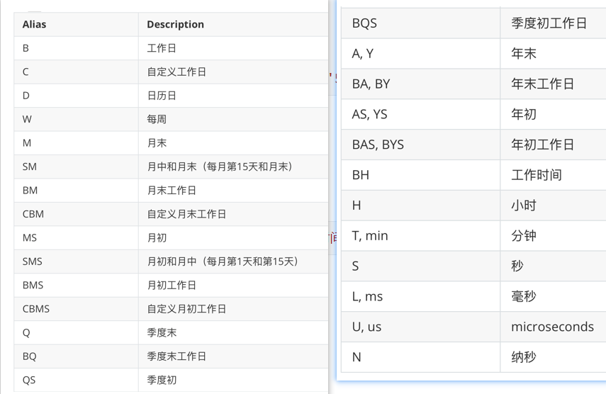
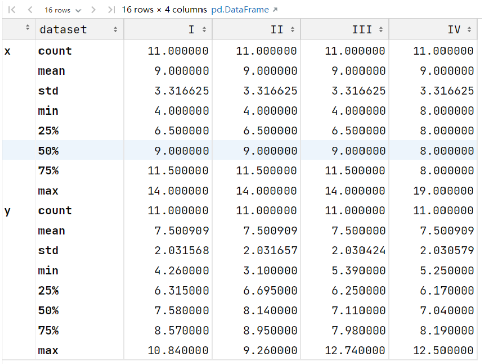
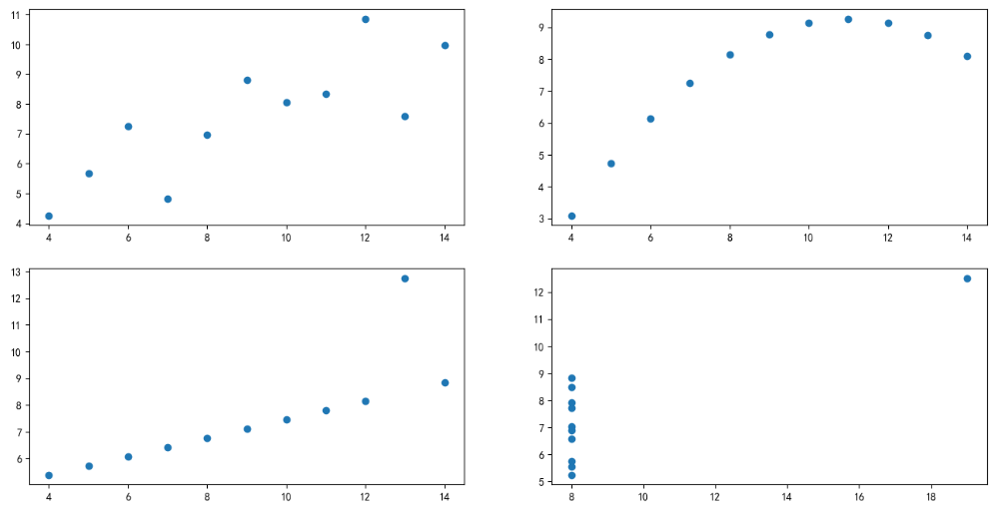
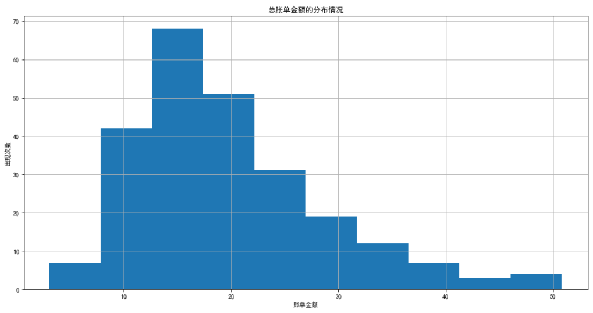
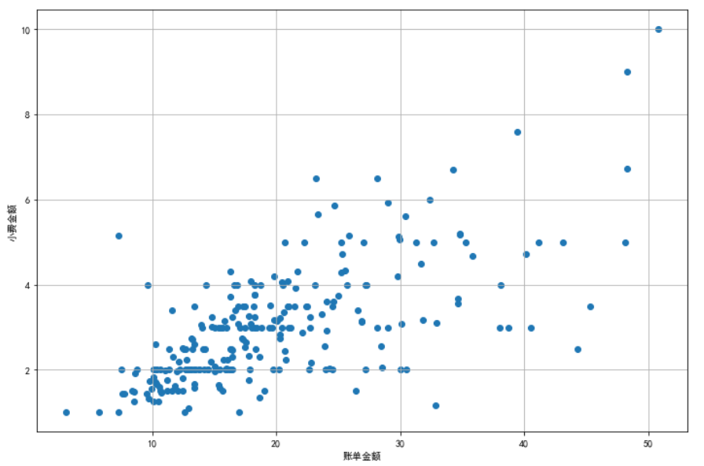
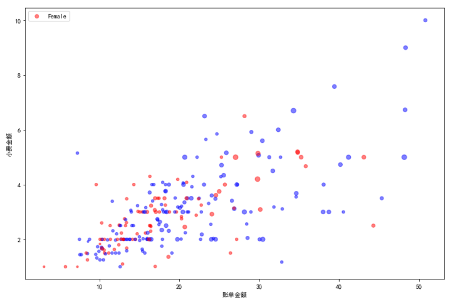

#### 今日内容大纲

* 日期类型处理
  * 获取日期中不同部分
  * 日期运算
  * 日期索引
  * 生成日期时间序列
* 数据可视化介绍
* Matplotlib API介绍
  * 直方图
  * 散点图

---

#### 1.Pandas日期时间类型简介

* 概述

  * 和其它语言类似, Python内置了datetime对象，可以在datetime库中找到
  * pandas的日期时间类型默认是 datetime64[ns]

* 实例代码

  * Python中的-日期时间类型

    ```python
    # 导包
    from datetime import datetime   # 这个是原生Python包的内容
    import pandas as pd
    
    # 场景1: 演示Python中的 日期时间类型
    # 1. 获取当前时间
    t1 = datetime.now()
    t1  # datetime.datetime(2024, 4, 26, 20, 6, 8, 677626)
    
    # 2. 可以手动设置日期.
    t2 = datetime(2024, 5, 1)
    t2  # datetime.datetime(2024, 5, 1, 0, 0)
    
    # 3. 计算两个日期差.
    t2 - t1 # datetime.timedelta(days=4, seconds=13935, microseconds=831597)
    ```

  * Pandas中的-日期时间类型

    ```python
    # 1. 加载: 疫情期间的 埃博拉数据.
    ebola = pd.read_csv('data/country_timeseries.csv')
    ebola.head()
    
    # 2. 查看每列详情.
    ebola.info()    # 发现 Date是object(字符串类型)的
    
    # 3. 把Date列转成 datetime类型的时间, 并添加到 ebola这个df对象中.
    ebola['date_df'] = pd.to_datetime(ebola['Date'])
    
    # 4. 再次查看 ebola 这个df对象的列信息.
    # 发现 date_df列 是 datetime64[ns]日期类型(可以精确到纳秒, 准不准就是另一回事儿了)
    ebola.info()     # pandas 中默认的日期时间类型就是 datetime64[ns]
    
    # 5. 也可以通过如下的函数, 直接封装日期时间类对象.
    # 这个是: 日期时间戳 对象
    pd.Timestamp(2024, 5, 1)    # Timestamp('2024-05-01 00:00:00')
    # 这个是: 日期时间 对象.
    pd.datetime(2024, 5, 1)     # datetime.datetime(2024, 5, 1, 0, 0), 结果是python的日期类型
    
    # 6. pandas支持, 读取文件数据的时候, 把指定列转成日期列.
    # 写列名 或者 写列的索引均可, 但是需要传入: 列表形式的数据, 因为可能要转换的列有多列.
    ebola = pd.read_csv('data/country_timeseries.csv', parse_dates=['Date'])
    # ebola = pd.read_csv('data/country_timeseries.csv', parse_dates=[0])
    ebola.info()
    
    ```


#### 2.日期时间类型-获取日期中不同部分

```python
# 1. 获取日期时间类型的 对象.
time_stamp = pd.to_datetime('2024-05-13')   # 把字符串转成 Timestamp类型.
time_stamp  # panda的日期时间类型(时间戳)

# 2. 获取年
time_stamp.year
time_stamp.month
time_stamp.day
time_stamp.dayofyear	# 年中第几天


# 3. 获取埃博拉数据的年, 月, 日.
# .dt 是把Series对象转成 DatetimeProperties 对象, 然后就能获取不同的时间了.
ebola['year'] = ebola['Date'].dt.year
ebola['month'] = ebola['Date'].dt.month
ebola['day'] = ebola['Date'].dt.day

# 4. 查看ebola数据
ebola.info()
```


#### 3.日期时间类型-日期运算

* 案例1: 埃博拉数据演示

  ```python
  # 1. 计算各个国家, 疫情爆发的天数
  # 埃博拉数据中, Day表示各个国家, 疫情爆发的时间(第几天)
  ebola['Date'] - ebola['Date'].min()
  
  # 2. 给ebola这个df对象新增一列, 表示: 疫情天数, 即: 日期 - 爆发的哪一天
  ebola['outbreak_d'] = ebola['Date'] - ebola['Date'].min()
  
  # 3. 查看数据
  ebola.head()
  ebola.info()    # 能看到 outbreak_d 列为: timedelta64[ns] (日期差类型)
  ```

* 案例2: 银行数据演示

  ```python
  # 1. 加载银行数据, 把最后两列转为: 日期列
  banks = pd.read_csv('data/banklist.csv', parse_dates=[5, 6])
  banks.info()
  
  # 2. 计算银行倒闭的季度 和 年份, 并把该列值添加到 df中.
  banks['Closing_Quarter'], banks['Closing_Year'] = (banks['Closing Date'].dt.quarter, banks['Closing Date'].dt.year)
  banks
  
  # 3. 统计每年倒闭的银行数.
  banks['Closing_Year'].value_counts()
  
  # 4. 计算每年, 每季度, 银行倒闭数.
  banks.groupby(['Closing_Year', 'Closing_Quarter']).size()   # 统计长度(个数).
  banks.groupby(['Closing_Year', 'Closing_Quarter']).count()  # 统计个数, 效果同上.
  
  # 透视表方式实现, 效果同上.
  banks.pivot_table(index=['Closing_Year', 'Closing_Quarter'], values='Bank Name', aggfunc='count')
  
  # 5. 可视化展示
  banks.pivot_table(index=['Closing_Year', 'Closing_Quarter'], values='Bank Name', aggfunc='count').plot(grid=True)
  ```


#### 4.日期时间索引

```python
# 1. 加载特斯拉股票数据.
tesla_stock = pd.read_csv('data/TSLA.csv', parse_dates=[0])
tesla_stock

# 2. 查看该df的列信息
tesla_stock.info()

# 3. 获取开盘价, 最小值, 最大值
tesla_stock['Open'].min()
tesla_stock['Open'].max()

# 4. 获取2015年, 8月的数据
# 方式1: 不使用日期索引,   df对象[(条件1) & (条件2)]
# & 支持   Series 和 Series的比较
# and 不支持 Series 和 Series的比较
tesla_stock[(tesla_stock['Date'].dt.year == 2018) & (tesla_stock['Date'].dt.month == 8)]

# 方式2: 使用日期索引实现.
tesla_stock.set_index('Date', inplace=True)
# tesla_stock
tesla_stock.loc['2015-08']
# tesla_stock['2015-08']  这种写法在2.0的版本已经被删除了


# 还可以使用 timedelta 类型-时间差类型 实现.
tesla_stock['ref_date'] = tesla_stock['Date'] - tesla_stock['Date'].min()

# 把timedelta设置为 index
# tesla_stock.set_index('ref_date')
tesla_stock.index = tesla_stock['ref_date'] # 效果同上

# 查看数据
tesla_stock.head()

# 基于ref_date 来选择数据
tesla_stock['0 days' : '5 days']

# 注意: 切片方式获取数据, (切片列)要求是要有序的
tesla_stock['5 days' : '0 days']    # 获取不到数据.

# 这个可以获取到数据.
tesla_stock.sort_index(ascending=False)['5 days' : '0 days']
```


#### 5.生成日期时间序列

* 格式

  ```python
  pd.date_range('起始时间','结束时间', freq= 生成时间序列的方式)	# frequency:出现频次
  ```

* 参数`freq`可以取得值

  

* 示例代码

  ```python
  # 1. 生成日期时间序列, 参1: 开始时间,  参2: 结束时间,  
  # 参3:freq(frequency) 出现频次, 默认是: D, 表示日历日
  pd.date_range('2024-04-01','2024-05-31')
  
  # 2. 隔一个工作日获取一个工作日(即: 周一 ~ 周五)
  pd.date_range('2024-04-01','2024-05-31', freq='2B')
  
  # 3. 每个月的第一个周四, Week Of Month, Thursday
  pd.date_range('2024-04-01','2024-05-31', freq='WOM-1THU')
  
  # 4. 每个月的第一个周五, Week Of Month, Friday
  pd.date_range('2024-04-01','2024-05-31', freq='WOM-1Fri')
  
  ```

* 日期时间类型-总结

  * Pandas关于日期时间的数据 有如下几种数据类型

    - TimeStamp 时间戳 就是一个时间点
    - Datetime64 一列时间数据  →DatetimeIndex
    - TimeDelta64 两列时间的差值  → TimedeltaIndex

  * 如果数据中包含了日期时间的数据, 并且后续计算/数据的处理需要用到日期时间类型数据的特性需要把他转换成日期时间类型

    - pd.to_datetime(一列数据)  
    - pd.read_csv(parse_dates= [列名/序号]) 加载的时候直接进行转换

  * 还可以通过Pandas提供的API生成日期时间的序列

    pd.date_range('起始时间','结束时间', freq= 生成时间序列的方式)

  * 在特征处理/数据处理 看见日期时间类型数据需要马上反映出通过这一列数据,可以做出很多列特征来

    - df['Date'].dt.year 年
    - df['Date'].dt.month 月
    - df['Date'].dt.quarter 季度 
    - df['Date'].dt.dayofweek 星期几
    - 如果想快速的对日期进行切片/范围选取的操作, 可以把它转换成日期时间索引


#### 6. 日期时间数据类型-练习

* 需求1: 获取`某天`或者`某个时间段`的报警记录

  ```python
  # 1. 加载数据源(报警记录数据).
  # 字段为: 犯罪类型id, 犯罪类别id, 报警日期, 经度, 维度, 小区id, 是否犯罪, 是否是交通事故
  crime = pd.read_csv('data/crime.csv', parse_dates=['REPORTED_DATE'], index_col='REPORTED_DATE')
  crime
  
  # 2. 查看犯罪类型id
  # crime['OFFENSE_CATEGORY_ID'].value_counts()
  
  # 3. 把报警时间设置为行索引, 如果加载数据时没有设置, 可以用如下方式.
  # crime.set_index('REPORTED_DATE',inplace=True)
  
  # 4. 获取某天的报警记录, 例如: 行索引为 '2016-05-11' 的数据
  crime.loc['2016-05-11']
  
  # 5. 获取一段时间内的报警记录
  crime.loc['2015-3-1 12:57:00':'2016-01-13 15:26:00']
  crime.loc['2015-03-01':'2016-03-01'].sort_index()    # 不要时分秒.
  
  
  # 6. 查询凌晨2点到凌晨5点的报警记录
  # include_start: 是否包括起始值
  # include_end: 是否包括结束值
  crime.between_time('2:00','5:00',include_start=False)
  
  # 7. 查看某个具体的时刻. 例如: 查看5:43分的报警记录
  crime.at_time('5:43')
  ```

* 需求2: 获取某个时间段的报警记录, `效率对比`

  ```python
  # 8. 获取某个时间段内的报警记录.
  # 8.1 获取 根据行索引排序后的内容
  crime_sorted = crime.sort_index()
  crime_sorted
  
  # 8.2 获取某个时间段内的报警记录.
  crime_sorted.loc['2015-03-01':'2016-03-01']
  
  # %timeit 是 ipython的魔术函数, 可用于计时特定代码段(计算代码执行时间).
  %timeit crime.loc['2015-03-01':'2016-03-01']    # 8毫秒 +- 170微秒
  %timeit crime_sorted.loc['2015-03-01':'2016-03-01'] # 1毫秒 +- 97微秒
  ```

* 需求3: 计算`每周`的犯罪记录

  ```python
  # 9. 计算每周的犯罪数量
  # resample() 重采样, 可以按照 指定时间周期 分组
  crime_sorted.resample('W')  # DatetimeIndexResampler对象
  
  # 结合size()函数, 查看分组大小.
  weekly_crimes = crime_sorted.resample('W').size()
  weekly_crimes
  
  # 检验分组结果.
  len(crime_sorted.loc[:'2012-1-8'])              # 877条
  len(crime_sorted.loc['2012-1-9':'2012-1-15'])   # 1071条 
  
  # 也可以把 周四 作为每周的结束.
  crime_sorted.resample('W-THU').size()
  
  # 结果可视化
  weekly_crimes.plot(figsize=(16, 4), title='丹佛犯罪情况')
  ```

* 需求4: 分析每季度的犯罪和交通事故数据

  ```python
  # 10. 分析每季度的犯罪和交通事故数据
  # Q表示 季度末
  crime_quarterly = crime_sorted.resample('Q')['IS_CRIME', 'IS_TRAFFIC'].sum()
  crime_quarterly
  
  # 所有日期都是该季度的最后一天, 使用QS生成每季度的第一天.
  crime_sorted.resample('QS')['IS_CRIME', 'IS_TRAFFIC'].sum()
  
  # 查看第2季度的数据, 检验结果.
  crime_sorted.loc['2012-04-01':'2012-06-30', ['IS_CRIME', 'IS_TRAFFIC']].sum()
  
  # 结果可视化
  crime_quarterly.plot(figsize=(16, 4), color=['red', 'blue'], title='丹佛犯罪和交通事故数据')
  ```

* 需求5: 分析工作日的犯罪情况

  ```python
  # 11. 分析工作日的犯罪情况
  # 加载数据源
  crime = pd.read_csv('data/crime.csv', parse_dates=['REPORTED_DATE'])
  
  # 按 工作日(周几) 来统计.
  wd_counts = crime['REPORTED_DATE'].dt.weekday.value_counts()
  wd_counts
  
  # 数据可视化, barh: 水平柱状图
  wd_counts.plot(kind='barh', title='丹佛犯罪和交通事故按周分析')
  ```

* 总结

  * 把日期时间设置为Index 行索引之后, 可以使用

    ```
    crime.between_time('2:00','5:00',include_start=False)
    crime.at_time('5:43')
    ```

    > between_time 在两个时刻的范围内
    >
    > at_time 在某个具体的时刻

  * crime.resample('W') 将数据`按周`进行分组 , 分组之后可以接聚合函数, 类似于groupby之后的聚合.

  * crime.resample('M') 将数据`按月份`进行分组,分组之后可以接聚合函数, 类似于groupby之后的聚合,

  * crime.resample('Q') 将数据`按季度`进行分组, 分组之后可以接聚合函数, 类似于groupby之后的聚合

  * 如果需要对DatetimeIndex这个类型的数据进行切片操作, **建议先排序, 再切片, 效率更高**

#### 7. 数据可视化简介

* 可视化介绍

  * 数据可视化是指直观展现数据，它是数据处理过程的一部分。
  * 把数值绘制出来更方便比较。借助数据可视化，能更直观地理解数据，这是直接查看数据表做不到的
  * 数据可视化有助于揭示数据中隐藏的模式，数据分析时可以利用这些模式选择模型

* 可视化库介绍

  - 基于Matplotlib 绘制静态图形

    - pandas
    - seaborn 

    基于JS (javaScript)

    - pyecharts/echarts
    - plotly


#### 8.Matplotlib的API介绍

> Matplotlib提供了两种方法来作图：**状态接口和面向对象**

* 导包

  ```python
  # 使用Matplotlib需要导入pyplot 
  # Matplotlib.pyplot 包含一系列绘图函数的相关函数
  import matplotlib.pyplot as plt
  ```

* 方式1: 状态接口

  ```python
  # 状态接口方式 绘图.
  import matplotlib.pyplot as plt
  
  # 1. 准备x轴 和 y轴的数据.
  x = [-3, 5, 7]  # x轴坐标
  y = [10, 2, 5]  # y轴坐标
  # 2. 创建画布, figure: 创建画布, figsize=指定画布大小
  plt.figure(figsize=(15, 6)) 
  # 3. 绘图, 传入x轴, y轴
  plt.plot(x, y)
  plt.grid(True)  # 添加网格线
  # 4. 设置x轴坐标 和 y轴坐标的范围
  plt.xlim(0, 10)
  plt.ylim(-3, 8)
  # 5. 设置x轴 和 y轴的标签
  plt.xlabel('X Axis', size=20)
  plt.ylabel('Y Axis', size=10)
  # 6. 设置标题.
  plt.title('Line Plot', size=30)
  # 7. 显示图片
  plt.show()
  ```

* 方式2: 面向对象

  ```python
  # 面向对象 绘图.
  import matplotlib.pyplot as plt
  
  # 1. 准备x轴 和 y轴的数据.
  x = [-3, 5, 7]  # x轴坐标
  y = [10, 2, 5]  # y轴坐标
  # 2. 创建画布, 坐标轴对象
  fig, ax = plt.subplots(figsize=(15, 6)) 
  # 3. 绘图, 传入x轴, y轴
  ax.plot(x, y)
  ax.grid(True)  # 添加网格线
  # 4. 设置x轴坐标 和 y轴坐标的范围
  ax.set_xlim(0, 10)
  ax.set_ylim(-3, 8)
  # 5. 设置x轴 和 y轴的标签
  ax.set_xlabel('X Axis', size=20)
  ax.set_ylabel('Y Axis', size=10)
  # 6. 设置标题.
  ax.set_title('Line Plot', size=30)
  # 7. 显示图片
  plt.show()
  ```


#### 9.Matplotlib案例-anscombe数据集可视化

* 数据集介绍

  * 通过`Anscombe数据集`说明数据可视化的重要性
  * Anscombe数据集由英国统计学家Frank Anscombe创建
  * 数据集包含4组数据，每组数据包含两个连续变量。
  * 每组数据的平均值、方差、相关性基本相同，但是当它们可视化后，就会发现每组数据的模式明显不同。

* 查看四组数据值

  ```python
  anscombe.groupby('dataset').describe().T
  ```

  > describe()查看数据的查看数据的分布情况
  >
  > 发现每组数据中, x, y 的分布情况基本相同, 从均值, 极值和几个4分位数上看, 这几组数据貌似分布差不多

  

* 代码实现

  ```python
  import pandas as pd
  
  # 1. 加载数据
  anscombe = pd.read_csv('data/anscombe.csv')
  anscombe
  
  # 2. 查看每组数据, 一共四组, 每组都是11条数据
  anscombe.dataset.value_counts()
  
  # 3. 查看每组数据的具体统计信息, 统计结果几乎一致,但是可视化后, 完全不同.
  anscombe.groupby('dataset').describe().T
  
  # 4.上面的数据一共可以分成4分 I II III IV  我们把这四份数据分别可视化, 画4张小图, 放到一个画布中
  fig = plt.figure(figsize=(16,8))
  # 在画布中 设置一个两行两列的框, 第一个框 对应axes1
  axes1 = fig.add_subplot(2,2,1)
  # 在画布中 设置一个两行两列的框, 第二个框 对应axes2
  axes2 = fig.add_subplot(2,2,2)
  # 在画布中 设置一个两行两列的框, 第三个框 对应axes3
  axes3 = fig.add_subplot(2,2,3)
  # 在画布中 设置一个两行两列的框, 第四个框 对应axes4
  axes4 = fig.add_subplot(2,2,4)
  
  # scatter()函数: 创建散点图.
  # 分别传入四组数据的 x 和 y列值即可, 对应四个坐标系.
  axes1.scatter(anscombe[anscombe['dataset']=='I']['x'],anscombe[anscombe['dataset']=='I']['y'])
  axes2.scatter(anscombe[anscombe['dataset']=='II']['x'],anscombe[anscombe['dataset']=='II']['y'])
  axes3.scatter(anscombe[anscombe['dataset']=='III']['x'],anscombe[anscombe['dataset']=='III']['y'])
  axes4.scatter(anscombe[anscombe['dataset']=='IV']['x'],anscombe[anscombe['dataset']=='IV']['y'])
  plt.show()
  ```

  

#### 10.Matplotlib单变量可视化-直方图

* 概述

  * 直方图会将数据分组后, 绘制成图表, 来显示数据的分布情况.

* 示例代码

  ```python
  # 生成等差数列
  import numpy as np
  np.linspace(3.07, 50.81, 11)  # 等差数列, 包左包右, 生成11个数
  
  
  # 具体的绘制直方图的动作.
  import matplotlib.pyplot as plt
  plt.rcParams['font.sans-serif'] = ['SimHei'] # 正常显示汉字
  plt.rcParams['axes.unicode_minus'] = False # 正常显示负号
  
  plt.figure(figsize=(16, 8))
  # bins表示把数据分成几个组(等价于: np.linspace(), 生成等差数列
  plt.hist(tips['total_bill'], bins=10) # 就写到这里, 先不写下边代码, 可以看到10个区间.   
  
  plt.title('总账单金额的分布情况')
  plt.grid(True)
  plt.xlabel('账单金额')
  plt.ylabel('出现次数')
  
  ```

  > import numpy as np
  > np.linspace(3.07,50.81,11)  # bins = 10 相当于在账单的最小值, 和最大值范围内生成了11值的等差数列
  >
  > 11个值划分10个区间, 直方图的高度, 就是落到每个区间中的数据的条目数

  


#### 11.Matplotlib双变量可视化-散点图

* 概述

  * 双变量（bivariate)指两个变量
  * 散点图用于表示**一个连续变量随另一个连续变量的变化所呈现的大致趋势**
  * **例如:** 了解`账单金额`和`小费`之间的关系可以绘制散点图

* 示例代码

  ```python
  # 绘制画布
  plt.figure(figsize=(12, 8))
  # 绘制散点图, 传入: x轴(这里是: 账单总金额), y轴(这里是: 小费)
  plt.scatter(tips['total_bill'], tips['tip'])
  # 设置x轴 和 y轴 值
  plt.xlabel('账单金额')
  plt.ylabel('小费金额')
  # 显示网格
  plt.grid(True)
  ```

  


#### 12.Matplotlib多变量可视化-散点图

* 概述

  * 在散点图的基础上, 可以通过`颜色`来区分不同的类别
  * 散点的大小也可以用来表示一个变量

* 示例代码

  * 添加一列,  用来区分不同性别 显示的颜色

    ```python
    # 添加一列, 用来区分不同性别显示的颜色
    def recode_sex(sex):
        if sex=='Female':
            return 'r'
        else:
            return 'b'
        
    # 调用上述自定义函数, 给 tips这个df对象, 新增一列.
    tips['sex_color'] = tips['sex'].apply(recode_sex)
    
    # 查看下男女各组总数
    tips.sex_color.value_counts()
    ```

  * 具体的绘制动作

    ```python
    plt.figure(figsize=(12, 8))
    # x轴: 账单总金额, y轴: 小费
    # c: 表示散点的颜色
    # s: 表示散点的大小, 可以是一个数, 也可以是一个序列.
    # alpha: 表示散点的透明度.
    plt.scatter(tips.total_bill, tips.tip, c=tips.sex_color, s=tips['size'] * 10, alpha=0.5)
    plt.xlabel('账单金额')
    plt.ylabel('小费金额')
    plt.legend(tips.sex)
    ```

    