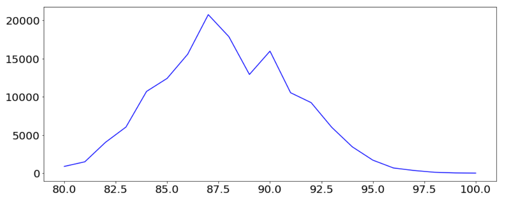
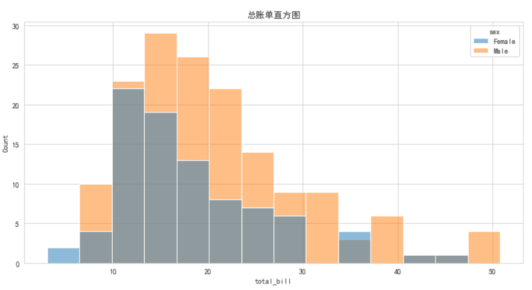
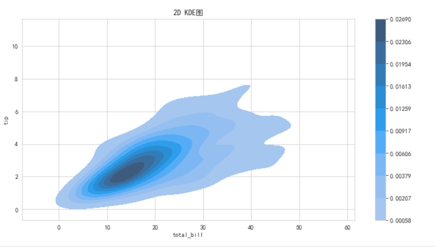

#### 内容大纲介绍

* Pandas绘图 
  * 单变量
* Seaborn绘图
  * 单变量
  * 双变量
  * 多变量
  * 主题和样式

---

#### 1.Pandas绘图-单变量

* 概述

  * pandas库是Python数据分析的核心库 
  * 它不仅可以加载和转换数据，还可以做更多的事情：它还可以可视化
  * pandas绘图API简单易用，是pandas流行的重要原因之一

* 可视化小技巧:

  * 如果是类别型
    - 柱状
    - 饼图 (类别相对较少 5-6个 或者更少), 所有的类别加起来是1个整体
  * 如果是数值型
    * 看变化趋势 折线 plot.line()
    * 看分布直方plot.hist()
      * 绘制直方图的时候,需要注意, 如果数据分布不均匀(倾斜的数据, 有取值数量较少的极大, 极小值) 这个时候如果不做数据的处理, 直接绘制直方图, 不能反映出数据的分布来, 只能得到一个柱子
      * 可以把极值单独取出来讨论
      * 把去掉极值的部分再绘制直方图

* 单变量可视化介绍

  * 单变量可视化， 包括**条形图、折线图、直方图、饼图**等

  * 数据使用`葡萄酒评论数据集`，来自葡萄酒爱好者杂志，包含10个字段，150929行，每一行代表一款葡萄酒

  * 字段介绍

    

* 代码演示

  * **需求1(柱状图)**: 将所有的葡萄酒品牌按照产区分类, 看看哪个产区的葡萄酒品种多

    ```python
    # 1. 加载源数据
    import pandas as pd
    
    reviews = pd.read_csv('data/winemag-data_first150k.csv', index_col=0)
    reviews
    
    # 2. 查看每列的信息
    # reviews.info()
    reviews.describe()
    
    # 3. 需求1: 将所有的葡萄酒品牌按照产区分类, 看看哪个产区的葡萄酒品种多.
    kwargs = dict(figsize=(16, 8), fontsize=20, color=['b', 'orange', 'g', 'r'])
    reviews['province'].value_counts().head(10).plot.bar(**kwargs)
    ```

    

  * **需求2:** 计算 加利福尼亚 葡萄酒占总数的 百分比

    ```python
    # 4. 上图说明 加利福尼亚 生产的葡萄酒比其他省都多, 也可以折算成比例.
    # 需求2: 计算 加利福尼亚 葡萄酒占总数的 百分比.
    (reviews['province'].value_counts().head(10) / len(reviews)).plot.bar(**text_kwargs)
    ```

    

  * **需求3:** 获取葡萄酒评分列, 统计每个评分, 分别有多少种酒.

    ```python
    # 5. 需求3: 获取葡萄酒评分列, 统计每个评分, 分别有多少种酒.
    # 柱状图
    reviews['points'].value_counts().sort_index().plot.bar(**text_kwargs)
    
    # 折线图, 如果要绘制的数据不是类别值, 而是连续值, 比较适合实用折线图.
    reviews['points'].value_counts().sort_index().plot.line(**text_kwargs) 
    ```

    

    

    > **柱状图和折线图区别:**
    >
    > * 柱状图：
    >   * 简单直观，很容易根据柱子的长短看出值的大小，易于比较各组数据之间的差别
    > * 折线图：
    >   * 易于比较各组数据之间的差别
    >   * 能比较多组数据在同一个维度上的趋势
    >   * 每张图上不适合展示太多折线

  * **需求4:**面积图就是在折线图的基础上，把折线下面的面积填充颜色

    ```python
    # 6. 需求4: 面积图就是在折线图的基础上，把折线下面的面积填充颜色
    # 应用场景: 当只有一个变量需要制图时，面积图和折线图之间差异不大，在这种情况下，折线图和面积图可以互相替换
    reviews['points'].value_counts().sort_index().plot.area(**text_kwargs)
    ```

    


#### 2.Pandas绘图-饼图

* 代码演示-**饼图**

  > 饼图适合统计类别数量不多, 组合起来是1的数据的可视化

  ```python
  # 饼图展示, 统计 产地 前10的数据
  reviews['province'].value_counts().head(10).plot.pie(figsize=(16, 8))
  ```

  


#### 3 .Seaborn绘图-KDE和直方图

* 概述

  * Seaborn是基于matplotlib的图形可视化python包。
  * 它提供了一种高度交互式界面，便于用户能够做出各种有吸引力的统计图表。
  * Seaborn是在matplotlib的基础上进行了更高级的API封装，从而使得作图更加容易，在大多数情况下使用seaborn能做出很具有吸引力的图，而使用matplotlib就能制作具有更多特色的图。
  * Seaborn和Pandas的API配合的很好，使用DataFrame/Series的数据就可以绘图
    https://seaborn.pydata.org

* seaborn 通用的几个参数

  - data 传入一个df 对象
  - x , y  df中的列名
  - hue 传入一个类别型的列名, 同样的图会按照这个类别, 分组, 分别绘制一份绘制到一起方便进行对比

  seaborn 调整图的大小

  - plt.subplots(figsize=())
  - 如果plt.subplots(figsize=()) 不行, 都会有一个height的参数, 指定图片的高度 可以通过height 调整图片大小
  - height 高度 aspect 宽高比例

* 需求1: 单变量-直方图

  ```python
  # 1. 加载源数据
  import seaborn as sns
  import pandas as pd
  import matplotlib.pyplot as plt
  
  # 2. 读取 小费 数据.
  tips = pd.read_csv('data/tips.csv')
  tips
  
  
  # 3. 需求1: 查看账单金额的分布情况.
  # 解决中文乱码问题
  plt.rcParams['font.sans-serif']=['SimHei']
  # 创建画布, 设置画布大小
  fig,ax = plt.subplots(figsize=(12,6))
  
  # 通过 Seaborn方式, 绘制直方图.
  # x, y: df中的列名, 充当x轴 和 y轴的
  # data: 传入1个df对象, sns可以从中直接读取数据
  # hue:  传入一个类别型的列名, 同样的图会按照这个类别分组, 分别绘制一份并绘制到一起方便进行对比.
  sns.histplot(x='total_bill', data=tips, hue='sex')
  ax.set_title('总账单直方图')
  plt.show()
  ```

  

* 需求2: 单变量-KDE图

  > KDE图: 用于估计未知随机变量的概率分布.  x轴: 样本数据, y轴: 概率分布.
  >
  > KDE图可以理解为是对直方图的加窗平滑. 它解决了一个基本的数据平滑问题, 即: 根据有限的数据样本对总体进行推断.

  ```python
  # KDE图(密度图,核密度估计), 密度图是展示单变量分布的另一种方法，
  # 本质上是通过绘制每个数据点为中心的正态分布，然后消除重叠的图，使曲线下的面积为1来创建的
  fig, ax = plt.subplots(figsize=(12, 6))
  sns.kdeplot(data=tips, x='total_bill', hue='day')   # Y轴是: Density(密度)
  
  
  # Seaborn API 数据传入的两种方式
  # 方式1: 如果 data 传入了 一个dataframe  x , y 就可以只传入列名的字符串
  sns.kdeplot(data = tips,x='total_bill')
  
  # x 也可以直接赋值一个Series 此时 data 就不需要传参
  sns.kdeplot(tips['total_bill'])
  ```

  

* 直方图 和 KDE对比

  * 表示的意义基本一样, 都是 线/柱子越高  出现的概率/样本数量越大/越高
  * KDE 当多个类别进行对比的时候, 读图比直方图方便
  * Y轴的坐标, KDE图是概率密度  直方图是样本数量


#### 4.Seaborn绘图-计数柱状图

* 概述

  * 计数图和直方图很像，直方图通过`对数据分组`来描述分布，
  * 计数图（条形图）是对`离散变量（分类变量）`计数。

* 实例代码

  ```python
  # 计数图（条形图）
  # 1. 创建画布, 坐标轴
  fig, ax = plt.subplots(figsize=(12, 6))
  # 2. 绘制计数柱状图, 相当于根据 day分组, 然后再计数, 把计数的结果绘制成柱状图, 同下面代码效果类似
  # sns.countplot(data=tips, x='day')  
  sns.countplot(data=tips, x='day')  
  # tips['day'].value_counts().plot.bar(color=['r','g','b','orange'])
  # 3. 设置图形标题
  ax.set_title('计数柱状图', size=15)
  # 4. 具体的绘图动作.
  plt.show()
  ```

  

#### 5.双变量可视化-散点-蜂巢-2D KDE

* 散点图-**scatterplot**

  ```python
  # 散点图
  # 1. 绘制画布
  fig, ax = plt.subplots(figsize=(12, 6))
  # 2. 绘制散点图, x轴: 总账单, y轴: 小费, hue: 基于哪列分组
  sns.scatterplot(data=tips, x='total_bill', y='tip', hue='sex')
  # 3. 设置标题
  ax.set_title('总账小费之间关系图')
  # 4. 绘制图片
  plt.show()
  ```

  

* 散点图-**regplot**

  ```python
  # 散点图
  # 1. 绘制画布
  fig, ax = plt.subplots(figsize=(12, 6))
  
  # 2. 绘制散点图
  # fit_reg 默认是True 会拟合一条直线 就是利用这一份数据 跑了线性回归
  # fit_reg=False 可以关掉
  sns.regplot(data=tips, x='total_bill', y='tip', fit_reg=True)
  # 3. 设置标题
  ax.set_title('总账小费之间关系图')
  # 4. 绘图
  plt.show()
  ```

* 蜂巢图

  ```python
  # kinde='hex', 加了这个属性就是 蜂巢图, 不加就是散点图.
  # sns.jointplot(data=tips, x='total_bill', y='tip', height=12)              # 散点图, 每行每列再绘制直方图.
  sns.jointplot(data=tips, x='total_bill', y='tip', kind='hex', height=12)    # 蜂巢图, 每行每列再绘制直方图.
  plt.show()
  ```

  

* 2D KDE图

  ```python
  # 一维KDE 只传入x, 或者 只转入Y
  # 二维KDE x,y 都传入
  # fill=True   是否填充曲线内的颜色
  # cbar=True  是否显示 右侧的颜色示意条
  fig, ax = plt.subplots(figsize=(12, 6))
  sns.kdeplot(data=tips, x='total_bill', y='tip', fill=True, cbar=True)
  ax.set_title('2D KDE图')
  plt.show()
  ```

  


#### 6.双变量可视化

* 箱线图: 用于显示多种统计信息：**最小值，1/4分位，中位数，3/4分位，最大值，以及离群值（如果有）**

  ```python
  # 箱线图也叫 盒须图、盒式图或箱形图, 一般用于 异常值的检测.
  # 箱线图: 用于显示多种统计信息：最小值，1/4分位，中位数，3/4分位，最大值，以及离群值（如果有）
  
  # 1. 绘制画布, 坐标
  fig, ax = plt.subplots(figsize=(12, 6))
  # 2. 绘制 箱线图.
  sns.boxplot(data=tips, x='time', y='total_bill')
  ax.set_title('总账和就餐时间之间关系图')
  plt.show()
  ```

  

  

  * **箱线图读图**

    - 箱子的中间有一条线，代表了数据的中位数

    - 箱子的上下底，分别是数据的上四分位数（Q3）和下四分位数（Q1）

    - 箱体包含了50%的数据。因此，箱子的高度在一定程度上反映了数据的波动程度

    - 上下边缘则代表了该组数据的最大值和最小值

      - IQR = 上四分位数（Q3) - 下四分位数（Q1）

        > 四分位距（interquartile range, *IQR*），又称四分差

      - **判断异常值时最大值 = 上四分位数（Q3)  + 1.5 IQR  大于这个值的就是异常值**

      - **判断异常值时最小值 = 下四分位数（Q1）- 1.5 IQR   小于这个值的就是异常值**

    - 有时候箱子外部会有一些点，可以理解为数据中的“异常值”


* 小提琴图, 它是经典的可视化方法，但可能会掩盖数据的分布

  >  小提琴图能显示与箱线图相同的值, 小提琴图把"箱线"绘成核密度估计，
  >
  >  有助于保留数据的更多可视化信息

  * 优势
    * 小提琴图同时展示了数据的统计分布和概率密度，能够更好地揭示数据的形态和特征。
    * 小提琴图可以通过分组变量进行比较分析，方便观察不同类别间的差异。
    * 小提琴图能够显示数据的离散程度，通过观察图形的宽度可以了解数据的散布情况。

  ```python
  fig, ax = plt.subplots(figsize=(12, 6))
  
  # split = True 默认是False  当使用hue的时候会生效, 会在一个violin中切开 一半显示一个类别
  sns.violinplot(data=tips, x='time', y='total_bill', hue='sex', split=True)
  ax.set_title('总账小费之间关系图')
  plt.show()
  ```

  


#### 7.多变量可视化

* 概述

  * 绘制多变量数据没有标准的套路
  * 如果想在图中包含更多信息，可以使用颜色、大小和形状来区分它们

* 代码演示

  ```python
  # 多变量, 通过 颜色区分.
  # 例如: 使用violinplot函数时，可以通过hue参数按性别（sex）给图着色, 可以为“小提琴”的左右两半着不同颜色，用于区分性别
  
  # white, dark, whitegrid, darkgrid, ticks
  # sns.set_style('ticks')
  
  fig, ax = plt.subplots(figsize=(12, 6))
  sns.violinplot(data=tips, x='time', y='total_bill', hue='sex', split=True) # hue='性别'
  ax.set_title('总账小费之间关系图')
  plt.show()
  ```

  

#### 8.Seaborn主题和样式

* 概述

  * 上面的Seaborn图都采用了默认样式，可以使用**sns.set_style函数**更改样式。
  * 该函数只要运行一次，后续绘图的样式都会发生变化
  * Seaborn有5种样式:
    * darkgrid 黑色网格（默认）
    * whitegrid 白色网格
    * dark 黑色背景
    * white 白色背景
    * ticks 

* 格式

  ```python
  sns.set_style('主题名')
  
  fig,ax = plt.subplots()
  ax = sns.violinplot(x='time',y='total_bill',hue='sex',data = tips,split = True)
  ```

* 代码演示

  ```python
  # white(浅色), dark(暗色), whitegrid(浅色带网格), darkgrid(暗色带网格), ticks(浅色背景, 有刻度线没网格线)
  sns.set_style('dark')
  fig,ax = plt.subplots(figsize=(12,6))
  # fit_reg 默认是True 会拟合一条直线 就是利用这一份数据跑了线性回归
  # fit_reg=False 可以关掉
  sns.violinplot(data=tips,x='time',y='total_bill',hue='sex',split=True)
  ax.set_title('总账小费之间关系图')	# 设置主题后, 带中文会乱码
  plt.show()
  ```

  

* ### Seaborn绘图小结

  sns.XXXplot(data = df, x = '列名', y='列名',hue='列名')

  - 调整绘图区域的大小
    - plt.subplots(figsize=())
    - 如果plt.subplots(figsize=()) 不行, 都会有一个height的参数, 指定图片的高度 可以通过height 调整图片大小
    - height 高度 aspect 宽高比例