# 机器学习概述

## 人工智能三大概念

**学习目标：**

1.知道AL，ML，DL是什么？

2.了解AL、ML、DL之间的关系

3.知道自动学习和规则编程的区别

### 【知道】人工智能

- Artificial Intelligence  人工智能

- AI is the field that studies the synthesis and analysis of  computational agents that act intelligently 

- AI is to use computers to analog and instead of human brain

- 释义 - 仿智； 像人一样机器智能的综合与分析；机器模拟人类


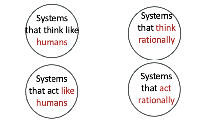

- 释义：是一个系统，像人那样思考 像人那样理性思考  

- 释义：是一个系统，像人那样活动 像人那样合理系统

### 【知道】机器学习

- Machine Learning   释义：机器学习

- Field of study that gives computers the ability to learn without being explicitly programmed

- 释义：让机器自动学习，而不是基于规则的编程（不依赖特定规则编程）


- 人类识别车：根据车的特征归纳出车的规律；来了一个新的图片，判断预测是否是车

- 机器学习识别车: 从数据中获取规律；来了一个新的数据，产生一个新的预测


### 【知道】深度学习

深度学习(DL, Deep Learning) : ，也叫深度神经网络，大脑仿生，设计一层一层的神经元模拟万事万物

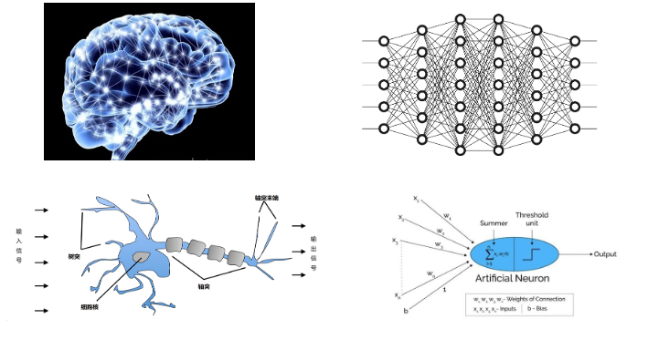

### 【知道】三者之间的关系


机器学习是实现人工智能的一种途径

深度学习是机器学习的一种方法


### 【了解】学习方式

#### 【了解】基于规则的学习

•基于规则的预测 ： 程序员根据经验利用手工的if-else方式进行预测


但是有好多问题， 无法明确的写下规则，此时我们无法使用规则学习的方式来解决这一类问题，比如：

- 图像和语音识别
- 自然语言处理

举例：我们尝试通过基于规则的学习方式让计算机识别大象，下图中的大象千差万别， 有的是实物，有的是雕塑，有的是画，我们无法通过创建一套规则的方式让计算机准确识别下面每一头大象， 此时我们需要一种新的方法来解决这类问题。

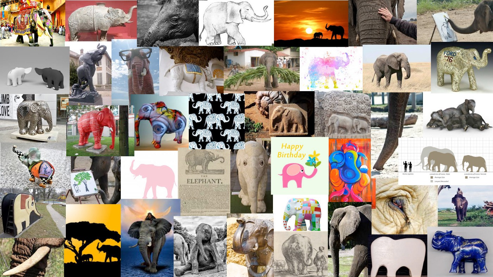


#### 【了解】基于模型的学习

基于模型的学习就是通过编写机器学习算法，让机器自己学习从历史数据中获得经验、训练模型：


案例巩固

比如房价预测，数据如下图


* 我们可以使用一条直线尽可能多的通过这些点，不通过的点尽量分布在直线的两侧，利用这条直线所表示的线性关系，我们就可以预测房价。
* 直线可以写成y=ax+b，若a,b已知，我们就能够预测房价。机器学习中a,b称为 **参数** ，y=ax+b称为 **模型** 。通常a,b未知，是我们需要求解的量。


## 人工智能应用领域和发展史

**学习目标：**

1.了解机器学习的应用领域

2.了解机器学习的发展史

### 【了解】应用领域


用户分析：社交网络、影评、商品评论

搜素引擎：网页、图片、规频、新闻、学术、地图

信息推荐：新闻、商品、游戏、书籍

图片识别：人像、用品、劢物、交通工具

机器翻译、摘要生成 … …

生物信息学习 … … 多模态 AR/VR


### 【了解】发展史

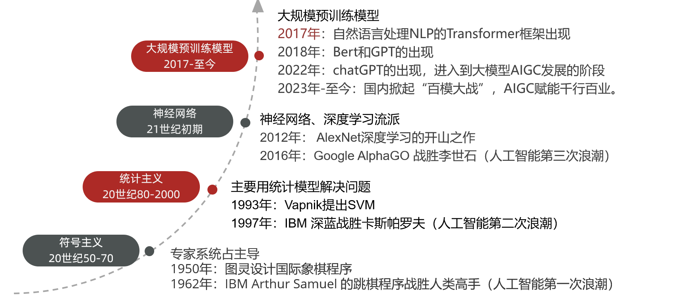

1956年夏季，以麦卡赛、明斯基、罗切斯特和申农等为首的一批有远见卓识的年轻科学家在一起聚会，共同研究和探讨用机器模拟智能的一系列有关问题，并首次提出了“人工智能”这一术语，它标志着“人工智能”这门新兴学科的正式诞生。

> 1956 年被认为是人工智能元年

**1950-1970**
符号主义流派：专家系统占主导地位

1950：图灵设计国际象棋程序

1962：IBM Arthur Samuel 的跳棋程序战胜人类高手（人工智能第一次浪潮）

**1980-2000**

统计主义流派：主要用统计模型解决问题

1993：Vapnik提出SVM

1997：IBM 深蓝战胜卡斯帕罗夫（人工智能第二次浪潮）

**2010-2017**

神经网络、深度学习流派

2012：AlexNet深度学习的开山之作

2016：Google AlphaGO 战胜李世石（人工智能第三次浪潮）

**2017-至今**

大规模预训练模型

2017年：自然语言处理NLP的Transformer框架出现

2018年：Bert和GPT的出现

2022年：chatGPT的出现，进入到大模型AIGC发展的阶段

2023年-至今：国内掀起“百模大战”，AIGC赋能千行百业。


### 【知道】机器学习发展三要素

- 数据、算法、算力三要素相互作用，是AI发展的基石


1.  CPU：负责调度任务、计算任务等；主要适合I\O密集型的任务
2. GPU：更加适合矩阵运算；主要适合计算密集型任务
3. TPU：Tensor，专门针对神经网络训练设计一款处理器


## 常见术语

**学习目标：**

1.知道样本是什么？

2.知道特征是什么？

3.知道标签/目标值是什么？

4.理解数据集划分的方法

### 【掌握】样本，特征，标签/目标值


样本(sample) ：一行数据就是一个样本；多个样本组成数据集；有时一条样本被叫成一条记录

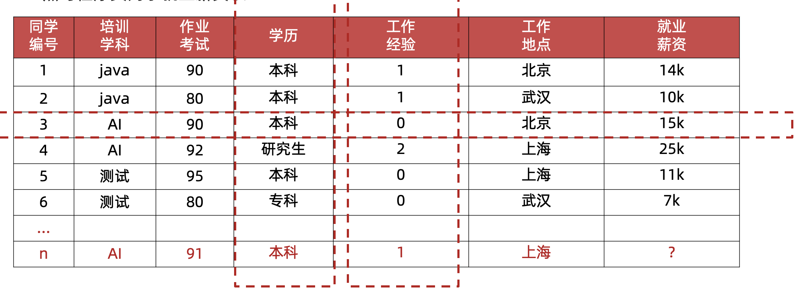

特征(feature) ：一列数据一个特征，有时也被称为属性

 

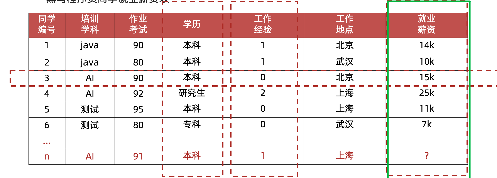

标签/目标(label/target) ：模型要预测的那一列数据。本场景是就业薪资


就业薪资 与 培训学科、作业考试、学历、工作经验、工作地点 5个特征有关系

特征如何理解（重点）：特征是从数据中抽取出来的，对结果预测有用的信息  eg:房价预测、车图片识别

### 【掌握】数据集划分


数据集可划分两部分：训练集、测试集  比例：8 : 2，7 : 3 

训练集(training set) ：用来训练模型（model）的数据集

测试集(testing set)：用来测试模型的数据集


## 算法分类

**学习目标**

1.知道有监督学习是什么？

2.知道无监督学习是什么？

3.知道半监督学习是什么？

4.了解强化学习是什么？

5.能掌握监督学习、无监督学习的数学表示

### 【掌握】有监督学习

- 定义：输入数据是由输入特征值和目标值所组成，即输入的训练数据有标签的

- 数据集：需要人工标注数据

  

#### 【掌握】分类

- 目标值（标签值）是不连续的

- 分类种类：二分类、多分类任务、

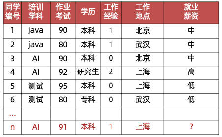


#### 【掌握】回归

目标值（标签值）是连续的

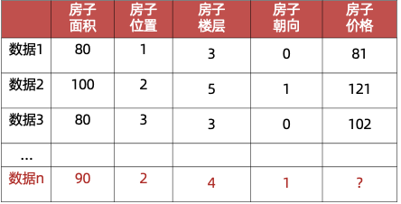


### 【熟悉】无监督学习

- 定义：输入数据没有被标记，即样本数据类别未知，**没有标签**，根据样本间的相似性，对样本集聚类，以发现事物内部 结构及相互关系。

- 数据集：不需要标注数据


**无监督学习特点：**

 **1** 训练数据无标签

 2 根据样本间的相似性对样本集进行聚类，发现事物内部结构及相互关系


### 【了解】半监督学习

工作原理：

1 让专家标注少量数据，利用已经标记的数据（也就

  是带有类标签）训练出一个模型

2 再利用该模型去套用未标记的数据

3 通过询问领域专家分类结果与模型分类结果做对比，

   从而对模型做进一步改善和提高


半监督学习方式可大幅降低标记成本

### 【了解】强化学习

1 强化学习（Reinforcement Learning）：机器学习的一个重要分支

2 应用场景：里程碑AlphaGo围棋、各类游戏、对抗比赛、无人驾驶场景

3 基本原理：基本原理：通过构建四个要素：agent，环境状态，行动，奖励，

 agent根据环境状态进行行动获得最多的累计奖励。。


小孩子学走路：

​    (1) 小孩就是 **agent**，他试图通过采取**行**（即行走）来操纵**环境**（地面），

​    (2) 并且从**一个状态转变到另一个状态**（即他走的每一步），

​    (3) 当他完成任务的子任务（即走了几步）时，孩子得到**奖励**（给巧克力吃），

​    (4) 并且当他不能走路时，就不会给巧克力。


### 总结

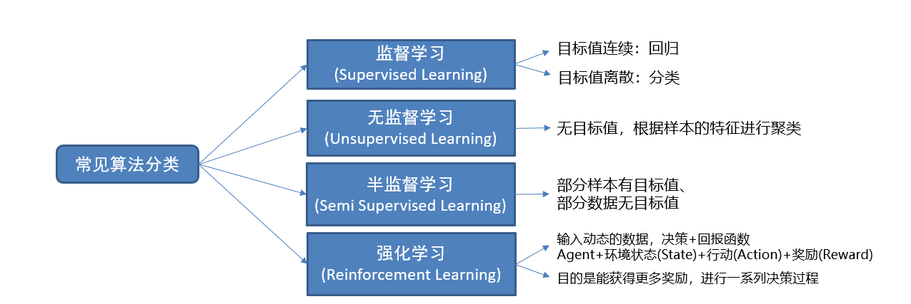


## 【知道】机器学习的建模流程


## 特征工程

**学习目标：**

1.知道特征工程是什么？

2.理解特征提取的作用

3.理解特征预处理的作用

4.了解特征降维、特征选择、特征组合

### 【知道】特征工程


从数据集角度来看：    一列一列的数据为特征。

从模型训练角度来看： 对预测结果有用的属性为特征

特征工程是：利用专业背景知识和技巧处理数据，让机器学习算法效果最好。这个过程就是特征工程

Coming up with features is difficult, time-consuming, requires expert knowledge. “Applied machine learning” is basically feature engineering. ”

释义：特征工程是困难、耗时、需要专业知识。应用机器学习基础就是特征工程                             

【理解】数据和特征决定了机器学习的上限，而模型和算法只是逼近这个上限而已。

### 【理解】特征提取

从原始数据中提取与任务相关的特征，构成特征向量


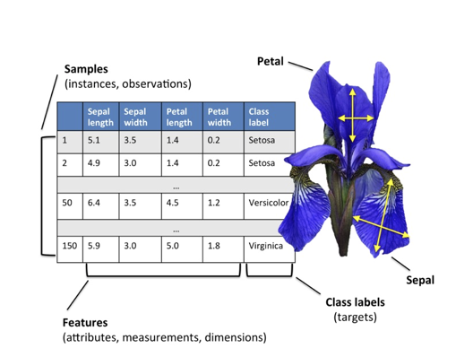

对于文本、图片这种非行列形式的数据行列形式转换，

一旦转换成行列形式一列就是特征

### 【理解】特征预处理

特征对模型产生影响；因量纲问题，有些特征对模型影响大、有些影响小


将不同的单位的特征数据转换成同一个范围内

使训练数据中不同特征对模型产生较为一致的影响

### 【了解】特征降维

将原始数据的维度降低，叫做特征降维


会丢失部分信息。降维就需要保证数据的主要信息要保留下来

原始数据会发生变化，不需要了解数据本身是什么含义，它保留了最主要的信息

### 【了解】特征选择

原始数据特征很多，但是对任务相关是其中一个特征集合子集。


从特征中选择出一些重要特征（选择就需要根据一些指标来选择）

特征选择不会改变原来的数据

### 【了解】特征组合

把多个的特征合并成一个特征。


通过加法、乘法等方法将特征值合并


## 【掌握】模型拟合问题

**学习目标：**

1.知道拟合是什么？

2.理解过拟合、欠拟合是什么？

3.知道过拟合、欠拟合出现的原因

4.理解泛化是什么？


拟合：用来表示模型对样本点的拟合情况


欠拟合：模型在训练集上表现很差、在测试集表现也很差

原因：模型过于简单


过拟合：模型在训练集上表现很好、在测试集表现很差

原因：模型太过于复杂、数据不纯、训练数据太少


泛化：模型在新数据集（非训练数据）上的表现好坏的能力

奥卡姆剃刀原则：给定两个具有相同泛化误差的模型，较简单的模型比较复杂的模型更可取

(如无必要，勿增实体/简单有效原理)


## 【实操】机器学习开发环境

基于Python的 scikit-learn 库：

1. 简单高效的数据挖掘和数据分析工具
2. 可供大家使用，可在各种环境中重复使用
3. 建立在NumPy，SciPy和matplotlib上
4. 开源，可商业使用-获取BSD许可证

```python
pip install scikit-learn
```


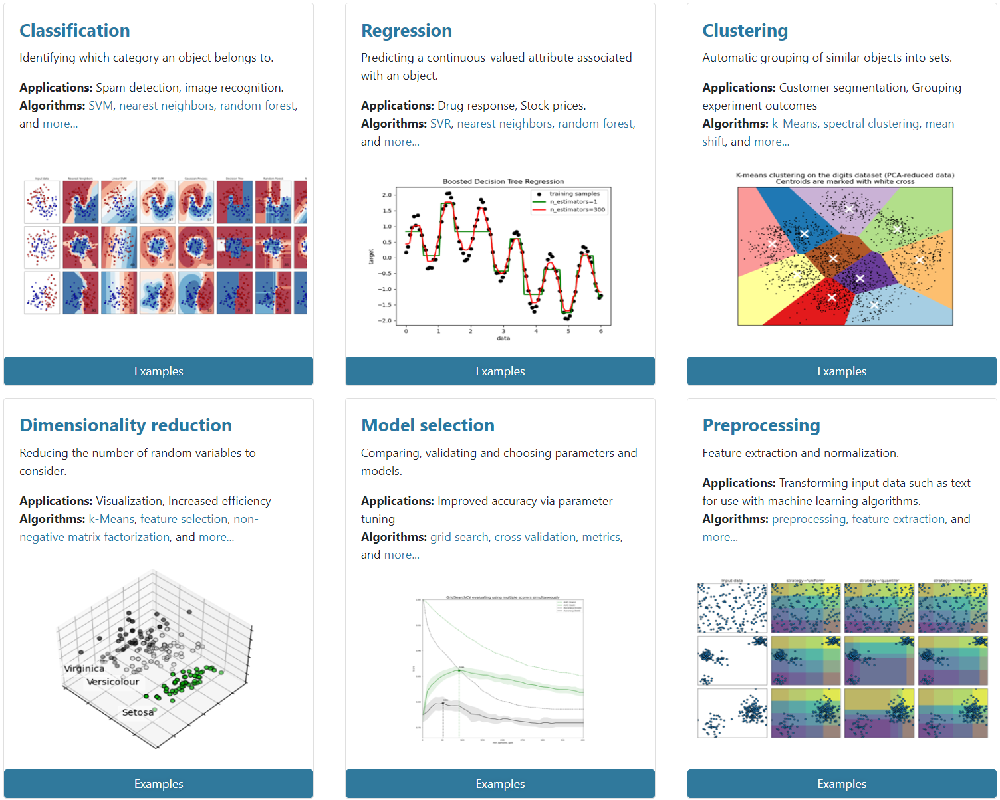
<br />
<br />
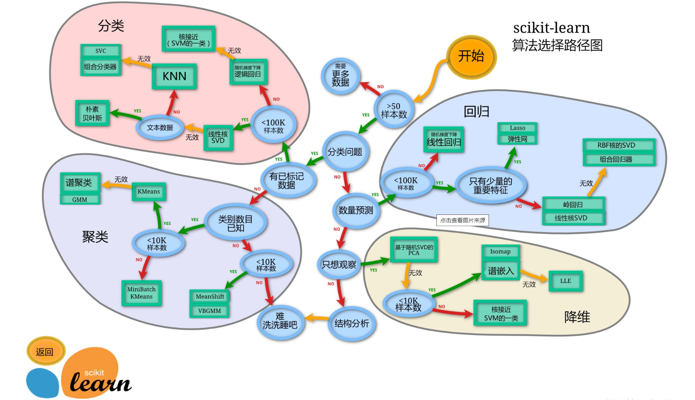


## 作业

1.完成机器学习概述部分的思维导图


2.说明有监督学习和无监督学习的各自的特点及区别


3.说明下机器学习的建模流程


4.谈一下你对特征工程的理解


5.说下模型拟合问题及产生的原因


6.安装机器学习部分的开发环境


