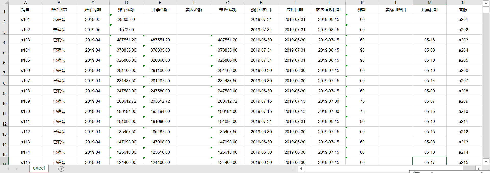
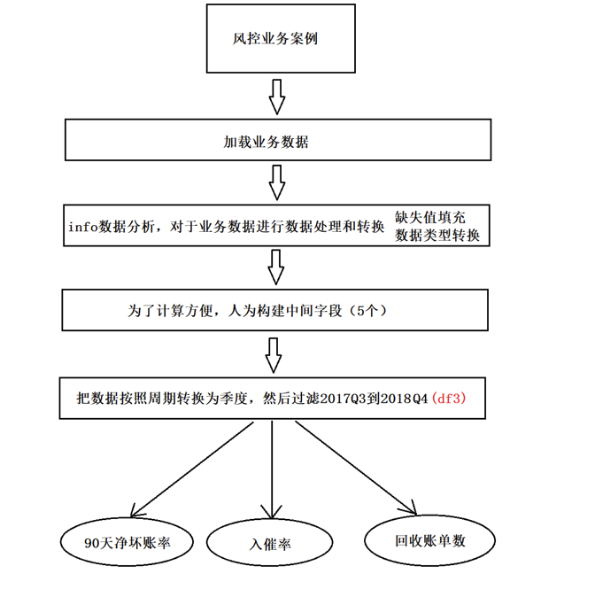

# 金融风控相关业务介绍

## 【了解】项目整体介绍

~~~shell
#1.风控业务和风控报表
零售金融产品
相关的指标
风控建模流程

#2.特征工程
特征构造
特征筛选

#3.评分卡模型构建
逻辑回归
集成学习 XGBoost LightGBM
模型评估

#4.样本不均衡问题/异常点检测
~~~


## 【了解】今日内容介绍

- 知道常见**信贷**风险
- 知道机器学习风控模型的优势
- 知道信贷领域常用术语含义
- 了解风控业务报表


## 【理解】信贷&风控介绍

- 信贷业务，就是贷款业务，是商业银行和互联网金融公司最重要的资产业务和主要赢利手段
  - 通过放款收回本金和利息，扣除成本后获得利润。
  - 贷款平台预测有信贷需求用户的还款情况，然后将本金借贷给还款概率大的用户
- 信贷业务中的风险控制
  - 信贷业务中，使用信用来预支金钱，在小额贷业务中往往没有抵押物，那么贷款方就会承担一定风险（用户不还钱）
  - 风控就是对用户的信用风险进行管理与规避，对于预测信用较差的人，不向其放款，即便放款，也会是较小的贷款额度和较高的利率
  - 信贷领域有两类风险
    - 信用风险：借款人的的还款能力和还款意愿在贷款后出现问题的风险
    - 欺诈风险：借款人压根没想还钱，以诈骗为目的
  - 风控业务主要针对这两类风险
    - 信用评分系统：针对信用风险
    - 反欺诈系统：针对欺诈风险
  - 基于机器学习的人工智能风控模型对比传统人工审批
    - 人工审批：效率低，对人员业务能力要求高，不适合金融零售业务场景
    - 机器学习模型：批量，迅速，准确，同时处理大量贷款请求（几万，几十万，上百万/天）


## 【理解】常见信贷产品及常见风险介绍

- 信贷产品介绍

  | 个人信贷产品 |              |                                     |
  | ------------ | ------------ | ----------------------------------- |
  | 大额借贷     | 房贷车贷     |                                     |
  |              | 小微企业贷   |                                     |
  | 小额借贷     | 消费贷       | 蚂蚁花呗，京东白条                  |
  |              | 现金贷       | 蚂蚁借呗，京东金条，微粒贷,各类网贷 |
  | 数据服务     | 信用分服务   | 芝麻信用分，京东小白分              |
  |              | 信用数据服务 | 同盾数据，百融，集奥，大峰...       |

  - 现金贷

  申请借款->放款给客户->客户还款

  | 额度     | 500~3000           |
  | -------- | ------------------ |
  | 利率     | 24%~36%            |
  | 期限     | 714，30天          |
  | 放款形式 | 借给现金，不限场景 |
  | 可选功能 | 订单展期           |

  | 现金贷产品 | 年化利率 | 现金贷产品 | 年化利率 |
  | ---------- | -------- | ---------- | -------- |
  | 苏宁金融   | 24%      | 国美易卡   | 34%      |
  | 蚂蚁借呗   | 24%      | 马上消费   | 35%      |
  | 微粒贷     | 24%      | 招联金融   | 36%      |
  | 有钱花     | 24%      | 桔子分期   | 36%      |
  | 京东金条   | 24%      | 拍拍贷     | 36%      |
  | 360借条    | 24%      | 趣店       | 36%      |
  | 小米金融   | 24%      | 捷信       | 36%      |
  | 美团生活费 | 24%      | 宜人贷     | 44%      |
  | 分期乐     | 24%      | 玖富       | 50%      |

  - 消费贷


  信用卡，花呗，白条等产品，有账单日，还款日

  申请消费贷 -> 额度授信->客户使用消费贷消费

| 额度     | 1000~10000                                               |
| -------- | -------------------------------------------------------- |
| 利率     | 24%                                                      |
| 账期     | 30天                                                     |
| 放款形式 | 指定消费场景                                             |
| 可选功能 | 最低还款，账单展期，账单分期，停息挂账，临时额度，备用金 |

- 产品类型

  - 单期产品
  - 多期产品

  - 循环额度产品

- 还款方式

  - 砍头息：短期产品， （服务费）
  - 等额本金
  - 等额本息

- 信贷领域风险类别

  * 信用风险：借款人的的还款能力和还款意愿在贷款后出现问题的风险

  * 欺诈风险：借款人压根没想还钱，以诈骗为目的

- 常见风险形式

  - 冒名顶替，黑产骗贷

  - 多头借贷，借新还旧

    - 客户：工行信用卡，招商信用卡... n张信用卡，网贷平台1，网贷平台2，网贷平台n

    - 用新借来的钱还已有的负债：
      负债变多 -> 需新借更多 -> 设法提额 -> 信用资质不够 -> 出现流动性风险 -> 逾期

    - 特点：第三方数据：多头申请记录

      APP安装：大量借款类APP

      短信：大量申请短信，提醒还款，催收短信

  - POS机套现，以少换多

    - 购买有支付牌照机构的POS机进行套现，手续费0.6%

  - 针对风控模型，制作数据

    - 使用花呗在天猫购物，对花呗账单做分期

    - 买入存金宝，一个礼拜后追加存金宝资金

    - 购买***元基金

    - 保持余额宝XXX元不动，余额宝累计收益做到 XX元

    - 购买XXXX保险


## 【理解】风控相关术语介绍

| 术语        | 解释                                                         |
| ----------- | ------------------------------------------------------------ |
| DPD         | Day  past due 逾期天数  DPD0为到期当日，DPD1为逾期一日，DPD7为逾期一周 |
| FPD         | First  time past due 首次逾期天数                            |
| F/S/T/QPD   | 首次  二次 三次 四次 逾期天数                                |
| M1          | 逾期  [1, 30)天  M 是英文“Months”的首写字母                  |
| M1+         | 逾期[30,  inf]天                                             |
| default     | 坏账                                                         |
| delinquency | 拖欠                                                         |
| flow  rate  | 流动率  一般指M1向M2，M2向M3转移的比例                       |
| bad  rate   | 坏账率  当月不良资产数/总资产数                              |
| vintage     | 账龄分析                                                     |

小结：记住DPD、M1，这2个在后面用的相对来说会多一点。


## 【实现】风控业务案例

### 案例背景介绍

- 通过对业务数据分析了解信贷业务状况
- 数据集说明
  - 从开源数据改造而来，基本反映真实业务数据
  - 销售，客服可以忽略
  - 账单周期，放款日期
  - 账单金额-实收金额 = 未收金额
  - 应付日期为还款时间
  - 账期分成两种：60天和90天
  - 实际到账日为空白，说明没还钱



- 通过对贷后业务数据的分析要分析出如下内容

  - 每个季度账单金额和坏账率（逾期90天以上）
    - 所有未收金额/所有账单金额
    - 未收金额 = 账单金额-实收金额
  - 每个季度60天账期的入催率，90天账单的入催率
    - 入催率 = 入催金额/账单金额
  - 历史逾期天数的回款情况（回收账单数）
    - 历史逾期天数：历史有逾期，但是相对现在来说，钱已经还完了
    - 当前逾期天数：现在还欠着钱，也就是说钱没还完


### 代码实现

- 加载数据

```python
import pandas as pd
from pyecharts.charts import *
from pyecharts import options as opts
df1 = pd.read_excel('../data/业务数据.xlsx') 
#要使用原始数据构建新指标，所以保留原始数据，copy新的数据，在新的数据中创建新指标
df2 = df1.copy()
df2.head()
```

><font color='red'>显示结果</font>
>
>|      | 销售 | 账单状态 | 账单周期 | 账单金额 | 开票金额 | 实收金额 | 未收金额 | 预计付款日 |   应付日期 | 商务催收日期 | 账期 | 实际到账日 | 开票日期 | 客服 |
>| ---: | ---: | -------: | -------: | -------: | -------: | -------: | -------: | ---------: | ---------: | -----------: | ---: | ---------: | -------: | ---: |
>|    0 | s101 |   未确认 |  2019-05 |  29805.0 |      NaN |      NaN |      NaN | 2019-07-31 | 2019-07-31 |   2019-08-15 |   60 |        NaN |      NaN | a201 |
>|    1 | s102 |   未确认 |  2019-05 |   1572.6 |      NaN |      NaN |      NaN | 2019-07-31 | 2019-07-31 |   2019-08-15 |   60 |        NaN |      NaN | a202 |
>|    2 | s103 |   已确认 |  2019-04 | 487551.2 | 487551.2 |      NaN | 487551.2 | 2019-06-30 | 2019-06-30 |   2019-07-15 |   60 |        NaN |    05-16 | a203 |
>|    3 | s104 |   已确认 |  2019-04 | 378835.0 | 378835.0 |      NaN | 378835.0 | 2019-07-31 | 2019-07-31 |   2019-08-15 |   90 |        NaN |    05-08 | a204 |
>|    4 | s105 |   已确认 |  2019-04 | 326866.0 | 326866.0 |      NaN | 326866.0 | 2019-07-31 | 2019-07-31 |   2019-08-15 |   90 |        NaN |    05-10 | a205 |

- 查看数据基本情况

```python
df2.info()
```

><font color='red'>显示结果</font>
>
>```shell
><class 'pandas.core.frame.DataFrame'>
>RangeIndex: 5257 entries, 0 to 5256
>Data columns (total 14 columns):
> #   Column  Non-Null Count  Dtype  
>---  ------  --------------  -----  
> 0   销售      5257 non-null   object 
> 1   账单状态    5257 non-null   object 
> 2   账单周期    5257 non-null   object 
> 3   账单金额    5257 non-null   float64
> 4   开票金额    5010 non-null   float64
> 5   实收金额    4470 non-null   float64
> 6   未收金额    5010 non-null   float64
> 7   预计付款日   5256 non-null   object 
> 8   应付日期    5257 non-null   object 
> 9   商务催收日期  5257 non-null   object 
> 10  账期      5257 non-null   int64  
> 11  实际到账日   4387 non-null   object 
> 12  开票日期    4996 non-null   object 
> 13  客服      5257 non-null   object 
>dtypes: float64(4), int64(1), object(9)
>memory usage: 575.1+ KB
>```

```python
df2.describe()
```

><font color='red'>显示结果</font>
>
>|       |     账单金额 |     开票金额 |     实收金额 |     未收金额 |        账期 |
>| ----: | -----------: | -----------: | -----------: | -----------: | ----------: |
>| count | 5.257000e+03 | 5.010000e+03 | 4.470000e+03 | 5.010000e+03 | 5257.000000 |
>|  mean | 4.073241e+04 | 4.096896e+04 | 4.082419e+04 | 4.684636e+03 |   64.539661 |
>|   std | 8.176172e+04 | 8.007245e+04 | 7.970628e+04 | 2.888464e+04 |   15.622765 |
>|   min | 0.000000e+00 | 2.500000e+01 | 0.000000e+00 | 0.000000e+00 |    0.000000 |
>|   25% | 5.103000e+03 | 5.300000e+03 | 5.112250e+03 | 0.000000e+00 |   60.000000 |
>|   50% | 1.436500e+04 | 1.486560e+04 | 1.434000e+04 | 0.000000e+00 |   60.000000 |
>|   75% | 4.178000e+04 | 4.220250e+04 | 4.170750e+04 | 0.000000e+00 |   75.000000 |
>|   max | 1.508796e+06 | 1.356215e+06 | 1.301665e+06 | 1.277098e+06 |   90.000000 |

- 数据处理，填充缺失值，将日期时间类型转换成datetime类型

```python
# 获取最大的日期，作为当前时间
today_time = pd.to_datetime(df2.实际到账日.fillna('0').max())

#给缺失值填充0
df2['实收金额'] = df2.实收金额.fillna(0)
df2['开票金额'] = df2.开票金额.fillna(0)
df2['未收金额'] = df2.未收金额.fillna(0)

#把时间类型转换为datetime类型
df2['账单周期'] = pd.to_datetime(df2.账单周期)
df2['应付日期'] = pd.to_datetime(df2.应付日期)

df2['实际到账日'] = pd.to_datetime(df2.实际到账日).fillna(today_time)
```

- 为了后续计算，在原始数据基础上构造新的字段：是否到期，是否到期90天，未收金额2（校验原始数据中的未收金额），历史逾期天数，当前逾期天数

```python
df2['是否到期'] = df2.apply(lambda x : 0 if x.应付日期 > today_time else 1,axis=1)

#map可以看做是apply，效果类似
df2['是否到期90天'] =  ( today_time - df2.应付日期 ).map(lambda x : 1 if x.days >= 90 else 0)

df2['未收金额2'] =  (df2.账单金额 - df2.实收金额)

df2['历史逾期天数'] = df2.apply(lambda x : (x.实际到账日 -  x.应付日期).days if x.未收金额2 == 0  else  (today_time - x.应付日期).days,axis=1)

#df2['当前逾期天数'] = df2.apply(lambda x : (x.历史逾期天数) if x.未收金额2 > 0  else 0 ,axis = 1)
df2['当前逾期天数'] = df2.apply(lambda x:(today_time - x['应付日期']).days if x['未收金额2'] > 0 else 0,axis=1)
```

- 查询实际到账日期字段得知当前最近的到账日为2019年5月17日，如果以2019年5月17日为观察点，有些贷款还没到还款日，没法统计DPD90的数据，所以，这里只统计2019年之前的情况，下面将对应时间段的数据取出

```python
df3 =df2.copy()
#创建’账单季度‘字段，将日期转换成季度，to_period函数可以转换为季度信息
df3['账单季度'] = df3['账单周期'].map(lambda x : x.to_period('Q'))
#提取2017年3季度到2018年4季度数据
df3 = df3[(df3['账单季度']<='2018Q4') & (df3['账单季度']>='2017Q3')]
df3.shape
```

><font color='red'>显示结果</font>
>
>```
>(3856, 20)
>```

- 按照季度统计账单金额，到期金额，和逾期金额

```python
#账单金额
fn1 = df3.groupby('账单季度')[['账单金额']].sum()
fn1.columns = ['账单金额']
fn1
```

><font color='red'>显示结果</font>
>
>|          |    账单金额 |
>| -------: | ----------: |
>| 账单季度 |             |
>|   2017Q3 |  8247952.62 |
>|   2017Q4 | 11643604.99 |
>|   2018Q1 | 17149674.79 |
>|   2018Q2 | 31097661.29 |
>|   2018Q3 | 38292071.12 |
>|   2018Q4 | 51963089.64 |

```python
#90天到期金额
df4 = df3[(df3.是否到期90天 == 1)]
fn2 = df4.groupby('账单季度')[['账单金额']].sum()
fn2.columns = ['到期金额']
fn2
```

><font color='red'>显示结果</font>
>
>|          |    到期金额 |
>| -------: | ----------: |
>| 账单季度 |             |
>|   2017Q3 |  8247952.62 |
>|   2017Q4 | 11643604.99 |
>|   2018Q1 | 17149674.79 |
>|   2018Q2 | 31097661.29 |
>|   2018Q3 | 38292071.12 |
>|   2018Q4 | 28265677.59 |

```python
#当前逾期90+金额
df4 = df3[(df3.是否到期90天 == 1)]
fn3 = df4.groupby('账单季度')[['未收金额2']].sum()
fn3.columns = ['当前逾期90+金额']
fn3
```

><font color='red'>显示结果</font>
>
>|          | 当前逾期90+金额 |
>| -------: | --------------: |
>| 账单季度 |                 |
>|   2017Q3 |         63883.0 |
>|   2017Q4 |         57380.0 |
>|   2018Q1 |         64283.0 |
>|   2018Q2 |        106930.0 |
>|   2018Q3 |        412920.1 |
>|   2018Q4 |        304183.0 |

- 合并数据计算坏账率

```python
dfs = [fn1,fn2,fn3]
final1 = pd.concat(dfs,axis=1)
final1
```

><font color='red'>显示结果</font>
>
>|          |    账单金额 |    到期金额 | 当前逾期90+金额 |
>| -------: | ----------: | ----------: | --------------: |
>| 账单季度 |             |             |                 |
>|   2017Q3 |  8247952.62 |  8247952.62 |         63883.0 |
>|   2017Q4 | 11643604.99 | 11643604.99 |         57380.0 |
>|   2018Q1 | 17149674.79 | 17149674.79 |         64283.0 |
>|   2018Q2 | 31097661.29 | 31097661.29 |        106930.0 |
>|   2018Q3 | 38292071.12 | 38292071.12 |        412920.1 |
>|   2018Q4 | 51963089.64 | 28265677.59 |        304183.0 |

```python
final1['90+净坏账率'] = round(final1['当前逾期90+金额'] / final1.到期金额,3)
final1
```

><font color='red'>显示结果</font>
>
>|          |    账单金额 |    到期金额 | 当前逾期90+金额 | 90+净坏账率 |
>| -------: | ----------: | ----------: | --------------: | ----------: |
>| 账单季度 |             |             |                 |             |
>|   2017Q3 |  8247952.62 |  8247952.62 |         63883.0 |       0.008 |
>|   2017Q4 | 11643604.99 | 11643604.99 |         57380.0 |       0.005 |
>|   2018Q1 | 17149674.79 | 17149674.79 |         64283.0 |       0.004 |
>|   2018Q2 | 31097661.29 | 31097661.29 |        106930.0 |       0.003 |
>|   2018Q3 | 38292071.12 | 38292071.12 |        412920.1 |       0.011 |
>|   2018Q4 | 51963089.64 | 28265677.59 |        304183.0 |       0.011 |

- pyecharts绘图

```python
bar = (
    Bar()
    .add_xaxis(list(final1.index.values.astype(str)))
    .add_yaxis(
        "账单金额",
        list(final1.账单金额),
        yaxis_index=0,
        color="#5793f3",
    )
    .set_global_opts(
        title_opts=opts.TitleOpts(title="90+净坏账率"),
    )
    .extend_axis(
        yaxis=opts.AxisOpts(
            name="90+净坏账率",
            type_="value",
            min_=0,
            max_=0.014,
            position="right",
            axisline_opts=opts.AxisLineOpts(
                linestyle_opts=opts.LineStyleOpts(color="#d14a61")
            ),
            axislabel_opts=opts.LabelOpts(formatter="{value}"),
        )
    )
)
line = (
    Line()
    .add_xaxis(list(final1.index.values.astype(str)))
    .add_yaxis(
        "90+净坏账率",
        list(final1['90+净坏账率']),
        yaxis_index=1,
        color="#675bba",
        label_opts=opts.LabelOpts(is_show=False),
    )
)
bar.overlap(line).render()
```

><font color='red'>显示结果</font>
>
>

- 计算每个季度的60天账单金额、60天入催金额，90天账单金额、90天入催金额

```python
#60天账期的账单金额
df4 = df3[(df3.账期 == 60)&(df3.是否到期 == 1)]
fn1 = df4.groupby('账单季度')[['账单金额']].sum()
fn1.columns = ['60天账期的账单金额']
#60天账期的入催金额
df4 = df3[(df3.账期 == 60)&(df3.是否到期 == 1)&(df3.历史逾期天数>0)]
fn2 = df4.groupby('账单季度')[['未收金额2']].sum()
fn2.columns = ['60天账期的入催金额']
#90天账期的账单金额
df4 = df3[(df3.账期 == 90)&(df3.是否到期 == 1)]
fn3 = df4.groupby('账单季度')[['账单金额']].sum()
fn3.columns = ['90天账期的账单金额']
#90天账期的入催金额
df4 = df3[(df3.账期 == 90)&(df3.是否到期 == 1)&(df3.历史逾期天数>0)]
fn4 = df4.groupby('账单季度')[['未收金额2']].sum()
fn4.columns = ['90天账期的入催金额']
```

- 计算入催率

```python
dfs = [fn1,fn2,fn3,fn4]
final2 = pd.concat(dfs,axis=1)
# final2 = fn1.merge(fn2,on='账单季度').merge(fn3,on='账单季度',how='left').merge(fn4,on='账单季度')
final2['60天账期入催率'] = round(final2['60天账期的入催金额'] / final2['60天账期的账单金额'],3)
final2['90天账期入催率'] = round(final2['90天账期的入催金额']/final2['90天账期的账单金额'],3)
final2
```

><font color='red'>显示结果</font>
>
>|          | 60天账期的账单金额 | 60天账期的入催金额 | 90天账期的账单金额 | 90天账期的入催金额 | 60天账期入催率 | 90天账期入催率 |
>| -------: | -----------------: | -----------------: | -----------------: | -----------------: | -------------: | -------------: |
>| 账单季度 |                    |                    |                    |                    |                |                |
>|   2017Q3 |         4854770.94 |            36983.0 |          2769264.0 |             1900.0 |          0.008 |          0.001 |
>|   2017Q4 |         6737327.99 |            52750.0 |          3921491.0 |                0.0 |          0.008 |          0.000 |
>|   2018Q1 |        12106356.79 |            62460.0 |          4244304.0 |              800.0 |          0.005 |          0.000 |
>|   2018Q2 |        19234086.87 |            13590.0 |          8427775.0 |                0.0 |          0.001 |          0.000 |
>|   2018Q3 |        22830710.42 |           380265.1 |          9835629.0 |             8235.0 |          0.017 |          0.001 |
>|   2018Q4 |        26337959.52 |           584789.5 |         17706430.0 |           325141.0 |          0.022 |          0.018 |

- pyecharts绘图

```python
line = (
    Line()
    .add_xaxis(list(final1.index.values.astype(str)))
    .add_yaxis(
        "60天账期入催率",
        list(final2['60天账期入催率']),
        yaxis_index=0,
        color="#675bba",
        label_opts=opts.LabelOpts(is_show=False),
    )
    .set_global_opts(
    title_opts=opts.TitleOpts(title="不同账期入催率"),
    )
    .add_xaxis(list(final1.index.values.astype(str)))
    .add_yaxis(
        "90天账期入催率",
        list(final2['90天账期入催率']),
        yaxis_index=0,
        color="#d14a61",
        label_opts=opts.LabelOpts(is_show=False),
    )
)
line.render()
```

><font color='red'>显示结果</font>
>
>

- 历史逾期天数的回收情况（回收账单数）

```python
df5 = df3[(df3.未收金额2 == 0)&(df3.是否到期 == 1)].copy()
#使用cut，讲数据按照逾期天数分箱，然后添加分箱之后结果标签
df5['历史逾期天数'] = pd.cut(df5['历史逾期天数'],bins=[-999,0,5,10,15,20,30,60,90,999],right=True,
                       labels=['0','1-5','6-10','11-15','16-20','21-30','31-60','61-90','91+'])
final3 = df5.groupby('历史逾期天数')[['账期']].count()
final3.columns = ['回收账单数']
final3
```

><font color='red'>显示结果</font>
>
>|              | 回收账单数 |
>| -----------: | ---------: |
>| 历史逾期天数 |            |
>|            0 |       2400 |
>|          1-5 |        358 |
>|         6-10 |        235 |
>|        11-15 |        215 |
>|        16-20 |         92 |
>|        21-30 |        189 |
>|        31-60 |        156 |
>|        61-90 |         60 |
>|          91+ |         88 |

- pyecharts绘图

```python
ydata = final3['回收账单数'].values.tolist()
bar = (
    Bar()
    .add_xaxis(list(final3.index.values.tolist()))
    .add_yaxis("收回账单数",ydata,yaxis_index=0,color="#675bba")
    .set_global_opts(
    title_opts=opts.TitleOpts(title="不同逾期天数的已收回账单数"),
    )
)
bar.render()
```

><font color='red'>显示结果</font>
>
>

### 业务解读

- 从数据中看出，在2018年Q2季度之前，运营策略比较保守，坏账金额和入催率都比较低
- 2018年Q2之后，有可能是由于运营策略调整，给更多的人放贷，但坏账率和入催率均在3%一下，在合理范围内
- 不同逾期天数收回账单的数据看，30天内能收回绝大部分账单

### 案例流程小结




## 【理解】信贷业务涉及部门

市场：获客 (新客, 老客)

风控：把逾期率控制在合理范围，尽可能提高通过率

催收：回款(内催 , 外催)


## 小结

- 知道常见信贷风险
  - 信用风险
  - 欺诈风险
- 知道机器学习风控模型的优势
  - 批量，迅速，准确，同时处理大量贷款请求
  - 在零售信贷业务场景下，与人工审核相比优势显著
- 知道信贷领域常用术语含义
  - DPD  逾期天数
  - FPD  首次逾期天数  
  - bad rate 坏账率
  - M1 逾期一个月以内

* 理解风控业务案例
  * 数据加载
  * 数据处理
  * 中间字段计算
  * 季度数据过滤
  * 指标计算
    * 每个季度账单金额和坏账率（逾期90天以上）
    * 每个季度60天账期的入催率，90天账单的入催率
    * 历史逾期天数的回款情况（回收账单数）