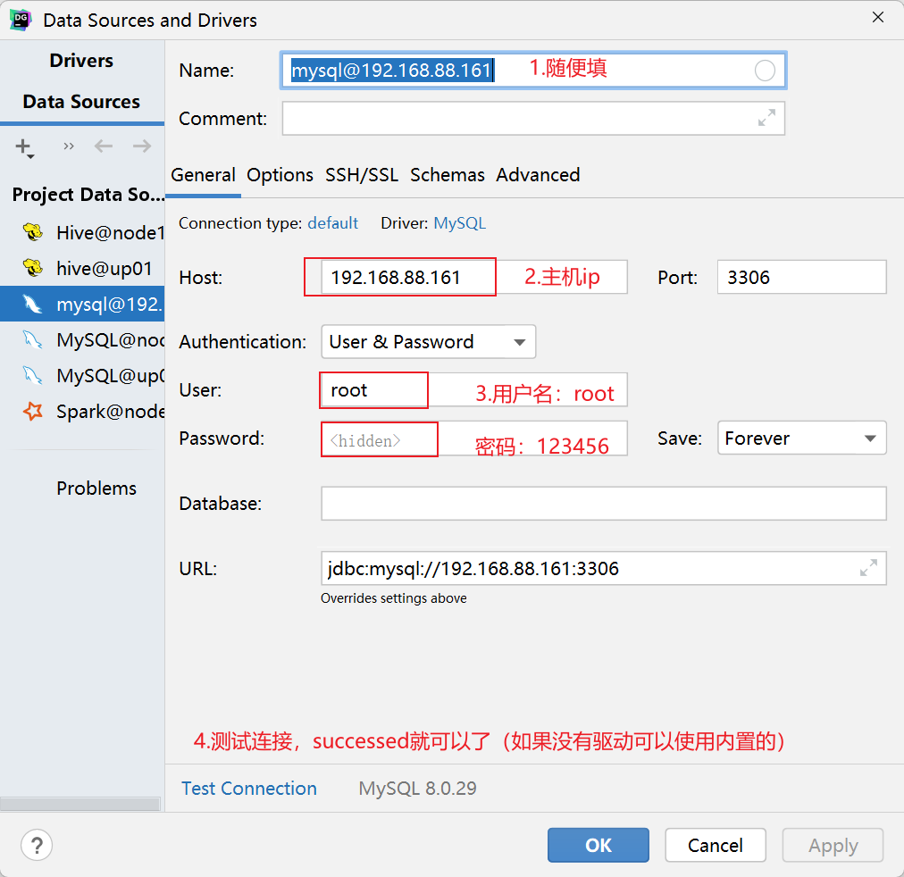
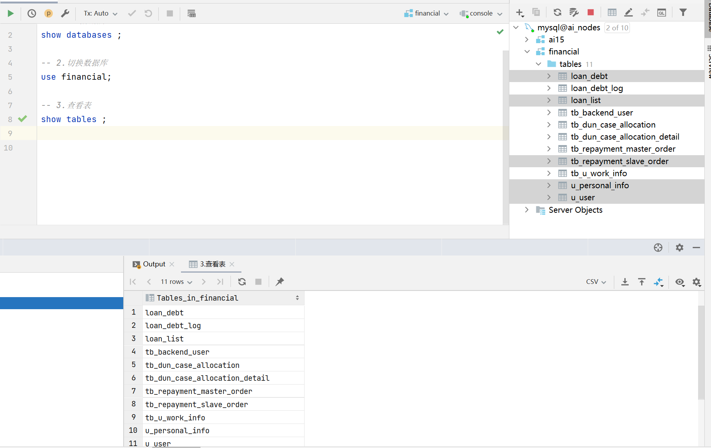

# 风控报表

##  【理解】信贷业务逻辑

### 信贷业务如何运行

- 市场部门/风控部门/催收部门

- 市场部门→获客
  - 新客转化/存量激活
    - 地推
    - 电销
    - 平台广告(抖音, 微信, 微博……)
    - 营销短信

- 风控部门→筛选用户
  - 是不是目标客群
  - 要不要放款
  - 给多少额度
  - 给多少利率
  - 给多少期
- 资金回收(催收部门)
  - 催收
    - 内催（公司内部）
    - 外催（第三方公司）
- 精细化运营
  - 市场，风控，催收各个环节添加运营手段
  - 市场→ 不同获客方式，不同人群是否在后期表现都一致
    - 存量用户召回→利率优惠， 免息券
  - 风控→ 找到额度，利率的最佳平衡点
  - 催收→ 不同的客户使用不同的话术， 不同的催收策略是否有不同的催收效果

### 信贷业务行为路径与转化漏斗

- 首贷、复贷概念
  - 第一次借款成功称为首贷
  - 借完一次之后， 再次借款称为复贷

- 首贷业务逻辑


- 在我们的数据库中，数据表大致分为两种形式，状态表和log表（日志表）

  - 状态表
    - 记录当前时刻,或者当天的状态,覆盖历史的状态
    - 例如申请表就是状态表, 申请的状态,上午9点→审核中, 下午1点→审核拒绝, 但是最终申请表, 只记录装改, 所以这个申请的状态就是拒绝
    - 如果需要确定某一时刻的状态
      - 一种方式 结合log表进行计算
      - 建立快照表

  - log表
    - 记录从开始到现在所有的数据, 有一次操作或者更新就记录一条
    - 还是以申请表举例：申请的状态表对应一张申请的log表, 点击申请按钮, 直接进入审核中, 增加一条记录
      - 审核完成增加一条审核完成的记录

- 信贷业务转化漏斗

  


- 数据表中数据条数对应关系

  


## 【了解】业务报表介绍

Schema：表结构。

### 注册表

- 注册表 u_user

```mysql
CREATE TABLE `u_user` (
  `id` bigint NOT NULL AUTO_INCREMENT COMMENT '自增主键',
  `username` varchar(64) ,
  `mobile` varchar(20) ,
  `password` varchar(64) ,
  `nickname` varchar(64) ,
  `role_type` int NOT NULL DEFAULT '0' COMMENT '角色(-1:普通用户)',
  `type` int NOT NULL DEFAULT '0' COMMENT '(暂时保留)0：借款用户,1:资金账户用户',
  `status` int NOT NULL DEFAULT '0' COMMENT '用户状态',
  `on_off` char(4) NOT NULL DEFAULT '1' COMMENT '开关(0:关闭,1:开启)',
  `inserttime` timestamp NOT NULL DEFAULT CURRENT_TIMESTAMP COMMENT '插入时间',
  `updatetime` timestamp NOT NULL DEFAULT CURRENT_TIMESTAMP ON UPDATE CURRENT_TIMESTAMP COMMENT '更新时间',
  `isactive` tinyint(1) NOT NULL DEFAULT '1' COMMENT '逻辑删除(1,有效)',
  PRIMARY KEY (`id`) USING BTREE,
  KEY `idx_mobile` (`mobile`,`on_off`,`status`,`isactive`,`password`) USING BTREE
) ENGINE=InnoDB AUTO_INCREMENT=11050 DEFAULT CHARSET=utf8mb4 COLLATE=utf8mb4_unicode_ci COMMENT='用户表';
```

- 一个手机号:对应注册表的一个id

  一个手机号: 注册完成后, 对应一个user_id , 手机号和人

  所以注册表有两种情况: ①有手机号, 但是没有user_id, 说明没有注册完成

  ② 有手机号,且有对应的user_id, 注册完成,通常风控的报表,从注册完成开始看

- 上表中不包含注册未完成的用户

### 用户信息表

- 用户信息(personal_info)

```mysql
CREATE TABLE `u_personal_info` (
  `id` bigint NOT NULL AUTO_INCREMENT COMMENT '自增主键',
  `user_id` bigint NOT NULL DEFAULT '0' COMMENT '用户id',
  `loan_purpose` varchar(255)  COMMENT '借款目的，tb_data_dict表中type=4',
  `sex` varchar(20)  COMMENT '性别(0：男 1：女)，tb_data_dict表中type=1',
  `birthdate` varchar(20)  COMMENT '出生日期',
  `birthplace` varchar(256)  COMMENT '出生地',
  `religion` varchar(20)  COMMENT '宗教，tb_data_dict表中type=3',
  `education` varchar(20)  COMMENT '教育程度，tb_data_dict表中type=2',
  `nation` varchar(20)  COMMENT '民族',
  `tribe` varchar(20)  COMMENT '部落，tb_data_dict表中type=10',
  `living_state` varchar(20)  COMMENT '居住状态，tb_data_dict表中type=9',
  `province` varchar(128)  COMMENT '居住省',
  `city` varchar(128)  COMMENT '居住市',
  `district` varchar(128)  COMMENT '居住区',
  `address` varchar(500)  COMMENT '居住详细地址',
  `children_number` varchar(20)  COMMENT '孩子数量(字典.type=15)',
  `number_of_provide` int DEFAULT NULL COMMENT '需供养人数',
  `phone_use_duration` varchar(20)  COMMENT '当前手机使用时长(字典)',
  `address_live_duration` varchar(20)  COMMENT '当前地址居住时长(字典)',
  `credit_card_number` varchar(20)  COMMENT '信用卡数量(字典)',
  `house_status` varchar(20)  COMMENT '住房状态(字典)',
  `other_phone_no` varchar(255)  COMMENT '其他电话号码',
  `email` varchar(128)  COMMENT '邮箱',
  `zalo_id` varchar(255) ,
  `facebook_id` varchar(255) ,
  `inserttime` timestamp NOT NULL DEFAULT CURRENT_TIMESTAMP COMMENT '插入时间',
  `updatetime` timestamp NOT NULL DEFAULT CURRENT_TIMESTAMP ON UPDATE CURRENT_TIMESTAMP COMMENT '更新时间',
  `isactive` tinyint(1) NOT NULL DEFAULT '1' COMMENT '是否逻辑删除(1:不删除)',
  `app_version` varchar(20) ,
  PRIMARY KEY (`id`) USING BTREE,
  UNIQUE KEY `user_id` (`user_id`,`isactive`) USING BTREE
) ENGINE=InnoDB AUTO_INCREMENT=871 DEFAULT CHARSET=utf8mb4 COLLATE=utf8mb4_unicode_ci COMMENT='个人信息';
```

- 用户信息表的主键是id
- 可以通过user_id 字段 与注册表进行关联
- 除了personal_info之外还有work_info 关于用户不同维度的信息这里在不同的表中保存

### 借款表

- 借款表 loan_list
- 每次申请都会有一条记录

```mysql
CREATE TABLE `loan_list` (
  `id` bigint NOT NULL AUTO_INCREMENT,
  `borrower_id` bigint NOT NULL COMMENT '借款人ID',
  `apply_amount` decimal(18,2) NOT NULL COMMENT '用户申请的额度',
  `period_no` int NOT NULL COMMENT '期数',
  `term_quantity` int NOT NULL COMMENT '每期贷款时长',
  `term_unit` varchar(4) NOT NULL,
  `product_id` int NOT NULL COMMENT '产品ID',
  `prod_type` tinyint NOT NULL COMMENT '1=PDL, 2=INSTALLMENT',
  `interest` decimal(18,2) NOT NULL COMMENT '利息',
  `interest_rate` decimal(10,5) NOT NULL COMMENT '借款利率',
  `service_fee` decimal(18,2) NOT NULL COMMENT 'drools给的应收服务费，实际收取逻辑是service_fee - service_fee_discount',
  `service_fee_discount` decimal(18,2) DEFAULT '0.00' COMMENT '服务费优惠减免',
  `service_rate` decimal(10,5) NOT NULL COMMENT '借款服务费率',
  `service_fee_type` int NOT NULL COMMENT '服务费是否分期1是不分，2是分',
  `overdue_penalty_rate` decimal(10,5) NOT NULL COMMENT '逾期罚息费率',
  `overdue_notify_rate` decimal(10,5) NOT NULL COMMENT '逾期催收费率',
  `overdue_fixed_charge` decimal(10,2) NOT NULL COMMENT '滞纳金',
  `withdraw_adjust_amount` decimal(10,2) DEFAULT NULL COMMENT '提现的时候为了满足尾数需求（假设5的倍数），调整的金额，大于零表示实际提现金额比应提现金额大，小于零表示实际提现金额小于应提现金额',
  `status` int NOT NULL COMMENT '标的状态，兼容历史数据使用',
  `stage` int NOT NULL COMMENT '标的处在的生命周期阶段, 10初始化，30审核，40投标，50转账，70提现，80还款，100结束，负数表示流标',
  `current_stage_status` tinyint NOT NULL COMMENT '当前生命周期的状态， -1失败，0进行中，1成功',
  `list_title` varchar(80) ,
  `list_desc` varchar(200) ,
  `ass_type` int DEFAULT NULL COMMENT '攒标=1, 理财app可投； 不攒标=2,理财app不可投',
  `agreement_id` bigint DEFAULT NULL COMMENT '借款协议id',
  `loan_title` varchar(80) ,
  `loan_purpose_code` varchar(80) ,
  `audit_time` timestamp NULL DEFAULT NULL COMMENT '审核系统给出审核结果时间',
  `full_bid_time` timestamp NULL DEFAULT NULL COMMENT '成标时间',
  `effective_time` timestamp NULL DEFAULT NULL COMMENT '用户收到款项时间',
  `inserttime` timestamp NOT NULL DEFAULT CURRENT_TIMESTAMP COMMENT '创建时间',
  `updatetime` timestamp NOT NULL DEFAULT CURRENT_TIMESTAMP ON UPDATE CURRENT_TIMESTAMP COMMENT '更新时间',
  `isactive` tinyint DEFAULT NULL COMMENT '逻辑删除 null=删除 1=正常',
  `risk_pass_time` timestamp NULL DEFAULT NULL COMMENT '风控通过时间,兼容印尼使用，非印尼请使用audit_time',
  `amount` decimal(18,2) DEFAULT NULL COMMENT '借款金额，额度评估结果',
  `risk_level` varchar(20)  COMMENT 'pata给出标的风险等级',
  `result` text CHARACTER SET utf8mb4 COLLATE utf8mb4_general_ci,
  PRIMARY KEY (`id`) USING BTREE,
  KEY `idx_borrower_id` (`borrower_id`) USING BTREE,
  KEY `idx_status` (`status`) USING BTREE
) ENGINE=InnoDB AUTO_INCREMENT=1107 DEFAULT CHARSET=utf8mb4 COLLATE=utf8mb4_general_ci COMMENT='loan list table';
```

- borrower_id  可以与注册表里的user_id进行关联
- 之所以叫borrower_id  是因为这里的用户都发起了借款申请, 注册表中的用户不一定都会申请借款

### 放款表

- loan_debt, 放款表, 也可以看做是还款计划表

```mysql
CREATE TABLE `loan_debt` (
  `id` bigint NOT NULL AUTO_INCREMENT,
  `list_id` bigint NOT NULL COMMENT '标的 id',
  `list_amount` decimal(18,2) NOT NULL COMMENT '标的金额',
  `agreement_id` bigint DEFAULT NULL COMMENT '借款协议id',
  `borrower_id` bigint NOT NULL COMMENT '借款人 id',
  `due_date` timestamp NOT NULL COMMENT '应还时间',
  `period_no` int NOT NULL COMMENT '分期期数',
  `period_seq` int NOT NULL COMMENT '第几期',
  `principal` decimal(18,2) NOT NULL COMMENT '本金',
  `interest` decimal(18,2) NOT NULL COMMENT '利息',
  `service_fee` decimal(18,2) NOT NULL COMMENT '服务费',
  `pre_service_fee` decimal(18,2) DEFAULT '0.00' COMMENT '前置收取的服务费',
  `penalty_fee` decimal(18,2) NOT NULL COMMENT '罚息',
  `overdue_notify_fee` decimal(18,2) NOT NULL COMMENT '催收',
  `amount` decimal(18,2) NOT NULL COMMENT '债务总额',
  `status` tinyint NOT NULL COMMENT 'debt status, 0=正常未还, 1=已还全部, 2=部分还款，3=未还逾期',
  `repay_code_status` tinyint DEFAULT NULL COMMENT '0=未生成, 1=手动生成,2=自动生成,3=生成失败',
  `repay_code_time` timestamp NULL DEFAULT NULL COMMENT '获取还款码的时间',
  `owing_principal` decimal(18,2) NOT NULL COMMENT '未付本金',
  `owing_interest` decimal(18,2) NOT NULL COMMENT '未付利息',
  `owing_service_fee` decimal(18,2) NOT NULL COMMENT '未付服务费',
  `owing_penalty_fee` decimal(18,2) NOT NULL COMMENT '未付罚息',
  `owing_overdue_notify_fee` decimal(18,2) NOT NULL COMMENT '未付罚息',
  `overdue_day` int DEFAULT NULL COMMENT '违约的天数',
  `owing_amount` decimal(18,2) NOT NULL COMMENT '未付债务总额',
  `payment_time` timestamp NULL DEFAULT NULL COMMENT '还款时间',
  `payment_amount` decimal(18,2) DEFAULT NULL COMMENT '已付总额',
  `overdue_fixed_charge` decimal(10,2) NOT NULL COMMENT '滞纳金',
  `user_actual_payment_time` timestamp NULL DEFAULT NULL COMMENT '用户实际还款的时间，来自资金',
  `version` int DEFAULT NULL COMMENT '版本',
  `inserttime` timestamp NOT NULL DEFAULT CURRENT_TIMESTAMP COMMENT '创建时间',
  `updatetime` timestamp NOT NULL DEFAULT CURRENT_TIMESTAMP ON UPDATE CURRENT_TIMESTAMP COMMENT '更新时间',
  `isactive` tinyint DEFAULT NULL COMMENT '逻辑删除 null=删除 1=正常',
  `init_due_date` datetime DEFAULT NULL COMMENT '债务初始化的应还时间',
  `delay_count` int DEFAULT '0' COMMENT '已成功展期的次数',
  PRIMARY KEY (`id`) USING BTREE
) ENGINE=InnoDB AUTO_INCREMENT=7093 DEFAULT CHARSET=utf8mb3 COMMENT='债务';
```

- 这张表是一个状态表, 还款信息只会记录最新的状态

### 还款表

- 还款表记录了每一笔还款的情况

```mysql
CREATE TABLE `tb_repayment_slave_order` (
  `id` bigint NOT NULL AUTO_INCREMENT COMMENT '自增主键',
  `master_order_id` bigint NOT NULL DEFAULT '0' COMMENT '主订单ID',
  `borrower_id` bigint NOT NULL DEFAULT '0' COMMENT '借款人ID',
  `debt_id` bigint NOT NULL DEFAULT '0' COMMENT '债务ID',
  `principal` decimal(18,2) NOT NULL DEFAULT '0.00' COMMENT '还款中的本金',
  `interest` decimal(18,2) NOT NULL DEFAULT '0.00' COMMENT '还款中的利息',
  `penalty_fee` decimal(18,2) NOT NULL DEFAULT '0.00' COMMENT '还款中的罚息',
  `overdue_notify_fee` decimal(18,2) NOT NULL DEFAULT '0.00' COMMENT '还款中的催费',
  `service_fee` decimal(18,2) NOT NULL DEFAULT '0.00' COMMENT '还款中的手续费',
  `inserttime` timestamp NOT NULL DEFAULT CURRENT_TIMESTAMP COMMENT '插入时间',
  `updatetime` timestamp NOT NULL DEFAULT CURRENT_TIMESTAMP ON UPDATE CURRENT_TIMESTAMP COMMENT '更新时间',
  `isactive` tinyint(1) NOT NULL DEFAULT '1' COMMENT '逻辑删除(null=删除,1:未删除)',
  PRIMARY KEY (`id`) USING BTREE
) ENGINE=InnoDB AUTO_INCREMENT=854 DEFAULT CHARSET=utf8mb4 COLLATE=utf8mb4_0900_ai_ci COMMENT='还款订单明细，可以推导出tb_repayment_record';
```

- 同一个订单可能会有多次还款


## 【了解】风控报表指标

- 市场部门的指标
  - 各个阶段转化率
  - 注册→申请→通过→放款(首贷)
  - 复贷还款→申请→通过→放款(复贷)
- 市场部门业务报表
  - 转化率漏斗表
  - 各个渠道花费及效率
  - 每个页面的留存率
- 风控部门的指标
  - 通过率, 放款, 件均
  - 逾期率
    - 单期产品: 整笔逾期, 金额逾期
    - 多期产品: 整笔逾期, 金额逾期, 单期笔数,金额逾期
- 风控部门的业务报表
  - 通过率表
  - 放款统计表
  - 规则命中率
  - 客群分布
  - vintage表
- 催收的指标
  - 催回率
  - 不同催收阶段
  - 不同催收员的催回
- 催收部门的业务报表
  - 不同员工不同阶段催回情况表
  - 接通率表, 接通时长表
- 运营部门
  - 指标提升


## 【了解】前置操作

### 数据导入(仅限于数据库不存在的情况下运行)

数据在`loan.sql`文件，需要我们在MySQL中把它导入进去即可。

这里以远程来演示。

```shell
#0.启动MySQL数据库（一般是开机自启，忽略）
#查看MySQL的状态
systemctl status mysqld
#启动MySQL
systemctl start mysqld
#设置开机自启
systemctl enable mysqld
#禁止开机自启
systemctl disable mysqld

#1.登录MySQL数据库
mysql -uroot -p123456

#2.创建数据库
create database financial charset utf8;

#3.切换数据库
use financial;

#4.导入SQL数据，指定loan.sql文件在Linux的路径，不是一个具体的路径
#可以用工具，只要能导入成功就行
source /path/to/loan.sql
source /root/loan.sql
```


### 连接数据库

使用PyCharm工具远程连接MySQL数据库。



点击PyCharm工具右边的Database，新建数据源，选择MySQL，配置Host、Username、Password，Driver，点击测试连接，连接成功后，如下图所示：




## 【作业】

顺序千万别反。

~~~shell
#风控业务案例（代码）

#报表数据准备好（Linux下的数据导入）

#理解概念，名词，业务即可
~~~


## 【了解】风控基础报表介绍

### 各阶段转化率表


- 统计每天注册的客户中，有多少人进行了申请，多少人通过，有多少人放款，有多少人还款

- 需要注意的问题

  - 涉及到多张表， 用哪张表做主表
  - 用到哪些表, 怎么join
  - 需要注意的一些细节（一个人修改了多次信息， 一个人申请了多次）
  - 要做哪些计算

- 主表是哪张

  - 注册表的人数是最多的，我们的转化漏斗也是从注册开始，计算每一个环节的人数转化率
  - 以注册表作为主表去left join其它表不会有错

  ```mysql
  select () from user as u
  ```

- 用到哪些表，怎么join

  - 用户的详细信息在personal_info表中, 用表中的user_id与主表的id相连
  - loan_list 借款申请表 borrower_id  对应注册表中的 id
  - loan_debt 放款表  list_id对应loan_list中的id

  ```mysql
  SELECT
  FROM
  	u_user AS u
  	LEFT JOIN u_personal_info AS pi ON u.id = pi.user_id
  	LEFT JOIN loan_list AS al ON al.borrower_id = u.id
  	LEFT JOIN loan_debt AS ld ON al.id = ld.list_id
  ```

- 一个人多次申请，一个人多条修改记录

  - 我们这里只统计人数，多条记录也是一个人头
  - 可以使用max 或者 distinct 取出一条用于计算人数

  ```mysql
  SELECT
  		u.id AS user_id, -- 用户ID
  		al.id AS list_id,-- 申请ID
  		ld.id AS order_id,-- 放款ID
  		date( u.inserttime ) AS regist_time,
  		max( CASE WHEN pi.user_id IS NOT NULL THEN 1 ELSE 0 END ) AS if_fillin_pi,
  		max( CASE WHEN al.borrower_id IS NOT NULL THEN 1 ELSE 0 END ) AS if_apply,
  		max( CASE WHEN al.STATUS > 70 THEN 1 ELSE 0 END ) AS if_pass,
  		max( CASE WHEN ld.borrower_id IS NOT NULL THEN 1 ELSE 0 END ) AS if_loan,
  		max( CASE WHEN ld.payment_amount > 0 THEN 1 ELSE 0 END ) AS if_pay,
  		max( CASE WHEN ld.owing_principal = 0 THEN 1 ELSE 0 END ) AS if_pay_1done 
  		-- owing_principal欠款本金
  	FROM
  		u_user AS u
  		LEFT JOIN u_personal_info AS pi ON u.id = pi.user_id
  		LEFT JOIN loan_list AS al ON al.borrower_id = u.id
  		LEFT JOIN loan_debt AS ld ON al.id = ld.list_id 
  	GROUP BY
  		u.id,
  		al.id,
  		ld.id 
  	ORDER BY
  		u.id 
  ```

- 完整SQL

```mysql
WITH temp AS (
	SELECT
		u.id AS user_id,
		al.id AS list_id,
		ld.id AS order_id,
		date( u.inserttime ) AS regist_time,
		max( CASE WHEN pi.user_id IS NOT NULL THEN 1 ELSE 0 END ) AS if_fillin_pi, -- 是否填表
		max( CASE WHEN al.borrower_id IS NOT NULL THEN 1 ELSE 0 END ) AS if_apply, -- 是否申请
		max( CASE WHEN al.STATUS > 70 THEN 1 ELSE 0 END ) AS if_pass, -- 是否通过
		max( CASE WHEN ld.borrower_id IS NOT NULL THEN 1 ELSE 0 END ) AS if_loan, -- 是否借款
		max( CASE WHEN ld.payment_amount > 0 THEN 1 ELSE 0 END ) AS if_pay, -- 是否还款
		max( CASE WHEN ld.owing_principal = 0 THEN 1 ELSE 0 END ) AS if_pay_1done  -- 是否还清
	FROM
		u_user AS u
		LEFT JOIN u_personal_info AS pi ON u.id = pi.user_id
		LEFT JOIN loan_list AS al ON al.borrower_id = u.id
		LEFT JOIN loan_debt AS ld ON al.id = ld.list_id 
	GROUP BY
		u.id,
		al.id,
		ld.id 
	ORDER BY
		u.id 
	) SELECT
	regist_time,
	count( user_id ) AS regist_num,
	sum( if_fillin_pi ) AS fill_in_pi_num,
	sum( if_apply ) AS apply_num,
	sum( if_pass ) AS pass_num,
	sum( if_loan ) AS loan_num,
	sum( if_pay ) AS pay_num,
	sum( if_apply )/ count( user_id ) AS '注册→申请',
	sum( if_pass )/ sum( if_apply ) AS '申请→通过',
	sum( if_loan )/ sum( if_pass ) AS '通过→放款',
	sum( if_pay )/ sum( if_loan ) AS '放款→还过款',
	sum( if_pay_1done )/ sum( if_loan ) AS '还款→至少1期还完' 
FROM
	temp 
GROUP BY
	regist_time 
ORDER BY
	regist_time
```


### 通过率表


- 统计每天申请的客户有多少人，有多少人申请通过

  - user_type 新客老客，如何区分

- 主表：统计申请的情况，所以主表肯定是申请表

  ```mysql
  select 
  from loan_list as l
  ```

- 定义新客，老客

  - 放过款的客户，再来申请，就是老客
  - 没放过款的客户，就是新客，可能是第一次来，也可能是之前的申请被拒接了
  - 所以先计算第一次成功借款时间

  ```mysql
  select borrower_id,min(effective_time) as effective_time 
  -- 第一次成功放款时间 等于 loan_debt inserttime
  from loan_list
  where stage in (80,100) --成功标志
  group by borrower_id
  ```

  - 当前申请时间与第一次成功放款时间比较, 得出新老客定义

  ```mysql
  with first_loan as (
  select borrower_id,min(effective_time) as effective_time  
  from loan_list
  where stage in (80,100) -- 成功标志
  group by borrower_id
  )
  SELECT ls.borrower_id,case when ls.inserttime > first_loan.effective_time THEN '老客' else '新客' end as user_type
  from loan_list ls
  left join first_loan
  on ls.borrower_id = first_loan.borrower_id
  	
  ```

- 计算整张报表

```mysql
with first_loan as (
select borrower_id,min(effective_time) as effective_time  
from loan_list
where stage in (80,100) -- 成功标志
group by borrower_id
), -- 多个with as同时写的时候，with只能写一次，后面都是 临时表名 + as，select部分需要通过括号包裹起来，多个as需要用都好分割
u_type as (
SELECT ls.*,case when ls.inserttime > first_loan.effective_time THEN '老客' else '新客' end as user_type
from loan_list ls
left join first_loan
on ls.borrower_id = first_loan.borrower_id
)
SELECT date(l.inserttime) as apply_time,
user_type,l.period_no,
l.term_quantity,
count(l.id) as apply_num,
sum(case WHEN l.`status`>70 then 1 else 0 end ) as if_pass_num,
avg(l.apply_amount) as mean_apply_amount,
sum(case WHEN l.`status`>70 then 1 else 0 end ) /count(l.id) as passrate -- 申请通过数量/申请数量 计算通过率
from loan_list l 
LEFT JOIN u_type on u_type.id = l.id
WHERE user_type is not null
GROUP BY apply_time,user_type,l.period_no,l.term_quantity -- 看每天, 不同的客群(新客, 老客) 不同的产品 通过率
ORDER BY apply_time,user_type
```


### 放款统计表

- 统计每天放款的客户, 有多少人是新客, 多少人是老客, 件均是多少


- 在通过率的报表基础上, 直接更换主表为放款loan_debt 表即可

```mysql
with first_loan as (
select borrower_id,min(effective_time) as effective_time  
from loan_list
where stage in (80,100) -- 成功标志
group by borrower_id
),
u_type as (
SELECT ls.*,case when ls.inserttime > first_loan.effective_time THEN '老客' else '新客' end as user_type
from loan_list ls
left join first_loan
on ls.borrower_id = first_loan.borrower_id
)
SELECT 
date(ld.inserttime) as '放款日',
user_type,
l.period_no,
concat(l.term_quantity,l.term_unit) as '期限', -- concat函数 字符串拼接
COUNT(DISTINCT list_id) as loan_num,
sum(ld.list_amount) /COUNT(DISTINCT list_id) as '件均'
FROM loan_debt ld
LEFT JOIN loan_list l on ld.list_id = l.id
LEFT JOIN u_type on u_type.id = l.id
WHERE user_type is not null
GROUP BY 1,2,3,4
ORDER BY 1,2
```


### Vintage报表

- vintage这个词源于葡萄酒业，意思是葡萄酒的酿造年份。

- 我们在比较放贷质量的时候，要按账龄（month of book，MOB  ）的长短同步对比，从而了解同一产品不同时期放款的资产质量情况。

- 举例来说，今天是2021年6月25日，我们取今天贷款第一期到期的客户作为观察群体，观察他们今后29天的还款情况。如果你将将今天所有贷款到期的客户作为观察群体（里面有第一期到期的，也有第二期到期的，也有第三期到期的，等等），那么这个群体里面的客户就不是位于同一层面上了。

- 到了下个月，7月25号，我们取7月25号贷款第一期到期的客户作为观察群体，观察他们之后29天的还款情况。这样你就可以比较6月25号的群体和7月25号的群体的还款情况差异

- 如果8月25号的群体还款质量有显著性降低，那么你可能会审视一下你这一个月来的营销策略是否变宽松了，或者这一个月来国家政策有什么改动等等

  | 当期未还本金/当期应还金额 | DAY0 | DAY1 | .... | DAY29 |
  | ------------------------- | ---- | ---- | ---- | ----- |
  | 2021-06-25                | 60%  | 55%  | ...  | 15%   |
  | 2021-07-25                | 80%  | 75%  | ...  | 25%   |

- vintage将不同时期的数据拉平到同一时期比较，可以很直观地比较和反思不同时期公司的营销策略的效果。

- 每天到期的贷款的逾期情况，不是按照到期是哪天来看，按照逾期第几天来看，比较放贷的质量随时间的变化情况

**报表计算**

```sql
with cte as (
SELECT ld.id,date(ld.due_date) as due_date,
sum(ld.principal) as total_principal,
sum(case WHEN rl.inserttime is NOT NULL and DATEDIFF(date(rl.inserttime),date(ld.due_date))<=0 THEN rl.principal end) as d0_principal,
sum(case WHEN rl.inserttime is NOT NULL and DATEDIFF(date(rl.inserttime),date(ld.due_date))=1 THEN rl.principal end) as d1_principal,
sum(case WHEN rl.inserttime is NOT NULL and DATEDIFF(date(rl.inserttime),date(ld.due_date))=2 THEN rl.principal end) as d2_principal
from loan_debt ld
LEFT JOIN tb_repayment_slave_order rl on rl.debt_id = ld.id
GROUP BY 1, 2)
select due_date ,
sum(total_principal) as total_principal,
sum(d0_principal) as d0_principal,
sum(d1_principal) as d1_principal,
sum(d2_principal) as d2_principal,
sum(d0_principal)/sum(total_principal) as d0,
sum(d1_principal)/sum(total_principal) as d1,
sum(d2_principal)/sum(total_principal) as d2
from cte
GROUP BY 1
```


### 催收报表

- 催收分案表

```mysql
CREATE TABLE `tb_dun_case_allocation` (
  `id` bigint NOT NULL,
  `borrower_id` bigint NOT NULL COMMENT '借款人ID',
  `allocator_id` bigint NOT NULL COMMENT '分案操作者',
  `status` int NOT NULL COMMENT '1-催收中；2-已被转移走；3-催收结束已关闭',
  `dun_case_id` bigint NOT NULL COMMENT '案件Id',
  `owner_id` bigint NOT NULL COMMENT '经办人',
  `previous_owner_id` bigint DEFAULT NULL COMMENT '前一个经办人',
  `max_overdue_day` int NOT NULL COMMENT '分案时最大逾期天数',
  `inserttime` timestamp NOT NULL DEFAULT CURRENT_TIMESTAMP COMMENT '插入时间',
  `updatetime` timestamp NOT NULL DEFAULT CURRENT_TIMESTAMP ON UPDATE CURRENT_TIMESTAMP COMMENT '更新时间',
  `isactive` tinyint(1) DEFAULT NULL COMMENT '逻辑删除(null:删除,1:未删除)',
  PRIMARY KEY (`id`) USING BTREE,
  KEY `ix_borrower_id` (`borrower_id`) USING BTREE,
  KEY `ix_dun_case_id` (`dun_case_id`) USING BTREE,
  KEY `ix_owner_id` (`owner_id`) USING BTREE,
  KEY `ix_status` (`status`) USING BTREE
) ENGINE=InnoDB DEFAULT CHARSET=utf8mb3 COMMENT='催收分案';
```

- 催收分案明细

```mysql
CREATE TABLE `tb_dun_case_allocation_detail` (
  `id` bigint NOT NULL AUTO_INCREMENT COMMENT '自增主键',
  `borrower_id` bigint NOT NULL COMMENT '借款人ID',
  `allocation_id` bigint NOT NULL COMMENT '分案Id',
  `dun_case_id` bigint NOT NULL COMMENT '案件Id',
  `list_id` bigint NOT NULL COMMENT '标的 id',
  `debt_id` bigint NOT NULL COMMENT '债务ID',
  `owner_id` bigint NOT NULL COMMENT '经办人',
  `overdue_day` int NOT NULL COMMENT '分案时逾期天数',
  `start_owing_amount` decimal(18,2) NOT NULL COMMENT '起始逾期金额',
  `start_owing_principal` decimal(18,2) NOT NULL COMMENT '起始逾期本金',
  `start_owing_interest` decimal(18,2) NOT NULL COMMENT '起始逾期利息',
  `start_owing_notify_fee` decimal(18,2) NOT NULL COMMENT '起始逾期公司罚息',
  `start_owing_penalty_fee` decimal(18,2) NOT NULL COMMENT '起始逾期用户罚息',
  `start_owing_service_fee` decimal(18,2) NOT NULL COMMENT '起始逾期用户服务费',
  `dun_over_time` timestamp NULL DEFAULT NULL COMMENT '结束时间，还清',
  `dun_repay_amount` decimal(18,2) NOT NULL COMMENT '已还金额',
  `dun_repay_principal` decimal(18,2) NOT NULL COMMENT '已还本金',
  `dun_repay_interest` decimal(18,2) NOT NULL COMMENT '已还利息',
  `dun_repay_notify_fee` decimal(18,2) NOT NULL COMMENT '已还公司罚息',
  `dun_repay_penalty_fee` decimal(18,2) NOT NULL COMMENT '已还用户罚息',
  `dun_repay_service_fee` decimal(18,2) NOT NULL COMMENT '已还服务费',
  `dun_repay_status` int NOT NULL COMMENT '入催后的还款状态，跟随loan_debt，2-已全全部，3-部分还款，4-未还逾期',
  `inserttime` timestamp NOT NULL DEFAULT CURRENT_TIMESTAMP COMMENT '插入时间',
  `updatetime` timestamp NOT NULL DEFAULT CURRENT_TIMESTAMP ON UPDATE CURRENT_TIMESTAMP COMMENT '更新时间',
  `isactive` tinyint(1) DEFAULT NULL COMMENT '逻辑删除(null:删除,1:未删除)',
  `delay_flag` tinyint(1) DEFAULT '0' COMMENT '对应债务在催期间是否展期',
  PRIMARY KEY (`id`) USING BTREE,
  KEY `ix_allocation_id` (`allocation_id`) USING BTREE,
  KEY `ix_borrower_id` (`borrower_id`) USING BTREE,
  KEY `ix_debt_id` (`debt_id`) USING BTREE,
  KEY `ix_dun_case_id` (`dun_case_id`) USING BTREE
) ENGINE=InnoDB AUTO_INCREMENT=129 DEFAULT CHARSET=utf8mb3 COMMENT='催收分案明细';
```

- 催收人员表

```mysql
CREATE TABLE `tb_backend_user` (
  `id` bigint NOT NULL AUTO_INCREMENT COMMENT '自增主键',
  `username` varchar(64)  NOT NULL,
  `realname` varchar(128)  NOT NULL COMMENT '用户真实姓名',
  `mobile` varchar(20)  DEFAULT NULL,
  `password` varchar(64)  DEFAULT NULL,
  `email` varchar(64)  DEFAULT NULL,
  `email_password` varchar(64)  DEFAULT '' COMMENT '用户邮箱密码',
  `department` varchar(128)  DEFAULT NULL COMMENT '部门',
  `department_id` bigint NOT NULL,
  `role_type` int DEFAULT NULL COMMENT '角色(-1:普通用户)',
  `type` int DEFAULT NULL COMMENT '0：借款用户,1:资金账户用户',
  `status` int NOT NULL COMMENT '用户状态',
  `on_off` char(4)  NOT NULL COMMENT '开关(0:关闭,1:开启)',
  `operate_id` bigint NOT NULL DEFAULT '0' COMMENT '操作人的id',
  `softphone_account` varchar(20)  DEFAULT NULL COMMENT '外呼系统软电话坐席号/分机号',
  `inserttime` timestamp NOT NULL DEFAULT CURRENT_TIMESTAMP COMMENT '插入时间',
  `updatetime` timestamp NOT NULL DEFAULT CURRENT_TIMESTAMP ON UPDATE CURRENT_TIMESTAMP,
  `isactive` tinyint(1) DEFAULT NULL COMMENT '逻辑删除',
  PRIMARY KEY (`id`) USING BTREE,
  UNIQUE KEY `uk_username` (`username`,`isactive`) USING BTREE
) ENGINE=InnoDB AUTO_INCREMENT=84 DEFAULT CHARSET=utf8mb3 COMMENT='后台用户表';
```


- 催收报表

  - 定义分案归属, 当天最后一次分案算作最终分案归属

    ```mysql
    SELECT max(id) as id from tb_dun_case_allocation GROUP BY date(inserttime), dun_case_id
    ```

  - 主表: 分案表, 计算逾期天数还需要loan_debt

    ```mysql
    select 
    from cte1
    LEFT JOIN tb_dun_case_allocation dca on cte1.id = dca.id
    LEFT JOIN tb_dun_case_allocation_detail dcad on dcad.allocation_id = dca.id 
    LEFT JOIN loan_debt ld on ld.id = dcad.debt_id
    WHERE date(dcad.inserttime)>=date('2020-01-07') and dcad.overdue_day<=7 ORDER BY dcad.debt_id),
    ```

  - 催收人员可能换组, 利用人名做限制

    ```mysql
    left JOIN tb_backend_user bu on cte2.owner_id = bu.id
    ```

- 完整SQL

```mysql
with cte1 as (
SELECT max(id) as id from tb_dun_case_allocation GROUP BY date(inserttime), dun_case_id
),
cte2 as (
select cte1.id,dca.borrower_id,dca.dun_case_id,dcad.list_id,dcad.debt_id,dcad.inserttime as fenan_time, dcad.overdue_day,ld.due_date,dcad.owner_id,dcad.start_owing_amount,dcad.start_owing_principal,dcad.dun_repay_amount,dcad.dun_repay_principal
from cte1
LEFT JOIN tb_dun_case_allocation dca on cte1.id = dca.id
LEFT JOIN tb_dun_case_allocation_detail dcad on dcad.allocation_id = dca.id 
LEFT JOIN loan_debt ld on ld.id = dcad.debt_id
WHERE date(dcad.inserttime)>=date('2020-01-07') and dcad.overdue_day<=7 ORDER BY dcad.debt_id),
c as (
SELECT date(cte2.fenan_time) as fenan_time,bu.realname,sum(cte2.start_owing_amount) as lj_owing_amount,
sum(cte2.dun_repay_amount) as lj_repay_amount,
sum(cte2.dun_repay_amount)/sum(cte2.start_owing_amount) as repay_rate_amount, sum(cte2.start_owing_principal) as lj_owing_principal,
sum(cte2.dun_repay_principal) as lj_repay_principal,sum(cte2.dun_repay_principal)/sum(cte2.start_owing_principal) as repay_rate_principal,
count(cte2.dun_case_id) as fenan_cnt,sum(case WHEN cte2.dun_repay_amount>0 then 1 else 0 end) as repay_cnt,
SUM(case WHEN cte2.dun_repay_amount>0 then 1 else 0 end)/COUNT(cte2.dun_case_id) as repay_rate_cnt
FROM cte2 
left JOIN tb_backend_user bu on cte2.owner_id = bu.id
WHERE cte2.start_owing_amount>=10000 and bu.realname in ('test','test2','test1','test01')
GROUP BY 1,2
ORDER BY 1,2)
SELECT c.fenan_time as '分案日', c.realname as '姓名',0.38 AS '目标',c.lj_owing_amount as '分案金额',c.lj_repay_amount  as ' 还款金额', c.repay_rate_amount as '还款率-金额', c.lj_owing_principal as '分案本金' , c.lj_repay_principal as '还款本金' , c.repay_rate_principal as '还款率-本金', c.fenan_cnt as '分案件数', c.repay_cnt as '还款件数', c.repay_rate_cnt as '还款率-件数'
from c
```

思路

① 拉宽表  

- 数据可能是在不同的表中保存, 取数的时候, 是不是要考虑一些边界条件
- 考虑如何去JOIN  哪张表是主表, 如何JOIN 不会丢信息

② 在宽表的基础上算指标

​	加减乘除,  在算之前, 每一个指标的计算方法一定要搞清楚

③ 整理结果
