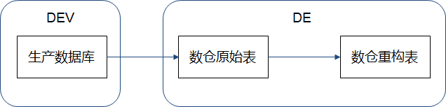

# 风控建模概述

## 【了解】今日内容介绍

- 知道信贷审批业务的基本流程
- 知道ABC评分卡是什么，有什么区别
- 知道风控建模的流程
- 掌握评分卡模型正负样本定义方法
- 知道如何构建特征，如何评估特征


## 【理解】互联网金融风控体系介绍

- 信贷审批业务基本流程

  - 四要素认证：银行卡持有人的姓名、身份证号、银行卡号、手机号

  

- 互联网金融风控体系主要由三大部分组成

  - 用户数据：用户基本信息、用户行为信息、用户授权信息、外部接入信息。
    - 数据采集会涉及到埋点和爬虫技术，基本上业内的数据都大同小异。
      - 免费的运营商数据
      - 安卓可爬的手机内部信息（app名称，手机设备信息，部分app内容信息）
      - 收费的征信数据、各种信息校验、外部黑名单之类的
      - 特定场景的现金贷和消费金融会有自有的数据可供使用
        - 比如阿里京东自己的电商数据
        - 滴滴的司机数据、顺丰中通的快递数据
    - 用户基本信息（联系人，通讯录，学历...)
    - 用户行为信息（操作APP时的行为，注册，点击位置...)
    - 用户授权信息（运营商，学信网，设备IMEI....)
    - 外部接入信息（P2P信贷，其它金融机构如芝麻信用分...)
  - 策略体系：反欺诈规则、准入规则、运营商规则、风险名单、网贷规则
    - 收集来用户的信息之后，把用户信息输入到策略引擎
    - 欺诈规则
    - 准入规则（年龄，地域，通讯录，行为规则）
    - 运营商规则（通话规则)
    - 风险名单（黑名单，失信名单，法院名单）
    - 网贷（多头，白户...)
  - 机器学习模型：欺诈检测模型、准入模型、授信模型、风险定价、额度管理、流失预警、失联修复。

  |        | 贷前准入     | 贷中管理                         | 贷后催收   |
  | ------ | ------------ | -------------------------------- | ---------- |
  | 信用   | 申请评分卡   | 行为评分卡                       | 催收评分卡 |
  | 反欺诈 | 申请反欺诈   | 交易反欺诈                       |            |
  | 运营   | 用户响应模型 | 用户流失模型、用户分群、用户画像 | 失联修复   |
  | 其他   |              | 套现识别、洗钱识别               |            |

小结：

~~~shell
#互联网金融组成
用户数据
策略体系
模型
~~~


## 【掌握】风控建模流程


### 评分卡简介

- 风控模型其中包含了A/B/C卡。模型可以采用相同算法，一般以逾期天数来区分正负样本，也就是目标值Y的取值（0或1）
  - 贷前  申请评分卡 Application score card（最重要的）
  - 贷中  行为评分卡 Behavior score card
  - 贷后  催收评分卡  Collection score card（最不重要）
- C卡因为用途不同Y的取值可能有区别
  - 公司有内催，有外催。外催回款率低，单价贵
  - 可以根据是否被内催催回来定义C卡的Y。


### 机器学习模型的完整工程流程

项目准备期 → 特征工程 → 模型构建 → 上线运营

- 准备
  - 明确需求
  - 模型设计
    - 业务抽象成分类/回归问题
    - 定义标签（目标值）
  - 样本设计
- 特征工程
  - 数据处理，选取合适的样本，并匹配出全部的信息作为基础特征
  - 特征构建
  - 特征评估

- 模型
  - 模型训练
  - 模型评价
  - 模型调优
- 上线运营
  - 模型交付
  - 模型部署
  - 模型监控

### 项目准备期

- **明确需求**

  - 目标人群：新客，优质老客，逾期老客
  - 给与产品：额度，利率
  - 市场策略：冷启动，开拓市场，改善营收
  - 使用时限：紧急使用，长期部署
  - 举例
    - 业务需要针对全新客户开放一个小额现金贷产品，抢占新市场
    - 针对高风险薄数据新客的申请评分卡

- **模型设计**

  - 业务抽象成分类/回归问题

    - 风控场景下问题通常都可以转化为二分类问题：

      - 信用评分模型期望用于预测一个用户是否会逾期，逾期用户1

      - 营销模型期望用于预测一个用户被营销后是否会来贷款，没贷用户1

      - 失联模型期望用于预测一个用户是否会失联，失联用户1

        **风控业务中，只有欺诈检测不是二分类问题。因为样本数量不足，可能是一个无监督学习模型**

  - 模型算法

    - 规则模型
    - 逻辑回归
    - 集成学习
    - SVM
    - KNN
    - 决策树

  - 模型输入

    - 数据源
    - 时间跨度

  - Y标签定义

    - 在构建信贷评分模型时，原始数据中只有每个人的当前逾期情况，没有负样本，负样本需要人为构建
    - 通常选一个截断点（阈值），当逾期超过某个阈值时，就认定该样本是一个负样本，未来不会还钱
    - 比如逾期15天为正负样本的标记阈值，Y = 1的客户均是逾期超过15天的客户
    - 逾期>15天时 Y = 1，那么Y=0如何定义
      - 只会将按时还款和逾期较少的那一部分人标记为0。如：将逾期<5天和没有逾期的人作为正样本
      - 逾期5～15天的数据（灰样本）会从样本中去掉，去掉“灰样本”，会使样本分布更趋于二项分布，对模型学习更加有利。
      - “灰样本”通常放入测试集中，用于确保模型在训练结束后，对该部分样本也有区分能力。
      - 结论：Y>15，违约，负样本，Y<5，正常，正样本。5-15天之内的称为灰样本，用来测试。

  - 样本选取

    - 代表性：样本必须能够充分代表总体。如消费贷客群数据不能直接用到小额现金贷场景
    - 充分性：样本集的数量必须满足一定要求。评分卡建模通常要求正负样本的数量都不少于1500个。随着样本量的增加，模型的效果会显著提升
    - 时效性：在满足样本量充足的情况下，通常要求样本的观测期与实际应用时间节点越接近越好。如银行等客群稳定的场景，观察期可长达一年半至两年。
    - 排除性（Exclusion）：虽然建模样本需要具有代表整体的能力，但某些法律规定不满足特定场景贷款需求的用户不应作为样本，如对行为评分卡用户、无还款表现或欺诈用户均不应放入当前样本集。
    - 评分卡建模通常要求正负样本的数量>=1500，但当总样本量超过50000个时，许多模型的效果不再随着样本量的增加而有显著提升，而且数据处理与模型训练过程通常较为耗时。
    - 如果样本量过大，会为训练过程增加不必要的负担，需要对样本做欠采样（Subsampling）处理。由于负样本通常较少，因此通常只针对正样本进行欠采样。常见的欠采样方法分为：
      - 随机欠采样：直接将正样本欠采样至预期比例。
      - 分层抽样：保证抽样后，开发样本、验证样本与时间外样本中的正负样本比例相同。
      - 等比例抽样：将正样本欠采样至正负样本比例相等，即正样本量与负样本量之比为1:1。
        需要注意的是，采样后需要为正样本添加权重。如正样本采样为原来的1/4，则为采样后的正样本增加权重为4，负样本权重保持为1。因为在后续计算模型检验指标及预期坏账时，需要将权重带入计算逻辑，才可以还原真实情况下的指标估计值，否则预期结果与实际部署后的结果会有明显偏差。
      - 而当负样本较少的时候，需要进行代价敏感加权或过采样（Oversampling）处理
      - 结论：样本的数量：【1500,50000】
    - 观察期和表现期
      - 观察期是指用户申请信贷产品前的时间段

      - 表现期是定义好坏标签的时间窗口，如果在该时间窗口内触发坏定义就是坏样本，反之就是好样本。

      - 举例: 要建立A卡模型, 观察期12个月,表现期3个月
        - 用户贷款前12个月的历史行为表现作为变量，用于后续建模
        - 如设定用户在到期3个月内未还款，即认为用户为负样本，则称表现期为3个月

        

        ~~~shell
        观察期：确定x
        表现期：确定y
        x和y一起，经过算法训练后，才能得到最终模型。
        ~~~

        **无论是观察期还是表现期，都是用于训练模型的。**
    - 训练数据测试数据划分
      - 数据集在建模前需要划分为3个子集：
        - 开发样本（Develop）:开发样本与验证样本使用分层抽样划分，保证两个数据集中负样本占比相同
        - 验证样本（Valuation）: 开发样本与验证样本的比例为6:4
        - 时间外样本（Out of Time，OOT）: 通常使用整个建模样本中时间最近的数据, 用来验证模型对未来样本的预测能力，以及模型的跨时间稳定性。

  - 举例：

|        | 申请评分卡     | 行为评分卡       | 催收评分卡       |
| ------ | -------------- | ---------------- | ---------------- |
| 客群   | 新客           | 未逾期老客       | 逾期老客         |
| 观察期 | 申请时点前一年 | 当期某一日前一年 | 当期还款日前一年 |
| 表现期 | FPD30          | DPD60            | DPD1->DPD30      |

- **样本设计**
  - 选取客群：新客，未逾期老客，逾期老客
  - 客群描述：首单用户、内部数据丰富、剔除高危职业、收入范围在XXXX
  - 客群标签：好: FPD<=5 坏: FPD>15， （5，15）灰样本，不参与训练，参与测试评估

| 训练集 |      |      |      |      |      | 测试集 |      |      |
| ------ | ---- | ---- | ---- | ---- | ---- | ------ | ---- | ---- |
|        | 1月  | 2月  | 3月  | 4月  | 5月  | 6月    | 7月  | 8月  |
| 总#    | 100  | 200  | 300  | 400  | 500  | 600    | 700  | 800  |
| 坏#    | 3    | 6    | 6    | 8    | 15   | 12     | 14   | 24   |
| 坏%    | 3%   | 3%   | 2%   | 2%   | 3%   | 2%     | 2%   | 3%   |


### 特征工程

- 数据调研

  - 明确对目标人群有哪些可用数据, 明确数据获取逻辑

    

    

  - 明确数据的质量，覆盖度，稳定性

    

- 特征构建

  - 误区:拿到数据之后,立即做特征

  - 构建特征之前需要明确

    - 数据源对应的具体数据表,画出ER图
    - 评估特征的样本集
      - B卡样本集不能包含逾期数据
      - C卡样本集不能包含按时还款的数据
    - 特征框架,确保对数据使用维度进行了全面思考
      - 确定思维框架, 与组内其它人讨论

  - 明确数据源对应的具体数据表

    - 明确数据是从哪里来的:     (DE  Data Engineer 数仓工程师)

    

    - 数据分析师拿到的数据可能是

      数仓原始表

      数仓重构表

    - 数仓原始表和数仓重构表可能数据量有差异，因为更新时间不同！

      尽量使用数仓工程师加工好的重构表，确保逻辑统一

      实时预测要确保生产数据库和数据仓库数据一致 (很难)

  - 画出类ER图  数据关系 一对一，一对多，多对多

    

    - 写SQL查询时要从 用户列表出发, Join其它表
      - 不能出现**SELECT** **DISTINCT** user_id **FROM** order_table

  - 明确评估特征的样本集

    - 新申请客户没有内部信贷数据
    - 未逾期老客户当期没有逾期信息
    - 逾期老客户和未逾期老客的还款数据一定差别很大

  - 如何从原始数据中构建特征：指定特征框架，确保对数据使用维度进行了全面思考

    - 每个属性都可以从R（Recency） F（Frequency） M（Monetary）三个维度思考，来构建特征

    | GPS    |      |                                                              |
    | ------ | ---- | ------------------------------------------------------------ |
    | 经纬度 | R    | 最近GPS所在省市区, 申请时间GPS所在省市区                     |
    |        | F    | GPS出现过的省市区，出现最多的省市区                          |
    |        | M    | GPS出现最多的省市区的GDP，人口，坏账率, 该地区的其他统计信息 |
    | 时间   | R    | 最近一天/周/月的GPS数                                        |
    |        | F    | 过去N天/周/月的GPS的平均数, 早上/中午/晚上/上班日/周末GPS数  |
    |        | M    | None                                                         |
    | 地址   | R    | 最近GPS距离家庭/工作地址距离                                 |
    |        | F    | 出现最多GPS距离家庭/工作地址距离                             |
    |        | M    | GPS序列围绕家庭/工作地址的信息熵                             |
    | 补充   |      | 是否授权GPS，最近连续无GPS的天数                             |

  - 特征构建方法

    - 用户静态信息特征：用户的姓名，性别，年龄
    - 用户时间截面特征（某一个时刻点的数据）
      - 截面时点电商购物GMV（Gross Merchandise Volume，商品交易总额）
      - 截面时点银行存款额
      - 截面时点逾期最大天数
    - 用户时间序列特征（某一段时间的数据）
       - 用户过去一个月的GPS数据
       - 用户过去六个月的银行流水
       - 用户过去一年的逾期记录

- 特征评估

  - 什么是好的特征
    - 好的特征需要满足的条件（评估指标）
       - 覆盖度高，很多用户都能使用
       - 稳定，在后续较长时间可以持续使用         PSI (Population Stability Index)
       - 区分度好，好坏用户的特征值差别大         IV (Information Value)
    - 也可以用模型的评估指标来评估特征：单特征AUC, 单特征KS
    - 可以拿效果最好的单特征的AUC，KS来估计模型的效果
  - 特征评估报表

    |          | 全量样本 | 带标签样本 |        |      |      |            |
    | -------- | -------- | ---------- | ------ | ---- | ---- | ---------- |
    | 特征名称 | 覆盖度   | 缺失率     | 零值率 | AUC  | KS   | IV         |
    |          | 高       | 低         | 低     | 高   | 大   | 合适范围内 |
    |          |          |            |        |      |      |            |
    |          |          |            |        |      |      |            |

  - 全量样本—覆盖度：全量样本上，有多少用户有这个特征

    - 全量样本：包含不带标签的样本

  - 缺失率：带标签样本缺失率，与全量样本覆盖度作对比，看差距是不是很大，选择差距不大的特征

  - 零值率：好多特征是计数特征，比如电商消费单数，通信录记录数，GPS数据，如零值太多，特征不好

  - 剔除风险趋势不合逻辑的特征，用常识和业务逻辑去评估

    ![img](data:image/png;base64,iVBORw0KGgoAAAANSUhEUgAAAXwAAAEFCAYAAADgylzDAAAABHNCSVQICAgIfAhkiAAAAAlwSFlzAAALEgAACxIB0t1+/AAAADl0RVh0U29mdHdhcmUAbWF0cGxvdGxpYiB2ZXJzaW9uIDMuMC4yLCBodHRwOi8vbWF0cGxvdGxpYi5vcmcvOIA7rQAAIABJREFUeJzt3Xlc1PW+P/DXDPuwCzOAIqKisuMukqGWu6CWtqeVZtatvJdzb/d2vP1uHU/bqU7WqXPK9k07mplKGpK5lIIoroigssjOMDDs6yzf3x+cMBIdtpnvLK/n49Ejh5nvfN98gNd85zPf7/sjEQRBABERWT2p2AUQEZFpMPCJiGwEA5+IyEYw8ImIbAQDn4jIRjDwiYhsBAOfiMhGMPCJiGwEA5+IyEYw8ImIbAQDn4jIRjDwiYhsBAOfiMhG2ItdAADU1jZDr+97004fHzfU1DQZoSLLxPHojuNxDceiO0sfD6lUAm9v1z5vZxaBr9cL/Qr8X7elazge3XE8ruFYdGeL48EpHSIiG8HAJyKyEWYxpdMTQRBQW6tCR0cbgJ7felVVSaHX601bmFmSwNHRGT4+fZ/TIyLbYbaB39RUD4lEAj+/QEgkPb8RsbeXQqtl4AuCHnV11aiuroZE4iJ2OURkpsx2Sqe1tQnu7l43DHu6RiKRwt3dG7W1tWKXQkRmzGzTVK/Xwc7ObN+AmB07O3totTqxyyCiXhIE058lZLaBDwASiUTsEiwGx4rIcmi0Omz8LBMnc6tMul+zDnxzcvp0Jp566jGTbfvxx5tx7tyZfu2PiMxberYSRcpGuDqbdhaDgW+mzpw5BZ2OUzRE1kYvCEjJKMYIP3eEjfA26b45Sd4H9fV1+MMfnkZ1dRXCwyPxhz/8D5KTv0NKyj60tbXCwcEBL7zwEoKCgnHixHH87W9vwtHRESNGBHc9x1NPPQYPD08UFuZj48ZXcP782eu2z86+gEuXcvCXv7yIl19+A05OTnjjjVfQ0FAPJydnJCU9g7FjQ8UbCCLqt3NXqlGpbsG6JREmn4q1iMA/llWBo+crrvu6RAIM9HOPGdEBuCUqoFePragox8svv4HAwOF4/vkN2LXrWxw79gvefXcznJyc8dFH7+Pbb7fjySf/Ay+99Dzefvt9BAePxKuv/rnb84weHYKXX34dzc1NePfdt6/bPinpv7F37x6sXv0YRo8OwRNPrEZS0n9j7NhQFBYWYMOG/8LXX+8c2DdORKL44UQxfD2dMTlUbvJ9W0Tgm4uYmIkYPjwIADBv3gLs3ZuMF154EQcOpKKkpBgZGWkYM2YcCgry4OMjR3DwSADAwoUJ+PDD97qeJzw8EgDg6urW4/a/1dLSgpyci3j55Y1dX2ttbUV9fR08Pb2M/S0T0SDKK61HXmk97p8zBnZS08+oW0Tg3xLV81G4qS+8srOz6/q3Xi+gqakR69Y9guXL70ZsbByGDPHBlSuXAEjw26uDf7sdADg5OQEAlMpKPP30uh62v0av18PR0Qmffba162tVVUp4eHgO/jdIREb1Q0YRXJ3tcWv0UFH2zw9t++D8+bOorKyEXq9HSspexMbGITBwOO655wGEhYXj558PQa/XISRkDNRqNa5cuQwAOHBgf4/Pl5t7scftgc7z6nU6Hdzc3BAYOBz79+8DAJw8eRxPPtm/s4WISDyV6hacvVKN2RMD4eRoZ3gDI7CII3xzMXLkKLzyykbU1FRj0qTJWLp0OU6ezMCDD94FQRAwfvxEFBTkw97eHi+88BJefPH/YGdnd8MPWKdMicV33+24bnsAmDZtOt544xU899yf8PzzL+L111/G1q1fwN7eARs3vszz7okszP4TxbCzk+L2SYGi1SARxLjc63dqapqu601dWVkEf/8RN92OvXS6q6oqgUIxXOwyzIZc7g6VqlHsMswCx6I7U49HfXMHnvlHGmZE+WPVgoGfYSeVSuDj49b37Qa8ZyIiuqmfTpVAp9Nj/tQgUetg4BMRGVFbhxaHTpdhwlg5/IbIRK2FgU9EZES/nKtAc5sWC6eJe3QPmHngm8HHCxaDY0VkfnR6PVJPlmBMoCdGDxP/VGqzDXx7e0c0NzcwyHpBEAQ0NzfAxcVZ7FKI6DdO5lahpqENC8zg6B4w49Myvb3lqK1Voamp7oaPkUq5xOGv7O0dERIyEnV1bWKXQkToPBBLyShGgI8MMSG+YpcDoJeBn5ycjPfeew9arRYPPfQQHnjgga77cnJy8Oyzz3bdVqvV8PT0xPfffz+gwuzs7OHre/MeNzzVrDsHBwcADHwic3CxqBbFyiY8vDAUUjO5bsZg4CuVSmzatAk7d+6Eo6Mj7r33XkybNg0hISEAgLCwMOzevRtAZ4+Xu+66Cy+88IJRiyYiMncpGcXwdHXE9Ah/sUvpYnAOPy0tDbGxsfDy8oJMJsP8+fORkpLS42M3b96MKVOmYPLkyYNeKBGRpShWNiK7UI05kwPhYG8+H5UaPMKvqqqCXH6tjadCocD58+eve1xjYyO2b9+O5OTkwa2QiMjC7D9RDCcHO8yaMEzsUroxGPh6vb5b3xZBEHrs47Jnzx7MmTMHPj4+fS6iP5cI/0oud+/3ttaI49Edx+MajkV3xhqPqtoWZORUIXHGKAQPH2KUffSXwcD39/dHZmZm122VSgWFQnHd4w4cOIB169b1q4ieeun0Bj+07Y7j0R3H4xqORXfGHI9tP10BBGBGhJ/R9mG0XjpxcXFIT0+HWq1Ga2srUlNTER8f3+0xgiAgOzsbEyZM6HMBRETWorlNgyPnyjE1XAEfT/O7LsZg4Pv5+SEpKQmrVq3CsmXLkJCQgOjoaKxduxZZWVkAOk/FdHBw6FrYg4jIFh0+U4b2Dh0WiNwk7UbMtj1yb/Btanccj+44HtdwLLozxnhotHr893tpCFS44T/vGT+oz/17bI9MRCSi9OxK1Dd3mE0bhZ4w8ImIBkgvCNh/ohhBCjeEj/AWu5wbYuATEQ3QubxqVNS0YEFskFkvP8rAJyIaoJSMYvh4OGNK6PWnrJsTBj4R0QDkldXjSmk95k0ZDjupeUeqeVdHRGTmUjKK4epsj1tjbt7d1xww8ImI+qlS3YIzl1WYPXEYnB3NdnmRLgx8IqJ+Sj1RDDs7KW6fNFzsUnqFgU9E1A/1zR04mlWJuEh/eLo6il1OrzDwiYj64adTpdDp9Jg/1TKO7gEGPhFRn7V36HDodCnGj/FFgI+r2OX0GgOfiKiPfjlfjuY2LRZOGyF2KX3CwCci6gOdXo/UkyUICfRESKCn2OX0CQOfiKgPMnNVqK5vw0IzbYF8Mwx8IqJeEgQBKRnF8B8iQ8wYX7HL6TMGPhFRL+UW1aJI2Yj5U4dDasZN0m6EgU9E1Es/ZBTDw9URcZH+YpfSLwx8IqJeKKlqwoVCNeZMCoSDvZ3Y5fQLA5+IqBdSMorh5GCH2ROHiV1KvzHwiYgMUDe04USOEvExQ+Hq7CB2Of3GwCciMiD1ZAkEAZg7JVDsUgaEgU9EdBMtbRocOVeOqWEK+Hq6iF3OgDDwiYhu4vDZcrR36LBgmuVdaPV7vQr85ORkLFq0CPPmzcOWLVuuu7+goAArV67EkiVLsGbNGtTX1w96oUREpqbR6vHjyRJEBHsjyM9d7HIGzGDgK5VKbNq0CVu3bsWuXbuwbds25OXldd0vCAKeeOIJrF27Fnv27EFYWBg++OADoxZNRGQKx7MrUd/cgQUW1iTtRgwGflpaGmJjY+Hl5QWZTIb58+cjJSWl6/7s7GzIZDLEx8cDAB5//HE88MADxquYiMgE9IKAlBPFCFK4ITzYW+xyBoXBwK+qqoJcLu+6rVAooFQqu24XFxfD19cXGzZswB133IHnn38eMpnMONUSEZnI+bwaVNS0YMG0IEgssI1CTwyuuqvX67t9s4IgdLut1Wpx4sQJfPXVV4iKisJbb72FV199Fa+++mqvi/Dxcetj2dfI5ZY/rzaYOB7dcTyu4Vh0Z2g8ftp+DnJvFyy8dTTs7azj/BaDge/v74/MzMyu2yqVCgqFouu2XC7HiBEjEBUVBQBISEjA+vXr+1RETU0T9HqhT9t07tsdKlVjn7ezVhyP7jge13AsujM0Hvnl9cguqMG9t49BrbrZhJX1jlQq6deBssGXrbi4OKSnp0OtVqO1tRWpqald8/UAMGHCBKjVauTm5gIADh48iIiIiD4XQkRkLlIyiiFzskd8TIDYpQwqg0f4fn5+SEpKwqpVq6DRaLBixQpER0dj7dq1WL9+PaKiovD3v/8dzz33HFpbW+Hv74/XXnvNFLUTEQ06pboFpy+psGj6CDg7GoxIiyIRBKHvcymDjFM6g4Pj0R3H4xqORXc3G48v9l/C0fPleP2JOHi6OZm4st4x2pQOEZGtaGjuwLGsCsRF+ptt2A8EA5+I6F9+OlUKrVaP+Ra4Xm1vMPCJiAC0d+hw8HQpxo/xRYCPq9jlGAUDn4gIwNGsCjS3aa2iSdqNMPCJyObp9HrsP1GM0cM8MCbQS+xyjIaBT0Q279QlFarr27DQSpqk3QgDn4hsmiAI+CGjGH5DZBg/xlfscoyKgU9ENi23uA5FlY2YP3U4pFbSJO1GGPhEZNN+yCiCh8wBt0T6i12K0THwichmlVY14UKBGrdPHg4HezuxyzE6Bj4R2ayUE8VwcrDD7AnDxC7FJBj4RGST1A1tyLioxK3RAXBzcRC7HJNg4BORTfoxswSCAMybMlzsUkyGgU9ENqe5VYMjZ8sxJUwBXy8XscsxGQY+EdmclPSraOvQYYGVNkm7EQY+EdkUjVaPPb8UIDzYGyP8bWudXwY+EdmU4xcroW5os+omaTfCwCcim9HWoUXysasYOdQDEcFDxC7H5Bj4RGQzth/KR019G9bdEQ2JlbdR6AkDn4hswoWCGhw+U4Z5U4cjYpSP2OWIgoFPZOXKqpux89AV6PR6sUsRTXObBp/sy8FQX1fcGT9K7HJEYy92AURkPJdL6vC3HefR0q5FtboFd9ho2G358TIaWzRYvyLaJnrm3AiP8Ims1Nkr1fjrtrNwlzkgLjoA36ddRc5VtdhlmVxmbhWOZyuREBeMYH8PscsRVa8CPzk5GYsWLcK8efOwZcuW6+5/9913MXv2bCxduhRLly7t8TFEZDrHsirw7s4sDPV1xR8fnISkeyfC30eGD5IvoqG5Q+zyTKa+uQNf7L+EEf7uWDzdulez6g2DUzpKpRKbNm3Czp074ejoiHvvvRfTpk1DSEhI12MuXLiAN998ExMmTDBqsURk2A8ZRfjmUD7CRnjjqTuj4OJkD2cnezy+NBJ//jwTH+29iP+4K8bqF/sQBAGf/5CLtg4dHk0Ih70dJzQMjkBaWhpiY2Ph5eUFmUyG+fPnIyUlpdtjLly4gM2bNyMxMREbN25Ee3u70Qomop4JgoDtB/PwzaF8TAlV4D/uioGL07VjuuEKN9x3ewguFKix/0SxiJWaxrGsSpzNq8bymaMwzNdV7HLMgsHAr6qqglwu77qtUCigVCq7bjc3NyMsLAzPPPMMvvvuOzQ0NOAf//iHcaoloh5pdXp8sjcHKSeKMXviMKxbEgEH++v/vGdNGIZJ4+TYeaQA+WX1IlRqGjX1bfj6p8sYO9wLc22oG6YhBqd09Hp9twsUBEHodtvV1RUffvhh1+3Vq1djw4YNSEpK6nURPj5uvX7s78nlttULwxCOR3e2MB5tHVq89mUmTl5U4v5543DvvHE9XlT061j818op+Pc3D+PDvTl4+w+zrK4XvF4v4K0d5wEAz6ycDD+fno/ubeF34/cMBr6/vz8yMzO7bqtUKigUiq7b5eXlSEtLw4oVKwB0viDY2/ftbM+amibo9UKftgE6f2AqVWOft7NWHI/ubGE8mts0eHvHeeSX1mPlvLGYPXEYqqubrnvc78dibUIYXv3qNN748iT+bVmkVV11eiCzBOfzqvHwwlDY6fU9/g5Y+u+GVCrp14GywSmduLg4pKenQ61Wo7W1FampqYiPj++639nZGa+//jpKSkogCAK2bNmCuXPn9rkQIuqb2sZ2vLrlNK5WNODxZZGYPTGw19uOHuqJO2eOwqlLKhw+W27EKk2rUt2CHYfzET3aB7dGB4hdjtkxGPh+fn5ISkrCqlWrsGzZMiQkJCA6Ohpr165FVlYWhgwZgo0bN+KJJ57AggULIAgCHnnkEVPUTmSzKtUtePnLU6iub8N/3BWDKaEKwxv9zvypQYgcOQRfH7iCkqrr3xVYGp1ej4++vwgHeykeXhhqVe9aBotEEIS+z6UMMk7pDA6OR3fWOh6FFQ3YtP0cJBIg6e6YXl1MdKOxaGjuwPOfnoDMyR7/99AUODla7lWo36ddxc6fC/D40ghMDfO76WMt/XfDaFM6RGQ+sq+q8drXZ+DsaIcND04a8JWjHq6OeCwhHJU1Ldjy4+VBqtL0ipWN2H20EFPDFAbD3pYx8IksxIkcJd7afg5yT2f88cFJ8BsiG5TnDQsegoS4YBzNqkB6duWgPKcpabR6fPj9Rbi5OODBeePELsesMfCJLMDB06XYvDsbo4Z64NkHJsLb3WlQn3/JjGCMDfTEF/svQaluGdTnNrZdRwtQpmrGI4tCre4U08HGwCcyY4IgYNcvBfgq9TJiQnzxn/eMh8x58EPNTirFY0siYC+V4L3dF6DRWkYr5bzSeqRkFCM+JgDRo33FLsfsMfCJzJReL+Cr1MvYc+wqbonyx5N3RsLRwXgfqg7xcMaaxeEoVjbhm0N5RtvPYGnv0OGj7y/Cx8MZ99w2RuxyLAIDn8gMabR6vL/7Ag6dKcPCaUFYvSgMdlLj/7mOH+OLuZOH48CpUpy5rDL6/gZi++E8qOpasWZxWLeeQXRjDHwiM9ParsVb35xD5iUV7p4dgrtmh5j0nPIVs0ZjhL87PtmXg5r6NpPtty+yC9U4dLoMc6cMx7ggb7HLsRgMfCIz0tDcgde+PoNLxXVYszgMC6YFmbwGB3spHl8aAZ1ewObkbLNbGrHlX8sVBvjIbHq5wv5g4BOZCVVdK1756hQqqpvx9PIo3BIlXmsAP28ZVi0Yh7zSeuw+WihaHT3Z8uMV1Dd14NGEcKN+pmGNOPFFZAZKq5rw1+1nodHo8V/3TkBIoKfYJSE23B85V2uxN60I44K8ERE8ROyScOqSCunZlVhySzBGBtj2coX9wSN8IpFdLqnDq1tOQwLg2QcnmkXY/+r+uWPh7yPDh8kXUS/y0ogNzR34Yn8uRvi5IyEuWNRaLBUDn0hEXQuNuzpiw8pJCJT3f20IY3BysMMTyyLR2q7FR99fhF6k1luCIODzlFy0tuvwaEIYlyvsJ44akUh+OV+Od3dmIVDuij8+OBG+ni5il9SjQLkb7pszBtmFaqRkiLM0YtqFSpy5Uo0740dhmJm9KFoSBj6RCH44XoRP9+UibIQXnrlvAjxkjmKXdFMzY4ZiSqgCO48UIM/ESyOqG9qw9cBljA30xDwuVzggDHwiE9L/utD44XxMDVPg3++KgbOj+Z87IZFI8NCCUPh4OmHz7gtobtOYZL96QcAn+3Kg1wOrE8IhlbLH/UAw8IlM5LcLjd8+MbCzd40FzUXLnO3x+NJI1DV14NN9uTDFUhqHTpfh4tVa3HNbCBRe5jnlZUks57eNqA/yy+px7rIKxcpG1Da2Q6PViVpPu0aHd3dmIe1CJZbdOhL3zx0DqQWuyDQywAPLZ47G6csqHDxdZtR9KdUt+OZQHiJHDcHM8UONui9bYf7vJYn6qLCiAS99eeq6rzs52MHNxaHzP5kD3F0c4OrS+X83mcO1+/71n7vMAQ72A7+wp6lVg7/tOI/8snqsmj8OsyYMG/Bzimne1OHILa7FtoNXMCbQE0F+7oO+D71ewEd7L8LeTopHFoZxucJBwsAnq/PtkXy4uTjg2YemoELZgKZWDZpaNWhs0XT9u6lVA1VtK5paNWhp197wuTpfJOzh5uLY7UWh68VCdvMXidrGdry57SyUtS14YlkkJvdj7VlzI5VIsGZxGJ7/5ATe252N5x+ePOifQ/yQUYT8sgY8lhg+6L3/bRkDn6xK9lU1Ll6txX23j0HMGDmGejkb3Ear06O5Tdv5QtDS0e1FobFFg+ZWDRp/fZGoa0VTy81fJBwdpJ3vGlwcUdvUjg6NDkl3j0fYCOtp8uUuc8S6JRF47esz+Cr1Mh5NCB+05y6pasKuXwoxeZwc08K5XOFgYuCT1dALAnYczoePh3Ofpk3s7aTwdHWEp6sjANdebaPT69Hcqu18IbjJi4S7zAHLZ3Z2n7Q244K8kRgXjD3HriJshPeg9P7R6vT46PuLcHVxwMr54ziVM8gY+GQ1Tl1SoaiyEWsWh8HB3rjnI9hJpfBwdYRHH14krNGSW0biUnEdvkq9jFFDPRDgM7Cx2H20ECVVTVi/PBruZn5tgiXiWTpkFbQ6PXYeyccwuSumR/iLXY7NkEoleGxJBBzspXh/d/aAzobKL6vHvuNFmBEVgPFjuFyhMfQq8JOTk7Fo0SLMmzcPW7ZsueHjDh8+jNtuu23QiiPqraPnK6CsbcXymaN5cY6Jebs7Yc3iMJRUNWHbwf4tjdiu0eGjvTkY4u6E++ZwuUJjMRj4SqUSmzZtwtatW7Fr1y5s27YNeXnX/1Crq6vxl7/8xShFEt1Mu0aH3ccKERLoiZjRPmKXY5NiQnwxb8pwHDxdhlOXqvq8/Y7D+VCqW7B6cTiXKzQig4GflpaG2NhYeHl5QSaTYf78+UhJSbnucc899xyeeuopoxRJdDMHMktQ39SBu2aN5od8IloxazRGBrjj0325qK5v7fV2F6+q8dOpUsyZFGhVZzKZI4OBX1VVBblc3nVboVBAqVR2e8wXX3yB8PBwxMTEDH6FRDfR1KrBvuPFGB/iizGBXmKXY9Ps7aRYtzQSAgRs3pMNrc7w0ogtbVp8si8HfkNkWD5rtAmqtG0G3zvp9fpuR02CIHS7ffnyZaSmpuKzzz5DZWVlv4rw8el/u1O53PpOdxsIWxuP75Oz0dahxZplUT1+77Y2HjdjirGQy93x9N0T8NqXmUg9VYaHFt/8/Py3/nkadY3teO3pWxE41LQv2Lb4u2Ew8P39/ZGZmdl1W6VSQaG4drVgSkoKVCoVli9fDo1Gg6qqKtx///3YunVrr4uoqWmCXt/3RkxyuTtUqsY+b2etbG081A1tSD5agOkR/nC1l1z3vdvaeNyMKccidJgHZo4fih0HryBILkPkyJ4/VzlzWYWfTpYgIW4EhsgcTPqzsvTfDalU0q8DZYNTOnFxcUhPT4darUZraytSU1MRHx/fdf/69euxf/9+7N69Gx988AEUCkWfwp6ov/YcK4QgCFg2Y6TYpdDv3Hv7GAzzdcVHyRdR39R+3f0NLR34PCUXQQo3LLmFPz9TMRj4fn5+SEpKwqpVq7Bs2TIkJCQgOjoaa9euRVZWlilqJLpORU0zfjlfgVkThsGXbXPNjpODHR5fFom2Dh0+/N3SiIIg4MuUS2hp1+LRhHCLahFt6Xp1/lNiYiISExO7fe3DDz+87nGBgYE4ePDg4FRGdBM7fy6Ak4MdF7M2Y8N8XXH/3LH47Idc7Esv6vpZHc9W4tRlFVbMGo1ABZcrNCWe8EoWp6C8AacuqbBsxkizXxrQ1t0aHYCcolrs+qUQ44K84OPhjK9+vIyQYZ5YMDVI7PJsDgOfLIogCNhxOA/uMgfM5fqmZk8ikWDV/HEoLG/A5j3ZUHi5QKfXY01CGK+IFgEnz8iiZBeqkVtch8S4YF6RaSFcnOyxbmkE6ps6kFtch3tmh8DPWyZ2WTaJfzFkMfSCgB1H8uHr2bf2xyS+kQEeWJMQhqsVjfzZiYiBTxbjZE4VipVNWMszOyxSbLg/YsPZyVRM/Kshi6DV6fHdzwUIlLthWgRXQSLqDwY+WYRfzpWjqq4VK2aNgpQN0oj6hYFPZq+9Q4c9x65ibKAnokax/TFRfzHwyeylZpagvrkDK2aHsP0x0QAw8MmsNbVqkJJRhAljfBEyzFPscogsGgOfzNre9Kto69DhzvhRYpdCZPEY+GS2aurb8NOpMsRF+mOYnD1XiAaKgU9ma/fRQgACls3g0T3RYGDgk1kqq27GsQsVuG1iIHw8ncUuh8gqMPDJLO08kg9nRzssnj5C7FKIrAYDn8xOXlk9zlypxoKpQXBn+2OiQcPAJ7PS2f44Hx6ujmx/TDTIGPhkVrIK1Lhc0tn+2NmRvf2IBhMDn8yGXhDw7ZF8yL2cMXP8ULHLIbI6DHwyGxkXlSipasId8aPY/pjICPhXRWbh1/bHQQo3TA1j+2MiY2Dgk1k4crYc1fVtWD5rNNsfExkJA59E19ahRfKxQoQGeSFy5BCxyyGyWr0K/OTkZCxatAjz5s3Dli1brrv/xx9/RGJiIhYvXoxnn30WHR0dg14oWa/UkyVoaNFg+czRbH9MZEQGA1+pVGLTpk3YunUrdu3ahW3btiEvL6/r/paWFmzcuBGffvop9u7di/b2dnz33XdGLZqsR0NLB1IyijFxrByj2f6YyKgMBn5aWhpiY2Ph5eUFmUyG+fPnIyUlpet+mUyGgwcPwtfXF62traipqYGHh4dRiybrsTetCO0atj8mMgWDgV9VVQW5XN51W6FQQKlUdnuMg4MDjhw5glmzZqG2thYzZswY/ErN1Pn8any89yLaO3Ril2JxqutbcehMKW6JCsBQX1exyyGyegYvZdTr9d3mVQVB6HGedebMmcjIyMCbb76JF154AX/96197XYSPT/97ncvl7v3edqDUDW346PscNLVqoNEBGx6eAjuRzx8Xczz66qsDVyCRSLB6SRTk3i5G2YcljYexcSy6s8XxMBj4/v7+yMzM7LqtUqmgUCi6btfV1eHChQtdR/WJiYlISkrqUxE1NU3Q64U+bQN0/sBUqsY+bzcYBEHAO99moV2jw4JpQUjJKMbbX5/Gg/PGivbBo5jj0VelqiYcyizB/KlBgFZrlLotaTyMjWPRnaWPh1Qq6deBssHD0bi4OKSnp0OtVqO1tRWpqamIj4/vul8QBDzzzDMoLy8HAKSkpGDixIl9LsTSpF3c5XoDAAAN+0lEQVSoxNm8aiyPH4W7Z4dg4bQgHDpThn3Hi8QuzSLsPFIAZyc7LGL7YyKTMXiE7+fnh6SkJKxatQoajQYrVqxAdHQ01q5di/Xr1yMqKgp//vOfsW7dOkgkEoSEhOBPf/qTKWoXTW1jO74+cAVjAj0xZ3JnR8fls0ajtrEd3x4pwBB3Z0yP9Be5SvN1pbQOZ/OqcWf8KLi5OIhdDpHN6FU7wsTERCQmJnb72ocfftj17zlz5mDOnDmDW5mZEgQBn6fkQqvTY/XiMEilndM3UokEjywKQ11TOz7ZlwNPN0eEB/Miot/7tf2xp6sj5k5m+2MiU+KVtn10NKsC5/NrsHzWaPh5y7rd52AvxVN3RsHfR4a/f5eFkqomkao0X+fya3CltB5LbgmGk6Od2OUQ2RQGfh+oG9rwz5+uYOxwL9w+KbDHx8icHZB0VwycHe3x1jfnoG5oM3GV5kuv72x/rPB2wa0xbH9MZGoM/F4SBAGf/ZALnV7onMq5yZk4QzyckXRXDNo6tNi0/Rxa2jQmrNR8Hb9YiTJVM+5k+2MiUfCvrpd+OV+BC4Vq3DUrBAovw+eMByrc8NQdUahUt+DdnVnQaPUmqNJ8abR6fPdzIYL83DA5VGF4AyIadAz8Xqip75zKCQ3ywuyJw3q9XVjwEKxeHIbc4jp8si8HeqHv1xpYi8NnylDT0IYVbH9MJBouGmpA51RODgQBeGTRzadyejI9wh/qhrbO0zU9nHDXrBAjVWq+Wtu1SE67irAR3ojgmUtEomHgG3DkXDmyr9Zi5fxxkPdiKqcni2JHQN3Qjh+OF2OIu/MNP/C1VvtPFKOple2PicTGwL+J6rpWbDuYh7AR3pg1gEW1JRIJHpg7FrWN7dj642V4uzth4li54Q2tQENzB/afLMGkcXKMGsouqkRi4hz+DegFAZ/+kAsAeGRR6ICPTKVSCdYtjcDIoR7YvCcbeWX1g1Gm2fs+7So0Gj3bHxOZAQb+DRw5U4acolrcc1sIfD0Hp5Ojk4Md1q+Ihre7E/624zwq1S2D8rzmSlXXikNnyjAjOgABPmx/TCQ2Bn4PVHWt2H4oHxHB3pg5yBcIecgckXR3DCQS4M1tZ1HfbL3LQe76pQBSqQRLZ4wUuxQiAgP/OnpBwKf7ciCVdp6VY4wPGf28Zfj3FTFoaO7A29+cs8rFU0qqmnA8W4k5kwLh7e4kdjlEBAb+dQ6dLkNucR3uuW0Mhng4G20/o4Z64PGlkShSNuK93Reg01vXhVnfHsmHi5M92x8TmREG/m9U1bbgm8N5iBw1BLdGBxh9f+PH+GLlvHE4n1+DL/dfhmAlF2ZdLqnD+fwaLIwNgqsz2x8TmQuelvkvekHAJ3tzYCeV4uEFAz8rp7dmTRiGmoY27E0vgo+nMxLjgk2yX2MRBAHfHM6Dl5tj11oBRGQeeIT/Lz9lluJyaT3uu924Uzk9uTN+FKZH+OO7nwtwLKvCpPsebGfzqpFf1oAlM0bCyYHtj4nMCY/wASjVLfj2SD6iR/vglijTr1QlkUjwyKJQ1DW147MfcuHl5oSIkZbVgkCj1eNYVgV2Hy2En7cLZkQZf0qMiPrG5o/w9XoBH+/Lgb2dFA+ZcCrn9+ztpHjyjigE+Lji799loVhpGQssd2h0OJBZgmc3p+OL/ZcwxMMZ65ZGsP0xkRmy+SP8A5klyCutx6MJYaKfPihztkfS3TF48YtMbPrmHJ5bORk+nqadXuqttg4tDp8pR8qJYjQ0d2BsoCdWLwpDeLA3++UQmSmbDvyKmmZ8+3MBxof4YnqEeSw67u3uhKS7Y/DKV6ex6Ztz+OODE83qTJfWdi1+OlWK1JMlaGrVIGyEN55YGoFxQd5il0ZEBths4Ov1Aj7ZlwNHeylWLRhnVkelgXI3PH1nFN7cfhbvfJuF/7xnPBzsxZ0iaW7T4MeTJTiQWYqWdi2iRvkg8ZZghAzzFLUuIuo9mw381JMlyC9rwGOJ4fByM78rQUNHeGP14jB8sOciPt57EY8tiRBl4ZCGlg78eLIEP50qRVuHDhPG+CIhLhgjA9j5ksjS2GTgl1c3Y+fPBZgwxhfTwv3ELueGYsP9UdvYjm8O5WOIuzPuvs10i6fUN7Uj5UQxDp0pg0ajx+RQBRLigjFc4WayGohocPUq8JOTk/Hee+9Bq9XioYcewgMPPNDt/gMHDuCdd96BIAgIDAzEK6+8Ak9P83yrr9Pr8fHeHDg72mGViGfl9NaCqUFQ13eGr7eHE+Ya+WImdUMbfsgoxs/nyqHV6REb7ofF04Mx1JfdLoksncHAVyqV2LRpE3bu3AlHR0fce++9mDZtGkJCOo82m5qa8MILL+Dbb7+Fn58f3n77bbzzzjt47rnnjF58f+w/UYLCigY8vjQCnq6OYpdjkEQiwX1zxqC2qR3/PHAFQ9ydMGnc4C8Crqprxb7jRTh6vvPCr+mR/lg8fQT8vGWDvi8iEofBTwLT0tIQGxsLLy8vyGQyzJ8/HykpKV33azQaPP/88/Dz65waGTduHCoqzPNq0TJVE3b9UoBJ4+SYEjr4oWksUqkEjyWGY9QwD3yQfBFXSusG7bmV6hZ8vPci/rj5OI5lVeDWmKF45bFYrF4UxrAnsjIGj/Crqqogl19bjk+hUOD8+fNdt729vTF37lwAQFtbGz744AOsXLnSCKUOzLWpHHusnGdeZ+X0hqODHdYvj8bLX53G33acx4aVkwa0qEhZdTP2pl1FRo4S9nZS3DZxGBZMCzJ5WwkiMh2Dga/X67uFoyAIPYZlY2MjnnzySYSGhuKOO+7oUxE+Pv3/IFAud+/V47YfuIyrlY34n1WTMTrYp9/7E5McwIuPx+GZv/2Ct7/NwhtP3wrv3wW0ofEoLK/Hth8vIy2rHE4OdrhjZgiWzRx93fNYi97+ftgCjkV3tjgeBgPf398fmZmZXbdVKhUUiu7TIVVVVVizZg1iY2OxYcOGPhdRU9MEvb7vrYHlcneoVIZbEJRWNWHr/lxMCVVg3FCPXm1jruwAPL08Cn/Zehr/7/00/M8DE+Ds2PljvNl4FFY0IPnYVZzNq4aLkx0WTx+BuZOHw13mCG27BiqVxoTfhWn09vfDFnAsurP08ZBKJf06UDY4hx8XF4f09HSo1Wq0trYiNTUV8fHxXffrdDo8/vjjWLhwIf73f//X7KZKtLrOqRxXZ3s8OG+s2OUMipEBHvi3ZZEoqWrCP3ZdgFZ348VT8krr8eb2s/jz55m4UlqHZTNG4vUn4nBn/Gi4y8z/Q2siGjwGj/D9/PyQlJSEVatWQaPRYMWKFYiOjsbatWuxfv16VFZW4uLFi9DpdNi/fz8AIDIyEi+99JLRi++NfceLUKRsxJN3RFpVwEWP9sXK+WPxecolfLn/Eh5eGNp1nyAIyC2uQ/KxQuQW18HNxQHLZ47CbRMD4eJkk5deEBEAiWAGyywZa0qnWNmIP3+eicmhCqxbEjGQEs3Wdz8XIDntKpbNGInVy6Jw+EQR9qRdRV5pPTxdHbFgWhBmjR8GJ0fb601v6W/bBxPHojtLH4/+TulY7eGeVqfHJ3tz4OrigAfmWsdUTk+W3ToS6oY27DpaiFNXqlGibMQQDyc8MHcs4mMC4GBve0FPRD2z2sDfm16E4qomPH1nFNxczKfb5GCTSCR4aGEomlo1qKprw0MLxuGWqAD2oyei61hl4BdVNuL7tKuYHuGHCWPlhjewcPZ2UqxfEQ2FwrLPQCIi47K6w8Bfz8pxc3HAfXOsdyrn98zt7CgiMj9WF/jJx66iVNWEhxaEWvVUDhFRX1lV4F+tbMDe9CLERfpj/BhfscshIjIrVhP4Gm3nVI6HqwPumzNG7HKIiMyO1QT+nmOFKFM14+GFoWa1BiwRkbmwisAvrGjAvuNFmBEVgOjRnMohIuqJxQe+RqvDx3tz4OXmhHtvN90SgERElsbiA3/X0UKUVzfjkYWhkHEqh4johiw68C8VqZGSUYz4mABEjrLMHvdERKZisYGv0erw1j/PwNvdCffcxrNyiIgMsdjAL69uQWVNMx5ZGMaWv0REvWCxSTnC3x1bNi5Ec2Ob2KUQEVkEiz3CB8APaYmI+sCiA5+IiHqPgU9EZCMY+ERENoKBT0RkIxj4REQ2goFPRGQjzOI8fKm0/8vzDWRba8Tx6I7jcQ3HojtLHo/+1i4RBEEY5FqIiMgMcUqHiMhGMPCJiGwEA5+IyEYw8ImIbAQDn4jIRjDwiYhsBAOfiMhGMPCJiGwEA5+IyEYw8ImIbAQDn4jIRjDwiYhsBAOfiMhGMPCJ+qCkpARPP/202GUQ9QsDn6gPysvLUVhYKHYZRP3CwCebt2PHDixevBiJiYlYtWoVdu3ahYSEhK77MzIykJCQAJ1Oh+eeew7FxcVYs2aNiBUT9Q8Dn2xabm4u3njjDXz00UdITk7Gbbfdhvfff7/Hx9rZ2eHFF19EUFAQPv74YxNXSjRwDHyyaenp6ZgxYwYCAgIAAA8//DD+9Kc/iVwVkXEw8Mmm2dnZQSK5tj5oW1sbJBIJfrvyp0ajEaM0okHHwCebNm3aNKSnp6OqqgoA8M9//hPvv/8+ysvLUVNTA0EQsHfv3q7H29nZ8QWALJa92AUQiWncuHF45pln8OijjwIA5HI5XnnlFXz22WdYvnw55HI5Zs2ahaysLABASEgInJycsGLFCnzzzTfd3h0QmTuJ8Nv3rkREZLU4pUNEZCMY+ERENoKBT0RkIxj4REQ2goFPRGQjGPhERDaCgU9EZCMY+ERENuL/AzGZvhJN2Xc2AAAAAElFTkSuQmCC)

### 模型构建

- 设计实验
  - 训练模型时有很多可能的因素会影响模型效果
  - 我们需要通过设计实验去验证哪些因素是会提升模型效果的

- 模型评估

  - 好的模型需要满足的条件：
     - 稳定，在后续较长时间可以持续使用     PSI (Population Stability Index)
     - 区分度好，好坏用户的信用分差别大    **AUC, KS**
  - 报表一：区分度，抓坏人能力在不同分段的表现

  | 分数段     | 总人数 | 坏人数 | 坏人率 | KS   |
  | ---------- | ------ | ------ | ------ | ---- |
  | [300, 550] |        |        |        |      |
  | [500, 600] |        |        |        |      |
  | [600, 700] |        |        |        |      |
  | [700, 750] |        |        |        |      |
  | [750, 800] |        |        |        |      |
  | [800, 850] |        |        |        |      |
  | [850, 950] |        |        |        |      |

  - 报表二：跨时间稳定性
  | 分数段       | 测试集1 | 测试集2 | 线上1期 | 线上2期 | ...  |
  | ------------ | ------- | ------- | ------- | ------- | ---- |
  | [300, 550]   | 10%     | 10%     |         |         |      |
  | [500, 600]   | 20%     | 20%     |         |         |      |
  | [600, 700]   | 20%     | 20%     |         |         |      |
  | [700, 750]   | 25%     | 25%     |         |         |      |
  | [750, 800]   | 20%     | 20%     |         |         |      |
  | [800, 850]   | 4%      | 4%      |         |         |      |
  | [850, 950]   | 1%      | 1%      |         |         |      |
  | 决策点上比例 | 50%     | 50%     |         |         |      |
  | 总用户数     | 3000    | 2000    |         |         |      |
  | 平均分       | 730     | 725     |         |         |      |
  | PSI          | -       | 0.01    |         |         |      |


### 上线运营

模型交付→模型部署→模型监控

- 模型交付

  - 交付流程

    1 提交特征和模型报表
    2 离线结果质量复核  (无缺失，无重复，存储位置正确，文件名规范)
    3 保存模型文件，确定版本号，提交时间
    4 老大审批，通知业务方
    5 线上部署，案例调研， 持续监控

  - 特征报告                                

    1 特征项目需求
    2 特征项目任务列表
    3 特征项目时间表
    4 类ER图
    5 样本设计
    6 特征框架
    7 每周开发进度和结果
    8 每周讨论反馈和改进意见笔记
    9 特征项目交付说明
    10 特征项目总结

  - 模型报告

    1 模型项目需求

    2 模型项目任务列表

    3 模型项目时间表

    4 模型设计

    5 样本设计

    6 模型训练流程和实验设计

    7 每周开发进度和结果

    8 每周讨论反馈和改进意见笔记

    9 模型项目交付说明

    10 模型项目总结

- 模型部署

  - 确保开发环境和生产环境一致性（开发环境，测试环境，生产环境）
  - 使用PMML文件或Flask API进行部署
  - 一定要做：对一批客户进行离线打分和线上打分，确保离线结果和线上结果一致

- 模型监控

  - 特征监控：特征稳定性
  - 模型监控：模型稳定性


## 【实现】业务规则挖掘

### 规则挖掘简介

- 两种常见的风险规避手段
  - AI模型
  - 规则

- 如何使用规则进行风控
  - 使用一系列判断逻辑对客户群体进行区分，不同群体逾期风险有显著差别
    - 举例：多头借贷数量是否超过一定数量
  - 如果一条规则将用户划分到高风险组，则直接拒绝，如果划分到低风险组则进入到下一规则

- 规则和AI模型的优缺点
  - 规则，可以快速使用，便于业务人员理解，但判断相对简单粗暴一些，单一维度不满足条件直接拒绝
  - AI模型，开发周期长，对比使用规则更复杂，但更灵活，用于对风控精度要求高的场景
- 可以通过AI模型辅助建立规则引擎，决策树很适合规则挖掘的场景

### 规则挖掘案例

- 案例背景

  - 某互联网公司拥有多个业务板块，每个板块下都有专门的贷款产品

    - 外卖平台业务的骑手可以向平台申请“骑手贷”
    - 电商平台业务的商户可以申请“网商贷”
    - 网约车业务的司机可以向平台申请“司机贷”
  
  - 公司有多个类似的场景，共用相同的规则引擎及申请评分卡，贷款人都是该公司的兼职人员
  
  - 近期发现，“司机贷”的逾期率较高
  
    - 整个金融板块30天逾期率为1.5%
    - “司机贷”产品的30天逾期超过了5%
- 期望解决方案

  - 现有的风控架构趋于稳定
  - 希望快速开发快速上线，解决问题
    - 尽量不使用复杂的方法
    - 考虑使用现有数据挖掘出合适的业务规则

- 数据字典

  | 变量类型 | 基础变量名            | 释义                                                         |
  | :------- | --------------------- | ------------------------------------------------------------ |
  | 数值型   | oil_amount            | 加油升数                                                     |
  |          | discount_amount       | 折扣金额                                                     |
  |          | sale_amount           | 促销金额                                                     |
  |          | amount                | 总金额                                                       |
  |          | pay_amount            | 实际支付金额                                                 |
  |          | coupon_amount         | 优惠券金额                                                   |
  |          | payment_coupon_amount | 支付优惠券金额                                               |
  | 分类型   | channel_code          | 渠道                                                         |
  |          | oil_code              | 油品品类（规格）                                             |
  |          | scene                 | 场景                                                         |
  |          | source_app            | 来源端口（1货车帮、2微信）                                   |
  |          | call_source           | 订单来源(1:中化扫描枪 2:pos 3:找油网  4:油掌柜5：司机自助加油 6 油站线) |
  |          | class_new             | 用户评级                                                     |
  | 日期时间 | create_dt             | 账户创建时间                                                 |
  |          | oil_actv_dt           | 放款时间                                                     |
  | 标签     | bad_ind               | 正负样本标记                                                 |

- 加载数据

```python
import pandas as pd
import numpy as np
data = pd.read_excel('../data/rule_data.xlsx')
data.head()
```

><font color ='red'>显示结果：</font>
>
>|      |      uid | oil_actv_dt |  create_dt | total_oil_cnt | pay_amount_total | class_new | bad_ind | oil_amount | discount_amount | sale_amount |    amount | pay_amount | coupon_amount | payment_coupon_amount | channel_code | oil_code | scene | source_app | call_source |
>| ---: | -------: | ----------: | ---------: | ------------: | ---------------: | --------: | ------: | ---------: | --------------: | ----------: | --------: | ---------: | ------------: | --------------------: | -----------: | -------: | ----: | ---------: | ----------: |
>|    0 | A8217710 |  2018-08-19 | 2018-08-17 |         275.0 |       48295495.4 |         B |       0 |    3308.56 |       1760081.0 |   1796001.0 | 1731081.0 |  8655401.0 |           1.0 |                   1.0 |            1 |        3 |     2 |          0 |           3 |
>|    1 | A8217710 |  2018-08-19 | 2018-08-16 |         275.0 |       48295495.4 |         B |       0 |    4674.68 |       2487045.0 |   2537801.0 | 2437845.0 | 12189221.0 |           1.0 |                   1.0 |            1 |        3 |     2 |          0 |           3 |
>|    2 | A8217710 |  2018-08-19 | 2018-08-15 |         275.0 |       48295495.4 |         B |       0 |    1873.06 |        977845.0 |    997801.0 |  961845.0 |  4809221.0 |           1.0 |                   1.0 |            1 |        2 |     2 |          0 |           3 |
>|    3 | A8217710 |  2018-08-19 | 2018-08-14 |         275.0 |       48295495.4 |         B |       0 |    4837.78 |       2526441.0 |   2578001.0 | 2484441.0 | 12422201.0 |           1.0 |                   1.0 |            1 |        2 |     2 |          0 |           3 |
>|    4 | A8217710 |  2018-08-19 | 2018-08-13 |         275.0 |       48295495.4 |         B |       0 |    2586.38 |       1350441.0 |   1378001.0 | 1328441.0 |  6642201.0 |           1.0 |                   1.0 |            1 |        2 |     2 |          0 |           3 |
>

- 查看class_new 

```python
data.class_new.unique()
```

><font color ='red'>显示结果：</font>
>
>```python
>array(['B', 'E', 'C', 'A', 'D', 'F'], dtype=object)
>```

- 原始数据的特征太少，考虑在原始特征基础上衍生出一些新的特征来，将特征分成三类分别处理
  - 数值类型变量：按照id分组后，采用多种方式聚合，衍生新特征
  - 分类类型变量，按照id分组后，聚合查询条目数量，衍生新特征
  - 其它：日期时间类型，是否违约（标签），用户评级等不做特征衍生处理

```python
org_list = ['uid','create_dt','oil_actv_dt','class_new','bad_ind']
agg_list = ['oil_amount','discount_amount','sale_amount','amount','pay_amount','coupon_amount','payment_coupon_amount']
count_list = ['channel_code','oil_code','scene','source_app','call_source']
```

- 创建数据副本，保留底表，并查看缺失情况

```python
df = data[org_list].copy()
df[agg_list] = data[agg_list].copy()
df[count_list] = data[count_list].copy()
df.isna().sum()
```

><font color ='red'>显示结果：</font>
>
>```shell
>uid                         0
>create_dt                4944
>oil_actv_dt                 0
>class_new                   0
>bad_ind                     0
>oil_amount               4944
>discount_amount          4944
>sale_amount              4944
>amount                   4944
>pay_amount               4944
>coupon_amount            4944
>payment_coupon_amount    4946
>channel_code                0
>oil_code                    0
>scene                       0
>source_app                  0
>call_source                 0
>dtype: int64
>```

- 查看数值型变量的分布情况

```
df.describe()
```

><font color ='red'>显示结果：</font>
>
>|       |      bad_ind |   oil_amount | discount_amount |  sale_amount |       amount |   pay_amount | coupon_amount | payment_coupon_amount | channel_code |     oil_code |        scene |   source_app |  call_source |
>| ----: | -----------: | -----------: | --------------: | -----------: | -----------: | -----------: | ------------: | --------------------: | -----------: | -----------: | -----------: | -----------: | -----------: |
>| count | 50609.000000 | 45665.000000 |    4.566500e+04 | 4.566500e+04 | 4.566500e+04 | 4.566500e+04 |  45665.000000 |          45663.000000 | 50609.000000 | 50609.000000 | 50609.000000 | 50609.000000 | 50609.000000 |
>|  mean |     0.017764 |   425.376107 |    1.832017e+05 | 1.881283e+05 | 1.808673e+05 | 9.043344e+05 |      0.576853 |            149.395397 |     1.476378 |     1.617894 |     1.906519 |     0.306072 |     2.900729 |
>|   std |     0.132093 |   400.596244 |    2.007574e+05 | 2.048742e+05 | 1.977035e+05 | 9.885168e+05 |      0.494064 |            605.138823 |     1.511470 |     3.074166 |     0.367280 |     0.893682 |     0.726231 |
>|   min |     0.000000 |     1.000000 |    0.000000e+00 | 0.000000e+00 | 1.000000e+00 | 5.000000e+00 |      0.000000 |              0.000000 |     0.000000 |     0.000000 |     0.000000 |     0.000000 |     0.000000 |
>|   25% |     0.000000 |   175.440000 |    6.039100e+04 | 6.200100e+04 | 5.976100e+04 | 2.988010e+05 |      0.000000 |              1.000000 |     1.000000 |     0.000000 |     2.000000 |     0.000000 |     3.000000 |
>|   50% |     0.000000 |   336.160000 |    1.229310e+05 | 1.279240e+05 | 1.209610e+05 | 6.048010e+05 |      1.000000 |              1.000000 |     1.000000 |     0.000000 |     2.000000 |     0.000000 |     3.000000 |
>|   75% |     0.000000 |   557.600000 |    2.399050e+05 | 2.454010e+05 | 2.360790e+05 | 1.180391e+06 |      1.000000 |            100.000000 |     1.000000 |     0.000000 |     2.000000 |     0.000000 |     3.000000 |
>|   max |     1.000000 |  7952.820000 |    3.916081e+06 | 3.996001e+06 | 3.851081e+06 | 1.925540e+07 |      1.000000 |          50000.000000 |     6.000000 |     9.000000 |     2.000000 |     3.000000 |     4.000000 |
>

- 缺失值填充
  - 对creat_dt做补全，用oil_actv_dt来填补
  - 截取申请时间和放款时间不超过6个月的数据（考虑数据时效性）

```python
#定义一个函数，用来填充时间为空的字段
def time_isna(x,y):
    if str(x) == 'NaT':
        x = y
    return x

df2 = df.sort_values(['uid','create_dt'],ascending = False)

#进行时间填充
df2['create_dt'] = df2.apply(lambda x: time_isna(x.create_dt,x.oil_actv_dt),axis = 1)

#计算时间的差值，考虑到数据的时效性，选择最近6个月的数据
df2['dtn'] = (df2.oil_actv_dt - df2.create_dt).apply(lambda x :x.days)
df = df2[df2['dtn']<180]
df.head()
```

><font color ='red'>显示结果：</font>
>
>|       |                uid |  create_dt | oil_actv_dt | class_new | bad_ind | oil_amount | discount_amount | sale_amount | amount | pay_amount | coupon_amount | payment_coupon_amount | channel_code | oil_code | scene | source_app | call_source |  dtn |
>| ----: | -----------------: | ---------: | ----------: | --------: | ------: | ---------: | --------------: | ----------: | -----: | ---------: | ------------: | --------------------: | -----------: | -------: | ----: | ---------: | ----------: | ---: |
>| 50608 | B96436391985035703 | 2018-10-08 |  2018-10-08 |         B |       0 |        NaN |             NaN |         NaN |    NaN |        NaN |           NaN |                   NaN |            6 |        9 |     2 |          3 |           4 |    0 |
>| 50607 | B96436391984693397 | 2018-10-11 |  2018-10-11 |         E |       0 |        NaN |             NaN |         NaN |    NaN |        NaN |           NaN |                   NaN |            6 |        9 |     2 |          3 |           4 |    0 |
>| 50606 | B96436391977217468 | 2018-10-17 |  2018-10-17 |         B |       0 |        NaN |             NaN |         NaN |    NaN |        NaN |           NaN |                   NaN |            6 |        9 |     2 |          3 |           4 |    0 |
>| 50605 | B96436391976480892 | 2018-09-28 |  2018-09-28 |         B |       0 |        NaN |             NaN |         NaN |    NaN |        NaN |           NaN |                   NaN |            6 |        9 |     2 |          3 |           4 |    0 |
>| 50604 | B96436391972106043 | 2018-10-19 |  2018-10-19 |         A |       0 |        NaN |             NaN |         NaN |    NaN |        NaN |           NaN |                   NaN |            6 |        9 |     2 |          3 |           4 |    0 |
>

- 将用户按照id编号排序，并保留最近一次申请时间，确保每个用户有一条记录

```python
base = df[org_list]
base['dtn'] = df['dtn']
base = base.sort_values(['uid','create_dt'],ascending = False)
base = base.drop_duplicates(['uid'],keep = 'first')
base.shape
```

><font color ='red'>显示结果：</font>
>
>(11099, 6)

- 特征衍生
  - 对连续统计型变量进行函数聚合
  - 方法包括对历史特征值计数、求历史特征值大于0的个数、求和、求均值、求最大值、求最小值、求方差、求极差等

```python
gn = pd.DataFrame()
for i in agg_list:
    tp = df.groupby('uid').apply(lambda df:len(df[i])).reset_index()
    tp.columns = ['uid',i + '_cnt']
    if gn.empty:
        gn = tp
    else:
        gn = pd.merge(gn,tp,on = 'uid',how = 'left')
    #求历史特征值大于0的个数
    tp = df.groupby('uid').apply(lambda df:np.where(df[i]>0,1,0).sum()).reset_index()
    tp.columns = ['uid',i + '_num']
    if gn.empty:
        gn = tp
    else:
        gn = pd.merge(gn,tp,on = 'uid',how = 'left')
    #求和
    tp = df.groupby('uid').apply(lambda df:np.nansum(df[i])).reset_index()
    tp.columns = ['uid',i + '_tot']
    if gn.empty:
        gn = tp
    else:
        gn = pd.merge(gn,tp,on = 'uid',how = 'left')
    #求平均值
    tp = df.groupby('uid').apply(lambda df:np.nanmean(df[i])).reset_index()
    tp.columns = ['uid',i + '_avg']
    if gn.empty:
        gn = tp
    else:
        gn = pd.merge(gn,tp,on = 'uid',how = 'left')
    #求最大值
    tp = df.groupby('uid').apply(lambda df:np.nanmax(df[i])).reset_index()
    tp.columns = ['uid',i + '_max']
    if gn.empty:
        gn = tp
    else:
        gn = pd.merge(gn,tp,on = 'uid',how = 'left')
    #求最小值
    tp = df.groupby('uid').apply(lambda df:np.nanmin(df[i])).reset_index()
    tp.columns = ['uid',i + '_min']
    if gn.empty:
        gn = tp
    else:
        gn = pd.merge(gn,tp,on = 'uid',how = 'left')
    #求方差
    tp = df.groupby('uid').apply(lambda df:np.nanvar(df[i])).reset_index()
    tp.columns = ['uid',i + '_var']
    if gn.empty:
        gn = tp
    else:
        gn = pd.merge(gn,tp,on = 'uid',how = 'left')
    #求极差
    tp = df.groupby('uid').apply(lambda df:np.nanmax(df[i]) -np.nanmin(df[i]) ).reset_index()
    tp.columns = ['uid',i + '_ran']
    if gn.empty:
        gn = tp
    else:
        gn = pd.merge(gn,tp,on = 'uid',how = 'left')
```

- 查看衍生结果

```
gn.columns
```

><font color ='red'>显示结果：</font>
>
>```python
>Index(['uid', 'oil_amount_cnt', 'oil_amount_num', 'oil_amount_tot',
>       'oil_amount_avg', 'oil_amount_max', 'oil_amount_min',
>       'oil_amount_var_x', 'oil_amount_var_y', 'discount_amount_cnt',
>       'discount_amount_num', 'discount_amount_tot', 'discount_amount_avg',
>       'discount_amount_max', 'discount_amount_min', 'discount_amount_var_x',
>       'discount_amount_var_y', 'sale_amount_cnt', 'sale_amount_num',
>       'sale_amount_tot', 'sale_amount_avg', 'sale_amount_max',
>       'sale_amount_min', 'sale_amount_var_x', 'sale_amount_var_y',
>       'amount_cnt', 'amount_num', 'amount_tot', 'amount_avg', 'amount_max',
>       'amount_min', 'amount_var_x', 'amount_var_y', 'pay_amount_cnt',
>       'pay_amount_num', 'pay_amount_tot', 'pay_amount_avg', 'pay_amount_max',
>       'pay_amount_min', 'pay_amount_var_x', 'pay_amount_var_y',
>       'coupon_amount_cnt', 'coupon_amount_num', 'coupon_amount_tot',
>       'coupon_amount_avg', 'coupon_amount_max', 'coupon_amount_min',
>       'coupon_amount_var_x', 'coupon_amount_var_y',
>       'payment_coupon_amount_cnt', 'payment_coupon_amount_num',
>       'payment_coupon_amount_tot', 'payment_coupon_amount_avg',
>       'payment_coupon_amount_max', 'payment_coupon_amount_min',
>       'payment_coupon_amount_var_x', 'payment_coupon_amount_var_y'],
>      dtype='object')
>```

- 对dstc_lst变量求distinct个数

```python
gc = pd.DataFrame()
for i in count_list:
    tp = df.groupby('uid').apply(lambda df: len(set(df[i]))).reset_index()
    tp.columns = ['uid',i + '_dstc']
    if gc.empty:
        gc = tp
    else:
        gc = pd.merge(gc,tp,on = 'uid',how = 'left')
```

- 将变量组合在一起

```python
fn = pd.merge(base,gn,on= 'uid')
fn = pd.merge(fn,gc,on= 'uid') 
fn.shape
```

><font color ='red'>显示结果：</font>
>
>(11099, 67)

- merge过程中可能会出现缺失情况，填充缺失值

```
fn = fn.fillna(0)
fn.head(100)
```

><font color ='red'>显示结果：</font>
>
>|      |                uid |  create_dt | oil_actv_dt | class_new | bad_ind |  dtn | oil_amount_cnt | oil_amount_num | oil_amount_tot | oil_amount_avg |  ... | payment_coupon_amount_max | payment_coupon_amount_min | payment_coupon_amount_var_x | payment_coupon_amount_var_y | payment_coupon_amount_var | channel_code_dstc | oil_code_dstc | scene_dstc | source_app_dstc | call_source_dstc |
>| ---: | -----------------: | ---------: | ----------: | --------: | ------: | ---: | -------------: | -------------: | -------------: | -------------: | ---: | ------------------------: | ------------------------: | --------------------------: | --------------------------: | ------------------------: | ----------------: | ------------: | ---------: | --------------: | ---------------: |
>|    0 | B96436391985035703 | 2018-10-08 |  2018-10-08 |         B |       0 |    0 |              1 |              0 |           0.00 |           0.00 |  ... |                       0.0 |                       0.0 |                         0.0 |                         0.0 |                       0.0 |                 1 |             1 |          1 |               1 |                1 |
>|    1 | B96436391984693397 | 2018-10-11 |  2018-10-11 |         E |       0 |    0 |              1 |              0 |           0.00 |           0.00 |  ... |                       0.0 |                       0.0 |                         0.0 |                         0.0 |                       0.0 |                 1 |             1 |          1 |               1 |                1 |
>|    2 | B96436391977217468 | 2018-10-17 |  2018-10-17 |         B |       0 |    0 |              1 |              0 |           0.00 |           0.00 |  ... |                       0.0 |                       0.0 |                         0.0 |                         0.0 |                       0.0 |                 1 |             1 |          1 |               1 |                1 |
>|    3 | B96436391976480892 | 2018-09-28 |  2018-09-28 |         B |       0 |    0 |              1 |              0 |           0.00 |           0.00 |  ... |                       0.0 |                       0.0 |                         0.0 |                         0.0 |                       0.0 |                 1 |             1 |          1 |               1 |                1 |
>
>100 rows × 67 columns

- 训练决策树模型

```python
x = fn.drop(['uid','oil_actv_dt','create_dt','bad_ind','class_new'],axis = 1)
y = fn.bad_ind.copy()
from sklearn import tree
dtree = tree.DecisionTreeRegressor(max_depth = 2,min_samples_leaf = 500,min_samples_split = 5000)
dtree = dtree.fit(x,y)
```

- 输出决策树图像，并作出决策 
  - 需要安装 Graphviz 软件，下载地址http://www.graphviz.org/download/
    - 下载之后需要配置环境变量，把安装目录如`C:/Programming/Graphviz/bin/`
  - 需要安装两个python库
    - pip install graphviz -i https://pypi.tuna.tsinghua.edu.cn/simple
    - pip install pydotplus -i https://pypi.tuna.tsinghua.edu.cn/simple

```python
#1.相比复杂，但比较友好的方式
import pydotplus 
from IPython.display import Image
from six import StringIO
#import os
#os.environ["PATH"] += os.pathsep + 'C:/Programming/Graphviz/bin/'
#with open("dt.dot", "w") as f:
#    tree.export_graphviz(dtree, out_file=f)
dot_data = StringIO()
tree.export_graphviz(dtree, out_file=dot_data,
                         feature_names=x.columns,
                         class_names=['bad_ind'],
                         filled=True, rounded=True,
                         special_characters=True)
graph = pydotplus.graph_from_dot_data(dot_data.getvalue()) 
Image(graph.create_png())

#2.另外一种画图方式，简单
from sklearn.tree import plot_tree
import matplotlib.pyplot as plt
plot_tree(model,feature_names=x.columns,
                         class_names=['bad_ind'],
                         filled=True, rounded=True)
plt.show()
```

><font color ='red'>显示结果：</font>
>
>


- 利用结果划分用户

```python
group_1 = fn.loc[(fn.amount_tot>48077.5)&(fn.amount_cnt>3.5)].copy()
group_1['level'] = 'past_A'
group_2 = fn.loc[(fn.amount_tot>48077.5)&(fn.amount_cnt<=3.5)].copy()
group_2['level'] = 'past_B'
group_3 = fn.loc[fn.amount_tot<=48077.5].copy()
group_3['level'] = 'past_C'
```

- 如果拒绝past_C类客户，则可以使整体负样本占比下降至0.021
- 如果将past_B也拒绝掉，则可以使整体负样本占比下降至0.012
- 至于实际对past_A、past_B、past_C采取何种策略，要根据利率来做线性规划，从而实现风险定价


## 小结

- 信贷审批业务的基本流程

  - 申请→ 审批 → 放款→ 还款 → 再次申请 → 复贷审批

    ​            ↙↘	                     ↘                              ↙↘	

  ​          规则         模型	                逾期→催收     规则         模型	

- ABC评分卡

  - A申请，B行为，C催收
  - 针对客群不同，可用数据不同，Y定义不同

- 风控建模的流程

  - 项目准备  →   特征工程   →   建模   →   上线运营

    明确需求         数据处理        模型训练     模型交付

    模型设计         特征构建        模型评价     模型部署

    样本设计         特征评估        模型调优     模型监控

- 评分卡模型正负样本定义方法

  - 一般习惯Y = 1 为坏用户（违约）
  - Y=1 选取：用DPD30，DPD15.... （根据具体业务情况）做截断，删除灰色部分用户
  - 未逾期，或逾期5天以内作为好用户

- 如何构建特征，如何评估特征

  - 特征构建
    - 画出E-R图，知道数据在哪些表中保存，表与表之间关系
    - 知道那些数据可以用
    - 单个特征从三个维度RFM考虑生成新特征
    - 用户时间截面特征
    - 用户时间序列特征
  - 特征评估
    - 覆盖度
    - 稳定性   PSI
    - 区分度   IV  单特征AUC/KS

- 规则引擎如何工作

  - 使用一系列判断逻辑对客户群体进行区分，不同群体逾期风险有显著差别
  - 可以通过机器学习模型，辅助规则挖掘