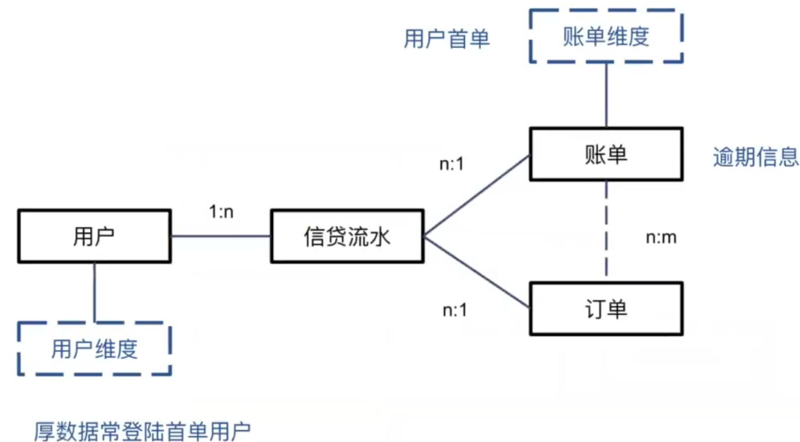

# 特征构造

## 【了解】今日课程介绍

- 知道未来信息的概念，及处理未来信息的方法
- 掌握从原始数据构造出新特征的方法
- 掌握特征变换的方法
- 掌握缺失值处理的方法


## 【理解】数据准备

### 风控建模特征数据


* 数据来源


* 人行征信数据


查询原因包括：贷款审批、贷后管理、信用卡审批、担保资格审查、司法调查、公积金提、取复核查询、融资审批、额度审批、个人查询等。


### 梳理数据的内在逻辑

**关系种类**

一对一：一个用户有一个注册手机号

一对多：一个用户多笔借款

多对多：一个用户可以登录多个设备，一个设备可以有多个用户登录

- 举例

  下图中，蓝色框为二月当期账单，红色框为订单


- 任务：分析厚数据常登陆首单用户的逾期情况

  

  - 可以将表结构展示到特征文档当中，说明取数逻辑

  

### 样本设计和特征框架

- **定义观察期样本**

  - 确定观察期（定X时间切面）和表现期（定Y的标签）

  - 确认样本数目是否合理

- **数据EDA（探索性数据分析）**

  - 看数据总体分布
    - data.shape
    - data.isnull()
    - data.info()
    - data.describe()
  - 看好坏样本分布差异
    - data[data[label]==0].describe()  好用户
    - data[data[label]==1].describe()  坏用户
  - 看单个数据
    - data.sample(n=10,random_state=1)

- 梳理特征框架

  - RFM生成新特征

  **举例 行为评分卡中的用户账单还款特征**

  - 用户账单关键信息：时间，金额，还款，额度

  

- 小结：在构建特征前，要完成

  - 类ER图（后端就有，不用单独准备）
  - 样本设计表
  - 特征框架表
    - 数据EDA和咋们关联比较大
    - 其他的关联没有那么大


## 【理解】特征构造

### 静态信息特征和时间截面特征

- 用户静态信息特征

  - 用户的基本信息（半年内不会变化）

- 用户时间截面特征

  - **未来信息**当前时间截面之后的数据

  - 时间截面数据在取数的时候要小心，**避免使用未来信息**

  - 产生**未来信息**最直接的原因：缺少快照表

    - 快照表，每天照个相片 23:00点  把当天的数据 备份一份 

      - 快照表只会保存当天最终的状态

      日志表，每一次操作都记一次, 不会update，只有insert  操作一次记录一次

      - 每一次操作都会记录下来

  - 金融相关数据原则上都需要快照表记录所有痕迹（额度变化情况，多次申请的通过和拒绝情况...）

  - 缺少快照表的可能原因

    - 快照表消耗资源比较大，为了性能不做
    - 原有数据表设计人员疏忽，没做
    - 借用其他业务数据（如电商）做信贷

  - 举例

    首次借贷        二次借贷      爬虫授权     三次借贷

    ——————————————————————→

    | 用户 | 借款 | 授权爬虫 | 逾期 |
    | ---- | ---- | -------- | ---- |
    | u1   | l11  | N        | 0    |
    | u1   | l12  | N        | 0    |
    | u1   | l13  | Y        | 0    |
    | u2   | l21  | N        | 0    |
    | u2   | l22  | N        | 0    |
    | u2   | l23  | Y        | 1    |
    | u3   | l11  | N        | 0    |
    | u3   | l12  | N        | 0    |
    | u3   | l13  | Y        | 0    |

    实际存储

    | 用户 | 授权 |
    | ---- | ---- |
    | u1   | Y    |
    | u2   | Y    |
    | u3   | Y    |

    | 用户 | 借款 | 逾期 |
    | ---- | ---- | ---- |
    | u1   | l11  | 0    |
    | u1   | l12  | 0    |
    | u1   | l13  | 0    |
    | u2   | l21  | 0    |
    | u2   | l22  | 0    |
    | u2   | l23  | 1    |
    | u3   | l11  | 0    |
    | u3   | l12  | 0    |
    | u3   | l13  | 0    |

    **join 结果**

    | 用户 | 借款 | 授权爬虫 | 逾期 |
    | ---- | ---- | -------- | ---- |
    | u1   | l11  | Y        | 0    |
    | u1   | l12  | Y        | 0    |
    | u1   | l13  | Y        | 0    |
    | u2   | l21  | Y        | 0    |
    | u2   | l22  | Y        | 0    |
    | u2   | l23  | Y        | 1    |
    | u3   | l11  | Y        | 0    |
    | u3   | l12  | Y        | 0    |
    | u3   | l13  | Y        | 0    |

    解决方案：加入快照的存储

    | 用户 | 授权 | 时间 |
    | ---- | ---- | ---- |
    | u1   | Y    | t3   |
    | u2   | Y    | t3   |
    | u3   | Y    | t3   |

小结：时间截面数据需要避免使用未来信息的数据。

未来信息：也就是在时间截面之后的数据。


### 时间序列特征

#### 用户时间序列特征

- 从观察点往前回溯一段时间的数据


#### 时间序列特征衍生

- 特征聚合：将单个特征的多个时间节点取值进行聚合。特征聚合是传统评分卡建模的主要特征构造方法。

  - 举例，计算每个用户的额度使用率，记为特征ft，按照时间轴以月份为切片展开
    - 申请前30天内的额度使用率ft1
    - 申请前30天至60天内的额度使用率ft2
    - 申请前60天至90天内的额度使用率ft3
    - 申请前330天至360天内的额度使用率ft12
    - 得到一个用户的12个特征

  ```python
  import pandas as pd
  import numpy as np
  data = pd.read_excel('../data/textdata.xlsx')
  data.head()
  ```

  ><font color='red'>显示结果</font>
  >
  >|      | customer_id |  ft1 |   ft2 |  ft3 |  ft4 |  ft5 |  ft6 |  ft7 |  ft8 |  ft9 |  ... |  gt3 |  gt4 |  gt5 |  gt6 |  gt7 |  gt8 |  gt9 | gt10 | gt11 | gt12 |
  >| ---: | ----------: | ---: | ----: | ---: | ---: | ---: | ---: | ---: | ---: | ---: | ---: | ---: | ---: | ---: | ---: | ---: | ---: | ---: | ---: | ---: | ---: |
  >|    0 |         111 |    9 |  11.0 |   12 |   13 |   18 |   10 |   12 |  NaN |  NaN |  ... |   10 |    0 |   18 |   10 |   12 |  NaN |  NaN |  NaN |  NaN |  NaN |
  >|    1 |         112 |   11 | -11.0 |   10 |   10 |   13 |   13 |   10 |  NaN |  NaN |  ... |   10 |   10 |   13 |   13 |   10 |  NaN |  NaN |  NaN |  NaN |  NaN |
  >|    2 |         113 |    0 |  11.0 |   10 |   12 |    6 |   10 |    0 | 25.0 | 10.0 |  ... |   10 |   12 |    6 |   10 |    0 | 25.0 | 10.0 |  NaN |  NaN |  NaN |
  >|    3 |         114 |   -7 |  -1.0 |    9 |    8 |    7 |    0 |  -19 | 10.0 | 11.0 |  ... |   10 |   10 |   12 |    0 |  -19 | 10.0 | 11.0 |  NaN |  NaN |  NaN |
  >|    4 |         115 |   11 |   NaN |    6 |   10 |    0 |   17 |   19 | 10.0 | 30.0 |  ... |    6 |   10 |    0 |   17 |   19 | 10.0 | 30.0 | 15.0 |  NaN |  NaN |
  >
  >5 rows × 26 columns

  - 可以根据这个时间序列进行基于经验的人工特征衍生，例如计算最近P个月特征大于0的月份数

  ```python
  #最近p个月，ft>0的月份数
  def Num(ft,p):  #ft 特征名字 p特征大于0的月份数
      df=data.loc[:,ft+'1':ft+str(p)]
      auto_value=np.where(df>0,1,0).sum(axis=1)
      return ft+'_num'+str(p),auto_value
  ```

  - 计算最近P个月特征ft等于0的月份数

  ```python
  #最近p个月，ft=0的月份数
  def zero_cnt(ft,p):
      df=data.loc[:,ft+'1':ft+str(p)]
      auto_value=np.where(df==0,1,0).sum(axis=1)
      return ft+'_zero_cnt'+str(p),auto_value
  ```

  - 计算近p个月特征ft大于0的月份数是否大于等于1

  ```python
  #最近p个月，ft>0的月份数是否>=1     
  def Evr(ft,p):
      df=data.loc[:,ft+'1':ft+str(p)]
      arr=np.where(df>0,1,0).sum(axis=1)
      auto_value = np.where(arr,1,0)
      return ft+'_evr'+str(p),auto_value
  ```

  - 计算最近p个月特征ft的均值

  ```python
  #最近p个月，ft均值
  def Avg(ft,p):
      df=data.loc[:,ft+'1':ft+str(p)]
      auto_value=np.nanmean(df,axis = 1 )
      return ft+'_avg'+str(p),auto_value
  ```

  -  计算最近p个月特征ft的和，最大值，最小值

  ```python
  #最近p个月，ft和
  def Tot(ft,p):
      df=data.loc[:,ft+'1':ft+str(p)]
      auto_value=np.nansum(df,axis = 1)
      return ft+'_tot'+str(p),auto_value
  
  #最近(2,p+1)个月，ft和
  def Tot2T(ft,p):
      df=data.loc[:,ft+'2':ft+str(p+1)]
      auto_value=df.sum(1)
      return ft+'_tot2t'+str(p),auto_value
  
  #最近p个月，ft最大值
  def Max(ft,p):
      df=data.loc[:,ft+'1':ft+str(p)]
      auto_value=np.nanmax(df,axis = 1)
      return ft+'_max'+str(p),auto_value
  
  #最近p个月，ft最小值
  def Min(ft,p):
      df=data.loc[:,ft+'1':ft+str(p)]
      auto_value=np.nanmin(df,axis = 1)
      return ft+'_min'+str(p),auto_value
  ```

  - 其余衍生方法

  ```python
  #最近p个月，最近一次ft>0到现在的月份数
  def Msg(ft,p):
      df=data.loc[:,ft+'1':ft+str(p)]
      df_value=np.where(df>0,1,0)
      auto_value=[]
      for i in range(len(df_value)):
          row_value=df_value[i,:]
          if row_value.max()<=0:
              indexs='0'
              auto_value.append(indexs)
          else:
              indexs=1
              for j in row_value:
                  if j>0:
                      break
                  indexs+=1
              auto_value.append(indexs)
      return ft+'_msg'+str(p),auto_value
   
  
  #最近p个月，最近一次ft=0到现在的月份数
  def Msz(ft,p):
      df=data.loc[:,ft+'1':ft+str(p)]
      df_value=np.where(df==0,1,0)
      auto_value=[]
      for i in range(len(df_value)):
          row_value=df_value[i,:]
          if row_value.max()<=0:
              indexs='0'
              auto_value.append(indexs)
          else:
              indexs=1
              for j in row_value:
                  if j>0:
                      break
                  indexs+=1
              auto_value.append(indexs)
      return ft+'_msz'+str(p),auto_value   
      
  #当月ft/(最近p个月ft的均值)
  def Cav(ft,p):
      df=data.loc[:,ft+'1':ft+str(p)]
      auto_value = df[ft+'1']/np.nanmean(df,axis = 1 ) 
      return ft+'_cav'+str(p),auto_value 
  
  #当月ft/(最近p个月ft的最小值)
  def Cmn(ft,p):
      df=data.loc[:,ft+'1':ft+str(p)]
      auto_value = df[ft+'1']/np.nanmin(df,axis = 1 ) 
      return ft+'_cmn'+str(p),auto_value 
  
  #最近p个月，每两个月间的ft的增长量的最大值
  def Mai(ft,p):
      arr=np.array(data.loc[:,ft+'1':ft+str(p)])     
      auto_value = []
      for i in range(len(arr)):
          df_value = arr[i,:]
          value_lst = []
          for k in range(len(df_value)-1):
              minus = df_value[k] - df_value[k+1]
              value_lst.append(minus)
          auto_value.append(np.nanmax(value_lst))     
      return ft+'_mai'+str(p),auto_value 
  
  #最近p个月，每两个月间的ft的减少量的最大值
  def Mad(ft,p):
      arr=np.array(data.loc[:,ft+'1':ft+str(p)])      
      auto_value = []
      for i in range(len(arr)):
          df_value = arr[i,:]
          value_lst = []
          for k in range(len(df_value)-1):
              minus = df_value[k+1] - df_value[k]
              value_lst.append(minus)
          auto_value.append(np.nanmax(value_lst))     
      return ft+'_mad'+str(p),auto_value 
  
  #最近p个月，ft的标准差
  def Std(ft,p):
      df=data.loc[:,ft+'1':ft+str(p)]
      auto_value=np.nanvar(df,axis = 1)
      return ft+'_std'+str(p),auto_value 
      
  #最近p个月，ft的变异系数
  def Cva(ft,p):
      df=data.loc[:,ft+'1':ft+str(p)]
      auto_value=np.nanvar(df,axis = 1)/(np.nanmean(df,axis = 1 )+1e-10)
      return ft+'_cva'+str(p),auto_value 
  
  #(当月ft) - (最近p个月ft的均值)
  def Cmm(ft,p):
      df=data.loc[:,ft+'1':ft+str(p)]
      auto_value = df[ft+'1'] - np.nanmean(df,axis = 1 ) 
      return ft+'_cmm'+str(p),auto_value 
  
  #(当月ft) - (最近p个月ft的最小值)
  def Cnm(ft,p):
      df=data.loc[:,ft+'1':ft+str(p)]
      auto_value = df[ft+'1'] - np.nanmin(df,axis = 1 ) 
      return ft+'_cnm'+str(p),auto_value 
  
  #(当月ft) - (最近p个月ft的最大值)
  def Cxm(ft,p):
      df=data.loc[:,ft+'1':ft+str(p)]
      auto_value = df[ft+'1'] - np.nanmax(df,axis = 1 ) 
      return ft+'_cxm'+str(p),auto_value 
  
  
  #（ (当月ft) - (最近p个月ft的最大值) ） / (最近p个月ft的最大值) ）
  def Cxp(ft,p):
      df=data.loc[:,ft+'1':ft+str(p)]
      temp = np.nanmax(df,axis = 1 )
      auto_value = (df[ft+'1'] - temp )/ temp
      return ft+'_cxp'+str(p),auto_value 
  
  #最近p个月，ft的极差
  def Ran(ft,p):
      df=data.loc[:,ft+'1':ft+str(p)]
      auto_value = np.nanmax(df,axis = 1 )  -  np.nanmin(df,axis = 1 ) 
      return ft+'_ran'+str(p),auto_value 
  
  #最近p个月中，特征ft的值，后一个月相比于前一个月增长了的月份数
  def Nci(ft,p):
      arr=np.array(data.loc[:,ft+'1':ft+str(p)])     
      auto_value = []
      for i in range(len(arr)):
          df_value = arr[i,:]
          value_lst = []
          for k in range(len(df_value)-1):
              minus = df_value[k] - df_value[k+1]
              value_lst.append(minus)           
          value_ng = np.where(np.array(value_lst)>0,1,0).sum()
          auto_value.append(np.nanmax(value_ng))     
      return ft+'_nci'+str(p),auto_value 
  
  #最近p个月中，特征ft的值，后一个月相比于前一个月减少了的月份数
  def Ncd(ft,p):
      arr=np.array(data.loc[:,ft+'1':ft+str(p)])     
      auto_value = []
      for i in range(len(arr)):
          df_value = arr[i,:]
          value_lst = []
          for k in range(len(df_value)-1):
              minus = df_value[k] - df_value[k+1]
              value_lst.append(minus)           
          value_ng = np.where(np.array(value_lst)<0,1,0).sum()
          auto_value.append(np.nanmax(value_ng))     
      return ft+'_ncd'+str(p),auto_value    
  
  #最近p个月中，相邻月份ft 相等的月份数
  def Ncn(ft,p):
      arr=np.array(data.loc[:,ft+'1':ft+str(p)])     
      auto_value = []
      for i in range(len(arr)):
          df_value = arr[i,:]
          value_lst = []
          for k in range(len(df_value)-1):
              minus = df_value[k] - df_value[k+1]
              value_lst.append(minus)           
          value_ng = np.where(np.array(value_lst)==0,1,0).sum()
          auto_value.append(np.nanmax(value_ng))     
      return ft+'_ncn'+str(p),auto_value    
   
  #最近P个月中，特征ft的值是否按月份严格递增，是返回1，否返回0
  def Bup(ft,p):
      arr=np.array(data.loc[:,ft+'1':ft+str(p)])     
      auto_value = []
      for i in range(len(arr)):
          df_value = arr[i,:]
          value_lst = []
          index = 0
          for k in range(len(df_value)-1):
              if df_value[k] > df_value[k+1]:
                  break
              index =+ 1
          if index == p:            
              value= 1    
          else:
              value = 0
          auto_value.append(value)     
      return ft+'_bup'+str(p),auto_value   
  
  #最近P个月中，特征ft的值是否按月份严格递减，是返回1，否返回0
  def Pdn(ft,p):
      arr=np.array(data.loc[:,ft+'1':ft+str(p)])     
      auto_value = []
      for i in range(len(arr)):
          df_value = arr[i,:]
          value_lst = []
          index = 0
          for k in range(len(df_value)-1):
              if df_value[k+1] > df_value[k]:
                  break
              index =+ 1
          if index == p:            
              value= 1    
          else:
              value = 0
          auto_value.append(value)     
      return ft+'_pdn'+str(p),auto_value            
  
  #最近P个月中，ft的切尾均值，这里去掉了数据中的最大值和最小值
  def Trm(ft,p):
      df=data.loc[:,ft+'1':ft+str(p)]
      auto_value = []
      for i in range(len(df)):
          trm_mean = list(df.loc[i,:])
          trm_mean.remove(np.nanmax(trm_mean))
          trm_mean.remove(np.nanmin(trm_mean))
          temp=np.nanmean(trm_mean) 
          auto_value.append(temp)
      return ft+'_trm'+str(p),auto_value 
  
  #当月ft / 最近p个月的ft中的最大值
  def Cmx(ft,p):
      df=data.loc[:,ft+'1':ft+str(p)]
      auto_value = (df[ft+'1'] - np.nanmax(df,axis = 1 )) /np.nanmax(df,axis = 1 ) 
      return ft+'_cmx'+str(p),auto_value 
  
  #( 当月ft - 最近p个月的ft均值 ) / ft均值
  def Cmp(ft,p):
      df=data.loc[:,ft+'1':ft+str(p)]
      auto_value = (df[ft+'1'] - np.nanmean(df,axis = 1 )) /np.nanmean(df,axis = 1 ) 
      return ft+'_cmp'+str(p),auto_value 
  
  #( 当月ft - 最近p个月的ft最小值 ) /ft最小值 
  def Cnp(ft,p):
      df=data.loc[:,ft+'1':ft+str(p)]
      auto_value = (df[ft+'1'] - np.nanmin(df,axis = 1 )) /np.nanmin(df,axis = 1 ) 
      return ft+'_cnp'+str(p),auto_value 
  
  #最近p个月取最大值的月份距现在的月份数
  def Msx(ft,p):
      df=data.loc[:,ft+'1':ft+str(p)]
      df['_max'] = np.nanmax(df,axis = 1)
      for i in range(1,p+1):
          df[ft+str(i)] = list(df[ft+str(i)] == df['_max'])
      del df['_max']
      df_value = np.where(df==True,1,0)
      auto_value=[]
      for i in range(len(df_value)):
          row_value=df_value[i,:]
          indexs=1
          for j in row_value:
              if j == 1:
                  break
              indexs+=1
          auto_value.append(indexs)
      return ft+'_msx'+str(p),auto_value
  
  #最近p个月的均值/((p,2p)个月的ft均值)
  def Rpp(ft,p):
      df1=data.loc[:,ft+'1':ft+str(p)]
      value1=np.nanmean(df1,axis = 1 )
      df2=data.loc[:,ft+str(p):ft+str(2*p)]
      value2=np.nanmean(df2,axis = 1 )   
      auto_value = value1/value2
      return ft+'_rpp'+str(p),auto_value    
  
  #最近p个月的均值 - ((p,2p)个月的ft均值)
  def Dpp(ft,p):
      df1=data.loc[:,ft+'1':ft+str(p)]
      value1=np.nanmean(df1,axis = 1 )
      df2=data.loc[:,ft+str(p):ft+str(2*p)]
      value2=np.nanmean(df2,axis = 1 )   
      auto_value = value1 - value2
      return ft+'_dpp'+str(p),auto_value   
  
  #(最近p个月的ft最大值)/ (最近(p,2p)个月的ft最大值)
  def Mpp(ft,p):
      df1=data.loc[:,ft+'1':ft+str(p)]
      value1=np.nanmax(df1,axis = 1 )
      df2=data.loc[:,ft+str(p):ft+str(2*p)]
      value2=np.nanmax(df2,axis = 1 )   
      auto_value = value1/value2
      return ft+'_mpp'+str(p),auto_value  
    
  #(最近p个月的ft最小值)/ (最近(p,2p)个月的ft最小值)
  def Npp(ft,p):
      df1=data.loc[:,ft+'1':ft+str(p)]
      value1=np.nanmin(df1,axis = 1 )
      df2=data.loc[:,ft+str(p):ft+str(2*p)]
      value2=np.nanmin(df2,axis = 1 )   
      auto_value = value1/value2
      return ft+'_npp'+str(p),auto_value  
  ```

  - 将上面衍生的方法封装成函数

  ```python
  #定义批量调用双参数的函数        
  def auto_var2(feature,p):
      #global data_new
      try:
          columns_name,values=Num(feature,p)
          data_new[columns_name]=values
      except:
             print("Num PARSE ERROR",feature,p)
      try:
          columns_name,values=Evr(feature,p)
          data_new[columns_name]=values
      except:
             print("Evr PARSE ERROR",feature,p)
      try:
          columns_name,values=Avg(feature,p)
          data_new[columns_name]=values
      except:
             print("Avg PARSE ERROR",feature,p)
      try:
          columns_name,values=Tot(feature,p)
          data_new[columns_name]=values
      except:
          print("Tot PARSE ERROR",feature,p) 
      try:
          columns_name,values=Tot2T(feature,p)
          data_new[columns_name]=values
      except:
          print("Tot2T PARSE ERROR",feature,p)        
      try:
          columns_name,values=Max(feature,p)
          data_new[columns_name]=values
      except:
          print("Tot PARSE ERROR",feature,p)
      try:
          columns_name,values=Max(feature,p)
          data_new[columns_name]=values
      except:
          print("Max PARSE ERROR",feature,p)
      try:
          columns_name,values=Min(feature,p)
          data_new[columns_name]=values
      except:
          print("Min PARSE ERROR",feature,p)
      try:
          columns_name,values=Msg(feature,p)
          data_new[columns_name]=values
      except:
          print("Msg PARSE ERROR",feature,p)
      try:
          columns_name,values=Msz(feature,p)
          data_new[columns_name]=values
      except:
          print("Msz PARSE ERROR",feature,p)
      try:
          columns_name,values=Cav(feature,p)
          data_new[columns_name]=values
      except:
          print("Cav PARSE ERROR",feature,p)
      try:
          columns_name,values=Cmn(feature,p)
          data_new[columns_name]=values
      except:
          print("Cmn PARSE ERROR",feature,p)        
      try:
          columns_name,values=Std(feature,p)
          data_new[columns_name]=values
      except:
          print("Std PARSE ERROR",feature,p)   
      try:
          columns_name,values=Cva(feature,p)
          data_new[columns_name]=values
      except:
          print("Cva PARSE ERROR",feature,p)   
      try:
          columns_name,values=Cmm(feature,p)
          data_new[columns_name]=values
      except:
          print("Cmm PARSE ERROR",feature,p)  
      try:
          columns_name,values=Cnm(feature,p)
          data_new[columns_name]=values
      except:
          print("Cnm PARSE ERROR",feature,p)         
      try:
          columns_name,values=Cxm(feature,p)
          data_new[columns_name]=values
      except:
          print("Cxm PARSE ERROR",feature,p)          
      try:
          columns_name,values=Cxp(feature,p)
          data_new[columns_name]=values
      except:
          print("Cxp PARSE ERROR",feature,p)
      try:
          columns_name,values=Ran(feature,p)
          data_new[columns_name]=values
      except:
          print("Ran PARSE ERROR",feature,p)
      try:
          columns_name,values=Nci(feature,p)
          data_new[columns_name]=values
      except:
          print("Nci PARSE ERROR",feature,p)
      try:
          columns_name,values=Ncd(feature,p)
          data_new[columns_name]=values
      except:
          print("Ncd PARSE ERROR",feature,p)
      try:
          columns_name,values=Ncn(feature,p)
          data_new[columns_name]=values
      except:
          print("Ncn PARSE ERROR",feature,p)
      try:
          columns_name,values=Pdn(feature,p)
          data_new[columns_name]=values
      except:
          print("Pdn PARSE ERROR",feature,p) 
      try:
          columns_name,values=Cmx(feature,p)
          data_new[columns_name]=values
      except:
          print("Cmx PARSE ERROR",feature,p)         
      try:
          columns_name,values=Cmp(feature,p)
          data_new[columns_name]=values
      except:
          print("Cmp PARSE ERROR",feature,p)   
      try:
          columns_name,values=Cnp(feature,p)
          data_new[columns_name]=values
      except:
          print("Cnp PARSE ERROR",feature,p) 
      try:
          columns_name,values=Msx(feature,p)
          data_new[columns_name]=values
      except:
          print("Msx PARSE ERROR",feature,p)
      try:
          columns_name,values=Nci(feature,p)
          data_new[columns_name]=values
      except:
          print("Nci PARSE ERROR",feature,p)
      try:
          columns_name,values=Trm(feature,p)
          data_new[columns_name]=values
      except:
          print("Trm PARSE ERROR",feature,p)
      try:
          columns_name,values=Bup(feature,p)
          data_new[columns_name]=values
      except:
          print("Bup PARSE ERROR",feature,p)
      try:
          columns_name,values=Mai(feature,p)
          data_new[columns_name]=values
      except:
          print("Mai PARSE ERROR",feature,p)
      try:
          columns_name,values=Mad(feature,p)
          data_new[columns_name]=values
      except:
          print("Mad PARSE ERROR",feature,p)
      try:
          columns_name,values=Rpp(feature,p)
          data_new[columns_name]=values
      except:
          print("Rpp PARSE ERROR",feature,p)
      try:
          columns_name,values=Dpp(feature,p)
          data_new[columns_name]=values
      except:
          print("Dpp PARSE ERROR",feature,p)
      try:
          columns_name,values=Mpp(feature,p)
          data_new[columns_name]=values
      except:
          print("Mpp PARSE ERROR",feature,p)
      try:
          columns_name,values=Npp(feature,p)
          data_new[columns_name]=values
      except:
          print("Npp PARSE ERROR",feature,p)
      return data_new.columns.size
  ```

  - 对之前数据应用封装的函数

  ```python
  data_new = pd.DataFrame()
  for p in range(1, 12):  
      for inv in ['ft', 'gt']:  
          auto_var2(inv, p)  
  ```

  ```python
  data_new.columns.tolist()
  ```

  ><font color='red'>显示结果</font>
  >
  >```shell
  >array(['ft_num1', 'ft_evr1', 'ft_avg1', 'ft_tot1', 'ft_tot2t1', 'ft_max1',
  >       'ft_min1', 'ft_msg1', 'ft_msz1', 'ft_cav1', 'ft_cmn1', 'ft_std1',
  >       'ft_cva1', 'ft_cmm1', 'ft_cnm1', 'ft_cxm1', 'ft_cxp1', 'ft_ran1',
  >       'ft_nci1', 'ft_ncd1', 'ft_ncn1', 'ft_pdn1', 'ft_cmx1', 'ft_cmp1',
  >       'ft_cnp1', 'ft_msx1', 'ft_bup1', 'ft_rpp1', 'ft_dpp1', 'ft_mpp1',
  >       'ft_npp1', 'gt_num1', 'gt_evr1', 'gt_avg1', 'gt_tot1', 'gt_tot2t1',
  >       'gt_max1', 'gt_min1', 'gt_msg1', 'gt_msz1', 'gt_cav1', 'gt_cmn1',
  >       'gt_std1', 'gt_cva1', 'gt_cmm1', 'gt_cnm1', 'gt_cxm1', 'gt_cxp1',
  >       ........])
  >```

  - 上面这种无差别聚合方法进行聚合得到的结果，通常具有较高的共线性，但信息量并无明显增加，影响模型的鲁棒性和稳定性。
  - 评分卡模型对模型的稳定性要求远高于其性能
    - 在时间窗口为1年的场景下，p值会通过先验知识，人为选择3、6、12等，而不是遍历全部取值1～12
    - 在后续特征筛选时，会根据变量的显著性、共线性等指标进行进一步筛选

- 最近一次（current） 和历史 （history）做对比

  - current/history
  - current-history


小结：

~~~shell
#特征衍生方式
数值型：各种聚合
类别型：统计
最近数据和历史数据做对比
~~~


#### 用户时间序列缺失值处理

- 用户时间序列缺失值处理

  - 优先考虑补零：大多数特征都是计数，缺失用0补充

  - 用户没有历史购物记录:  max_gmv min_gmv 都可以用0补充

  - 用0填充缺失值带来的问题

    - cur/history_avg: 0/0       cur/history_avg:1/0

  - 根据风险趋势填补缺失值 （违约概率大小 无历史购物记录违约概率>有一单历史购物记录>有两单）

    用户没有历史购物记录        cur/history_avg : 0/0?     可以填充-2                   

    用户有一单历史购物记录    cur/history_avg : 1/0?     可以填充-1                      

    用户有两单历史购物记录     cur/history_avg : 1/1      可以计算出>0的值 

- 用户最后一次逾期距今天数，如果是白户如何填补缺失值？

- 如果缺失值比较多的时候，考虑单独做成特征

  - 举例：用户授权GPS序列特征  gps_count_last_3month
  - 缺失意味着用户未授权GPS权限

- 缺失有明显业务含义，可以填补业务默认值

  - 授信额度（用初始额度）

- 缺失值处理小结

  | 缺失值         | 处理                     |
  | -------------- | ------------------------ |
  | 一般计数类特征 | 优先考虑用0填充          |
  | 有风险趋势     | 按风险趋势填补           |
  | 缺失数值过多   | 考虑新增是否缺失的特征列 |
  | 有业务含义     | 填补业务默认值           |


#### 时间序列数据的未来信息


- 以借贷2发生的时间为观测点，下表中的未来信息会把大量退货行为的用户认为是坏客户，但上线后效果会变差


- 特征构建时的补救方法

  - 对未来信息窗口外的订单计算有效单的特征 net order,NMV
    - NMV:Net Merchandise Value（商品净值）
  - 对未来信息窗口内订单只计算一般特征 order,GMV
    - GMV:Gross Merchandise Volume（商品交易总值）

- 历史信贷特征也非常容易出现未来信息

  - 举例：

    信用卡 每月1日为账单日，每月10日为还款日，次月10日左右为M1

  

  - 在上图所示的截面时间（如3月5日）是看不到2月账单的逾期DPD30的情况的
  - 但如果数据库没有快照表会导致我们可以拿到2月账单的DPD30情况
  - 解决方案跟上面例子一样，分区间讨论，可以把账单分成3类
    - 当前未出账账单
    - 最后一个已出账账单
    - 其他已出账账单 （只有这个特征可以构建逾期类特征）

- 未来信息处理小结

  - 及时增加快照表
  - 没有快照表的情况下，将数据区分为是否有未来信息的区间，分别进行特征构造


### 特征变换

上面构建的新特征，一般不会直接使用，而是要做一些其他的操作。

#### 分箱（离散化）

- 概念

  - 特征构造的过程中，对特征做分箱处理时必不可少的过程
  - 分箱就是将连续变量离散化，合并成较少的状态

- 分箱的作用

  - 离散特征的增加和减少都很容易，易于模型的快速迭代
  - 稀疏向量内积乘法运算速度快，计算结果方便存储，容易扩展
  - **分箱（离散化）后的特征对异常数据有很强的鲁棒性**
  - **单变量分箱（离散化）为N个后，每个变量有单独的权重，相当于为模型引入了非线性，能够提升模型表达能力**
  - 分箱（离散化）后可以进行特征交叉，由M+N个变量变为M*N个变量，进一步引入非线性，提升表达能
  - **分箱（离散化）后，模型会更稳定，如对年龄离散化，20-30为一个区间，不会因为年龄+1就变成一个新的特征**
  - 特征离散化以后，可以将缺失作为独立的一类带入模型

- 怎么离散化（分箱）比较好

  - 等频？等距？还是其他
  - 分成几箱？10箱？100箱...
  - 分箱时缺失值怎么办

- 常用分箱方法：卡方分箱、决策树分箱、等频分箱、聚类分箱

  

  - 等频分箱：

    

    - 按数据的分布，均匀切分，每个箱体里的样本数基本一样
    - 在样本少的时候泛化性较差
    - 在样本不均衡时可能无法分箱

  - 等距分箱：

    

    - 按数据的特征值的间距均匀切分，每个箱体的数值距离一样
    - 一定可以分箱
    - 无法保证箱体样本数均匀

- **卡方分箱**：使用卡方检验确定最优分箱阈值

  - 将数据按等频或等距分箱后，计算卡方值，将卡方值较小的两个相邻箱体合并

    使得不同箱体的好坏样本比例区别放大，容易获得高IV

  - 卡方分箱是利用独立性检验来挑选箱划分节点的阈值。卡方分箱的过程可以拆分为初始化和合并两步

    - 初始化：根据连续变量值大小进行排序，构建最初的离散化

    - 合并：**遍历相邻两项合并的卡方值，将卡方值最小的两组合并，不断重复直到满足分箱数目要求**

  

  |             | [22-35]       | (35-45]     | (45-55]     | (55-65]       | 总计 |
  | ----------- | ------------- | ----------- | ----------- | ------------- | ---- |
  | good        | 3             | 2           | 2           | 1             | 8    |
  | bad         | 1             | 2           | 2           | 3             | 8    |
  | p           |               |             |             |               | 50%  |
  | p(good+bad) | 2             | 2           | 2           | 2             | -    |
  | chi2        | (1-2)^2/2=1/2 | (2-2)^2/2=0 | (2-2)^2/2=0 | (3-2)^2/2=1/2 | -    |

  $$
  \rm{\overline{p}_{bad} = \frac{\sum_{k}n^k_{bad}}{\sum_{k}(n^k_{good}+n^k_{bad})}} \\
  \rm{\chi_{k}^{2}=\frac{(n^k_{bad}-\overline{p}_{bad}(n^k_{good}+n^k_{bad}))^2}{\overline{p}_{bad}(n^k_{good}+n^k_{bad})}}
  $$

  合并坏人比例接近平均水平的箱体，留下比例差异大的箱体

#### 案例：使用toad库进行分箱处理


数据集使用germancredit

  - Toad 是专为工业界模型开发设计的Python工具包，特别针对评分卡的开发
  - Toad 的功能覆盖了建模全流程，从EDA、特征工程、特征筛选到模型验证和评分卡转化
  - Toad 的主要功能极大简化了建模中最重要最费时的流程，即特征筛选和分箱。

第一次使用toad，需要安装：

~~~shell
pip install toad==0.1.0 -i https://pypi.tuna.tsinghua.edu.cn/simple/
~~~

官网链接：https://toad.readthedocs.io/en/stable/

案例代码实现：

```python
import pandas as pd
import numpy as np
import toad

data = pd.read_csv('../data/germancredit.csv')
data.replace({'good':0,'bad':1},inplace=True)

print(data.shape) # 1000 data and 20 features 
data.head()
```

><font color='red'>显示结果</font>
>
>```
>(1000, 21)
>```
>
>|      | status.of.existing.checking.account | duration.in.month |                                    credit.history |             purpose | credit.amount |   savings.account.and.bonds | present.employment.since | installment.rate.in.percentage.of.disposable.income |             personal.status.and.sex | other.debtors.or.guarantors |  ... |                                          property | age.in.years | other.installment.plans |  housing | number.of.existing.credits.at.this.bank |                         job | number.of.people.being.liable.to.provide.maintenance.for |                                telephone | foreign.worker | creditability |
>| ---: | ----------------------------------: | ----------------: | ------------------------------------------------: | ------------------: | ------------: | --------------------------: | -----------------------: | --------------------------------------------------: | ----------------------------------: | --------------------------: | ---: | ------------------------------------------------: | -----------: | ----------------------: | -------: | --------------------------------------: | --------------------------: | -------------------------------------------------------: | ---------------------------------------: | -------------: | ------------: |
>|    0 |                          ... < 0 DM |                 6 | critical account/ other credits existing (not ... |    radio/television |          1169 | unknown/ no savings account |           ... >= 7 years |                                                   4 |                       male : single |                        none |  ... |                                       real estate |           67 |                    none |      own |                                       2 | skilled employee / official |                                                        1 | yes, registered under the customers name |            yes |             0 |
>|    1 |                   0 <= ... < 200 DM |                48 |          existing credits paid back duly till now |    radio/television |          5951 |                ... < 100 DM |       1 <= ... < 4 years |                                                   2 | female : divorced/separated/married |                        none |  ... |                                       real estate |           22 |                    none |      own |                                       1 | skilled employee / official |                                                        1 |                                     none |            yes |             1 |
>|    2 |                 no checking account |                12 | critical account/ other credits existing (not ... |           education |          2096 |                ... < 100 DM |       4 <= ... < 7 years |                                                   2 |                       male : single |                        none |  ... |                                       real estate |           49 |                    none |      own |                                       1 |        unskilled - resident |                                                        2 |                                     none |            yes |             0 |
>|    3 |                          ... < 0 DM |                42 |          existing credits paid back duly till now | furniture/equipment |          7882 |                ... < 100 DM |       4 <= ... < 7 years |                                                   2 |                       male : single |                   guarantor |  ... | building society savings agreement/ life insur... |           45 |                    none | for free |                                       1 | skilled employee / official |                                                        2 |                                     none |            yes |             0 |
>|    4 |                          ... < 0 DM |                24 |                   delay in paying off in the past |           car (new) |          4870 |                ... < 100 DM |       1 <= ... < 4 years |                                                   3 |                       male : single |                        none |  ... |                             unknown / no property |           53 |                    none | for free |                                       2 | skilled employee / official |                                                        2 |                                     none |            yes |             1 |
>
>5 rows × 21 columns

- 数据字段说明
  1. Status of existing checking account（现有支票帐户的存款状态）

  2. Duration in month（持续月数）
  3. Credit history（信用历史记录）
  4. Purpose（申请目的）
  5. Credit amount（信用保证金额）
  6. Savings account/bonds（储蓄账户/债券金额）
  7. Present employment since（当前就业年限）
  8. Installment rate in percentage of disposable income（可支配收入占比）
  9. Personal status and gender（个人婚姻状态及性别）
  10. Other debtors / guarantors（其他债务人或担保人）
  11. Present residence since（当前居民年限）
  12. Property（财产）
  13. Age in years（年龄）
  14. Other installment plans （其他分期付款计划）
  15. Housing（房屋状况）
  16. Number of existing credits at this bank（在该银行已有的信用卡数）
  17. Job（工作性质）
  18. Number of people being liable to provide maintenance for（可提供维护人数）
  19. Telephone（是否留存电话）
  20. foreign worker（是否外国工人）
  21. creditability 数据标签
- toad 中的combiner类用来进行分箱处理

```python
# 初始化一个combiner类
combiner = toad.transform.Combiner()

# 训练数据并指定分箱方法，其它参数可选  # min_samples: 每箱至少包含样本量，可以是数字或者占比
combiner.fit(data,y='creditability',method='chi',min_samples = 0.05)

# 以字典形式保存分箱结果
bins = combiner.export()
#查看分箱结果
print('duration.in.month:', bins['duration.in.month'])
```

><font color='red'>显示结果</font>
>
>```
>duration.in.month: [9, 12, 13, 16, 36, 45]
>```

- 通常使用双变量图（Bivar图 Bivariate graph）来评价分箱结果。注意，信贷风险分析中Bivar图，纵轴固定为负样本占比
- 使用bin_plot()画图对分箱进行调整

```python
import matplotlib.pyplot as plt
from toad.plot import bin_plot
#创建对象
c2 = toad.transform.Combiner()
#训练数据，并指定分箱方法
c2.fit(data[['duration.in.month','creditability']],y='creditability', method='chi',n_bins=7)  
#应用分箱结果，labels：是否将分箱结果转化成箱标签
transformed = c2.transform(data[['duration.in.month','creditability']],labels=True)
#传给bin_plot的数据必须是分箱转化之后的
bin_plot(transformed,x='duration.in.month',target='creditability')
```

><font color='red'>显示结果</font>
>
>```
><AxesSubplot:xlabel='duration.in.month', ylabel='prop'>
>```
>
>

- 上图中柱形图表示每一箱的占比，折线图表示每一箱的坏样本率。**一般折线图要呈现出单调的趋势。**
- 可以通过调整箱数实现单调趋势

```python
c2 = toad.transform.Combiner()
c2.fit(data[['duration.in.month','creditability']],
        y='creditability', method='chi',n_bins=5)  # 改成5箱
transformed = c2.transform(data[['duration.in.month','creditability']],labels=True)
#传给bin_plot的数据必须是分箱转化之后的
bin_plot(transformed,x='duration.in.month',target='creditability')
```

><font color='red'>显示结果</font>
>
>```
><AxesSubplot:xlabel='duration.in.month', ylabel='prop'>
>```
>
>

- 其它分箱方法：聚类分箱（k-means), 决策树分箱，等频分箱，等距分箱
- 各种分箱方法对比

```python
#分箱方式介绍
#chi：卡方分箱
#dt：决策树分箱
#quantile：等频分箱
#step：等距分箱
#kmeans：KMeans分箱

for method in ['chi', 'dt', 'quantile', 'step', 'kmeans']:  
    c2 = toad.transform.Combiner()  
    c2.fit(data[['duration.in.month','creditability']],
             y='creditability', method=method, n_bins=5)
    bin_plot(c2.transform(data[['duration.in.month','creditability']],labels=True),
                x='duration.in.month',target='creditability')
```

- 从单调性和模型稳定性角度考虑一般使用卡方分箱

- 多值无序类别特征需要做encoding处理，常见encoding方法：Onehot Encoding、Label Encoding、WOE Encoding

  - Onehot Encoding

  

  - Label Encoding

    婚姻状态        婚姻状态         统计出不同婚姻状态下的逾期率作为数值标签

    未婚                 dpd rate     

    已婚                 dpd rate

    离异                 dpd rate

    丧偶                 dpd rate

    缺点：数据量少的情况下，某些数据可能有偏差

  - WOE Encoding

    WOE（Weight of Evidence) 反映单特征在好坏用户区分度的度量，WOE编码是一种用于二分类问题的编码方法，通过计算每个类别的证据权重来表示其与目标变量之间的关系。

    优势：WOE越大，bad rate越高，也就是说，通过WOE变换，特征值不仅仅代表一个分类，还代表了这个分类的权重。WOE可以把相对于bad rate显现非线性的特征转换为线性的，且对波动不敏感。遇到异常数据亦能平稳表现。

    应用场景：该方法通常用于分类建模中的特征工程，特别是在信用风险评估、营销模型和欺诈检测等领域。该方法的目标是将分类变量转换为数值变量，以便在统计建模中使用。

    计算公式：

    $$WOE_k=ln(p^k_{good}/p^k_{bad})$$   好用户比例/坏用户比例

  | 婚姻状态 | Good | Bad  | G-B  | ln(G/B) | WOE    |
  | -------- | ---- | ---- | ---- | ------- | ------ |
  | 未婚     | 30%  | 20%  | 10%  | 0.405   | 0.405  |
  | 已婚     | 40%  | 10%  | 30%  | 1.386   | 1.386  |
  | 离异     | 10%  | 40%  | -30% | -1.386  | -1.386 |
  | 丧偶     | 20%  | 30%  | -10% | -0.405  | -0.405 |
  | 总计     | 100% | 100% |      |         |        |

  - 使用toad计算woe

  ```python
  from sklearn.model_selection import train_test_split
  X_train,X_test,Y_train,Y_test = train_test_split(data.drop('creditability',axis=1),data['creditability'],test_size=0.25,random_state=450)
  data_train = pd.concat([X_train,Y_train],axis=1)
  #增加一列区分训练/测试的特征
  data_train['type'] = 'train'
  data_test = pd.concat([X_test,Y_test],axis=1)
  data_test['type'] = 'test'
  #设置分箱边界，等价于fit
  adj_bin = {'duration.in.month': [9, 12, 18, 33]}
  
  c2 = toad.transform.Combiner()
  c2.set_rules(adj_bin)
  
  data_ = pd.concat([data_train,data_test],axis = 0)
  #分箱（可视化分箱功能，通过观察变量的单调性，帮助调整分箱节点）
  temp_data = c2.transform(data_[['duration.in.month','creditability','type']])
  
  #绘制badrate_plot图
  from toad.plot import badrate_plot, proportion_plot
  #by：需要观察的特征
  badrate_plot(temp_data, target = 'creditability', x = 'type', by = 'duration.in.month') 
  #绘制每一箱占比情况图
  proportion_plot(temp_data['duration.in.month'])
  ```

  ><font color='red'>显示结果</font>
  >
  >```
  ><AxesSubplot:xlabel='value', ylabel='proportion'>
  >```
  >
  >![img](data:image/png;base64,iVBORw0KGgoAAAANSUhEUgAAA1AAAAF2CAYAAABgcXkzAAAAOXRFWHRTb2Z0d2FyZQBNYXRwbG90bGliIHZlcnNpb24zLjMuMCwgaHR0cHM6Ly9tYXRwbG90bGliLm9yZy86wFpkAAAACXBIWXMAAAsTAAALEwEAmpwYAAA4/UlEQVR4nO3de5xsZ13n+8+qS9/3PZ0LicmOYB4UjHjkIiISHI1BxAsygMkcTkSIciKGcNE5IKBkBGGQRBguRu6eeB0vM6OYRNQEkBG5hAmD8nDA7ESSKDubEPbefauqtc4fVV1dVV3Vvbq7qqu6+/N+vfrVVatWrXo6yc5e336e3+9JsixDkiRJkrS+wrAHIEmSJEk7hQFKkiRJknIyQEmSJElSTgYoSZIkScrJACVJkiRJOZWGPYBNGAceB9wP1IY8FkmSJO1OReAc4JPA4pDHohGyEwPU44CPDnsQkiRJ2hOeDHxs2IPQ6NiJAep+gAcfPE2abu8eVkeOzHDixKlt/UxJkqS9bhj3YIVCwqFD09C495SWDTRAhRBeAFwDnAQujzEea3ntDcCzgW80Dj01xvj1HJetAaRptu0BavlzJUmStL2GeA9myYjaDCxAhRBmgVcAjwEuAd4CPLPllAPA82OMtw9qDJIkSZLUT4PswncpcHOMcR64BXhSCCFpef0A8PUBfr4kSZIk9dUgA9Q5NNaMxhhT4EHgSMvrB4D/HEL4xxDCLw9wHJIkSZLUF9vZRCIB0pbnLwe+Rr0t+W0hhNtijLk7nBw5MtPn4eUzO7tvKJ8rSZK0l3kPplExyAB1H/BEgBBCAThEfRYKgBjjF5YfhxBuBR7JBlpEnjhxatuLCWdn93H8+Mlt/UxJkqS9bhj3YIVCMrRf2Gu0DXIJ363ApSGEKeBp1PduujaE8JwQwqEQwo8DhBAOU6+X+vQAxyJJkiRJWzawABVjfAB4I/AJ4FXAy4CjwLnAPPCUEMIngTuAt8YY7xjUWCRJkrQzFYsJX3/wIYrFZP2TpW2QZNmO29foKHCXS/gkSZJ2t2IxYWHuNNe98s28+vUvZ2Jqmlpte+7/WpbwXQgc25YP1Y4wyCV8kiRJ0qYsh6errriWv7v9H7jqimtZmDvtTJSGbju78EmSJEkAZFlGrVZjaXGJpaVK43v9caGQcOaZB7n6yl/knmP3AnDPsXu56oprufGm67d1JkrqZICSJEnag9YKMM3HixWWlpaodDnW/rj+emWd15cfVxqfmaZp17G9/f1v5Ndf+4FmeFp2z7F7ue6Vb+a6N/8/kJS34x+TtIoBSpIkaQhGOcDkVSgWGBsbq3+NlxuPy4yN14+NT4wxs3+m7Vj3x2XKLceWllL+469e0zYDBXD+0XN59etfTqE05gyUhsYAJUmS9qTdEGCKxWIzgDS/j40xNj5GeazM+MQ4+w7MrA45LeeWm8Gn++ut1y+3HiuXKZaKffq30e1nS7jxpuu56opruefYvZx/9FyX72kkGKAkSdJQGGBGO8AMW62WMTE1zY03XT+ULnxSL7Yx3wDbmEuSdpO9EGDal5YZYHaiYjGhkNRIs+K2hifbmKsXZ6AkSRqSvRBgnIHRVtVqGYdnD/hLbI0MA5Qkac8ywBhgJGmjDFCSpKHJsoxqtdo1cCwHjLYQ0nas/fFKwOn2+nIIar1W/ftWl7IbYCRpbzFASdIethcCzMTEBPsP7DPASJL6wgAlSUNkgDHASJJ2FgOUpD3NAGOAkSRpIwxQkobKAGOAkSRpJzFASXvcbggwpVKpbZ+XlTBSDxyTk5McOLC/I+QsBxEDjCRJys8AJQ3Zng8wjcdtszerjvUKOGXK5TLFogFGkiRtDwOU9jwDjAFGkiQpLwNUTsViwtcffIhisUittrWbXbUzwBhgJEmSdgoDVA7FYsLC3Gmue+WbefXrX87E1PSuClEGGAOMJEmS8jFArWM5PF11xbXcc+xerrriWm686fq+hqgsy6hUql1CSCN8LHaEmqWKAcYAI0mSpCEwQK2hMzwBzRD11ve8gU/83Wc5/tWv1QNJayjpEYAqa7y+VQYYSZIkafAMUGtIq0tc98o3N8PTsnuO3ct/ft1/4fKf/kne8Jq3AOsHmKmpKcYOrg4oBhhJkiRp50i2unRrCI4Cd504cYo0HezYu81AAZx/9Fze9Tu/QZoVSAoFA4wkSdIAzc7u4/jxk9v6mYVCwpEjMwAXAse29cM10grDHsAoq9UyJqamufGm6zn/6LlAPTzdeNP1TM3sY3JqiomJCcOTJEmStEcYoNbRGqKe9JTH972BhCRJkqSdwyV8ORWLCYWkRpq5D5QkSdJ2cgmfRokzUDnVahkHDx0wPEmSJEl7mAFKkiRJknIyQEmSJElSTgYoSZIkScrJACVJkiRJORmgJEmSJCknA5QkSZIk5WSAkiRJkqScDFCSJEmSlJMBSpIkSZJyMkBJkiRJUk4GKEmSJEnKyQAlSZIkSTkZoCRJkiQpJwOUJEmSJOVkgJIkSZKknAxQkiRJkpSTAUqSJEmScjJASZIkSVJOBihJkiRJyskAJUmSJEk5GaAkSZIkKScDlCRJkiTlZICSJEmSpJwMUJIkSZKUkwFKkiRJknIyQEmSJElSTgYoSZIkScrJACVJkiRJOZUGefEQwguAa4CTwOUxxmNdzvkT4KEY408PciySJEmStFUDm4EKIcwCrwAeD1wHvKXLOf8OuHBQY5AkSZKkfhrkEr5LgZtjjPPALcCTQgjJ8oshhCLwa8CbBzgGSZIkSeqbQQaoc4D7AWKMKfAgcKTl9RcBfwZ8ZYBjkCRJkqS+GWgNVIcESAFCCIeBK4CnAE/czMWOHJnp38g2YHZ231A+V5IkaS/zHkyjYpAB6j4a4SiEUAAOUZ+FAngGcBC4HdgPzIYQfjHG+Ka8Fz9x4hRpmvV1wOuZnd3H8eMnt/UzJUmS9rph3IMVCsnQfmGv0TbIAHUr8NoQwhTwVOCjwLUhhHtjjB8APgAQQngKcOVGwpMkSZIkDcPAaqBijA8AbwQ+AbwKeBlwFDh3UJ8pSZIkSYOUZNn2LoPrg6PAXS7hkyRJ2huGvITvQuDYtn64Rtogu/BJkiRJ0q5igJIkSZKknAxQkiRJkpSTAUqSJEmScjJASZIkSVJOBihJkiRJyskAJUmSJEk5GaAkSZIkKScDlCRJkiTlZICSJEmSpJwMUJIkSZKUkwFKkiRJknIyQEmSJElSTgYoSZIkScrJACVJkiRJORmgJEmSJCknA5QkSZIk5WSAkiRJkqScDFCSJEmSlJMBSpIkSZJyMkBJkiRJUk4GKEmSJEnKyQAlSZIkSTkZoCRJkiQpJwOUJEmSJOVkgJIkSZKknAxQkiRJkpSTAUqSJEmScjJASZIkSVJOBihJkiRJyskAJUmSJEk5GaAkSZIkKScDlCRJkiTlZICSJEmSpJwMUJIkSZKUkwFKkiRJknIyQEmSJElSTgYoSZIkScrJACVJkiRJORmgJEmSJCknA5QkSZJGVomUE/d/jRLpsIciAQYoSZIkjbDKUoVf+anrqCxVhj0UCYDSsAcgSZKk0ZBlGVma1b9nGTS+tx7L0owMVh9rPb8P7znvwjPJUvjGiYcA+Prxr3Nw9iDlsTJV5wA0RAYoSZJ2ua3eFPf1RrrXdbIMMvry2VmWrlxr1XtajrV9Ro/z1/xZur8Hul9nrZ+fDf9zHMx4R8kv3HA1b33J25vP39Z4/OqbXkUyNj6sYUkGKEnaqUbqprjzxnQrN8WtN3p77aZ4U4Fk/Z9RPSQJSZKQJDS+JySFpO0xrD621nvocZ0E6tfr9vryV6nzs2mcV8j12XnGS6/PLqy+Hsufs+pn6f4ZdLtex8/fNtZeY2h89syhfbzy/b/EQye+wdtf9k5efMPVLTNQ0vAYoHJqFjCWik4ba6C2fpO5+2+Kt++3td4U70jbeVPceE9/bopbPn+rN8WdN7kjdFPc/Z9jYdOBZLPvWT5Ho+9wuX67enD2IMnYuOFJQ5fswL+EjwJ3nThxijTdvrFnS4tcd8WvbXraeBg3xblvTHPcFK/929fdfVO8mX/2W7mRVg9tN2Wbu8ns603xqs/eWTfFG70xXeumuP3n96ZYUn+VSEmrNQrb/EvsQiHhyJEZgAuBY9v2wZsQQvhT4IYY4+1bvM5VMcYbG4+fB2Qxxt/Z4jV/EfhMjPHDW7nOFsewH3hajPEPGs/fB/xZjPG/beZ6zkCto0RKZanCA/ceB+D+f76P6f3TzJ+a53fe8LveFG/VAG6K13vPmjfFpdXvqd+YelO8pZviNf59eVMsSVpLlQKz5xzg+PGTwx7KrhZCmAJeBNwIEGP8YD+uG2N8Uz+us0XnAc8F/qAfF3MGah3LM0+dXv6ua7n9zz7eflO+1ZviPv221ptiSZK0m8zO7tv2ADXqM1AhhKuBa4C7gbOAF1OfVTnUeL05yxJCuAN4N/CzwPcALwWeRj1YvCTG+MchhL8HLgYicDXwOOBgjPFXQwjfDPw2MAv8E3BVjPGhxmf8I/DDwEXAv48xfrxjnNcDn40xfiCEcCfwPuD/bLz8gzHGEx3n3wl8ELgS+ALwLuBXgCON87+ykfEAdwJ3NM69C/gJ4LXACeAxwLd2G/danIFaR3mszKtvehVfP/513vaSt7cVMD7tZ54+7OFJkiRpjwkhPAp4OfAdwAKw3tK9g8ChGOPFjff/RYzxdSGER1IPIn8MPId64PrOxjmPa3n/B4A3xRj/RwjhNcB1wC80XrsQ+H7ghcDPA2sFkX3AfTHG/yOE8LvAT9KY8eo4567Gz3YH8IwY4/eGEN4OXA68aSPjiTFeHkJ4AfWg+BONnw1gCvjBnONuYzeEdVQpkIyNc3D2INBawOg/OkmSJA3FU4E/jzF+I8a4BPxrjve8o+XxXSGElwC/CHzXWm8KIUwDjwI+1Dh0E/BDLafcEmPMgM8AZ+cYx82N72ud/+EYY4367NHfNI7dAZzdx/FsdNxNpoCcymNlfuX3Xk15rDzsoUiSJGlvKwOVLsfXWl1WAwgh7KMeSj4PvABYXOezOustErpniEqXc9eS5/xKx+NkAOPZ6LgNUHlVKXDknMPOPEmSJGnYPgFcFkIYDyEcAL6lcXwuhPCtIYRzgCf3eO95QDXG+FfU638mG8e/ChwJIbTd7MYYT1GvM3pa49BPAbeuNbgQwnNCCNfm/WFCCG8KIXxfnnM3Mx7gXuDcvONZj2lAkiRJ2kEaDQ/+O/Ulbr9DvWYI4I3AbcDbgL/o8d5/Ar4QQvgs8DPL740xzgMfBv4xhHBZx9ueB7y00eDhYuBV6wzxXOq1SHldBJy5gfM3NJ4Y45eAh0IInwshfMcGPqcru/BtwDA6wEiSJO11duHTKBloF75Gx4trgJPA5THGY43jBertCJ9Ofd3hu2OM7x7kWCRJkiRpqwa2hC+EMAu8Ang89daCb1l+LcaYAn8TY/wu4BnAm0MIxUGNRZIkSZL6YZA1UJcCNzfWU94CPCmE0OxwEWO8rfHwW4DPN1oVSpIkSdLIGmSAOge4H5ozTg9S30G4qVH4dQvw/AGOQ5IkSZL6YqA1UB0SIG09EGO8OITweOBPQwgXxxireS/WKOrbdrOz+4byuZIkSXuZ92AaFYMMUPcBT4Rm04hD1Geh2sQY/yGEEIHvBj6W9+J24ZMkSdobhtyFT2ozyAB1K/DaEMIU8FTgo8C1IYR7gc8AlwDvBs4AngTk3mxLkiRJ2st6dbvW4A0sQMUYHwghvJH6TskngcuBlzZe/m/AdwB3AAeBX/ZfuiRJknabr935qcuB1wPnA/cArzx88WN/dyvXbOl2/RjqkxJvAZ65pYEqNzfS3QCX8EmSJG2/nbqRbiM8/TYw1XJ4DnjhVkJUCOEK4PExxmsapTL3A2fHGHfcjf1OtJ1NJCRJkqRd42t3fup5rN1N+ruB8Y5jU8B7v3bnp67q8Z73Hr74sR9c56Pbul2HEJa7XT+w/qi1VYNsYy5JkiTtZZ3hab3jm7Wq27UGxxkoSZIkaRMaM0U9Z4u+duenjgEXdHnp7sMXP/aSLXx0rm7XGgxnoCRJkqTBeCX1mqdWc43jW3ErcGmj2/XTgI9a/7R9DFCSJEnSADQaRbwQuBvIGt+31EAC6t2ugeVu168CXrbFoWoD7MK3AXbhkyRJ2n47tQufdqcNzUCFEA4OaBySJEmSNPJyNZEIIQTgT4EDIYTHAx8GfiLG+IVBDk6SJEmSRkneGai3AdcAX40x3tt4fuPARiVJkiRJIyhvgDoSY/yr5ScxxncA+wczJEmSJEkaTXkDVBZCmKDePYQQwtlAcWCjkiRJkqQRlDdAvRO4BTgzhPAG4O+BdwxsVJIkSZI0gnIFqBjje4BXAzcBZeCFMcZ3DnJgkiRJ2rsmijCe1RjPapx+4KHm4wnXQAEQQvilEML9IYRrhj2WvSZvF77rYoyvBj7Scuw3Y4z+C5MkSVLfZdUaN7/m/auOX/a6KyHZOSnq8zf+/lOBtwI/CHzr8uNHXfXcf93ipf878M1bvIY2Yc0AFUL4VeAQ8JwQwoGWl8rAD1HvzCdJkiRtWpZl1JaqVOYWqJxeYOn0PGcfPXPYw9qyRnj6c2CM+kqu7248fjVw9VauHWP8pxDCfVsepDZsvRmoTwCPA1LgRMvxKnDFoAYlSZKknSvLMqoLSy2BqP69cnqBpbn5lscrx9Nqre0aR176rCGNPr/P3/j7zwOev8YpjwUmgQS4hJXymRd+/sbff1SP97z3UVc994N9G6T6bs0AFWP8EPChEMJfxhj/YZvGJEmSpBGSpRmV+cV62Jmb7whELY9PL9RD09wCWS3teq3iWJny9ATl6QnGZ6aYOesw5ekJxqYnKE9NNB5PMr5/apt/yoG4k/qyvf2shKcU+P+GNiJtWa4aKODBEMJvAjPUE3QReESM8UkDG5kkSZIGIq2lzdmhytwaM0TNQLQIWdb1WqWJsWbwmTw0w/7zzmgLQs1w1AhIxXK+288kq61/0pA1Zop6zha1LOFrbdxWBW5/1FXP/b8HPDwNSN4A9bvAp4DvAX4PeAbw6UENSpIkSfml1VojBM13CUSdM0TzVOeXul8ogfLkeDMATc8ebAafZgianmBsaiUQFUqDaeiQlIr1hhFAsZBQS7PmcUY/Wy17K/WaJ4B56pMQY8CzAAPUDpU3QO2LMb4ohHAD8JfU/2O4fWCjkiRJ2sNqS5WVENQWiOa7LpmrLVa6XicpJPUw1Ag8+8453BGIJjsC0ThJIe82oYO1UKPZbW/2jH0cP36y/sLOCU9Q77z3auDfUw9M3089PD1nKxcNIZwDfAg4G6iFEJ4RY/yBLY5VOeUNUMsNJL4EPDrG+MkQQvd5XEmSJDVlWUZtsdIWhJZOd1kmt3x8boG00j0lJMVCW63QgcP715ghmqQ0MUZSSLb5J9ayRqvyq1npuPdf6cPMU4zxfuA7t3odbU7eAPWlxuzTB4D3hBBmqLcylyRJ2lOytNFhrsdsUFtAaoSmXg0VCuVSW/CZPrN1ydzkSiBarh8aL5MkBiJpmPIGqBcBT4sx3hFC+G3gUuCqwQ1LkiRpe2RpSmVusaNeaL4jEK0sp6vMLZCl3RfiFMfLzUA0fmCGfQ87Y3XdUDMQTVIcy3srJmlU5P1T+z9ijP8OIMb4TuCdgxuSJEnS5qXV2krwyTFDVJlfhB6FCaXJMcpTk4xNTzB5ZD8Hzj+zJRCtniEaVEMFSaMjb4A6GEKYjjGeHuhoJEmSOtQq1Y6OcvPtM0IdM0TVhV4d5hLKU+PNeqHpsw71DELNDnPF0WioIGl05A1Qp4G7Qwh3AqeWD8YYf3Qgo5IkSbtSlmXUlipdZoRaO86tNFiozC1QW6p2vVZSSOpd5BqBaOLcM3oulStPT1CeHLehgqQtyxug3jPQUUiSpB0py5YbKizk2oeoMrdAWu3eYa5QKrbVC02dcaD7DFFjdqg0MWZDBUnbLleAijF+YNADkSRJw5elKZX5xS6zQt33IVqzocJYuRl8xvdNMXP24VXL5Jqd5qYmKI6VDERSDo2O2O8AHgucBH4qxvjPwx3V3rFmgAohpPQsqySLMdo6RpKkEZbW0uYyudUzQx17EZ1ebqjQ/a/+0sRYMxBNHtrH/vNmKU9PdgSilRmiYtnbBO1tf/hzN/wrcFaXl/7t2e96ydlbuPSjgZtijM8LIbwMuA64YgvX0was93+2WSCh/i/lbuC3qO//fCVwwUBHJkmSVkmrtVxL5er1RfNU53s1VIDyZMv+Q7MHKR/tbKQw2RaIbKggbVi38LTW8VxijH/f8vTDwI9v5XramDUDVIzxBEAI4bExxhe1vPTWEMKnBjoySZL2gNpSJddSueWGC7XFStfrJIWkHnoaM0H7zjncsiFrPQw1GyzMLDdUMBBJW/GHP3fD84Dnb/K9t/V46b3PftdLPriBSz0BuGMzY9Dm5J1bnw4hhBhjBAghfDswPrhhSZK082RZRm2xsjJDtN4+RHMLpJXuDRWSYqFtadyBw/s7AlHr5qyT9YYKdpiT9pQQwjTwUuDpwx7LXpI3QP0y8PeNNuYF4NuAywc2qhFTLCZMlgttj08tdP8LT5K0e2RpRnVhscsyufnubbjnFshqaddrFcqltuAzfebBlkC0eh+i4njZhgrSiGvMFPWcLfrDn7uhVy8Bnv2ul1zShyG8B3hXjPHLfbiWcsrbhe9PQggfA763cegjMcYHBjes0VEsJkyV4PTdX6H8iAuaj8fPO5fFSve/JCVJoymtpVTnF9v2Geo+Q1TfqLU6v9i7w9x4uRmIxg/MsO9hZ3TMCrXvQ1Qcs6GCpP4JIdwAPBRjvGHIQ9lzcv3fPIQwBjwJmKbeVOIZIYRHxBhfNcjBjYLJcoHTd3+Fr37yc5SmJvjqP9xJUixyzpGDPPDX/5NCuUxSKpGU61+FUomk5VjzeblEUiq1n+/ac0nakrRaW7+zXMsMUXVhsWdv2dLkeDMQTR45wIHzz2oJRKtniAql4vb+sJJ2on+jRxe+rVw0hPCzwC8A/xBCWK5/epYzUdsjyXq0Km0VQvhT4JuBc6gXqT0BuC3G+OMDHV13R4G7Tpw4Rdrjt4L9NjVRovbgg/zLzR8B4MIf+wFOfPkrLD50kqxSJatWyCpV0mq1/rxS6dkCtk2h0AhZ5WYAWxWySiUK5ZZQ1nxeIll+n0s8JO0StUp11VK5tnDU6Cy3/LhXQwWShPLU+ErzhK51Qyv7EJUmx+0wJ42w2dl9HD9+cls/s1BIOHJkBuBC4Ni2frhGWt71BI8BvgV4J/AW6nVQ7xzQmEZKsZhQzGrc9/HPNI89dNe/cODbLuq5hC/LMkhTsmqVtFLtErIqZI2wlVaqjcf1Y7XTc1SXn1equcaYlIrNcLU821UotYes5vNGECuUW84vlerXMIhJ6qMsy6gtVbrXCjU7zq3MFlXmFqgtdf//XlIstIWgiYP7WgLR5Kolc6WJcRsqSJIGIm+Auj/GWA0hfBF4dIzxj0IIBwY5sFGxvIQvKRZ5+LMu48Ev3sXcfV/l0KMDvX/xmUCxSFIsUhjffLPCLMugVlsVslZCWf1Yc+arGcoqVOcXVo5VcwaxllBVaJkByzNLlpTrxygUDGLSLpVlGdWFpZYQtPY+RJW5BdJq94Y7hVKxbTZo6owD3ZfKNZbLlSbG/H+LJGkk5A1Qp0IIlwP/C3hhCOELwMzghjU6Ti3UGD/vXM47eh4TM1NMP/IiDj06MLc0+AYSSZJAqUSxtLXC4yzLmuGqGbpaAldW7XjeCGXp0hLZ6bnGzFkFenSW6hh0W6BaVR/WEsQ668Wawcz6MGlbZGlKZX6xy6xQ932IKnMLvRsqjJWbwWd83xQzZx/u2JC1pdPc1ATFMZcfS5J2prx35lcDLwD+U+P77cArBzWoUbNYSVmswMTMyuOdJEkSknIZyuUtXSdL02YIS1uWGTZnxbrOklVI5xfITi4f22h9WLemHL2XIlofpr0sraUdy+TWmSGaX+z557E0MdYMRJOH9rH/vNn6Urm2QLQyQ1Qs22FOkrQ3bORvvKcAL6Pev+ijwF8MZEQaWUmhQDI+BuNjbKX3VFarbao+LG3WhzWCWJ4xF4ttSxNz1Ye1zJolpbL1YRqaWqXao26o+yat1YWl7hdKoDzZsv/Q7EHKRyc6Zogm2wKRDRUkSeoub4D6LeobdT258fzngHcDPzSIQWl3S/pZH9YMVC1LEVtqv9KWWbLlpYjV+YW2JY25xrwcwlqXGXYuPey2FLGlhoyi9WF7Wb2hQmsgmu+yZK49ENWWuv+iICkkzVmg8vQE+845Uu80t2rJXOOcyXGXxUqS1Cd5A9ShGONvtzx/WwjhZwYxICmPtvqwic1fp2t9WLdQ1nJOWql01IdVoda9UL5j0N3rw5pLEXO2s/dGeCQ0Gyp0zhB17kPUEojWbKjQEoimDu9ftedQ6wyRDRUkae8KIZwP/Bfgm4D7gJfFGL8w3FHtLXkD1JdCCE+IMX4CIIRwMeBGXdrx+lof1pzlWllm2K0+bGV5YqM+rOUc0hyNOgqFrvVe7Z0Tyy31YfVz2uvFigaxDlmaUV1Y7DIbtLLnUFtYmlsg69FYpVAuNcPO2PQkM2ceai6NG5uepDwz0daSuzhWNhBJ0i724kuu/VfqG+r+29tuu/7sLV6uCrw8xvjFEMLPA68AnNjYRmsGqBDC56jXPO0DPhZCuBOoUd8X6h8HPjpph0gKBZKxMRjrY31YS6OOlVb1HY07loNYa31YtZqrUceq+rC2phzd2tmXO+rDGl8jeuOf1lKq84tt+wy1zgatBKL6Rq3V+cXeHebGy82wM35ghn0PO6PHhqwTlKcmKY7ZUEGS1Oasju+bFmO8DyCEUAYeAXx6q9fUxqz3t/zPb8soJAGDrA9r1IN1LEVcVR+2sIn6sC77ga1s7NyjPqytvX2++rC0WutSLzTfJRAtNANRL6XJ8WYgmjxygAPnn9USiCZXLZ8rlLYSiyVJu9WLL7n2ecDz1zjle4Ay9QmJBMhefMm1GVABPt7jPe99223Xf3Ctzw0hfC9wK/AR4KUbHbe2Zs0AFWO8fbsGIqk/BlcfVg9Za4eylv3DGs971YelaUa1klKrplRrKbU0oZZCrZZRq2VUqzVqlZTqUpXqUpVapUedWZJQnhqvL4mbmWT6rMMcmp7oMUM0SWly3A5zkqTtslwjkHR831LtQIzxYyGEA9S3FXoT8PKtXE8bk2R59uQZLUeBu06cOEXaY7nNoMzO7uP48ZPb+pnSTpBlGbXFyuoZotPz9SV0p+ZZOrXcdW6Ryvxiz4YKSZJQGitSLBcplQoUiwnFYkKpmFAsFerHyo3vjdebs1er6sN6LEXsqA9bVUNmfZgkjZRh3IMVCglHjswAXAgc28w1WmqfFoHxlu/9qIWiEaI+HWN8xFavpfxcqC9plXpDhaV6fVDXuqH2NtyVud6BqFAuNpsnjO2fZvrsIyvttdtmiOpd5orj3RsqrK4P6+ia2HUj5+qm6sMoFlftB9YeurotRWzf9HmU68MkSdtjOSQ1lu0BjL/ttuu39JdDCOEFwEdjjBH4STYZ7rR5BihpD8jStD7z09ZIYX51Z7lmIFro3VBhrNwMP+MHppl52JFGCOq+D1FxbGsdDpf1rz4szbEUcfXzvtSHlcrd68V6tLMvlEpQdCNnSdoF/o1GF74+XOsTwDtCCA8DHgKu7MM1tQEu4dsAl/BpVKS1tCP4dGu13TJDNL9YL1/tojQx1nM2aNWGrFMTFMv+3qVZH9bSqCPtbFXf0kWxWzv7terD2rTuH9ax7HDtdvaN58uBrWgjDEk7105dwqfdyTshaQTUKtWuM0Ft4ahlKV11Yan7hRIoT64sj5te3n+ox4as5akJGypsQtv+YZObv059/7Bax55hna3qO0NZlXRxgezUFvYP69wfbCPt7K0PkyTtcQYoqc+yLKO2VO06E7R6k9b6V22p0vVaSSFpzgKVpyfYd86RnkvlytMTlCfHvcHdQer7hxVgi8scu9aHdS5FXN4zrLWr4vw81W9UNlgfVlhZititHqxzKWJzlsz6MEnS7mCAktaRZY2GCp0zRJ37ELUEop4NFUrFtkA0dXj/mjNEpYkxbzS1roHUhy2HrHXqw7JKlerCqc3Vh3U25WirF2sPXYUus2TWh0mShsEApT0nSzMq84uNWaH5nrNCzXqiuQWyWvclUsWx0sos0MwkM2cd7lo3tPy4ONa9w5w0bPX9w4oUS8U+7B9WW1mKuLz0sKUmbGWT58bSxeVgNje3EsTy1IdBc5lh+9LDckd9WOdSROvDJEmbN9AA1WizeA1wErg8xnis47UXAA8DXhNjfP8gx6Ldq7WhwuplcvNdAtFiz6VKpYmxZgCaPDTD/vPO6AhEk20bs9pQQWpXrw8rQbnUn/qwRhDrWh/WJZSli0tkp043n2+kPqxrE4419xDrWL7o8llJ2hMGdvcXQpgFXgE8BrgEeAvwzMZrY8Bh4EnA2cD/DiH8cYzRFncirdZWmiesUTe01JhBqs73aKgAlCbHm7M/U2ccYGz6rJaOc5Orls8VSv4mWhoF/a0Pq629FLFHfVi6lfqwzqWIPerDurWzd5ZakkbbIH99filwc4xxPoRwC/D+EEISY8xijEvAmxrn3RtCOAacSX2mSrtMvaFCl6Vyp7pv0lpb7N5QgSShPDXenAmaOftwjw1Z65u2libH7TAn7XEr9WFjm77GuvVhbe3s28+pLs61dVLMNeZSsXcTji6t61ctXyzXlyUaxKTRcfEFT3kq8D7gp++8+/a/7cc1G/tAfRF4eozx9n5cU/kMMkCdA9wPEGNMQwgPAkeAB1pPCiEcAGaxv/6OkGUZtcXK6pmhxmzR6r2IFur73XSRFAtt9UH7D+1rCUSTHYFogtLEOEnBGwJJ26v/9WHt+4F1rQ+rrjxPK1WyufnN1Yd1LkXs1qq+Szv75fMpFAxi0hY1wtOfA1PAn198wVN+pE8h6teBL/XhOtqg7SzgSIBui9FfBfxWjDHf3wgNjY3Ntt3s7L6hfO6gZGnG0vwiiyfnWDw1z+LJ+ZbvcyvPW17r1WGuWC4xvm+S8ZlJpg9OM37ebPN5+/cpxvdNUrbDnCRtWJampJUqtaUKaaVS/9746jy2/Lz5eGGB6tIS6VK+IJYUChTKJQpjZYpj5fr3cv17t2PFsTKFcsdrY2Xrw9QXO/EerCM8QZ9CVAjhu4EZ4I6tj1IbNcgAdR/wRIAQQgE4BDzYekII4enA9wFP3ujFT5w4RZrmWJPeR8PYBXujsjSlMrfYUS80v2pWqHK6pcNcj3+OxfFy2wzRgdmDjVmh7vsQFXPUKmTAArBwaglO9a5dkiTlUYRiESYn2pp2FBpfa/0ln6Vpj5qwSstM2MrzemirsjS32HZ+rvqwQqG91qtLq/o87ez9pdveNYx7sEIhWfcX9hdf8JTnAc/v8fJB4Nup/3FsNQV8+OILnvI54Otd3vfeO+++/YO9PjOEkABvBK4EXrPmADUQgwxQtwKvDSFMAU8FPgpcG0K4N8b4ByGEJ1OfevyhGGOPohel1dpK8OnWYrtjo9bK/GI9pXRRmhyjPFXfY2jyyH72n3/mqmVyy/sQlafG7TAnSbtYUiiQjI/B+BibbZ+TZRmkaT1QrbORc9qydHGlPmxluWKuMZeKq1vV92pP3629vfVh2l6PZHV4WlZovP73m7ju/wX8bYzxrhDCZsemLUiyPL852qQQwvOBa2m0MQdeSr3W6QON7/cDp6gv7/tgjPH6HJc9Cty1XTNQE0XIGkvWioWEWuMzk1KRhQ0tOqyrVaodHeXm22eEOmaIqgs9ZmkSKE/2aqDQshnr8vGpCRsqSJJG0mbrw1pnyeoNPbZQH9a5X1hrfViXWTLrw7bXkGegLmQTtfpdlu+1mgM2tYwvhPDn1LtYV4CHA8eBZ8cYP7/Ra2lzBhqgBuQo2xigxrMaN7/m/auOX/a6K1mgQG2p0rVxwsqeRCv7EFXmFqgt9WioUEhWwk4zEHVfKleenqA8Oe6ackmSWmRZtmbISteZJVs+lmv/sMaeZ6v2A+uy9HB1O3v3D9uonRigoGeI2nR46hRCeB/wfrvwbS/XaG3S4kOn+chv/knPhgqFUrEtEE0dOdB1qdxyICrZUEGSpC1JkoRkrLz1/cNy14e1tK6vVEnnF0hPrsya5a0Pq4escsvMV689xDqWJra2s/ceYiTdefftf3vxBU/5EVZCVN/Ck4bHALVJhXKRc5/wbe2zQi0NF4pjZf9nJknSDtTP+rBue4alLbNk3ZYr1hbnqG60PqxYbFuK2L48cb129sv7jFkfNggtIaqv+0ABxBh/ul/XUn4GqE0qT03wiMseP+xhSJKkEZQkCSxv5DwxvunrZFlGVqs1Z8BWBa7l512OVecXNlkf1lEP1lyK2D5L1rVzYrnc1/qwYjFhslxoe3xqM0XoQ9YITUeHPQ71hwFKkiRpRCVJQlIqQalUb1e/SSv1YT2WIrYuVWxtX7+4RHZqrh7KqhWo5awPawlU7U04WpYdrtPOvlQuMlWC03d/hfFHPnzl8XnnsljJMQ5pQAxQ60hKRS573ZXA6i587LxfgEiSpD2ovT5sct3ze+lZH7b8vK0+rGVGbH5hJbRVKrnqw877gSdx6uRpjn/m84ztn+FfP/4ZkmKR846ex6Ib4GiI7MK3ATthI11JkqRR1lYf1rE/WGt9GGmNA990DsUE/uWvPgbAhc/8IRYKY9TyzIRtUT+68Gl3cgZKkiRJ26atPoze9WHFYsJkCf7lQ7c1jz30pWNMP/Iiaq4C0hC5+YAkSZJGzmS5wOl77iMpFnn4sy7j8MWBufu+yljJToEaLmegJEmSNHJOLdQYP+9czjt6HhMzU0w/8iIOPTowt2QDCQ2XAUqSJEkjabGSsliBiZmVx9KwuYRPkiRJknIyQEmSJElSTgYoSZIkScrJACVJkiRJORmgJEmSJCknA5QkSZIk5WSAkiRJkqScDFCSJEmSlJMBSpIkSZJyMkBJkiRJUk4GKEmSJEnKyQAlSZIkSTkZoCRJkiQpJwOUJEmSJOVkgJIkSZKknAxQkiRJkpSTAUqSJEmScjJASZIkSVJOBihJkiRJyskAJUmSJEk5GaAkSZIkKScDlCRJkiTlZICSJEmSpJwMUJIkSZKUkwFKkiRJknIyQEmSJElSTgYoSZIkScrJACVJkiRJORmgJEmSJCknA5QkSZIk5WSAkiRJkqScDFCSJEmSlJMBSpIkSZJyMkBJkiRJUk4GKEmSJEnKyQAlSZIkSTkZoCRJkiQpJwOUJEmSJOVkgJIkSdJIKhUL7J8uU1taZP90mVLRW1cNX2nYA5AkSZI6lYoFZsbh9N1fJK0sUSiPMXP+wzm1WKBaS4c9PO1hBihJkiQNXpY1vtLGV/vjpOP41BlHOH3PXaSVJQDSyhKn7/kyUxdcxDdOG6A0PAYoSZIk1a0ZclKS1ufp6vOSLsGo7b0bUJg90gxPy9LKEoWknz+wtHEGKEmSpJ1kVcjpElSyFNLuYaZzpqf5OE1J2FjIyQCSAiRJ43vLV6FEVlh5LVt1XtI4tvKcwsrjtFCiUB5rC1GF8hjpxoYo9Z0BSpIkqd+a4aR70El6hJtey9laZ3w2H3I6AkyhAEmpLdhkHee1hZ7C6gAESeN7/80tpMyc/3BO3/PlZg3U9PkP59RCbSCfJ+VlgJIkSXvTGgGGdI2Zmm5L1TqWs2085CSrw0mhAIViS8jpnLXpCD2FpHtQGlDAGbRqLeXUYoGpCy6iVEqoVjNOLdRsIKGhG2iACiG8ALgGOAlcHmM81vLaE4AbgIkY43cOchySJGmH6jaDk64zU9O5VK1LrU59JmeDQ1kOOYXOZWclsmJ7aMm6LVVbNYPT+nxnhpxBq9ZSvnE6ZXZ2H1976OSwhyMBAwxQIYRZ4BXAY4BLgLcAz2w55Z+B1wOvG9QYJEnSgGUZ0FKT02VpWtIZgFpfS3sHoE2HnG5LzQqlVTU4WetMT5fQY8iR1M0gZ6AuBW6OMc6HEG4B3h9CSGKMGUCM8XgI4c4Bfr4kSYKWkLPxzmn1pWxrLHXbTMjpFVQKpe7L0wq9Z3ZWz+YYciQN1iAD1DnA/QAxxjSE8CBwBHhggJ8pSdLOtBxyeszIrNU5bVV76W7v38hQoMcMTH0Z2qrlaYUuoWfN2RxDjqSdazubSCRA36r+jhyZ6delNmR2dt9QPleSNHxZI7Bkza/aqudZI9BkaUpWazxvfb3xGi3nLz/fsEKBpFAkKRTqX8UCFMptx2h9vXE+bc9Xn0NSIDHkaMR4D6ZRMcgAdR/wRIAQQgE4BDzYr4ufOHGKdJs3Apid3cfx4xYwStJI68seOV2WrPV1j5wEkiJZsQyl3jM1ncvZWvfI2VT76AyoNb7aDlY3dh1pmw3jHqxQSIb2C3uNtkEGqFuB14YQpoCnAh8Frg0h3Btj/IMBfq4kadTt6D1yujQhGMIeOZKk4RhYgIoxPhBCeCPwCRptzIGXLr8eQvht4HuAC0MIdwBXxxg/PqjxSJI2KNceOT0CkHvkSJJ2qSTLtncZXB8cBe5yCZ8ksUbntI59cNZbqrZqxqePe+TkaCrgHjmS1jLkJXwXAse29cM10raziYQk7T1b3SNnEBuBdltqVnSPHEmS8jBASZJ75EiSpJwMUJJ2hrY9cnqFnLx75Kyu23GPHEmSlIcBSlL/rGofvU7ntI4w1P+NQHsEldaQ02N52qr20a3L2eysJknSnmWAkvaavHvkbGI5W7LBpjS998hpLFfrqNVZN+RsdY8cSZKkdRigpFHUdY+clqCymT1ylltPu0eOJEnSphmgpM1aayPQrnvkrNF5zT1yJEmSdgQDlHa3ge2Rs8WQ07rUrFAiK+ZYquYeOZIkSUNngNJwde6R09E5bbT3yFm7CYEhR5IkafcxQGl9XTcCzblHTpY16nXcI0eSJEk7nwEqh1KxwNREkdrSIvuny8wt1KjW0mEPq12uPXK6hJx198jZeMhxjxxJkiTtVgaodZSKBWbG4fTdXyStLFEojzFz/sM5tVjYeIjasXvktDYecI8cSZIk7V0GqHVMTRSb4QkgrSxx+p4vM/VN38zJr57IP9PTtz1yloONe+RIkiRJ280AtY5CQjM8LUsrSxTIKJx6wD1yJEmSpD3EALWONINCeawtRBXKY6SFErWzLzLgSJIkSXtIYdgDGHVzCzWmz384hfIYUA9P0+c/nLmF1PAkSZIk7THOQK2jWks5tVhg6oKLKJUSqtWMU6PYhU+SJEnSwDkDlUO1lvKN0xWKY+N843TF8CRJkiTtUQYoSZIkScrJACVJkiRJORmgJEmSJCknA5QkSZIk5WSAkiRJkqScDFCSJEmSlJMBSpIkSZJyMkBJkiRJUk4GKEmSJEnKyQAlSZIkSTkZoCRJkiQpJwOUJEmSJOVkgJIkSZKknAxQkiRJkpSTAUqSJEmScjJASZIkSVJOBihJkiRJyskAJUmSJEk5GaAkSZIkKScDlCRJkiTlZICSJEmSpJwMUJIkSZKUkwFKkiRJknIyQEmSJElSTgYoSZIkScrJACVJkiRJORmgJEmSJCknA5QkSZIk5WSAkiRJkqScDFCSJEmSlJMBSpIkSZJyMkBJkiRJUk4GKEmSJEnKyQAlSZIkSTkZoCRJkiQpJwOUJEmSJOVkgJIkSZKknEqDvHgI4QXANcBJ4PIY47GW1y4EfheYAa6PMb53kGORJEmSpK0a2AxUCGEWeAXweOA64C0dp1wP/CrwBOCXQghnDGoskiRJktQPg1zCdylwc4xxHrgFeFIIIQFofH8icEuMcQ64tXG+JEmSJI2sQS7hOwe4HyDGmIYQHgSOAA80vj8YY8wa594LPCzndYsAhULS39HmNKzPlSRJ2su2+x6s5fOK2/rBGnkDrYHqkADpJl7rdA7AoUPT/RjThh05MjOUz5UkSdrLhngPdg7w5WF9uEbPIAPUfdSX6RFCKACHgAcbr50ADoUQCjHGFDgX+Luc1/0k8GTqs1u1vo5YkiRJqitSD0+fHPZANFqSLMvWP2sTGk0h/g74TuCpwPMbz++NMf5BCOFPgHcDtwGfBZ4YYzwxkMFIkiRJUh8MrIlEjPEB4I3AJ4BXAS8DjlKfbQJ4KfDLjdffYHiSJEmSNOoGNgMlSZIkSbvNINuYS5IkSdKuYoCSJEmSpJwMUJIkSZKUkwFKkiRJknIyQEmSJElSTgaoFiGE54UQxjf4nh8NIZw1qDFJkiTtVhu99woh/EYI4dsHOSZpPQaodj8PTGzwPf8BOHsAY5EkSdrtNnTvFWN8WYzxcwMcj7Qu94FqCCG8BbgaiMC7gUngSqAKXB1j/EgI4Urqf9DHgRcB3w28FrgX+LMY43/c/pFLkiTtPB33Xn8MPAw4AtwPvBG4AQjAPPAjMcavhhD+FLghxnh7COHzwJ8BPwZ8Fbgsxri03T+H9h5noBpijC8F7gOeDPxv4FHAo4HvA97QOO3XgB8Evh/4XIzxzcCngOcYniRJkvLruPe6DbgCeFWM8cXAQ8ArY4zfDvwN8Iwul7gIuBm4GBgDLhn8qCUDVC+XUf/D/Cnqf2iXl+j9EfA7wDfFGB8a0tgkSZJ2o7+JMUaAGONJYCaE8CbgCY2vTqdijB+NMabAZ7GkQtukNOwBjKgC8J4Y439qPRhjfEkI4THA20IIfxhjfNtQRidJkrT71JYfhBB+HLiKesnEY4AfX+e9FSAZ0LikNs5AtbsXOBe4BXhuCGEaIIRwXgihFEL4nhjjZ4HrgR/oeI8kSZI2ptd91BOBD8UY7wYeu71DktZmgGr3fuAvge8CPgB8OoTwaeDZ1JtKXBVCuIN6weOvN95zE3BjCOGGbR+tJEnSzvZ+6vdel3Qc/yDwMyGE26g39JJGhl34JEmSJCknZ6AkSZIkKScDlCRJkiTlZICSJEmSpJwMUJIkSZKUkwFKkiRJknIyQEnSDhZCuDWEcMawxyFJ0l5hgJKkne0Hhz0ASZL2EveBkqQdKoTwPuBK6ptMloBijDENIUwBx4BHAZ8Efo960DoI/EaM8Z2N9z8D+GVgDJgDXh5j/J/b+1NIkrSzOAMlSTtUjPGnGw/PAf4XcFnj+XOBv44xHm88Pww8DrgEeF0I4dtDCN8CvB744RjjdwJXAX8SQpjervFLkrQTlYY9AElSX7wdeCHwIeBngVe0vhZjzICvhBBuBi4F5qkHr78OISyflwKPoB7GJElSFwYoSdodbgJeH0J4KjATY/xIy2vVlscFoAYUqc9SPWf5hRDCNwH3bcdgJUnaqVzCJ0k7Ww0oxxjngP8XeC/wro5zngcQQjif+uzTXwJ/DVwaQnhk47UfBu4EJrdp3JIk7UjOQEnSzvZHwO0hhGcC76Ney/TBjnMuDCF8mno4+oUYYwQIIVwF/H4IIaE+S/WjMcZT2zd0SZJ2HrvwSdIu0AhBvwRcEGN8UcvxY8CzYoyfGtbYJEnaTZyBkqTd4Z+B+4EfG/ZAJEnazZyBkiRJkqScbCIhSZIkSTkZoCRJkiQpJwOUJEmSJOVkgJIkSZKknAxQkiRJkpSTAUqSJEmScvr/AXE9TSKrTa5UAAAAAElFTkSuQmCC)
  >
  >![img](data:image/png;base64,iVBORw0KGgoAAAANSUhEUgAAA1YAAAF2CAYAAABtbwl0AAAAOXRFWHRTb2Z0d2FyZQBNYXRwbG90bGliIHZlcnNpb24zLjMuMCwgaHR0cHM6Ly9tYXRwbG90bGliLm9yZy86wFpkAAAACXBIWXMAAAsTAAALEwEAmpwYAAAhmUlEQVR4nO3dfbRmd1kf/O85yZAxJMRhcpSQ1oe04qW1KwZFMEQ0sTgPEOIL0g4JVamNuiiQkECwLaFCiUqyNOBTarVACHaR9cDDS1XAJBXEBpAESmQUzUWrTF8ysZ1MBpiUBELO6R/3PTyHYSZzT/bZc17m81nrrHPfe+/f3te9snPmfM/vZc8tLS0FAACAh29+tQsAAABY7wQrAACAgQQrAACAgQQrAACAgQQrAACAgY5f7QJWyAlJvjfJXUkeXOVaAADYuI5LclqSjyf50irXwhqyUYLV9ya5ZbWLAADgmPHUJB9e7SJYOzZKsLorSfbu/d9ZXPRcLgAAxjE/P5ctWx6ZTH//hP02SrB6MEkWF5cEKwAAjgbTT/gaFq8AAAAYSLACAAAYSLACAAAYSLACAAAYaNTFK6rq4iSXJtmX5KLu3nmQY96d5PPd/Y+m71+ZZHuSXUme2933jFkjAADAUKP1WFXVQpIrkjwpyWuSXHuQY/5ekjOWvT8rydOTnJnkPUmuHKs+AACAlTLmUMBtSW7s7vuS3JTknKqa27+zqo5L8ktJfnVZm/OTvLO7F5O8I8mzRqwPAABgRYwZrE7L9MFp06C0N8nWZftfkOTfJ/kfh2izJ8mjR6wPAABgRRzNBwTPJVlMkqp6dJLnJfnBJGev1AW2bj1ppU4FAAAwszGD1a5MQ1NVzSfZkkmvVZJckOQbk/xRkkclWaiql0/bnD5tc2qSPUdywT177s3i4tJK1A4AAF9nfn7OH/M5qDGHAt6cZFtVnZjkGUluSXJZVW3v7rd293d099lJ/kmS93X3NUnem+Q50yC2ffoeAABgTRstWHX33UmuTnJrklckeWmSx2XaI3WINjuSvC/JjiQ/muSqseoDAABYKXNLSxti6NzjknzWUEAAAMa0bCjgGUl2rm41rCVHc/EKANhQTn7U5mw+YdNql8EM7v/SA9n3hftXuwxgAxOsAOBh2nzCplz08retdhnM4IZrnpd9EayA8Yy5eAUAAMAxQbACAAAYSLACAAAYSLACAAAYSLACAAAYSLACAAAYSLACAAAYSLACAAAYSLACAAAYSLACAAAYSLACAAAYSLACAAAYSLACAAAYSLACAAAYSLACAAAYSLACAAAYSLACAAAYSLACAAAYSLACAAAYSLACAAAYSLACAAAYSLACAAAYSLACAAAYSLACAAAYSLACAAAYSLACAAAYSLACAAAYSLACAAAY6PgxT15VFye5NMm+JBd1987p9vkkr0pyfpIHkrypu99UVSckuSfJZ6aneHt3v3bMGgEAAIYaLVhV1UKSK5KcleTcJNcmeXaSdPdiVX2wu//F9Lj/XFVvSXJKktu6+7yx6gIAAFhpYw4F3Jbkxu6+L8lNSc6pqrn9O7v7Q9OXj0/y6e5+MJNg9bkRawIAAFhxYw4FPC3JXclXe6j2Jtma5O79B1TVjiRnJHnidNMpSc6sqo8n+UKSF3b3HSPWCAAAMNioc6wOMJdkcfmG7j6zqp6U5D1VdWaSHUkuTHJ7ksuTvCHJ02a9wNatJ61ctQDAhrKwcPJqlwBsYGMGq11Jzk6+uljFliR7Dzyou2+rqk7yfd394SS3Tdtcn+TFR3LBPXvuzeLi0sCyAWA2flFfX3bv3rfaJbABzM/P+WM+BzVmsLo5yS9W1YlJzktyS5LLqurOJJ/MZEGLNyU5Nck5030XJPlod+/JpOfqEyPWBwAAsCJGW7yiu+9OcnWSW5O8IslLkzwuyelJ/nuS78pkyN/Hk1w5XYr9c0neVVV3JPnRJJeMVR8AAMBKGXWOVXdfl+S6ZZuWB6UXHeT4WzLpyQIAAFg3xlxuHQAA4JggWAEAAAwkWAEAAAwkWAEAAAwkWAEAAAwkWAEAAAwkWAEAAAwkWAEAAAwkWAEAAAwkWAEAAAwkWAEAAAwkWAEAAAwkWAEAAAwkWAEAAAwkWAEAAAwkWAEAAAwkWAEAAAwkWAEAAAwkWAEAAAwkWAEAAAwkWAEAAAwkWAEAAAwkWAEAAAwkWAEAAAwkWAEAAAwkWAEAAAwkWAEAAAwkWAEAAAwkWAEAAAwkWAEAAAwkWAEAAAx0/Jgnr6qLk1yaZF+Si7p753T7fJJXJTk/yQNJ3tTdb5rue2WS7Ul2JXlud98zZo0AAABDjdZjVVULSa5I8qQkr0ly7f593b2Y5IPd/T1JLkjyq1V1XFWdleTpSc5M8p4kV45VHwAAwEoZcyjgtiQ3dvd9SW5Kck5Vze3f2d0fmr58fJJPd/eDmfRgvXMavN6R5Fkj1gcAALAixgxWpyW5K/lqD9XeJFuXH1BVOzIJXT9zkDZ7kjx6xPoAAABWxKhzrA4wl2Rx+YbuPrOqnpTkPVV15tALbN160tBTAAAb1MLCyatdArCBjRmsdiU5O/nqYhVbMum1+hrdfVtVdZLvm7Y5fdrm1CR7juSCe/bcm8XFpYFlA8Bs/KK+vuzevW+1S2ADmJ+f88d8DmrMYHVzkl+sqhOTnJfkliSXVdWdST6Z5Nwkb0pyapJzklyW5L1JfquqXpfJyoDvHbE+AACAFTFasOruu6vq6iS3ZrrcepLLp7t/J8l3Jbk9yTcmuXLZUuzvS7Ijk96r7WPVBwAAsFJGnWPV3dcluW7ZpkuWvX7RIdpcleSqMesCAABYSWOuCggAAHBMEKwAAAAGEqwAAAAGEqwAAAAGEqwAAAAGEqwAAAAGEqwAAAAGEqwAAAAGEqwAAAAGEqwAAAAGEqwAAAAGEqwAAAAGEqwAAAAGEqwAAAAGEqwAAAAGEqwAAAAGEqwAAAAGEqwAAAAGEqwAAAAGEqwAAAAGEqwAAAAGEqwAAAAGEqwAAAAGEqwAAAAGEqwAAAAGEqwAAAAGEqwAAAAGEqwAAAAGEqwAAAAGEqwAAAAGOn7Mk1fVxUkuTbIvyUXdvfOAfRcneWySf9Hd11fVCUnuSfKZ6WFv7+7XjlkjAADAUKMFq6paSHJFkrOSnJvk2iTPnu57RJJHJzknyWOS/FlVvSvJNyS5rbvPG6suAACAlTZmj9W2JDd2931VdVOS66tqrruXuvvLSa6ZHndnVe1M8k2ZDE383Ig1ATwsJz9qczafsGm1y2AG93/pgez7wv2rXQYAx5gxg9VpSe5Kku5erKq9SbYmuXv5QVV1SpKFJDuTPCHJmVX18SRfSPLC7r5jxBoBZrL5hE256OVvW+0ymMEN1zwv+yJYAXB0jTrH6gBzSRYPsv0VSX6rux+sqh1JLkxye5LLk7whydNmvcDWrSetRJ0ArHMLCyevdgmsQe4LYExjBqtdSc5OkqqaT7Ilyd7lB1TV+Ul+IMlTk2Q6RPC26b7rk7z4SC64Z8+9WVxcGlo3wNfxC9n6snv3vqNyHffF+nK07gs2tvn5OX/M56DGXG795iTbqurEJM9IckuSy6pqe5JU1VOTvDbJs7v7gem2C6pq67T9hUk+MWJ9AAAAK2K0Hqvuvruqrk5ya6bLrWcyvC/T8PT+TOZgvbeq5pL8diZB6l1V9Zjpvp8eqz4AAICVMuocq+6+Lsl1yzZdsuz1ocZPnDtaQQAAACMYcyggAADAMUGwAgAAGEiwAgAAGEiwAgAAGEiwAgAAGGimVQGr6seSvD6Th/zOTb+WuvtRo1UGAACwTsy63PrVmTyD6pNJlsYrBwAAYP2ZNVh9rrvfPWolAAAA69Ssc6xurapnjFoJAADAOjVrj9Uzk7yoqr6c5MsxxwoAAOCrZg1Wf2/UKgAAANaxmYYCdvd/TfLkJK9K8ktJfnC6DQAA4Jg3U7Cqqpcl+edJPpXJyoCXV9WVYxYGAACwXsw6FPCnknx/d38hSarqzUk+luSqsQoDAABYL2ZdFTD7Q9X09eeTPDBKRQAAAOvMrD1WO6vq0iS/MX3/wiT/bZySAAAA1pdZe6xekOTHk3xx+vUTmYQrAACAY95MPVbdfWeSc6vqxCTz3X3vuGUBAACsHw8ZrKrq9d39kqr6vSRLy7YnSbr7R8YtDwAAYO07XI/VB6bf3zl2IQAAAOvVQwar7v696ctv7e5XLt9XVb+e5K1jFQYAALBeHG4o4KuTbEmyvapOWbZrU5L/O8mlI9YGAACwLhxuKOCtSb43yWKSPcu2fyXJ88YqCgAAYD053FDA9yd5f1Utdfe/PEo1AQAArCuzPsfqH4xaBQAAsGKq6j1V9YMrcJ6fW/b6p6rqJ1fgnC+vqqcNPc/AGh5VVduXvX9LVf3okHPO9ByrJF1Vb0xyS5KvPsOqu9895OIAALARffmBr/z1IzYd/80reL7/+YhNxz9mpc43i+kzbF+Q5N8mSXf/9kqct7uvWYnzDPQ3kjw3ydtX6oSzBqtHT7++ddm2pSSCFQAAHOARm47/5ote/rYVO98N1zzvsCGtql6YyeJy/zXJN0+37e3uLdPXb0ny77v7d6rq9iRvSvLzSZ6S5PIkz8gkcLyku9+V5IOTZnV7khdmsvbCN3b3q6vqbyV5Y5KFJH+R5Oe6+/PTa/x5kmcm+bYkf7+7P3pAna9L8ifd/daq2pHkLUn294T9cHfvOeD4HUl+O8nzk9yR5DeTvCrJ1unx/+NI6kmyI8nvJFmYfrYfn17qqVX14iTfcbC6D2emoYDdfV53n5fkh5Nsm77/oSO5EAAAMI6q+s4kL0vyxCTnJ/nfh2nyjUm2dPeZ3X1vkvd199mZ/L7/kukx25N0dz/hICHjrUle391nJvl0ktcs23dGkh9K8uokLzpMHScn2dXd351JaPqJQxzz2STflUk4uqC7vz+T4HfRkdYz/bwXJ/nD6WfbOT3uxOnnn6XurzNTsKqqb6qq38/kP9D9VfXBqnrskV4MAAAYxXlJ3tvdX+juLyf56xna/May15+tqpckeXmS73moRlX1yCTfmeT9001vy+RRTPvd1N1LST6ZZJbhizdOvz/U8X/Q3Q9m0tv0wem225M8ZgXrOdK6v8asi1e8IcnHMulS/KZM5lr9myO9GAAAMIpNSR44yPaHmvrzYJJU1cmZhJVPZ9KT86XDXGvuIO8PliseOMixD2WW4x844PXcCPUcad3JIS54MN/W3a/u7s91957u/sV87XwrAABg9dya5OlVdUJVnZLk8dPtX6yq76iq05I89RBt/0aSr3T3f8hkftE3TLf/ryRbq+prMsN0KN1fZDInK0kuTHLzQxVXVdur6rJZP0xVXVNVPzDLsQ+nniR3Jjl91npmMWuw2lRVm/e/ma4QsnS4RlV1cVX9aVV9tKoed5B9H6uq/1ZVz1+2/ZVV9WdVdXNVPXrG+gAA4Jg1nQP1u5kMlft3mcxJSpKrk3woyb9K8r5DtP2LJHdU1Z8k+cf723b3fUn+IMmfV9XTD2j2U0kuny4scWaSVxymxNMzmes0q2/LZKTcrI6onu7+L0k+P80q33UE1zmkuaWlw+ajVNUrMxmn+JZMAtXPZDLO8VUP0WYhyYeTnJXk3CQ/293Pnu57RCaT4n4tk/GLf5bkW5L87ST/OpM0/fNJHt/dl8/wOR6X5LN79tybxcXDfx6AI7WwcHJWcnUnxnPDNc/L7t37jsq13Bfrx9G8L9jY5ufnsnXrSckkJOw81HEbYbl1jsysqwK+Jsmbk2zLZKnC6zNZLeOhbEty4zTp3pTknKqam57vy919TXc/2N13ZnJTflMmK5i8s7sXk7wjybOO+BMBAMAqm4aguZX6EqrWvlmHAiaTrsW3Z7KG/P83XTHjoZyW5K4kmQalvZmsNf81pmNAFzIJV8vb7Mnk2VkAAABr2kwPCK6qH09yXSZjNo9L8uaq+gfd/YdHcK25JIsH2f6KJL/V3Q9W1RGc7utNu2UBOMYtLJy82iWwBrkvgDHNFKyS/FKSH+juP02SqvruTJ7U/N0P0WZXkrOnx88n2ZJJr9VXVdX5SX4g//8KJbsyXZ2jqk5N8jVPXT4cc6yAsfiFbH05mnOsWD/MsWIlLJtjBV9j1qGAX9wfqpKkuz+Zw68KeHOSbdMVBJ+RybOvLquq7UlSVU9N8tokz+7u/evRvzfJc6ZBbPv0PQAAwJo2a4/V71fVL2TyoOAHM1nO8M+qakuSue6+58AG3X13VV2dyZr6+5JclOTyJKmqrZk8GfmuJO+dLmrx2939uqp6XyZDDndlEq4AAADWtFmD1T/NZG7Vrxyw/Scz6bk67mCNuvu6TOZm7XfJstcHHT/R3VcluWrGugAAAFbdTMGquzeNXQgAAMB6NeuqgPNJXpbJXKlNmcyf+uXu/sqItQEAAKwLsy5e8StJfijJrye5NslTkvzqWEUBAACsJ7POsXp6kifuX71vusDEp0arCgAAYB2ZtcdqftmS6OnuLyV54CGOBwAAOGbM2mP1J1X1ukyWW19K8qJMlkQHAAA45s3aY/XCJFuSfDTJx5IsJHnxWEUBAACsJ7P2WP2z7n7+mIUAAACsV7P2WD1r1CoAAADWsVl7rP6qqm5O8uEk9+7f2N3XjlIVAADAOjJrsLpn+v17kjyY5HOjVAMAALAOzRqsrk7y75I8Yfr+I0l+cpSKAAAA1plZ51i9Jckbk3xDkhOTvDPJm8cqCgAAYD2ZtcfqxO7+t8ve/6uq+tkxCgIAAFhvZu2xuqOqnrL/TVX93SSfHackAACA9WXWHqv/K8kfVdWnknwlk7lWf11VO5Kku88cqT4AAIA1b9Zg9QujVgEAsEGc/KjN2XzCptUugxnc/6UHsu8L9692GWwQMwWr7v6jsQsBANgINp+wKRe9/G2rXQYzuOGa52VfBCtWxqxzrAAAADgEwQoAAGAgwQoAAGAgwQoAAGAgwQoAAGAgwQoAAGAgwQoAAGAgwQoAAGAgwQoAAGAgwQoAAGAgwQoAAGAgwQoAAGCg48c8eVVdnOTSJPuSXNTdO5fte3KS1yfZ3N1PmG47Ick9ST4zPezt3f3aMWsEAAAYarRgVVULSa5IclaSc5Ncm+TZyw75qyS/nORfLtt2SpLbuvu8seoCAABYaWMOBdyW5Mbuvi/JTUnOqaq5/Tu7e3eSHQe0OSXJ50asCQAAYMWNGaxOS3JXknT3YpK9SbYeps0pSc6sqo9X1Qeq6ttHrA8AAGBFjDrH6gBzSRYPc8yOJBcmuT3J5UnekORps15g69aTHnZxAGwcCwsnr3YJrEHuCw7GfcFKGTNY7UpydpJU1XySLZn0Wh1Sd385yW3TNtcnefGRXHDPnnuzuLj0cGoFeEj+4V1fdu/ed1Su475YX9wXHMyR3hfz83P+mM9BjTkU8OYk26rqxCTPSHJLksuqavuhGlTVBVW1f7jghUk+MWJ9AAAAK2K0Hqvuvruqrk5ya6bLrWcyvC9JUlVvTPKUJGdU1e1JXpjJwhXvqqrHZDI/66fHqg8AAGCljDrHqruvS3Ldsk2XLNv3s4dodu6YNQEAAKy0MYcCAgAAHBMEKwAAgIEEKwAAgIEEKwAAgIEEKwAAgIEEKwAAgIEEKwAAgIEEKwAAgIEEKwAAgIEEKwAAgIEEKwAAgIEEKwAAgIEEKwAAgIEEKwAAgIEEKwAAgIEEKwAAgIEEKwAAgIEEKwAAgIEEKwAAgIEEKwAAgIEEKwAAgIEEKwAAgIEEKwAAgIEEKwAAgIEEKwAAgIEEKwAAgIEEKwAAgIEEKwAAgIEEKwAAgIEEKwAAgIEEKwAAgIGOH/PkVXVxkkuT7EtyUXfvXLbvyUlen2Rzdz9h2fZXJtmeZFeS53b3PWPWCAAAMNRoPVZVtZDkiiRPSvKaJNcecMhfJfnlA9qcleTpSc5M8p4kV45VHwAAwEoZcyjgtiQ3dvd9SW5Kck5Vze3f2d27k+w4oM35Sd7Z3YtJ3pHkWSPWBwAAsCLGHAp4WpK7kqS7F6tqb5KtSe4+TJsPT9vsqapHH8kFt2496WGWCsBGsrBw8mqXwBrkvuBg3BeslFHnWB1gLsnimBfYs+feLC4ujXkJ4BjlH971ZffufUflOu6L9cV9wcEc6X0xPz/nj/kc1JhDAXclOT1Jqmo+yZYke4+gzalJ9oxYHwAAwIoYM1jdnGRbVZ2Y5BlJbklyWVVtf4g2703ynGkQ2z59DwAAsKaNNhSwu++uqquT3JrpcutJLt+/v6remOQpSc6oqtuTvLC7P1pV78tkUYtdmYQrAACANW3UOVbdfV2S65ZtumTZvp89RJurklw1Zl3Lnfyozdl8wqajdTkGuP9LD2TfF+5f7TIAAODrHM3FK9akzSdsykUvf9tql8EMbrjmedkXwQoAgLVnzDlWAAAAxwTBCgAAYCDBCgAAYCDBCgAAYKBjfvEKOJCVItcXq0UCAGuBYAUHsFLk+mK1SABgLTAUEAAAYCDBCgAAYCDBCgAAYCDBCgAAYCDBCgAAYCDBCgAAYCDBCgAAYCDBCgAAYCDBCgAAYCDBCgAAYCDBCgAAYCDBCgAAYCDBCgAAYCDBCgAAYCDBCgAAYCDBCgAAYCDBCgAAYCDBCgAAYCDBCgAAYCDBCgAAYCDBCgAAYCDBCgAAYCDBCgAAYKDjxzx5VV2c5NIk+5Jc1N07l+07I8kNSU5K8rruvq6qTkhyT5LPTA97e3e/dswaAQAAhhotWFXVQpIrkpyV5Nwk1yZ59rJDXpfk1Un+Y5Lbq+p3M+lBu627zxurLgAAgJU25lDAbUlu7O77ktyU5JyqmkuS6fezk9zU3V9McvP0+FOSfG7EmgAAAFbcmMHqtCR3JUl3LybZm2TrdN/WJHu7e2n6/s4kj80kWJ1ZVR+vqg9U1bePWB8AAMCKGHWO1QHmkiweZt+OJBcmuT3J5UnekORps15g69aTBpbIWrewcPJql8Aa5L7gQO4JDsZ9wcG4L1gpYwarXZkM90tVzSfZkkmvVZLsSbKlquanvVmnJ/lId385yW3TNtcnefGRXHDPnnuzuLh0+AOX8T/T+rJ7977Rr+GeWH/cFxzoaNwTiftivXFfcDBHel/Mz8/5Yz4HNeZQwJuTbKuqE5M8I8ktSS6rqu3TIYAfSfL06f5tSW6uqguqav9wwQuTfGLE+gAAAFbEaMGqu+9OcnWSW5O8IslLkzwuk96pZDLU78rp/l/p7j2ZLFzxrqq6I8mPJrlkrPoAAABWyqhzrLr7uiTXLdt0ybJ9O5M85YDjb8lkaXYAAIB1Y8yhgAAAAMcEwQoAAGAgwQoAAGAgwQoAAGAgwQoAAGAgwQoAAGAgwQoAAGAgwQoAAGAgwQoAAGAgwQoAAGAgwQoAAGAgwQoAAGAgwQoAAGAgwQoAAGAgwQoAAGAgwQoAAGAgwQoAAGAgwQoAAGAgwQoAAGAgwQoAAGAgwQoAAGAgwQoAAGAgwQoAAGAgwQoAAGAgwQoAAGAgwQoAAGAgwQoAAGAgwQoAAGAgwQoAAGAgwQoAAGCg48c8eVVdnOTSJPuSXNTdO5ftOyPJDUlOSvK67r5uuv2VSbYn2ZXkud19z5g1AgAADDVaj1VVLSS5IsmTkrwmybUHHPK6JK9O8uQkv1BVp1bVWUmenuTMJO9JcuVY9QEAAKyUMYcCbktyY3ffl+SmJOdU1VySTL+fneSm7v5ikpunx5+f5J3dvZjkHUmeNWJ9AAAAK2LMoYCnJbkrSbp7sar2Jtma5O7p973dvTQ99s4kj522+fC0zZ6qevSM1zouSebn5x5WoadueeTDasfR93D/Gx8p98T64r7gQEfrnkjcF+uJ+4KDOdL7Ytnxx614Maxro86xOsBcksWHsW8WpyXJlof5Q+z/+Wc/NuDSHE1bt550VK7jnlhf3Bcc6GjdE4n7Yj1xX3AwA+6L05L85QqWwjo3ZrDalclwv1TVfJItSfZO9+1JsqWq5qfD/k5P8pEkm6evU1WnTo+bxceTPDWTHrIHV+oDAADAAY7LJFR9fLULYW2ZW1paOvxRD8M0GH0kyROSnJfkZ6bv7+zut1fVu5O8KcmHkvxJJiHs9CS/leScJC9I8re6+6WjFAgAALBCRuux6u67q+rqJLdmutx6ksuXHXJ5JsutX53kV7p7T5I9VfW+JDsy6fHaPlZ9AAAAK2W0HisAAIBjxZjLrQMAABwTBCsAAICBBCsAAICBBCsAAICBBCsAAICBxnxAMKugqi5OcmmmS9x3987VrYi1oKp+IclLkry2u399lcthDaiqk5L8RpInZvLz4sLu/qvVrYrVVFXfkuQNSf5mJo88eWl337G6VbFWVNVjk3wmyfnd/UerXQ+sRXqsNpCqWkhyRZInJXlNkmtXtyLWkN+dfsF+fzfJ27r77yR5RyY/Mzi2fSXJy7r7CUl+P5N/T2C/1yb5L6tdBKxlgtXGsi3Jjd19X5KbkpxTVXOrXBNrQHf/RSZ/gYYkSXd/rLtvmr79gyTfspr1sPq6e1d3f6aqNiX51iT/abVrYm2oqu9LclKS21e7FljLBKuN5bQkdyVJdy8m2Ztk66pWBKwHT45fmEhSVd+f5PNJvj3Jb65yOawB0z/QXp3kpatdC6x1gtXGNpdkcbWLANauqnpkksuTmHtHuvvDSU5J8sdJrlnlclgbfjrJH3b3Z1e7EFjrBKuNZVeS05OkquaTbMmk1wrgUN6c5De7+y9XuxDWhu5+IMnrk/zY6lbCGvGcJM+qqj9Ocn6S36iq71zlmmBNsirgxnJzkl+sqhOTnJfklu5eWuWagDWqql6f5PPd/fpVLoU1YLqq7C3d3Ul+IsnO1a2ItaC7n7X/dVW9Jcn13f3pVSwJ1izBagPp7rur6uokt2a63Poql8QaUFWnJXl/ksckebCqLujup61yWayyqvr5JJckua2q9s+veo6eq2ParZn0Rjw2k3lWz1/dcgDWl7mlJR0aAAAAQ5hjBQAAMJBgBQAAMJBgBQAAMJBgBQAAMJBgBQAAMJBgBXAMqqrrq+plq10HAGwUghUAAMBAHhAMsAFU1Q1J/lN3/9r0/QuS/FCSXUm+L8nJSeaSXNzdHzmg7VKShe6++8D3VXVBkiuTPCLJF5O8rLv/+Ch9LABYN/RYAWwMb0zy/GXvn59kR5LHJjm7u/9Okrcm+aeznrCqHp/kl5M8s7ufkOTnkry7qh65QjUDwIahxwpgY/hQks1V9cRMepYWklyV5NuS/HxV/e0k5ybZdwTn/OEkpyX5QFXt37aY5FuTfGpFqgaADUKwAtgAunupqt6c5KeSfCnJm5M8M8mvJ/m1JL+T5I4k//AQp5hLkqp6xLJtxyX5QHdv37+hqv5mJsMLAYBlDAUE2DiuT/IjSf5+krdk0uP0e939b5J8IsmPZRKWDrQ7yROnry9atv0DSbZV1bcnSVU9M5Phhd8wQu0AsK4JVgAbRHf/dZJPJtnR3buS/GaSc6vqT6fb/zLJGVV14M/+S5L866r6ZJLvSHLX9Hx/nsm8qv+3qj6V5DVJfqS77z0qHwgA1pG5paWl1a4BAABgXdNjBQAAMJBgBQAAMJBgBQAAMJBgBQAAMJBgBQAAMJBgBQAAMJBgBQAAMJBgBQAAMND/AdXhtp33QElHAAAAAElFTkSuQmCC)

  - 上面第一张图中的第一箱和第二箱的bad_rate存在倒挂，说明bad_rate不单调，需要调整。可以将第一箱和第二箱进行合并

  ```python
  # 假定将第一箱、第二箱合并
  adj_bin = {'duration.in.month': [9,18,33]}
  c2.set_rules(adj_bin)
  
  temp_data = c2.transform(data_[['duration.in.month','creditability','type']])
  badrate_plot(temp_data, target = 'creditability', x = 'type', by = 'duration.in.month')
  ```

  ><font color='red'>显示结果</font>
  >
  >![img](data:image/png;base64,iVBORw0KGgoAAAANSUhEUgAAA1AAAAF2CAYAAABgcXkzAAAAOXRFWHRTb2Z0d2FyZQBNYXRwbG90bGliIHZlcnNpb24zLjMuMCwgaHR0cHM6Ly9tYXRwbG90bGliLm9yZy86wFpkAAAACXBIWXMAAAsTAAALEwEAmpwYAAArwElEQVR4nO3de5hkdX3n8XdVdXXPFRzaVkaUiyhfFWVlRREVARMxiYu65qLBhMcLalxNUNHEFVfXS7xtgkR3NQbFy65G4xM18QZoXBB1MxGDjvHywwuDZhh1GEaYGYa+Ve0fVd1UV1d3/7q7TlVf3q/n6adOnXPqnG818HA+/buV6vU6kiRJkqSFlftdgCRJkiStFgYoSZIkScpkgJIkSZKkTAYoSZIkScpkgJIkSZKkTAP9LmAJhoBHAnuAyT7XIkmSpLWpAmwHvgGM9rkWrSCrMUA9Eriu30VIkiRpXTgT+Gq/i9DKsRoD1B6A/fsPUav1dg2r4eEt7Nt3sKf3lCRJWu/68QxWLpfYtm0zNJ89pSmFBqiIuBC4CDgAnJ9S2tVy7C3A7wF3NHedk1L6VcZlJwFqtXrPA9TUfSVJktRbfXwGc8iIZigsQEXECPBK4OHA2cClwNNbTjkSeG5K6dqiapAkSZKkbipyFr5zgStTSoeBq4DHRkSp5fiRwK8KvL8kSZIkdVWRAWo7zT6jKaUasB8Ybjl+JPA/IuJ7EfGaAuuQJEmSpK7o5SQSJaDW8v4VwG00piW/JiKuSSllz3AyPLyly+XlGRnZ2pf7SpIkrWc+g2mlKDJA3QKcARARZWAbjVYoAFJKP5jajoirgQexiCki9+072PPBhCMjW9m790BP7ylJkrTe9eMZrFwu9e0P9lrZiuzCdzVwbkRsAn6TxtpNL4uIZ0TEtoh4GkBEHEVjvNQ3C6xFkiRJkpatsACVUroVeBuwA7gEuBg4HjgGOAycFRHfAG4A3plSuqGoWiRJkiSpG0r1+qpb1+h44Ca78EmSJK19tckxJsbHGKgOUq4M9uy+LV34TgB29ezGWvGK7MInSZIkLcvY6Ci/+bhnMjY62u9SJKC3s/BJkiRJANTrdSYnJxkbHWNsbLz5evf2fe83wuRkjb2/uBWAn+/5JUdvh8GhoZ62REntDFCSJEnr0EIBZmxsjLHRccbGxhjvsG/mduP4+ALHp7bHm/es1Wpz1vf+j13G85750un3z3vGRQB87it/y4ZNBij1jwFKkiSpD1Z6gMlRrpQZHBxs/AxVm9tVBoca+4Y2DLLliC0z9nXerlJt23fUPY/iU1/6ELf+ch/PP//lvP/jf8XR2+/F4NBQl/4JSEtjgJIkSevSWggwlUplOoBMvw4OMjg0SHWwytCGIbYeuWV2yGk5tzodfDofb71+tXVftUploNKlfxpzGxxstDYdvf1ebNjkYrrqPwOUJEnqCwPM6ggw/TY4NMQXvvoxBqp229PKYICSJGmdMsAYYFaDcmWQY44edikZrRgGKEmS+sQAY4CRtPoYoCRJ65YBxgAjSYtlgJIk9U29XmdiYqJj4JgKGDNCyIx9M7fvDjidjk+FoNZrNV7r9fqyvoMBRpLWFwOUJK1j6yHAbNiwgSOO3GqAkSR1hQFKkvrIAGOAkSStLgYoSeuaAcYAI0nSYhigJPWVAcYAI0nSamKAkta5tRBgBgYG7g4dM8JII3Bs3LiRI488oi3kTAURA4wkScpngJL6bN0HmOb2jNabWfvmCjhVqtUqlYoBRpIk9YYBSuueAcYAI0mSlMsApb4zwBhgJEmSVgsDVKba5Bi7f7aHgeog5cpgv8vpKgOMAUaSJEl5DFCZxkZHefLjf5/PfeVv2bCpuwGqXq8zPj7RIYQ0w8doW6gZGzfAGGAkSZLUBwaoBdQmxxgbHWXP7l8A8LObd3PPkaOYnKxx7Zd3MDY63ggkraFkjgA0Ps/x5TLASJIkScUzQC1gquVpyh/94SsAeP/HLuPdf3n59P6FAsymTZsYvMfsgGKAkSRJklaP0nK7bvXB8cBN+/YdpFYrvvapFqif3/JLnvfMi7j8o+/gXkePMDhY5a7RmgFGkiSpYCMjW9m790BP71kulxge3gJwArCrpzfXimYL1ALKlUE2bBrk6Ps03t/nvkezYdNWAAY39LEwSZIkST1ngMo0ODTEF776MQaqa2sGPkmSJEn5yv0uYLUoVwY55n7b19wU5pIkSZLyGaAkSZIkKZMBSpIkSZIyGaAkSZIkKZMBSpIkSZIyGaAkSZIkKZMBSpIkSZIyGaAkSZIkKZMBSpIkSZIyGaAkSZIkKZMBSpIkSZIyGaAkSZIkKZMBSpIkSZIyGaAkSZIkKZMBSpIkSZIyGaAkSZIkKZMBSpIkSZIyGaAkSZIkKZMBSpIkSZIyGaAkSZIkKZMBSpIkSZIyGaAkSZIkKZMBSpIkSZIyGaAkSZIkKZMBSpIkSZIyGaAkSZIkKZMBSpIkSZIyGaAkSZIkKZMBSpIkSZIyGaAkSZIkKdNAkRePiAuBi4ADwPkppV0dzvkkcHtK6TlF1iJJkiRJy1VYC1REjACvBB4FvBG4tMM5vwacUFQNkiRJktRNRXbhOxe4MqV0GLgKeGxElKYORkQF+HPgLwqsQZIkSZK6psgAtR3YA5BSqgH7geGW4y8CPg38e4E1SJIkSVLXFDoGqk0JqAFExFHAs4CzgDOWcrHh4S3dq2wRRka29uW+kiRJ65nPYFopigxQt9AMRxFRBrbRaIUCOA+4B3AtcAQwEhF/mlJ6e+7F9+07SK1W72rBCxkZ2crevQd6ek9JkqT1rh/PYOVyqW9/sNfKVmSAuhp4XURsAs4BrgNeFhG7U0ofAj4EEBFnAc9eTHiSJEmSpH4obAxUSulW4G3ADuAS4GLgeOCYou4pSZIkSUUq1eu97QbXBccDN9mFT5IkaX3ocxe+E4BdPb25VrQiZ+GTJEmSpDXFACVJkiRJmQxQkiRJkpTJACVJkiRJmQxQkiRJkpTJACVJkiRJmQxQkiRJkpTJACVJkiRJmQxQkiRJkpTJACVJkiRJmQxQkiRJkpTJACVJkiRJmQxQkiRJkpTJACVJkiRJmQxQkiRJkpTJACVJkiRJmQxQkiRJkpTJACVJkiRJmQxQkiRJkpTJACVJkiRJmQxQkiRJkpTJACVJkiRJmQxQkiRJkpTJACVJkiRJmQxQkiRJkpTJACVJkiRJmQxQkiRJkpTJACVJkiRJmQxQkiRJkpTJACVJkiRJmQxQkiRJkpTJACVJkiRJmQxQkiRJkpTJACVJkiRJmQxQkiRJkpTJACVJkiRJmQxQkiRJkpTJACVJkiRJmQxQkiRJkpTJACVJkiRJmQb6XYAkSZLUrlqqMzk2AcCvfrGf8mQdgMrgAOP1Uj9L0zpngJIkSdKKMzk2wXteeNms/S9670uhWu15PdIUA5QkSZIAqNfrjZ9aHep16nD3duux5v6pfXcfp7Hdcqxer0Otea2p7dZj9Zn3nbre9mNH+vmrkOZkgJIkaY1b9kNxh2NLfSiuN/fTdqz9M8z4HDOuvdD3qNdn1jvre3R6wG+99wLfZVZYmPU9277HPN9l+nvCrPu218s8NXUMMbm/39bf1Qryh29+Tr9LkDoyQEnSKrWyHoqX8NA210PxfA+mLfWuxYfiTt9lqb/f1mOaQwlKpRKlUgmar40fKJVn7mNqf6nUOEbjder8WeeWW85vuz5lWu7VOFYulShV5rrv3TWVSjPvTUtNM48xsxamtmffe766Sm2fmVkbLb+D2b9DOh5r+R2WGnXd/Z1n/n43Hrm5n/92SHMyQC3AAYzqtUX9hXWOBzpY4w/Fi/guCz8UN475ULyGrNaH4vYH0+U8FDePrcSH4o6/36nv0vb7nVlvy++lva4ys/Zlfc+S/x9fycrj4/0uQeqotAr/J3w8cNO+fQep1YqvvTw+PucAxtoiBjD246G4qIe2dfdQPM8/r8X/ftvq8qE43wp6KJ7/vqvjobi93uU8FM+6lg/Fkrqg9Y/YlUqJyR7/EbtcLjE8vAXgBGBX4TfUqmEL1BIdvO0O/u5NH/WheLmKeCiecWx9/aV4pT4UT/8z8aFYkpRpvF6anm1veGQre/ceAKAHfz+X5mWAWqLqUJUHPPrBLQ/MPhT7UCxJkqS1zgC1REObN/K4Z/16v8uQJEmS1EPlfhcgSZIkSauFLVALqAwONFa8ZvYARvvgSpIkSeuLLVALGK+XqFWr1KpV7nHvbdPbTmEuSZIkrT8GKEmSJGkVi4hPRcRZXbjOC1q2L4iIP+zCNf80Ivo6cUBEHBERz2h5/4GIeOpSr2cXPkmSJGmdi4hNwIuAvwFIKX24G9dNKb29G9dZpvsCzwQ+3o2LFRqgIuJC4CLgAHB+SmlXc38Z+O/Ak4Fx4H0ppfcVWYskSZK0VkTEi2k8Z98M3Lu5b39KaVtz+wPAp1NK/xARNwDvA14IPAZ4OfCbNILFS1NKfw98ufGxuAF4MfBI4B4ppddHxP2By4ER4PvAC1JKtzfv8T3gt4CTgN9NKX29rc53AN9KKX0oInYCHwCmWraemFLa13b+TuDDwLOBHwB/TSM3DDfP//fF1APsBP4BGGl+t//cvNWZEfHHwIM71T2fwrrwRcQI8ErgUcAbgUunjqWUasCXU0qPAM4D/iIiKkXVIkmSJK0VEXEy8ArgNBoNEocW+Mg9gG0ppVNSSgeBz6WUzgCeCLy0ec4zgJRSOrVDmPgQcFlK6RTguzSe7aecADwBeD3wkgXq2ArcklL6jzTC0W/Pcc5NwH+gEYLOSyk9jkbAO3+x9TS/74XA/21+t13N8zY1v39O3TMUOQbqXODKlNJh4CrgsRExPfNCSuma5uYDge+mlCYLrEWSJElaK84BPptSuiOlNAb8POMz727ZvikiXgr8KfCI+T4UEZuBk4HPN3d9BHhSyylXpZTqwL8CR2fUcWXzdb7zv9TMBjtpBCeAG4Cju1jPYuueVmSA2g7sgekWp/00mt6mNZvorgKeW2AdkiRJ0lpSpTEMpt18w3MmASJiK41Q8l0aLTOjC9yrferpEp0zxHiHc+eTc/5423apgHoWW3dPJ5EoAbXWHSmlUyLiUcCnIuKUlNJE7sWGh7d0u74sIyNb+3JfSZKk9cxnsBl2AM+PiP8KbKDRowvgzoh4MPAr4Ezg0x0+e19gIqX0xWZXwI3N/b8EhiOi3Gz8ACCldDAivk9jzNRngd8Hrp6vuOaMd/dJKb0j58tExNtptKh9ZaFzl1IPsBs4JqeWHEUGqFuAM2B60ohtNFqhZkgp/UtEJODRwFdzL75v30FqPV7JdmRkK3v3HujpPSVJkta7fjyDlculvv3BfiEppa9HxD/S6OKWaIwZAngbcA1wHfC5OT77/Yj4QUR8i0ZL1E3N/Ycj4kvA95rd+1pdAFweEW9u3u/5C5R4DHD8Ir7SScC9FnH+oupJKf0oIm6PiO8Af7CI+3RUqteLCSERcU/ga8CpNPppPrf5fjeNvoZn05gN5J40mhAf1TKoaz7HAzcZoCRJktaHPgeoE4BdPb25VrTCxkCllG6lkYJ3AJcAF9MIP8cAP6Mxs8YNwDeA12SGJ0mSJEnqm8JaoAp0PLZASZIkrRu2QGklKXIWPkmSJElaUwxQkiRJkpTJACVJkiRJmQxQkiRJkpSplwvpSpIkSeqCiLgQuAg4AJzvjNa9YwuUJEmStIpExAjwSuBRwBuBS/tb0fqyqAAVEfcoqA5JkiRpzblt5/Xn37bz+l237by+1nw9vwuXPRe4MqV0GLgKeGxElLpwXWXIClDR8D3guxFxTER8PyIeVHBtkiRJ0qrVDEuXA8cBpebr5V0IUduBPQAppRqwHxhe5jWVKXcM1Lto9LF8e0ppd0S8C/gb4PGFVSZJkiStYLftvP4C4LnznPJoYKht3ybgitt2Xv+COT5zxVGnnPbhRZZSAmqL/IyWKLcL33BK6YtTb1JK7waOKKYkSZIkaU1oD08L7c91C3AMQESUgW00WqHUA7ktUPWI2ADUASLiaKBSWFWSJEnSCtdsKZqztei2ndfvotFtr93NR51y2tnLuPXVwOsiYhNwDnBdSqm+jOtpEXJboN5DY4DavSLiLcA/A+8urCpJkiRp9Xs1cGfbvjub+5cspXQr8DZgB3AJcPFyrqfFKdXreWE1Ih4PPJlGy9NVrV36eux44KZ9+w5Sq/U2aI+MbGXv3gM9vackSdJ6149nsHK5xPDwFoATgF1LvU5zwog3A8cCPwVefdQpp320GzWqP7K68EXEG1NK/w34Ssu+v0opXVRYZZIkSdIq1wxLBqY1ZN4AFRGvpzEo7RkRcWTLoSrwJBoz80mSJEnSurBQC9QO4JE0pkXc17J/AnhWUUVJkiRJ0ko0b4BKKX0e+HxEfCGl9C89qkmSJEmSVqTcacz3R8RfAVtoLNRVAR6QUnpsYZVJkiRJ0gqTO435R4FB4DE0ZiF5CPCdgmqSJEmSpBUpN0BtTSm9iMZaUF8AngicUVhVkiRJkuYUEX8WEXsiwkndeiw3QE1NIPEj4KEppV8BrnYsSZIk9cc/Nn/UY7ljoH4UEZcBHwLeHxFbaExlLkmSJGkOO976gXOAd9LowfXgqe3TX/Wcny/nuiml70fELV0oUYuU2wL1IuC6lNINwOXAE4AXFFaVJEmStMo1w9NngQcBH2nZ/m/9rEvLk9sC9ZmU0q8BpJTeA7ynuJIkSZKklW/HWz9wAfDceU45DdhIYxbrs7m78eL5O976gZPn+MwVp7/qOR/uWpHqutwWqHtExOZCK5EkSZLWlp3A7UCNu5+7a8AP+1aRli23BeoQcHNE7AQOTu1MKT2lkKokSZKkFa7ZUjRna1FLF77WRosJ4NrTX/Wc/1JweSpIboB6f6FVSJIkSW0qlRIbBsoztg+NTva5qkV5J421VAEOA5Xm+98BlhygImI78HngaGAyIs5LKf36MmtVpqwAlVL6UNGFSJIkSVMqlRIby3Vuv3EXGx5+0vT2phOPZXRi1aym80QaE0b8Lo3A9AQa4ekZy7loSmkPcOqyq9OSlOr1uf8FjIgac6/3VE8p5bZgddPxwE379h2kVuvtfzwjI1vZu/dAT+8pSZK0GtXrderjE9QmJhqvzZ/6RHO7ZX9j3+SM4/d7zCncdet+dn/tWzzgKWez60s7KFfKPPD3zuXgaK3w+svlEsPDWwBOAHYVfkOtGgsFoBEas4a8EbgZeC8wCTwbOK7QyiRJktQT9VqtEV6awaZ1ezr8zAg8k3OEoJbPTSyiq12pRLk6QKk6QLk6QHlggJ997dtsf8SDuP+TzyR94osAnPycp3J4oqBfgpRp3gCVUtoHEBGnpZRe1HLonRFxfaGVSZIkaYZ6vU59sjYrrMwKPDP2Tc4KOTMCz8QE9cn8Fp1SpdwIOgMD06/l6gCljUN372s93vwpTZ3X+pmp8yqzJ4ae6sKXPn719L593/0R2059CKtqFJTWnNwueJsjIlJKCSAiHgYMFVeWJEnS6lav1xstNR1aaTq12DS2J2eEoE6tP8wz/KJdaaAyO7wMVhnYvLFzCOoQfqY+29iuUCrnroKzPBsGytx+4y7KlTIPe97T2PudH3Lgpz/nXqedvJrGQGkNyg1QrwH+uTmNeRl4CHB+YVVJkiT1UL1Wn2dszsLjdeZq/clWoi2oNLc3DDGwdfPsINPewtMh8JQGKpRKpeJ+aQU7NDrJphOP5YEnHcfGIzaz7dSHcK/TTuaw4Ul9ljsL3ycj4qvA45q7vpJSurW4siRJkjrr5nidqc/WJ5c3XqdUHWi06gy07BtsadmZr/tatdGFbTWHnaKMTtQZnaizsWVb6resABURg8Bjgc00JpU4LyIekFK6pMjiJEnS6tWd8Trj1MYnZ5xHrYDxOrO6qi1uvI7USxGxBXg3cBpwAPj9lNJP+lvV+pHbhe/jwP2B7cANwOnANQXVJEmSemzJ43XGx1u6uc2erGD543UGGdjcoavaAt3Xej1eR+qxhwIfSSldEBEX05gx+1l9rmndyA1QDwceCLwHuJTGOKj3FFSTJEmax9LG64y3dXObPVlBtjnG61Q2DFGeGq8zR1e1tTpeR+rkTee99ufAvTsc+sVrPvOGo5d63ZTSP7e8/RLwtKVeS4uXG6D2pJQmIuJG4KEppU9ExJFFFiZJ0lqw6PE6Hc+bnLGvK+N1tgzO3VXN8TpSt3QKT/PtX4rTafQQU4/kBqiDEXE+8G3g+RHxA2BLcWVJktRb2eN15puMoNna07XxOlPbGzcs0FXN8TpSP7zpvNdeADx3iZ+9Zo5DV7zmM2/4cM41ImIz8HLgyUupQUuTG6BeDFwIvKn5ei3w6qKKkiRpPguO18kJPF0dr1OlXK1QHnK8jqSeej/w1ymlH/e7kPUkN0ABnAVcDNSB64DPFVKRJGlNmXO8TtaMbN0er1NtBpoKAxuHKDleR9IyNFuK5mwtetN5r53zrzKv+cwbzl7OvSPiMuD2lNJly7mOFi83QL2XRsI9s/n+j4D3AU8qoihJUn/MGK+zYFe14sbrTAedaoXSgON1JKlVRLwQ+BPgXyJiavzT79gS1Ru5AWpbSunylvfviojnFVGQJGlh0+N1srqqFTVep9LWSlNxvI4kzfQL5piFbzkXTSm9l0YDh/ogN0D9KCJOTyntAIiIUwATriRlmB6vs2DLTYHjdWYtJOp4HUkq2nKmKtfKNW+Aiojv0BjztBX4akTsBCZprAv1vcKrk6Qeq9dq02EnK/AUMF6nXK22tdI4XkeSpJVioRaol/SkCklagvpkbRFTS88zXmd8fPqz9cn8LmyUy22hxfE6kiStdfMGqJTStb0qRNLa1ZXxOh3CD7VFdGFzvI4kSeqCxUxjLmkdWM54nRmfaWsBIj/rdB6vs2GQgYFN+eN12lp9SmVbdSRJ0vIZoKRVbFnjdeZo7alPLGbK6TnG62zasGBXtbkCj+N1JEnSSmaAknpkseN15m3t6eJ4ncqWTXnjdTp0c3O8jiRJvRURxwL/E7gfcAtwcUrpB/2tan0xQEltcsbrzNnaM08L0LLH61QHqGxaYLzOXC08jteRJGmtmABekVK6MSJeArwScH3WHjJAaVXLGq+TMztbP8brzNPq43gdSZLWjlOOO+vnNBbU/cXOm69d1tpQKaVbACKiCjwA+ObyK9RiGKDUM53H64w3g87kvF3V+jZeZ4EZ2RyvI0mSMty77XVZIuJxwNXAV4CXd+OaymeAUkczx+uMt4SWJczOVvR4nZwZ2RyvI0mSuuyU4866AHjuPKc8BqjS6NtSAuqnHHdWHRgHvj7HZ67YefO1H57vvimlr0bEkcCrgbcDr1hs7Vo6A9Qq1xivMzlHK80Cs7P1Y7xOzoxsjteRJElrQ7X5Wmp7rXY4d1FSSuMRcRmNLnwGqB4qNEBFxIXARcAB4PyU0q62YxcC9wFem1L6YJG1LEelUmLDQHnG9qHRRXQda6rX6/O00swVgvowXidnRjbH60iSpHWu2VI0Z2tRy9inUWCo5fUXO2++9uyl3LP5DH1dSikBvw3sWsp1tHSFBaiIGKExK8jDgbOBS4GnN48NAkcBjwWOBv4tIv4+pXSgqHqWqlIpsbFc51c37qJ84n3ZUK9xe9pN5cit3LH71gLH65Q6hJbW8TrV6ZaeOWdkc7yOJElS30xNGNHstgcwtPPma5f7MLYDeHdE3Ae4HXj2Mq+nRSqyBepc4MqU0uGIuAr4YESUUkr1lNIYjf6aALsjYhdwLxotVSvKhoEyt9+4i93X/SuDWzbys2v/lXKlzPFPfDQ37fh246R5x+tUp8OP43UkSZLWpV/QnIVvuRdKKX0H+LVlV6QlKzJAbQf2AKSUahGxHxgGbm09qTkAboQV2vx4aHSSrXECJ247ghs/8UUATn72Uzg8Uee4P3iK43UkSZI0r+VOXa6VpZeTSJSATtOwXQK8N6W0qEFFw8NbulJUjtE7DvHDL+2Yfr/vez/hvmc+nEp12eP/JEmSlGFkZGu/S5CAYgPULcAZABFRBrYB+1tPiIgnA48HzlzsxfftO0htETPFLdXmoQp33Hgz5UqZhz3vaez9zg858NM9jB1+CAd/dVfh95ckSVrvRka2sndvb0d6lMulnv7BXqtHqV4vJoRExD2BrwGnAufQmCP/a8DulNLHI+JM4N3Ak6ZWVM50PHBTrwIUwNBAiWqlxMYjNnPH/oNUKyUOT9SZnOzN/SVJktazPgeoE1ihQ03UH4UN3kkp3Qq8jcZMIZcAF9MIP8dExDDweRrTOH42Im6IiJcVVctyjU7UOTham7FteJIkSZLWn0LHQKWUrgCuaNn1Jy3bdmSVJEmStKo4fZwkSZIkZTJASZIkSVImA5QkSZIkZTJASZIkSVImA5QkSZIkZTJASZIkSVImA5QkSZIkZTJASZIkSVImA5QkSZIkZTJASZIkSVImA5QkSZIkZTJASZIkSVImA5QkSZIkZTJASZIkSVImA5QkSZIkZTJASZIkSVImA5QkSZIkZTJASZIkSVImA5QkSZIkZTJASZIkSVImA5QkSZIkZTJASZIkSVImA5QkSZIkZTJASZIkSVImA5QkSZIkZTJASZIkSVImA5QkSZIkZTJASZIkSVImA5QkSZIkZTJASZIkSVImA5QkSZIkZTJASZIkSVImA5QkSZIkZTJASZIkSVImA5QkSZIkZTJASZIkSVImA5QkSZIkZTJASZIkSVImA5QkSZIkZTJASZIkSVImA5QkSZIkZTJASZIkSVImA5QkSZIkZTJASZIkSVImA5QkSZIkZTJASZIkSVImA5QkSZIkZTJASZIkSVImA5QkSZJWpIFKmSM2V5kcG+WIzVUGKj66qv8G+l2AJEmS1G6gUmbLEBy6+UZq42OUq4NsOfZEDo6WmZis9bs8rWMGKEmSJBWvXm/+1Jo/M7dLbfs33XOYQz+9idr4GAC18TEO/fTHbDruJO44ZIBS/xigJEmS1DBvyKlRan1fm31eqUMwmvHZRSiPDE+Hpym18THKpW5+YWnxDFCSJEmryayQ0yGo1GtQ6xxm2lt6prdrNUosLuTUAUplKJWary0/5QHq5buP1WedV2ruu/s95bu3a+UBytXBGSGqXB2ktrgSpa4zQEmSJHXbdDjpHHRKc4Sbubqztbb4LD3ktAWYchlKAzOCTb3tvBmhpzw7AEGp+dp9d95VY8uxJ3Lopz+eHgO1+dgTOXjXZCH3k3IZoCRJ0vo0T4ChNk9LTaeuam3d2RYfckqzw0m5DOVKS8hpb7VpCz3lUuegVFDAKdrEZI2Do2U2HXcSAwMlJibqHLxr0gkk1HeFBqiIuBC4CDgAnJ9S2tVy7HTgMmBDSunUIuuQJEmrVKcWnNoCLTXtXdU6jNVptOQsspSpkFNu73Y2QL0yM7TUO3VVm9WC0/p+dYacok1M1rjjUI2Rka3cdvuBfpcjAQUGqIgYAV4JPBw4G7gUeHrLKT8B3gy8oagaJElSwep1oGVMToeuaaX2ANR6rDZ3AFpyyOnU1aw8MGsMTr21padD6DHkSOqkyBaoc4ErU0qHI+Iq4IMRUUop1QFSSnsjYmeB95ckSdASchY/c1qjK9s8Xd2WEnLmCirlgc7d08pzt+zMbs0x5EgqVpEBajuwByClVIuI/cAwcGuB95QkaXWaCjlztMjMN3ParOmlO31+MaXAHC0wjW5os7qnlTuEnnlbcww5klavXk4iUQK6NupveHhLty61KCMjW/tyX0lS/9WbgaU+/TM56329GWjqtRr1yeb71uPNY7ScP/V+0cplSuUKpXK58VMpQ7k6Yx+tx5vnM+P97HMolSkZcrTC+AymlaLIAHULcAZARJSBbcD+bl18376D1Hq8EMDIyFb27nUAoyStaF1ZI6dDl7WurpFTglKFeqUKA3O31LR3Z2tdI2dJ00fXgcnmz4ydE4u7jtRj/XgGK5dLffuDvVa2IgPU1cDrImITcA5wHfCyiNidUvp4gfeVJK10q3qNnA6TEPRhjRxJUn8UFqBSSrdGxNuAHTSnMQdePnU8Ii4HHgOcEBE3AC9OKX29qHokSYuUtUbOHAHINXIkSWtUqV7vbTe4LjgeuMkufJLEPDOnta2Ds1BXtVktPl1cIydjUgHXyJE0nz534TsB2NXTm2tF6+UkEpK0/ix3jZwiFgLt1NWs4ho5kiTlMEBJkmvkSJKkTAYoSavDjDVy5go5uWvkzB634xo5kiQphwFKUvfMmj56gZnT2sJQ9xcCnSOotIacObqnzZo+urU7mzOrSZK0bhmgpPUmd42cJXRnKy1yUpq518hpdldrG6uzYMhZ7ho5kiRJCzBASStRxzVyWoLKUtbImZp62jVyJEmSlswAJS3VfAuBdlwjZ56Z11wjR5IkaVUwQGltK2yNnGWGnNauZuUB6pWMrmqukSNJktR3Bij1V/saOW0zp63sNXLmn4TAkCNJkrT2GKC0sI4LgWaukVOvN8fruEaOJEmSVj8DVIaBSplNGypMjo1yxOYqd941ycRkrd9lzZS1Rk6HkLPgGjmLDzmukSNJkqS1ygC1gIFKmS1DcOjmG6mNj1GuDrLl2BM5OFpefIhatWvktE484Bo5kiRJWr8MUAvYtKEyHZ4AauNjHPrpj9l0v/tz4Jf78lt6urZGzlSwcY0cSZIkqdcMUAsol5gOT1Nq42OUqVM+eKtr5EiSJEnriAFqAbU6lKuDM0JUuTpIrTzA5NEnGXAkSZKkdaTc7wJWujvvmmTzsSdSrg4CjfC0+dgTufOumuFJkiRJWmdsgVrAxGSNg6NlNh13EgMDJSYm6hxcibPwSZIkSSqcLVAZJiZr3HFonMrgEHccGjc8SZIkSeuUAUqSJEmSMhmgJEmSJCmTAUqSJEmSMhmgJEmSJCmTAUqSJEmSMhmgJEmSJCmTAUqSJEmSMhmgJEmSJCmTAUqSJEmSMhmgJEmSJCmTAUqSJEmSMhmgJEmSJCmTAUqSJEmSMhmgJEmSJCmTAUqSJEmSMhmgJEmSJCmTAUqSJEmSMhmgJEmSJCmTAUqSJEmSMhmgJEmSJCmTAUqSJEmSMhmgJEmSJCmTAUqSJEmSMhmgJEmSJCmTAUqSJEmSMhmgJEmSJCmTAUqSJEmSMhmgJEmSJCmTAUqSJEmSMhmgJEmSJCmTAUqSJEmSMhmgJEmSJCmTAUqSJEmSMhmgJEmSJCmTAUqSJEmSMhmgJEmSJCmTAUqSJEmSMg0UefGIuBC4CDgAnJ9S2tVy7ATgo8AW4B0ppSuKrEWSJEmSlquwFqiIGAFeCTwKeCNwadsp7wBeD5wO/FlE3LOoWiRJkiSpG4rswncucGVK6TBwFfDYiCgBNF/PAK5KKd0JXN08X5IkSZJWrCK78G0H9gCklGoRsR8YBm5tvu5PKdWb5+4G7pN53QpAuVzqbrWZ+nVfSZKk9azXz2At96v09MZa8QodA9WmBNSWcKzddoBt2zZ3o6ZFGx7e0pf7SpIkrWd9fAbbDvy4XzfXylNkgLqFRjc9IqIMbAP2N4/tA7ZFRDmlVAOOAb6Wed1vAGfSaN2a7GrFkiRJUkOFRnj6Rr8L0cpSqtfrC5+1BM1JIb4GnAqcAzy3+X53SunjEfFJ4H3ANcC3gDNSSvsKKUaSJEmSuqCwSSRSSrcCbwN2AJcAFwPH02htAng58Jrm8bcYniRJkiStdIW1QEmSJEnSWlPkNOaSJEmStKYYoCRJkiQpkwFKkiRJkjIZoCRJkiQpkwFKkiRJkjIZoFpExAURMbTIzzwlIu5dVE2SJElr1WKfvSLiLyPiYUXWJC3EADXTS4ANi/zMHwBHF1CLJEnSWreoZ6+U0sUppe8UWI+0INeBaoqIS4EXAwl4H7AReDYwAbw4pfSViHg2jf/Qh4AXAY8GXgfsBj6dUnpV7yuXJElafdqevf4euA8wDOwB3gZcBgRwGPhPKaVfRsSngMtSStdGxHeBTwNPBX4J/EZKaazX30Prjy1QTSmllwO3AGcC/wacDDwUeDzwluZpfw48EXgC8J2U0l8A1wPPMDxJkiTla3v2ugZ4FnBJSumPgduBV6eUHgZ8GTivwyVOAq4ETgEGgbOLr1oyQM3lN2j8x3w9jf9op7rofQL438D9Ukq396k2SZKktejLKaUEkFI6AGyJiLcDpzd/2h1MKV2XUqoB38IhFeqRgX4XsEKVgfenlN7UujOl9NKIeDjwroj4u5TSu/pSnSRJ0tozObUREU8DXkBjyMTDgact8NlxoFRQXdIMtkDNtBs4BrgKeGZEbAaIiPtGxEBEPCal9C3gHcCvt31GkiRJizPXc9QZwOdTSjcDp/W2JGl+BqiZPgh8AXgE8CHgmxHxTeD3aEwq8YKIuIHGgMe3Nj/zEeBvIuKynlcrSZK0un2QxrPX2W37Pww8LyKuoTGhl7RiOAufJEmSJGWyBUqSJEmSMhmgJEmSJCmTAUqSJEmSMhmgJEmSJCmTAUqSJEmSMhmgJGkVi4irI+Ke/a5DkqT1wgAlSavbE/tdgCRJ64nrQEnSKhURHwCeTWORyQGgklKqRcQmYBdwMvAN4G9pBK17AH+ZUnpP8/PnAa8BBoE7gVeklP5fb7+FJEmriy1QkrRKpZSe09zcDnwb+I3m+2cC/5RS2tt8fxTwSOBs4A0R8bCIeCDwZuC3UkqnAi8APhkRm3tVvyRJq9FAvwuQJHXF/wKeD3weeCHwytZjKaU68O8RcSVwLnCYRvD6p4iYOq8GPIBGGJMkSR0YoCRpbfgI8OaIOAfYklL6SsuxiZbtMjAJVGi0Uj1j6kBE3A+4pRfFSpK0WtmFT5JWt0mgmlK6E/g/wBXAX7edcwFARBxLo/XpC8A/AedGxIOax34L2Als7FHdkiStSrZASdLq9gng2oh4OvABGmOZPtx2zgkR8U0a4ehPUkoJICJeAHwsIko0WqmeklI62LvSJUlafZyFT5LWgGYI+jPguJTSi1r27wJ+J6V0fb9qkyRpLbEFSpLWhp8Ae4Cn9rsQSZLWMlugJEmSJCmTk0hIkiRJUiYDlCRJkiRlMkBJkiRJUiYDlCRJkiRlMkBJkiRJUiYDlCRJkiRl+v+k/KI21CGlsgAAAABJRU5ErkJggg==)

  ```python
  #将特征的值转化为分箱的箱号。
  binned_data = c2.transform(data_train)
  
  #计算WOE
  transfer = toad.transform.WOETransformer()
  
  #对WOE的值进行转化，映射到原数据集上。对训练集用fit_transform,测试集用transform.
  data_tr_woe = transfer.fit_transform(binned_data, binned_data['creditability'], exclude=['creditability','type'])
  data_tr_woe.head()
  ```

  ><font color='red'>显示结果</font>
  >
  >|      | status.of.existing.checking.account | duration.in.month | credit.history |   purpose | credit.amount | savings.account.and.bonds | present.employment.since | installment.rate.in.percentage.of.disposable.income | personal.status.and.sex | other.debtors.or.guarantors |  ... | age.in.years | other.installment.plans |   housing | number.of.existing.credits.at.this.bank |       job | number.of.people.being.liable.to.provide.maintenance.for | telephone | foreign.worker | creditability | type  |
  >| ---: | ----------------------------------: | ----------------: | -------------: | --------: | ------------: | ------------------------: | -----------------------: | --------------------------------------------------: | ----------------------: | --------------------------: | ---: | -----------: | ----------------------: | --------: | --------------------------------------: | --------: | -------------------------------------------------------: | --------: | -------------: | ------------: | ----- |
  >|  569 |                            0.786313 |          0.786622 |       0.069322 | -0.384125 |      0.333152 |                  0.244802 |                 0.002898 |                                           -0.056341 |                0.355058 |                         0.0 |  ... |     0.085604 |               -0.157497 | -0.174441 |                                0.039485 |  0.002648 |                                                 0.012822 |  0.001722 |       0.043742 |             1 | train |
  >|  574 |                            0.363027 |         -0.279729 |       0.069322 | -0.384125 |     -0.159408 |                  0.244802 |                -0.173326 |                                            0.154169 |               -0.212356 |                         0.0 |  ... |     0.085604 |               -0.157497 | -0.174441 |                               -0.071350 | -0.298467 |                                                 0.012822 | -0.001130 |       0.043742 |             0 | train |
  >|  993 |                            0.786313 |          0.786622 |       0.069322 |  0.141484 |      0.333152 |                  0.244802 |                 0.534527 |                                            0.154169 |               -0.212356 |                         0.0 |  ... |     0.085604 |               -0.157497 | -0.174441 |                                0.039485 |  0.311383 |                                                 0.012822 |  0.001722 |       0.043742 |             0 | train |
  >|  355 |                            0.363027 |          0.099812 |       0.069322 |  0.272947 |     -0.159408 |                  0.244802 |                 0.399313 |                                            0.154169 |               -0.212356 |                         0.0 |  ... |     0.546949 |                0.605057 | -0.174441 |                                0.039485 | -0.298467 |                                                 0.012822 | -0.001130 |       0.043742 |             1 | train |
  >|  508 |                           -1.072960 |          0.099812 |       0.069322 | -0.384125 |     -0.159408 |                  0.244802 |                 0.002898 |                                            0.154169 |               -0.302447 |                         0.0 |  ... |     0.085604 |               -0.157497 | -0.174441 |                                0.039485 |  0.002648 |                                                 0.012822 | -0.001130 |       0.043742 |             0 | train |

  - WOE理解：当前组中好用户和坏用户的比值与所有样本中这个比值的差异。差异通过对这两个比值取对数来表示
    - WOE越大，差异越大，这个分组里的好用户的可能性就越大
    - WOE越小，差异越小，这个分组里的好用户的可能性也就越小。
  - 分箱结果对WOE结果有直接影响，分箱不同，WOE映射值也会有很大的不同
    - 箱的总数在5～10箱（可以适当调整，通常不超过10箱）
    - 并且将每一箱之间的负样本占比差值尽可能大作为箱合并的基本原则
    - 每一箱的样本量不能小于整体样本的5%，原则是每一箱的频数需要具有统计意义
  - 三种encoding的利弊

|                 | 优势                                         | 劣势                               |
| --------------- | -------------------------------------------- | ---------------------------------- |
| Onehot Encoding | 简单易处理、稳定、无需归一化、不依赖历史数据 | 数据过于稀疏                       |
| Label Encoding  | 区分效果好，维度小                           | 需统计历史数据、不稳定、需要归一化 |
| WOE Encoding    | 区分效果好，维度小，不需要归一化             | 需统计历史数据、不稳定             |


#### 多值有序类别型特征编码

- 学历：本科，硕士，博士
- 一定程度上学历高低能直接对应用户的信用风险，可以当做有序特征
- 可以把多值有序特征转换为1，2，3...的数值
- 本科 → 1，硕士→2，博士→3


#### 特征组合

又叫特征交叉（Feature crossing），指不同特征之间基于常识、经验、数据挖掘技术进行分段组合实现特征构造，产生包含更多信息的新特征。

| 特征维度 | 男程序猿     | 女程序媛     |
| -------- | ------------ | ------------ |
| 青年     | 青年男程序猿 | 青年女程序媛 |
| 中年     | 中年男程序猿 | 中年女程序媛 |

- 可以通过决策树模型，基于特定指标，贪心地搜索最优的特征组合形式。上一小结最后的案例为例


- 基于上述规则可以得出以下特征

```python
x['n1'] = x.apply(lambda x:1 if x.amount_tot>48077.5 \                          
                      and amount_cnt<=3.5 else 0)  
x['n2'] = x.apply(lambda x:1 if x.amount_tot>48077.5 \  
                      and amount_cnt>3.5 else 0)
```

- 利用决策树实现特征的自动组合，可以有效降低建模人员的工作难度


### 用户关联特征

- 如何评价一个没有内部数据的新客？

  - 使用外部第三方数据
  - 把新用户关联到内部用户，使用关联到的老客信息评估

- 用户特征关联，可以考虑用倒排表做关联

  - 用户→[特征1,特征2,特征3...]
  - 特征→[用户1,用户2,用户3...]

- **举例：用户所在地区的统计特征**

  - 将用户申请时的GPS转化为geohash位置块
    - **geohash**：基本原理是将地球理解为一个二维平面，将平面递归分解成更小的子块，每个子块在一定经纬度范围内拥有相同的编码
  - 对每个大小合适的位置块，统计申请时点GPS在该位置块的人的信用分
  - 当新申请的人，查询其所在的位置块的平均信用分作为GPS倒排表特征

  

  - 倒排表的组成：关键主键+统计指标

    - 关键主键：新用户通过什么数据和平台存量用户发生关联
    - 统计指标：使用存量用户的什么特征去评估这个新客户

  - 常见统计指标

    

  - 常见关联主键

    

- 信贷业务的特征要求
  - **逻辑简单**
  - **有强业务解释性**
  - 容易构造
  - 容易排查错误
- 构造特征要从两个维度看数据：归纳+演绎
  - 归纳：从大量数据的结果总结出规律（相关关系）
  - 演绎：从假设推导出必然的结果（因果关系）


## 【拓展】可解释性

模型的可解释性没有准确的定义，凡是可以协助人理解模型决策过程和结果的方法，都可称之为模型的可解释性。

我们常说一个模型是“黑盒”模型，就是指该模型可解释性差。模型的构建者和使用者无法准确梳理模型的决策依据。

如果某个模型可解释性好，则是说我们能通过某些方法理解模型结果产生的逻辑。

一般来说，算法越复杂，一般精度越好，可解释性越差。

按照可解释性的强弱关系，将算法分类如下：

- 第一梯度：线性回归、逻辑回归
- 第二梯度：集成学习（结果是多个树共同决定的）
- 第三梯度：支持向量机（把数据往高维空间映射，数据会失真）


## 小结

- 特征工程准备工作
  - ER图
  - 样本设计表
  - 特征框架表
- 特征构建方法
  - 用户静态信息特征
  - 用户时间截面特征
  - 用户时间序列特征
  - 用户关联特征
- 缺失值处理
  - 补零
  - 风险趋势
  - 增加缺失特征
  - 业务默认值
- 未来信息处理
  - 快照表
  - 将数据区分成是否包含未来信息分别处理
- 特征构造的标准
  - 简单
  - 归纳+演绎


## 【作业】

~~~shell
#1.完成上午的案例

#2.理解特征构造的理论

#3.尝试联系toad库进行分箱（选做）
~~~


