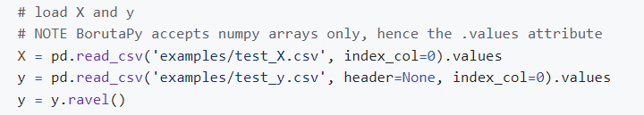
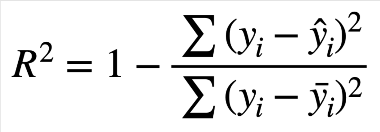

# 特征筛选

## 【了解】今日内容介绍

- 掌握单特征分析的衡量指标
- 知道 IV，PSI等指标含义
- 知道多特征筛选的常用方法
- 掌握Boruta,VIF,RFE,L1等特征筛选的使用方法


## 【理解】单特征分析

### 什么是好特征

从几个角度衡量：覆盖度，区分度，相关性，稳定性

#### 覆盖度

- 采集类，授权类，第三方数据在使用前都会分析覆盖度
  - 采集类 ：如APP list （Android 手机 90%）
  - 授权类：如爬虫数据（20% 30%覆盖度）GPS （有些产品要求必须授权）
- 一般会在两个层面上计算覆盖度（覆盖度 = 有数据的用户数/全体用户数）
  - 全体存量客户
  - 全体有信贷标签客户
- 覆盖度可以衍生两个指标：缺失率，零值率
  - 缺失率：一般就是指在全体有标签用户上的覆盖度
  - 零值率：很多信贷类数据在数据缺失时会补零，所以需要统计零值率
- 业务越来越成熟，覆盖度可能会越来愈好，可以通过运营策略提升覆盖度

总结：覆盖度 = 非空的样本数/总的样本数。

#### 区分度

区分度是评估一个特征对好坏用户的区分性能的指标。

- 可以把单特征当做模型，使用AUC, KS来评估特征区分度

- 在信贷领域，常用Information Value (IV)来评估单特征的区分度

  - Information Value刻画了一个特征对好坏用户分布的区分程度

    - IV值越大，区分程度越大
    - IV值越小，区分程度越小

    $$
    \rm{IV = \sum_{k}(p^{k}_{good}-p^{k}_{bad})\ln{\frac{p^{k}_{good}}{p^{k}_{bad}}}}
    $$

    - IV值最后ln的部分跟WOE是一样的

    $$
    \rm{IV = \sum_{k}(p^{k}_{good}-p^{k}_{bad})WOE_{k}}
    $$

    - IV计算举例（数据为了方便计算填充，不代表实际业务）

    | 婚配 | good | bad  | p_good | p_bad | p_good-p_bad | ln(p_g/p_bad) | IV    |
    | ---- | ---- | ---- | ------ | ----- | ------------ | ------------- | ----- |
    | 未婚 | 40   | 30   | 50%    | 37.5% | 0.125        | 0.2877        | 0.036 |
    | 已婚 | 30   | 40   | 37.5%  | 50%   | -0.125       | -0.2877       | 0.036 |
    | 其他 | 10   | 10   | 12.5%  | 12.5% | 0            | 0             | 0     |
    | 总计 | 80   | 80   | 100%   | 100%  | -            | -             | 0.072 |

    - IV<0.02 区分度小  建模时不用 （xgboost,lightGMB 对IV值要求不高）
      IV [0.02,0.5] 区分度大   可以放到模型里
      IV > 0.5  单独取出作为一条规则使用，不参与模型训练
    - 模型中尽可能使用区分度相对较弱的特征，将多个弱特征组合，得到评分卡模型
    - 连续变量的IV值计算，先离散化再求IV，跟分箱结果关联很大（一般分3-5箱）

小结：IV在【0.02，0.5】之间。


#### 相关性

对线性回归模型，有一条基本假设是自变量x1，x2，…，xp之间不存在严格的线性关系

- 先计算特征列之间相关性，把相关性高的列去掉
- 计算特征列和标签列之间相关性，把相关性低的列去掉
- 需要对相关系数较大的特征进行筛选，只保留其中对标签区分贡献度最大的特征，即保留IV较大的
- 皮尔逊相关系数，斯皮尔曼相关系数，肯德尔相关系数
- 如何选择：
  - 考察两个变量的相关关系，首先得清楚两个变量都是什么类型的
    - 连续型数值变量，无序分类变量、有序分类变量
  - 连续型数值变量，如果数据具有正态性，此时首选Pearson相关系数，如果数据不服从正态分布，此时可选择Spearman和Kendall系数
  - 两个有序分类变量相关关系，可以使用Spearman相关系数
  - 一个分类变量和一个连续数值变量，可以使用kendall相关系数
  - 总结：就适用性来说，kendall > spearman > pearson
- 如何计算

```python
import pandas as pd
df = pd.DataFrame({'A':[5,91,3],'B':[90,15,66],'C':[93,27,3]})
df.corr() # 皮尔逊
df.corr('spearman')#斯皮尔曼
df.corr('kendall')#肯德尔
```

- 可以使用toad库来过滤大量的特征，高缺失率、低iv和高度相关的特征一次性过滤掉

  ```python
  import toad
  data = pd.read_csv('../data/germancredit.csv')
  data.replace({'good':0,'bad':1},inplace=True)
  data.shape
  ```

  ><font color='red'>显示结果：</font>
  >
  >```
  >(1000, 21)
  >```

  ```python
  #缺失率大于0.5,IV值小于0.05,相关性大于0.7来进行特征筛选
  selected_data, drop_list= toad.selection.select(data,target = 'creditability', empty = 0.5, iv = 0.05, corr = 0.7, return_drop=True)
  print('保留特征:',selected_data.shape[1],'缺失删除:',len(drop_list['empty']),'低iv删除：',len(drop_list['iv']),'高相关删除：',len(drop_list['corr']))
  ```

  ><font color='red'>显示结果：</font>
  >
  >```shell
  >保留特征: 12 缺失删除: 0 低iv删除： 9 高相关删除： 0
  >```

小结：

特征列和标签列，相关性低的去掉

特征列和特征列，相关性高的去掉


#### 稳定性

特征稳定性主要通过计算不同时间段内同一类用户特征的分布的差异来评估

  - 常用的特征稳定性的度量有Population Stability Index (群体稳定性指标，PSI)
  - 当两个时间段的特征分布差异大，则PSI大
  - 当两个时间段的特征分布差异小，则PSI小

$$
\rm{PSI = \sum_{k}(p^{k}_{actual}-p^{k}_{expect})\ln{\frac{p^{k}_{actual}}{p^{k}_{expect}}}}
$$

  - IV是评估好坏用户分布差异的度量
  - PSI是评估两个时间段特征分布差异的度量
  - 都是评估分布差异的度量，并且公式其实一模一样，只是符号换了而已

总结：

~~~shell
#1.什么是好特征
覆盖度高（缺失率低，零值率低）
区分度高（IV【0.02，0.5】）
稳定性强（PSI比较小）
相关性（特征之间彼此相关性不要太大）

#2.怎么获得好特征
可以使用toad库来做单特征筛选，从IV，缺失率，相关性三个维度，一次性筛选出复合条件的好特征来
~~~


## 【理解】多特征筛选

- 当我们构建了大量特征时，接下来的调整就是筛选出合适的特征进行模型训练
- 过多的特征会导致模型训练变慢，学习所需样本增多，计算特征和存储特征成本变高
- 常用的特征筛选方法
  - 星座特征
  - Boruta
  - 方差膨胀系数
  - 递归特征消除
  - L1惩罚项


###  星座特征

- 星座是大家公认没用的特征，区分度低于星座的特征可以认为是无用特征
  - 把所有特征加上星座特征一起做模型训练
  - 拿到特征的重要度排序
  - 多次训练的重要度排序都低于星座的特征可以剔除


### Boruta

- Boruta算法是一种特征选择方法，使用特征的重要性来选取特征

  - 网址：https://github.com/scikit-learn-contrib/boruta_py
  - 安装：pip install Boruta -i https://pypi.tuna.tsinghua.edu.cn/simple/

- 原理

  

  - 创建阴影特征 (shadow feature) : 对每个真实特征R，随机打乱顺序，得到阴影特征矩阵S，拼接到真实特征后面，构成新的特征矩阵N = [R, S]

  - 用新的特征矩阵N作为输入，训练模型，能输出feature_importances_的模型，如RandomForest， lightgbm，xgboost都可以，得到真实特征和阴影特征的feature importances,

  - 取阴影特征feature importance的最大值S_max，真实特征中feature importance小于S_max的，被认为是不重要的特征

  - 删除不重要的特征，重复上述过程，直到满足条件
  - 案例

  ```python
  import numpy as np
  import pandas as pd 
  import joblib
  from sklearn.ensemble import RandomForestClassifier
  from boruta import BorutaPy
  #加载数据
  pd_data = joblib.load('../data/train_woe.pkl')
  pd_data
  ```

  ><font color='red'>显示结果：</font>
  >
  >|        | SK_ID_CURR | TARGET | AMT_GOODS_PRICE | REGION_POPULATION_RELATIVE | DAYS_BIRTH | DAYS_EMPLOYED | DAYS_REGISTRATION | DAYS_ID_PUBLISH | REGION_RATING_CLIENT_W_CITY | REG_CITY_NOT_LIVE_CITY |  ... | p_NAME_SELLER_INDUSTRY_Connectivity | p_NAME_YIELD_GROUP_XNA | p_NAME_YIELD_GROUP_high | p_NAME_YIELD_GROUP_low_action | p_NAME_YIELD_GROUP_low_normal | p_PRODUCT_COMBINATION_Card Street | p_PRODUCT_COMBINATION_Cash Street: high | p_PRODUCT_COMBINATION_Cash X-Sell: high | p_PRODUCT_COMBINATION_Cash X-Sell: low | p_PRODUCT_COMBINATION_POS industry with interest |
  >| -----: | ---------: | -----: | --------------: | -------------------------: | ---------: | ------------: | ----------------: | --------------: | --------------------------: | ---------------------: | ---: | ----------------------------------: | ---------------------: | ----------------------: | ----------------------------: | ----------------------------: | --------------------------------: | --------------------------------------: | --------------------------------------: | -------------------------------------: | -----------------------------------------------: |
  >| 125406 |     245429 |      0 |        0.610118 |                   0.016406 |   0.301190 |      0.092078 |         -0.099822 |        0.275679 |                   -0.020586 |              -0.048048 |  ... |                            0.053257 |               0.383810 |                0.065650 |                      0.073290 |                      0.164891 |                         -0.063697 |                               -0.028915 |                               -0.033661 |                               0.083527 |                                        -0.065841 |
  >|   8155 |     109510 |      0 |       -0.366495 |                  -0.410334 |  -0.440745 |     -0.608958 |          0.164707 |        0.193847 |                   -0.536494 |              -0.048048 |  ... |                           -0.065479 |              -0.090837 |               -0.132787 |                      0.073290 |                     -0.241145 |                         -0.063697 |                               -0.028915 |                               -0.033661 |                               0.083527 |                                        -0.348529 |
  >| 154053 |     278546 |      0 |        0.038650 |                   0.016406 |   0.301190 |      0.371651 |          0.075169 |        0.060654 |                   -0.020586 |              -0.048048 |  ... |                           -0.065479 |              -0.090837 |               -0.132787 |                     -0.316556 |                     -0.241145 |                         -0.063697 |                               -0.028915 |                               -0.033661 |                               0.083527 |                                        -0.348529 |
  >| 300963 |     448668 |      0 |       -0.366495 |                  -0.158446 |   0.301190 |     -0.171601 |          0.075169 |       -0.057870 |                   -0.020586 |              -0.048048 |  ... |                           -0.065479 |              -0.090837 |               -0.132787 |                     -0.316556 |                      0.164891 |                         -0.063697 |                               -0.028915 |                               -0.033661 |                               0.083527 |                                        -0.348529 |
  >| 269546 |     412373 |      0 |       -0.366495 |                  -0.410334 |  -0.051704 |     -0.171601 |         -0.099822 |       -0.297834 |                   -0.536494 |              -0.048048 |  ... |                            0.053257 |              -0.090837 |                0.110022 |                     -0.152116 |                      0.164891 |                         -0.063697 |                               -0.028915 |                               -0.033661 |                              -0.239387 |                                         0.084509 |
  >|    ... |        ... |    ... |             ... |                        ... |        ... |           ... |               ... |             ... |                         ... |                    ... |  ... |                                 ... |                    ... |                     ... |                           ... |                           ... |                               ... |                                     ... |                                     ... |                                    ... |                                              ... |
  >| 298994 |     446376 |      0 |       -0.050233 |                   0.016406 |  -0.440745 |     -0.451249 |         -0.377708 |       -0.297834 |                   -0.020586 |              -0.048048 |  ... |                            0.053257 |              -0.040815 |                0.110022 |                      0.073290 |                     -0.241145 |                         -0.063697 |                               -0.028915 |                               -0.033661 |                               0.083527 |                                         0.084509 |
  >| 269429 |     412242 |      0 |       -0.050233 |                   0.016406 |  -0.440745 |      0.253381 |          0.075169 |        0.060654 |                   -0.020586 |              -0.048048 |  ... |                           -0.065479 |              -0.090837 |               -0.132787 |                      0.073290 |                      0.164891 |                         -0.063697 |                               -0.028915 |                               -0.033661 |                               0.083527 |                                        -0.348529 |
  >|     16 |     100020 |      0 |        0.268859 |                   0.268275 |   0.301190 |      0.253381 |         -0.099822 |       -0.057870 |                   -0.020586 |               0.459100 |  ... |                           -0.065479 |              -0.090837 |                0.110022 |                      0.073290 |                      0.164891 |                         -0.063697 |                               -0.028915 |                               -0.033661 |                               0.083527 |                                         0.084509 |
  >|  97169 |     212804 |      0 |        0.038650 |                   0.016406 |  -0.440745 |     -0.451249 |          0.075169 |       -0.057870 |                   -0.536494 |              -0.048048 |  ... |                           -0.065479 |              -0.090837 |                0.110022 |                      0.073290 |                      0.164891 |                         -0.063697 |                               -0.028915 |                               -0.033661 |                               0.083527 |                                         0.084509 |
  >|  90581 |     205165 |      0 |       -0.050233 |                  -0.043274 |   0.301190 |      0.092078 |          0.075169 |        0.060654 |                   -0.020586 |              -0.048048 |  ... |                           -0.065479 |              -0.090837 |               -0.132787 |                      0.073290 |                      0.164891 |                         -0.063697 |                               -0.028915 |                               -0.033661 |                               0.083527 |                                        -0.348529 |
  >
  >215257 rows × 79 columns
  ```python
  #处理数据，去掉id 和 目标值
  pd_x = pd_data.drop(['SK_ID_CURR', 'TARGET'], axis=1)
  x = pd_x.values   # 特征
  y = pd_data['TARGET'].values # 目标
  y = y.ravel() # 将多维数组降为一维
  ```

  注意事项：`NOTE BorutaPy accepts numpy arrays only, hence the .values attribute`

  


  - 使用Boruta，选择features

  ```python
# 先定义一个随机森林分类器
rf = RandomForestClassifier(n_jobs=-1, class_weight='balanced', max_depth=5)
'''
BorutaPy function
estimator : 所使用的分类器，
n_estimators : 分类器数量, 默认值 = 1000，auto是基于数据集自动判定
max_iter : 最大迭代次数, 默认值 = 100
'''
feat_selector = BorutaPy(rf, n_estimators='auto', random_state=1, max_iter=10)
feat_selector.fit(x, y)
  ```

  - 展示选择出来的feature

  ```python
# feat_selector.support_ # 返回特征是否有用，false可以去掉
pd_ft_select = pd.DataFrame({'feature':pd_x.columns.to_list(), "selected": feat_selector.support_})
pd_ft_select

#查看哪些列是可以去掉的
pd_ft_select[pd_ft_select['selected']==False]
  ```

  ><font color='red'>显示结果：</font>
  >
  > >
  > >| feature | selected                                         |      |
  > >| ------- | ------------------------------------------------ | ---- |
  > >| 0       | AMT_GOODS_PRICE                                  | True |
  > >| 1       | REGION_POPULATION_RELATIVE                       | True |
  > >| 2       | DAYS_BIRTH                                       | True |
  > >| 3       | DAYS_EMPLOYED                                    | True |
  > >| 4       | DAYS_REGISTRATION                                | True |
  > >| ...     | ...                                              | ...  |
  > >| 72      | p_PRODUCT_COMBINATION_Card Street                | True |
  > >| 73      | p_PRODUCT_COMBINATION_Cash Street: high          | True |
  > >| 74      | p_PRODUCT_COMBINATION_Cash X-Sell: high          | True |
  > >| 75      | p_PRODUCT_COMBINATION_Cash X-Sell: low           | True |
  > >| 76      | p_PRODUCT_COMBINATION_POS industry with interest | True |
  > >
  > >77 rows × 2 columns
  > >
  > >| feature | selected                         |       |
  > >| ------- | -------------------------------- | ----- |
  > >| 27      | b_CREDIT_DAY_OVERDUE             | False |
  > >| 33      | b_AMT_CREDIT_SUM_OVERDUE         | False |
  > >| 37      | b_CREDIT_TYPE_Microloan          | False |
  > >| 38      | b_CREDIT_TYPE_Mortgage           | False |
  > >| 42      | pos_cash_paid_late_12_cnt        | False |
  > >| 55      | p_NAME_CASH_LOAN_PURPOSE_Repairs | False |
  > >| 60      | p_CODE_REJECT_REASON_SCOFR       | False |

小结：

~~~shell
Boruta算法会计算特征重要性。
ranking中的值越大，说明特征越不重要。可以删除。反之，特征就越重要，不能删除。
~~~


### 方差膨胀系数（VIF）

- 方差膨胀系数 Variance inflation factor (VIF)

  - 如果一个特征是其他一组特征的线性组合，则不会在模型中提供额外的信息，可以去掉

  - 评估共线性程度
    $$
    \rm{x_i=1+\sum_{k\ne{i}}\beta_{k}x_{k}}
    $$

  - VIF计算：$\rm{VIF=\frac{1}{1-R^2}}$

  - R^2^是线性回归中的决定系数，反映了回归方程解释因变量变化的百分比

  - 上面的式子中, R²代表了预测值和真实值拟合的拟合程度，既考虑了预测值与真实值的差异，同时也兼顾了真实值的离散程度

    - R²<0.5 → 弱拟合
    - 0.5 ≤ R² ≤ 0.8 → 中度拟合
    - R² > 0.8 强拟合

    > 
    >
    > 上面的公式中y = 真实值, $\hat{y}$  = 模型预测值, $\bar{y}$  = 真实值的平均值
    >
    > 注意：理论上 R² < 0 是可能的，但是只出现在模型特别差的情况，因此不予讨论

    当R²越大，拟合的越好，说明$x_i$这个特征能被其它特征线性表示，当VIF超过某个阈值的时候，可以考虑把这个$x_i$删除

  - VIF越大说明拟合越好，该特征和其他特征组合共线性越强，就越没有信息量，可以剔除

- 案例：

  - 加载数据

  ```python
  import numpy as np
  import pandas as pd 
  import joblib
  #statsmodels是统计学相关的库
  from statsmodels.stats.outliers_influence import variance_inflation_factor
  pd_data = joblib.load('../data/train_woe.pkl')
  #去掉ID和目标值
  pd_x = pd_data.drop(['SK_ID_CURR', 'TARGET'], axis=1)
  ```

  - 计算方差膨胀系数

  ```python
  #定义计算函数
  def checkVIF_new(df):
      lst_col = df.columns
      #x = np.matrix(df)
      x = df.values
      #这里i传入的是索引，从第0个特征开始，顺序计算所有特征的方差膨胀系数
      VIF_list = [variance_inflation_factor(x,i) for i in range(x.shape[1])]
      VIF = pd.DataFrame({'feature':lst_col,"VIF":VIF_list})
      max_VIF = max(VIF_list)
      return VIF
  df_vif = checkVIF_new(pd_x)
  df_vif
  ```

><font color='red'>显示结果：</font>
>|      |                                          feature | VIF      |
>| ---: | -----------------------------------------------: | -------- |
>|    0 |                                  AMT_GOODS_PRICE | 1.164528 |
>|    1 |                       REGION_POPULATION_RELATIVE | 1.835830 |
>|    2 |                                       DAYS_BIRTH | 3.278163 |
>|    3 |                                    DAYS_EMPLOYED | 1.658723 |
>|    4 |                                DAYS_REGISTRATION | 1.177438 |
>|  ... |                                              ... | ...      |
>|   73 |          p_PRODUCT_COMBINATION_Cash Street: high | 2.384278 |
>|   74 |          p_PRODUCT_COMBINATION_Cash X-Sell: high | 1.926074 |
>|   75 |           p_PRODUCT_COMBINATION_Cash X-Sell: low | 2.102989 |
>|   76 | p_PRODUCT_COMBINATION_POS industry with interest | 2.036221 |
>
>77 rows × 2 columns

  - 选取方差膨胀系数 > 3的features

```python
df_vif[df_vif['VIF'] > 3]
```

><font color='red'>显示结果：</font>
>
>|      |                     feature |      VIF |
>| ---: | --------------------------: | -------: |
>|    2 |                  DAYS_BIRTH | 3.278163 |
>|   11 | YEARS_BEGINEXPLUATATION_AVG | 4.536902 |
>|   12 |              FLOORSMAX_MEDI | 5.418642 |
>|   13 |              TOTALAREA_MODE | 5.211742 |
>|   16 |  AMT_REQ_CREDIT_BUREAU_YEAR | 4.172515 |
>|   18 |  NAME_INCOME_TYPE_Pensioner | 3.416916 |
>|   23 |      EMERGENCYSTATE_MODE_No | 3.836772 |
>|   27 |        b_CREDIT_DAY_OVERDUE |      inf |
>|   33 |    b_AMT_CREDIT_SUM_OVERDUE |      inf |
>|   35 |      b_CREDIT_TYPE_Car loan | 3.127171 |
>|   38 |      b_CREDIT_TYPE_Mortgage |      inf |
>|   65 |        p_NAME_PORTFOLIO_POS | 3.273039 |
>|   68 |      p_NAME_YIELD_GROUP_XNA | 4.237860 |
>

总结：VIF越大，说明拟合越好，该特征和其他特征组合共线性越强，建议剔除。


###  RFE递归特征消除 (Recursive Feature Elimination)

- 使用排除法的方式训练模型，把模型性能下降最少的那个特征去掉，反复上述训练直到达到指定的特征个数、

  - sklearn.feature_selection.RFE

- 案例

  - 使用RFE，选择features

  ```python
  #如下的案例可以快速出结果
  from sklearn.svm import LinearSVC
  from sklearn.datasets import load_iris
  from sklearn.feature_selection import RFE
  X,y = load_iris(return_X_y=True)
  #分类模型，C是正则化参数，用于控制模型复杂度和泛化能力，默认是1.0
  lscv = LinearSVC(C=0.01)
  # n_features_to_select 要选几个特征,  step 一次删掉几个
  selector = RFE(lscv,n_features_to_select=2,step=1)
  selector.fit(X,y)
  # support_ 返回False的可以被删除, 返回True的留下
  selector.support_
  # 获取顺序 序号越大的是优先被删除的
  selector.ranking_
  ```

  ><font color='red'>显示结果：</font>
  >
  >~~~
  >array([False,  True,  True, False])
  >~~~


### 基于L1的特征选择 (L1-based feature selection)

- 使用L1范数作为惩罚项的线性模型(Linear models)会得到稀疏解：大部分特征对应的系数为0
- 希望减少特征维度用于其它分类器时，可以通过 feature_selection.SelectFromModel 来选择不为0的系数


案例

```python
from sklearn.svm import LinearSVC
from sklearn.datasets import load_iris
from sklearn.feature_selection import SelectFromModel
iris = load_iris()
X, y = iris.data, iris.target
X.shape
```

><font color='red'>显示结果：</font>
>
>(150, 4)

```python
#Prefer dual=False when n_samples > n_features.（当样本数量比特征数量多时，设置为False即可）
lsvc = LinearSVC(C=0.01, penalty="l1", dual=False).fit(X, y)
model = SelectFromModel(lsvc, prefit=True)
X_new = model.transform(X)
X_new.shape
```

><font color='red'>显示结果：</font>
>
>```shell
>(150, 3)
>```

总结：我们一般不会单独去实现L1特征选择，不过我们在选择线性模型时如果使用L1进行正则化，就相当于已经用L1来帮我们做特征选择了。


## 【理解】特征监控

### 内部特征监控

释义：对内部的数据特征进行监控。

- 前端监控（授信之前）：特征稳定性
  - 大多数情况下，随着业务越来越稳定，缺失率应该呈现逐渐降低的趋势
  - 如下表所示，Week3缺失率突然增加到28%，大概率是数据采集或传输过程出问题了
  - PSI，特征维度的PSI如果>0.1可以观察一段时间

| 特征名称 | Week  1 | Week 2 | Week 3 | ...  |
| -------- | ------- | ------ | ------ | ---- |
| 缺失率   | 1%      | 2%     | 28%    |      |
| 零值率   | 20%     | 23%    | 18%    |      |
| PSI      | -       | 0.02   | 0.3    |      |

- 后端监控（放款之后）：特征区分度
  - AUC/KS 波动在10%以内
  - KS 如果是线上A卡 0.2是合格的水平
  - IV值的波动稍大可以容忍，和分箱相关，每周数据分布情况可能不同，对IV影响大一些

| 特征名称 | Week  1 | Week 2 | Week 3 | ...  |
| -------- | ------- | ------ | ------ | ---- |
| AUC      | 0.64    | 0.66   | 0.62   |      |
| KS       | 22%     | 23%    | 20%    |      |
| IV       | 0.05    | 0.07   | 0.04   |      |

- 分箱样本比例

| 特征名称 | Week  1 | Week 2 | Week 3 | ...  |
| -------- | ------- | ------ | ------ | ---- |
| 分箱1    | 10%     | 20%    | 15%    |      |
| 分箱2    | 50%     | 60%    | 75%    |      |
| 分箱3    | 40%     | 20%    | 10%    |      |

- 分箱风险区分：要重视每个特征的**风险趋势单调性**
  - 每一箱 的bad_rate有波动，容忍度相对高一些
  - 要**高度重视不同箱之间风险趋势发生变化**，如分箱1，分箱2，在week2和week3 风险趋势发生了变化
  - 如果**风险趋势单调性**发生变化，要考虑特征是不是要进行迭代

| 特征名称 | Week  1 | Week 2 | Week 3 | ...  |
| -------- | ------- | ------ | ------ | ---- |
| 分箱1    | 30%     | 26%    | 20%    |      |
| 分箱2    | 10%     | 17%    | 23%    |      |
| 分箱3    | 5%      | 7%     | 6%     |      |


### 外部特征评估

释义：对外部（外来的）数据特征进行评估。

- 数据评估标准

  覆盖度、区分度、稳定性

- 使用外部数据的时候需要注意

  避免未来信息：使用外部数据的时候，可能出现训练模型的时候效果好，上线之后效果差

  - 取最近一个时间周期的数据
  - 之前3~4个月或者更长时间的数据做验证，看效果是不是越来越差

- 外部数据覆盖度如何计算

  - 交集用户数 / 内部用户数
  - 需要对内部所有用户调用外部数据？
    - 如果外部数据免费，那么全部调用，但付费的三方数据要在有必要的时候在调用
    - 在计算外部数据覆盖度前，首先应该明确什么客群适合这个第三方数据
    - 内部缺少数据且这个第三方数据能提升区分度，那这个第三方数据才有用
  - 覆盖度 = 交集用户数 / 内部目标客群

- 避免内部数据泄露

  - 如果需要把数据交给外部公司，让对方匹配一定要将内部信息做Hash处理再给对方匹配

  

  - 匹配上的是共有的数据，匹配不上的外部无法得知其身份

- 避免三方公司对结果美化

  - 内部自己调用接口测覆盖度直接调用即可
  - 如果是把样本交给外部公司让对方匹配，一定要加假样本
    - 这样他们只能匹配出结果，但无法得知真实的覆盖度
    - 只有内部公司能区分出真假样本，从而计算出真实覆盖度
    - 如果覆盖度高于真实样本比例，说明结果作假

- 评分型外部数据

  区分度和稳定性的分析方法同单特征的分析一样

  区分度：AUC, KS, IV, 风险趋势

  稳定性: PSI

- 内部特征训练的模型效果 vs 内部特征+外部特征训练的模型效果

  - AUC有 2~3个点的提升就很好了

- 黑名单型外部数据

  - 使用混淆矩阵评估区分度
  
    |        | 外部命中 | 外部未命中 |
    | ------ | -------- | ---------- |
    | 内部坏 | TP       | FN         |
    | 内部好 | FP       | TN         |
    
    
    
    
    
  - Precision: 外部命中的尽可能多的是内部的坏客户
  
  - Recall: 内部的坏客户尽可能多的命中外部名单

- 外部数据是否具有可回溯性无法得知，所以尽可能取最近的样本去测

  早期接入数据后要密切关注线上真实的区分度表现


## 【作业】

~~~shell
#1.完成toad案例

#2.完成相关性案例

#3.完成Boruta算法案例

#4.理解算法原理、概念、逻辑等
~~~


## 小结

- 单特征分析
  - 覆盖度
  - 区分度
  - 相关性
  - 稳定性

- 多特征筛选
  - 星座
  - Boruta
  - VIF
  - RFE
  - L1

  - 业务

- 内部特征的监控
  - 前端稳定性
  - 后端区分度

- 外部特征的评估
  - 评分型数据
  - 名单型数据
  - 保护隐私
  - 未来信息