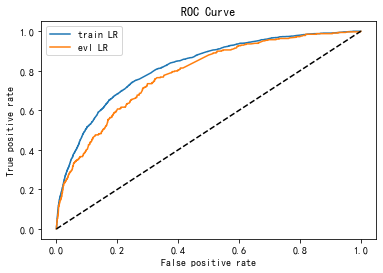

# 评分卡模型构建

## 【了解】今日内容介绍

- 掌握KS值的计算方法
- 知道评分映射方法
- 知道LightGBM基本原理
- 掌握使用lightGBM进行特征筛选的方法
- 应用toad构建评分卡模型


## 【理解】模型构建流程

### 实验设计

- 新的模型能上线一定要比原有方案有提升，需要通过实验证明

  | 冷启动       | 业务初期   | 成长期         | 波动期         | 策略调整       | 新增数据源     |
  | ------------ | ---------- | -------------- | -------------- | -------------- | -------------- |
  | 人工审核     | 人工审核   | 新旧模型对比   | 新旧模型对比   | 避免迭代模型   | 新旧模型对比   |
  | 规则模型     | 标准模型   | 长短表现期对比 | 稳定和波动人群 | 线上模型、陪跑 | 和标准模型对比 |
  | 数据驱动模型 | 上一版模型 |                |                |                |                |

  - 业务逐渐稳定后，人工审核是否会去掉
    - 一般算法模型上线后，在高分段和低分段模型表现较好，中间的用户可能需要人工参与审核
    - 模型表现越来越好之后，人工审核的需求会逐步降低，但不会去掉
  - 标准模型：逻辑回归，随机森林
  - 策略和模型不会同时调整

### 样本设计

- ABC卡观察期，表现期

观察期：代表的是决策时已知的信息，位于时间轴左侧，主要是用来生成用户特征的时间区间，即用来确定X变量。

观察点：不是一个具体的时间点，而是一个时间段，表示的是客户申请贷款的时间，用来搜集那些用来建模的客户样本 ，在该时间段申请的客户会是我们用来建模的样本。

表现期：用来定义用户是否好坏的时间区段，即用来确定Y标签，其代表的是决策时未知的但对决策效果非常重要而需要预测的信息。

|           | 观察期                                            | 表现期                    |
| --------- | ------------------------------------------------- | ------------------------- |
| 实时A卡   | 申请时点往前6~12个月                              | FPD7，FPD30               |
| 白名单A卡 | 邀请时点/激活时点往前6~12个月                     | FPD30                     |
| B卡       | 当前未逾期用户任意用信时点前6~12个月              | 当期/后续2-6期DPD30/DPD60 |
| C卡       | 当前逾期未还用户还款日后1天/30天/60天往前6~12个月 | 当期DPD30/60/90           |

- 还款状态和DPD一起刻画了用户的逾期情况

|                            | 还款日前（Before Due） | 还款日后（After Due）             |
| -------------------------- | ---------------------- | --------------------------------- |
| 完全还款（Fully Repay）    | FB（好用户）           | FA（催回来了）                    |
| 部分还款（Patially Repay） | PB                     | **PA**（有意愿，但无力完全还款）  |
| 展期（Extend）             | EB（提前展期）         | EA （违约后展期，可能是高危用户） |
| 未还款（Not Repay）        | NB                     | **NA**                            |

- A卡 申请新客  B卡未逾期老客 C卡 逾期老客

- 当前逾期：出现逾期且到观测点为止未还清 NA，PA

- 历史逾期：曾经出现过逾期已还清或当前逾期 FA，NA，PA

- 举例

|          | 一月 | 二月 | 三月 | 四月 | 五月 |
| -------- | ---- | ---- | ---- | ---- | ---- |
| 还款状态 | 还清 | 还清 | 还清 | 还清 | 还清 |
| DPD      | 40   | 0    | 0    | 0    | 0    |

上面情况属于<font color='red'>B卡客户</font>


|          | 一月 | 二月 | 三月 | 四月 | 五月 |
| -------- | ---- | ---- | ---- | ---- | ---- |
| 还款状态 | 还清 | 还清 | 还清 | 还清 | 未还 |
| DPD      | 0    | 0    | 0    | 0    | 40   |


上面情况属于<font color='red'>C卡客户</font>


|          | 一月 | 二月 | 三月 | 四月 | 五月 |
| -------- | ---- | ---- | ---- | ---- | ---- |
| 还款状态 | 还清 | 还清 | 还清 | 未还 | 未还 |
| DPD      | 40   | 0    | 0    | 40   | 10   |

上面情况属于<font color='red'>C卡客户</font>


- 样本设计表格


|      | 训练集 |      |      |      |      |      | 测试集 |      |
| ---- | ------ | ---- | ---- | ---- | ---- | ---- | ------ | ---- |
|      | 1月    | 2月  | 3月  | 4月  | 5月  | 6月  | 7月    | 8月  |
| 总#  | 100    | 200  | 300  | 400  | 500  | 600  | 700    | 800  |
| 坏#  | 3      | 6    | 6    | 8    | 15   | 12   | 14     | 24   |
| 坏%  | 3%     | 3%   | 2%   | 2%   | 3%   | 2%   | 2%     | 3%   |

  - 观察坏样本的比例，不要波动过大

  - 客群描述：首单用户、内部数据丰富、剔除高危职业、收入范围在XXXX

  - 客群标签：好: FPD<=30 坏: FPD>30

### 模型训练与评估

- 目前还是使用机器学习模型，少数公司在尝试深度学习

- 模型的可解释性>稳定性>区分度

  - 区分度：AUC，KS
  - 稳定性： PSI

- 业务指标：通过率，逾期率

  - 逾期率控制在比较合理的范围的前提下，要提高通过率
  - A卡，要保证一定过得通过率，对逾期率可以有些容忍
  - B卡，想办法把逾期率降下来，好用户提高额度

- AUC和KS

  

  - AUC：ROC曲线下的面积，反映了模型输出的概率对好坏用户的排序能力
  - KS反映了好坏用户的分布的最大的差别
  - ROC曲线是对TPR和FPR的数值对的记录
  - KS = max（TPR-FPR）

- AUC和KS的区别可以简化为

  - AUC反映模型区分度的平均状况
  - KS反映了模型区分度的最佳状况
  
- PSI和特征里的PSI完全一样

### 模型上线整体流程


## 【实现】逻辑回归评分卡

### 评分映射方法

- 使用逻辑回归模型可以得到一个[0,1]区间的结果, 在风控场景下可以理解为用户违约的概率, 评分卡建模时我们需要把违约的概率映射为评分
- 举例:
  - 用户的基础分为650分
    - 当这个用户非逾期的概率是逾期的概率的2倍时，加50分
    - 非逾期的概率是逾期的概率的4倍时，加100分
    - 非逾期的概率是逾期的概率的8倍时，加150分
    - 以此类推，就得到了业内标准的评分卡换算公式

  - $$score = 650+50 log_2(P_{正样本}/ P_{负样本})$$

    - score是评分卡映射之后的输出，$P_{正样本}$是样本非逾期的概率，$P_{负样本}$是样本逾期的概率

  - 逻辑回归评分卡如何与评分卡公式对应

    - 逻辑回归方程为
    $$
    p = \frac{1}{1+e^{-t}} \\
    1-p = \frac{e^{-t}}{1+e^{-t}} \\
      ln(p/(1-p)) = ln(e^{t})=t
    $$


  $$ln(P_{正样本}/ P_{负样本}) = w_1x_1+w_2x_2+w_3x_3+... ...$$

- 在信用评分模型建模时，逻辑回归的线性回归成分输出结果为$ln(P_{正样本}/ P_{负样本}) $。

- 由对数换底公式可知:

  $$log_2(P_{正样本}/ P_{负样本}) = ln(P_{正样本}/ P_{负样本}) /ln2 = w_1x_1+w_2x_2+w_3x_3+... /ln2$$

  只需要解出逻辑回归中每个特征的系数，然后将样本的每个特征值加权求和即可得到客户当前的标准化信用评分

  - 基础分（Base Score）为650分，步长（Point of Double Odds，PDO）为50分，这两个值需要根据业务需求进行调整

### 逻辑回归评分卡

```python
import pandas as pd
from sklearn.metrics import roc_auc_score,roc_curve,auc
from sklearn.model_selection import train_test_split
from sklearn import metrics
from sklearn.linear_model import LogisticRegression
import numpy as np
import random
import math
```

- 读取数据

```python
data = pd.read_csv('../data/Bcard.txt')
data.head()
```

><font color = red>输出结果</font>
>
>|      |    obs_mth | bad_ind |       uid | td_score | jxl_score | mj_score | rh_score | zzc_score | zcx_score | person_info | finance_info | credit_info | act_info |
>| ---: | ---------: | ------: | --------: | -------: | --------: | -------: | -------: | --------: | --------: | ----------: | -----------: | ----------: | -------: |
>|    0 | 2018-10-31 |     0.0 | A10000005 | 0.675349 |  0.144072 | 0.186899 | 0.483640 |  0.928328 |  0.369644 |   -0.322581 |     0.023810 |        0.00 | 0.217949 |
>|    1 | 2018-07-31 |     0.0 |  A1000002 | 0.825269 |  0.398688 | 0.139396 | 0.843725 |  0.605194 |  0.406122 |   -0.128677 |     0.023810 |        0.00 | 0.423077 |
>|    2 | 2018-09-30 |     0.0 |  A1000011 | 0.315406 |  0.629745 | 0.535854 | 0.197392 |  0.614416 |  0.320731 |    0.062660 |     0.023810 |        0.10 | 0.448718 |
>|    3 | 2018-07-31 |     0.0 | A10000481 | 0.002386 |  0.609360 | 0.366081 | 0.342243 |  0.870006 |  0.288692 |    0.078853 |     0.071429 |        0.05 | 0.179487 |
>|    4 | 2018-07-31 |     0.0 |  A1000069 | 0.406310 |  0.405352 | 0.783015 | 0.563953 |  0.715454 |  0.512554 |   -0.261014 |     0.023810 |        0.00 | 0.423077 |
>

- 数据字段说明
  - bad_ind 为标签
  - 外部评分数据：td_score,jxl_score,mj_score,rh_score,zzc_score,zcx_score
  - 内部数据：person_info, finance_info, credit_info, act_info
  - obs_month：申请日期所在月份的最后一天(数据经过处理,将日期都处理成当月最后一天)
- 看一下月份分布,用最后一个月做为时间外样本

```python
data.obs_mth.unique()
```

> <font color = red>输出结果</font>

```
array(['2018-10-31', '2018-07-31', '2018-09-30', '2018-06-30',
       '2018-11-30'], dtype=object)
```

- 划分测试数据和验证数据(时间外样本)

```python
train = data[data.obs_mth != '2018-11-30']
val = data[data.obs_mth == '2018-11-30']
```

- 取出建模用到的特征

```python
#info结尾的是自己做的无监督系统输出的个人表现，score结尾的是收费的外部征信数据
feature_lst = ['td_score', 'jxl_score', 'mj_score','rh_score', 'zzc_score', 'zcx_score', 'person_info', 'finance_info','credit_info', 'act_info']
```

- 训练模型

```python
x = train[feature_lst]
y = train['bad_ind']

val_x =  val[feature_lst]
val_y = val['bad_ind']
#C：正则化系数
lr_model = LogisticRegression(C=0.1)
lr_model.fit(x,y)
```

><font color = red>输出结果</font>
>
>```shell
>LogisticRegression(C=0.1, class_weight=None, dual=False, fit_intercept=True,
>          intercept_scaling=1, max_iter=100, multi_class='ovr', n_jobs=1,
>          penalty='l2', random_state=None, solver='liblinear', tol=0.0001,
>          verbose=0, warm_start=False)
>```

- 模型评价
  - ROC曲线：描绘的是不同的截断点时，并以FPR和TPR为横纵坐标轴，描述随着截断点的变小，TPR随着FPR的变化
    - 纵轴：TPR=正例分对的概率 = TP/(TP+FN)，其实就是查全率/召回率
    - 横轴：FPR=负例分错的概率 = FP/(FP+TN)    原本是0被预测为1的样本在所有0的样本中的概率

    

  - **KS值** 

    - 作图步骤
    - 根据学习器的预测结果（注意，是正例的概率值，非0/1变量）对样本进行排序（从大到小）-----这就是截断点依次选取的顺序
      按顺序选取截断点，并计算TPR和FPR ---也可以只选取n个截断点，分别在1/n，2/n，3/n等位置
      横轴为样本的占比百分比（最大100%），纵轴分别为TPR和FPR，可以得到KS曲线max（TPR-FPR）
    - ks = max（TPR-FPR）TPR和FPR曲线分隔最开的位置就是最好的”截断点“，最大间隔距离就是KS值，通常>0.2即可认为模型有比较好偶的预测准确性

- 绘制ROC计算KS

```python
y_pred = lr_model.predict_proba(x)[:,1] #取出训练集预测值
fpr_lr_train,tpr_lr_train,_ = roc_curve(y,y_pred) #计算TPR和FPR
train_ks = abs(fpr_lr_train - tpr_lr_train).max() #计算训练集KS
print('train_ks : ',train_ks)

y_pred = lr_model.predict_proba(val_x)[:,1] #计算验证集预测值
fpr_lr,tpr_lr,_ = roc_curve(val_y,y_pred)   #计算验证集预测值
val_ks = abs(fpr_lr - tpr_lr).max()         #计算验证集KS值
print('val_ks : ',val_ks)

from matplotlib import pyplot as plt
plt.plot(fpr_lr_train,tpr_lr_train,label = 'train LR') #绘制训练集ROC
plt.plot(fpr_lr,tpr_lr,label = 'evl LR')               #绘制验证集ROC
plt.plot([0,1],[0,1],'k--')
plt.xlabel('False positive rate')
plt.ylabel('True positive rate')
plt.title('ROC Curve')
plt.legend(loc = 'best')
plt.show()
```

><font color = red>显示结果：</font>
>
>```
>train_ks :  0.4151676259891534
>val_ks :  0.3856283523530577
>```
>
>![img](data:image/png;base64,iVBORw0KGgoAAAANSUhEUgAAAYIAAAERCAYAAAB2CKBkAAAABHNCSVQICAgIfAhkiAAAAAlwSFlzAAALEgAACxIB0t1+/AAAIABJREFUeJzs3Xd4VEUXwOHfpBdCSUhCDb0kEOkgSAlNxBoBsSAIUhXFrqAUEQSlCB8ICIigIqIioFTpXUR6772EhIT0np3vjxuqkCyQzSa7530enr17d+7ds4h79s6dOaO01gghhLBfDtYOQAghhHVJIhBCCDsniUAIIeycJAIhhLBzkgiEEMLOSSIQQgg7J4lA2Byl1KdKqXilVLhS6oJS6r2bXuuplLqklApTSvW9aX8tpdQBpdRFpdTnZrzHPbUXIi+TRCBs1ddaaz/gEeAjpVQNpVQV4EugGdAIGKaUClRKOQHzgI+BskBLpdSjdzvxvbYXIq+TRCBsmtb6NLAVqAI8CfyltT6qtT4JLAeeABoDSVrrP7TWqcBCoGUWp73X9kLkaZIIhE1TSgUAdYEjQHngzE0vn8X4RV898/VrZgJTszjtHdsrpUKUUutueu9ZSqmuN22/ppT6Til1LHNfkFJq+03tBymlPs7crq+U2pXZvTVNKaXu8aMLYTZJBMJWvaGUCgeOAaO11nsANyDlpjapgDtQGIi/tlNrfTnziuFu7rX9NQOAzUCDzOMOAm5KKb/M19sC85RSLsBPQFcgACgHhJpxfiHuiyQCYau+xvi1Hw8sydyXiJEMrnHN3JeWuQ2AUqqZUurlLM5tbvvbf8Uv1VrP0FpH3bRvPvCYUsobcNNaH8XoxioL/AWcBuoAQVnEI8QDkUQgbJbWOhH4Dng9c9dJjC/Ya8oAp4DjGN1G1zQBHsri1Oa2L3nb8613aDMP40rgUYx7DWAkkONa62Ja62JACWB8FvEI8UAkEQhbNwnorJTyBBYDjyqlqiilKgBtMK4WVgLllFItlVIFgOeAtVmc827tY4FSyhCMMTopS1rrvRjJ6UmMpABwGPBQSjVRSjkAPwI97vWDC2EuJ2sHIIQlaa1PK6U2AJ201tOUUh8A6zB+BH2stT4CoJR6HJgO+AHfaq2XZXHO2Du1z7yhuw/jPsBJbvzCz85a4KnMewZorVOVUs8D3wD+wCpgyj1+dCHMpmQ9AiGEsG/SNSSEEHZOEoEQQtg5SQRCCGHnJBEIIYSdyxejhooWLarLli1r7TCEECJf2bFjxxWttW927fJFIihbtizbt2/PvqEQQojrlFJnsm8lXUNCCGH3JBEIIYSdk0QghBB2Ll/cI7iTtLQ0zp8/T3JysrVDyfPc3NwoVaoUzs7O1g5FCJEH5dtEcP78eby8vChbtiyyZsfdaa2JjIzk/PnzlCtXztrhCCHyoHzbNZScnIyPj48kgWwopfDx8ZErJyHEXVkkESil/JVSG7N43VkptVgptUUp9eoDvM/9HmpX5O9JCJGVHO8aUkoVAb4HPLNo9iawXWv9qVJqqVLqN611XE7HIoQQ1mYyaSLiU27ZpzWcuBRJwT3TSUuKJzXd9J/j0tMzuHgllsAmTxHcrJ1FY7TEPYIM4HngjyzahAD9M7c3YCwufstCIEqpXkAvgICAgBwPMifs3r0bgJo1a97X8W+//Tbjx9/bwlOffvopFStW5OWXb6yM2LVrV/bs2XP9pvCcOXPkxrAQFhQTn8CxrUu4GpdIdGIqaRkak9aExSRzJioBd2cnYpPT0EB6xn+/5B3QjHD+Fl8VC4BJ33rVvutSBq8tSiQ8QfNjIVfIb4lAax0L2XZHeAIXMrejMBbfuP0804BpAHXr1s2TiyY8aCK41ySQlYkTJ9K4cWO6devGqlWraNu2bY6dWwh7kGHS7D4XzbmoRACcEy8TuHMoKampJKVloDXEJafhoBRB+jh1VczdT5YGOGZuO969WULlZ0l+6ht8vIyltJOTkxk6dCijvxtN0aK+TJ41mRbtLJsEwHqjhuIBdyAGKJD5/L4NXXSAgxdjcyKu64JKFGTIU9Xu+vqAAQNYsGABAD/++COrV68GICQkhHr16rF3717++usv4uPj6dChAwkJCVSsWJGZM2deP0dISAjr1q0DjF/6aWlpbNq0iZiYGJYvX06xYsXuKWatNfHx8bi4uNzjpxUin4o5D3t+BtN/f3Vfo9HEJaeTkm4iISUdgNQME5eik4hKSOVSbDIZGRqTNpLBNe86GyuHhuNNnJM3SkERF0jP0KS5FSPKuy5OzQfg5ebEfd2Gc3TF0y8Qz5sODg0N5a+//qJbt26MHTuWIkWK3MeJ7521EsEOoDHGGq01uPOi3nnayJEjqVKlCmB0zVyzdetW+vXrx+jRowG4dOkSb775Jq1ateKxxx7j8uXL+Pv/5wIIgOPHj7N+/Xo+++wz1qxZw0svvWR2PG+++SZRUVE89dRTtGjR4v4/mBB5WVoSxIdDfDhpCZE4/fIiSt89CQAooGDm9s3V1yrf3OjasJnbfr1rt0L49T+F3wMFnbW4uDicnZ1xc3Ojf//+vPfee7Ru3dqC7/hfFk8ESqkWQJDW+uubdn8PLFVKNQGCgH8e5D2y+uWe26pXr067my7lnJ2d+fbbb5k5cyZRUVEkJSXd9dguXboAxj2R1NTUe3rfiRMnsmnTJlxdXWWUkMj/Io7A2s/JSE8jLT6KuMgLFEiLwt2UcL3JzXfByiXPvr7t4+GCr5cryWkZ1CnjjaMDODs6ULtMEbw9XfByM44s4uFM+aIFsgzD0v8v/fXXX/Tq1YuXX36Zzz//nJCQEIu+391YLBForUMyH9cAa2577YxSqjXGVcFgrXWGpeKwJHd3dyIjIwGjW0YpRYECt/7DmjFjBh06dKBjx440a9Ysy/N5emY10Cp7vXv3pkmTJvTr1w9Hxyw6JoWworQMEynpJmKS0ohOTCU2KZ19F6K5tnx62OUwXjv8Cj6mSI6aShGLBxG6JBE6CKdCxTB5+KG8/HDzKkphT1dc/SrwZ9Hi+Hq54lPABWfHvD89KioqinfffZfvv/+eqlWr8sQTT1g1HqvNLNZaXwR+tdb754TWrVvTsWNHfvrpJ0aOHEnTpk3v2Ob111/nm2++AeDChQs86NoKgwcPvn6j+eZuqSJFitCiRQt+//13Onbs+EDvIURO2XLiCluOR7LnfDQHLsYSl5xGWobxre9KKo86bOcz51kk4YIJB0qpKwDsdavHkhoTcXNypIJfAV4JLo6DQ/6/2l29ejWdOnUiMjKSTz75hIEDB+Lm5mbVmJTWeXJAzi3q1q2rb1+P4NChQwQGBlopovxH/r6EpaWkZ3AiPIHDYbFsORFJWoaJ05GJ7D1v/Nr3cnOisIczrQOLUbKACS9HE4/t6EnBmMMAmHwDMRWviQIc/arCI29xf3dh87Z9+/bRq1cvpkyZct8jDs2llNqhta6bXbt8W2tICGFdEXEp/Lj1DGciEzh8KY4TEfGkm279YRlcshBdG5Xlg5ASeByYC+nJcPVPWH9j9ByeftB5Pg7+1XGwwS9+rTXff/89O3fuZMKECQQHB7Nly5Y8dS9PEoEQIkvRiamsOHiZbaeiuJg55PJw2I1CAG7ODjSqUJSWgX4EFi9IYHEv/Au64ZURC5f3AREwoTWkJdx64oZvgH91qN4enGxzyPOpU6fo3bs3K1eupEmTJiQlJeHu7p6nkgBIIhBC3CY5LYMTEfHM2nya33acRym4uQe5XtkitAr0p6C7E68+Uo5qJQre+sV27l9YNBkOzL/1xM4e8P5RcHAy/jja7uz3jIwMJk2axIABA3BwcGDy5Mn07t0bB4e8eSNbEoEQdiw2OY0vlx2mgKtT5vN0ft52FjC656uVKEghd2eeqVmCFlX98fVyvfvJEiJh7y/w1wDjuU9FKFoFGr1hPC9eA1webGRcfnHlyhUGDx5Ms2bN+Oabb/JsmZxrJBEIYaPSMkysOxLBmciE6333x8Pj2XnmKievJPynvZuzA65OjtQv502Lqn50qFOKogWy+OK/5uJu+PlFiLt4Y1/VJ+GFn3Lqo+QLaWlp/PTTT3Tp0gV/f3927txJuXLl8lw30J1IIsglN5eTuBMpJidygtaaC9FJzNx8miV7LxEW+991KGoFFObZWiWJTkylbllvgkoUpHmVe5g7azLBioGQEA6JUXDCKK+CexGo2QlCBoBr1hO1bM2OHTt49dVX2bt3L8WLF6dNmzaUL1/e2mGZTRJBHifF5ERWUtNNnIlMYM/5GMatPMqlmCSuDdypUbow77epQlDxgpQranTJKAVuzvc52TA9FfbMgdWfQaIxkRLv8sav/4Z9oXQDcLCviYxJSUkMHTqUMWPG4Ofnx4IFC2jTpo21w7pntpEIlvWHsH05e85iwdD2i7u+nJiYSJcuXQgPDyc4OJhJkyYxYsQIgoKCCA0N5YsvvqB8+fI5MrFLiskJML7095yP5nBYHIMW7sfLzYm45PTrr7s6OfB8vdJU9veikp8Xj1S8jxX84i5D1Mn/7k+OgZ+fv3XfwAibHe1jrtDQUFasWEGPHj0YPXo0hQsXtnZI98U2EoEVTJs2jerVq/Ppp5/Srl079u7dS4cOHRg7diyhoaGsX7+eN99884HfR4rJ2S+TSXPkchz/W3WMQ2GxnIlMvOX1uOR03m5ViQyTpmEFH2oHFLm/X/smE5xYAztmwpFlkFXFF99A6DzfGPvvaJ9fH7Gxsbi4uODm5sbHH3/Mhx9+SMuWLa0d1gOxjf+SWfxyt5QjR46wZcsW1q1bR3R0NBcuXKBt27ZcuHCB2NhYChUq9MC1g0CKydmbpNQMDoXFsv10FAt3XeTgpRvl1R8N8qdkEXc61ClFZX+v+6+pc3E3nMus85hwBfbOheiz4FHUGOFTrhmoO5zbxRNK1bPJ2b7mWrp0KX369OHll19mxIgR2dYPyy9sIxFYQZUqVahfvz7dunVj8eLF14eH1a9fn/Hjx/P000/n2HtJMTnblJCSzp97LrJ470Ui41OJT0nn/NUb1WkdHRQDnwikVaA/ZYvm0LDLFYNgy4Rb95VrBq2GGn39dt7VczdXrlzhnXfeYfbs2QQFBeXo/995gSSC+9SzZ0+6devGzJkzKViwIHPmzAGgQ4cONG7cmDNnztzzOaWYnG1LTTex/UwUBy7EsvH4FbaeiCQ1cxnDBuW8CfD2oGoxLx4PLk4RDxeaVfbNmSJrJhNsHAOXD8DBhca+9jOgQgtjYpdbwayPt3MrV66kU6dOXL16lcGDB/Pxxx/j6mrGsNp8RIrO2Qn5+7Ke4+HxzN95nsnrTlzfV66oJy2r+tEi0I96Zb0fvHTyhR1wYed/96clwcpBN57X6QathhhDPYVZ9u/fT58+fZgyZQrBwcHWDueeSNE5IazkSnwKP/x9hl1nr3L+ahKnMidv+Xm50qdZBZ6pWQIfcyZqZSU+HLZNg8NLQDlm1vTJQkAjeG4meN3b8qf2SGvNjBkz2LVrF5MmTaJ69eps3LjRpu/R5etEcG0xGJG1/HDVl9+ZTJo5284ydcMJzkUZ/fxBxQsSVKIgtQIKE1qzJE0r+2Zzlixc+2+oTbB2hNHVc02VJ6BwAAR3gLJN/nuso5NcAZjp5MmT9OzZkzVr1hASEpJni8TltHybCNzc3IiMjMTH5z7GStsRrTWRkZFWX/jCVkUlpPL2L7uv9/d7uTrRqIIPQ5+uRiV/rwc7uckE0adh8Ttwct1/X6/TzZjIVbTSg72PICMjgwkTJvDJJ5/g5OTE1KlT6dGjR54tEpfT8m0iKFWqFOfPnyciIsLaoeR510pUiJxzJT6F1YcuM/qvI0QlpPJ8vQBCqvjSOtD/vzd4E65AzHlj+/ASOLYi+zcwZRgTu24u3RySWczN0QXqdAUP7xz5LMIYFTR06FBatmzJlClT7O7/l3ybCJydnSlXrpy1wxB2QmtNcpqJZfsvserQZZbuCwPAxdGBIU9V45VGZf970LbpxkidHTNv3V+krFGVMytKQdlHwC8I/KsZdfud5aouJ6WmpjJ79my6du2Kv78/u3fvpkyZMnbZw5BvE4EQuWHv+Wg+nLeX8LgUohJSb3nts2eq0a52qeslnMlIhzXDYPP4W0/iVhjKh8BDz4OTqzFu305n5eYV//77L6+++ir79++nVKlSPProow+8lnh+Jv8ahbiDAxdjeGHqVuJSbtTyeatlJaoU86JBOW+KeLjc6AJaPcwo0RBz3qjICVC7C3gVhxovgrdcueYViYmJDB48mHHjxlG8eHH+/PNPHn30UWuHZXWSCIS4ydxtZ5n77zl2n4vGyUHRpFJRPvPfQDl1GVLXwlmMP9ekxsOen43tiq2gVH1o0Bvc82fxMVv3zDPPsGrVKnr16sWoUaMoVKiQtUPKE/LthDIhcsr5q4nsOHOVpfsu8deBywDMKrGQZjF/oDJSbjR0v8PNWZ1hlGd+5mtj+KbIc2JiYnB1dcXNzY0NGzaQkZFB8+bNrR1WrpAJZUJk4WJ0EiOXHWb/oUO4pUUz0Gk2PVUaA31cKemaiEPUCWON3YbvgrO7sdC6i4e1wxb3aPHixfTp04fOnTszcuRImjZtau2Q8iRJBMJuaK3ZcTKMiCWfExYeTlt1lYmO2yBzkm+GS0Ec/WsDPlCoFDw5DnwqWDVmcX8iIiJ46623+PnnnwkODqZdu3bWDilPk0QgbJbWmr9PRjJp7XH8HGLxCf+bd5Mm4aFSwAnSHT3A5AiN34FSdXGs2FpG89iAFStW0KlTJ2JiYhg6dCj9+/eXRZ2yIf/qhc3RWrP2SDifLTrI6chEnnbYzHDnb/FUKaDAVLAkDm/8i5NLDpV2FnlKyZIlCQwMZMqUKVSrVs3a4eQLkgiETdl59ipvzd1FRFQ0bZ13Mc1/B5VjNhsv9lgD7oVxKFxGfvnbEJPJxLfffsuuXbuuf/lv2LDB2mHlK/J/g7AJp64ksPvcVT5ZsJ866btZ6zYKJzJAl4RGb0JwRyj+kLXDFDns+PHj9OzZk3Xr1tG8efPrReLEvZFEIPK1+JR0xq08yoxNpwAo46X40WGk8eILP0Plx8BOCofZk4yMDMaPH8+gQYNwdnZm+vTpdO/e3S7LQ+QESQQi3zp2OY7QSZtJSM3g0SB/Xm9WhpozKxovFg6Aqo9bN0BhMVeuXGH48OG0bt2ayZMnU7JkSWuHlK9ZJBEopWYAgcBSrfXwO7xeBPgJ8AN2aK17WyIOYZtmbDrFjI0nuRiTDEDvpuUZ8HggrPvSaODkBn02WTFCYQkpKSn88MMPdO/e/XqRuICAALkKyAE5fs2slGoHOGqtGwHllVJ3KpbeGfgpc8ZbAaVUtjPfhEhMTeftubsYtvggiWkZNCjnzaaPmhtJYPtMWDfCaPjeEXCT0gG25J9//qFOnTr06tWLVatWAdhtpVBLsMQVQQjwa+b2CqAxcOy2NpFAdaVUYaA0t1ZvAUAp1QvoBRAQEGCBMEV+EZucxrT1J/l67XEAvNyc+LnnwwQWLwjxEbDg3Rv1fpp+IHV+bEhCQgKDBg1i/PjxlCxZkiVLlkiROAuwRCLwBC5kbkcBte/QZhPwBNAPOAxcvb2B1noaMA2MWkMWiFPkcekZJn7Zfo6hiw6Smm7C0UEx7vmaPPVQcVRiJKwYBP9+ayzQXrOTUeyteA1rhy1yUGhoKKtWreK1117jiy++oGDBgtYOySZZIhHEA9fGbxXgzt1PQ4A+WutYpdS7QDcyv/SF/dJas+LgZXafi+bY5TjWHA7HpKG0tzsv1AugV9PyOKdEw+qh8M80SEuE4Oeg2YeyXKMNiY6OxtXVFXd3dwYPHsygQYOkRpCFWSIR7MDoDtoK1ACO3KFNESBYKbUVaACsskAcIp+IiEth5cHLLNx1gW2no67vf/nhAOqV9ebpGiVQSVdh3efwzzeQmgDV20Gzj8A3m5W+RL7y559/8tprr9G5c2e++OILmjRpYu2Q7IIlEsFCYKNSqgTQFnhBKTVcaz3wpjYjgZlAGeBv4GcLxCHysPNXE5m/8wK/7TjHuagkAHy9XOnSsAxdGpahXNECODooSLoKa0cYCSAlFoJCIaQ/+AVa+ROInBQeHk6/fv345ZdfeOihh+jQQUp656YcTwSZ3T0hQGtglNY6DNhzW5ttgBQBsTNaazYdv8KUdSfYciISgDI+HjxUqhDvPVqFxhWLGl/+AMkxsHUK/D0ZUmIg8GkjAfjLPxtbs3z5cjp16kR8fDzDhg3jo48+wtnZ2dph2RWLzCPQWl/lxsghITgeHsdj4zeSbtL4ernyZouKPFWjBJX9vW5tmBwL/0yFvycayaDqk0YCKBZsncCFxZUuXZrg4GAmT55MUFCQtcOxSzKzWFhczx+2s+rQZdydHQko5Mayt5rg6uR4a6OUONg2DbZMNLqDqjxuJAAZBWRzTCYTU6dOZffu3UydOpVq1aqxbt06a4dl1yQRCIs5dSWBPj/u4MjlOHy9XPnr7aZ4e95WFz4lHv6dDpsnQFIUVGpjJICSdxp1LPK7o0eP0qNHDzZu3Ejr1q1JTk7Gzc3N2mHZPUkEIscdDotlzF9Hrg//fKhUIeb0fJgCrjf9c0tNNOYAbP4fJF4xFn4P+RhK1bFe4MJi0tPTGTt2LEOGDMHd3Z2ZM2fyyiuvyMzgPEISgcgRWmt2njXKQB8OiwOgd7PydKxbmgq+BW40TEuC7d/BpnGQEAEVWkDIAChd30qRi9wQGRnJl19+yeOPP86kSZMoXry4tUMSN5FEIB5IQko6E1YfY83hcI6FxwPQvnYp2tcpSaMKRW80TEuGHbNg01cQfxnKNYPmH0PAw9YJXFhcSkoKs2bNomfPnvj7+7Nnzx5Kly5t7bDEHUgiEPftcFgsb/28myOX4yjs4cyw0Oo8Xr0YPgVcbzRKT4GdP8DGsRB3Cco2gQ4zoewj1gtcWNzff/9N9+7dOXToEBUqVKBVq1aSBPIwSQTivszcfIqhiw4C0KFOKUZ3eMjo79Uazm0zZv9eOQabx0PsBSjzCLSbDuVkpqgti4+PZ+DAgUyYMIHSpUuzfPlyWrVqZe2wRDYkEYh7kpCSzsQ1x/lm/QlKFHJj0ZuNb70CWP8lrBt543nphyF0stEVJDcGbV5oaCirV6/mjTfeYMSIEXh5eWV/kLA6pXXeL+xZt25dvX37dmuHYddS0jP4auVRZmw8RbpJU7+sN9O71KWQx20zQKc2g0u74fnZUKQs+FeXBGDjrl69ipubG+7u7mzaZCwI1LhxYytHJQCUUjsy133JUrZXBMoY3/UE4A8cBM5orS8+eIgiv9h7Ppr+v+/j4KVY/Au6Mu75mrfeCL7m32+NJND8Ewh8KvcDFblu/vz59O3bly5duvDll19KAsinzOka+gU4BzQB3gFmAy0sGZTIG5LTMqg6aDlgLAbzVccatKtd6u4HrB9lPNbslAvRCWsKCwvjjTfe4Pfff6dmzZq88MIL1g5JPABzEoGv1rqjUmqN1nqzUirHl7cUeU94XDKtxq4HoLCHM+veD6Gwh8vdD7i4G+LDjdpAhWQhcVu2bNkyOnXqRGJiIiNGjOD999+XInH5nDmJ4JhS6juguFJqCHDUwjEJKwuLSab1uPXEJadT3teTNe+F3LlhYhTs/x12/wQXd4GLF7T5PFdjFbmvTJky1KpVi0mTJlG1alVrhyNygFk3i5VSzwBVMBaZ+VPn8h1muVmceyLjU+jwzd+cupLA9C51aR3kf2uDjHQ4vsr48j+yDExp4B8MNV8yVgsr4GudwIXFmEwmJk+ezJ49e5g+fbq1wxH3ICdvFvtorf+46XlHpMS0zUlOy6DH99vZdPwKAB+0qfLfJBAXBmMzVwTzKAr1e0KNF6H4Q7kcrcgtR44coXv37mzevJk2bdpIkTgbZU7X0G/cenO4L5IIbMrx8Hj6/byLg5diebF+AG2q+dOscuYv+9QECNtvbH/Xxngs/TB0XQyO0i9sq9LS0hgzZgxDhw7Fw8ODWbNm0aVLFykSZ6PumgiUUs2AEKCsUmpw5m5P4GouxCVygcmkr08Oc3N24NsudWl1+1XAnOfh9MYbzwuVhleXy9wAG3f16lVGjx7NU089xcSJEylWrJi1QxIWlNUVwWlgHRAKrM/clwTssmxIwtK01hwOi2PInwfYdiqKckU9mdvrYfwL3nbJHx9xIwm8PN/48i9ZV5KAjUpOTua7776jT58++Pn5sXfvXkqVymK4sLAZd00EWuszwBml1Eyt9fq7tRP5R4ZJM2/HOcasOEpEXAoeLo50rFuKEc8G4+R4h1HBm8YZj/V7Q8WWuRusyFWbNm2ie/fuHD16lMqVK9OqVStJAnbEnHsEk5RS9QD3zOcltdY/WzAmYQFhMck8PHL19ec9m5Tj9ZCKFLl9xbBrEq7Arh+NGkGPj8qlKEVui4uLY8CAAUyaNImyZcuyYsUKKRJnh8xJBPOAOKAccBEoAkgiyCcSU9P5btMppq4/CUCAtwdr3w/B0SGb7p0NoyE1Hh4fnQtRCmsJDQ1l7dq1vPXWWwwfPpwCBQpkf5CwOeYkgqJAB+BXrfXzSqmN2R0grC813cQv/57lf6uPcyU+hVaB/nzQpgpVimVTDTL6HCzqByfWQJ2u4FslV+IVuScqKgo3Nzc8PDwYNmwYSikaNmxo7bCEFZmTCM4CHYEUpdQAoKBlQxIPwmTSLNp7kbErjnI2KpH6Zb2Z2rk2dcp4Z39wYhSMr25suxWGFoMsG6zIdfPmzaNv37688sorjBo1ikaNGlk7JJEHmJMIOgM+wDKgHUZSEHmM1pp1RyMYtfwIhy7FUrWYFzO71iOkim/WY7+1hi0TYOXgG/sqtoKOP4CLp+UDF7ni0qVL9O3blwULFlCnTh06dZLCgOKGbBOB1toERGQ+/c6y4Yj7sePMVUYtP8w/p6Io7e3O/16oyVMPlcAhq/sAJhOs+Qz2z4foM8a+4OeM9QPq9wIXj9wJXljckiVLePnll0lOTubLL7/k3XffxclJ1qQSN5hTYmK31rpmbgQj7s3Ry3GM/usIKw9epmgBFz57phov1AvAxSmbArEp8fBhjB9IAAAgAElEQVR7dzi6HAIaQbVQeORt8DCj+0jkO+XLl6devXp8/fXXVK5c2drhiDzInJ8Fs5RS/bTWEywejTBLTGIaw5YcZP7O83i6OPFe68q82rgcnq5m/spbO8JIAoFPQccfZYKYjcnIyODrr79m7969zJgxg8DAQFasWGHtsEQeZs43xzMYJahfwphZrLXWsjCNlRy7HEfopM0kpGbQo3E5Xm9eEe+7zQW4k3PbYOskY/upCZIEbMzBgwfp0aMHf//9N48//rgUiRNmMeceQfPcCERk79M/DzBry2kABj4RSI8m5e/9JGuGG48tBkpXkA1JTU1l1KhRDBs2DC8vL2bPns1LL70kReKEWeSOUT6x4kDY9SQws2s9mlf1M//g9FQ4sMBYR+DUelAO0Pg9ywQqrCI6Oppx48bx7LPPMmHCBPz87uHfh7B7FkkESqkZQCCwVGs9PIt2k4FlWutFlojDVqw9Es5bc3cDsPHD5pT2vocRPUlXYfxDkBJrPH/oBWjyLjjIiqP5XVJSEjNmzOD111/Hz8+Pffv2UaJECWuHJfKhHE8ESql2gKPWupFS6julVCWt9bE7tGsCFJMkkLVJa4/z1cqjVPH3YkbXuhQv5J79QSYTnNsKBxYaK4mlxoNvVeixGlylhIAt2LBhAz169ODYsWMEBgbSsmVLSQLivlniiiCEGwvXrAAaA7ckAqWUMzAdWKqUeubmFdBuatML6AUQEBBggTDzvo8X7GPOP2epU6YIs7rVw8vNjIVg4i7D2Mwhgo6uUKm1sYxk1ScsG6zIFbGxsfTv358pU6ZQrlw5Vq1aRcuWUhlWPBhLJAJP4ELmdhRQ+w5tugAHgVHAm0qpAK31xJsbaK2nAdPAWLPYAnHmaeevJrJ4z0UAZndvgLuLo3kHLuhlPAZ3hCe/AtdsaguJfCU0NJR169bxzjvvMGzYMDw9Zfa3eHDmTChTwBOAP8aX9xmt9cUsDonnRsnqAsCdOqNrAdO01mFKqdnA58DEO7SzS5dikgidtAWApf2amJ8E0pLh4i7w9IV202RoqI24cuUKHh4eeHh48Pnnn6OU4uGHH7Z2WMKGmHPH8BegOdA7s/3sbNrvwOgOAqiBsdLZ7Y4D18Y+1gXOmBGH3WgxZj1X4lP4rms9gkrcQ42/vydCcgy0/1aSgA3QWjN37lwCAwMZMmQIAA0bNpQkIHKcOYnAV2v9HhCvtd5sxjELgc5Kqa8wCtQdUErdPnJoBtBcKbUBeB0Yc49x26yft50lKS0DpaBuWTPG+aenQNQp48/fk419ZZtaNkhhcRcuXCA0NJQXX3yRcuXK0aVLF2uHJGyYOfcIjimlvsOYXTwEOJpVY611rFIqBGgNjNJahwF7bmsTBzx3fyHbrqOX4xgwfx9ebk78PSCbG4CJUfDPN7D+y1v31+8lQ0PzucWLF9OpUyfS0tIYM2YMb7/9No6OZnYPCnEfzJlZ3Esp9QxwGDgCfGbGMVe5MXJImGnCamNw1cQXa1Egu7pBO2bdSAI+laDJe8ZEsUqtLRuksLiKFSvSqFEjJk6cSMWKFa0djrAD5twsfh+Yd6chniLnrD0SzuK9l+jTrAIhVcyYFXpqvfH4yWVwlloy+VlGRgYTJkxgz549zJo1i6pVq7Js2TJrhyXsiDl9COeAIUqpxUqp/kop+YmSw7TWvPPLbhwUvNnCjL9ekwku7YGgZyQJ5HMHDhzgkUce4d133+XKlSskJydbOyRhh7JNBFrrX7TW3YDnAWdgm8WjsiMmk2bqhpNEJ6bxRotK5pWSDj9olI6o3NbyAQqLSE1N5bPPPqNWrVqcOHGCOXPmsGjRIqkUKqzCnK6htzBmC6cAi4FyFo7JrvSfv5dft5+nYXkf+javkP0BKXGw9ANju1Q9ywYnLCY6OpoJEybw3HPPMX78eHx9fa0dkrBj5owaCgc6a63jLR2MvdlzLppft5+nWWVfZnatl/XSkgCpiTA2EFLjjOdFylg+SJFjEhMTmT59Om+88cb1InHFixe3dlhCmNU19LMkgZyXYdK88fNOAEa2C84+CYBxXyA1Dmp1hte2gKMZtYdEnrB27VqCg4N5++23WbduHYAkAZFnyIBzK7gQnUTXmds4F5XEh49VoURhMyqKAoTtNR7rdgP/apYLUOSYmJgYevfuTYsWLVBKsXbtWikSJ/Kcu3YNKaW+0lq/q5RaC1wr+qaQpSofiNaavj/tZPe5aLo3Lsdrzcy4LwAQexGWfWhsF3vIcgGKHBUaGsqGDRv44IMP+PTTT/HwuIe1JITIJXdNBFrrdzMfZanKHDRz82l2n4umd9PyDHg80PwDl/c3Hmt1li6hPC4iIgJPT088PDwYOXIkjo6O1KsnN/ZF3iVdQ7koPiWdyeuOA/B+myrZH2DKgIQr8O+3cDBzPt9TEywYoXgQWmvmzJlzS5G4hx9+WJKAyPPMGT7qo7WOvOl5R621lI+4Dy3GrCMyIZXZ3Rvg7GhGDv5fTYg5a2y7FYan/id1hPKo8+fP89prr7F48WIaNGhA165drR2SEGYz51vlt9ue97VEILZuy/ErhMelUNDNmcaVimZ/QFryjSTwzGR47zBUC7VskOK+/PnnnwQFBbFmzRrGjRvH5s2bqVZNbuaL/COrm8XNMCaSlVVKDc7c7QlczYW4bMrJiHg+/N0Y8fNH30fMO+j0JuPxhZ+h6uMWikzkhMqVK9O4cWO+/vprypcvn/0BQuQxWXUNnQbWAaGZjwpIAnZZOihbsvrQZbp/vx0fTxf+fOMRyhY1c2nBNcPAtRBUlKGGeU16ejrjx49n7969/PDDD1StWpWlS5daOywh7ttdu4a01me01uuBmVrrDVrr9VrrbVrrtFyML1/752Qk3b/fTiF3Z37s3oCHShXO/qCkaJjRBi7thmLVwcnV8oEKs+3du5eGDRvywQcfEBsbK0XihE0wZ2axDFO5DxkmzZA/DwAw//VG5i05mRwD37aEC9uh2rPGkpMiT0hJSWHIkCHUqVOHs2fP8uuvv7JgwQIpEidsgjm1hsQ90lrT4ZstHA6Lo1WgHxV8C5h34E8dIfI4tP4MHnnLskGKexIbG8vkyZN58cUXGTduHD4+PtYOSYgcIzOLLeCb9SfZdTaaFlX9mN6lrnkHrR4G57ZC6Qbw8OuWDVCYJSEhgWnTptGvXz98fX3Zv38//v7+1g5LiBwnM4tzWFhMMl8uPwzAuOdropQZxeSWD4CtmQvPPzdLZg7nAatXr6Znz56cOnWKGjVq0KJFC0kCwmbJ7KQc1nT0WgBGd3iIQu5mfKFfPWMkAXdv+OAEFCxh4QhFVqKjo+nRowetWrXCycmJ9evX06KFXAAL22bOzGIvoBAQB7QDVmmtz1k6sPxoy4krpKabCCxekOfqls66cfhhY5Wx758ynj86DDzNmGgmLOrZZ59l48aNfPTRRwwZMgR3dzMrwwqRj5lzs3g+MBzoClwEegKNLBhTvpSYms5L0/8B4KceDbJufHYrfNfmph0KqsikMWu5fPkyBQoUwNPTky+++AInJyfq1Klj7bCEyDXmdA05Z84nKK61/gQwWTimfCl00mYA+retirenS9aNd/5oPIYMgFcWwSeXwMPbwhGK22mt+fHHHwkKCrpeJK5BgwaSBITdMScRnFNK7QKWK6U6Y1wViJukpGdw9LKxiFvvptmUGIg+B7tnG9uPvAXlmoKzdD/ktrNnz/LEE0/QpUsXqlSpQvfu3a0dkhBWk23XkNa6s1LKW2sdpZQqCfycC3HlKzM2nQJgzHM17j5KSGtY9wWs/8J43naUJAAr+eOPP3j55ZfRWjNhwgRef/11HB0drR2WEFZjzs3iQsD7SqlA4AAwGoixdGD5ydxtxr3zdrVK3r3R2b9vJIHCAVD7lVyITNxMa41SiqpVqxISEsLEiRMpW7astcMSwurM6Rr6ATgM9AeOZT4XmS5EJ3E2KpFna5W8+wL0V8/AzLbG9hs74O194CylCXJLeno6X375JZ07dwagSpUqLFq0SJKAEJnMSQRFtNY/aK2PaK2/B4pYOqj8QmtN52//wUHBmy0q3r3hhJrGY+thUDSLdiLH7dmzhwYNGtC/f38SExOlSJwQd2BOItitlJqqlHpVKTUN2G3poPKLBbsucPJKAqG1SlL+bvWETm0AbYJS9eGRfrkboB1LTk5m4MCB1K1blwsXLjBv3jzmz58vReKEuANzqo/2A/4EfICFmc8F8O6vewAY8WzwnRtEnrhpwtjwXIpKAMTFxTF16lQ6derEwYMHad++vbVDEiLPyjYRKKUcABcgHZChFZm2nYoCwMvNCTfnO/y1XNwNE2sb24FPQUA2k8zEA4uPj2fMmDFkZGTg6+vLwYMHmTVrFt7eMkdDiKyY0zU0F2gBJACPK6XmZHeAUmqGUmqLUmpgNu38M+co5DtT1h0HYNNHd6hDk5EG05oZ2y/MgXbTczEy+7RixQqqV6/Ohx9+yIYNGwDw9fW1clRC5A/mJAI/rfWbWutpWuvXgOJZNVZKtQMctdaNgPJKqUpZNB8D5LvB9Ccj4ll7JIIq/l7/LSyXngIHFhrbpepD1SdkvoAFRUVF0a1bN9q0aYObmxsbN26keXMpmCvEvTCn1lCiUqo/sAOoD8QopZpqrTfcpX0I8Gvm9gqgMcaw01sopa5dZYTd6SRKqV5AL4CAgAAzwsw9fecYFzH9H6/63xcnNYCrxgQznpmUi1HZp2effZbNmzfz8ccfM2jQILkZLMR9MCcR/AO4cqPQ3C6ML/u7JQJP4ELmdhRQ+/YGSikXYDAQCiy800m01tOAaQB169bVd2pjDfvOx3DoUiwNy/vQvIrfrS/GR9xIAq8sBt/KuR+gHQgLC8PLywtPT09Gjx6Ni4sLNWvWtHZYQuRb5pSYGHqP54znRndPAe7c/dQfmKS1jjZr4ZY8ZM62MwCM6Vjjvy+u/dx4bD8DyjXJxajsg9aa77//nnfffZdu3boxduxY6tevb+2whMj3LLEwzQ6M7iCAGsDpO7RpBfRVSq0Daiql8sUq7VEJqfy87RyPBvlTsvBt/f6RJ2DHTChZF4I7WCdAG3b69Gkee+wxunXrRrVq1ejVq5e1QxLCZlhi8fqFwEalVAmgLfCCUmq41vr6CCKtddNr20qpdVrrHhaII8c9O9koNR16e00hrW8MFa0vX1A5bcGCBXTu3BmlFF9//TWvvfYaDg6yuJ4QOSXHE4HWOlYpFQK0BkZprcOAPVm0D8npGCzhcFgsZyITaVe7JI8H3zRwauVg2H3TiNoaz+d+cDbqWpG4atWq0apVK/73v/9RpkwZa4clhM2xyM8qrfVVrfWvmUnAJoxfaQx8GtA28MbO2Iuw+X+QmggBjaCfVN/ICWlpaYwYMYJOnToBULlyZRYuXChJQAgLMSsRKKWqK6XaKKUClVJ3Kapju/aej2b5gTCerVUSXy/XGy+c2WI8PjYSXl0G3uWsE6AN2blzJ/Xr1+eTTz4hIyODlJQUa4ckhM0zp8TERGAoMBIoD2Q7s9jWrDx4GYAPH6ty6wv/TDUeS/5nhKy4R0lJSQwYMID69esTFhbGggUL+OWXX3B1dc3+YCHEAzHniiBYa90eiNZaLwEKWTimPGfejvM0KOdN8UK3jRRKjIQyjaHYXYrOCbMlJCQwY8YMXnnlFQ4ePEhoaKi1QxLCbpiTCCKUUoOBIkqpV7jLTGBblZZh4lJMMuV9PW99IT0Vok5ACZnIdL/i4uIYNWoUGRkZFC1alIMHDzJjxgyKFJElL4TITeYkgi4YS1P+jXE10NWSAeU1/2ZWGa1arOCtL1xbdtKtcC5HZBuWL19O9erV6d+/Pxs3bgSgaNGiVo5KCPtkTiJ4DriKUWoiOvO53fhp21kA2tcpdWNnRjpsHGtsN3rDClHlX5GRkbzyyiu0bdsWT09PNm/eTEhIiLXDEsKumZMIVOYfd6Ad0DTr5rYjPcPEkr2XqF/WmwKumVMu4sJgmI+xXb2DVBa9R+3atWPOnDkMGjSIXbt20bBhQ2uHJITdM6fW0Pc3Pf1GKTXZgvHkKf3n7wOgXrnMPuszf8PMx4ztSm0gdIqVIstfLl26hJeXFwUKFGDMmDG4uLhQo8YdajUJIazCnOGjTW/60x4IyoW4rM5k0szbcR6A91pXMRabuZYEarwEnX4FJxcrRpj3aa357rvvCAwMZPDgwQDUq1dPkoAQeYw5JSZuXuUjFehroVjylPXHIgBoUqkoDg4KThp1hvAoCs/KlUB2Tp48Se/evVm1ahVNmzalT58+1g5JCHEXlihDbRO+3XgSJwfFNy/XMXYcWW48vrbFekHlE/Pnz6dz5844OjoyZcoUevXqJUXihMjDzOkaWpYbgeQ1m49HEli8IJ7XbhIfXmI8FvC7+0F2Tmtj/aDg4GAee+wxDhw4QJ8+fSQJCJHHmfN/6D6l1DMWjyQPORERD8BDpTInUR9ZBjFnQTlCPltIJzekpqYyfPhwXnrpJbTWVKpUid9//53SpUtbOzQhhBnMSQT1gLlKqW1KqbVKqTWWDsqaMkyalmPXA9C3eUVj54EFxuOrf1kpqrxr+/bt1KtXj0GDBgFGUhBC5C/m3CNonl0bW7LyoFFBI8DbgxKF3SHqFOz9BTz9oHQ9K0eXdyQlJTFkyBDGjh1LsWLF+OOPP3j66aetHZYQ4j7c9YrA3rqDrll5MNx4fDdz3txvrxiPFVpYKaK8KSEhgVmzZtG9e3cOHDggSUCIfCyrrqG3ci2KPOJKfAq/7zzPi/VL4+roABvGwKU9UKg0PPuNtcOzutjYWL744ovrReIOHTrEtGnTKFxY6i0JkZ9l1TX0sFLq6G37FKC11pUtGJPVDPnzAACPVisGWybAmmHGC09PtPubxEuWLKFPnz5cvHiRhx9+mJCQEHx8fKwdlhAiB2R1RfCP1rrybX8q2WoSMJk0S/ZeAqBZRR9jLWKAfruggl3dJrlFREQEnTp14sknn6RQoUJs2bJFisQJYWOyuiKYl2tR5AGrDhmrkHV7pCwOWycZOyu2Bu/yVozK+tq3b8/WrVv59NNPGTBgAC4uUlZDCFtz10SgtZ6Um4FYW68fdwDw6kPuMNMYCknH77M4wnZduHCBQoUKUaBAAcaNG4erqyvVq1e3dlhCCAuRKZ/A2chEAEoWdqd02kljZ8jH4OKZxVG2R2vN9OnTCQoKul4krk6dOpIEhLBxkgiAZfuNewPDQ6vDxq+MnbVetmJEue/EiRO0bNmSXr16UadOHfr2tYvagkIIJBEAsOtsNA4KmhUKhzOZVUa9ils3qFw0b948goOD2bFjB9OmTWP16tVUqFDB2mEJIXKJOWWobVp6honlB8JoX7sUDtsy5wq88DPYQaE0rTVKKWrUqMETTzzBuHHjKFWqVPYHCiFsiu1/22Vj9WFjJnFFl0jY9aOxs1JrK0ZkeampqQwdOpQXXnjhepG43377TZKAEHbK7hPB7K1nAOjqstbYUb8XODpbMSLL2rZtG3Xq1OHTTz/FyclJisQJIew7EZhMmn9PR1GikBvuezOHirYdZd2gLCQxMZH333+fhg0bcvXqVRYtWsRPP/2Eq6urtUMTQliZXSeCOdvOkpxmonfTcpCWDN4VbLaURFJSErNnz6ZXr14cPHiQJ5980tohCSHyCLu+Wbzq0GVcSeXlLY9BRgpUfdzaIeWomJgYvv76az766CN8fHw4dOgQRYoUsXZYQog8xiJXBEqpGUqpLUqpgXd5vZBSaplSaqVSaoFSKtfrFqSkZ7DuSATPFL2EY8JlCHwa6vXM7TAsZtGiRdcnhm3atAlAkoAQ4o5yPBEopdoBjlrrRkB5pVSlOzTrBHyltW4NhAGP5XQc2Zm23phB3I+fjR0NekORMrkdRo6LiIjgxRdf5Omnn8bHx4d//vlHisQJIbJkia6hEODXzO0VQGPg2M0NtNaTb3rqC4TffhKlVC+gF0BAQECOBzl25VEaOhygVPxeY0fZxjn+HtZwrUjcZ599xkcffSRF4oQQ2bJEIvAELmRuRwG179ZQKdUQKKK13nr7a1rracA0gLp16+qcDPB4uLE4/Yduf4AJ6PBdTp4+150/f57ChQtToEABxo8fj6urK9WqVbN2WEKIfMIS9wjiAffM7QJ3ew+llDcwEXjVAjFk6Zv1JwAI8CsMTu5QvX1uh5AjTCYTU6dOJSgo6Pri8bVr15YkIIS4J5ZIBDswuoMAagCnb2+QeXP4V2CA1vqMBWLI0rwd5ymlwvEJ2wTlm+X22+eIY8eO0aJFC/r06UP9+vV58803rR2SECKfskQiWAh0Vkp9BXQEDiilht/WpjtQB/hEKbVOKfW8BeK4o/iUdAD6e/1l7MiH9wZ+++03HnroIXbv3s2MGTNYuXIl5cvb9wI6Qoj7l+P3CLTWsUqpEKA1MEprHQbsua3NFGBKTr+3OTYfvwJAoL8HnAMeft0aYdyXa0XiatWqxTPPPMNXX31FiRIlrB2WECKfs8g8Aq31Va31r5lJIE85cCEGgBKO0eBfHRwcrRxR9lJSUhg8eDAdO3ZEa03FihWZO3euJAEhRI6wuxITEfEpALhFHwffKlaOJntbt26ldu3aDBs2DHd3dykSJ4TIcXaXCPZfiKVFeU9U9BkomncTQUJCAu+88w6NGjUiLi6OpUuX8sMPP0iROCFEjrOrRJCeYWLfhRhaexw3dji7Z32AFSUnJzN37lxef/11Dhw4QNu2ba0dkhDCRtlV0blTVxJwJp0Xj79n7PDPW+Pto6OjmThxIgMGDLheJK5w4cLWDksIYePs6opg/dEI1ru+bTwp/TBUbGndgG6ycOFCgoKCGDp0KFu2bAGQJCCEyBV2lQiuhp2hhIoynnRZaN1gMl2+fJmOHTvy7LPP4ufnxz///EPTpk2tHZYQwo7YVdfQySP7jI1nJuWZ+wMdOnRg27ZtDB8+nA8//BBnZ9tdJlMIkTfZVSLwSToJzoBvoFXjOHv2LEWKFMHLy4sJEybg6upKUFCQVWMSQtgvu+kaiklM4yFlrEFAkbJWicFkMjFp0iSqVavG4MGDAahVq5YkASGEVdlNIjgblUhlh/PGE0+fXH//I0eO0KxZM9544w0aNmzIW2+9lesxCCHEndhNIpi77Qw1HU6Q4F8v19/7119/pUaNGuzfv5+ZM2fy119/UbZs2VyPQwgh7sRuEoHP0bkAeBTyzrX31NpYT6dOnTq0a9eOQ4cO0bVrV5RSuRaDEEJkx24SQa3EzQCoNiMt/l7Jycl88skndOjQAa01FSpUYM6cORQrVszi7y2EEPfKLhLB1dh4mjvsJsXBA3wqWPS9tmzZQq1atRgxYgReXl5SJE4IkefZRSIIO3sUgPAAy9XriY+Pp1+/fjRu3JjExESWL1/OrFmzpEicECLPs4tEcOnQ3wCklW5ksfdITU1l3rx59O3bl/3799OmTRuLvZcQQuQku5hQ5hm+E4BiVR7O0fNGRUUxYcIEBg4ciLe3N4cOHaJQoUI5+h5CCGFpdnFF0CBiHgAeparn2Dl///13goKCGD58+PUicZIEhBD5ke0ngswhnEnKLUdOd+nSJdq3b0+HDh0oUaIE27dvlyJxQoh8zfYTQYYxameBe4ccOV3Hjh1ZsmQJX3zxBdu2baNmzZo5cl4hhLAW279HkJ4MgJNbgfs+xZkzZ/D29sbLy4uJEyfi7u5OlSp5d5lLIYS4FzZ/RZAQfhoAP497n81rMpmYOHEi1apVY9CgQQDUrFlTkoAQwqbYfCII3/YbABn+93aj+PDhwzRt2pR+/frRpEkT3nnnHUuEJ4QQVmfziSAp7BgApWs/ZvYxc+fOpUaNGhw6dIgffviBpUuXUqZMGUuFKIQQVmXziSAm3bgNUqF49qWnTSYTAPXq1eO5557j4MGDdO7cWYrECSFsms0nggqx27isi+DocPcv86SkJPr370/79u2vF4mbPXs2/v7+uRipEEJYh80nAj9TOOkOLnd9fePGjdSsWZMvv/wSHx8f0tLScjE6IYSwPptPBLHagzgXv//sj4uLo2/fvjRt2pS0tDRWrlzJt99+i4vL3ZOGEELYIptOBIkpaRRUiVxxL/+f19LS0li4cCFvv/02+/bto1WrVlaIUAghrM+mE0FEdCwAhQp4ABAZGcngwYNJT0/H29ubw4cPM27cODw9Pa0ZphBCWJVNJ4LoK5cAcPXy4bfffiMoKIiRI0fy999GWWovLy9rhieEEHmCRRKBUmqGUmqLUmrgg7R5UE5Rx7kYZ+L1/y2lY8eOlC5dmu3bt9OkSRNLvaUQQuQ7OZ4IlFLtAEetdSOgvFKq0v20yQmxxzbT8bckNu08yKhRo9i6dSs1atSwxFsJIUS+ZYmicyHAr5nbK4DGwLF7baOU6gX0AggICLivQIoEt6HPiweo+fIIqgdLlVAhhLgTSyQCT+BC5nYUUPt+2mitpwHTAOrWravvJ5Cq9VpRtZ6MBhJCiKxY4h5BPOCeuV3gLu9hThshhBC5wBJfwDswunoAagCn77ONEEKIXGCJrqGFwEalVAmgLfCCUmq41npgFm1ydlV5IYQQZsvxKwKtdSzGzeCtQHOt9Z7bksCd2sTkdBxCCCHMY5GlKrXWV7kxKui+2wghhLA8uUkrhBB2ThKBEELYOUkEQghh55TW9zVXK1cppSKAM/d5eFHgSg6Gkx/IZ7YP8pntw4N85jJaa9/sGuWLRPAglFLbtdZ1rR1HbpLPbB/kM9uH3PjM0jUkhBB2ThKBEELYOXtIBNOsHYAVyGe2D/KZ7YPFP7PN3yMQQgiRNXu4IhBCCJEFSQRCCGHnbCYR5JV1knNTdp9HKVVIKbVMKbVSKbVAKeWS2zHmNHP/Gyql/JVSu3IrLku6h888WSn1VG7FZUlm/NsuopRaqpTarpSamtvxWULmv9mNWfcQIuUAAAVmSURBVLzurJRanPn38mpOvrdNJIK8tE5ybjHz83QCvtJatwbCgMdyM8acdo//DcdwY/GjfMvcz6yUagIU01ovytUALcDMz9wZ+ClzfH0BpVS+nluglCoCfI+xeuPdvAlsz/x76aCU8sqp97eJRMCd10C+nzb5SQjZfB6t9WSt9crMp75AeO6EZjEhmPHfUCnVAkjASH75XQjZfGb1//bOL8SKOorjny+rULK1upGlIkovQpRl1KaBuYX9I2NhK7Z6iKIII7Oth1KKkrKXglgTe8hAIYmofSkTLDOuq1tJ/2hZsyhCjMAIqTZIQvL08PuJl5tz793bzszdO+cDl5nf756Z8z0zMGd+v2HOSFOBzcAhST3ZSUuNbmqf56PARZKmA3OBw9lIS41/gD5grIpNN6eOyxAwYcmvVRJB5TeQz2vQZjJRdzySlgAzzOzTLISlSM2Y4/TX08CaDHWlST3n+W7gG+AFoEvSwxlpS4t6Yt4HzANWA98Cv2UjLR3MbKyO77Kkdg1rlURQxO8k1xWPpE5gIzChc4o5UU/Ma4BNZvZ7ZqrSpZ6YFwGvmtkRYBtwTUba0qKemJ8BVprZs4REcG9G2vIktWvYZL8YnqSI30muGU+8O34LWGtmjRbtaybqOYfLgYcklYBLJb2WjbTUqCfmH4AL4vrlNF6gsVmoJ+YZwMWS2oArgSK8EJXeNczMJv0POBv4GngJOBgP0voaNh15684g5gcJQ+ZS/PXlrTvtmCvsS3lrzug8nwW8TZg3/gSYk7fuDGLuAg4Q7pJ3Ae15656g2EtxeS2wquK/eTHmDcBnhAfqE+K3Zd4sjk/drwOGLAyRG7KZTLRaPPXgMXvMRUbSbMKo4H2bwG+9t0wicBzHcRqjVZ4ROI7jOA3iicBxHKfgeCJwHMcpOJ4InNyRtE7SQUml+FtVw76UkbSaSBqoaM+X1F3LLguStDhOJVPyFuA4kefNbFveIsaLmfVXdM0nlAIo1bDLgtNqcZxKfETgNCWS2iXtlLRX0pYqdmfGioxDscLqFEnTJA3Gvk1Vtl0Xq7PuifZTYv/G6Hd7rHIpSa/H/e2W1FG2j1LZ+iPAAHBPHNmcm2B3l6T+uH6HpMejj81lWtqq6C5JelTSSGy3SXpD0rCkd2KVyv9oGY8Pp1h4InCahSfjBeuV2J5FKI2xHJgvKamuyoXACTO7GthCePX+AWA09s2StLCK371mtgz4BeiRtAI4w8yWAoPAE0AnsBBYBjwHdJxuR2a2AegHtppZt5n9muBzO6fKQNwY/fQAU6OWw8DNVTTPCu7sZFznADuivjHgsgQt4/HhFAifGnKahcqpoePA/YQaMp0kl5T+EhiV9AHwPbATWABcFefHpwNzgJGE7b+IyxHCVEobsD/27Qd6zeyopK1x30cIF9iGMbM/Jf0tqR2YaWY/SrodWBJHDu2EN2qT+AN4uax9HFgB3AbMJPlYLRiHD6dA+IjAaVbuI9wp30koKZ3EJcCwmV1PqD+zFPgOGDCzbuApqpco7orLRYSaPQeAxbFvMXBA0lzgqJndQKj+2Ftlf8eAaQCSVMXuPeAxQhVNouY3o+Z+QjXRJP4ysxNl7V5gNC5/Luuv1DIeH06B8ETgNCu7gLXAR7E9J8HuELBa0sfA+cDnhNr8N0kaAlYCP1Xxc0W8Q54ObDezHcAxhS9F3Qq8SBgF3CJpmFAD5sMq+/sKWBC376ti9y4hEQyWtWdL2gOsZ3yF44ajr32E0dPJY1Wp5f/4cFoYLzHhFBZJ6whFvko5S3GcXPFE4DiOU3B8ashxHKfgeCJwHMcpOJ4IHMdxCo4nAsdxnILjicBxHKfg/Ast4AQN3UI/VAAAAABJRU5ErkJggg==)

- 使用lightgbm进行特征筛选

```python
# lightgbm版本 3.0.0
import lightgbm as lgb
from sklearn.model_selection import train_test_split
train_x,test_x,train_y,test_y = train_test_split(x,y,random_state=0,test_size=0.2)
def  lgb_test(train_x,train_y,test_x,test_y):
    #objective：binary表示二分类，metric：指标采用auc
    clf =lgb.LGBMClassifier(boosting_type = 'gbdt',
                           objective = 'binary',
                           metric = 'auc',
                           learning_rate = 0.1,
                           n_estimators = 24,
                           max_depth = 5,
                           num_leaves = 20,
                           max_bin = 45,
                           min_data_in_leaf = 6,
                           bagging_fraction = 0.6,
                           bagging_freq = 0,
                           feature_fraction = 0.8,
                           )
    #eval_set：用于作为验证集的(X, y)元组对的列表。
    clf.fit(train_x,train_y,eval_set = [(train_x,train_y),(test_x,test_y)],eval_metric = 'auc')
    return clf,clf.best_score_['valid_1']['auc']
lgb_model , lgb_auc  = lgb_test(train_x,train_y,test_x,test_y)
feature_importance = pd.DataFrame({'name':lgb_model.booster_.feature_name(),
                                   'importance':lgb_model.feature_importances_}).sort_values(by=['importance'],ascending=False)


#查看特征重要性
feature_importance
```

><font color = 'red'>显示结果：</font>
>
>feature_importance
>
>|      | name         | importance |
>| :--- | :----------- | :--------- |
>| 6    | person_info  | 65         |
>| 8    | credit_info  | 57         |
>| 9    | act_info     | 55         |
>| 7    | finance_info | 50         |
>| 4    | zzc_score    | 46         |
>| 5    | zcx_score    | 44         |
>| 2    | mj_score     | 39         |
>| 0    | td_score     | 34         |
>| 3    | rh_score     | 34         |
>| 1    | jxl_score    | 32         |

- 关于特征重要性, 需要注意的是, 这是一个相对的结果, 重要性得分的大小只在当前次训练有效果。不能在不同的模型对比得分， 当模型参数发生了变化、训练的数据发生变化， 重要性得分也会有变化
  - 可以通过相对的结果判断哪个特征相对更加重要
  - 可以结合着具体模型表现， 决定要去掉/保留哪些特征, 也可以换几组数据, 多跑几次这个结果, 计算重要性的平均分, 获取一个更加可靠的重要性排序
- 模型调优，去掉几个特征，重新建模

```python
#确定新的特征
feature_lst = ['person_info','finance_info','credit_info','act_info']
x = train[feature_lst]
y = train['bad_ind']

val_x =  val[feature_lst]
val_y = val['bad_ind']

#训练逻辑回归模型
lr_model = LogisticRegression(C=0.1)
lr_model.fit(x,y)

#预测结果，计算训练集的ks
y_pred = lr_model.predict_proba(x)[:,1]
fpr_lr_train,tpr_lr_train,_ = roc_curve(y,y_pred)
train_ks = abs(fpr_lr_train - tpr_lr_train).max()
print('train_ks : ',train_ks)

#计算测试集的ks
y_pred = lr_model.predict_proba(val_x)[:,1]
fpr_lr,tpr_lr,_ = roc_curve(val_y,y_pred)
val_ks = abs(fpr_lr - tpr_lr).max()
print('val_ks : ',val_ks)

#画图
from matplotlib import pyplot as plt
plt.plot(fpr_lr_train,tpr_lr_train,label = 'train LR')
plt.plot(fpr_lr,tpr_lr,label = 'evl LR')
plt.plot([0,1],[0,1],'k--')
plt.xlabel('False positive rate')
plt.ylabel('True positive rate')
plt.title('ROC Curve')
plt.legend(loc = 'best')
plt.show()
```

><font color = 'red'>显示结果：</font>
>
>```shell
>train_ks :  0.41573985983413414
>val_ks :  0.3928959732014397
>```
>
>![img](data:image/png;base64,iVBORw0KGgoAAAANSUhEUgAAAYIAAAEWCAYAAABrDZDcAAAABHNCSVQICAgIfAhkiAAAAAlwSFlzAAALEgAACxIB0t1+/AAAADh0RVh0U29mdHdhcmUAbWF0cGxvdGxpYiB2ZXJzaW9uMy4xLjMsIGh0dHA6Ly9tYXRwbG90bGliLm9yZy+AADFEAAAgAElEQVR4nOzdeXxM1/vA8c+RkFgiiFhDYpcIVWvtay0trWopWq029i6qq37bKn7aorYitKhSS3WjtKVaVLWW2qk9hEhsiZDIIsvMnN8fdxAkMiKTSTLP+/XKa+4694mm88w995znKK01QgghnFcBRwcghBDCsSQRCCGEk5NEIIQQTk4SgRBCODlJBEII4eQkEQghhJOTRCCEEE5OEoHIV5RSp5VS15RS8UqpC0qphUqpYrcd01wptVEpFaeUilVK/ayUCrjtmOJKqelKqTPW9zphXS+dwXWVUupVpdRBpVSCUipCKfW9UqquPX9fIbKDJAKRH3XXWhcD6gMPAu9e36GUagb8DqwCKgBVgP3AFqVUVesxhYANQB2gC1AcaA5EA00yuOZnwAjgVaAUUBP4CXj0XoNXSrne6zlC3A8lI4tFfqKUOg0M1Fqvt65PAuporR+1rv8N/Ke1Hn7beWuBKK31c0qpgcBHQDWtdbwN16wBHAWaaa13ZHDMJmCJ1nq+dX2ANc6W1nUNvAy8BrgC64B4rfWbad5jFfCX1nqqUqoCMBNoDcQD07TWM2z4JxLiDnJHIPItpZQP0BU4YV0vgvHN/vt0Dv8OeNi63BH4zZYkYNUBiMgoCdyDHkBTIABYBjytlFIASqmSQCdguVKqAPAzxp1MRev1X1NKdb7P6wsnJYlA5Ec/KaXigHAgEvjQur0Uxt/8+XTOOQ9cb//3yuCYjNzr8Rn5RGt9WWt9Dfgb0EAr676ngG1a63NAY8Bbaz1Oa52itQ4F5gF9siEG4YQkEYj8qIfW2gNoC9Tm5gf8FcAClE/nnPLAJetydAbHZORej89I+PUFbbTZLgf6Wjf1A5Zal32BCkqpmOs/wP+AstkQg3BCkghEvqW1/gtYCEy2ricA24Be6RzeG+MBMcB6oLNSqqiNl9oA+CilGt3lmASgSJr1cumFfNv6N8BTSilfjCajH63bw4FTWusSaX48tNaP2BivELeQRCDyu+nAw0qp+tb1UcDz1q6eHkqpkkqp8UAzYKz1mMUYH7Y/KqVqK6UKKKW8lFL/U0rd8WGrtQ4BZgPfKKXaKqUKKaXclVJ9lFKjrIftA3oqpYoopaoDQZkFrrXeC0QB84F1WusY664dwFWl1DtKqcJKKRelVKBSqnFW/oGEkEQg8jWtdRTwNfCBdf0foDPQE6NdPwyji2lL6wc6WutkjAfGR4E/gKsYH76lgX8zuNSrwCwgGIgBTgJPYDzUBZgGpAAXgUXcbObJzDfWWJal+Z3MQHeM7rGnMJq05gOeNr6nELeQ7qNCCOHk5I5ACCGcnCQCIYRwcpIIhBDCyUkiEEIIJ5fniluVLl1a+/n5OToMIYTIU3bv3n1Ja+2d3r48lwj8/PzYtWuXo8MQQog8RSkVltE+aRoSQggnJ4lACCGcnCQCIYRwcnnuGUF6UlNTiYiIICkpydGh5Gru7u74+PhQsGBBR4cihMhF8kUiiIiIwMPDAz8/P6zzeIjbaK2Jjo4mIiKCKlWqODocIUQuYremIaXUAqVUpFLqYAb7lVJqhnVS8ANKqQZZvVZSUhJeXl6SBO5CKYWXl5fcNQkh7mDPZwQLMSb+zkhXoIb1ZzAw534uJkkgc/JvJIRIj92ahrTWm5VSfnc55HHga+tMTNuVUiWUUuW11tkx5Z8QQuRqJrOF6IQUUkwWTh/fj1foKkxmC4nJpjuOvZacSkxcInU6PUfNBm2yPRZHPiOoSJqp+YAI67Y7EoFSajDGXQOVK1fOkeDuRUxMDMuWLWP48OH3fO4jjzzCsmXLKFGihE3HjxkzhmLFivHmm2/est3FxYW6detiMpmoUqUKixcvtvk9hRBZkHgZwv8lLslEXHKqsU1DTGIqqWYL8ckm9oVfwWyBFJOFc7HXSEgx3zjdZLYQoMLo67qRVuoyABZ95137xlMmhvxyDU83CParCfksEaTXTpHu5Aha67nAXIBGjRrlugkUYmJimD17drqJwGw24+LikuG5a9asyZYYChcuzL59+wB4/vnnCQ4O5r333suW9xbC6SRexvLHaExXL6K1JjHFTExiKolpPsjrxG8FwMP6c12FNMstbn9fl/SXo2r2QVXrQFLNblTwLEyBAoqYmBjeeust5i+eT/Xq1Zk2fz7N2mR/EgDHJoIIoFKadR/gnINiuS+jRo3i5MmT1K9fn4cffphHH32UsWPHUr58efbt28fhw4fp0aMH4eHhJCUlMWLECAYPHgzcLJkRHx9P165dadmyJVu3bqVixYqsWrWKwoUL33M8zZo148CBA9n9awqRb1gsGg1cSUxhxZ4ItpyI5uLVJCLjkumYuolJBWZRACgE/Gfxu3FeQZebj1WPqqqEFwngQrVe+Ja6Ob21Z2FXirgZH63lirvj4Z7Jx2xxH7yL3VoCyGw207x5c44dO8bbb7/NmDFjsvRZYCtHJoLVwMtKqeUYE3PHZsfzgbE/H+Lwuav3HVxaARWK82H3OhnunzBhAgcPHrzxjXzTpk3s2LGDgwcP3uiquWDBAkqVKsW1a9do3LgxTz75JF5eXre8T0hICN988w3z5s2jd+/e/Pjjjzz77LP3FKvZbGbDhg0EBWU6Ja4Q+U7stVSIv4g+t4/4JBOpFgsWC5y6lEBSqvFt/mRUPHvDY245r2hBF3wt0L1ScV46NwuA9VXe5LxfTyhUFK9ibjT0LUnZ4u63nFc7m+OPjo6mVKlSuLi48NFHH1GpUiUaNWqUzVe5k90SgVLqG6AtUFopFQF8CBQE0Fp/DqwBHgFOAInAC/aKxRGaNGlyS3/9GTNmsHLlSgDCw8MJCQm5IxFUqVKF+vWNOdYbNmzI6dOnbb7etWvXqF+/PqdPn6Zhw4Y8/PDD9/9LCJGLpJotXIhNItlkYe+pKCKjLlI67ggPXFxJQrKJ2GsppJo1nV2MopRpn5BVu/3NCqVzARdutkm4FKLj8x9k+++QEa01S5cuZcSIEUyYMIFBgwbxxBNP5Nj17dlrqG8m+zXwUnZf927f3HNS0aI3bxU3bdrE+vXr2bZtG0WKFKFt27bp9ud3c3O7sezi4sK1a9dsvt71ZwSxsbF069aN4OBgXn311fv7JYTIYckmM6lmzc7Tl9kfHsPlhBSiE1K4HJ/C/ogYElPMeHOFne63fnSEFvCjTMECqEJwuVBNLpWoR2T1Xri5Gk05FUoWwbvYzU9/lwIFcLlbd+pSOTfoMjw8nKFDh7JmzRoeeughWrS448mC3eWLkcWO5uHhQVxcXIb7Y2NjKVmyJEWKFOHo0aNs377dbrF4enoyY8YMHn/8cYYNGyblJESucj72GmHRiZy6lMCxC3EcPneVK4kpXE5IwWTRRtOOlQtm/NyvUa1wAiMt31Gt0Elc3QvgmXIBAO1ZCdViBJSrS9XKD91ynVJAzZz8xbLom2++YciQIZjNZqZPn87LL798184l9iKJIBt4eXnRokULAgMD6dq1K48++ugt+7t06cLnn39OvXr1qFWrFg899FAG72Sb8ePHM3369BvrERERt+x/8MEHeeCBB1i+fDn9+/e/r2sJkVVXk1I5fO4qX287TUKymSuJKRyIiL3lmEqlClOnXDG6l7tM+4uLKFIsHk/LFYqmXsYt5QoKDddvjCs2Au9a1hOboBoOyMlfxy5KlixJ06ZNmTt3rkNLvyijhSbvaNSokb59YpojR47g7+/voIjyFvm3EvYUn2zir2NRvLviAFeTbh0YVc/Hk/Ke7jzZwIcihVyp4l2UiiUKw/yOELHTOMizEpR/AIp6Q7GyUMz6WtIPytXN+V8om5lMJqZNm0ZKSsqN7t1a6xwZ9a+U2q21TvfJs9wRCCHuidmiCYs2mnYi45IBoxvmz/vPcTIqAYBibq50qF2GPk0qU8/Hk7LxRyDmDPz2LvzhCtc/+LSGGOvEWU9+CYFP3tyXz+zfv5+goCB2795N7969bySA3FD6RRKBECJDYdEJrD8SSeTVJC5eTeJkVAIhkXEkpVruOLZ0MTc+rfAXrYuG41WsEK4FFBwC/j4F5/fdPLBMwK3f7n2bQ8uRN5t98pnk5GTGjx/PhAkTKFWqFN9//z1PPvlkrkgA10kiEELcEJeUyoo9ZzkXc40jF+LYfDzqxr4SRQoSWMGTZ5r6UqucB/7lilOhhDtKKYqc2Yj7tilwZitcBkqneVSrLUaTT9tRUDbQaPrJRR+C9hYSEsLEiRPp168fU6dOvaPbeG4giUAIJxYdn8yWk9Gs2nuWbaHRt5RQKFmkII/ULcfTjStTv1IJPAun6YGWeg1+GwWhm4z1K6dv7ht5CDx9ciT+3Co+Pp5Vq1bxzDPPEBgYyNGjR6lataqjw8qQJAIhnMzBs7H8tPcsByJi2XH68i376lQozoDmfjzZwIcCBW771m5KgfB/Ye9iOPDtze2BT0Glh6DFCChdA1ycu8vyH3/8weDBgwkLC6NBgwb4+/vn6iQAkgiEyFe01oRFJ5JkMnMiMp4zlxO5EJuUZj8s3m48nK1RphhDWlflgUolqFvRk0qlimT8xpFHYLa123PhkkYvHjcP6Lvc6b/9X3flyhXefPNNFixYQM2aNfnrr7/yTA89SQQOUqxYMeLj423aPmbMGObNm4e3tzcpKSl88MEH9O1714Hbwomkmi2sP3yRK4mp/G/lf3fsL+7uikuab/e+XkV4pmllBre+o/DCTVrD+f1GExDAqb+M19rdoPsMKJr72rkdyWw206JFC44fP867777L6NGjcXd3z/zEXEISQR4xcuRI3nzzTUJCQmjYsCFPPfWUjBp2YkmpZo5fjGPtwQss3R52o89+qaKFqFSyMM8396OgSwEe8ClBZa+7fNO/zmKGy6fgn2lgMRn9+i+fvPO4btMlCaRx6dKlG0XiPv74YypXrkyDBlmedddhJBFkkyVLljBjxgxSUlJo2rQps2fPZu7cuZw6dYpJkyYBsHDhQnbv3s3MmTOzfJ0aNWpQpEgRrly5QpkyZbIrfJGLJaaYOHzuKn8cvsiag+fxKurGvjTVM+v5ePJcMz+aVilFhRKFb/n2n6nok3BsLfyeZu6K4hVBuRiDurpOMpqCwDrIyzv993EyWmsWL17Ma6+9xoQJExg8eDA9evRwdFhZlv8SwdpRcOHO2+P7Uq4udJ2Q4e4jR47w7bffsmXLFgoWLMjw4cNZunQpTz31FM2aNbuRCL799tv7nixmz5491KhRQ5JAPnclIYVtodGMWX3oxqCt61JMFl5o4Uetsh5UKlWEFtVLZ/EiYTAzzbfXCg8a/fkDHr+PyPO/sLAwhgwZwrp162jevDmtW7d2dEj3Lf8lAgfYsGEDu3fvpnHjxoBRErpMmTJ4e3tTtWpVtm/fTo0aNTh27FiWKwtOmzaNefPmERoaym+//Zad4YtcIinVzPnYJP48Gsm4Xw4Dxgjd5tW8aFG9NB39y1KzbLHsGYh0egssfMRYrvMEdP8M3D3v/33zuSVLljBs2DC01sycOZPhw4dToECBzE/M5fJfIrjLN3d70Vrz/PPP88knn9yx7+mnn+a7776jdu3aPPHEE1n+n/j6M4IVK1bw3HPPcfLkyTz1MEpk7NiFOMb/epi/Qy7d2Obh5sqEJ+vRuU5ZXF2y6YPGnArH1sDuhXByo7GtfH146iunGuB1P7y9vWnRogVffPEFvr6+jg4n2+S/ROAAHTp04PHHH2fkyJGUKVOGy5cvExcXh6+vLz179uSjjz7C19eXiRMn3ve1evbsyaJFi1i0aBFDhgzJhuiFIxyIiOGPwxf54/BFjl6Io5BrAepXKkG3euXxLFyQTgHl8CxyH50Bok9CkvU5gtkEx3+DvUsgIRKK+0DzV6BmF/BrmT2/UD6VmprKlClTSE1N5YMPPqBz58506tQpV5WHyA6SCLJBQEAA48ePp1OnTlgsFgoWLEhwcDC+vr6ULFmSgIAADh8+TJMmTTJ9r8TERHx8bvbLfv311+84ZvTo0fTr149Bgwbli9tSZ/Lysj2cjErgyHljOtWGviXp1dCHIW2qUb1Msfu/QNJVWPsO7F9263ZVwPjgbzgAqneEAjlf8z6v2bt3L0FBQezdu5c+ffrkqiJx2U3KUDsZ+bdyjPDLifxv5X83mn+Gta3GC839KFM8i817V89DyDqjv/91O+fDxYPGcqFi0PZdY6QvGDV+PCvex2/gPJKSkhg3bhyTJk2idOnSzJ49m549ezo6rPsmZaiFcACLRbPxaCSfrD1yozxzxRKFWRzUhKreGXz7NyUbo3jT0majfLMpTe+htNU8bzdwA/jYf8Lz/OrEiRNMnjyZ5557jilTplCyZElHh2R3kgiEyEZHzl/lRGQ8/4RcYuOxSKKsXT/r+Xgy8uGatKuVSbff9WNg++z09xXyMEo2A9ToDKWqGvV90ipSClzd7jxX3FV8fDwrV66kf//+BAYGcuzYMYfOGJbT8k0iyKlZfvKyvNYMmBdcSzHz57FI1h+5yKGzVzl20Zi72sPNlda1vOlQuwwdapfN+MGv1nD1HEQdhU0TIGKHsb3PN7ce51oIqrRx+oJu9rBu3ToGDx5MeHg4jRo1wt/f36mSAOSTRODu7k50dDReXl6SDDKgtSY6Olq6nGYTrTVbT0bzzPx/b9n+dpdaBJQvTovqpSmYXrfPpKvw6+twOdToznn5FKTE3XpM32+hVhc7Ri8AoqOjef311/n666+pXbs2f//9t9M+P8sXicDHx4eIiAiioqIyP9iJubu739IjSWTNqB8PsHxn+I31Zx+qzKvta1C6mNudpZsBdi+6Odp95zzjtVxd8CgPlZoaM3OV8TcmbynqDYVsqA0k7sv1InEnTpzgvffe4/3333fqL0n5IhEULFjQ6W7lRM66EJvEbwfP8+exKP6yztr1+sM16dO40q09f1KT4OgvNx/s/jXBmKsXoHApcPME32bQ71tEzouKisLLywsXFxcmTpyIr68v9evXd3RYDpcvEoEQ9nTxahIPfbIBAA93V3o19OGtzrVuJoD4KKO5J/6iMXFLel7ZA153Kfss7EprzcKFC3n99deZMGECQ4YM4fHHpabSdZIIhMjAukMXGLJ49431znXKMv3pBylc6LbBWAs6GW3+vi2halso4ApdJt58sOtR3njYKxzi9OnTDB48mD/++INWrVrRrl07R4eU60giEOI2VxJSeHX53huDv8p4uPF/PQLpXKfczYOWPQ0hf4BLITBdM15f+NVBEYuMLF68mGHDhqGUYvbs2QwZMkRG46dDEoEQViazhQlrjzL/n1M3tv39drubUzjunA///Wgsn9lqvDYZZBRsq/d0DkcrbFG2bFlat27N559/TuXKlR0dTq6VL0pMCJEVFovmalIq+8Jj+HZnOGsPXrixb0SHGozoUONmL6DDq+G7/kYzj1d1Y0avdu9Clbxfiz4/SU1NZdKkSZjNZkaPHu3ocHIVKTEhxG3W/HeekUu3067APgphoiAwvHRh/LyK0tG/LKWKHoBDB4yDTcmwarix3PkjCHzSYXGLjO3Zs4cXX3yR/fv3069fPxlkeg8kEQjnYrFw8cwxZv2wg5ddN/KK608398Vbf8IyOLfbNEkCudC1a9cYO3YskydPxtvbm5UrV+bpaSMdwa6JQCnVBfgMcAHma60n3La/MrAIKGE9ZpTWeo09YxLOK/jPEzTdMohGpj2sURh//e4lIOiPzCdmcXWDEtLGnBuFhoYydepUBgwYwKeffuoUReKym90SgVLKBQgGHgYigJ1KqdVa68NpDnsf+E5rPUcpFQCsAfzsFZNwPleTUjly7iqHDh/k0Nb1vFRoDwBRD8/Eu5gbVGpsFG8TecrVq1dZsWIFAwYMoE6dOoSEhOSrGcNymj3vCJoAJ7TWoQBKqeXA40DaRKCB4tZlT+CcHeMRTibl0C+E/PAJKSZ40eUgL17vyv/gs3i3eM6hsYmsW7NmDUOHDuXs2bM0bdoUf39/SQL3yZ6JoCIQnmY9Amh62zFjgN+VUq8ARYGO6b2RUmowMBiQLmAiUyci4/l187+MOPgMDYEjbv7ElWpE4cBuuPo/Al41HB2iyIJLly4xcuRIlixZQkBAAFu2bHHaInHZzZ6JIL1G19v7qvYFFmqtpyilmgGLlVKBWmvLLSdpPReYC0b3UbtEK/K0g2djGfDVDooXLkhoVAKDCq4FF9hTbTgN+n/i6PDEfbpeJC40NJTRo0fzv//9Dzc3mXchu9gzEUQAldKs+3Bn008Q0AVAa71NKeUOlAYi7RiXyGfW/neeUSv+I/ZaKoVcCvB++/L0P38ewgrSoO8YR4cn7sPFixfx9vbGxcWFyZMn4+vrS7169RwdVr5jz7HWO4EaSqkqSqlCQB9g9W3HnAE6ACil/AF3QGpJi0wlpZrZdjKax2b9w7Cle0g1W1gxvDlbRzZm4NZ2uJ1aD23fkdm68iitNV9++SW1atVi7ty5AHTv3l2SgJ3Y7Y5Aa21SSr0MrMPoGrpAa31IKTUO2KW1Xg28AcxTSo3EaDYaoPPaUGeR41bujeDjNUdvTAP5eP0KjO8RiEchFxjvbRzUZAi0fsuBUYqsCg0NZdCgQWzcuJE2bdrQsWO6jw5FNrLrOALrmIA1t20bnWb5MNDCnjGI/GPBP6dYtuMMJyLjAZjXuwbVSyqqFNOwfSrsWwoWE7h7QuePHRytyIpFixYxfPhwXFxc+Pzzzxk0aJAUicsBMrJY5HpJqWbG/nyIb3aEA5o3SmymX+VYvFYvv/XAKm2g/fsQ0ANc5E87L6pQoQLt27dnzpw5MpteDpKicyJXW/PfeT769QhnY65R0EXx34AiuC9NM6FIixFGEbiqbWXkbx6UkpLChAkTsFgsjBkzxtHh5GtSdE7kKRaL5uC5WB6bteXGtmeaVubNTrVw3zvb2PDsj1Bd2o7zsp07d/Liiy9y8OBB+vfvL0XiHEgSgcg1tNZ8tiGE6etDbmzr6F+WWf0exL2gdVaw8/uNV5/GDohQZIfExERGjx7NtGnTKF++PKtXr6Z79+6ODsupSSIQDhcVl8z6IxcZ/8thElLMAAS1rMLg1lUpm3Zi+LgLcGiFsezu6YBIRXY4deoUM2fOZNCgQUycOBFPT/lv6WiSCIRDnYiMo+PUzQAUd3fl0brlGd8jkJJF08zxmxANW2fAjrngWhh6BDsoWpFVsbGxrFixghdeeIE6depw4sQJKlWqlPmJIkdIIhA5Li4plR92R3AgIpaVe8/i5lqAUV1r83wzv5szggEkXoZts+DfLyAlAer1hjbvgFc1xwUv7tmvv/7KkCFDOH/+PM2aNaN27dqSBHIZSQQiR/0XEctzC/7lSmIqHu6utK7pzehuAVQvU+zmQddiYPts2D4HkuMgsKeRALxrOS5wcc+ioqJ47bXXWLZsGYGBgaxYsYLatWs7OiyRDkkEIkf8fugCwZtOsj88BoBeDX2Y8GQ9XNLeASRdhX8/h62zIDkWAh6HNqOgbICDohZZZTabadmyJadOnWLs2LGMGjWKQoUKZX6icAhJBMKurqWYef6rHew4dZlyxd0Z0z2Ax+pXpFTaZwDJcUb7/9aZcO0K1O4GbUdBubqOC1xkyYULFyhTpgwuLi5MmTIFPz8/AgMDHR2WyIQkAmEX/4ZGM/+fU/wTcolrqUZPoPVvtKGYW5o/uZQE2DHPeBCcGA01uxgJoMKDDopaZJXFYmHevHm89dZbTJw4kWHDhtGtWzdHhyVslGkiUEoVBl4DfLXWQ5VS1YEaWuu1do9O5DlJqWbm/x3KZxtCSDVrnn2oMh39y/JQVa+bYwFSEmHXAtgyHRKijIFhbf8HPg0dG7zIkhMnTjBo0CA2bdpE+/bt6dy5s6NDEvfIljuCBcB/QEvr+jnge0ASgbjFjlOX6f3FNgAeDijL+4/64+tV9OYBqUmweyH8MxXiLxplIdr+DyrfPnGdyCu++uorhg8fTqFChZg3bx5BQUEyOjgPsiUR1NBa91VK9QLQWicq+S8trOKSUlm17xyr959jx6nLAIzsWJMRHdNMB2lKhj1fw99TIO48+LWCXgvBt7ljghbZpnLlynTu3Jng4GAqVqzo6HBEFtmSCFKsM4dpAKVUFSDFrlGJXC8yLokv/znFF3+FAlDVuyhD2lSl/0O++JQsYhxkSoF9S2DzFLgaAZWbQc+5UKW1AyMX9yM5OZlPPvkEi8XCuHHj6NChAx06dHB0WOI+2ZII/g/4DfBRSi0C2gAD7RqVyNUWbw9j7OpDmCwa94IF+PiJujzxYMWbTQLmVNj/Dfz1KcSeMeoCPT4TqrYDuZnMs/7991+CgoI4dOgQzz//vBSJy0cyTQRa67VKqV1Ac4wJ6d/SWsucwk7qn5BLfPDTQQB+H9mammU9bu40m+C/7+CviXDlNFRoAN2mQfUOkgDysISEBD744AOmT59OxYoV+eWXX3j00UcdHZbIRrb0Gvpda90JWJXONuEkklLN/LA7gglrjwKw8Y02VPUuBhYLmFPgyGrYNAEun4Ry9aDvt1CzsySAfCAsLIzZs2czdOhQJkyYQPHixR0dkshmGSYC64Tz7kBZpZQHxt0AQHFAZgBxIqcuJfD0F9uIjEumkW9JPugWYCSB1CT4qOzNA8sGwtNLofajkgDyuJiYGH744QcGDhxIQEAAJ06ckBnD8rG73RG8BLwOlAEOcTMRXAU+t3NcIhewWDTf7w7nnR//A+DzZxvQuU65m+3CB380Xl0KwVNfQa1HQOaXzfNWrVrFsGHDiIyMpGXLltSuXVuSQD6XYSLQWk8DpimlXtNaT8/BmEQu8OuB83y4+hCX4pPxL1+cD7r507xa6VsP+v1943X4dqkImg9ERkby6quv8u2331KvXj1Wr14tReKchC0Pi6crpWoDARhNRde3L7NnYMJxwi8n8tKyPQBM7f0APepXvLU8NBjNQikJRoLo+M0AACAASURBVJdQSQJ5ntlspkWLFpw5c4bx48fz9ttvU7BgQUeHJXKILQ+L3wc6AbWBdUBn4B9AEkE+E5eUyvT1ISzeFgbAJz3r0rNBBk0CYf+AORlavZGDEYrsdu7cOcqVK4eLiwufffYZfn5+BARItVdnY0uD7tNAO+C81ro/8ABSrC5faj5hI1/+c4pH6pbj77fb0bfJXfoE7JhvvJaRD428yGKxMGfOHGrXrs3nnxuP/B555BFJAk7Klg/0a1prs1LKZO09dAGoaue4RA4Kv5zI9PUhxCWZKO/pzrSn62c8UEhr2DkfjltLTRWvkHOBimxx/PhxBg0axObNm+nYsSNdu3Z1dEjCwWxJBHuVUiUwis/twug1tMeuUYkcobXmuQU7+Dvk0o1tP7/SMv0kEB8JB76FvUsh6gioAtD/J+kmmsd8+eWXvPzyy7i7u7NgwQIGDBggo4PF3ROBtbjcGK11DBCslFoHFNdaSyLI4y7FJ/PW9/tvJIHvhjSjToXiFE07X4A5FY6vg31LIeR3sJigYiNjtHDgk+Du6aDoRVb5+fnRtWtXgoODKV++vKPDEbmE0lrf/QCldmutc02h+EaNGuldu3Y5Oow87Z+QS4z8bh+x11J5p0ttXmzhd+e3wr8+hT/HG8vFysIDfaD+MzJvcB6TnJzM//3f/wEwfvx4B0cjHMn6Wd4ovX22NA3tUEo1kLuAvO/UpQQWbT3N19tOU9W7GF+/2AT/8mnKBfz+PpzZbixH7DRee38NtR4FF+kfkNds3bqVoKAgjh49yosvvihF4kSGbPm/uyUwSCl1EkjAGGGstdYN7BqZyFa/HbzA0CW7Aej5YEU+7F4HzyJp+okfW2vMGQxQrb0xaUyD54wJ5EWeEh8fz3vvvcfMmTOpVKkSv/32m8waJu7KlkTQI6tvrpTqAnwGuADztdYT0jmmNzAGY76D/Vrrflm9nrjTsQtxzN50gp/3nwPg06fq0atRpTsP/Huq8frCWpkwJo87c+YMX3zxBS+99BIff/wxHh4emZ8knJotI4tPZuWNlVIuQDDwMBAB7FRKrdZaH05zTA3gXaCF1vqKUqpMVq4l0mexaDpP3wxAt3rl+bB7Hbw93O48UGuI2GEsSxLIk65cucL333/P4MGDCQgIIDQ0lAoVpGuvsI09K4Q1AU5orUO11inAcuD2doZBQLDW+gqAzHOQfeKSUhn78yEARnSowax+DdJPAgBHfzVeu36aQ9GJ7LRy5UoCAgIYPnw4x44dA5AkIO6JPRNBRSA8zXqEdVtaNYGaSqktSqnt1qakOyilBiuldimldkVFRdkp3Pwh2WRmwT+naPPpJhZtC+Px+hV4tUONjE8wm2DDOPCqAY1ezLlAxX27cOECvXr1omfPnpQrV44dO3ZQq5b06hL3zqauIEopH4xJ7P9USrkBrlrrhMxOS2fb7X1VXYEaQFvAB/hbKRVoHbdw8ySt5wJzweg+akvMzsZi0azaf5Ypvx8n4so1WlT3YlQXf+r6ZNDXPykW4qPg9/fg0jHovVh6BuUhZrOZVq1aER4ezscff8ybb74pReJEltlSdO5F4GXAE6gG+AKzgY6ZnBoBpH0q6QOcS+eY7VrrVOCUUuoYRmLYaVP0Aq01fx2PYuJvxzhy/ip1KhTnk551aVXDO6MTIPIIzGl2c5urO/h3z5mAxX2JiIigQoUKuLi4MGPGDKpUqSKlosV9s+Ur4KsY7f3/Amitj9v4UHcnUEMpVQU4C/QBbu8R9BPQF1iolCqN0VQUamPsTm9feAwT1h5he+hlKpcqwoy+D9Ktbvk7S0ZrDSc3wKnNcOQXYzpJgGod4IG+xgNi6V+eq1ksFoKDg3n33XeZOHEiL730ktQIEtnGlkSQpLVOuT4QxdobKNNPDa21SSn1Mkbpahdggdb6kFJqHLBLa73auq+TUuowYAbe0lpHZ/F3cRqhUfFM/v0Ya/67gFfRQox9rA59m1SmkGs6j3yS42F+R6M+EBhjBJq9ZEwn6VEuZwMXWXL06FEGDhzIli1b6Ny5M926dXN0SCKfsSURbFFKvQ24K6XaYUxh+Ystb661XgOsuW3b6DTLGmM6zNdtjtiJRV5N4rMNISzfGY6bawFGdKjBoNZVKeaWwX/GM9th0WPGvAEAQ7dAucCcC1jct/nz5/Pyyy9TpEgRFi1aRP/+/WV0sMh2tiSCt4HBwFFgBMa3+C/sGZS4VbLJzJNztnLw7FVcCyieaVqZV9rXyLg7aMQuuHrWGClsTja6hdbvC24ysCivqVatGt27d2fWrFmULVvW0eGIfMqWonPdgd+sD3QdztmKzl2KT2bI4t3sDrtCcXdXVr/cEr/SRTM+ITYCptW5uV7rEej7jf0DFdkiKSmJcePGAfDxxx87OBqRn9xv0bnewCyl1EaMQWHrtdbm7AxQZOzpL7ZxMiqBFtW9+PrFprjc/iA4rahjsKy3sdz9M/BpDCX9ciROcf+2bNlCUFAQx44dY+DAgVIkTuSYTAeUWaenrAn8DLwIhCqlPrd3YAIiriRyMioB//LFWTrwoYyTQEoiHPsNgpvAldPwwm/QcACUrQOF7nL3IHKFuLg4XnnlFVq1akVycjLr1q1j3rx5kgREjrFpBJHWOlkptQq4htEDqDcw1J6BObuEZBP/W3kQgPE9MnnAu+olOLTCWC5dC3yb3f14katEREQwf/58XnnlFT766COKFSvm6JCEk7FlQFlHjDEAHYEtwNfcOR5AZKPwy4m8tGwPB8/G8vETdWnoW/LuJyTHGa9D/gZvGVyUF0RHR/Pdd98xbNgw/P39CQ0NlRnDhMPYckcwFOPZwCta62t2jsfpxSam0mrSnxR0Uczt34iOAZn0FDGnwok/jNnDytfLmSBFlmmt+fHHH3nppZe4fPky7du3p1atWpIEhEPZ8ozgKa31D5IEckbvL7YBMLBV1cyTwKUQ+H6AsSzlo3O98+fP8+STT9KrVy8qVarErl27pEicyBUyvCNQSv2ltW6jlLrCrcXirs9QVsru0TkRk9nCnE0nOXYxjjY1vXmnSyZNPH9PMaqGAlRuDvWetn+QIsuuF4k7e/YskyZNYuTIkbi6SpE/kTvc7S+xnfW1dE4E4sy01nSavpnQqATa1y7D7GcymQXUnAq7FxrLI/ZLF9FcLDw8nIoVK+Li4kJwcDBVqlShZs2ajg5LiFtk2DSktbZYF7/UWpvT/gBf5kx4zmFzyCVCoxJ4sHIJZj/TAPeCLnc/YcM4iDkDJXwlCeRSZrOZGTNmULt2bebMmQNA586dJQmIXMmWe9NbnkBai841tk84zif2WiqvLd9L6WJuLA5qmnkSuHgYts4wll9cZ/8AxT07cuQIQUFBbNu2ja5du9K9u5T4FrlbhncESql3rM8H6imlLlt/rgBR3FZITmTdnE0nuZKYyvgegRkXj7vu4ApjHoGiZYxBY8Wlp0luM3fuXOrXr8/x48dZvHgxv/76K5UrV3Z0WELc1d0+eSYBU4BPgFHXN0p5ieyTmGJi6fYwADpl1kNIa/jhBWP52R+lq2guVaNGDZ544glmzJhBmTK2TNshhOPdLRFU11qHKKUWAzeqmF0f9q61PmDn2PK9V5btJS7ZRHC/BndOJnO7KGNScmp3kySQi1y7do0xY8aglGLChAm0a9eOdu3aZX6iELnI3RLBKCAICE5nnwZa2yUiJ/HbwQtsPBYJwKP1bGji2W+tINppvB2jEvdi8+bNDBw4kJCQEIYOHSpF4kSelWEi0FoHWV9b5Vw4zuH3QxcYvnQ39SuV4MvnM3nunnTVmGD+8Gqo2RVKVcmZIEWGrl69yqhRo5gzZw5Vq1Zlw4YNtG/f3tFhCZFlmY4sVkr1VEp5WJdHKaW+U0o9YP/Q8qf3Vv7H4MW78S9fnCVBTSlVtFDGB6cmwarhsOdrMCVBixE5F6jI0Llz51i4cCGvv/46Bw4ckCQg8rxMEwEwRmsdp5RqDnQHvkVmKMuSdYcusPTfMwB89UJjit6tl5DFAn98AEd+Bv/H4L0LUlXUgS5dusTs2bMBqF27NqdOnWLKlCkULSplvkXeZ0siuN5LqBswW2v9I5DBHInibpZZk8C2d9tTxsP97gf/NAx2zIXCJaHnXJC2Z4fQWvPtt98SEBDAa6+9xvHjxwFk2kiRr9iSCM4rpYIxSlGvUUoVsvE8kcavB87z1/EoHqlbjvKehe9+8JntcGC5sfzyLiiYyfHCLs6dO0ePHj3o06cPvr6+7N69W0YGi3zJ1qkqHwFmaq2vKKUqkGZcgchcTGIKH64+RNnibnz6lA2PV673EBr8FxSVUk+OYDabad26NWfPnmXy5MmMGDFCisSJfCvTv2ytdbxS6jDQVinVFvhba73W7pHlI0OX7OZSfDLB/Rrc/bkAQFKsUVDOxQ0q1M+R+MRNYWFh+Pj44OLiwuzZs6latSrVq1d3dFhC2JUtvYZeBr4DKlt/vlNKDbd3YPmF2aI5ERlPMTdX28YLhG01XqvIMI2cZDabmTp1Kv7+/jeKxHXq1EmSgHAKttzrDgaaaK3jAZRSHwNbgdn2DCy/WLI9jEvxKUztbWOP233LoJAH9F5k38DEDQcPHiQoKIgdO3bQrVs3evTo4eiQhMhRtjz0VUBqmvVU6zaRiWST+cazgR71K2Z+wr9z4chqY7axQtItMSd8/vnnNGjQgNDQUJYtW8bq1avx8fFxdFhC5Chb7ggWA9uVUj9iJIAegHxdtcEXf4UC8Hbn2pnXErp4GNa+ZSw3HWznyMT1chD+/v706tWL6dOn4+3t7eiwhHAIWx4WT1JK/QlcLzUxVGu9075h5X37w2OYsSGEroHleLKhDd8wr1cWbfceVO9o3+CcWGJiIqNHj8bFxYWJEyfSpk0b2rRp4+iwhHAoW8cDJFt/rllfRSbe/uEAJotm3OOBmR988EeIOgqBT0Gbt+0fnJPatGkT9erVY8qUKcTHx6O1zvwkIZyALb2G3gO+AcoDPsAypdS79g4sL/tp71mOXYyjiV8pvD0yGYStNfxm/efs+KH9g3NCsbGxDBky5EZ56I0bNxIcHCyVQoWwsuUZwbNAQ611IoBS6iNgN8aENeI2iSkmPl1nzB0wrY8N4wBCN0H8RWj1JpSQmazs4fz58yxZsoQ333yTsWPHUqRIEUeHJESuYkvTUBi3JgxXINSWN1dKdVFKHVNKnVBKZTgaWSn1lFJKK6Ua2fK+udl3O8M5G3ONRS82oWKJTEpDWMzw58fGcvUO9g/OiURFRTFz5kzAKBJ3+vRpPv30U0kCQqTDlkSQCBxSSs1XSs0D/gNilFJTlVJTMzrJOsl9MNAVCAD6KqUC0jnOA3gV+Dcrv0BuorVm3t+nKOiiaFXdhtIQ22dDxA4oUwcqS2XR7KC1ZtmyZfj7+/PGG2/cKBInPYKEyJgtieBXYAywDdgOjAM2AoesPxlpApzQWodqrVOA5cDj6Rz3fxjzIyfZHnbuNPbnw5yNucbQNtUy7y6652v4/X1jefAmqS6aDcLDw+nevTvPPPMM1atXZ+/evVIkTggb2NJ99MssvndFIDzNegTQNO0BSqkHgUpa61+UUm9m9EZKqcEYI5ypXDl3tqMfPBvLwq2nARjSptrdD961AP761Fju/TW43mVyGmETk8lE27ZtuXDhAtOmTeOVV17BxcXF0WEJkSfYs5xiel9xb/TXU0oVAKYBAzJ7I631XGAuQKNGjXJdn7/4ZBP9vzRatv55px3F7lZYbvNk2Ph/xnKXiRCQ3k2SsNXp06epVKkSrq6ufPHFF1StWpWqVas6Oiwh8hR7zisQAVRKs+4DnEuz7gEEApuUUqeBh4DVefGB8cItp7iSmMqA5n74lLzLw8gtnxlJoJAHvLoXHhqac0HmMyaTicmTJ+Pv739j5rCOHTtKEhAiC2y+I1BKuWmt72Uw2U6ghlKqCnAWY2Kbftd3aq1jgRtPVJVSm4A3tda77uEaDhebmMrk349TQMGorrUzPjA5Dv4YbSy/shs8ZIarrDpw4ABBQUHs2rWLxx9/nCeffNLRIQmRp9kyoKyJUuo/IMS6/oBSamZm52mtTcDLwDrgCPCd1vqQUmqcUuqx+4w719hw9CIAM/o+iHvBDNqko47Dr28Yy3V7SxK4D7Nnz6Zhw4aEhYXx7bffsnLlSipUqODosITI02y5I5iBMV/xTwBa6/1KqXa2vLnWeg2w5rZtozM4tq0t75nbfLjqEOU93Xm0bjpzDSTHw7LeELbFWHcvAd2m5WyA+cT1InGBgYH06dOHadOmUbq0zN4mRHawJREU0FqH3TYc35zRwc7kj8MXiUs2UaucR/rlClYMupkE2v7PqCrqVixng8zjEhISeP/993F1deXTTz+ldevWtG4tk/YIkZ1seVgcrpRqAmillItS6jXguJ3jyhPmbj4JwORet006k3gZfh4Bx9aAW3F4PxLavgOFSzogyrxrw4YN1K1bl+nTp5OcnCxF4oSwE1sSwTDgdYxpKi9i9O4ZZs+g8oIUk4WjF+Lw9nDDr/Rtk8j8GGTMOwwwcD24ZlJ4TtwiJiaGgQMH0rFjR1xdXdm8eTMzZsyQInFC2IktA8oiMXr8iDRmbQwhLsnEjD4P3rrDYoGTG43ld07LXUAWXLx4keXLl/POO+/w4YcfUrhwJjWbhBD3JdNEYK0vdMc9udbaaafRik82MWPjCfy8itC2VpoaNhYL/PmRsVy3lySBe3D9w3/EiBHUqlWL06dPy8NgIXKILU1D64EN1p8tQBmcfHKauX8ZzwYee6DCrc0V22fD35ON5a6THBBZ3qO1ZsmSJQQEBPD2228TEhICIElAiBxkS9PQt2nXlVKLgT/sFlEud+pSAl9tOU3RQi681vG2gmbn9xuvIw9BkVI5H1wec+bMGYYOHcratWtp1qwZX375JTVq1HB0WEI4nazUGqoC+GZ3IHnF+F8OE5ds4q+32t5aYTTyCFw5BWUCwNOGOYqd3PUicZGRkcyYMYPhw4dLkTghHMSWZwRXuPmMoABwGchwkpn87Ex0IhuORvJo3fL4eqXpKXTqb1jUzViu1t4xweURoaGh+Pr64urqyrx586hWrRp+fn6ODksIp3bXZwTKaAB/APC2/pTUWlfVWn+XE8HlNnP+OgHAyIdvaxJaZ51zuP37RllpcQeTycTEiRMJCAggODgYgA4dOkgSECIXuOsdgdZaK6VWaq0b5lRAudnRC3GULuZG9TJpRgdHHoUL/0FxH2j9luOCy8X27dtHUFAQe/bs4YknnqBXr16ODkkIkYYtvYZ2KKUa2D2SXO7QuVj2nonhkbrlbt2xYqDx2mlczgeVB8yaNYvGjRtz9uxZfvjhB1asWEH58unUZRJCOEyGdwRKKVdrBdGWwCCl1EkgAWPCGa21dqrkMPjr3QA8+1Ca5+SXQ427AYCAJxwQVe51vUhcvXr1eOaZZ5g6dSqlSklPKiFyo7s1De0AGgA9ciiWXCs6PpmzMdfoXKcsNct6GBvP7oF51iKs3T+DAvac4yfviI+P57333qNgwYJMnjxZisQJkQfc7dNLAWitT6b3k0Px5QprD14Abrsb2P2V8dp0KDQckPNB5UK///47gYGBzJw5k9TUVCkSJ0Qecbc7Am+l1OsZ7dRaT7VDPLnSztOXcS2gaFndOtp190LY8zW4eULXiQ6NLTe4cuUKr7/+OgsXLqRWrVps3ryZli1bOjosIYSN7nZH4AIUw5hbOL0fp2AyW9hyIprOdcoZ5SSul5gGeHiMQ2PLLSIjI/nhhx9499132bdvnyQBIfKYu90RnNdaO31XmDUHL3ApPpnuD1h7upz+23h9YS34NndcYA524cIFvvnmG0aOHHmjSJyXl5ejwxJCZEGmzwicmdaa15bvxc21AG1rlTE2HltrvPo0dlxgDqS1ZtGiRQQEBPDuu+/eKBInSUCIvOtuiaBDjkWRS206FoVFQ+9GlYyJ6bWG/d+Aa2FwKejo8HLc6dOn6dKlCwMGDCAgIIB9+/ZJkTgh8oEMm4a01pdzMpDcaMXeswC80r66sSE10XgtW8dBETmOyWSiXbt2XLp0ieDgYIYOHUoB6TIrRL6QleqjTiHFZOHXA+doUqUUZYq7GxuPrjFeq7VzXGA57MSJE1SpUgVXV1cWLFhA1apV8fV12uKzQuRL8pUuA+sOXcCi4fH6FW5ujDtvvNbp6ZigclBqaioff/wxderUuVEkrl27dpIEhMiH5I4gA19tOQXAI4Fp6uJcH0RWrIwDIso5e/bsISgoiH379tGrVy+efvppR4ckhLAjuSNIx7mYa+w5E0MTv1KULFrI2GhONWoLedeGovl3GsUZM2bQpEkTLly4wIoVK/juu+8oW7aso8MSQtiRJIJ0/Lz/HACDWle9ufFajPFatW2Ox5MTrpeDePDBB3nuuec4fPgwTzwhhfSEcAbSNJSO5TvDAWhVI803/xPrjdeygQ6IyH7i4uJ49913cXNzY8qUKbRq1YpWrVo5OiwhRA6SO4LbWCyaU5cSAIyxA9ed22O8BjzmgKjs47fffiMwMJDZs2ejtZYicUI4KUkEtwm9FA/A8LbVbm7U+mbXUXdPB0SVvaKjo3n++efp2rUrRYsWZcuWLUydOtWopSSEcDqSCG6z0jqI7OGANA9ID62AqxHgVd1BUWWv6OhoVq5cyQcffMDevXtp1qyZo0MSQjiQXROBUqqLUuqYUuqEUmpUOvtfV0odVkodUEptUEo5tJO61prgP42pFupXKmFsNJvghxeN5aeXOiiy+3f+/HkmT56M1pqaNWsSFhbGuHHjcHNzc3RoQggHs1siUEq5AMFAVyAA6KuUCrjtsL1AI611PeAHYJK94rHFoXNXAejoX/ZmM0nI78ZrcR8oU9tBkWWd1poFCxbg7+/PBx98wIkTJwAoWbKkgyMTQuQW9rwjaAKc0FqHaq1TgOXA42kP0Fr/qbW2FvBhO+Bjx3gyNX39cZSCSU/VMzZoDcv7Gsv9VzousCw6deoUnTp1IigoiAceeID9+/dLkTghxB3s2X20IhCeZj0CaHqX44OAtentUEoNBgYDVK5cObviu0Wyycz6I5HUrehJqaKF4OSfsMw6ola5gHdNu1zXXkwmE+3btyc6Opo5c+YwePBgKRInhEiXPRNBel1Q0u2fqJR6FmgEtElvv9Z6LjAXoFGjRnbp47j5+CUAnmroA6ZkWNzD2FGqGjy/2h6XtIuQkBCqVq2Kq6srX331FdWqVaNSpUqODksIkYvZ8ytiBJD2E8gHOHf7QUqpjsB7wGNa62Q7xnNXe85cAaCLZziMt9YSajMKXtkNng5tsbJJamoq48ePJzAwkFmzZgHQtm1bSQJCiEzZ845gJ1BDKVUFOAv0AfqlPUAp9SDwBdBFax1px1gyteu0Mf1C2a1jjA3FK0LLkZAH+tbv2rWLoKAgDhw4QJ8+fejbt6+jQxJC5CF2uyPQWpuAl4F1wBHgO631IaXUOKXU9eG5nwLFgO+VUvuUUg5rgzkdnUgxN1c4uws8ysPrh6Ggu6PCsdlnn31G06ZNuXTpEqtWreKbb76hTJn8XR1VCJG97FprSGu9Blhz27bRaZY72vP6topPNhEVl0y7mqXgDFCxoaNDypTWGqUUjRo1IigoiEmTJlGiRAlHhyWEyIOk6Byw5oAx4czkmNeMDaVzbw+hq1ev8s477+Du7s60adNo0aIFLVq0cHRYQog8TPoTAl9vP00hUvG6etTY0PI1xwaUgTVr1lCnTh3mzp2Lq6urFIkTQmQLp08EiSkmDp69Sndfk7HhoZdyXWG5S5cu8eyzz/Loo4/i6enJ1q1b+fTTT6VInBAiWzh9Ili+wxjz9kxlo/soFR50YDTpu3LlCj///DMffvghe/bsoWnTu43LE0KIe+P0zwhmbgzhWZc/aLDTOh9xGX/HBmR19uxZli5dyltvvUWNGjUICwuTh8FCCLtw6juCVLOF2MRkxhe0JoEHn4Vyjp2BTGvNvHnzCAgIYMyYMZw8aVRDlSQghLAXp04EoVEJdC6w01jxawWPBzs0npMnT9KhQwcGDx5MgwYNOHDgANWr5485EIQQuZdTNw39+t95glytde4enerQWEwmEx06dODy5ct88cUXDBw4UIrECSFyhFMngjPRCTQqcNxYcdDsY8eOHaNatWq4urqyaNEiqlWrho9P7q9tJITIP5z6K2dEVLSxULcX5PC375SUFMaOHUvdunUJDjaapNq0aSNJQAiR45z2jkBrzcDICeAC+DbP0Wvv2LGDoKAgDh48SL9+/XjmmWdy9PpCCJGW094R7Aw5SxcX64Piur1y7LrTp0+nWbNmN8YGLF26lNKlS+fY9YUQ4nZOmwj4MQiA+Fo9wc3D7pe7Xg6iSZMmDBo0iEOHDtGtWze7X1cIITLjnE1DCdE0Sd4OQLGn5tj1UrGxsbz99tsULlyY6dOn07x5c5o3z9mmKCGEuBunvCM48+8qANZ7PmXXOQd+/vlnAgICmD9/Pm5ublIkTgiRKzllItgfZkyGVrrjCLu8f1RUFP369eOxxx7Dy8uL7du3M3HiRCkSJ4TIlZwyEZyLOA1A/dr2mXcgNjaWNWvWMHbsWHbt2kXjxo3tch0hhMgOTveMwGLRVE05RrJLQdyysVkoPDycJUuWMGrUKKpXr05YWBienrmrnLUQQqTH6e4IDp+/StMCR7G4FsmW97NYLHz++efUqVOH8ePH3ygSJ0lACJFXOF0iOBZ+kaJcw1Sp2X2/V0hICO3bt2fYsGE0adKE//77T4rECSHyHOdqGtKayv+OwUVp3JsMuK+3MplMPPzww8TExPDll1/ywgsvyMNgIUSe5FyJIGIXja/8CkBBv6zdERw5coQaNWrg6urK4sWLqVatGhUqVMjOKIUQIkc5VdOQvnoWgA89xkDhe5voJTk5AsCKHgAACtJJREFUmQ8//JB69eoxa9YsAFq1aiVJQAiR5znVHUF8/FU8AJ/qde/pvO3btxMUFMThw4fp378//fv3t0+AQgjhAE51R3D5ijFBvb+v7d/ip0yZQvPmzYmLi2PNmjV8/fXXeHl52StEIYTIcU6VCBLO7AfAp6x3psdaLBYAmjVrxtChQzl48CBdu3a1a3xCCOEITtU0FBadQADgWzbjb/QxMTG88cYbFClShJkzZ0qROCFEvudUdwTVU48T7uKDymA2sp9++omAgAAWLVqEh4fH/7d3/0FWlXUcx9+flh/+QixRp1BZETTACnGHxOkHDQ6ZzcBQCDiusGY1mlpD0WRY5mhsoWPOmDJKo0I4KmpmC0OzMYphIiykiCxFrkQr/gIMoSRC6Nsfz4Ne795lz7J77uXe833NnNnnnPuce75f7rLPfc6P5/FB4pxzmZCphuDtfT04pmp/m+1bt25l0qRJTJgwgZNOOommpibq6+v9uQDnXCZkpiF4Y+ceqvUGbx3d9snfXbt2sXTpUmbNmkVTUxMjRowoQYTOOVcamblG8OauPXwMOL5qNwCtra0sWLCAmTNnMmjQIFpbW+nTJ/2Zypxz7nCTao9A0gWSNkpqkXRtgdd7S1oYX18lqTqtWLa89ionaBd7+w1jzpw5DBs2jPr6+vcGifNGwDmXVak1BJKqgDuBLwFDgYslDc2rdjmww8wGAbcBs9OKZ0DL/Wzcvp8JsxZz1VVXMWrUKJqbm32QOOdc5qXZIxgJtJjZJjPbCzwEjM+rMx6YH8uPAmOU0hXav25/ly/ev5sNr+zgvvvuo7Gxkerq6jQO5ZxzZSXNhqA/8ErO+pa4rWAdM9sH7ATa3OQv6ZuS1khas23btkMK5vQhw/nptM+wYd1z1NXV+R1BzjkXpXmxuNBf2vwb85PUwczmAnMBampqDunm/rPH1nL22NpD2dU55ypamj2CLcApOesnA6+1V0dSD6Av8M8UY3LOOZcnzYZgNTBY0mmSegFTgIa8Og3AtFieCDxp/jivc84VVWqnhsxsn6SrgUagCrjXzJol3QisMbMG4B5ggaQWQk9gSlrxOOecKyzVB8rMbAmwJG/b9TnlPcBFacbgnHPu4DIzxIRzzrnCvCFwzrmM84bAOecyzhsC55zLOJXb3ZqStgH/OMTd+wHbuzGccuA5Z4PnnA1dyXmAmRWcp7fsGoKukLTGzGpKHUcxec7Z4DlnQ1o5+6kh55zLOG8InHMu47LWEMwtdQAl4Dlng+ecDanknKlrBM4559rKWo/AOedcHm8InHMu4yqyIZB0gaSNklokXVvg9d6SFsbXV0mqLn6U3StBzt+VtEHSOklPSBpQiji7U0c559SbKMkklf2thklyljQpftbNkh4odozdLcHv9qmSlkl6Pv5+X1iKOLuLpHslbZW0vp3XJen2+O+xTtKILh/UzCpqIQx5/TIwEOgFvAAMzavzLeCuWJ4CLCx13EXI+QvAUbF8ZRZyjvX6AMuBlUBNqeMuwuc8GHge+HBcP7HUcRch57nAlbE8FNhc6ri7mPPngBHA+nZevxD4PWGGx3OBVV09ZiX2CEYCLWa2ycz2Ag8B4/PqjAfmx/KjwBiV9yTGHeZsZsvMbHdcXUmYMa6cJfmcAW4Cbgb2FDO4lCTJ+RvAnWa2A8DMthY5xu6WJGcDjo3lvrSdCbGsmNlyDj5T43jg1xasBI6T9NGuHLMSG4L+wCs561vitoJ1zGwfsBM4vijRpSNJzrkuJ3yjKGcd5izpbOAUM1tczMBSlORzPgM4Q9IzklZKuqBo0aUjSc43ALWSthDmP7mmOKGVTGf/v3co1YlpSqTQN/v8e2ST1CknifORVAvUAJ9PNaL0HTRnSR8CbgPqihVQEST5nHsQTg+NJvT6npZ0lpm9nXJsaUmS88XAPDO7VdIowqyHZ5nZ/9IPryS6/e9XJfYItgCn5KyfTNuu4nt1JPUgdCcP1hU73CXJGUnnA9cB48zsv0WKLS0d5dwHOAt4StJmwrnUhjK/YJz0d/t3Zvaumf0d2EhoGMpVkpwvBx4GMLNngSMIg7NVqkT/3zujEhuC1cBgSadJ6kW4GNyQV6cBmBbLE4EnLV6FKVMd5hxPk9xNaATK/bwxdJCzme00s35mVm1m1YTrIuPMbE1pwu0WSX63HyfcGICkfoRTRZuKGmX3SpJzKzAGQNIQQkOwrahRFlcDMDXePXQusNPMXu/KG1bcqSEz2yfpaqCRcMfBvWbWLOlGYI2ZNQD3ELqPLYSewJTSRdx1CXO+BTgGeCReF281s3ElC7qLEuZcURLm3AiMlbQB2A9838zeKl3UXZMw5+8Bv5I0nXCKpK6cv9hJepBwaq9fvO7xE6AngJndRbgOciHQAuwGLuvyMcv438s551w3qMRTQ8455zrBGwLnnMs4bwiccy7jvCFwzrmM84bAOecyzhsCd9iStF/S2pyl+iB1q9sbrbHYJNVIuj2WR0s6L+e1KyRNLWIsw8t9NE6Xvop7jsBVlP+Y2fBSB9FZ8aG1Aw+ujQb+DayIr93V3ceT1COOmVXIcMKQIku6+7iucniPwJWV+M3/aUnPxeW8AnWGSWqKvYh1kgbH7bU52++WVFVg382SZsd6TZIGxe0DFOZxODCfw6lx+0WS1kt6QdLyuG20pMWxB3MFMD0e87OSbpA0Q9IQSU15ea2L5XMk/VHSnyU1FhpZUtI8Sb+QtAyYLWmkpBUKY/KvkHRmfBL3RmByPP5kSUcrjHe/OtYtNGKry5pSj73tiy/tLYQnY9fG5bdx21HAEbE8mPB0KUA1cfx24JfAJbHcCzgSGAIsAnrG7XOAqQWOuRm4LpanAotjeREwLZa/Bjweyy8C/WP5uPhzdM5+NwAzct7/vfWY18BY/gHwI8ITpCuAE+L2yYSnafPjnAcsBqri+rFAj1g+H/hNLNcBd+TsVw/UHogX+BtwdKk/a19Ku/ipIXc4K3RqqCdwh6ThhIbijAL7PQtcJ+lk4DEze0nSGOAcYHUcYuNIoL0xlx7M+XlbLI8CvhLLCwhzHAA8A8yT9DDwWGeSIwyUNgn4OeEP/mTgTMJgeUtjnFVAe+PIPGJm+2O5LzA/9n6MOCRBAWOBcZJmxPUjgFOBv3QydldBvCFw5WY68CbwKcKpzTYTzpjZA5JWAV8GGiV9nTB073wz+2GCY1g75TZ1zOwKSZ+Ox1obG6ikFhLGfnosvJW9JOkTQLOZjUqw/zs55ZuAZWY2IZ6SeqqdfQR81cw2diJOV+H8GoErN32B1y2MNX8p4RvzB0gaCGwys9sJIzV+EngCmCjpxFjnI2p/3ubJOT+fjeUVvD844SXAn+L7nG5mq8zsemA7HxweGOBfhCGx2zCzlwm9mh8TGgUIw0afoDCuPpJ6ShrWTpy5+gKvxnLdQY7fCFyj2N1QGJXWZZw3BK7czAGmSVpJOC30ToE6k4H1ktYCHydM67eBcA7+D/Gi7FKgven9escexXcIPRCAbwOXxX0vja8B3CLpxXjr6nLCnLq5FgETDlwsLnCshUAt74+nv5cwNPpsSS8QriO0uSBewM3AzyQ9wwcbx2XA0AMXiwk9h57AuhjzTQne21U4H33UuRwKk9jUmNn2UsfiXLF4j8A55zLOewTOOZdx3iNwzrmM84bAOecyzhsC55zLOG8InHMu47whcM65jPs/suS3CpIagLEAAAAASUVORK5CYII=)


- 打印回归系数

```python
# 系数
print('变量名单：',feature_lst)
print('系数：',lr_model.coef_)
print('截距：',lr_model.intercept_)
```

><font color = red>输出结果</font>
>
>```shell
>变量名单： ['person_info', 'finance_info', 'credit_info', 'act_info']
>系数： [[ 2.48386162  4.44901224  1.88254182 -1.43356854]]
>截距： [-3.90631899]
>```

- 生成报告

模型报告的作用，就是在模型迭代的时候，可以通过这个报告来比较新旧模型的效果。

计算出报告中所需要的字段：KS值、负样本个数、正样本个数、负样本累计个数、正样本累计个数、捕获率、负样本占比。

KS的计算：


```python
# 把验证集的数据代入到训练好的模型, 输出违约率, 把所有的用户的违约率按从大到小排序, 然后均匀划分成20箱
# 计算每一箱的跟违约相关的指标, 违约率和 KS
bins = 20
temp_df = pd.DataFrame() # 准备空白的df
# 用训练好的模型, 输出测试集的违约率
temp_df['bad_rate_predict'] = lr_model.predict_proba(val_x)[:,1] # 模型预测的违约率
temp_df['real_bad']= val_y.values # 真实的标签

temp_df = temp_df.sort_values('bad_rate_predict',ascending=False)

temp_df['num'] = [i for i in range(temp_df.shape[0])]
temp_df['num'] = pd.cut(temp_df['num'],bins = bins,labels=[i for i in range(bins)])


# 创建报告
report = pd.DataFrame()
# 每一组有多少1 bad标签 , 每一组有多少0 good标签
report['BAD'] =temp_df.groupby('num')['real_bad'].sum().astype(int)
report['GOOD'] =temp_df.groupby('num')['real_bad'].count().astype(int)-report['BAD']
# 累计求和 累计到这一组, 有多少1, 多少0
report['BAD_CNT'] = report['BAD'].cumsum()
report['GOOD_CNT'] = report['GOOD'].cumsum()
# 计算累计到当前组, 出现的1标签的比例 
good_total = report['GOOD_CNT'].max()
bad_total = report['BAD_CNT'].max()
report['BAD_PCTG'] = round(report['BAD_CNT']/bad_total,3)
# 当前组 1标签比例
report['BADRATE'] = report.apply(lambda x:round(x['BAD']/(x['BAD']+x['GOOD']),3),axis = 1)
# 当前组ks
def cal_ks(x):
	# tpr = tp/tp+fn(所有的1标签)  fpr = fp/fp+tn (所有的0) GOOD_CNT
	ks = (x['BAD_CNT']/bad_total)-(x['GOOD_CNT']/good_total)
	return round(abs(ks),3)
report['KS'] = report.apply(cal_ks,axis = 1)
report
```

><font color = red>输出结果：</font>
>
>|  num |  BAD | GOOD | BAD_CNT | GOOD_CNT | BAD_PCTG | BADRATE |    KS |
>| ---: | ---: | ---: | ------: | -------: | -------: | ------: | ----: |
>|    0 |   69 |  730 |      69 |      730 |    0.210 |   0.086 | 0.164 |
>|    1 |   50 |  749 |     119 |     1479 |    0.363 |   0.063 | 0.268 |
>|    2 |   35 |  764 |     154 |     2243 |    0.470 |   0.044 | 0.326 |
>|    3 |   31 |  767 |     185 |     3010 |    0.564 |   0.039 | 0.372 |
>|    4 |   19 |  780 |     204 |     3790 |    0.622 |   0.024 | 0.380 |
>|    5 |   18 |  781 |     222 |     4571 |    0.677 |   0.023 | 0.385 |
>|    6 |   15 |  783 |     237 |     5354 |    0.723 |   0.019 | 0.380 |
>|    7 |   14 |  785 |     251 |     6139 |    0.765 |   0.018 | 0.373 |
>|    8 |   17 |  782 |     268 |     6921 |    0.817 |   0.021 | 0.375 |
>|    9 |    6 |  793 |     274 |     7714 |    0.835 |   0.008 | 0.342 |
>|   10 |    8 |  790 |     282 |     8504 |    0.860 |   0.010 | 0.316 |
>|   11 |    6 |  793 |     288 |     9297 |    0.878 |   0.008 | 0.284 |
>|   12 |    7 |  792 |     295 |    10089 |    0.899 |   0.009 | 0.255 |
>|   13 |   10 |  788 |     305 |    10877 |    0.930 |   0.013 | 0.235 |
>|   14 |    7 |  792 |     312 |    11669 |    0.951 |   0.009 | 0.205 |
>|   15 |    5 |  794 |     317 |    12463 |    0.966 |   0.006 | 0.170 |
>|   16 |    4 |  794 |     321 |    13257 |    0.979 |   0.005 | 0.131 |
>|   17 |    4 |  795 |     325 |    14052 |    0.991 |   0.005 | 0.093 |
>|   18 |    1 |  798 |     326 |    14850 |    0.994 |   0.001 | 0.045 |
>|   19 |    2 |  797 |     328 |    15647 |    1.000 |   0.003 | 0.000 |

从报告中可以看出

​	① 模型的KS最大值出现在第6箱(编号5),如将箱分的更细,KS值会继续增大,上限为前面通过公式计算出的KS值	

​	② 前4箱的样本占总人数的20%，捕捉负样本占所有负样本的56.4%，如拒绝分数最低的20%的人，可以捕捉到56.4%的负样本。

- Pyecharts绘图，绘制负样本占比和KS值,观察模型表现

```python
from pyecharts.charts import *
from pyecharts import options as opts
from pylab import *
mpl.rcParams['font.sans-serif'] = ['SimHei']
np.set_printoptions(suppress=True)
pd.set_option('display.unicode.ambiguous_as_wide', True)
pd.set_option('display.unicode.east_asian_width', True)
line = (

    Line()
    .add_xaxis(report.index.values.tolist())
    .add_yaxis(
        "分组坏人占比",
        list(report.BADRATE),
        yaxis_index=0,
        color="red",
    )
    .set_global_opts(
        title_opts=opts.TitleOpts(title="评分卡模型表现"),
    )
    .extend_axis(
        yaxis=opts.AxisOpts(
            name="KS值",
            type_="value",
            min_=0,
            max_=0.5,
            position="right",
            axisline_opts=opts.AxisLineOpts(
                linestyle_opts=opts.LineStyleOpts(color="red")
            ),
            axislabel_opts=opts.LabelOpts(formatter="{value}"),
        )

    )
    .add_yaxis(
        "KS",
        list(report['KS']),
        yaxis_index=1,
        color="blue",
        label_opts=opts.LabelOpts(is_show=False),
    )
)
line.render()
```

><font color = red>输出结果：</font>
>
>

- 图中蓝色曲线为负样本占比曲线，红色曲线为KS曲线
  - 模型在第8箱的位置出现了波动，即第8箱的负样本占比高于第7箱
  - 虽然曲线图中有多处波动，但幅度不大，总体趋势较为平稳。因此模型的排序能力仍可被业务所接受。
  
- 评分映射

```python
# 定义分数转换的公式
coef_ = lr_model.coef_.tolist()[0]
# ['person_info', 'finance_info','credit_info', 'act_info']
def score(x):
	lr_result = x.person_info*coef_[0]+x.finance_info*coef_[1]+x.credit_info*coef_[2]+x.act_info*coef_[3]
	score = 600+50*lr_result/math.log(2)
	return score

#转换评分
val['score'] = val.apply(score,axis=1)
fpr, tpr, thresholds = roc_curve(val_y,val['score'])
val_ks = abs(fpr-tpr).max()
val_ks
```

><font color = red>输出结果：</font>
>
>val_ks :  0.3928959732014397

- 划分评级：可以通过分数段对客群进行划分，得到每一个级别用户的逾期率。

```python
#对应评级区间
def level(score):
    level = 0
    if score <= 550:
        level = "D"
    elif score <= 600 and score > 550 :
        level = "C"
    elif score <= 620 and score > 600:
        level = "B"
    elif  score > 620 :
        level = "A"
    return level
val['level'] = val.score.map(lambda x : level(x) )

val['level'].groupby(val['level']).count()/len(val)
```

> <font color = red>输出结果</font>
>
> ```shell
> level
> A    0.121064
> B    0.256463
> C    0.376463
> D    0.246009
> Name: level, dtype: float64
> ```

- 如果希望某个区间的逾期率更大或者更小,可以调整评分映射函数中的基础分和系数。


## 【实现】集成学习评分卡

### LightGBM

#### 什么是lightGBM

lightGBM是2017年1月，微软在GitHub上开源的一个新的梯度提升框架。

[github介绍链接](https://github.com/Microsoft/LightGBM)

在开源之后，就被别人冠以“速度惊人”、“支持分布式”、“代码清晰易懂”、“占用内存小”等属性。

LightGBM主打的高效并行训练让其性能超越现有其他boosting工具。在Higgs数据集上的试验表明，LightGBM比XGBoost快将近10倍，内存占用率大约为XGBoost的1/6。

> higgs数据集介绍：这是一个分类问题，用于区分产生希格斯玻色子的信号过程和不产生希格斯玻色子的信号过程。
>
> [数据链接](https://archive.ics.uci.edu/ml/datasets/HIGGS)

#### lightGBM原理

**lightGBM 主要基于以下方面优化，提升整体特性**

1. 基于Histogram（直方图）的决策树算法
2. 带深度限制的Leaf-wise的叶子生长策略，相比XGBoost的level-wise，效率更高
3. 直接支持高效并行
4. 支持分布式

### LightGBM特征筛选

```python
import pandas as pd
from sklearn.metrics import roc_auc_score,roc_curve,auc
from sklearn.model_selection import train_test_split
from sklearn import metrics
from sklearn.linear_model import LogisticRegression
import numpy as np
import random
import math
import time
import lightgbm as lgb
data = pd.read_csv('../data/Bcard.txt')
data.head()
```

><font color='red'>显示结果</font>
>
>|      |    obs_mth | bad_ind |       uid | td_score | jxl_score | mj_score | rh_score | zzc_score | zcx_score | person_info | finance_info | credit_info | act_info |
>| ---: | ---------: | ------: | --------: | -------: | --------: | -------: | -------: | --------: | --------: | ----------: | -----------: | ----------: | -------: |
>|    0 | 2018-10-31 |     0.0 | A10000005 | 0.675349 |  0.144072 | 0.186899 | 0.483640 |  0.928328 |  0.369644 |   -0.322581 |     0.023810 |        0.00 | 0.217949 |
>|    1 | 2018-07-31 |     0.0 |  A1000002 | 0.825269 |  0.398688 | 0.139396 | 0.843725 |  0.605194 |  0.406122 |   -0.128677 |     0.023810 |        0.00 | 0.423077 |
>|    2 | 2018-09-30 |     0.0 |  A1000011 | 0.315406 |  0.629745 | 0.535854 | 0.197392 |  0.614416 |  0.320731 |    0.062660 |     0.023810 |        0.10 | 0.448718 |
>|    3 | 2018-07-31 |     0.0 | A10000481 | 0.002386 |  0.609360 | 0.366081 | 0.342243 |  0.870006 |  0.288692 |    0.078853 |     0.071429 |        0.05 | 0.179487 |
>|    4 | 2018-07-31 |     0.0 |  A1000069 | 0.406310 |  0.405352 | 0.783015 | 0.563953 |  0.715454 |  0.512554 |   -0.261014 |     0.023810 |        0.00 | 0.423077 |

- 采用相同的方式划分测试集验证集

```python
df_train = data[data['obs_mth']!='2018-11-30']
val = data[data['obs_mth']=='2018-11-30']
```

- 使用LightGBM的特征重要性以及夸时间交叉验证方式进行特征筛选
  - 将数据按时间排序

```python
df_train = df_train.sort_values(by = 'obs_mth',ascending = False)
df_train.head()
```

><font color='red'>显示结果</font>
>
>| index | obs_mth |    bad_ind |  uid |  td_score | jxl_score | mj_score | rh_score | zzc_score | zcx_score | person_info | finance_info | credit_info | act_info |          |
>| ----: | ------: | ---------: | ---: | --------: | --------: | -------: | -------: | --------: | --------: | ----------: | -----------: | ----------: | -------: | -------- |
>|     0 |       0 | 2018-10-31 |  0.0 | A10000005 |  0.675349 | 0.144072 | 0.186899 |  0.483640 |  0.928328 |    0.369644 |    -0.322581 |    0.023810 |     0.00 | 0.217949 |
>| 33407 |   33407 | 2018-10-31 |  0.0 |  A2810176 |  0.146055 | 0.079922 | 0.250568 |  0.045240 |  0.766906 |    0.413713 |     0.013863 |    0.023810 |     0.00 | 0.269231 |
>| 33383 |   33383 | 2018-10-31 |  0.0 |  A2807687 |  0.551366 | 0.300781 | 0.225007 |  0.045447 |  0.735733 |    0.684182 |    -0.261014 |    0.071429 |     0.03 | 0.269231 |
>| 33379 |   33379 | 2018-10-31 |  0.0 |  A2807232 |  0.708547 | 0.769513 | 0.928457 |  0.739716 |  0.947453 |    0.361551 |    -0.128677 |    0.047619 |     0.00 | 0.269231 |
>| 33376 |   33376 | 2018-10-31 |  0.0 |  A2806932 |  0.482248 | 0.116658 | 0.286273 |  0.056618 |  0.047024 |    0.890433 |     0.078853 |    0.047619 |     0.00 | 0.269231 |

- 将数据按照时间先后顺序分成5组

```python
df_train['rank'] = [i for i in range(df_train.shape[0])]
df_train['rank'] = pd.cut(df_train['rank'],bins = 5,labels = [i for i in range(5)])
df_train.head()
```

><font color='red'>显示结果</font>
>
>|       | index |    obs_mth | bad_ind |       uid | td_score | jxl_score | mj_score | rh_score | zzc_score | zcx_score | person_info | finance_info | credit_info | act_info | rank |
>| ----: | ----: | ---------: | ------: | --------: | -------: | --------: | -------: | -------: | --------: | --------: | ----------: | -----------: | ----------: | -------: | ---: |
>|     0 |     0 | 2018-10-31 |     0.0 | A10000005 | 0.675349 |  0.144072 | 0.186899 | 0.483640 |  0.928328 |  0.369644 |   -0.322581 |      0.02381 |        0.00 | 0.217949 |    1 |
>| 56822 | 56822 | 2018-10-31 |     0.0 |  A5492021 | 0.645511 |  0.058839 | 0.543122 | 0.235281 |  0.633456 |  0.186917 |   -0.053718 |      0.02381 |        0.10 | 0.166667 |    1 |
>| 56991 | 56991 | 2018-10-31 |     0.0 |   A560974 | 0.299629 |  0.344316 | 0.500635 | 0.245191 |  0.056203 |  0.084314 |    0.078853 |      0.02381 |        0.03 | 0.538462 |    1 |
>| 56970 | 56970 | 2018-10-31 |     0.0 |    A55912 | 0.929199 |  0.347249 | 0.438309 | 0.188931 |  0.611842 |  0.485462 |   -0.322581 |      0.02381 |        0.05 | 0.743590 |    1 |
>| 57520 | 57520 | 2018-10-31 |     0.0 |   A601797 | 0.149059 |  0.803444 | 0.167015 | 0.264857 |  0.208072 |  0.704634 |   -0.261014 |      0.02381 |        0.00 | 0.525641 |    1 |

- 查看分组后，每组的数据量

```
df_train['rank'].value_counts()
```

><font color='red'>显示结果</font>
>
>```shell
>0    15967
>4    15966
>3    15966
>2    15966
>1    15966
>Name: num, dtype: int64
>```

- 查看数据总量，与每组相加结果吻合

```
len(df_train)
```

><font color='red'>显示结果</font>
>
>79831

- 使用LightGBM进行分组交叉特征筛选

```python
# 把训练集的数据划分成 训练集和测试集
def lgb_test(train_x,train_y,test_x,test_y):
    # 创建lgb对象
	clf =lgb.LGBMClassifier(boosting_type = 'gbdt',objective = 'binary',metric = 'auc',
		learning_rate = 0.3,n_estimators = 100,max_depth = 3,num_leaves = 20,
		max_bin = 45,min_data_in_leaf = 6,bagging_fraction = 0.6,bagging_freq = 0,
		feature_fraction = 0.8)
    # 使用这个对象训练lgb模型
	clf.fit(train_x,train_y,eval_set = [(train_x,train_y),(test_x,test_y)],eval_metric = 'auc')
    # 返回训练好的lgb模型, 返回最佳的分数
	return clf,clf.best_score_['valid_1']['auc']


#准备几个空白的列表, 用来保存每次训练的关键结果
feature_list = ['td_score', 'jxl_score', 'mj_score','rh_score', 'zzc_score', 'zcx_score', 'person_info', 'finance_info','credit_info', 'act_info']
feature_importance_lst = []
ks_train_lst = []
ks_test_lst = []
auc_list = []


for rk in range(5):
    ttest = df_train[df_train['rank'] == rk] # 挑出一组作为测试数据
    ttrain = df_train[df_train['rank'] != rk] # 剩下4组作为训练数据
    
    train_x = ttrain[feature_list]
    train_y = ttrain['bad_ind']
    
    test_x = ttest[feature_list]
    test_y = ttest['bad_ind']
    
    model, auc = lgb_test(train_x,train_y,test_x,test_y)
    # 计算特征重要性
    feature_importance_df = pd.DataFrame({'name':model.booster_.feature_name(),'importance':model.feature_importances_}).set_index('name') # 为了方便后面结果的拼接, 这里把name 特征的名字作为行索引
    feature_importance_lst.append(feature_importance_df)
    auc_list.append(auc) # 把每次训练得到的验证集的AUC 保存起来
    
    # 使用测试和训练集数据做预测
    y_pred_train = model.predict_proba(train_x)[:,1]
    y_pred_test = model.predict_proba(test_x)[:,1]
    
    # 得到fpr tpr
    fpr_train,tpr_train,threshold_train = roc_curve(train_y,y_pred_train)
    fpr_test,tpr_test,threshold_test = roc_curve(test_y,y_pred_test)
    
    # 计算训练集, 测试集KS
    train_ks = abs(fpr_train-tpr_train).max()
    test_ks = abs(fpr_test-tpr_test).max()
    # 把结果保存到列表
    ks_train_lst.append(train_ks)
    ks_test_lst.append(test_ks)
```

><font color='red'>显示结果：</font>
>
>```shell
>ks_train_lst:
>[0.5975672844852717,
> 0.5783467616715372,
> 0.5695855263126663,
> 0.5709695906807863,
> 0.5856241417665808]
>
>ks_test_lst:
>[0.3853595242452872,
> 0.4326870320933379,
> 0.4998707279229346,
> 0.48235428678191344,
> 0.4097696111627038]
>```

```python
feature_importance = pd.concat(feature_importance_lst,axis = 1).mean(1).sort_values(ascending = False)
feature_importance
```

><font color='red'>显示结果：</font>
>
>~~~shell
>act_info        84.8
>finance_info    79.4
>mj_score        77.6
>credit_info     75.6
>rh_score        70.4
>zzc_score       69.8
>jxl_score       67.2
>zcx_score       65.2
>td_score        62.0
>person_info     40.8
>~~~
>
>

### LightGBM评分卡

- 最终筛选出4个特征

```python
lst = ['person_info','finance_info','credit_info','act_info']

train = data[data['obs_mth'] != '2018-11-30'].reset_index().copy()
evl = data[data['obs_mth'] == '2018-11-30'].reset_index().copy()

x = train[lst]
y = train['bad_ind']

evl_x =  evl[lst]
evl_y = evl['bad_ind']

model,auc = lgb_test(x,y,evl_x,evl_y)

y_pred = model.predict_proba(x)[:,1]
fpr_lgb_train,tpr_lgb_train,_ = roc_curve(y,y_pred)
train_ks = abs(fpr_lgb_train - tpr_lgb_train).max()
print('train_ks : ',train_ks)

y_pred = model.predict_proba(evl_x)[:,1]
fpr_lgb,tpr_lgb,_ = roc_curve(evl_y,y_pred)
evl_ks = abs(fpr_lgb - tpr_lgb).max()
print('evl_ks : ',evl_ks)

from matplotlib import pyplot as plt
plt.plot(fpr_lgb_train,tpr_lgb_train,label = 'train LR')
plt.plot(fpr_lgb,tpr_lgb,label = 'evl LR')
plt.plot([0,1],[0,1],'k--')
plt.xlabel('False positive rate')
plt.ylabel('True positive rate')
plt.title('ROC Curve')
plt.legend(loc = 'best')
plt.show()
```

><font color='red'>显示结果：</font>
>
>```shell
>train_ks :  0.49356612822896156
>evl_ks :  0.435912868827033
>```
>
>



- 从结果中看出，LightGBM效比LR要好，但LR通过一些处理，模型表现也会有提升

- 将集成学习评分卡结果转换成分数

```python
def score(xbeta):
    score = 600+50*(math.log2((1-xbeta)/xbeta))  #好人的概率/坏人的概率
    return score
evl['xbeta'] = model.predict_proba(evl_x)[:,1]
evl['score'] = evl.apply(lambda x : score(x.xbeta) ,axis=1)
evl['score']
```

><font color='red'>显示结果</font>
>
>```shell
>0        799.044524
>1        981.994370
>2        911.925133
>3        907.718692
>4        981.994370
>            ...    
>15970    761.518532
>15971    901.987537
>15972    901.987537
>15973    883.922367
>15974    785.625330
>Name: score, Length: 15975, dtype: float64
>```

- 用转换的分数验证KS值

```python
fpr,tpr,_ = roc_curve(evl_y,evl['score'])
val_ks = abs(fpr - tpr).max()
val_ks
```

><font color='red'>显示结果</font>
>
>```
>0.43591286882703295
>```

- 生成模型报告

```python
# 把验证集的数据代入到训练好的模型, 输出违约率, 把所有的用户的违约率按从大到小排序, 然后均匀划分成20箱
# 计算每一箱的跟违约相关的指标, 违约率和 KS
bins = 20
temp_df = pd.DataFrame() # 准备空白的df
# 用训练好的模型, 输出测试集的违约率
temp_df['bad_rate_predict'] = model.predict_proba(evl_x)[:,1] # 模型预测的违约率
temp_df['real_bad']= evl_y.values # 真实的标签

temp_df = temp_df.sort_values('bad_rate_predict',ascending=False)

temp_df['num'] = [i for i in range(temp_df.shape[0])]
temp_df['num'] = pd.cut(temp_df['num'],bins = bins,labels=[i for i in range(bins)])


# 创建报告
report = pd.DataFrame()
# 每一组有多少1 bad标签 , 每一组有多少0 good标签
report['BAD'] =temp_df.groupby('num')['real_bad'].sum().astype(int)
report['GOOD'] =temp_df.groupby('num')['real_bad'].count().astype(int)-report['BAD']
# 累计求和 累计到这一组, 有多少1, 多少0
report['BAD_CNT'] = report['BAD'].cumsum()
report['GOOD_CNT'] = report['GOOD'].cumsum()
# 计算累计到当前组, 出现的1标签的比例
good_total = report['GOOD_CNT'].max()
bad_total = report['BAD_CNT'].max()
report['BAD_PCTG'] = round(report['BAD_CNT']/bad_total,3)
# 当前组 1标签比例
report['BADRATE'] = report.apply(lambda x:round(x['BAD']/(x['BAD']+x['GOOD']),3),axis = 1)
# 当前组ks
def cal_ks(x):
	# tpr = tp/tp+fn(所有的1标签)  fpr = fp/fp+tn (所有的0) GOOD_CNT
	ks = (x['BAD_CNT']/bad_total)-(x['GOOD_CNT']/good_total)
	return round(abs(ks),3)
report['KS'] = report.apply(cal_ks,axis = 1)
report
```

><font color='red'>显示结果</font>
>
>|  num |  BAD | GOOD | BAD_CNT | GOOD_CNT | BAD_PCTG | BADRATE |    KS |
>| ---: | ---: | ---: | ------: | -------: | -------: | ------: | ----: |
>|    0 |   95 |  704 |      95 |      704 |    0.290 |   0.119 | 0.245 |
>|    1 |   32 |  767 |     127 |     1471 |    0.387 |   0.040 | 0.293 |
>|    2 |   31 |  768 |     158 |     2239 |    0.482 |   0.039 | 0.339 |
>|    3 |   35 |  763 |     193 |     3002 |    0.588 |   0.044 | 0.397 |
>|    4 |   18 |  781 |     211 |     3783 |    0.643 |   0.023 | 0.402 |
>|    5 |   24 |  775 |     235 |     4558 |    0.716 |   0.030 | 0.425 |
>|    6 |   16 |  782 |     251 |     5340 |    0.765 |   0.020 | 0.424 |
>|    7 |   11 |  788 |     262 |     6128 |    0.799 |   0.014 | 0.407 |
>|    8 |   11 |  788 |     273 |     6916 |    0.832 |   0.014 | 0.390 |
>|    9 |   14 |  785 |     287 |     7701 |    0.875 |   0.018 | 0.383 |
>|   10 |    9 |  789 |     296 |     8490 |    0.902 |   0.011 | 0.360 |
>|   11 |    7 |  792 |     303 |     9282 |    0.924 |   0.009 | 0.331 |
>|   12 |    4 |  795 |     307 |    10077 |    0.936 |   0.005 | 0.292 |
>|   13 |    6 |  792 |     313 |    10869 |    0.954 |   0.008 | 0.260 |
>|   14 |    3 |  796 |     316 |    11665 |    0.963 |   0.004 | 0.218 |
>|   15 |    3 |  796 |     319 |    12461 |    0.973 |   0.004 | 0.176 |
>|   16 |    4 |  794 |     323 |    13255 |    0.985 |   0.005 | 0.138 |
>|   17 |    1 |  798 |     324 |    14053 |    0.988 |   0.001 | 0.090 |
>|   18 |    2 |  797 |     326 |    14850 |    0.994 |   0.003 | 0.045 |
>|   19 |    2 |  797 |     328 |    15647 |    1.000 |   0.003 | 0.000 |

- pyecharts绘图展示模型表现

```python
from pyecharts.charts import *
from pyecharts import options as opts
from pylab import *
mpl.rcParams['font.sans-serif'] = ['SimHei']
np.set_printoptions(suppress=True)
pd.set_option('display.unicode.ambiguous_as_wide', True)
pd.set_option('display.unicode.east_asian_width', True)
line = (

    Line()
    .add_xaxis(list(report.index))
    .add_yaxis(
        "分组坏人占比",
        list(report.BADRATE),
        yaxis_index=0,
        color="red",
    )
    .set_global_opts(
        title_opts=opts.TitleOpts(title="评分卡模型表现"),
    )
    .extend_axis(
        yaxis=opts.AxisOpts(
            name="累计坏人占比",
            type_="value",
            min_=0,
            max_=0.5,
            position="right",
            axisline_opts=opts.AxisLineOpts(
                linestyle_opts=opts.LineStyleOpts(color="red")
            ),
            axislabel_opts=opts.LabelOpts(formatter="{value}"),
        )

    )
    .add_yaxis(
        "KS",
        list(report['KS']),
        yaxis_index=1,
        color="blue",
        label_opts=opts.LabelOpts(is_show=False),
    )
)
line.render()
```

><font color='red'>显示结果：</font>
>
>


## 【实现】整体流程梳理

使用toad库来进行流程梳理。

### 加载数据

```python
import pandas as pd
from sklearn.metrics import roc_auc_score,roc_curve,auc
from sklearn.model_selection import train_test_split
from sklearn.linear_model import LogisticRegression
import numpy as np
import math
import xgboost as xgb
import toad
# 加载数据
data_all = pd.read_csv("../data/scorecard.txt")  

# 指定不参与训练列名  
ex_lis = ['uid', 'samp_type', 'bad_ind']
# 参与训练列名  
ft_lis = list(data_all.columns)
for i in ex_lis:
    ft_lis.remove(i)

# 开发样本、验证样本与时间外样本  
dev = data_all[(data_all['samp_type'] == 'dev')]
val = data_all[(data_all['samp_type'] == 'val') ]
off = data_all[(data_all['samp_type'] == 'off') ]
```

- 探索性数据分析，同时处理数值型和字符型

```python
toad.detector.detect(data_all)
```

><font color='red'>显示结果：</font>
>
>|              |    type |  size | missing | unique |                 mean_or_top1 |    std_or_top2 |     min_or_top3 |     1%_or_top4 |   10%_or_top5 | 50%_or_bottom5 |  75%_or_bottom4 | 90%_or_bottom3 | 99%_or_bottom2 | max_or_bottom1 |
>| -----------: | ------: | ----: | ------: | -----: | ---------------------------: | -------------: | --------------: | -------------: | ------------: | -------------: | --------------: | -------------: | -------------: | -------------: |
>|      bad_ind | float64 | 95806 |   0.00% |      2 |                    0.0187671 |       0.135702 |               0 |              0 |             0 |              0 |               0 |              0 |              1 |              1 |
>|          uid |  object | 95806 |   0.00% |  95806 | Ab99_96002866062686144:0.00% | A7511004:0.00% | A10729014:0.00% | A8502810:0.00% | A594541:0.00% | A8899777:0.00% | A10150838:0.00% | A3044048:0.00% | A1888452:0.00% | A7659794:0.00% |
>|     td_score | float64 | 95806 |   0.00% |  95806 |                     0.499739 |       0.288349 |     5.46966e-06 |     0.00961341 |     0.0997056 |       0.500719 |        0.747984 |       0.900024 |       0.990041 |       0.999999 |
>|    jxl_score | float64 | 95806 |   0.00% |  95806 |                     0.499338 |        0.28885 |     1.28155e-05 |     0.00994678 |     0.0991025 |       0.499795 |        0.748646 |       0.899703 |       0.989348 |       0.999985 |
>|     mj_score | float64 | 95806 |   0.00% |  95806 |                      0.50164 |       0.288679 |     6.92442e-06 |      0.0105076 |      0.100882 |       0.503048 |        0.752032 |       0.899308 |       0.990047 |       0.999993 |
>|     rh_score | float64 | 95806 |   0.00% |  95806 |                     0.498407 |       0.287797 |     5.00212e-06 |     0.00991632 |     0.0999483 |       0.497466 |        0.747188 |       0.899286 |       0.989473 |       0.999986 |
>|    zzc_score | float64 | 95806 |   0.00% |  95806 |                     0.500627 |       0.289067 |     1.15778e-05 |      0.0101856 |     0.0990114 |       0.501688 |        0.750986 |       0.899924 |       0.990043 |       0.999998 |
>|    zcx_score | float64 | 95806 |   0.00% |  95806 |                     0.499672 |       0.289137 |     9.97767e-06 |      0.0103249 |     0.0997429 |        0.49913 |        0.750683 |       0.901942 |       0.989712 |       0.999987 |
>|  person_info | float64 | 95806 |   0.00% |      7 |                    -0.078229 |       0.156859 |       -0.322581 |      -0.322581 |     -0.322581 |     -0.0537176 |        0.078853 |       0.078853 |       0.078853 |       0.078853 |
>| finance_info | float64 | 95806 |   0.00% |     35 |                    0.0367625 |      0.0396866 |       0.0238095 |      0.0238095 |     0.0238095 |      0.0238095 |       0.0238095 |      0.0714286 |       0.214286 |        1.02381 |
>|  credit_info | float64 | 95806 |   0.00% |    100 |                    0.0636262 |       0.143098 |               0 |              0 |             0 |              0 |            0.06 |           0.18 |            0.8 |              1 |
>|     act_info | float64 | 95806 |   0.00% |     74 |                     0.236197 |       0.157132 |       0.0769231 |      0.0769231 |     0.0769231 |       0.205128 |        0.346154 |       0.487179 |       0.615385 |        1.08974 |
>|    samp_type |  object | 95806 |   0.00% |      3 |                   dev:68.16% |     off:16.67% |      val:15.16% |           None |          None |           None |            None |     dev:68.16% |     off:16.67% |     val:15.16% |

### 特征筛选(缺失值,IV,相关系数)

- 使用缺失率、IV、相关系数进行特征筛选。但是考虑到后续建模过程要对变量进行分箱处理，该操作会使变量的IV变小，变量间的相关性变大，因此此处可以对IV和相关系的阈值限制适当放松，或不做限制

```python
dev_slct1, drop_lst= toad.selection.select(dev, dev['bad_ind'], 
                                                   empty=0.7, iv=0.03, 
                                                   corr=0.7, 
                                                   return_drop=True, 
                                                   exclude=ex_lis) 
print("keep:", dev_slct1.shape[1],  
      "drop empty:", len(drop_lst['empty']), 
      "drop iv:", len(drop_lst['iv']),  
      "drop corr:", len(drop_lst['corr']))
```

><font color='red'>显示结果：</font>
>
>```shell
>keep: 12 drop empty: 0 drop iv: 1 drop corr: 0
>```

### 卡方分箱

```python
# 得到切分节点  
combiner = toad.transform.Combiner()
combiner.fit(dev_slct1, dev_slct1['bad_ind'], method='chi',
                min_samples=0.05, exclude=ex_lis)
# 导出箱的节点  
bins = combiner.export()  
print(bins)
```

><font color='red'>显示结果：</font>
>
>```
>{'td_score': [0.7989831262724624], 'jxl_score': [0.4197048501965005], 'mj_score': [0.3615303943747963], 'zzc_score': [0.4469861520889339], 'zcx_score': [0.7007847486465795], 'person_info': [-0.2610139784946237, -0.1286774193548387, -0.05371756272401434, 0.013863440860215051, 0.06266021505376344, 0.07885304659498207], 'finance_info': [0.047619047619047616], 'credit_info': [0.02, 0.04, 0.11], 'act_info': [0.1153846153846154, 0.14102564102564102, 0.16666666666666666, 0.20512820512820512, 0.2692307692307692, 0.35897435897435903, 0.3974358974358974, 0.5256410256410257]}
>```

### Bivar图,调整分箱

Bivar图，用于观察变量的单调性。

- 画图观察**每个变量**在开发样本和时间外样本上的Bivar图，为方便阅读，这里只以单变量act_info做示范

```python
# 根据节点实施分箱  
dev_slct2 = combiner.transform(dev_slct1)
val2 = combiner.transform(val[dev_slct1.columns])
off2 = combiner.transform(off[dev_slct1.columns])
# 分箱后通过画图观察
from toad.plot import  bin_plot, badrate_plot
bin_plot(dev_slct2, x='act_info', target='bad_ind')
bin_plot(val2, x='act_info', target='bad_ind')  
bin_plot(off2, x='act_info', target='bad_ind')
```

>开发样本：
>
>
>
>测试样本：
>
>
>
>跨时间样本：
>
>

- 由于前3箱的变化趋势与整体不符（整体为递减趋势），因此在接下来的步骤中将其合并。第4～6箱合并，最后3箱进行合并。从而得到严格递减的变化趋势。

```python
bins['act_info']
```

><font color='red'>显示结果：</font>
>
>```shell
>[0.1153846153846154,
> 0.14102564102564102,
> 0.16666666666666666,
> 0.20512820512820512,
> 0.2692307692307692,
> 0.35897435897435903,
> 0.3974358974358974,
> 0.5256410256410257]
>```

```python
#通过手动设置分箱边界值来调整分箱
adj_bin = {'act_info': [0.16666666666666666,0.35897435897435903,]}  
combiner.set_rules(adj_bin)

dev_slct3 = combiner.transform(dev_slct1)
val3 = combiner.transform(val[dev_slct1.columns])
off3 = combiner.transform(off[dev_slct1.columns])

# 画出Bivar图
bin_plot(dev_slct3, x='act_info', target='bad_ind')  
bin_plot(val3, x='act_info', target='bad_ind')  
bin_plot(off3, x='act_info', target='bad_ind') 
```

><font color='red'>显示结果：</font>
>
>
>
>开发样本
>
>![img](data:image/png;base64,iVBORw0KGgoAAAANSUhEUgAAAwEAAAF2CAYAAAA2p5RFAAAAOXRFWHRTb2Z0d2FyZQBNYXRwbG90bGliIHZlcnNpb24zLjMuMCwgaHR0cHM6Ly9tYXRwbG90bGliLm9yZy86wFpkAAAACXBIWXMAAAsTAAALEwEAmpwYAABVjUlEQVR4nO3de1yUZf7/8dccGAaQQUhBBc00T2geANFC0sqOK6XleshMO9hWWm2ba1nWt1pTt9W1g60d/BW6mRZWWq1uZWYKFqiIZmXZdgKVg4EOxwFm5vcHOkae8DCMOO/n48Fj45rrvu/P7TY277nu67oMbrfbjYiIiIiI+A2jrwsQEREREZHGpRAgIiIiIuJnFAJERERERPyMQoCIiIiIiJ9RCBARERER8TMKASIiIiIifkYhQERERETEz5h9XcDJstsrcTpdh7WvWbOaF154ltmznyU6Oprbbx9HdHRbZs78x1HP9cQTj/LLLz/x0kupmM2mBl0/N/cXFi16lR07vsFgMBAXl8DNN99KRETEMY9zu92sWPEuH364kpKSYlq1as3QoTcwaNCl9fp99dWXLFmymB9//AGLJYC4uL6MGXPzMc//3HP/5LPPPuXtt9+v115TU8PSpYtJT/+M/fvttGvXjlGjxhAXl1CvX2FhAa+/voitW7dQW1vDueeex6hRY+jZs1eD/kxEREREzhYmkxGbLcjXZXhNkw0BTqeL2trDQ0BZWTm7du2iqsqB0RhAjx69eOedNH744UfatTv3sP4FBfl8+OEqbrppPGA44jl/r7CwgAkTbqFNm2huvfVPlJWV8eKLz/PFF1/w2muLCQgIOOqxL744jyVL/s2tt95Bly7dWLPmYx56aDKPPvokV155DQBffrmVe++9k759+3H33fdRWmrnlVfm89lna1m48A0CA62HnXfNmtW88cbrAIfdw+OPP8qGDenceedEWreOZvnyt7nnnrt45pl/0adPPADFxb9yyy03YbOFceutd2C1Wlm69A0mTryD+fNfpWvXbsf9cxERERGRpsGrjwOlpaWRkpLCqFGjyMvLq/daWVkZ9957L9deey133nknZWVlXqnhuutuAOC///3PEV9fubLuW/OUlKENPufrr6dSW1vLP/85j+TkQVx99RBmz36On3764ajXAdi7t4g331zMuHG3MW7cbfTvfxEPP/x/JCcP4qWXXsDlqvvwvmjRq7Ro0ZKnnvoH/fpdyODBV/Lgg9PIy/uF9PR1Rzzv7NkziYyMOuy1HTu+5pNPPuIvf5nCDTeM5KKLBjBr1hw6duzEyy//y9Pv1Vdfxul08vzzL3PJJYO58MIBPP30P4mMjOKLLzIa/GcjIiIiImc+r4WA4uJiFixYQFpaGnfddRezZs2q9/qzzz5Lnz59eO+99/jrX/9Ks2bNvFJHx47nExvbgw8/XInb7a73mtvtZuXK90lM7E/r1m0AGD48heHDU455zs8/30Dfvv3q1dypUxfatTuX9PTPjnrcxo2Z1NTUcMklg+u1X3bZ5RQWFrBz53cAPPDAQ8ya9c96Iwpmc92gTXV19WH38NRTj9OzZy8GDqz/SFFdrRkYjUYGDrzE02Y0GrnkksF8+eVW9u/fB9SNJFxxxdU0b97c0y8w0Mqbby5n/Pjbj/nnISIiIiJNi9dCQHp6OsnJyVitVpKTk8nOzq73IfzDDz9k9OjRAHTs2NFbZQBw7bXDKCjIZ8uWzfXaN2/eyJ49u7nuuus9bTNm/IMZM44+f8DhcLBnz64jPloUE9OOn3/+6ajH/vTTjxiNRtq2bXfYcQA///wjAK1ataZjx/MBqKqqYuvWLcyZM4uoqFYkJw+qd2xa2lJ27vyOBx+cdpRr/kCLFi0JDg6p1962bdsD1/yJ/Pw92O37adfuXF566QWuu+4qBg7sx4QJN5OTk33U+xERERGRpslrIaCoqIjIyMi6ixiN2Gw2SkpKACgvLycgIIBXXnmFlJQU5s6de8Rz2O128vLy6v0UFhaecC2DB19Js2bNWLXqg3rt//nPe7Ro0ZKLLkr2tHXu3JXOnbse9VxlZaUAhIQcPnIREhJCeXn5MY8NDAz0fKv/2+OAIx6bknI5EydOIDc3l/vvn1Jv9OGHH/7Hiy/O469/fZjw8CNPGC4tLfOc/2jXLC7+FYDU1P/Hl19uZcqUR3jqqacBA3/+89189dX2o96TiIiIiDQ9jTYx2O12YzTWZY6qqiqKi4u58MILGTt2LOPHj+eKK66ge/fu9Y5ZuHAh8+bNq9cWFxfHkiVLCA8//IMtQGho3aTZ8PAQWrYMPdhKSkoKK1asYMaMvxEcHIzdbmfduk+5/fbbadWqeYPvw+Wq8Fzn0PnrBAaaMZmMh7X/9nWDwXDY6+XlIUc8Z90z+s/jdrtZsmQJDz88mVmzZnHddddRXV3NzJmPc801VzN8+LUABAXVPT7023MEBBgJCDAfds2wsGAAmjcPJji47jirNZBFi1IJDAwE4LLLLubyyy9nyZJUXnrppQb/GYmIiIjImc1rISAyMpKcnBwAXC4XdrudsLAwACIiIrDZbCQk1C1RmZCQwM8//3xYCBg3bhzDhg2r12axWAAoKSk/4ko+paVVnteLiko97VdckcKSJUt4++33uOqqP/DOO8sOPJ9/db1+x+NwGAAoLCw+7Lji4v0EB4cc9XxmcyBVVVXs2VNSbzQgN/fg6EbAYcd27dobgMcf78Xtt4/lueee56KLLuVf/3qOX38tZsKESezZUzfCUlFRN19gz54SjEYjRqMRiyWI/fvth5139+4iAJxOMzU1deEsIaEfdns1cHDegYEePXry5ZdfntCfkYiIiEhTZzYbj/ql89nAa48DJSUlkZ6eTmVlJevWrSMhIYHU1FRWrlyJwWCgV69efPbZZzgcDrKzs+nUqdNh57DZbMTExNT7OfiI0Ynq1Kkz3brFsmpV3eo9K1e+T//+SbRq1eqEzhMUFERkZBS5ub8c9lpe3i+0b9/hqMe2a9cel8vF7t27DjsOoH37Drjdbj79dDXbtuXU62M0GunUqQuFhQUArFnzMYWFBfzhD4MZNKg/gwb1Z9mypQAMGtSfmTOfBODcc9uzd28RVVVV9c6Xm5uLwWDg3HPbExPTFqPReNikY4Da2tojLkkqIiIiIk2X10JAREQEEyZMYMSIEbz44os8+OCD7Nq1i4KCug+xDz/8MAsWLCAlJYXBgwcfMQScbtdeez05OZv58sut7Njxdb0JwSeif/+LyMr6ot6ypjt3fssvv/xM//4XHfW4fv0uxGg0smbNx/XaP/nkIyIjo+jQoSMGg4FXX32ZOXNm4XQ6PX0cjipycrI5//zOAPz973NZsGBRvZ/Bg68EYMGCRdx66x2eWp1OJ599tsZzLpfLxaefrqZHjwsIDQ3FarUSF5fAhg3rKS099I3/vn37+PLLrfTuHXdSf04iIiIicmYyuH+/bmYTcbTHgVaufJ8ZM57gtdcW06lTl3qvVVZWct11V9GiRQuqqqpIS3sPk6n+DsHffbcD4JiTg3ftymP8+Btp27Yd48bdSkVFBS++OI/QUBuvvvq655GlXbvyKCkpoXPnLp62OXP+znvvvcPNN99K9+4XsGbNx6xc+T7Tpj3BVVf9AYB169byyCN/ZcCAgVx33fVUVVWydOlivvtuB8888y969ux9xLqefXYOaWlLSE/fVK/9r3+9j+zsTdxxx920a3cuy5e/zRdfbGDu3Bc8uwZ/++0OJk68nXbt2jNu3G0ALFy4gLy8PF57bTHR0TFH/fMQEREROduc7Y8D+VUIAJg9eybLl7/Nrbfe4fm2/LcO7hGwbNn7x7z+jh3f8K9/PctXX31JUFAQffv2Z+LEP9OiRQtPn6eeepxVqz4gLe09zz4EtbW1vPbaK6xa9QH79u0jJiaGMWPGeXYLPigr6wtSUxfwv//tBKBnz97cdtudx9y592ghoC6kPM+nn35CRUU5HTp05Lbb7jxs1GLnzm95+eV/sXVrDgC9evXmrrvupUMH7y7hKiIiInKmUQg4Qx0tBIiIiIiInKqzPQR4bU6AiIiIiIicmRQCRERERET8jEKAiIiIiIifUQgQEREREfEzCgEiIiIiIn5GIUBERERExM8oBIiIiIiI+BmzrwuQs9uGDem89NI8qqur6dixE1OnPkpISLMG9SkrK2PWrCf5+eefcLvdXHXVH7jppvG+uRERERGRs4hGAsRrSkpKmDHjCaZPf5olS96hTZto5s+f1+A+CxbMp2XLKP7977d45ZVFLF/+Ntu3b/PFrYiIiIicVRQCxGs2bvyCbt1iadu2HQDDhg3n449X8dtNqo/V5777JjNx4n0A/PrrXmpqqg8bRRARERGRE6cQIF5TUFBAZGSU5/eWLSMpLy+noqK8QX0MBgNms5knn3yUm28eSe/e8bRrd26j3oOIiIhIQ6SlpZGSksKoUaPIy8ur91pubi4jR44kJSWFZcuWAbBjxw7GjRvHddddx7333svevXuP2tcbFALEa9xuFwaD4bB2o9F0Qn0ee+xvfPDBakpL7aSmLvBOsSIiIiInqbi4mAULFpCWlsZdd93FrFmz6r0+c+ZMJk6cyFtvvcUrr7xCcXExFouFf/zjH6xYsYLo6GjefPPNo/b1BoUA8ZqoqFbs3Vvk+X3v3iJCQ20EBQU1qE9m5uee14KDgxk8+Eq+/XZH492AiIiISAOkp6eTnJyM1WolOTmZ7Oxsz+PPbrebnJwckpOTCQoKYsCAAWRkZNChQwciIyOprKxk9+7d9OjR46h9vUEhQLwmMbE/X321ndzcXwBYvvxtkpMHNrjPmjUf8+qrL+N2u6murmbNmo+Jj09o3JsQERERv7Znzx7y8vLq/djt9np9ioqKiIyMBMBoNGKz2SgpKQHqFkGx2WyeJx+ioqIoLCwE4IMPPqBv376EhoYycODAY/Y93RQCxGvCwyN4+OHHmDbtQcaMGc4PP3zPpEl/ZseOrxk//sZj9gGYNOl+ysvLuPnmkdx220106dKNP/5xtA/vSERERPzNmDFjuOyyy+r9LFy48JjHuN1ujMYjf8z+7WtDhgwhKysLg8HA66+/fkLnOVUKAeJVdSNhblwuFxZLICaTia5dY0lNfcPTZ9OmjZSW2gkIsFBYWMjs2XXP0RkMBpxO54HzuAkKCvLaG0FERETkSBYvXswnn3xS72fcuHH1+kRGRlJQUACAy+XCbrcTFhYGQHh4OHa7HZfLBdQtitKyZUvPscHBwYwZM4bVq1cft+/ppE9U4jUN2ScAYPv2bTzxxAxSU98gNfUNnnxyJqB9AkRERMT3WrduTUxMTL0fm81Wr09SUhLp6elUVlaybt06EhISSE1NZeXKlRgMBuLi4li/fj2VlZVkZGSQlJTEq6++SmFhIW63m48++ojo6Oij9vUG7RgsXnOkPQDGjx/NAw886HnWrbq6mp07v+WNNxaxa1cebdu24557HqBVq1bcd99kz0iA9gkQERGRM1VERAQTJkxgxIgRhISEMHv2bFJTUz2vP/TQQ0yePJnZs2dzxx13EB4eTvfu3bnvvvsoLi6mTZs2PP3000ft6w0G9293bmpCSkrKqa11+boMOYZ//zuV/Pzd/PWvDwNQW1vLoEH9+fDDtZ4P87t37+Kf//w7d999L+ed15ElS/7Nxx//l1dfXewJCk8++Shr135CcvIgHnvsb5hMpqNeU0REROR0MJuNhIeH+LoMr9HjQOI1DdkDoE2baGbPfo4OHc7HYDAwevRYdu3axZ49uz19tE+AiIiIyOmlECBe05B9Ar7/fif/XfUB7tpaT5vb7cZsNmufABEREREv0ZwA8ZrExP7Mm/cMubm/0LZtuyPuE2A0GihbtpS9n36EuWUU+bW1TOjWjbD83Wz+eBXr1lqYPOURampqWLPmY/r27eejuxERERE5e2hOgHjV55+n8+KLL1BbW0N0dAzTpj3B7t27mDVrumeZ0M/efpNdq/9LK5OZaGsgEQYDBx8icgL5NTXk19ZibXsu/f5wLQGtozGGR2DQcqEiIiLiJWf7nACFADnjuKurcRYWUFuwB2f+Hmrzd+MsyMdVUnyoU4AFc1QrTK1aY4pqjblVa0ytWmMMa37EeQgiIiIiJ0Ih4AylEOB/XFWVOAvycRbk1wWD/HycBbtx/WbrboPViimqLhAcDAbmqNYYmoUqHIiIiEiDKQScoRQC5CBXRfmBEYMDIwcHRhDcFeWePoaQZnWhIKoVplZtDowitMEYHOzDykVERORMpRBwhlIIkGNxu924y0oPCwbO/D24HVWefkZb2GEjB6bIVhitVh9WLyIiIr6mEHCGUgiQk+F2u3Ht34czfze1+fk483fjLNhDbUE+1NR4+hnDIw4Fg4NzDiKjMARYfFi9iIiINBaFgDOUQoCcTm6XC1fxr3UjBwW/GT0oLACns66TwYDxnBb1g0GrNphatMRg1mq7IiIiZxOFgDOUQoA0BrfTiXNvUd1owYHHiZwFe3DuLQLXgX//jEZMLaM8k5APjiAYz2mhZUxFRESaKIWAM5QvQkBYeDAWs6lRrylnJld1NdX5+Th27Tr0k5dHTdGhHZINAQFY2rQhsE0bAmNiCIyOJjA6moBzzmnUcFBd62R/SUWjXU9ERORsoBBwhvJFCGjZMpS5675p1GtK02KqqSZk/6+EluylWUkRzUr20mzfXoLKSz19as0WypqfQ1l4C0rDW1IW3oKy8BY4gpqBF5Yxvf/ibhQVlR6/o4iIiHic7SFADzKLnEbOAAv2Fq2xt2hdr93sqKLZvr2eUBBaspeWuf8jZueXnj7VFqsnEJQ1b0FZeEtKw1tQY9UypiIiInJ6KQSINILaQCv7omLYFxVTrz2gsoLQfQdGDQ6EhNY/fENAtcPTx2EN9gSCunBQFxBqLYGNfRsiIiJyllAIEPGhmqBgioPaUdy63aFGt5vAyrK6UYOSvYQeCAgx332Jubba060yJLReKCgNb0F52Dk4tYypiIiIHIdCgMiZxmDAERyKIziUX6PPO9TudhNUZj8wYnBovkG7b7IxHVjG1A1UhjanrHmLupGD8JZUtQ/BHdAMgznAN/cjIiIiZxyFAJGmwmCgMjSMytAwitp2PNTuchFcuq9u1GBfkWcEoUXeDxjdLn787P26ZUxbtDy0O/KB/zW1aInBpBWvRERE/I1CgEhTZzRSERZBRVgEhXT2NBucTkLsxYxsFUjxdz/U7XWwZxfV27fCwUXBTGZMLSMPbHx2aBM0Y0TjLmMqIiIijUshQOQs5TaZKAtvia1fNxwdYg+111TjLCzw7I5cm7+Hmp9/xJGz+dDBAQGYo1odGjk4sDuyMaw5Bi8sYyoiIiKNSyFAxM8YAiyYo9tijm5br91VVYWzMB9n/qHdkWt2fotjc9ahY63WumAQ1QpzqzaeR4sMoaEKByIiIk2IQoCIAGC0WjG2a09Au/b12l0V5XXBoCAfZ/5uavP3UL19G46szz19DMEh9eYaHHy8yBh89m6yIiIi0pQpBIjIMRmDQzB2OJ+ADud72txuN+6yUmoL9tQbOXBs2Yi7qurQsTbb4ZORo1phtAb54lZERETkAK+GgLS0NBYtWkRISAizZ88mJubQRklz5sxh1apVNGvWDIBFixZhs9m8WY6InCYGgwFDqA1LqA3O7+Jpd7vduPbvOxQMDoSEqi8yoKbG08/YPPzAiEGbQ48WRUVh0B4HIiIijcJrIaC4uJgFCxawYsUKMjMzmTVrFvPmzfO8XlpayowZM0hMTPRWCSLSyAwGA6bm4Ziah2Pp+pvJyC4XrpLiAyMGu3EW5FObv5vKnd+Bs/bgwRjPaXHYI0WmFpEYzBq0FBEROZ289l/W9PR0kpOTsVqtJCcnM3XqVNxut2fyYGlpqb75F/ETBqMR0zktMJ3TArpf4Gl3O504fy3CeeBxooOPF1V/sx1crrpORiOmlpGe5UsPLmVqOqeF9jgANmxI56WX5lFdXU3Hjp2YOvVRQkKaNahPWVkZs2Y9yc8//4Tb7eaqq/7ATTeN982NiIhIo/JaCCgqKiIyMhIAo9GIzWajpKSEiIgIAMrKynj66afJz89nyJAh3H333Yedw263Y7fb67VZLBbPeUWkaTOYTJgjW2GObAU9+3ja3bU1OAsLPaHAmb+H2l25VH+Zc2iPA7MZU2SruqVMWx0aPTA2j/CbPQ5KSkqYMeMJ5s//f7Rt245//es55s+fx+TJDzWoz4IF82nZMorp05+msrKSsWNH0Lt3HD169PThXYmISGNotDF2t9uN8Tf/YZ4yZQrNmzenurqasWPHkpiYSEJCQr1jFi5cWO8RIoC4uDiWLFlCeLhWHRFpqJYtQ31dwolrHQF0rdfkcjhw7N6NY9cuHHl5df/78w84tmzy9DEEBhLYpg2BMTEERkfX/cTEYG5+9u1x8Pnnn9KrV0/i4roDcNtt47juuuuYNWu6516P1Wf69CdwOp2YzWZ+/rkYp7OWtm2jmua/LyIickK8FgIiIyPJyckBwOVyYbfbCQsL87zesWNHzz8nJSXx448/HhYCxo0bx7Bhw+q1WSx1EwdLSsqprXV5qfoj038YpakqKir1dQmnT7MW0KUFxi69CAKCAFdlJc6CfJwFuz0rFdm35OBev95zmCEo6NAjRb+Zd2Bs1nTf199//zPNm5/j+f/XZAqhrKyMn3/O9zwS1JA+Tz75KGvXfkJy8iCaNWtxdv37IiJyksxm41n9pbPXQkBSUhLz5s2jsrKSzMxMEhISSE1NJSoqiqSkJDZu3MjgwYPZt28fGRkZjBw58rBz2Gw2zRsQkeMyBgVhbH8eAe3Pq9fuKi+rt4RpbcEeHFu34K7M8PQxhDSrN9egbhO0VhiDghv7Nk6Y2+064uiG0Wg6oT6PPfY3Jk+eyrRpU0hNXcBtt/3JOwWLiMgZw2shICIiggkTJjBixAjPEqGpqakAWK1WsrKymD9/PsXFxYwfP57Y2Nhjn1BE5AQZQ5ph7NiJgI6dPG1utxt3qd2zUlHdJmh7cGzKxO1wHDo2rPmBEYNWh5YyjWqNITDQF7dyRFFRrfj66+2e3/fuLSI01EZQUFCD+mRmfk7HjufTokVLgoODGTz4StauXdOo9yAiIr7h1TkBw4cPZ/jw4Z7fp02b5vnnhx9+2JuXFhE5IoPBgMEWhsUWBp0PzTlwu1wH9jjYTW3+gd2RC/ZQs+F7qP3NHgcR59Rbqcgc1RpTZBSGgIBGv5fExP7Mm/cMubm/0LZtO5Yvf5vk5IEN7rNmzcd89tka/vrXh6mpqWHNmo/p27dfo9+HiIg0PoPbfXCpjabFV3MC5q77plGvKXKq7r+4m57xPgVulwvXr3vr745csAdnYcGhZUwNBkwtWtaba+DZ48DLy5h+/nk6L774ArW1NURHxzBt2hPs3r2LWbOmk5r6xlH72GxhlJaWMnv2DH744X8AXHzxJdx225/qLeIgIuKvzvY5AQoBJ0AhQJoihQDvcNfW4txbhLNgT71N0Jx7iw4tY2oy1e1xcHDE4MAuycaIc/xmGVMRkabqbA8B2oZTROQkGMxmzAe+9Q/sdajdXVNdt8dB/p4DqxXlU/vzT1TnZB/qZA6om2PgmYxcFxCMzcPPumVMRUTkzKQQICJyGhkCLJijYzBHx9Rrdzschx4pOvC/NTu/xbE569CxgVZMBzY/+21AMITaFA5EROS0UggQEWkEhsBAAtq1J6Bd+3rtroqKQ48UHQgH1V99iSPr80PHBgcfPhm5VRuMIWfvMLWIiHiXQoCIiA8Zg4MxnteRgPM61mt3lZVSm78bZ37+gQnJu3Fs2Yy7qtLTxxBqwxzVClOrNphbtcIUdWCPA2vQ7y8jIiJSj0KAiMgZyNgsFMv5XeD8Lp42t9t9YBnTQ48UOfP3UJW5AWqqDx3bPPx3k5FbY4psheHAjusiIiIKASIiTYTBYMDUPBxT83AsXQ9tsOh2uXCVFNcLBrX5e6jc+R04a+s6mUxYuvUgMKEflq6xXl+6VEREzmwKASIiTZzBaMR0TgtM57SA2As87W6nE+evRTjz86n58X84tmyievtWDCHNCOwTjzW+H6boGE06FhHxQwoBIiJnKYPJhDmyFebIVgT27E3IkKFUf/s1jk1ZVH2eQVX6Z5iiWhOYkEhgn76YwsJ8XbKISJOVlpbGokWLCAkJYfbs2cTEHFolLjc3l8mTJ1NRUcG4ceMYPnw4e/fu5bHHHuN///sf0dHRzJkzh/DwcObMmcOqVato1qwZAIsWLcJms532erVZ2AnQZmHSFGmzMDkSV0U5jpxsHJuzqP3lJzAYCOjUFWtCIpYePTEEaP6AiPi3E9ksrLi4mNGjR7NixQoyMzNJS0tj3rx5ntfvvvtuRo0aRd++fRk6dChLliwhJyeHqKgoYmNjeeqppwgJCeH+++/n8ccf55prriExMdFbtwZoJEBExC8Zg0MIuiiZoIuSqS0swLE5C0f2RkrfWIjBasXSsw/W+ETM53XU40Ii4tf27NmD0+ms12az2ep9O5+enk5ycjJWq5Xk5GSmTp2K2+3GYDDgdrvJycnhhRdewGAwMGDAADIyMkhJSfEc379/fz788EMASktLvfLN/+8pBIiI+DlzZBTmq1MIvvIP1PywE8emLBw5m3FkfY4xogXW+L4ExifWzTkQEfEzY8aMYdeuXfXaJk2axD333OP5vaioiMjISACMRiM2m42SkhIiIiIoKSnBZju06WNUVBSFhYX1zrdt2zZiY+sWfCgrK+Ppp58mPz+fIUOGcPfdd3vlvhQCREQEqJtgbDm/C5bzu9Bs2AgcX+bg2JxFxer/UvHxKszndcSa0A/LBb0xBmkvAhHxD4sXLz7iSMCxuN1ujEZjg14rKirigw8+YMWKFQBMmTKF5s2bU11dzdixY0lMTCQhIeEU7+JwCgEiInIYQ2Ag1oR+WBP64SwpxpG9EcfmLMrS3oB30wjs0ZPA+EQCOnfFcJT/0ImInA1at2593D6RkZHk5OQA4HK5sNvthB1YbCE8PBy73Y7L5cJoNFJQUEBcXBwANTU13HfffUydOpXQ0FAAOnY8tHlkUlISP/74o1dCgP7mFhGRYzKFRxB82ZU0/+s0wu55AGvfflR/+w32/zefkqcepfyD5dTm7/F1mSIiPpOUlER6ejqVlZWsW7eOhIQEUlNTWblyJQaDgbi4ONavX09lZSUZGRkkJSVRW1vLX/7yFwYOHMjll18OwP79+1m9ejUA+/btIyMjg+7du3ulZo0EiIhIgxgMBgLatSegXXtCrr2e6q+/wrE5k8r1n1L52SeYottiTUgksHc8xmahvi5XRKTRREREMGHCBEaMGOFZIjQ1NdXz+kMPPcTkyZOZPXs2d9xxh2cp0LVr11JYWMiqVasAWLp0KVlZWcyfP5/i4mLGjx/vmStwummJ0BOgJUKlKdISoeJtrrJSHFs2UbU5C+euPDAasXTtTmBCIpZu3TGYA3xdoojICTuRJUKbIo0EiIjIKTE2CyUo+RKCki+hds9uHJsyqdqyieqvv8QQHExgr3gCExIxtz1Xy42KiJwhFAJEROS0MbdugzllGMHXXEvNzh1Ubc6iauMXVH2+HlNkFIHxiQTG9cXUPNzXpYqI+DWFABEROe0MJhOWrt2xdO2Oq7KC6m1bqNqURcWq96n47wcEnN+5LhBc0AuDJdDX5YqI+B2FABER8SpjUDDWfklY+yXh3FtE1easuuVGl/6b8nffwnJBbwIT+hFwXkctNyoi0kgUAkREpNGYWrQk5Mo/EHz51dT+9ANVmzKp3paDY1MmxvAIAuP6Yo1PxNQy0telioic1RQCRESk0RmMRgI6nE9Ah/NxD/0jjq+24diUSeWaj6j85EPM555X97hQrziMwcG+LldE5KyjECAiIj5lsFiw9knA2icB5/59OLI34dicSfk7b1L+3ttYYi/AmpBIQOduGEwmX5crInJWUAgQEZEzhimsOcGXDCZo0GXU5uXi2JyFY8smqrdtwdAslMA+CVgTEjG3ifF1qSIiTZpCgIiInHEMBgMBbdsR0LYdIUOGUr3jKxybs6jasI6q9Z9iah2NNT6RwLgEjKE2X5crItLkKASIiMgZzWA2E9ijF4E9euEqL8ORsxnH5izKP3iX8pUrCOjSDWt8IpbYCzAEaHdiEZGGUAgQEZEmwxjSjKCkgQQlDaS2YE/d40LZmyj95jUMQUEE9oojMD4R87nnaXdiEZFjUAgQEZEmyRzVGvM11xF8VQo133+HY1Nm3Q7FX2RgbNGy7nGh+ERM4RG+LlVE5IyjECAiIk2awWjE0rkrls5dCamqovrLHKo2ZVLx4X+o+PA/BHTsRGB8IpYLemO0Wn1drojIGUEhQEREzhpGqxVr3/5Y+/bHWbwXx+ZNVG3OpOytxfBuGoEX9CIwPpGA8ztrd2IR8WsKASIiclYyRbQg+PKrCBp8JbU//Vg3f2BrNo7sjRjDmhMY15fAhETMka18XaqISKNTCBARkbOawWAg4LwOBJzXgZDrrqf66+1Ubcqk8rNPqPz0Y8xtz63bnbh3PMaQEF+XKyLSKBQCRETEbxgCLHUrCPWKw2W3U7VlI45NWZQvT6P8/XewdOtOYHw/LF1jMZj1n0gROXvpbzgREfFLRpuN4IGXETzwMmp35VG1ORNH9iaqt2/DENKMwD7xWOMTMUW31XKjInLWUQgQERG/Z46OoVl0DCF/GErNt9/ULTX6eQZV6Z9himpNYEIigX36YgoL83WpIiKnhUKAiIjIAQaTCUtsDyyxPXBVVNRNJN6UScV/VlCx8j0COnXFmpCIpXtPDBaLr8sVETlpCgEiIiJHYAwOJujCAQRdOABnUSFVm7NwbM6i9I2FGKxWLD37YI1PxHxeRz0uJCJNjkKAiIjIcZhaRhJy1RCCr7iGmh++x7EpE0fOZhxZn2OMOIfA+MS6+QPntPB1qSIiDaIQICIi0kAGoxHL+Z2xnN+ZZsNG4Ni+FcemTCpX/5fKj1dhPq8D1vh+WHr2wRgU5OtyRUSOSiFARETkJBgCA7EeGAFw7ivBkb0Rx6ZMypYtgeXLsPS4AGt8PwI6d9XuxCJyxlEIEBEROUWm5uEEX3oFQZdcTm3uzzg2ZeHI2Ux1TjZGm43APgd2J27VxteliogACgEiIiKnjcFgIKBdewLatSfk2mFUf/0Vjs1ZVK7/lMrPPsEU3RZrfCKBfeIxNgv1dbki4se8GgLS0tJYtGgRISEhzJ49m5iYmMP6TJo0idDQUGbOnOnNUkRERBqVwRxAYM/eBPbsjausFMeWzVRtzqT8vbcp/+BdLF27ExifiCW2OwZzgK/LFRE/47UQUFxczIIFC1ixYgWZmZnMmjWLefPm1evz+eefk5eXR7du3bxVhoiIiM8Zm4USlDyIoORB1O7ZjWNzFlXZG6n++ksMwcEE9oqve1yo7blablREGoXXQkB6ejrJyclYrVaSk5OZOnUqbrfb85eb0+lk7ty53HrrrXz++efeKkNEROSMYm7dBvOQoQRfnULNzm+p2pxJ1cYvqPp8PabIKALjEwmM64upebivSxWRs5jXQkBRURGRkZEAGI1GbDYbJSUlREREALBkyRIGDx5Mq1atjnoOu92O3W6v12axWDznFRERaaoMJhOWrrFYusbiqqyketsWqjZnUrHqfSr++wEBHTsRmNCPwAt6YbAE+rpcETnLNNrEYLfbjfHAEmn79u3j/fff59///jc5OTlHPWbhwoWHPUIUFxfHkiVLCA8P8Wa5ImeVli01AVHkzBYK7a6EIVdSXVjI/owM9m/YQNnSf1P+7lvYEhIIGzCA4C5dtNyoiJwWXgsBkZGRng/4LpcLu91OWFgYAJ9++il2u52xY8dSVlZGcXExr7zyChMmTKh3jnHjxjFs2LB6bRaLBYCSknJqa13eKv+I9EFKmqqiolJflyAiDWUIggGDsV10KbU//UDV5izsmzazPyMDY/PwQ7sTt9SouIg3mc3Gs/pLZ4Pb7XZ748TFxcWMHj2a5cuXk5mZydtvv01cXBxRUVFcc801nn5ZWVm8++67J7w6kK9CwNx13zTqNUVO1f0Xd1MIEGni3NXVVH+1japNWdTs3AFuN+Zzz6ubP9ArDmNwsK9LFDnrnO0hwGsjAREREUyYMIERI0Z4lghNTU311uVERETOWgaLhcA+CQT2ScC5fz+OLRtxbMqi/J03KX/vbSyxF2CNTySgSzcMJpOvyxWRJsBrIwHeppEAkYbRSIDI2cntduPclUvVpiwcWzbhrijH0CyUwD4JWOMTMUcfvjePiDScRgJERETkjGMwGDDHtKNZTDtChgylesfXdfsPbFhH1fpPMbVugzW+H4F9EjDabL4uV0TOMAoBIiIiTZzBbCawR08Ce/TEVV6OI2czjs1ZlH/wLuUrVxDQuSvWhH5YYi/AEKDdiUVEIUBEROSsYgwJISjpYoKSLqa2IB/H5iwc2Rspff01DNYgAnvF1e1OfO552p1YxI8pBIiIiJylzFGtMF9zLcFXDaHm++/qHhfK3khVZgbGFi2xxiUSGN8XU8Q5vi5VRBqZQoCIiMhZzmA0YuncFUvnroQMq6L6yxwcm7Oo+Og/VHz0n7rdieMTsVzQG6PV6utyRaQRaNtBERERP2K0WrH27U/YnfcSPvVxgq/8A879+yh7azHFTz5M6RsLqf5uB25X467AJ9LUpaWlkZKSwqhRo8jLy6v3Wm5uLiNHjiQlJYVly5YBsHfvXu6++26uvPJKbr31VkpKSo7a1xu0ROgJ0BKh0hRpiVAROR63203tzz/WzR/IycZdVYkxrDmBcQkExvfDHNXK1yWKNLoTWSL04Ca5K1asIDMzk7S0NObNm+d5/e6772bUqFH07duXoUOHsmTJEnJycoiKiiI2NpannnqKkJAQ7r///iP2jYiIOO33p5EAERERP2cwGAho34FmN4wi4rGnCL3pFkxtoqn8bA37Zj/Fvuf+QWXGOlzl5b4uVeSMlJ6eTnJyMlarleTkZLKzszn4Pbvb7SYnJ4fk5GSCgoIYMGAAGRkZXHrppXTv3h2DwUD//v3ZvXv3Uft6g+YEiIiIiIchIKBuBaFecbjsdhxbNlG1OZPy5WmUv/8Olm7dCYzvh6VrLAazPkbI2W/Pnj04nc56bTabDdtv9t8oKioiMjISAKPRiM1mo6SkhIiICEpKSrDZbJ7VuKKioigsLKx3vm3bthEbG9ugvqeL3r0iIiJyREabjaCBlxI08FJqd+d5dieu3r4NQ0gzAnvHY01IxBTdVsuNyllrzJgx7Nq1q17bpEmTuOeee456jNvtxmg88gM3v3+tqKiIDz74gBUrVlBTU9Pg85wqhQARERE5LnObGJpdG0PIH66j5rtvqNqURdUXGVRlfIYpqhWB8f0IjOuLKSzM16WKnFaLFy8+4kjAb0VGRpKTkwOAy+XCbrcTduC9EB4ejt1ux+VyYTQaKSgoIC4uDoCamhruu+8+pk6dSmhoKG63+6h9TzeFABEREWkwg8mEpVsPLN164KqowLE1u2650ZUrqFj1HgGduhCY0I/A7j0xWCy+LlfklLVu3fq4fZKSkpg3bx6VlZVkZmaSkJBAamoqUVFRXHPNNcTFxbF+/XoSExPJyMjgnnvuoba2lr/85S8MHDiQyy+/HKibn3Okvt6g1YFOgFYHkqZIqwOJSGNwFhVStTkLx+YsXPtKMARasfTsjTWhH+b2HTB46ZEGEW85kdWBAJYtW8bChQsJCQlh9uzZpKamEh0dzS233EJeXh6TJ0+mvLyc8ePHc8MNNzBnzhxSU1OJjY3F4XAAsHTpUvbu3XtYX29QCDgBCgHSFCkEiEhjcrtc1Pz4PxybMqn+Mge3w4Ex4hwC4xOxxvXF1KKlr0sUaZATDQFNjR4HEhERkdPGYDRi6dgJS8dOuIf9EceX23BszqRy9X+p/HgV5vM6YI1PxNIzDmNQkK/LFfFbCgEiIiLiFQZLINb4vljj++LcV4IjeyOOzVmULVsKy9/G0uMCrPGJBHTqisFk8nW5In5FIUBERES8ztQ8nOBLryDoksupzf0Zx6YsHDmbqc7JxhBqwxrXl8D4RMyt2/i6VBG/oBAgIiIijcZgMBDQrj0B7doTcu0wqr/5CsemLCrXf0rlZ59gio7BGt+PwD7xGJuF+rpckbOWQoCIiIj4hMEcQOAFvQm8oDeuslIcOZtxbM6i/L23Kf/gXSxdY+t2J47tjsEc4OtyRc4qCgEiIiLic8ZmoQQNGETQgEHU5u+ue1xoy0aqv96OISiYwN5xBCb0w9z2XO1OLHIaKASIiIjIGcXcqg3mIUMJvjqFmu+/w7Epk6qNmVR9no6pZSSB8YkExidiah7eKPVs2JDOSy/No7q6mo4dOzF16qOEhDRrUB+Ho4o5c/7ON998hdsNsbHdeeCBBwkMtDZK7SJHo507RERE5IxkMJmwdOlG6JjxRDz2FM3+eCOGZqFU/PcDSmb8H/tfep6qTZm4D2y05A0lJSXMmPEE06c/zZIl79CmTTTz589rcJ+FC1/F6XSycOFSFi5cgsPh4N//TvVavSINpRAgIiIiZzxjUBDWxAtpfvefCX/o/wgefBXO4mLK3nydX598mNKl/6b6+29xu07vRqIbN35Bt26xtG3bDoBhw4bz8cer+O1eq8fq07t3HOPG3YbRaMRkMtG5cxfy8/ec1hpFToYeBxIREZEmxXROC4KvuIagy6+m9sf/UbU5i+ptW3BszsLYPLxud+L4REwtI0/5WgUFBURGRnl+b9kykvLycioqyj2PBB2rT2Jif097fv4e3nprCVOmPHLKdYmcKoUAERERaZIMBgMBHc4noMP5uIcOp3r7Nqo2Z1G55iMqP/kQc7v2BCb0I7BXHMbg4JO6htvtOuJEZKPRdEJ9duz4hocfnswNN4wgKSn5pGoROZ0UAkRERKTJMwRYCOyTQGCfBJz79+PYshHHpizK33mT8hVvY+neA2t8PwK6dDuh3Ymjolrx9dfbPb/v3VtEaKiNoKCgBvdZvfpD5sz5O/ffP4UrrrjqNNytyKlTCBAREZGziiksjOBBgwkaeBnOXXlUbc7EsWUz1dtyMDQLJbBPPNb4fpijY457rsTE/syb9wy5ub/Qtm07li9/m+TkgQ3uk56+jmeemc3cufPo2jXWK/crcjIM7t/ObGlCSkrKqa09vZN/jqdly1DmrvumUa8pcqruv7gbRUWlvi5DRMSn3E4n1Tu+xrEpk+pvtoPTial1m7r5A336YrTZjnrs55+n8+KLL1BbW0N0dAzTpj3B7t27mDVrOqmpbxy1j80WxujR11NaaqdFi0PzEy64oBcPPPCg1+9ZTo3ZbCQ8PMTXZTSI3W7Hdox/h49EIeAEKARIU6QQICJSn6u8HMfWzTg2ZVGb+zMYjQR07oo1PhFL954YArQ7sTSNEPDDDz8wadIkSktLWbZsGePHj2fevHl07NjxuMdqiVARERHxK8aQEIIuupjm906m+V8fIWjQZTj37KZ0cSrFTz5C6bIl1Pz4A030e1LxI9OnT+eRRx7hnHPOISoqiptuuonHHnusQccqBIiIiIjfMke2IuTqawl/+AlsEyZiie2BI3sT+/81l5K/P0nFx6twFv/q6zJFjmjfvn0kJSV5fh8zZgxlZWUNOlYTg0VERMTvGYxGLJ27YunclZBhVVRv34pjUyYVH62k4qOVmDucjzWhH5YLemO0Wn1droiHw+HwLFFbVFSEq4Eb5ikEiIiIiPyG0WrFmtAPa0I/nCXFOLI3UrUpk7K3FsO7bxHYoxeBCf0IOL8zBqMeqhDfGT16NLfddhu//vorc+bM4T//+Q+33357g47VxOAToInB0hRpYrCIyKlzu93U/vwTjs2ZOLZm466sxBjWnMC4BALj+2GOauXrEuU0awoTgwE2btzI2rVrcblcDBgwoN7jQceikQARERGR4zAYDAS0P4+A9ucRcu0NVH+9narNmVR+tobKT1djjmlHs5E3YW7V2telih955pln+POf/0zfvn09bdOnT2fatGnHPbbBIaCkpIRNmzZhNBpJTEwkNDT05KoVERERacIMAQEE9upDYK8+uErtOLZswvHVl7j27wOFAGkEzz33HHa7nZUrV9abCFxTU0N6evrpCwEff/wxDz/8MJ07d8blcvHII4/wzDPP0L9//5OvXkRERKSJM4baCLr4UoIuvtTXpYgf6dWrF19++SVGo5HmzZt72k0mE7Nnz27QORoUAubOncvrr79Oly5dAPjqq6+YNm0a77777olXLSIiIiIiJ23gwIEMHDiQiy++mJ49e57UORoUAqxWqycAAHTv3t2zFJGIiIiIiDQ+m83G9OnTqaiowO1243K5+Pnnn1m6dOlxj23QulYXX3wxL7/8MhUVFTgcDt588006derE/v372bdv36nWLyIiIiIiJ+iBBx6gpqaGLVu2EB0dzffff0/nzp0bdGyDRgJeeeUVnE4n//znP+u1r1ixAoPBwDffaNlMEREREZHGVF5ezhNPPMFTTz3FxRdfzM0338xNN93UoGMbFAK++uqrUypQREREREROr4OTgs8991x27txJz549G/zIfoNCgMvl4v/9v//HunXrqK2tJSkpiTvvvBOzWdsMiIj40oYN6bz00jyqq6vp2LETU6c+SkhIs3p9PvxwJW+88W8MBgNWq5U//3kyXbvG4nQ6mTv3aXJysgHo3z+JiRPv05wvEZEm4txzz+Wpp55i2LBhPPLII1RUVFBbW9ugYxs0J2DOnDl88cUXjBs3jltuuYUtW7bw97///ZSKFhGRU1NSUsKMGU8wffrTLFnyDm3aRDN//rx6fX755Sf+9a9nmTPneVJT32DcuFt5+OG/AnXh4JdffmbhwqWkpi4hJyebTz/9xBe3IiIiJ+Hxxx8nISGB2NhY/vjHP/LFF1/w5JNPNujYBn2Vv379et5++20CAgIAGDRoENdee+3JVywiIqds48Yv6NYtlrZt2wEwbNhwxo8fzQMPPOj5Nj8gwMKDDz5KixYtAOjaNZbi4l+pqanB5XJSWVl54J9d1NTUYLFYfHY/IiJyYu68804WLlwIwI033siNN97Y4GMbNBLgdrs9AQDAYrHU+/1o0tLSSElJYdSoUeTl5XnaXS4Xzz77LNdffz0jRowgLS2twQWLiEidgoICIiOjPL+3bBlJeXk5FRXlnrbWrdtw0UUDgLq/y59/fi4DBlxMQEAAV1+dQmiojaFDr+a6664iJiaGAQMubvT7EBGRk1NaWkpFRcVJHdugkYCuXbsyY8YMbrrpJgwGA6+//vpxlx8qLi5mwYIFrFixgszMTGbNmsW8eXXD1Eajkf79+3PfffdRXFzMFVdcwfXXX4/JZDqpmxAR8Udut+uIz+8bjYf/XVpZWclTTz1OYWEBc+Y8D8Brr71CeHhz3n//IxwOB1OnPsCSJa8zenTDVpYQERHfCgoK4pJLLqFLly4EBwd72l988cXjHtugEPB///d/TJ8+nVGjRuF2uxkwYACPPvroMY9JT08nOTkZq9VKcnIyU6dOxe12e/6D1a9fPwB++uknzj//fAUAEZETFBXViq+/3u75fe/eIkJDbQQFBdXrl5+fz4MP3k/79u15/vkXCQy0AvDZZ2u4//4pBAQEHBgZGMLatZ8oBIiINBHDhw8/6WMbFAJeeuklZs2adUInLioqIjIyEqj75t9ms1FSUkJERISnT0pKCnl5ebz99ttHPIfdbsdut9drs1gsnvOKiPizxMT+zJv3DLm5v9C2bTuWL3+b5OSB9fpUVJRzzz1/4uqr/8Ctt95R77XOnbuyZs3HxMUlUFtbS3r6OmJjezTmLYiIyCkYNmzYSR/boBCwdu1aHnjggZO+CNQ9i2o01p+C8P7777Nt2zYmTZrEe++9d9iSowsXLvQ8QnRQXFwcS5YsITw85JTqEfEnLVuG+roE8YKWLUP5+99n8fjjU6mpqaFdu3b8/e9/Jzf3J6ZNm8aKFSt46aU3KCjYw4YN69iwYZ3n2NTUVJ544jH+9re/MXbsHzGZTFx44YXcd99ETQ4WETnDde3a9ajLORsMBr7++uvjnsPgdrvdx+t011134XA4iIuLIyTk0IfvW2655ajHvP/+++Tk5PDoo4/icrlISkpiw4YNRyx44sSJ3HLLLSQkJNRrP9ZIQElJObW1ruPe4OnUsmUoc9dpd2RpWu6/uBtFRaW+LkNERKRJMZuNZ+yXziUlJbjdbp599lmio6MZOXIkJpOJd955h927d/PQQw8d9xwNGgk4uBvZV199hclkIjT0+N8qJiUlMW/ePCorK8nMzCQhIYHU1FSioqKIjY0lKyuLP/7xj5SUlJCdnc3UqVMPO4fNZsNmszWkRBERERERvxAeHg7A9u3beeKJJzztN998M9dff32DztGgEHD77bczZcoUvvmm7lvwuLg4nn766WMeExERwYQJExgxYgQhISHMnj2b1NRUAC677DJ27NjB0KFDKS0t5c9//jMxMTENKlhEREREROpWfvvhhx/o0KEDAN9++y01NTUNOrZBjwONHDmS66+/nuuvvx63282bb77JmjVreO21106t8lOgx4FEGkaPA4mIiJy4M/lxoIM++ugjHnnkEbp06YLL5eJ///sfs2fPJjk5+bjHNmgkoLKykpEjR3p+Hzt2LG+99dbJVywiIiIiIqfkiiuuID4+ns2bNwOQkJBQbyXOY2nQjsEdOnQgOzvb8/t3332nx3dERERERA5IS0sjJSWFUaNGkZeXV++13NxcRo4cSUpKCsuWLfO0z5gxg759+7J69WpP25w5cxg8eDBDhw5l6NChhy2S81vV1dVkZ2dTUVFBRUUFn376KXPnzm1QvQ0aCdi9ezdjx46lS5cumM1mvv76a1q2bElKSgpQtxKQiIiIiIg/Ki4uZsGCBaxYsYLMzExmzZpVb5n7mTNnMnHiRPr27cvQoUO59NJLiYiI4Prrr+eXX36pd67S0lJmzJhBYmLica97//33k5ubS1FREbGxsWzdurVBx0EDQ8DkyZMbdDIRkVMRFh6Mxazdw6Vpqa51sr+kwtdliIgPpaenk5ycjNVqJTk5malTp+J2uzEYDLjdbnJycnjhhRcwGAwMGDCAjIwMUlJS6Nq1q2eln4NKS0sbvDrmN998w0cffcTjjz/OLbfcgsvl4vHHH2/QsQ0KAQ1NFCIip8JiNmnyvTQ591/czdcliIgX7dmzB6fTWa/t98vYFxUVERkZCYDRaMRms1FSUkJERAQlJSXYbDbPXllRUVEUFhYe9XplZWU8/fTT5OfnM2TIEO6+++6j9o2MjMRsNtO+fXu+++47rr76akpLG7YYSINCgIiIiIiIPxozZgy7du2q1zZp0iTuueeeox7jdrsxGo889fZYrwFMmTKF5s2bU11dzdixY0lMTDxsQ92DgoODef/99+natStvvfUWHTp0oKKiYSOTCgEiIiIiIkexePHiI44E/FZkZCQ5OTkAuFwu7HY7YWFhQN3GXna7HZfLhdFopKCggLi4uKNer2PHjp5/TkpK4scffzxqCHjsscdIS0vjrrvuIi0tjbFjx3L//fc36L4atDqQiIiIiIg/at26NTExMfV+fh8CkpKSSE9Pp7KyknXr1pGQkEBqaiorV67EYDAQFxfH+vXrqaysJCMjg6SkpCNea//+/Z6Vgvbt20dGRgbdu3c/Zn0bN24kMTGR1atX07VrVwYNGtSg+1IIEBERERE5BREREUyYMIERI0bw4osv8uCDD7Jr1y4KCgoAeOihh5g/fz4jRozgjjvuIDw8nO3btzN06FDWrFnDzJkzmTJlClarlaysLG644QaGDRvG2LFjiY2NPep1H3vsMYYPH87WrVvJycnh8ssvZ9q0aQ2quUE7Bp+JtGOwSMM0pR2D9R6TpqgpvcdEpOGawo7BQ4cOZfny5fXarrvuOlasWHHcYzUSICIiIiLSBLVr146tW7d6ft+xYwft2rVr0LGaGCwiIiIi0oQc3LC3vLycG2+8kS5dumA0GtmxY0e9icXHohAgIiIiItKEPProo6d8DoUAEREREZEm5HRs5Ks5ASIiIiIifkYhQERERETEzygEiIiIiIj4GYUAERERERE/oxAgIiIiIuJnFAJERERERPyMQoCIiIiIiJ9RCBARERER8TMKASIiIiIifkYhQERERETEzygEiIiIiIj4GYUAERERERE/oxAgIiIiIuJnFAJERERERPyMQoCIiIiIiJ9RCBARERER8TMKASIiIiIifkYhQERERETEzygEiIiIiIj4GYUAERERERE/oxAgIiIiIuJnFAJERERERPyMQoCIiIiIiJ9RCBARERER8TMKASIiIiIifkYhQERERETEz5h9XYCIiIjImWzDhnReemke1dXVdOzYialTHyUkpNlh/dxuN0899TgdOpzPjTeOBcBu38/s2bPYufNbgoKCuOaaFIYPH9XYtyByGI0EiIiIiBxFSUkJM2Y8wfTpT7NkyTu0aRPN/PnzDuv3008/ct99d7F27Sf12p977p8EBQXx+utpvPRSKl98sYGMjPWNVb7IUSkEiIiIiBzFxo1f0K1bLG3btgNg2LDhfPzxKtxud71+77zzFkOGDOWSSwbXa//222+48sprMJlMBAQEcOGFAw4LCiK+oBAgIiIichQFBQVERkZ5fm/ZMpLy8nIqKsrr9fvLXx7kiiuuOuz42NgefPjhSmpra6moqOCzz9bw6697vV63yPF4NQSkpaWRkpLCqFGjyMvLO+y1ESNGMGjQIN555x1vliEiIiJyUtxuFwaD4bB2o9HUoOMnTbofg8HALbfcyNSpk+nbtx9mc8DpLlPkhHltYnBxcTELFixgxYoVZGZmMmvWLObNq3uGrrq6mn379rFkyRL27t3LkCFDuOKKK2jW7PBJNiIiIiK+EhXViq+/3u75fe/eIkJDbQQFBTXo+PLycu6++15stjAAFi16lZiYGK/UKnIivDYSkJ6eTnJyMlarleTkZLKzsz3Pz1ksFiZMmIDJZCIqKoro6GiKi4u9VYqIiIjISUlM7M9XX20nN/cXAJYvf5vk5IENPn7FirdZsOBFAIqLf+X991dw+eWHPzYk0ti8NhJQVFREZGQkAEajEZvNRklJCREREfX6lZaWUlxcTHR09GHnsNvt2O32em0Wi8VzXhERERFvCg+P4OGHH2PatAepra0hOjqGadOeYMeOr5k1azqpqW8c8/ixY8fzt789xtixI3C74fbb/0S3bt0bqXqRo2u0fQLcbjdG4+EDD/Pnz2fkyJGYTIc/W7dw4ULPI0QHxcXFsWTJEsLDQ7xWq8jZpmXLUF+XIHJW03vs7HbttVdz7bVX12vr2DGG5OT3D+v7zDNzftcSyoIFL3uxOpGT47UQEBkZSU5ODgAulwu73U5YWFi9PmvXrmXTpk0sXrz4iOcYN24cw4YNq9dmsVgAKCkpp7bWdfoLPwb9JS9NVVFRqa9LaBC9x6SpairvMRFpOLPZeFZ/6ey1EJCUlMS8efOorKwkMzOThIQEUlNTiYqK4pprrmHTpk3MmTOHBQsWEBBw5FnyNpsNm83mrRJFRERERPyS1yYGR0REMGHCBEaMGMGLL77Igw8+yK5duygoKKCkpIQJEyZQXV3NnXfeydChQ0lNTfVWKSIiIiIiXnWspfFzc3MZOXIkKSkpLFu2zNM+Y8YM+vbty+rVq4/b93Tz6pyA4cOHM3z4cM/v06ZN8/zzli1bvHlpEREREZFGcayl8QFmzpzJxIkT6du3L0OHDuXSSy8lIiKC66+/nl9++aXeuY7W93TTjsEiIiIiIqfgWEvju91ucnJySE5OJigoiAEDBpCRkQFA165dCQ8P95znWH1Pt0ZbHUhEREREpKnZs2cPTqezXtvv560ea2n8kpISbDabZ+fpqKgoCgsLj3itE+l7qhQCRERE/EhYeDAW8+HLcoucyaprnewvqfDJtceMGcOuXbvqtU2aNIl77rnnqMccbWn84712Kn1PlEKAiIiIH7GYTcxd942vyxA5Ifdf3M1n1168ePERRwJ+61hL44eHh2O323G5XBiNRgoKCoiLizvitU6k76nSnAARERERkaNo3bo1MTEx9X5+HwKSkpJIT0+nsrKSdevWeZbGX7lyJQaDgbi4ONavX09lZSUZGRkkJSUd8Von0vdUKQSIiIiIiJyCYy2ND/DQQw8xf/58RowYwR133EF4eDjbt29n6NChrFmzhpkzZzJlypSj9vUGg/vg1OUmxlc7BmsIVZqa+y/u1mR2M9V7TJqipvQeA73PpGnyxfvsbN8xWCMBIiIiIiJ+RiFARERERMTPKASIiIiIiPgZhQARERERET+jECAiIiIi4mcUAkRERERE/IxCgIiIiIiIn1EIEBERERHxMwoBIiIiIiJ+RiFARERERMTPKASIiIiIiPgZhQARERERET+jECAiIiIi4mcUAkRERERE/IxCgIiIiIiIn1EIEBERERHxMwoBIiIiIiJ+RiFARERERMTPKASIiIiIiPgZhQARERERET+jECAiIiIi4mcUAkRERERE/IxCgIiIiIiIn1EIEBERERHxMwoBIiIiIiJ+RiFARERERMTPKASIiIiIiPgZhQARERERET+jECAiIiIi4mcUAkRERERE/IxCgIiIiIiIn1EIEBERERHxMwoBIiIiIiJ+RiFARERERMTPKASIiIiIiPgZhQARERERET+jECAiIiIi4me8GgLS0tJISUlh1KhR5OXl1Xtt69atjBw5kqFDh3qzBBERERER+R2vhYDi4mIWLFhAWload911F7Nmzar3etu2bfnTn/7krcuLiIiIiMhReC0EpKenk5ycjNVqJTk5mezsbNxut+f1iIgIunTp4q3Li4iIiIjIUZi9deKioiIiIyMBMBqN2Gw2SkpKiIiIaPA57HY7dru9XpvFYvGcV0RERERETpzXQsDvud1ujMYTG3hYuHAh8+bNq9cWFxfHkiVLCA8POZ3liZzVWrYM9XUJImc1vcdEvO9Mf5+lpaWxaNEiQkJCmD17NjExMZ7XcnNzmTx5MhUVFYwbN47hw4cD8MILL7Bq1SoiIyP55z//SfPmzZkzZw6rVq2iWbNmACxatAibzXba6/VaCIiMjCQnJwcAl8uF3W4nLCzshM4xbtw4hg0bVq/NYrEAUFJSTm2t67TU2lBn+r98IkdTVFTq6xIaRO8xaaqaynsM9D6Tpqux32dms7HBXzofnAu7YsUKMjMzmTVrVr0vsmfOnMnEiRPp27cvQ4cO5dJLL6WgoID169fz3nvvsXTpUubPn8/UqVMpLS1lxowZJCYmeuvWAC/OCUhKSiI9PZ3KykrWrVtHQkICqamprFy5ssHnsNlsxMTE1PvRo0AiIiIiciY51lxYt9tNTk4OycnJBAUFMWDAADIyMli7di1XXXUVRqORq6++mrVr1wJQWlrqlW/+f89rIwERERFMmDCBESNGeIZFUlNTPa9PmzaNLVu2kJeXx9ChQ3nssceIi4vzVjkiIiIiIidsz549OJ3Oem02m63eB/VjzYUtKSnBZrNhMBgAiIqKorCwkKKiIuLj4wEIDw9n3759AJSVlfH000+Tn5/PkCFDuPvuu71yX16dEzB8+HDPM09Q98H/oOnTp3vz0iIiIiIip2zMmDHs2rWrXtukSZO45557jnrMsebCHm+e7JQpU2jevDnV1dWMHTuWxMREEhISTq74Y2i0icEiIiIiIk3N4sWLjzgS8FvHmgsbHh6O3W7H5XJhNBopKCggLi4Oh8NBQUEBUDenoHnz5gB07NjRc96kpCR+/PFHr4QAr+4YLCIiIiLSlLVu3fqwOaq/DwHHmgtrMBiIi4tj/fr1VFZWkpGRQVJSEoMGDeLDDz/E5XKxatUqLrnkEvbv38/q1asB2LdvHxkZGXTv3t0r96WRABERERGRU3C8ubAPPfQQkydPZvbs2dxxxx2Eh4cTHh7OwIEDufbaa4mMjGTu3LlYrVaysrKYP38+xcXFjB8/ntjYWK/UbHD/dhvfJsRXS4TOXfdNo15T5FTdf3G3JrN8od5j0hQ1pfcY6H0mTZMv3mcnskRoU6THgURERERE/IxCgIiIiIiIn1EIEBERERHxMwoBIiIiIiJ+RiFARERERMTPKASIiIiIiPgZhQARERERET+jECAiIiIi4mcUAkRERERE/IxCgIiIiIiIn1EIEBERERHxMwoBIiIiIiJ+RiFARERERMTPKASIiIiIiPgZhQARERERET+jECAiIiIi4mcUAkRERERE/IxCgIiIiIiIn1EIEBERERHxMwoBIiIiIiJ+RiFARERERMTPKASIiIiIiPgZhQARERERET+jECAiIiIi4mcUAkRERERE/IxCgIiIiIiIn1EIEBERERHxMwoBIiIiIiJ+RiFARERERMTPKASIiIiIiPgZhQARERERET+jECAiIiIi4mcUAkRERERE/IxCgIiIiIiIn1EIEBERERHxMwoBIiIiIiJ+RiFARERERMTPKASIiIiIiPgZhQARERERET+jECAiIiIi4me8GgLS0tJISUlh1KhR5OXl1XstNzeXkSNHkpKSwrJly7xZhoiIiIiIV53M594XXniBIUOGcOutt7Jv375j9j3dvBYCiouLWbBgAWlpadx1113MmjWr3uszZ85k4sSJvPXWW7zyyisUFxd7qxQREREREa85mc+933zzDevXr+e9995j8ODBzJ8//6h9vcFrISA9PZ3k5GSsVivJyclkZ2fjdrsBcLvd5OTkkJycTFBQEAMGDCAjI8NbpYiIiIiIeM3JfO5du3YtV111FUajkauvvpq1a9c26mdks1fOChQVFREZGQmA0WjEZrNRUlJCREQEJSUl2Gw2DAYDAFFRURQWFh52Drvdjt1ur9dmsViIjIzEZPLNdIY2oUE+ua7IqTCbm870H73HpClqSu8x0PtMmqbGfp8d/Ky5Z88enE5nvddsNhs2m83z+8l87i0qKiI+Ph6A8PBw9u3b1+DPyKeD10LA77ndbozGI/+fd7TXFi5cyLx58+q1jRo1iieeeAKbzTd/gY3s094n1xU5FeHhIb4uocH0HpOmqCm9x0DvM2mafPU++8tf/kJ2dna9tkmTJnHPPfcc9ZiT+dx7qn1PlNdCQGRkJDk5OQC4XC7sdjthYWFAXdqx2+24XC6MRiMFBQXExcUddo5x48YxbNiww9orKioIDg72VukiIiIiIpSVlfGPf/zjsPbfjgLAyX3udTgcFBQUAHVzCpo3b97gz8ing9fGVZKSkkhPT6eyspJ169aRkJBAamoqK1euxGAwEBcXx/r166msrCQjI4OkpKTDzmGz2YiJiTnsRwFARERERLytWbNmR/ws+vsQcDKfewcNGsSHH36Iy+Vi1apVXHLJJQ3+jHw6GNwHZy14wbJly1i4cCEhISHMnj2b1NRUoqOjueWWW8jLy2Py5MmUl5czfvx4brjhBm+VISIiIiLiVSfzufdf//oXK1euJDIykrlz5xIWFtZon5G9GgJEREREROTM07SWMxARERERkVOmECAiIiIi4mcUAkRERERE/IxCgIiIiIiIn1EIEBERERHxMwoB4nNpaWmkpKQwatQo8vLyfF2OyFnp5ZdfZsCAASxcuNDXpYicVcrLy5kyZQrXXHMNf/zjH8nNzfV1SSINohAgPlVcXMyCBQtIS0vjrrvuYtasWb4uSeSsdNlll3HppZf6ugyRs87OnTtJSUlh5cqVXH311TzzzDO+LkmkQRQCxKfS09NJTk7GarWSnJxMdnY22rpC5PTr2LEjkZGRvi5D5KzTu3dvkpOTAbjooovYs2ePjysSaRiFAPGpoqIizwcTo9GIzWajpKTEx1WJiIicuK1btxIbG+vrMkQaRCFAzihutxujUf9aiohI01JRUcFrr73GzTff7OtSRBpEn7bEpyIjIykoKADA5XJht9sJCwvzcVUiIiIn5pFHHmHUqFG0a9fO16WINIhCgPhUUlIS6enpVFZWsm7dOhISEjAYDL4uS0REpMGeeuopQkNDGT9+vK9LEWkwg1uzMMXHli1bxsKFCwkJCWH27NnExMT4uiSRs0phYSF33HEHe/fuxWg00qFDB1JTU31dlshZYenSpTz++OP07NmT6upqAJ577jmNCMgZTyFARERERMTP6HEgERERERE/oxAgIiIiIuJnFAJERERERPyMQoCIiIiIiJ9RCBARERER8TMKASIiIiIifkYhQETkLLBt2zYee+yx4/Z79tlnWb58+TH7OJ1O7rrrLq688kpef/3101ShiIicScy+LkBERE7d999/T0FBwXH73XfffcftU1BQQHp6Ojk5OZhMptNRnoiInGG0WZiIyBnI5XIxY8YMtm7dSnl5OW63m+nTp9O1a1emT59OdnY2JpOJwYMHM3r0aEaPHk1paSlXXHEFM2fOPOp5H3roITp16sRtt93GBRdcwB133EFGRgaFhYXcfvvtXHvttYwYMYIff/yRzp078/zzz1NYWMjTTz9NZWUlAQEB/PnPf+biiy9uxD8NERE53TQSICJyBtq6dSuFhYW8+eabGI1GXn75ZV555RXOPfdcHA4HK1euxOl0cuutt5KUlMS9997Lhx9+eMwA8HvV1dWEh4ezdOlStm/fzujRo7nhhht4+eWXSUlJYcWKFZSUlDBq1Cjmz59Pr1692LlzJzfddBPLli2jbdu2XvwTEBERb1IIEBE5A/Xp04ewsDCWLl1Kbm4umZmZhISEsGHDBqZOnYrJZMJkMnme2X/nnXdO6jqXXXYZAN27d6e6upqKiop6r2/bto127drRq1cvADp16kRcXBxZWVkKASIiTZgmBouInIHWrl3Ln/70J6Dug/ro0aMBMJvNGAwGT789e/ZQUlJy0tcJDAwE8Jzz90+IOp3Oetc72Ke2tvakrykiIr6nECAicgbKyMjgkksu4cYbb6RHjx6sXr0ap9PJhRdeyLvvvovL5aK6upp7772XjRs3YjKZvPLBvHfv3vzwww9s27YNgJ07d7Jx40YSExNP+7VERKTxKASIiJyBRo0aRVZWFikpKQwbNoy2bduSl5fHpEmTCAgI4LrrrmPo0KEMHDiQK664gt69e5Obm8ukSZNOax0RERE8++yz/O1vfyMlJYUHHniAmTNnct55553W64iISOPS6kAiIiIiIn5GE4NFRM4iP/zwA/fff/8RXzvvvPN45plnGrcgERE5I2kkQERERETEz2hOgIiIiIiIn1EIEBERERHxMwoBIiIiIiJ+RiFARERERMTPKASIiIiIiPiZ/w/+VFHnuNvjMwAAAABJRU5ErkJggg==)
>
>测试样本
>
>![img](data:image/png;base64,iVBORw0KGgoAAAANSUhEUgAAAwEAAAF2CAYAAAA2p5RFAAAAOXRFWHRTb2Z0d2FyZQBNYXRwbG90bGliIHZlcnNpb24zLjMuMCwgaHR0cHM6Ly9tYXRwbG90bGliLm9yZy86wFpkAAAACXBIWXMAAAsTAAALEwEAmpwYAABQz0lEQVR4nO3deViU9f7/8dcM64CMwhFQUXPJDVwRt5BcMiuLUvO4VJZ5sjLtVKdOZVq/6pj5Lf3aQtliHazT0cRKWyzTlBBUtAhxbTlaigtgjA7CsM78/vA030jRcRkGmOfjurwu517ftzV6v7jvz+dtcDgcDgEAAADwGkZPFwAAAACgdhECAAAAAC9DCAAAAAC8DCEAAAAA8DKEAAAAAMDLEAIAAAAAL0MIAAAAALyMr6cLOF9Wq01VVfZTlq9bt1avvPKi5s17UVFRUbrjjtsUFdVKzz77fI3Heuqpx7V//896/fVk+fr6uHT+Awf265133taePbtlMBgUGxunW2+drLCwMJevYd++vXr00Qc1d+58tW3brtq6X389quTkt7V9e7YqKioUE9NNkyb9RS1aRFXbLi1tvVauXKEjRw7JbG6sAQMGauzY8QoMDJQkvfzyAqWmrquxhunT79eQIVecsvyrr9bo1Vdf0lNPzVHXrt1cviYAAICGwMfHKLPZ5Oky3KbehoCqKrsqK08NASdOFOvgwYMqLS2T0einrl176MMPU7R37z61bn3JKdvn5R3R6tWf65ZbJkkynPaYf5Sfn6cpU25XixZRmjz5Lp04cUKvvfayNm/erH/+8z35+fmd9Rjff79Hf//7fSos/FWlpWXVzltSUqK77vqLJIOmTJkqSXr77dc1ZcokLV78vpo0aSJJ+uKLzzR79v/T1VdfqzFjxmv//p/12muvaMeO7Zoz52Touf76G5WQMPQPf3aVeuqpWfLx8VG3br1OueaDB3P1zDNPq6SkWCUlNpf+TAAAAFB/uDUEpKSk6J133lFwcLDmzZunli1bOtedOHFCjz32mH7++We1aNFC8+bNU6NGjS56DTfccKM+/DBFX3zxme68855T1q9a9YkkKTFxpMvH/Ne/klVZWan//d8kZ82XXtpBt99+s7744rMzHqukpETvv/+e3n33nzKZTp8uV6z4QIcPH9K///2BoqJO/pn16NFL48bdoGXL/u28jpUrP1S7du01c+aTMhgM6tOnn0pKbHr99SQdOXJEzZo1U1RUS+cxfvPyywtksRTqjTcWOwPFb6qqqjR79hNq1KiRSkqKXf4zAQAAQP3htjEBhYWFWrRokVJSUjR16lTNnTu32voXX3xRvXr10scff6y///3vbgkAktS+/aWKju6q1atXyeFwVFvncDi0atUn6tu3v5o3byFJGjMmUWPGJJ7xmJs2bVSfPv2q1dyhQye1bn2J0tO/PuO+n366QikpS3XHHVM1deq9p91m8+YMdezYqdrNe9OmTdWjR6wyMtKcy8rKyhQUFCyDweBc1rhxY0mS1XrstMf+/vs9SklZoptvvk0dOnQ8Zf277/5TeXl5zicQAAAAaHjcFgLS09OVkJCgwMBAJSQkKCsrq9pN+OrVqzVhwgRJUvv27d1VhiTp+utHKS/viL777ttqy7/9dqsOHz6kG24Y7Vw2Z87zzldpTqesrEyHDx887atFLVu21i+//HzGWuLjL9fy5Z/oppsmymg8/fiDn38+/atLrVq1qnb88eNv1q5dO/TBB8t04sQJ7dmzS+++m6wOHTrq0ktPvcGXpBdfnKeIiEjdeuvkU9bt2bNLixe/pZkzn1RwsHtCGQAAADzPbSGgoKBAERERJ09iNMpsNstisUiSiouL5efnpzfffFOJiYlasGDBaY9htVqVm5tb7Vd+fv451zJs2FVq1KiRPv/802rLP/vsYzVtGq7LLktwLuvYsbM6duxc47FOnCiSpNPeJAcHB6u4+Myv0ERFtVRQUNAZtzlxoui0xw8KClZlZaXKykolSUOHXqlRo8ZowYLndPXVg3XHHbfKz89Xzz//kozGU//Tbtv2nXJysjVx4u3y9/evtq60tFRPP/24brjhRvXu3eeM9QEAAKB+q7WBwQ6Hw3ljWlpaqsLCQg0YMEATJ07UpEmTNHz4cMXExFTbZ/HixUpKSqq2LDY2VkuWLFFoaPBpzxMScnJWnNDQYIWHh/y2VImJiVq5cqXmzPmHgoKCZLValZa2XnfccYeaNWvi8nXY7SXO8/zf8U8KCPCVj4/xlOU1OX2tJ/+sgoICTjlOcHCAJCk83KyAgADdfffdSk9P17Rp09SvXz8dOnRISUlJevDBafrXv/51ykxFH3+8XOHh4brttptOGbz85JPz5eNj1OOPz1BgYKAaNz45XqFJkyCXrwcAAAD1g9tCQEREhLKzsyVJdrtdVqvV+b56WFiYzGaz4uLiJElxcXH65ZdfTgkBt912m0aNGlVt2W8/wbZYik87a01RUalzfUFBkXP58OGJWrJkiT744GNdffW1+vDD5aqoqNCQIddU2+5syspOvn+fn194yn6FhccVFBTs8vFqqjU4uJGOHrWccpyCgkL5+/vLai3Xjh3fav369br77umaMGGSJKldu2i1bdtZN910o1566VVNm3afc9+SkhKtX5+q0aP/rGPHSiWVOtdt2pShZcuW6ZVX3pTFYpNk07Fjxf+9phM6cuSYfHxcmzoVAACgIfD1Ndb4Q+eGwG0hID4+XklJSbLZbMrMzFRcXJySk5MVGRmpESNGqEePHvr666/Vv39/ZWVlady4caccw2w2y2w2X5R6OnToqC5dovX555/p6quv1apVn6h//3g1a9bsnI5jMpkUERGpAwf2n7IuN3e/2rRpd5q9zs0ll7RRbu6BU5YfOHBAbdq0lSQdPnxQktSzZ2y1baKiWioyspn27v1PteVbt25WeXmZhg276pTjrlu3RlVVVbr77lPHCdx//z1q1qy5li//5LyvBwAAAHWL28YEhIWFacqUKRo7dqxee+01PfLIIzp48KDy8vIkSY899pgWLVqkxMREDRs2TB06dHBXKU7XXz9a2dnfavv2bdqzZ1e1AcHnon//y7Rly2adOHHCuezHH7/X/v2/qH//yy64zv79L9Pu3Tt16NBB57KjR49q27Ys9et38vi/hYHvvsuqtu+RI0eUn5+nqKjqTcVycrbJZApSx46dTjnf5Ml3atGid6r9mjbtfknSQw/N0P/8z+nHbAAAAKB+cuuYgDFjxmjMmDHOz7NmzXL+vlmzZnr33XfdefpTDBt2lV5+eYGeffZpRUREnvaG/Ycf9kjSGQcH33zzbVqzZrX++te7ddttk1VSUqLXXktSmzbtdPXV1zq3O3gwVxaLRR07djplIO6ZjBw5Rh98sEz33XeP7rxzqnx8fPXWW6+pUaNGGjv25IxKHTp00hVXDNfbb7+u8vIy9erVW3l5R7R48dsKDg7WhAkTqx3zp59+UJs2bU87YLh58xbOKVJ/89sA7NatL1H79pe6XDsAAADqvnrbMfh8mEwmDR9+tVas+ECTJ9952vfcH3vs75J0xtdfoqJa6uWXX9err76op59+XCaTSX369Ne0afdXu9lPTl6kzz//VCkpH59yk30mISEhSkp6Q0lJC/Tcc3Pk4+OjHj16atq0+xQa+n+DfR9//Gn9+9/vaNWqT/Tuu//Un/7UVL169daUKVMVGVn9Nadff/1VERGRLtcAAACAhsvg+GMHrXqipoHBAAAAwIVq6AOD3TYmAAAAAEDdRAgAAAAAvAwhAAAAAPAyhAAAAADAyxACAAAAAC9DCAAAAAC8DCEAAAAA8DKEAAAAAMDLEAIAAAAAL+Pr6QLQsG3cmK7XX09SeXm52rfvoBkzHldwcCOXtjlx4oTmzn1av/zysxwOh66++lrdcsskz1wIAABAA8KTALiNxWLRnDlPafbs57RkyYdq0SJKCxcmubzNokULFR4eqXffXaY333xHK1Z8oB07cjxxKQAAAA0KIQBus3XrZnXpEq1WrVpLkkaNGqM1az6Xw+FwaZv77ntI06bdJ0n69dejqqgoP+UpAgAAAM4dIQBuk5eXp4iISOfn8PAIFRcXq6Sk2KVtDAaDfH199fTTj+vWW8epZ8/eat36klq9BgAAgIaIEAC3cTjsMhgMpyw3Gn3OaZsnnviHPv10rYqKrEpOXuSeYgEAALwIIQBuExnZTEePFjg/Hz1aoJAQs0wmk0vbZGZucq4LCgrSsGFX6fvv99TeBQAAADRQzA4Et+nbt78WLHhOEyaMliQZDAb173/ZKds899wcXX/9VQoL+5OOHi1wvve/evXn2r49WwEBAXI4HLLbHRo5cnStXwcAAEBDw5MAuJFBDsfJm3+j0ajKykr5+flrz55dmjTpJklSaGiYIiMjZTKZVFFRrujoGL399ruSpMDAAPn6+spgMMhgMKiw8Fd16RLjyQsCAABoEHgSALfZunWzunfvoeeff1GSdPjwIU2aNEEzZjyu5OR/S5LKy8t15Mhh9es3QAcP5srPz08lJTaZzY31978/pqqqKvn6+io394CmTbtDISFmT14SAABAg8CTALiNK7MDHT1aoNjYOE2ZMlWLFy9VTEw3zZjxNzkcDmYHAgAAcBNCANzGlZl/WrSI0rx5L6ldu0tlMBg0YcJEHTx4UIcPH3Juw+xAAAAAFxchAG7jyuxAP/30o7744rNq+zkcDvn6+jI7EAAAgJsQAuA2ffv2186dO3TgwH5J0ooVHyghYVC1bYxGg154YZ4OHTooSfroo+W69NJLFRERqXXr1ujtt9+Qw+FQeXm51q1bo96942r9OgAAABoag8PhcHi6iPNhsRSrstLu6TJwFps2peu1115RZWWFoqJaatasp3To0EHNnTvbOTh49epV+te/kmW32xUeHqFHH31CzZo1U1FRkebNm6O9e/8jSbr88iH6y1/uktFIdgUAAO7l62tUaGiwp8twG0IAPK5i/8+yW63yj+4qAzf4AACgDmjoIYApQuFxZd9kqnRTuoxNwxU06AoF9O4rg5+fp8sCAABosHgSAI9z2O0q35Ej2/o1qszdL0OIWaaEIQocEC9joOnsBwAAALjIGvqTAEIA6gyHw6GKn36Qbf1aVfy4R4ZAkwIvGyjTwMEy0iQMAADUIkJAHUUIaNgqc/erZP1alW/Plnx8FBjXX6ZBQ+XTNNzTpQEAAC9ACKijCAHeoaogX7av16n0m0zJXiX/Hr0UNPhK+Ua19HRpAACgASME1FGEAO9itx6XbUOqSjely1FWKr+OXWQaeqX8/ttpGAAA4GIiBNRRnggBjUOD5O/rU6vnRHVVxcWyrF+vwi+/VJXVqsB27fSna69VSK9eTC9ag/LKKh23lHi6DAAA6hVCQB3liRAQHh6iBWm7a/WcOD1jZYWiftqhttu3KKjomE40DtO+bv10qH2MHD4Etd974PIuKigo8nQZAADUKw09BPCjU9RLdl8/HejcSxtunKLswYmy+/iqW/rnGpTymi7ZsVU+FeWeLhEAAHiRlJQUJSYmavz48crNza227sCBAxo3bpwSExO1fPlySdLRo0d1zz336KqrrtLkyZNlsVgkSfPnz9ewYcM0cuRIjRw5Ular1S318iTgHPAkoA5zONT04D61zcnUn47sV7l/oPZHx+qXLr1VYQrydHUexZMAAADO3bk8CSgsLNSECRO0cuVKZWZmKiUlRUlJSc7199xzj8aPH68+ffpo5MiRWrJkibKzsxUZGano6Gg988wzCg4O1gMPPKAnn3xSI0aMUN++fd11aZJ4EoCGwmDQ0ZbttHXEBG26bqIKm7fWpdkbNXjZQnXZtEamouOerhAAADRQ6enpSkhIUGBgoBISEpSVlaXffs7ucDiUnZ2thIQEmUwmDRw4UBkZGRo6dKhiYmJkMBjUv39/HTp0SJJUVFQks9n9/ZF83X4GoJYdj2ih7CtGKfjYUbXdvkWtvs9Wqz3f6XC7aO3r1k8nwug1AAAAXHP48GFVVVVVW2Y2m6vdqBcUFCgiIkKSZDQaZTabZbFYFBYWJovFIrPZ7JzNMDIyUvn5+dWOl5OTo+joaEnSiRMn9Nxzz+nIkSO67rrrdM8997jluggBaLCKmzTVjoQR+jF2oNrs+Eatvs9W1H92Kr9Ve+3t1l/HmtFrAAAAnNnNN9+sgwcPVls2ffp03XvvvTXu43A4ZKxh1sI/risoKNCnn36qlStXSpIefvhhNWnSROXl5Zo4caL69u2ruLi4i3Al1REC0OCVBZv1fb+h2ttzgFrvztIlu75V/1XvyRIRpb3d+6ugVXuJXgMAAOA03nvvvdM+Cfi9iIgIZWdnS5LsdrusVqsaN24sSQoNDZXVapXdbpfRaFReXp5iY2MlSRUVFbrvvvs0Y8YMhYSESJLat2/vPG58fLz27dvnlhDAmAB4jYoAk/7TM16pY6dqV/9hCiwpUu+1Hyh+xdtq8dMOGexVZz8IAADwKs2bN1fLli2r/fpjCIiPj1d6erpsNpvS0tIUFxen5ORkrVq1SgaDQbGxsdqwYYNsNpsyMjIUHx+vyspK/e1vf9OgQYN05ZVXSpKOHz+utWvXSpKOHTumjIwMxcTEuOW6eBIAr2P39dP+6N460Lmnmu3do3bbN6t72mfq8O0G7evWV7kdu8vu6+fpMgEAQD0RFhamKVOmaOzYsQoODta8efOUnJzsXP/oo4/qoYce0rx583TnnXcqNDRU8+fPV2pqqvLz8/X5559LkpYuXaotW7Zo4cKFKiws1KRJk5xjBS42pgg9B0wR2kA5HArP3au2OZsVlper8kCTfunSW/ujY1URYPJ0dReMKUIBADh3Db1ZGE8CAINBBa3aq6BVezU5kqt22zerw3fpars9U7mdemhf1z4qC3b/VF0AAAC1xa0hICUlRe+8847zsUjLlv83G8v8+fP1+eefq1GjRpKkd955p1bmRAXO5FizlspqNkaNLAVqm5Op1ru+VevdWTrUPkb7uvVVcZOmni4RAADggrktBBQWFmrRokXOzmlz586t1jmtqKhIc+bMcXs3NOB8nAgN1/ZB1+nH3glqu2OrWn6/TS1/3K681h20t3s/HY+I8nSJAAAA581tswOdqXOaVHvd0IALUdqosXb3H6bUsVP1U8/LFHrkgAZ8+i/1XfVvNc3dK9XPITUAAMDLue1JwJk6p0mudUOzWq2yWq3Vlvn7+zuPC9SWClOQfopN0L5u/dTy+21qu2OL4r5MkTUsQnu791Nem85y1NAUBAAAoK6ptYHBf+yO5ko3tMWLF1d7hUiSYmNjtWTJkgY9Wht1V5Wfv37p2kf7u8Sqxd5dapuzWT1TP1FJyMnpRQ9e2rVOTi8aHh7i6RIAAEAd4rYQcKbOaZJr3dBuu+02jRo1qtoyf39/SZ6bIhSQJIePjw526KaDl3ZVxP4f1S5ns2I2fqlLs9L1S0yc9nfupcqAQE+X6cQUoQAAnBumCD1P8fHxSkpKks1mU2ZmprNzWmRkpOLj47V161YNGzbM2Q1t3LhxpxzDbDYzbgB1m8Gg/Es6Kr91B4UeOaB2OZvV8ds0tcvZrP2de+qXmDiVBREeAQBA3eK2EHCmzmmBgYG11g0NqBUGgyzNW+vb5q0V8mue2uVkqu2OrWqz81sdvLSr9nXrq5LGYZ6uEgAAQBIdg88JHYNxLkxWi9ru2KqoH3NkrKrSkTadtK97f1mbNqvVOugYDADAueN1IADnxWYO1a7LhuunXvG6ZOc3ar3nOzX/+XsdbXGJ9nbvr8Lml0gGg6fLBAAAXogQALhZuSlYP8YN0t7u/dXq+2y12bFVfb94X8ebNtPe7v2V17qDxPSiAACgFhECgFpS5R+gn7v10/4uvdXiPzvUdvsW9Vq3QsXmUO3r1k8HL42Rw4evJAAAcD/uOIBaZvf1VW6nnsrt0F2Rv/ygdjmZ6prxhS7NStfPXeN0oFNPVfkHeLpMAADQgBECAE8xGpXXtrPy2nTSnw79orY5m9V5a6rab9uk/Z1j9UtMb5WbGu6AJAAA4DmEAMDTDAb9GtVGv0a1kfnoYbXLyVS7nE1qs3Orcjt0089d+8pmbuLpKgEAQANCCADqEGvT5soeOlJBxwvVdnumWv2Qo9bfZ+tw287a162/iv4U4ekSAQBAA0AIAOqgksZh2jnwGv0UO/Dk9KK7s9Vi724VtGynvd37yxLZkulFAQDAeSMEAHVYWVCIfugzRHu7D1DrPd/pkp3fqN+qf+tYeAvt7d5f+a0vJQwAAIBzRggA6oHKgEDt7TFAP8fEKerHHWq7PVOxX32oE03+pH3d+ulQu2g5fHw8XSYAAKgnCAFAPWL39dOBLr2U26mHmu3bo7Y5m9VtwypdmrVBP3fto9yOPVTl5+/pMgEAQB1HCADqIYfRqMPto3W4XRc1PbhP7XI2q0vmOrXP3qj9XXrrl+hYVQQGebpMAABQRxECgPrMYNDRlu10tGU7Nck/qLY5mbo0O0NtdmxRbsfu+rlrX09XCAAA6iBCANBAHIuI0nfDRivYclRtd2Sq9e7v1Hr3dzp0MEeG/oPk26y5p0sEAAB1hMHhcDg8XcT5sFiKVVlpr9VzhoeHaEHa7lo9J3C+Ak9Y1WbnVrX9abscZWXyj+4q05Ar5demnadLAwCgzvP1NSo0NNjTZbgNIeAcEAJQH90b20oHP14lW/rXcpQUy7dtewUNGSa/zjEyML0oAACn1dBDAK8DAQ2cb6NGCrryGpkGDVXplk2yfb1O1rdfl0+zFjINGaaAHrEyML0oAABehRAAeAmDf4BMAwcrcECCyrK/lW39Wp1Y8o5KvvhUpkFXKLBPfxn8mV4UAABvQAgAvIzBx0eBvfsqoFecyvfslG3dGhWvSFHJms9lGjhIgZddLmMQ04sCANCQEQIAL2UwGhUQ3U0B0d1Use8/Klm/RiWrP5Mtda0C+l0mU8IQ+TQJ9XSZAADADQgBAOTXtr0at22vysOHZEtdq9L0r1WakaaA2D4yDb5CvhHNPF0iAAC4iAgBAJx8m7dQyIRbFXTVtbKlrVNp5iaVfZMp/5juMg0ZJr/WbTxdIgAAuAgIAQBO4RP2JzUa+WcFDbtatvSvVboxTeU7tsmvfYeTvQY6dmZ6UQAA6jFCAIAaGRuFKPjq62QaPExlmRtlS1sn66JX5RPVUkGDh8m/ey8ZjEZPlwkAAM4RIQDAWRkDA2UaNFSB8Qkqy/pGttS1KnovWcbfpheN6yeDn5+nywQAAC4iBABwmcHXT4F9Byggrp/Kd26Xbf0aFX/4vkq+XCXT5UMU2H+gjCaTp8sEAABnQQgAcM4MRqMCuvWQf9fuqvjPj7KtX6uSVR/Ltu5LBQ4YKNPAITKazZ4uEwAA1IAQAOC8GQwG+V/aUf6XdlTlwQMqWb9WttSvZNuQqsC4fjINukI+TcM9XSYAAPgDQgCAi8I3qpXMt9yuqqPXyfb1Vyr9JlOlmRvl372nggZfKd+WrTxdIgAA+C9CAICLyqdpuBrdOF5BV46QLT1VpZs26Ni27+TXsfPJXgPtOzK9KAAAHkYIAOAWRrNZwSOul2nIlSrdnCHbhvWyvp4k31atZRpypfxjujO9KAAAHkIIAOBWRpNJQUOGyTRwkMq+3aKS1LUqeuct+YRHyDR4mAJi42TwZXpRAABqEyEAQK0w+PkpsH+8AvoOUPn2bJWsX6MTKf9WyerPFHj5EAX2i5cxMNDTZQIA4BUIAQBqlcFoVECPWPl376WKH7+Xbf0alXy6QravVivwsstlGjhIxkYhni4TAIAGjRAAwCMMBoP8O3aWf8fOqjjwi2zr18q27kvZvl6nwL79ZRo0VD5hTT1dJgAADRIhAIDH+bW6RH63/kWV+XknpxfN3KjSzRkK6BEr0+Bh8m0R5ekSAQBoUJiaA0Cd4RsRqZA/36TQGU/KNHCwyndt17EFc3X8rYWq2PuTHA6Hp0sEAOC0UlJSlJiYqPHjxys3N7faugMHDmjcuHFKTEzU8uXLJUlHjx7VPffco6uuukqTJ0+WxWKpcVt3MDjq6b+qFkuxKivttXrO8PAQLUjbXavnBC7UA5d3UUFBkafLOC/2khKVbtog24ZUOYpPyPeStjINvVL+nWOYXhQA4Fa+vkaFhga7tG1hYaEmTJiglStXKjMzUykpKUpKSnKuv+eeezR+/Hj16dNHI0eO1JIlS5Sdna3IyEhFR0frmWeeUXBwsB544IHTbhsWFnbRr49/RQHUWcagIAVdcZXCHntKwSP/LLv1uIr++YaO/e+zKv0mU46qKk+XCACA0tPTlZCQoMDAQCUkJCgrK8v59NrhcCg7O1sJCQkymUwaOHCgMjIyNHToUMXExMhgMKh///46dOhQjdu6A2MCANR5Bn9/meIvV2D/eJXlfCfbujU68f6/VLL6M5kuH6rAfgNk8A/wdJkAgAbo8OHDqvrDD53MZrPMZrPzc0FBgSIiIiRJRqNRZrNZFotFYWFhslgsMpvNMhgMkqTIyEjl5+dXO15OTo6io6Nd2vZiIQQAqDcMPj4K7BWngJ69VbFnl0pS16r44w9UsvaLkyEhfpCMwa49ugUAwBU333yzDh48WG3Z9OnTde+999a4j8PhkLGG11b/uK6goECffvqpVq5cqYqKCpePc6EIAQDqHYPBIP8uMfLvEqOKn/fKtn6tStZ8rpLUrxTY/zKZLh8qnyahni4TANAAvPfee6d9EvB7ERERys7OliTZ7XZZrVY1btxYkhQaGiqr1Sq73S6j0ai8vDzFxsZKkioqKnTfffdpxowZCgkJkcPhqHHbi40xAQDqNb827WS+/U41efAxBXTvqdKMNFmefVJFS99VZd5hT5cHAKjnmjdvrpYtW1b79ccQEB8fr/T0dNlsNqWlpSkuLk7JyclatWqVDAaDYmNjtWHDBtlsNmVkZCg+Pl6VlZX629/+pkGDBunKK6+UpBq3dQdmBzoHzA6E+qg+zw50PqoshbKlrVdp5kapolz+Md1kGnyl/Nq09XRpAIB65FxmB5Kk5cuXa/HixQoODta8efOUnJysqKgo3X777crNzdVDDz2k4uJiTZo0STfeeKPmz5+v5ORkRUdHq6ysTJK0dOlSHT169JRt3YEQcA4IAaiPvC0E/MZeXKzSjK9ly/hajpIS+ba7VEFDhsmvU7RzwBUAADU51xBQ37j1daAzNU34zfTp0zVjxgx3lgHACxmDgxU0fITCZj6t4OtvlL3wV1nfek3HFsxV6XffML0oAMCruS0EFBYWatGiRUpJSdHUqVM1d+7cU7bZtGlTjeEAAC4Gg3+ATAmDFfrIE2o07hbJbteJfy+W5bl/yLYxTY6Kck+XCABArXNbCDhT0wRJqqqq0oIFCzR58mR3lQAATgZfXwXG9VOTv81QyKQ7ZWwUouKPUlT4zP9TyVerZbeVeLpEAABqjdumCD1T0wRJWrJkiYYNG6ZmzZrVeAyr1Sqr1Vptmb+/v/O4AHCuDEajAmK6yT+6qyr3/Ucl69eo5ItPZVu/RoH9ByowYYh8/jutGwAADVWt9Qn4fbODY8eO6ZNPPtG7777rnFP1dBYvXqykpKRqy2JjY7VkyZIGPVADuNjCw0M8XULdFNFL6tdLpfv369dVq2RNW6fSjK9lvuwy/emaaxTQvLmnKwQAwC3cFgLO1DRh/fr1slqtmjhxok6cOKHCwkK9+eabmjJlSrVj3HbbbRo1alS1Zf7+/pI8NzsQUB954+xA58QUKv8bb1bokKtk+3qdjm/cpOMbNsi/aw+ZhgyTX6tLPF0hAKCWNfTZgdw2RWhhYaEmTJigFStWKDMzUx988IFiY2MVGRmpESNGOLfbsmWLPvroIz377LPndHymCAVc461ThF4I+4ki2dK/VunGNDlsNvld2lGmIVfKr0MnphcFAC/R0EOA254EhIWFacqUKRo7dmy1pgkAUNcZG4Uo+OrrZBp8hUo3b1TphvWyvvmKfKJaKWjIlfLv1kMGIw3XAQD1F83CzgFPAlAf8STgwjkqK1SW9Y1sqWtVVZAvY9NwBQ26QgG9+8rg5+fp8gAAbsCTAADwcgZfPwX2HaCAuH4q35kj27o1OvHBUhV/uUqmhCEKHBAvY6DJ02UCAOAyQgAAuMhgNCqgW0/5d+2hiv/8INu6tSpZtVK2dV8q8LKBMg0cLGOI2dNlAgBwVoQAADhHBoNB/pd2kv+lnVSZu18lqWtlW79WtrT1CozrL9OgofJpGu7pMgEAqBEhAAAugG/L1jLfMllVBfmyfb1OpVs3qzQzQ/49eilo8JXyjWrp6RIBADgFIQAALgKf8Ag1GjNeQcOvkS09VaUb03UsO0t+HbvINPRK+bW7lOlFAQB1BiEAAC4io7mxgkfcINOQK1W6KV22DamyvvaSfFu3kWnwMPnHdGN6UQCAxxECAMANjKYgBQ0dLlPCEJV+kylb6lcqemeRfCIiZRo8TAG94mTwvfC/gjduTNfrryepvLxc7dt30IwZjys4uJFL25SVlWr+/P/R7t075XBI0dExevDBRxQQEHjBdQEA6jZ+HAUAbmTw85NpwECFPjxLITdPknz9dGLZe7LMfUq2tHVylJWd97EtFovmzHlKs2c/pyVLPlSLFlFauDDJ5W0WL35bVVVVWrx4qRYvXqKysjK9+27yBVwtAKC+IAQAQC0w+PgooGdvNbn/YZnvuEc+TcNV/MlHKnzmCRWv/kz2E+fe0G3r1s3q0iVarVq1liSNGjVGa9Z8rt/3gDzTNj17xuq22/4io9EoHx8fdezYSUeOHL44FwwAqNN4HQgAapHBYJB/py7y79RFFft/lm39Gtm+Wi3b118psO9lJ6cXDQ1z6Vh5eXmKiIh0fg4Pj1BxcbFKSoqdrwSdaZu+ffs7lx85cljLli3Rww/PvEhXCgCoywgBAOAhfq3byO+2KarMPyJb6lcq3Zyu0k0bFNCzt0yDh8m3eYsz7u9w2E8745DR6HNO2+zZs1uPPfaQbrxxrOLjEy7gigAA9QUhAAA8zDeimULG3qyg4SNk27BepZszVJa1VX5duipoyDD5tW1/2v0iI5tp164dzs9HjxYoJMQsk8nk8jZr167W/Pn/owceeFjDh1/tpisEANQ1jAkAgDrCp0moGiWOVtjMpxU0/FpV7v9Zx199QcdeWaDyXTvksNurbd+3b3/t3LlDBw7slyStWPGBEhIGubxNenqaXnhhnhYsSCIAAICXMTh+P4KsHrFYilVZaT/7hhdReHiIFqTtrtVzAhfqgcu7qKDg3AedwvMc5eUq3bpJtq/XyW4plE+z5jINvlIBPWNl8Dn5Os+mTel67bVXVFlZoaiolpo16ykdOnRQc+fOVnLyv2vcxmxurAkTRquoyKqmTSOc5+zWrYcefPARj1wvANQlvr5GhYYGe7oMtyEEnANCAOojQkD956iqUtm2LNnWr1HVkcMyNgmVadAVCuw7QAZ/f0+XBwANUkMPAYwJAIA6zuDjo8DYPgroFaeKPTtVsn6NilcuV8naL2SKH6TA+AQZgxruP1QAgIuPEAAA9YTBYJB/l67y79JVFfv2ypa6RiVffqaS1DUK7Bcv0+VD5NMk1NNlAgDqAUIAANRDfm3bya/tXao8cki29WtVmvG1SjemKSC2j0yDrpBvZDNPlwgAqMMIAQBQj/k2a6GQCbcq6OrrZEtbp9LMjSrbuln+Md1lGnql/Fq38XSJAIA6iBAAAA2AT2iYGt0wRkHDrpYt/WuVZqSpfGeO/Np3kGnIlfLr2Pm0TcMAAN6JEAAADYgxuJGCr7pWQYOHqXTLRtm+Xifrolfl06yFAnrGyj+mu3wimxEIAMDLEQIAoAEyBATIlDBEgQMSVPbdNyrdlK6SLz5VyRefyvinpgqI6S7/mG7ybdNOBiN9IwHA2xACAKABM/j6KrBPfwX26a+q48dVvmu7ynfmyJaRJlvaOhmCG8k/uqv8o7vJv2Nn+g4AgJcgBACAl/Bp3FimAQNlGjBQ9lKbKr7frfKd21W+fZvKtm6W/Pzk37Gz/GO6yz+6q4zBjTxdMgDATQgBAOCFjIEmBfSIVUCPWDkqK1Wx96eTTwl25Kh853bJYJBv2/YKiO4m/5hu8mka7umSAQAXESEAALycwdf35BOAjp3luGGMqg7mqmxnjsp35qj4049U/OlH8mnW/OQTgpju8m3ZioHFAFDPEQIAAE4Gg0G+LVvJt2UrBV91raoKj6p853aV7ciRbd2Xsn21WsbGTU6OIYjpJr/2HWTw5Z8SAPAkq9Uqs9l8TvvwNzcAoEY+YU1lShgiU8IQ2YuLVb57h8p35qj0m0yVbtogQ2Cg/DpHKyCmu/w6RctoMnm6ZADwGnv37tX06dNVVFSk5cuXa9KkSUpKSlL79u3Pui8hAADgEmNwsALj+ikwrp8cFeUq//H7kwOLd25XeXaW5OMjv/Yd/vvaUDf5NG7i6ZIBoEGbPXu2Zs6cqeeff16RkZG65ZZb9MQTT+i99947676EAADAOTP4+SsgupsCorvJcaNdlb/8rPKdOSrbmaPij5ap+KNl8m3V2jmOgAZlAHDxHTt2TPHx8Xr++eclSTfffLOWLVvm0r6EAADABTEYjfJr205+bdsp6NobVJWfp/KdJ2cZokEZALhXWVmZ84csBQUFstvtLu1HCAAAXDQGg0G+kc3kG9lMQUOH06AMANxowoQJ+stf/qJff/1V8+fP12effaY77rjDpX0NDofD4eb63MJiKVZlpWtJ52IJDw/RgrTdtXpO4EI9cHkXFRQUeboMoHqDst075Si10aAMQJ3l62tUaGiwp8s4q61btyo1NVV2u10DBw5UfHy8S/vxJAAAUCtoUAYAF9cLL7yg+++/X3369HEumz17tmbNmnXWfV0OARaLRd98842MRqP69u2rkJCQ86sWAOD1aFAGAOfvpZdektVq1apVq3TixAnn8oqKCqWnp1+8ELBmzRo99thj6tixo+x2u2bOnKkXXnhB/fv3P//qAQAQDcoA4Fz16NFD27dvl9FoVJMmTZzLfXx8NG/ePJeO4dKYgBEjRmjBggXq1KmTJGnnzp2aNWuWPvroo/Or/CJgTADgGsYEoD77fYOy8u/3SBXlNCgDUCvqw5iAnJwcde/e/bz2delHKYGBgc4AIEkxMTE8lgUAuB0NygCgZmazWbNnz1ZJSYkcDofsdrt++eUXLV269Kz7ujRR8+WXX6433nhDJSUlKisr0/vvv68OHTro+PHjOnbs2IXWDwDAWf3WoCzkzzcp7Iln1PieB2QaOFhVhb+q+KNlssx+XMdeel4lX61W5ZFDqqeT3wGop1JSUpSYmKjx48crNze32roDBw5o3LhxSkxM1PLly53L58yZoz59+mjt2rXOZfPnz9ewYcM0cuRIjRw5UlartcZzPvjgg6qoqNB3332nqKgo/fTTT+rYsaNL9br0JODNN99UVVWV/vd//7fa8pUrV8pgMGj3bl6RAQDUHlcblPnHdFNATHcalAFwq8LCQi1atEgrV65UZmam5s6dq6SkJOf6Z599VtOmTVOfPn00cuRIDR06VGFhYRo9erT2799f7VhFRUWaM2eO+vbte9bzFhcX66mnntIzzzyjyy+/XLfeeqtuueUWl2p2KQTs3LnTpYMBAFDbztSgrDRjg0rT1tOgDMB5O3z4sKqqqqotM5vNMpvNzs/p6elKSEhQYGCgEhISNGPGDDkcDhkMBjkcDmVnZ+uVV16RwWDQwIEDlZGRocTERHXu3FmhoaHVjl1UVFTt2Gfy26DgSy65RD/++KO6d+/u8iv7LoUAu92ut956S2lpaaqsrFR8fLzuvvtu+TI7AwCgjvFp3FimAQNlGjDwvw3K9px8SrB9m8q2bq7eoKxLjIyNmPIaQM1uvvlmHTx4sNqy6dOn695773V+LigoUEREhCTJaDTKbDbLYrEoLCxMFotFZrPZeXMeGRmp/Pz8Gs934sQJPffcczpy5Iiuu+463XPPPTVue8kll+iZZ57RqFGjNHPmTJWUlKiystKl63LpLn7+/Pnas2ePbrvtNtntdr3//vv6n//5H82cOdOlkwAA4AknG5T1UkCPXnJUVaniPz+e2qCsTTsF/DawmAZlAP7gvffeO+2TgDNxOBwy1vAK4pnWSdLDDz+sJk2aqLy8XBMnTlTfvn0VFxd32m2ffPJJpaWlKTo6Wn/+85+VkZGhp59++ixXdJJLIWDDhg364IMP5OfnJ0kaPHiwrr/+epdOAABAXWDw8TmHBmXd5NuyNTPhAVDz5s3Puk1ERISys7MlnXyDxmq1qnHjxpKk0NBQWa1W2e12GY1G5eXlKTY2tsZjtW/f3vn7+Ph47du3r8YQcPfdd2vx4sWSpJtuukk33XSTq5fl2uxADofDGQAkyd/fv9rnmtQ0Stput+vFF1/U6NGjNXbsWKWkpLhcMAAAF+q3BmXBV12r0L/NUOiM/6fg60fLGNxItnVf6vhL82R55gmd+PB9lX+/Ww4XH68D8E7x8fFKT0+XzWZTWlqa4uLilJycrFWrVslgMCg2NlYbNmyQzWZTRkaG4uPjT3uc48ePO2cKOnbsmDIyMhQTE1PjeYuKilRSUnJeNbv0JKBz586aM2eObrnlFhkMBv3rX/866/RDZxolbTQa1b9/f913330qLCzU8OHDNXr0aPn4+JzXRQAAcCF8wprKlDBEpoQh1RqUlX6zRaWb0mlQBuCMwsLCNGXKFI0dO1bBwcGaN2+ekpOTnesfffRRPfTQQ5o3b57uvPNOhYaGaseOHZo1a5YOHz6sLVu26Msvv9Q//vEPbdmyRQsXLlRhYaEmTZqk6OjoGs9rMpk0ZMgQderUSUFBQc7lr7322llrdqlj8IkTJzR79mylpaXJ4XBo4MCBmjlzZrU2xX/08ccfKycnR7NmzZLdbneOhP7jo9WsrCw999xzLjU1+D06BgOuoWMwcP4cFeWq+PGHk68N7dohx4mi3zUo6yb/6G7yaRJ69gMBqHfqQ8fgjz766LTLR40addZ9XXoS8Prrr2vu3LnnVNSZRkn/JjExUbm5ufrggw9Oewyr1XpKgwR/f3/ncQEAcCeDn/9/pxbtKofdrspfflb5zhyV7cxR8UcpKv4oRb4tW8u/638HFkc2ZxwBgFrjys1+TVwKAampqXrwwQfP+yTS6UdCf/LJJ8rJydH06dP18ccfnzLl6OLFi6s1WpCk2NhYLVmypM4nM6AuCQ9nCsSGKjU1VfPnz1d5ebk6deqkOXPmqFGjRtW2Wblypd566y0ZDAaZTCbNnDlT3bp101//+lf98ssvzu1yc3PVp08flx4je63IHlLfHnI4HCo/fFhFWVkqyspyNijzi4hQSK9eComNlalDBxqUAXCLzp071/gDB4PBoF27dp31GC69DjR16lSVlZUpNjZWwcH/d/N9++2317jPJ598ouzsbD3++OOy2+2Kj4/Xxo0bT1vwtGnTdPvtt58y8vlMTwJ4HQhwDa8DNVwWi0UTJ47VwoVvqVWr1nr11ZdUUlKihx561LnN/v0/695779Jbb72npk2batOmdD3//LP68MPPqh1r9+6dmjXrEb366iJFRjar7Uup95wNynZtV8WPP0hVlScblHWJOTnbEA3KgHqnLr8OZLFY5HA49OKLLyoqKkrjxo2Tj4+PPvzwQx06dEiPPvroWY/h0pOA397937lzp3x8fBQScvafKsbHxyspKUk2m02ZmZnOUdKRkZGKjo7Wli1b9Oc//1kWi0VZWVmaMWPGKcf4Yzc2AMD/2bp1s7p0iVarVq0lSaNGjdGkSRP04IOPOH/g4ufnr0ceeVxNmzaVJHXuHK3Cwl9VUVHhnOWtoqJCzzzzpP761wcJAOepeoOyUlV8v/tkg7IdOSr7JpMGZQAuqt+6DO/YsUNPPfWUc/mtt96q0aNHu3QMl0LAHXfcoYcffli7d5/8KXhsbKyee+65M+5zplHSV1xxhfbs2aORI0eqqKhI999/v1q2bOlSwQCAk/Ly8hQREen8HB4eoeLiYpWUFCs4+OQrQc2bt1Dz5i0knXwt8+WXF2jgwMurTfP86acr9ac/hWvQoCG1ewENlDEw0KUGZf4x3RQQ050GZQDOm81m0969e9WuXTtJ0vfff6+KigqX9nXpdaBx48Zp9OjRGj16tBwOh95//32tW7dO//znPy+s8gvA60CAa3gdqOF65523lZ+fp4ceOvkktbKyUoMH99eaNRtk+sMUljabTc8886Ty8/M0f/7L1Z7ojh8/Wg8//JhiY0/fjAYXh8PhqNagrOrwIUmST2Rz58Bi36hWjCMA6oi6/DrQb7788kvNnDlTnTp1kt1u13/+8x/NmzdPCQkJZ93XpScBNptN48aNc36eOHGili1bdv4VAwAuWGRkM+3atcP5+ejRAoWEmE8JAEeOHNEjjzygNm3a6OWXX1NAQKBz3Q8/7FFVVZV69epda3V7q98alP3WpKyq8KjKd25X+c7tsq37UravVsvYuMnJ2YhiusuvfQcZfF36ZxqAlxo+fLh69+6tb7/9VpIUFxdXbSbOM3Hpb5d27dopKyvL2eL4hx9+4PUdAPCwvn37KynpBR04sF+tWrXWihUfKCFhULVtSkqKde+9d+maa67V5Ml3nnKM7Ows9e4dx7SWHuBSg7JO0QroSoMyAKdXXl6urKwsZ9fg9evXa//+/XrggQfOuq9LIeDQoUOaOHGiOnXqJF9fX+3atUvh4eFKTEyUdHImIABA7QoNDdNjjz2hWbMeUWVlhaKiWmrWrKe0Z88uzZ07W8nJ/9YHHyxTXt5hpaWlKi0t1bnviy++qsaNm+jAgQNq1qy55y4CkiRjcLAC4/opMK7fKQ3Kyrdl0aAMwGk98MADOnDggAoKChQdHa1t27apb9++Lu3r0piALVu2nHG9qye7mBgTALiGMQFA/fXHBmX2owWSRIMyoBbUhzEBQ4cO1Zdffqknn3xSt99+u+x2u5588km99957Z93XpScBnrjJBwDA2xmMRvm1bSe/tu0UdO0NqsrPOzn16M7tzgZlxj81dc405NumHQOLAS8SEREhX19ftWnTRj/88IOuueYaFRW59oM/RhwBAFAPGAwG+UY2k29kMwUNHV6tQVlpxgaVpq2nQRngZYKCgvTJJ5+oc+fOWrZsmdq1a+ccH3A2hAAAAOohGpQBeOKJJ5SSkqKpU6cqJSVFEydOdGlQsEQIAACg3julQdnen5yvDdGgDGjYtm7dqn/+858yGAzq3bu3Bg8e7NJ+Lg0MrosYGAy4hoHBgPeiQRlw/urDwOBbb71V1113nUaNGiVJWrp0qVJTU/XWW2+ddV+eBAAA0ECdvkHZyX4EtvVraFAG1HNWq1Vjx451fp44caKWL1/u0r580wHUGY1Dg+Tv6+PpMoBzUl5ZpeMW1wbiedrJBmWDZUoY/LsGZdtpUAbUU61bt9a2bdvUo0cPSdKePXvUunVrl/YlBACoM/x9fXjlDvXOA5d38XQJ54UGZUD99VvD3uLiYt10003q1KmTjEaj9uzZo/bt27t0DEIAAABezuDnf/KVoOiuJxuU7f/55CxDO3NU/FGKij9KOdmgLKab/Lt2p0EZ4GGPP/74BR+DEAAAAJwMRqP82rSTX5vTNChb/ZlKVn8mY1hT+XelQRngKRejkS8hAAAAnNYfG5TZrcdVvmuHynbmnKZBWTf5d+xCgzKgniAEAAAAlxjNjRXYP16B/eNrblDWofPJ6UdpUAbUaYQAAABwzs7YoGwXDcqAuo4QAAAALojBx0f+HTrJv0MnOW4YU61BWcmnK1Ty6YqTDcr+O7CYBmWA5xECAADARXPGBmWpa2Vb96WM5sYnAwENygCP4VsHAADcxuUGZTHd5Nc5hgZlQC0hBAAAgFrhUoOydh3k37VuNSjbuDFdr7+epPLycrVv30EzZjyu4OBG57RNXt4R3XXX7UpOXqImTZrU8hUApyIEAACAWndODcpiusunmWcalFksFs2Z85QWLnxLrVq11quvvqSFC5P00EOPurzN559/qrfffkNHjxbUev1ATRiVAwAAPOq3BmXB141U6MOPq8lDMxV0TaJkNKpk9Wc69r/PyjL3aZ34+ENV7P1JjqqqWqtt69bN6tIlWq1atZYkjRo1RmvWfC6Hw+HSNkePFmjDhq81f/7LtVYz4AqeBAAAgDrjjA3KNm5Q6Yb1MgQFn3yKUAsNyvLy8hQREen8HB4eoeLiYpWUFDtf9znTNk2bhmvOnOfdVh9wvggBAACgznK5QVlMN/lHd73oDcocDvtpX0MyGn3OaRugriEEAACAesG1BmVt5R/T/aI1KIuMbKZdu3Y4Px89WqCQELNMv5vFyJVtgLqGEAAAAOqdUxqUHcpV2Y6TgeBiNijr27e/kpJe0IED+9WqVWutWPGBEhIGnfM2QF1DCAAAAPWawWCQb1Qr+UZd/AZloaFheuyxJzRr1iOqrKxQVFRLzZr1lPbs2aW5c2crOfnfNW4D1GUGx++Ht9cjFkuxKivttXrO8PAQLUjbXavnBC7UA5d3UUFBkafLcAnfMdRH9ek75o3sxcUq37NT5TtyVP79bqminAZlcImvr1GhocGeLsNteBIAAAAaLGNwsAJ791Vg7771qkEZ4G6EAAAA4BVqalBWvmt7nWpQBtQGQgAAAPA6vzUo+61JWWX+kZOBYOd2laz+TCWrP5MxrKn8Y7opoGt3+V7SVgYfpvxEw0EIAAAAXs83opl8h9aNBmVAbSAEAAAA/M4pDcp+2P3fpwS106AMqA2EAAAAgBoYAwP17Ylivb76c1WWl+vytu00tlesKn/YU61B2T5ff72aka4Kg0GBgYG6//6H1LlztKqqqpSU9IIyMzeqqqpKEybcopEjx3j6sgBCAAAAQE0sFovmzHlKCxe+pVatWuvVV1/SW7/s14OPPeVsUFac/a1aHS3Qs7ferqZXDNemTel67LG/68MPP9PKlR/qwIFf9M4776ukpER33327OnbsrOjorp6+NHi5c2+dBwAA4CW2bt2sLl2i1apVa0nSqFFjtGbN55L0f83Jbr1DP40YqT8NvVKS1LlztAoLf1VFRYXS0tZrxIjr5evrK7PZrCuuGK4vv/zcY9cD/IYnAQAAADXIy8tTRESk83N4eISKi4tVUlKs4OBGkqTmzVuoefMWkiSHw6GXX16ggQMvl5+fn/Lzq+8fERGp//znp9q9COA0CAEAAAA1cDjsp+0VYDSeOl2ozWbTM888qfz8PM2f/7IkyW53VNvf4XDIaORFDHge/xcCAADUIDKymY4eLXB+Pnq0QCEhZplMpmrbHTlyRHffPVk+Pka9/PJrCgkJqXH/iIiI2ikeOANCAAAAQA369u2vnTt36MCB/ZKkFSs+UELCoGrblJQU695779KgQUP01FPPKiAg0LkuIeFyffbZx6qsrFRRUZG++upLJSQMrs1LQC1JSUlRYmKixo8fr9zc3GrrDhw4oHHjxikxMVHLly93Lp8zZ4769OmjtWvXnnXbi43XgQAAAGoQGhqmxx57QrNmPaLKygpFRbXUrFlPac+eXZo7d7aSk/+tDz5Ypry8w0pLS1VaWqpz3xdffFUjR47RwYMHNWnSTaqsrND1149Wr169PXdBcIvCwkItWrRIK1euVGZmpubOnaukpCTn+meffVbTpk1Tnz59NHLkSA0dOlRhYWEaPXq09u/fX+1YNW17sRECAAAAzmDAgIEaMGBgtWVmc2MlJ/9bkjRx4u2aOPH2Gve/774H3VofPC89PV0JCQkKDAxUQkKCZsyYIYfj5HgQh8Oh7OxsvfLKKzIYDBo4cKAyMjKUmJiozp07KzQ01HmcM217sRECAAAAgBocPnxYVVVV1ZaZzWaZzWbn54KC/xvrYTQaZTabZbFYFBYWJovFIrPZ7BwgHhkZqfz8/NOe61y2vVBuHRNwpnejUlJSNHbsWA0ePFgffvihO8sAAAAAzsvNN9+sK664otqvxYsXn3GfM80CdS4zRLlzNim3PQk407tR5eXlOnbsmJYsWaKjR4/quuuu0/Dhw9WoUSN3lQMAAACcs/fee++0TwJ+LyIiQtnZ2ZIku90uq9Wqxo0bS5JCQ0NltVplt9tlNBqVl5en2NjY057rXLa9UG57EvDHd6OysrLkcDgkSf7+/poyZYp8fHwUGRmpqKgoFRYWuqsUAAAA4Lw0b95cLVu2rPbrjyEgPj5e6enpstlsSktLU1xcnJKTk7Vq1SoZDAbFxsZqw4YNstlsysjIUHx8/GnPdS7bXii3PQk407tRv1dUVKTCwkJFRUWdcgyr1Sqr1Vptmb+/P/PrAgAAoM4ICwvTlClTNHbsWAUHB2vevHlKTk52rn/00Uf10EMPad68ebrzzjsVGhqqHTt2aNasWTp8+LC2bNmiL7/8Us8999xpt3WHWhsYXNM7TQsXLtS4cePk43Nq573FixdXm15JkmJjY7VkyRKFhga7rVagoQkPD/F0CUCDxncMwJgxYzRmzBjn51mzZjl/37JlSy1durTa9l27dtWKFStOOc7ptnUHt4WAM70b9ZvU1FR98803eu+99057jNtuu02jRo2qtszf31+SZLEUq7LSfvELPwP+kkd9VVBQ5OkSXMJ3DPVVffmOSVLj0CD5+576gzegLiuvrNJxS0mtntPX19igf+jsthAQHx+vpKQk2Ww2ZWZmOt+NioyM1IgRI/TNN99o/vz5WrRokfz8/E57jD9OvwQAAC6Mv6+PFqTt9nQZwDl54PIuni6hwXFbCDjTu1EWi0VTpkxRRESE7r77bjkcDo0cOVKTJk1yVzkAAAAA/sutYwLO9G7Ud999585TAwAAAKiBW5uFAQAAAKh7CAEAAACAlyEEAAAAAF6GEAAAAAB4GUIAAAAA4GUIAQAAAICXIQQAAAAAXoYQAAAAAHgZQgAAAADgZQgBAAAAgJchBAAAAABehhAAAAAAeBlCAAAAAOBlCAEAAACAlyEEAAAAAF6GEAAAAAB4GUIAAAAA4GUIAQAAAICXIQQAAAAAXoYQAAAAAHgZQgAAAADgZQgBAAAAgJchBAAAAABehhAAAAAAeBlCAAAAAOBlCAEAAACAlyEEAAAAAF6GEAAAAAB4GUIAAAAA4GUIAQAAAICXIQQAAAAAXoYQAAAAAHgZQgAAAADgZQgBAAAAgJchBAAAAABehhAAAAAAeBlCAAAAAOBlCAEAAACAlyEEAAAAAF6GEAAAAAB4GUIAAAAA4GUIAQAAAICXIQQAAAAAFyglJUWJiYkaP368cnNzq607cOCAxo0bp8TERC1fvty5/JVXXtF1112nyZMn69ixY5Kk+fPna9iwYRo5cqRGjhwpq9XqlnoJAQAAAMAFKCws1KJFi5SSkqKpU6dq7ty51dY/++yzmjZtmpYtW6Y333xThYWF2r17tzZs2KCPP/5Yw4YN08KFCyVJRUVFmjNnjlasWKEVK1bIbDa7pWa3hoAzJaJt27Zp3LhxGjlypDtLAAAAANwqPT1dCQkJCgwMVEJCgrKysuRwOCRJDodD2dnZSkhIkMlk0sCBA5WRkaHU1FRdffXVMhqNuuaaa5SamirpZAhw143/77ktBJwtEbVq1Up33XWXu04PAAAAXLDDhw8rNze32q8/vqJTUFCgiIgISZLRaJTZbJbFYpEkWSwWmc1mGQwGSVJkZKTy8/NVUFCg8PBwSVJoaKjzdaATJ07oueee04gRI/Tqq6+67bp83XXgPyaiGTNmyOFwOP8AwsLC1KlTJ3edHgAAALhgN998sw4ePFht2fTp03XvvffWuI/D4ZDRePqftZ9pnSQ9/PDDatKkicrLyzVx4kT17dtXcXFx51f8GbgtBNSUiMLCwlw+htVqPSVp+fv7O48LAAAAuNN7772nqqqqasv++LpORESEsrOzJUl2u11Wq1WNGzeWdPKn/FarVXa7XUajUXl5eYqNjVVZWZny8vIknXyDpkmTJpKk9u3bO48bHx+vffv21a8Q8EdnSz2ns3jxYiUlJVVbFhsbqyVLlig0NPhilgc0aOHhIZ4uAWjQ+I4B7uep71nz5s3Puk18fLySkpJks9mUmZmpuLg4JScnKzIyUiNGjFBsbKw2bNigvn37KiMjQ/fee6/y8vL0//7f/9OkSZP0+eefa8iQITp+/Li2bt2qYcOG6dixY8rIyNC4cePccl1uCwFnSkSuuu222zRq1Khqy/z9/SVJFkuxKivtF6VWV/GXPOqrgoIiT5fgEr5jqK/qy3dM4nuG+qu2v2e+vkaXf+gcFhamKVOmaOzYsQoODta8efOUnJzsXP/oo4/qoYce0rx583TnnXcqNDRUoaGhGjRokK6//npFRERowYIFCgwM1JYtW7Rw4UIVFhZq0qRJio6Ods/1ueWoOnsicoXZbK6V0dEAAADAhRgzZozGjBnj/Dxr1izn71u2bKmlS5eess8999yje+65p9qyxx57zH1F/o7bZgf6fSJ67bXX9Mgjj+jgwYPOd59mzZqlO++8U/v27dPIkSOVlZXlrlIAAAAA/I5bxwScKRHNnj3bnacGAAAAUAM6BgMAAABehhAAAAAAeBlCAAAAAOBlCAEAAACAlyEEAAAAAF6GEAAAAAB4GUIAAAAA4GUIAQAAAICXIQQAAAAAXoYQAAAAAHgZQgAAAADgZQgBAAAAgJchBAAAAABehhAAAAAAeBlCAAAAAOBlCAEAAACAlyEEAAAAAF6GEAAAAAB4GUIAAAAA4GUIAQAAAICXIQQAAAAAXoYQAAAAAHgZQgAAAADgZQgBAAAAgJchBAAAAABehhAAAAAAeBlCAAAAAOBlCAEAAACAlyEEAAAAAF6GEAAAAAB4GUIAAAAA4GUIAQAAAICXIQQAAAAAXoYQAAAAAHgZQgAAAADgZQgBAAAAgJchBAAAAABehhAAAAAAeBlCAAAAAOBlCAEAAACAlyEEAAAAAF6GEAAAAAB4GUIAAAAA4GUIAQAAAICXcWsISElJUWJiosaPH6/c3Nxq6w4cOKBx48YpMTFRy5cvd2cZAAAAgFudz33vK6+8ouuuu06TJ0/WsWPHzrjtxea2EFBYWKhFixYpJSVFU6dO1dy5c6utf/bZZzVt2jQtW7ZMb775pgoLC91VCgAAAOA253Pfu3v3bm3YsEEff/yxhg0bpoULF9a4rTu4LQSkp6crISFBgYGBSkhIUFZWlhwOhyTJ4XAoOztbCQkJMplMGjhwoDIyMtxVCgAAAOA253Pfm5qaqquvvlpGo1HXXHONUlNTa/Ue2dctR5VUUFCgiIgISZLRaJTZbJbFYlFYWJgsFovMZrMMBoMkKTIyUvn5+accw2q1ymq1Vlvm7++viIgI+fh4ZjhDixCTR84LXAhf3/oz/IfvGOqj+vQdk/ieoX6q7e/Zb/eahw8fVlVVVbV1ZrNZZrPZ+fl87nsLCgrUu3dvSVJoaKiOHTvm8j3yxeC2EPBHDodDRuPp/+PVtG7x4sVKSkqqtmz8+PF66qmnZDZ75i+wcb3aeOS8wIUIDQ32dAku4zuG+qg+fcckvmeonzz1Pfvb3/6mrKysasumT5+ue++9t8Z9zue+90K3PVduCwERERHKzs6WJNntdlmtVjVu3FjSybRjtVplt9tlNBqVl5en2NjYU45x2223adSoUacsLykpUVBQkLtKBwAAAHTixAk9//zzpyz//VMA6fzue8vKypSXlyfp5JiCJk2auHyPfDG47blKfHy80tPTZbPZlJaWpri4OCUnJ2vVqlUyGAyKjY3Vhg0bZLPZlJGRofj4+FOOYTab1bJly1N+EQAAAADgbo0aNTrtvegfQ8D53PcOHjxYq1evlt1u1+eff64hQ4a4fI98MRgcv41acIPly5dr8eLFCg4O1rx585ScnKyoqCjdfvvtys3N1UMPPaTi4mJNmjRJN954o7vKAAAAANzqfO57X331Va1atUoRERFasGCBGjduXGv3yG4NAQAAAADqnvo1nQEAAACAC0YIAAAAALwMIQAAAADwMoQAAAAAwMsQAgAAAAAvQwiAx6WkpCgxMVHjx49Xbm6up8sBGqQ33nhDAwcO1OLFiz1dCtCgFBcX6+GHH9aIESP05z//WQcOHPB0SYBLCAHwqMLCQi1atEgpKSmaOnWq5s6d6+mSgAbpiiuu0NChQz1dBtDg/Pjjj0pMTNSqVat0zTXX6IUXXvB0SYBLCAHwqPT0dCUkJCgwMFAJCQnKysoSrSuAi699+/aKiIjwdBlAg9OzZ08lJCRIki677DIdPnzYwxUBriEEwKMKCgqcNyZGo1Fms1kWi8XDVQEAcO62bdum6OhoT5cBuIQQgDrF4XDIaOR/SwBA/VJSUqJ//vOfuvXWWz1dCuAS7rbgUREREcrLy5Mk2e12Wa1WNW7c2MNVAQBwbmbOnKnx48erdevWni4FcAkhAB4VHx+v9PR02Ww2paWlKS4uTgaDwdNlAQDgsmeeeUYhISGaNGmSp0sBXGZwMAoTHrZ8+XItXrxYwcHBmjdvnlq2bOnpkoAGJT8/X3feeaeOHj0qo9Godu3aKTk52dNlAQ3C0qVL9eSTT6p79+4qLy+XJL300ks8EUCdRwgAAAAAvAyvAwEAAABehhAAAAAAeBlCAAAAAOBlCAEAAACAlyEEAAAAAF6GEAAAAAB4GUIAADQAOTk5euKJJ8663YsvvqgVK1accZuqqipNnTpVV111lf71r39dpAoBAHWJr6cLAABcuJ9++kl5eXln3e6+++476zZ5eXlKT09Xdna2fHx8LkZ5AIA6hmZhAFAH2e12zZkzR9u2bVNxcbEcDodmz56tzp07a/bs2crKypKPj4+GDRumCRMmaMKECSoqKtLw4cP17LPP1njcRx99VB06dNBf/vIXdevWTXfeeacyMjKUn5+vO+64Q9dff73Gjh2rffv2qWPHjnr55ZeVn5+v5557TjabTX5+frr//vt1+eWX1+KfBgDgYuNJAADUQdu2bVN+fr7ef/99GY1GvfHGG3rzzTd1ySWXqKysTKtWrVJVVZUmT56s+Ph4/fWvf9Xq1avPGAD+qLy8XKGhoVq6dKl27NihCRMm6MYbb9Qbb7yhxMRErVy5UhaLRePHj9fChQvVo0cP/fjjj7rlllu0fPlytWrVyo1/AgAAdyIEAEAd1KtXLzVu3FhLly7VgQMHlJmZqeDgYG3cuFEzZsyQj4+PfHx8nO/sf/jhh+d1niuuuEKSFBMTo/LycpWUlFRbn5OTo9atW6tHjx6SpA4dOig2NlZbtmwhBABAPcbAYACog1JTU3XXXXdJOnmjPmHCBEmSr6+vDAaDc7vDhw/LYrGc93kCAgIkyXnMP74hWlVVVe18v21TWVl53ucEAHgeIQAA6qCMjAwNGTJEN910k7p27aq1a9eqqqpKAwYM0EcffSS73a7y8nL99a9/1datW+Xj4+OWG/OePXtq7969ysnJkST9+OOP2rp1q/r27XvRzwUAqD2EAACog8aPH68tW7YoMTFRo0aNUqtWrZSbm6vp06fLz89PN9xwg0aOHKlBgwZp+PDh6tmzpw4cOKDp06df1DrCwsL04osv6h//+IcSExP14IMP6tlnn1Xbtm0v6nkAALWL2YEAAAAAL8PAYABoQPbu3asHHnjgtOvatm2rF154oXYLAgDUSTwJAAAAALwMYwIAAAAAL0MIAAAAALwMIQAAAADwMoQAAAAAwMsQAgAAAAAv8/8B0Xu9tJuMIskAAAAASUVORK5CYII=)
>
>验证样本

### 绘制负样本占比关联图

```python
data = pd.concat([dev_slct3,val3,off3], join='inner')   
badrate_plot(data, x='samp_type', target='bad_ind', by='act_info')
```

><font color='red'>显示结果：</font>
>
>```
><matplotlib.axes._subplots.AxesSubplot at 0x1b19b5c56c8>
>```
>
>

- 上图中,图中的线没有交叉,故不需要对该特征的分组进行合并,即使有少量交叉也不会对结果造成明显的影响,只有当错位比较严重的情况下才进行调整

```python
data = pd.concat([dev_slct3,val3,off3], join='inner')   
badrate_plot(data, x='samp_type', target='bad_ind', by='person_info') 
```

><font color='red'>显示结果：</font>
>
>```
><matplotlib.axes._subplots.AxesSubplot at 0x1b19b608b08>
>```
>
>

- 上图中,有变量错位情况,属于可以容忍范围,也可以考虑将变量person_info中编号为3,4,5的箱合并

### WOE编码,并验证IV

```python
t = toad.transform.WOETransformer()  
dev_slct3_woe = t.fit_transform(dev_slct3, dev_slct3['bad_ind'], 
                                      exclude=ex_lis) 
val_woe = t.transform(val3[dev_slct3.columns])  
off_woe = t.transform(off3[dev_slct3.columns])  
data = pd.concat([dev_slct3_woe, val_woe, off_woe])
```

- 计算训练样本与测试样本的PSI

```python
psi_df = toad.metrics.PSI(dev_slct3_woe, val_woe).sort_values()
psi_df
```

><font color='red'>显示结果：</font>
>
>```
>uid             0.000000e+00
>samp_type       0.000000e+00
>td_score        8.778656e-07
>zcx_score       4.183912e-06
>jxl_score       2.901553e-05
>zzc_score       3.764148e-05
>mj_score        5.005908e-05
>bad_ind         4.128345e-03
>credit_info     9.489392e-02
>act_info        1.182993e-01
>person_info     1.278102e-01
>finance_info    1.341445e-01
>```

- 删除PSI大于0.13的特征
  - 通常单个特征的PSI值建议在0.1以下，根据具体情况可以适当调整
  - 本案例数据为演示数据变量PSI普遍较大，因此选择0.13作为阈值

```python
psi_columns = psi_df[psi_df<0.13].index.to_list()
dev_woe_psi = dev_slct3_woe[psi_columns]
val_woe_psi = val_woe[psi_columns]
off_woe_psi = off_woe[psi_columns]
```

><font color='red'>显示结果：</font>
>
>```
>(95806, 11)
>```

- 卡方分箱后部分变量的IV降低，且整体相关程度增大，需要再次筛选特征
  - 使用的IV和相关系数阈值较实际建模场景都偏小，主要是因为演示数据并非真实数据

```python
dev_woe_psi2, drop_lst = toad.selection.select(dev_woe_psi,
                                               dev_woe_psi['bad_ind'],
                                               empty=0.6,   
                                               iv=0.001, 
                                               corr=0.5, 
                                               return_drop=True, 
                                               exclude=ex_lis)
print("keep:", dev_woe_psi2.shape[1],  
      "drop empty:", len(drop_lst['empty']),  
      "drop iv:", len(drop_lst['iv']),  
      "drop corr:", len(drop_lst['corr']))

```

><font color='red'>显示结果：</font>
>
>```
>keep: 7 drop empty: 0 drop iv: 4 drop corr: 0
>```

### 特征筛选

- 使用**逐步回归**进行特征筛选，使用线性回归模型，并选择KS作为评价指标
  - estimator: 用于拟合的模型，支持'ols', 'lr', 'lasso', 'ridge'
  - direction: 逐步回归的方向，支持'forward', 'backward', 'both' （推荐）
    - Forward selection：将自变量逐个引入模型，引入一个自变量后查看该模型是否发生显著性变化
      - 如果发生了显著性变化，那么则将该变量引入模型中，否则忽略该变量，直至遍历所有变量
      - 即将变量按照贡献度从大到小排列，依次加入
    - Backward elimination：与Forward selection选择相反，将所有变量放入模型
      - 尝试将某一变量进行剔除，查看剔除后对整个模型是否有显著性变化
      - 如没有显著性变化则剔除，有则保留，直到留下所有对模型有显著性变化的因素
      - 也就是将自变量按贡献度从小到大，依次剔除
    - both：将前向选择与后向消除同时进行
      - 模型中每加入一个自变量，可能使某个已放入模型的变量显著性减小
      - 显著性小于阈值时，可将该变量从模型中剔除
      - 即每增加一个新的显著变量的同时，检验模型中所有变量的显著性，剔除不显著变量，从而得到最优变量组合
  - criterion: 评判标准，支持'aic', 'bic', 'ks', 'auc'
  - max_iter: 最大循环次数
  - return_drop: 是否返回被剔除的列名
  - exclude: 不需要被训练的列名，比如ID列和时间列

```python
dev_woe_psi_stp = toad.selection.stepwise(dev_woe_psi2,  
                                                  dev_woe_psi2['bad_ind'],  
                                                  exclude=ex_lis,  
                                                  direction='both',   
                                                  criterion='ks',  
                                                  estimator='lr',
                                              intercept=False)
val_woe_psi_stp = val_woe_psi[dev_woe_psi_stp.columns]
off_woe_psi_stp = off_woe_psi[dev_woe_psi_stp.columns]
data = pd.concat([dev_woe_psi_stp, val_woe_psi_stp, off_woe_psi_stp])
print(data.shape)
```

><font color='red'>显示结果：</font>
>
>```
>(95806, 6)
>```

- 查看剩下的特征列

```python
dev_woe_psi_stp.columns
```

><font color='red'>显示结果：</font>
>
>```shell
>Index(['uid', 'samp_type', 'bad_ind', 'credit_info', 'act_info',
>       'person_info'],
>      dtype='object')
>```

### 模型训练

- 定义函数用于模型训练

```python
# 模型训练 分别使用 逻辑回归 和 XGBoost 训练评分卡模型
# 在银行往往还在使用lr  XGB可以作为陪跑模型, 看lr效果是否还有提升空间
# XGB作为线上模型  训练一个逻辑回归 可以提供模型的可解释性
def lr_model(x, y, valx, valy, offx, offy, C):  
    model = LogisticRegression(C=C, class_weight='balanced')      
    model.fit(x,y)
      
    y_pred = model.predict_proba(x)[:,1]  
    fpr_dev,tpr_dev,_ = roc_curve(y, y_pred)  
    train_ks = abs(fpr_dev - tpr_dev).max()  
    print('train_ks : ', train_ks)  

    y_pred = model.predict_proba(valx)[:,1]  
    fpr_val,tpr_val,_ = roc_curve(valy, y_pred)  
    val_ks = abs(fpr_val - tpr_val).max()  
    print('val_ks : ', val_ks)  
    
    y_pred = model.predict_proba(offx)[:,1]  
    fpr_off,tpr_off,_ = roc_curve(offy, y_pred)  
    off_ks = abs(fpr_off - tpr_off).max()  
    print('off_ks : ', off_ks)  
      
    from matplotlib import pyplot as plt  
    plt.plot(fpr_dev, tpr_dev, label='dev')  
    plt.plot(fpr_val, tpr_val, label='val')  
    plt.plot(fpr_off, tpr_off, label='off')  
    plt.plot([0,1], [0,1], 'k--')  
    plt.xlabel('False positive rate')  
    plt.ylabel('True positive rate')  
    plt.title('ROC Curve')  
    plt.legend(loc='best')  
    plt.show() 

    

def xgb_model(x, y, valx, valy, offx, offy):  
    model = xgb.XGBClassifier(learning_rate=0.05,  
                              n_estimators=400,  
                              max_depth=2,  
                              class_weight='balanced',  
                              min_child_weight=1,  
                              subsample=1,   
                              nthread=-1,  
                              scale_pos_weight=1,  
                              random_state=1,  
                              n_jobs=-1,  
                              reg_lambda=300)  
    model.fit(x, y)  
      
    y_pred = model.predict_proba(x)[:,1]  
    fpr_dev,tpr_dev,_ = roc_curve(y, y_pred)  
    train_ks = abs(fpr_dev - tpr_dev).max()  
    print('train_ks : ', train_ks)  

    y_pred = model.predict_proba(valx)[:,1]  
    fpr_val,tpr_val,_ = roc_curve(valy, y_pred)  
    val_ks = abs(fpr_val - tpr_val).max()  
    print('val_ks : ', val_ks)  

    y_pred = model.predict_proba(offx)[:,1]  
    fpr_off,tpr_off,_ = roc_curve(offy, y_pred)  
    off_ks = abs(fpr_off - tpr_off).max()  
    print('off_ks : ', off_ks)  

    from matplotlib import pyplot as plt  
    plt.plot(fpr_dev, tpr_dev, label='dev')
    plt.plot(fpr_val, tpr_val, label='val') 
    plt.plot(fpr_off, tpr_off, label='off')  
    plt.plot([0,1], [0,1], 'k--')  
    plt.xlabel('False positive rate')  
    plt.ylabel('True positive rate')  
    plt.title('ROC Curve')  
    plt.legend(loc='best')  
    plt.show()
```

- 定义函数调用模型训练的方法

```python
def bi_train(data, dep='bad_ind', exclude=None):  
    from sklearn.preprocessing import StandardScaler  
    std_scaler = StandardScaler()  
    # 变量名  
    lis = list(data.columns)  
    for i in exclude:  
        lis.remove(i)      
    devv = data[(data['samp_type']=='dev')]
    vall = data[(data['samp_type']=='val')]
    offf = data[(data['samp_type']=='off')]
    x, y = devv[lis], devv[dep]
    valx, valy = vall[lis], vall[dep]
    offx, offy = offf[lis], offf[dep]
    # 逻辑回归正向
    print("逻辑回归正向：")
    lr_model(x, y, valx, valy, offx, offy, 0.1)
    # 逻辑回归反向 
    print("逻辑回归反向：")
    lr_model(offx, offy, valx, valy, x, y, 0.1) 
    # XGBoost正向
    print("XGBoost正向：")
    xgb_model(x, y, valx, valy, offx, offy) 
    # XGBoost反向
    print("XGBoost反向：")
    xgb_model(offx, offy, valx, valy, x, y)
```

- 上面函数中，XGBoost模型和逻辑回归模型各调用了两次，分别为正向调用和逆向调用
  - 正向调用通过对开发样本的学习得到模型，并在时间外样本上检验效果
  - 逆向调用使用时间外样本作为训练集，检验当前模型的效果上限
  - 如逆向模型训练集KS值明显小于正向模型训练集KS值，说明当前时间外样本分布与开发样本差异较大，需要重新划分样本集。(样本量较小时经常发生)
- 调用上面函数

```python
bi_train(data, dep='bad_ind', exclude=ex_lis)
```

><font color='red'>显示结果：</font>
>
>```
>逻辑回归正向：
>train_ks :  0.41733648227995124
>val_ks :  0.3593935758405114
>off_ks :  0.3758086175640308
>```
>
>
>
>```
>逻辑回归反向：
>train_ks :  0.3892612859630226
>val_ks :  0.3717891855920369
>off_ks :  0.4061965880072622
>```
>
>
>
>```
>XGBoost正向：
>train_ks :  0.42521927400747045
>val_ks :  0.3595542266920359
>off_ks :  0.37437103192850807
>```
>
>
>
>```
>XGBoost反向：
>train_ks :  0.3939473708822855
>val_ks :  0.3799497614606668
>off_ks :  0.3936270948436908
>```
>
>

- 从结果中看出:
  - XGBoost模型的效果并没有明显高于逻辑回归模型，因此当前特征不需要再进行组合。
  - 逆向调用LR模型的训练集结果，没有显著好于正向调用的时间外样本结果，该模型在当前特征空间下几乎没有更多的优化空间
  - 正向LR模型的结果训练集KS值，与时间外样本KS值的差值在5%以内，故不需要调整跨时间稳定性较差的变量

### 计算指标评估模型,生成模型报告

- 假设当前模型已经进行过精细化调整了，接下来使用单个逻辑回归模型进行拟合。全部使用默认参数。

```python
dep = 'bad_ind'  
lis = list(data.columns)  
for i in ex_lis:  
    lis.remove(i)
devv = data[data['samp_type']=='dev']
vall = data[data['samp_type']=='val']
offf = data[data['samp_type']=='off' ]
x, y = devv[lis], devv[dep]
valx, valy = vall[lis], vall[dep]
offx, offy = offf[lis], offf[dep]
lr = LogisticRegression()
lr.fit(x, y)
```

- 分别计算F1-score KS和AUC

```python
from toad.metrics import KS, F1, AUC 

prob_dev = lr.predict_proba(x)[:,1]  
print('训练集')  
print('F1:', F1(prob_dev,y))  
print('KS:', KS(prob_dev,y))  
print('AUC:', AUC(prob_dev,y)) 

prob_val = lr.predict_proba(valx)[:,1]  
print('验证集')  
print('F1:', F1(prob_val,valy))  
print('KS:', KS(prob_val,valy))  
print('AUC:', AUC(prob_val,valy)) 

prob_off = lr.predict_proba(offx)[:,1]  
print('时间外样本')  
print('F1:', F1(prob_off,offy))  
print('KS:', KS(prob_off,offy))  
print('AUC:', AUC(prob_off,offy))

print('模型PSI:',toad.metrics.PSI(prob_dev,prob_off))  
print('特征PSI:','\n',toad.metrics.PSI(x,offx).sort_values(0))  
```

><font color='red'>显示结果：</font>
>
>```shell
>训练集
>F1: 0.02962459026532253
>KS: 0.41406129833591426
>AUC: 0.7713247123864264
>验证集
>F1: 0.027689429373246022
>KS: 0.36127808343721585
>AUC: 0.7225727568398459
>时间外样本
>F1: 0.032454090150250414
>KS: 0.3807135163445966
>AUC: 0.7435613582904539
>模型PSI: 0.34091667386100255
>特征PSI: 
> credit_info    0.098585
>act_info       0.124820
>person_info    0.127833
>dtype: float64
>```

- 生成模型时间外样本的KS报告

```python
toad.metrics.KS_bucket(prob_off,offy,
                       bucket=15,
                       method='quantile')
```

><font color='red'>显示结果：</font>
>
>|      |      min |      max | bads |  goods |  total | bad_rate | good_rate |     odds | bad_prop | good_prop | total_prop | cum_bad_rate | cum_bad_rate_rev | cum_bads_prop | cum_bads_prop_rev | cum_goods_prop | cum_goods_prop_rev | cum_total_prop | cum_total_prop_rev | ks        |
>| ---: | -------: | -------: | ---: | -----: | -----: | -------: | --------: | -------: | -------: | --------: | ---------: | -----------: | ---------------: | ------------: | ----------------: | -------------: | -----------------: | -------------: | -----------------: | --------- |
>|    0 | 0.001870 | 0.003187 |  2.0 |  963.0 |  965.0 | 0.002073 |  0.997927 | 0.002077 | 0.006098 |  0.061545 |   0.060407 |     0.002073 |         0.020532 |      0.006098 |          1.000000 |       0.061545 |           1.000000 |       0.060407 |           1.000000 | 0.055448  |
>|    1 | 0.003791 | 0.004068 |  1.0 | 1054.0 | 1055.0 | 0.000948 |  0.999052 | 0.000949 | 0.003049 |  0.067361 |   0.066041 |     0.001485 |         0.021719 |      0.009146 |          0.993902 |       0.128906 |           0.938455 |       0.126448 |           0.939593 | 0.119760  |
>|    2 | 0.004263 | 0.005382 |  3.0 |  793.0 |  796.0 | 0.003769 |  0.996231 | 0.003783 | 0.009146 |  0.050681 |   0.049828 |     0.002131 |         0.023289 |      0.018293 |          0.990854 |       0.179587 |           0.871094 |       0.176275 |           0.873552 | 0.161294  |
>|    3 | 0.006361 | 0.008326 |  7.0 | 1341.0 | 1348.0 | 0.005193 |  0.994807 | 0.005220 | 0.021341 |  0.085703 |   0.084382 |     0.003122 |         0.024470 |      0.039634 |          0.981707 |       0.265290 |           0.820413 |       0.260657 |           0.823725 | 0.225656  |
>|    4 | 0.008612 | 0.008761 |  6.0 |  958.0 |  964.0 | 0.006224 |  0.993776 | 0.006263 | 0.018293 |  0.061226 |   0.060344 |     0.003705 |         0.026670 |      0.057927 |          0.960366 |       0.326516 |           0.734710 |       0.321002 |           0.739343 | 0.268589  |
>|    5 | 0.009022 | 0.010891 |  9.0 |  799.0 |  808.0 | 0.011139 |  0.988861 | 0.011264 | 0.027439 |  0.051064 |   0.050579 |     0.004717 |         0.028487 |      0.085366 |          0.942073 |       0.377580 |           0.673484 |       0.371581 |           0.678998 | 0.292215  |
>|    6 | 0.011006 | 0.014774 | 17.0 | 1464.0 | 1481.0 | 0.011479 |  0.988521 | 0.011612 | 0.051829 |  0.093564 |   0.092707 |     0.006067 |         0.029883 |      0.137195 |          0.914634 |       0.471145 |           0.622420 |       0.464288 |           0.628419 | 0.333950  |
>|    7 | 0.014807 | 0.018032 | 10.0 |  581.0 |  591.0 | 0.016920 |  0.983080 | 0.017212 | 0.030488 |  0.037132 |   0.036995 |     0.006868 |         0.033068 |      0.167683 |          0.862805 |       0.508276 |           0.528855 |       0.501283 |           0.535712 | 0.340593  |
>|    8 | 0.018379 | 0.022200 | 44.0 | 2571.0 | 2615.0 | 0.016826 |  0.983174 | 0.017114 | 0.134146 |  0.164313 |   0.163693 |     0.009319 |         0.034266 |      0.301829 |          0.832317 |       0.672589 |           0.491724 |       0.664977 |           0.498717 | 0.370760  |
>|    9 | 0.022235 | 0.030280 | 26.0 |  798.0 |  824.0 | 0.031553 |  0.968447 | 0.032581 | 0.079268 |  0.051000 |   0.051581 |     0.010920 |         0.042788 |      0.381098 |          0.698171 |       0.723589 |           0.327411 |       0.716557 |           0.335023 | 0.342492  |
>|   10 | 0.030972 | 0.037582 | 33.0 | 1167.0 | 1200.0 | 0.027500 |  0.972500 | 0.028278 | 0.100610 |  0.074583 |   0.075117 |     0.012493 |         0.044832 |      0.481707 |          0.618902 |       0.798172 |           0.276411 |       0.791674 |           0.283443 | 0.316465  |
>|   11 | 0.037968 | 0.058339 | 43.0 | 1007.0 | 1050.0 | 0.040952 |  0.959048 | 0.042701 | 0.131098 |  0.064357 |   0.065728 |     0.014675 |         0.051082 |      0.612805 |          0.518293 |       0.862530 |           0.201828 |       0.857402 |           0.208326 | 0.249725  |
>|   12 | 0.062269 | 0.076029 | 42.0 |  908.0 |  950.0 | 0.044211 |  0.955789 | 0.046256 | 0.128049 |  0.058030 |   0.059468 |     0.016590 |         0.055751 |      0.740854 |          0.387195 |       0.920560 |           0.137470 |       0.916870 |           0.142598 | 0.179706  |
>|   13 | 0.094398 | 0.094398 | 85.0 | 1243.0 | 1328.0 | 0.064006 |  0.935994 | 0.068383 | 0.259146 |  0.079440 |   0.083130 |     0.020532 |         0.064006 |      1.000000 |          0.259146 |       1.000000 |           0.079440 |       1.000000 |           0.083130 | -0.000000 |

### 生成评分卡

- 将数据集合并后，利用ScoreCard函数重新训练并生成评分卡
  - 该函数内嵌逻辑回归模型  参数 C '正则化强度', class_weight 与sklearn中逻辑回归参数一致
  - combiner: 传入训练好的 toad.Combiner 对象
  - transer: 传入先前训练的 toad.WOETransformer 对象
  
  - pdo、rate、base_odds、base_score:
   e.g. pdo=60, rate=2, base_odds=20,base_score=750
        实际意义为当比率为1/20，输出基准评分750，当比率为基准比率2倍时，基准分下降60分

```python
from toad.scorecard import ScoreCard  
card = ScoreCard(combiner=combiner, 
                    transer=t, C=0.1, 
                    class_weight='balanced', 
                    base_score=750,
                    base_odds=20,
                    pdo=60,
                    rate=2)  
card.fit(x,y)  
final_card = card.export(to_frame=True)  
final_card
```

><font color='red'>显示结果：</font>
>
>|      |        name | value                                         |  score |
>| ---: | ----------: | :-------------------------------------------- | -----: |
>|    0 | credit_info | [-inf ~ 0.02)                                 | 158.04 |
>|    1 | credit_info | [0.02 ~ 0.04)                                 | 122.51 |
>|    2 | credit_info | [0.04 ~ 0.11)                                 |  73.94 |
>|    3 | credit_info | [0.11 ~ inf)                                  |  43.98 |
>|    4 |    act_info | [-inf ~ 0.16666666666666666)                  |  94.24 |
>|    5 |    act_info | [0.16666666666666666 ~ 0.35897435897435903)   | 115.71 |
>|    6 |    act_info | [0.35897435897435903 ~ inf)                   | 125.38 |
>|    7 | person_info | [-inf ~ -0.2610139784946237)                  | 172.76 |
>|    8 | person_info | [-0.2610139784946237 ~ -0.1286774193548387)   | 142.93 |
>|    9 | person_info | [-0.1286774193548387 ~ -0.05371756272401434)  | 123.74 |
>|   10 | person_info | [-0.05371756272401434 ~ 0.013863440860215051) | 120.79 |
>|   11 | person_info | [0.013863440860215051 ~ 0.06266021505376344)  | 108.83 |
>|   12 | person_info | [0.06266021505376344 ~ 0.07885304659498207)   |  90.32 |
>|   13 | person_info | [0.07885304659498207 ~ inf)                   |  75.46 |


## 【作业】

~~~shell
#1.【重点】模型报告代码，以及完成逻辑回归评分映射剩余代码

#2.【重点】完成集成学习代码（全部）除了模型报告代码之外

#3.【理解】理解toad的整个流程
~~~


## 小结

- 掌握KS值的计算方法

  - KS= max（TPR-FPR）TPR和FPR曲线分隔最开的位置就是最好的”截断点“，

- 知道评分映射方法

  - $$score = 650+50 log_2(P_{正样本}/ P_{负样本})$$

- 知道LightGBM基本原理

  - XGBoost 和 LightGBM 都基于GBDT
  - XGBoost在GBDT基础上做了二阶泰勒级数展开，效率更高，模型更精准
  - LightGBM在XGBoost基础上进一步优化，直接支持类别特征，直接支持高效并行，基于直方图的决策树算法效率更高

- 掌握使用lightGBM进行特征筛选的方法

  - 利用lightGBM输出特征重要性
  - 将样本用时间排序分组，做跨时间交叉验证

- 应用toad构建评分卡模型

  - 探索性数据分析

  ```python
  toad.detector.detect(data_all)
  ```

  - 特征筛选(缺失值,IV,相关系数)

  ```python
  dev_slct1, drop_lst= toad.selection.select(dev, dev['bad_ind'], 
                                                     empty=0.7, iv=0.03, 
                                                     corr=0.7, 
                                                     return_drop=True, 
                                                     exclude=ex_lis) 
  ```

  - Bivar图,观察变量单调性

  ```python
  combiner.transform(dev_slct1)
  ```

  - 负样本占比关联图

  ```python
  badrate_plot(data, x='samp_type', target='bad_ind', by='act_info') 
  ```

  - WOE

  ```python
  t = toad.transform.WOETransformer()  
  dev_slct3_woe = t.fit_transform(dev_slct3, dev_slct3['bad_ind'], 
                                        exclude=ex_lis) 
  ```

  - 特征筛选

  ```python
  dev_woe_psi_stp = toad.selection.stepwise(dev_woe_psi2,  
                                                    dev_woe_psi2['bad_ind'],  
                                                    exclude=ex_lis,  
                                                    direction='both',   
                                                    criterion='ks',  
                                                    estimator='ols',
                                                intercept=False)  
  ```

  - 模型训练
  - 生成模型报告

  ```python
  toad.metrics.KS_bucket(prob_off,offy,
                         bucket=10,
                         method='quantile') 
  ```

  - 生成评分卡

  ```python
  from toad.scorecard import ScoreCard  
  card = ScoreCard(combiner=combiner, 
                      transer=t, C=0.1, 
                      class_weight='balanced', 
                      base_score=600,
                      base_odds=35,
                      pdo=60,
                      rate=2)
  ```


