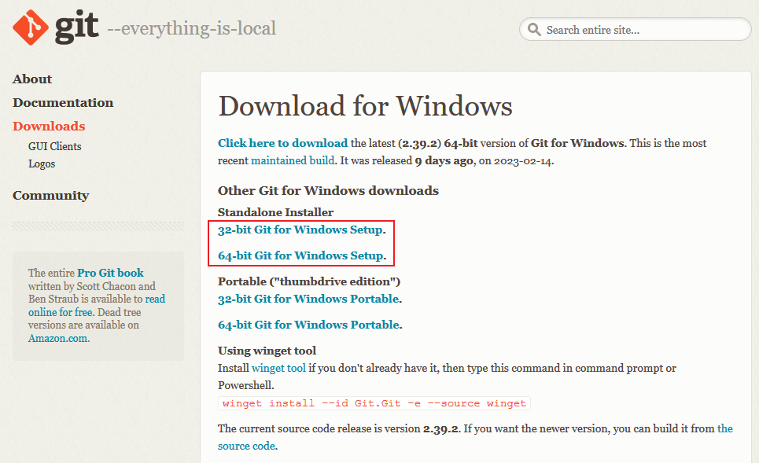

# git简介

git的作者：林纳斯 · 托瓦兹，Linux之父。

Linux：1991年。


## 版本控制简介

### 文件的版本


人肉版本控制缺点

- 操作麻烦, 每次都需要复制 → 粘贴 → 重命名
- 无法通过文件名知道具体做了哪些修改
- 容易丢失,  如果硬盘故障或不小心删除 ，文件很容易丢失
- 协作困难, 需要手动合并每个人对项目文件的修改 ，合并时极易出错

### 版本控制软件

概念: 版本控制软件是一个用来记录文件变化，  以便将来查阅特定 版本修订情况的系统，因此有时也叫做“版本控制系统”。

通俗的理解: 把手工管理文件版本的方式，改为由软件管理文件的版本； 这个负责管理文件版本的软件，叫做“版本控制软件”。

SVN

Git

### 使用版本控制软件的好处

**操作简便** 只需识记几组简单的终端命令/ 图形化界面点选操作 ，即可快速上手常见的版本控制软件

**易于对比** 基于版本控制软件提供的功能 ，  能够方便地比较文件的变化细节 ，从 而查找出导致问题的原因

**易于回溯** 可以将选定的文件回溯到之前的状态 ，甚至将整个项目都回退到过去某 个时间点的状态

**不易丢失** 在版本控制软件中 ，被用户误删除的文件 ，可以轻松的恢复回来

**协作方便** 基于版本控制软件提供的分支功能， 可以轻松实现多人协作开发时的代 码合并操作

### 版本控制软件的发展

**本地版本控制系统**


特点：使用软件来记录文件的不同版本，  提高了工作效率，降低了手动维护版本的出错率

缺点：

①  单机运行，不支持多人协作开发

②  版本数据库故障后，所有历史更新记录会丢失

**集中化的版本控制系统**（SVN）


特点：基于服务器 、客户端的运行模式

①  服务器保存文件的所有更新记录

②  客户端只保留最新的文件版本

 优点：联网运行，支持多人协作开发

缺点：

①  不支持离线提交版本更新

②  中心服务器崩溃后，所有人无法正常工作

③  版本数据库故障后，所有历史更新记录会丢失

**分布式版本 控制系统**（Git）


特点：基于服务器 、客户端的运行模式

- 服务器保存文件的所有更新版本
- 客户端是服务器的完整备份，并不是只保留文件的最新版本

 优点：

①  联网运行，支持多人协作开发

②  客户端断网后支持离线本地提交版本更新

③  服务器故障或损坏后，  可使用任何一个客户端的备份进行恢复


## Git简介

### 什么是git

Git 是一个开源的分布式版本控制系统。

- 目前世界上最先进 、最流行的版本控制系统
- 可以快速高效地处理 从很小到非常大的项目版本管理。

 特点：项目越大越复杂，协同开发者越多，越能体现出 Git 的高性能和高可用性！

Git 之所以快速和高效，主要依赖于它的如下两个特性：

①  直接记录快照，而非差异比较

②  近乎所有操作都是本地执行

在 Git 中的绝大多数操作都只需要访问本地文件和资源，一般不需要来自网络上其它计算机的信息。

特性

①  断网后依旧可以在本地对项目进行版本管理

②  联网后，把本地修改的记录同步到云端服务器即可


### Git 的安装

在开始使用 Git 管理项目的版本之前，需要将它安装到计算机上。可以使用浏览器访问如下的网址，根据自己的操作系统，选择下载对应的 Git 安装包：

https://git-scm.com/downloads




安装十分简单 一路下一步即可


安装git可视化客户端 TortoiseGit

- TortoiseGit-2.13.0.1-64bit
- TortoiseGit-LanguagePack-2.13.0.0-64bit-zh_CN(图形化界面的中文语言包)


Pycharm 中配置git


### 概念区分

~~~shell
#1.git
git是版本控制工具。它是个工具。
可以帮助团队进行更好地协作开发。
它只是众多的版本控制工具其中一个而已。比如jira，SVN。
现在行业内都用git。

#2.github
代码托管平台。全球最大的，没有之一。
换言之，放到github的代码都是开源代码。
可以让任何人在任何地方随意访问。
github被微软收购了，github是微软的了。
在工作中，如果需要查阅优秀的代码/项目，都可以来这里找找。
都是用git来操作。

#3.gitee
国内版的github，别名码云。
有了github，为什么还有有gitee呢？
github是国外的服务器，有时候需要科学上网。
用git来访问操作。

#4.gitlab
gitlab，也是类似于github的软件（免费使用），一般用于公司内部的git私仓。
公共仓库：开源的，大家都能访问的代码仓库（文件夹）。
私人仓库：闭源的，不允许别人访问的仓库。
国内的大厂，都会有自己的git内部代码平台，比如腾讯：工蜂。
~~~

git：工具，可以把代码推送到平台上。

平台：仓库。（公共仓库，私人仓库）


### git架构


解释：

~~~shell
仓库：简单理解，就是文件夹。
本地仓库：文件夹在本地创建的。图示就是版本库。
远程仓库：代码托管平台上。github、gitee、gitlab、工蜂
工作区：就是干活的地方。在哪个分支干活，哪里就是工作区。
暂存区：只是暂存代码而已，如果代码OK，没有问题，则一定要commit（提交）。

#注意：不能往主分支提交有bug的代码。最多在你自己个人分支玩玩。
~~~


### git的分支

#### 分支的概念与作用

在日常工作中，我们经常会增加/修改代码, 如新功能开发、bug修复、代码重构等等。在这些情况下, Git的分支功能会发挥巨大的作用：它允许你在代码库中创建多个不同的分支，每个分支代表着代码库的不同状态，方便开发人员在多个分支之间进行切换和修改代码。


当我们在Git中创建一个新的分支时：

- git会以当前所在分支的状态作为基础来创建一个新的分支，并保留了当前分支的所有提交历史
- 可以在新分支上独立地进行开发、修改代码，并在需要时将代码合并回原始的分支
- 可以保持代码库的**主分支干净整洁**，并且方便开发人员在不同的功能或任务之间进行切换。

Git分支还有许多其他的用途，比如

- 创建临时性的修复分支来修复线上问题
- 创建独立的实验分支用于尝试新的技术
- 创建发布分支用于发布软件版本等等

Git分支是一个非常有用的工具，可以帮助程序员更好地组织和管理代码变更，提高开发效率和代码质量


在进行多人协作开发的时候，  为了防止互相干扰，提高协同开发的体验，建议每个开发者都基于分支进行项目 功能的开发，例如：


#### 主分支(master)

在初始化本地 Git 仓库的时候，  Git 默认已经帮我们创建了一个名字叫做 master 的分支。通常我们把这个 master 分支叫做主分支。

 

在实际工作中，  master 主分支的作用是：  用来保存和记录整个项目已完成的功能代码。

因此，不允许程序员直接在 master 分支上修改代码，因为这样做的风险太高，容易导致整个项目崩溃。

#### 功能分支

由于程序员不能直接在 master 分支上进行功能的开发，所以就有了功能分支的概念。

功能分支指的是专门用来开发新功能的分支，它是临时从 master 主分支上分叉出来的，当新功能开发且测试 完毕后，最终需要合并到 master 主分支上，如图所示：


### 项目托管平台的介绍与应用

专门用于免费存放开源项目源代码的网站，叫做开源项目托管平台。目前世界上比较出名的开源项目托管平台 主要有以下 3 个：

- Github (全球最牛的开源项目托管平台，  没有之一)
- Gitlab (对代码私有性支持较好，因此企业用户较多)
- Gitee (又叫做码云，是国产的开源项目托管平台。访问速度快、纯中文界面、使用友好)

 Github 是全球最大的开源项目托管平台。只支持 Git 作为唯一的版本控制工具，GitHub可以：

①  关注自己喜欢的开源项目，为其点赞打 call

② 为自己喜欢的开源项目做贡献(Pull Request)

③ 和开源项目的作者讨论 Bug和提需求  (Issues)

④  把喜欢的项目复制一份作为自己的项目进行修改(Fork)

⑤  创建属于自己的开源项目

⑥ etc…

 本次实战使用gitee码云作为项目托管平台

#### 申请成为项目的开发者

注册码云 gitee.com

```properties
邀请链接:
https://gitee.com/pydliyong2/bj-ai20_datamining/invite_link?invite=8bcd6a8f1aff7dfe13e57fb077552b4117fd9589c2d6dae1b7993663152babc56ee66f6e158e423a03eac9232b9ccfc5
```


```properties
在申请之前, 首先需求先将自己的账户名字更改为:  组号_姓名  如果不是此格式, 不允许通过 
	例如名字为:  组名_姓名拼音
```

如何更改用户名:


#### 进行克隆并完成分支切换

前期确认工作:

* 1- 首先确认在码云是否配置了SSH公钥信息


如何生成公钥:

在windows下我们可以使用 Git Bash.exe来生成密钥，可以通过开始菜单或者右键菜单打开Git Bash


git bash 执行命令,生命公钥和私钥

命令: ssh-keygen -t rsa

（四个回车即可。）


执行命令完成后,在window本地用户.ssh目录C:\Users\用户名\ .ssh下面生成如下名称的公钥和私钥:


id_rsa.pub文件 用记事本打开, 复制里面的内容, 放到下面截图中 对应的文本框中既可。

ssh 密钥配置

​	密钥生成后需要在码云上配置密钥本地才可以顺利访问


>在key部分将id_rsa.pub文件内容添加进去，然后点击“Add SSH key”按钮完成配置

配置完后，就可以从Gitee远程仓库拉取代码到本地了。

#### 拉取代码

##### 命令


* 1- 在本地磁盘上, 随便找一个目录. 右键点击克隆


##### 使用Pycharm（推荐）

点击如下按钮，输入git链接，点击clone即可。


开发的时候, 多次commit 不一定每次都要push

- 操作的时候, 需要注意, commit/push 有bug的代码 不要做commit/push的操作
- 不commit 直接push , 操作是允许的, 但是没有实际效果
  - push 的内容, 都是commit之后的

回退到之前版本

选择某一次提交, 然后checkout


首次，会提示yes or no，填写**yes**


- code 项目py文件 和 notebook文件
- PD 项目文档
- Memo  开发的过程中, 遇到了哪些问题, 如何解决的, 在这里记录


切换到对应组的分支上

git clone 后 用pycharm打开对应文件夹

设置git  在设置中配置git安装路径


打开版本控制功能


弹出窗口中选择 

切换分支


新建分支


新建分支之后, push一下, 在gitee中可以看到新建的分支

后续就可以在pycharm中开发, 在自己的分支中开发, 开发后, 把相关的内容 提交到仓库中即可, 并且可以每日推送到远端仓库

- git提交操作
  - commit  提交到本地
  - push  推送到远端

- 如果代码有了修改, 先commit 然后在push  可以多次commit 只要commit之后就会有快照, 就可以恢复之前的状态, push之后, 会吧所有的commit都提交到远端, 你的小伙伴就可以看到你的代码了


- 提交的时候需要注意
  - .idea目录下的文件不要提交

- git 更新
  - 提交之前, 要先pull 一下 确认把远端最新的代码更新下来

**git Merge 操作**

A 分支 的内容  Merge到 B (group_0X)分支，A分支要Merge 到B分支的内容要先 commit  push

check out 到B(group_0x)分支


右键单击 文件夹 git → merge


选择从哪个分支里merge 点击Merge

此时是Merge到本地, 再push到远端


冲突的解决

- 多个人改同一份代码可能就会出现冲突问题


