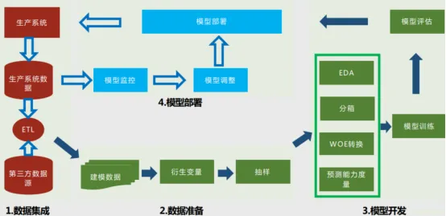
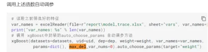
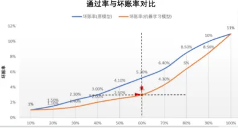
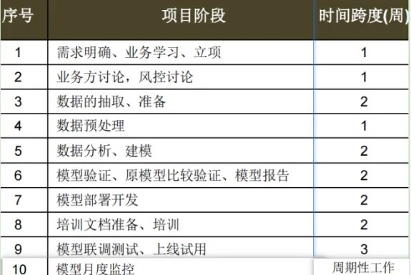

# 金融风控项目文档

## 为什么要做这个项目

联动汽车是一家汽车抵押贷款服务提供商。依托线下直营门店，构建了汽车抵押贷款平台，通过线上APP及线下渠道，搭建线上经纪人网络，提供汽车抵押贷款服务。贷款业务是公司重要的资产业务和主要赢利手段之一,风控主要针对两类风险,信用风险,信用评分系统是针对信用风险的有效手段,通过对客户特征建模评分来判断客户是不是目标客群,要不要放款,给多少额度,多少利率,多少期,从而把贷款放给有还款能力的人,拒绝逾期不还用户,减少坏账,以达到控制风险的目的,传统人工审批对人员业务能力要求高,对比传统人工审批,基于机器学习的风控模型能准确迅速地同时处理大量贷款请求.

联动汽车已经为500w客户提供了消费借贷服务,客户来自于两个渠道,预授信和自主申请,

其中预授信是公司通过原有信用评级对已有活跃用户打分,满足要求的，直接给予授信额度；客户在实名认证后可以直接使用该额度。预授信客户中还包括了公司员工、股东员工等特殊渠道客户群体。

自主申请客户是指自主发起申请、主动提交实名认证的客户，这部分客户包括了因预授

信评分过低未被预授信的用户、以及原来非用户的新客户。

数据汇总后可以看出客户主要分为三大类,预授信,特殊渠道客户、自主申请客户，

其中预授信客户最多，占比达到95%以上,预授信实际使用额度的客户数17w,约占3%

自主申请客户通过率10%,使用客户数1.4w,通过后使用率80%

## 项目架构 

开发过程主要有以下八个步骤

◼ 评分卡开发观察期和表现期

◼ 违约定义和建模样本筛选

◼ 客户分群分析

◼ 数据收集和变量开发

◼ 变量探索性分析

◼ 变量筛选及模型拟合

◼ 评分模型校准

◼ 评分卡最终模型变量

### 观察期和表现期 

客户的申请时间或预授信时间作为观察点,观察点前12个月作为观察期,观察期内会对客群进行数据收集从而衍生特征变量

表现期时长为3个月,起点为首次还款日之后15天

### 建模样本筛选 

通过对不同时间点客户逾期状态保持的分析,逾期超过 15 天后，逾期状态基本稳定，所以逾期超过 15 天的客户为坏客户,逾期<5天为好客户

逾期5～15天的数据作为灰样本从样本中去掉

为了最大化区分好坏使模型开发样本具有代表性,排除不需预测的老赖和欺诈客户,或者表现时间长度不足以判定是否是”坏”客户的客户.

剩下的客户分为两类,好客户以0标识,坏客户以1标识 

由于好坏客户比例比较悬殊,后续用到机器学习的部分会针对样本不均衡进行调整

### 训练测试数据划分 

开发样本与验证样本使用分层划分,保证负样本占比相同

设置开发样本(train)验证样本(test)比例64%:36%

时间外样本使用最近1个月的数据验证对未来样本的预测能力和模型跨时间稳定性

### 客户分群 

客户分群的目的是最大化整个评分系统模型的预测能力。通过建模样本筛选我们发现客户中预授信客户和自主申请客户在逾期行为上表现出显著差异，因此将客户细分为预授信客户、自主申请客户、以及预授信客户中的特殊渠道客户

由于特殊渠道客户有特殊授信政策,不对他们建立评分模型

所以项目只分别对一般预授信客户和自主申请客户分别建模

### 变量探索性分析EDA 

变量分为数值型和离散型变量

针对数值型变量,分析变量的基本统计指标如mean,std,max,min,p5,p10,p25,p50,p90等分位值,观察分布是不是合理

离散型变量观察变量值的分布

如果变量值分布异常或者不符合业务,检查变量衍生和数据源是否有问题,开发逻辑是否正确,如果有问题进行调整,直到全部变量值分布合理为止

### 数据收集和变量开发 

项目涉及的数据源主要分为公司内部数据源表数据和三方征信数据,变量开发首先针对内部数据源表数据划分为客户身份特征,消费行为历史,金融资产状况,用户画像描述,线上行为轨迹,线下行为轨迹这样6个维度,加入征信数据作为第七个维度,对这些维度进行变量的衍生和开发.

拿到维度后对维度特征再进行细分,比如消费行为历史,衍生出消费金额,消费次数,单笔最高消费金额等变量.合计开发400多个变量

衍生方法包括聚合求mean,sum,count,min,max,结合RFM衍生等

### 评分模型拟合和评估 

#### 预授信客户模型 

数据收集变量开发后,要进行变量的筛选,变量的筛选分为单变量筛选和多变量筛选

##### 单变量筛选 

筛选前有455个开发变量

封装了iv.py,psi.py,bivar.py

调用方法计算出IV. PSI, 绘制bivar图,根据各方法对应的结果进行特征筛选

IV小于0.02,缺失值大于0.5,相关性大于0.7的特征删除

PSI 大于0.25的特征删除

根据bivar图, 训练集, 测试集, 时间外样本上单调性表现差距较大的特征删除

得到21个变量

##### 多变量筛选 

拿到单变量筛选留下来的21个变量后,首先用boruta算法过滤掉不重要的特征,我们import sklearn定义一个随机森林分类器,因为项目中正负样本比例悬殊,使用代价敏感加权,把分类权重设为class_weight=’balanced’

From boruta import borutaPy 最大迭代系数max_iter设置为10

然后对留下的变量计算VIF方差膨胀系数评估共线性程度,剔除VIF>3的

得到15个变量

##### 特征监控 

授信前监控稳定性PSI 保持<0.1,如果>0.25更新模型 缺失率是否单调降低

放款之后监督特征区分度保持AUC/KS 波动在10%以内

分箱风险区分：监控每个特征的**风险趋势单调性**

##### 模型训练与拟合 

用xgboost对模型进行训练和拟合

数据切分用model_selectiion 的train_test_split 设置test_size为0.36  

1

用XGBoost封装了几个方法进行模型训练,方法包括

training 模型训练

outputScore 计算每个样本的预测概率并保存

sloveKS 计算模型的KS值

slovePSI 计算模型稳定性PSI值

writeVarImportance 保存XGBoost模型输出的特征重要性

plotKS 输出KS值报告保存到Excel表中

auto_choose_params 自动调参

auto_delete_vars 依据特征重要性自动删除特征

2

针对几个重要的参数做自动化调优，用xgboost算法封装了

自动调参方法auto_choose_params 

使用穷举法不断调整XGBoost的重要参数，每调整一次计算一次KS值，通过对比参数调整前后的KS值来确定最优参数组合，auto_choose_param的参数是调参目标,目标有4种,包装在target_value方法中

"offks": offks最大化;

"minus": 1-abs(devks-offks) 最大化;

"avg": (devks+offks)/2 最大化

"weight": offks + abs(offks - devks) * 0.2 最大

先尝试增加参数，如果效果不好再反方向调整参数,当目标值劣化的时候停止调整

(check_param)

调用方法调参后得到参数,保存用于模型训练learning rate设置为0.09 min_child_weight=110

3

通过特征重要性进行特征自动筛选

首先进行粗筛: 通过特征重要性大小设置阈值, 批量删除不重要的特征

通过min_score参数设置删除特征的阈值0.00001(重要性小于这个值?太小吧?)

通过max_del_var_nums参数, 控制最多删除特征数量(=0?)

每次计算的特征重要性, 保存到Excel文件中

精筛

每次去掉一个特征，通过对比去掉特征前后的KS值大小， 决定是否删除某个特征

循环遍历所有特征，将将结果保存到文件中

模型最终得到9个特征, ks从使用xgboost前的0.452-0.474提升2个百分点

##### 评分映射 

◼ 校准目的

1) 将预测概率转换为评分，便于使用，业界都是使用评分

2) 使不同客户群体的评分具有可比性、一致性、标准化

◼ 校准公式

主要根据公式Score＝factor*Ln(Odds)+offset 进行概率到评分的转换。其中 Odds 是好

坏比，即好人数比坏人数，其对应一定的”坏客户”的概率。

◼ 校准参数(基础分600 步长15)

p Base Point = 600，为基准分值

p Odds = 15:1，为基准的 Odds 比 p Point Double Odds = 15，将 Odds 比值翻倍需要增加的分数

Score=600+15log2(P正样本/P负样本)

ln(P正样本/P负样本)=w1x1+w2x2+w3x3+......

log2(P正样本/P负样本)=ln(P正样本/P负样本)/ln2=w1x1+w2x2+w3x

只需要解出逻辑回归中每个特征的系数，然后将样本的每个特征值加权求和即可得到客户当前的标准化信用评分

##### 模型评价 

在评分模型开发完成之后，还需要评价模型区分能力和稳定性。

ks为0.49 最大区分能力很强

Auc为0.8 模型对好坏样本整体区分能力较强

## 模型选择 

逻辑回归是汽车金融风控建模中较为主流、传统的算法，具有相对稳定和可解释的优点

基于决策树的集成模型是目前效果较为理想的模型，如XGBoost， XGBoost是GBDT的改进算法，提高

优化速度的同时，通过对损失函数做二阶泰勒基数展开，提高模型泛化能力。

LightGBM主要是针对海量训练数据时提高训练速度做了相应优化， 包括基于直方图的特征扫描方式，基于梯度的单边特征采样等基数来加快训练速度。

在汽车金融客群上， XGB模型通常会比LR模型区分度要好， KS的差距在5个百分点左右

## 项目效果 

采用模型后效果更佳，通过率在60%的情况下，坏账率由5.2%下降到3%，大幅度提升了资产质量

通过应用大数据机器学习模型，减少了高低分段的人工审批环节，审批效率提高，且审批成本下降

节省了高分段和低分段的审批人员：审批人力成本下降约43%

低分段 550分一下： 直接拒接（28%）

中分段 550~700分 人工审核 （57%）

高分段 700分以上：直接通过（15%）

节省了高分段和低分段的审批时间：件均审批时间下降，审批效率提高

## 项目进度 

  