# 金融风控实战

## 一 实战业务和数据介绍

### 数据来源

作为一家持牌消费金融公司，捷信消费金融有限公司于2010年底正式在中国成立，为中国客户提供消费金融服务，其股东为国际领先的消费金融服务提供商捷信集团。

捷信消费金融有限公司的母公司PPF集团是中东欧地区最大的国际金融和投资集团之一。捷信集团在包括中国在内的全球10个国家开展业务，服务的客户总数已经超过了1.06亿，活跃客户2,900万，拥有超过42万个线下贷款服务网点。

项目实战数据来源为捷信和Kaggle一起合作的数据比赛

- 捷信的目标客群是无法从银行获得贷款的客户. 该公司通过用户的电信和电商交易数据来预测用户的还款能力.
- 捷信把部分脱敏的用户数据放到Kaggle上通过比赛, 获取更多的建模方案

### 数据介绍

捷信提供的数据集包含许多有关借款人的详细信息。 数据分别在多张表中保存，其中包含申请人的性别、年龄、家庭成员人数、职业等相关领域的静态数据，申请人从征信部门获得的过往信用记录，以及申请人在捷信集团内部的过往信用记录 。 该数据集是一个不平衡的数据集，所有申请人中只有少数人违约

捷信集团一共提供了8张表, 用来保存与风控业务相关的数据.具体介绍如下

#### application_{train|test}.csv

**主表, 分成两个文件保存**, application_train (包含 是否违约的标签) 和application_test (不带标签).

application表中记录了申请人的基本静态信息. 一行数据代表了一个申请人

具体数据字段说明如下:

- `NAME_CONTRACT_TYPE`: 合约类型, 现金贷还是循环授信(消费贷)
- `CODE_GENDER` / `NAME_FAMILY_STATUS` / `CNT_CHILDREN` / `CNT_FAM_MEMBERS`: 客户的性别/客户的家庭状况/孩子的数量/家庭成员的数量
- `OCCUPATION_TYPE` / `ORGANIZATION_TYPE`: 客户有什么样的职业和雇主组织类型
- `DAYS_BIRTH`: 客户在申请时的年龄（以天为单位）
- `DAYS_EMPLOYED`: 该人在申请前多少天开始目前的工作
- `DAYS_REGISTRATION` : 客户在申请前多少天更改了他的注册
- `DAYS_ID_PUBLISH`: 客户在申请前多少天更改了身份证件
- `NAME_EDUCATION_TYPE`: 客户的最高学历
- `FLAG_OWN_CAR` (`OWN_CAR_AGE`) 和`FLAG_OWN_REALTY`: 分别标记客户是否拥有汽车（及其年龄）或房屋（公寓）
- `FLAG_PHONE` / `FLAG_MOBIL` / `FLAG_WORK_PHONE` / `FLAG_EMP_PHONE`: 客户是否提供了家庭/手机/工作/雇主电话
- `FLAG_CONT_MOBLE`: 是否可以使用手机
- `DAYS_LAST_PHONE_CHANGE`: 自上次更换手机以来的天数
- `FLAG_EMAIL`: 客户是否提供电子邮件
- `REG_REGION_NOT_LIVE_REGION`: 如果客户的永久地址与联系地址不匹配，则进行标记
- `REG_REGION_NOT_WORK_REGION`: 如果客户端的永久地址与工作地址不匹配，则进行标记
- `LIVE_REGION_NOT_WORK_REGION`: 标记客户的联系地址是否与工作地址不匹配
- `REG_CITY_NOT_LIVE_CITY`: 如果客户的永久地址与联系地址不匹配，则进行标记
- `REG_CITY_NOT_WORK_CITY`:如果客户端的永久地址与工作地址不匹配，则进行标记
- `LIVE_CITY_NOT_WORK_CITY`: 标记客户的联系地址是否与工作地址不匹配
- `NAME_HOUSING_TYPE`: 客户的住房情况（租房、与父母同住……）

- application表中还包含了很多带后缀的字段, 各种 后缀分别对应平均值（ _ AVG）、方式（_ MODE）和中位数（_MEDI
  - `APARTMENTS_TAG`：公寓大小
  - `BASEMENTAREA_TAG`：？？？
  - `YEARS_BEGINEXPLUATATION_TAG`：建筑开发的开始
  - `YEARS_BUILD_TAG`：建筑年龄
  - `COMMONAREA_TAG`：公共区域
  - `ELEVATORS_TAG`：电梯数量
  - `ENTRANCES_TAG`：入口数量
  - `FLOORSMIN_TAG / FLOORSMAX_TAG`：楼层数
  - `LANDAREA_TAG`：？？？
  - `LIVINGAPARTMENTS_TAG / NONLIVINGAPARTMENTS_TAG`：？？？
  - `LIVINGAREA_TAG / NONLIVINGAREA_TAG` ：生活区加上
  - 一些只有 _MODE 后缀的变量：
  - `FONDKAPREMONT_MODE`：？？？
  - `HOUSETYPE_MODE`：房屋类型
  - `TOTAL_AREA_MODE`：总面积
  - `WALLSMATERIAL_MODE`：墙壁材质
  - `EMERGENCYSTATE_MODE`：紧急状态
- application表中的其它相关信息
  - `REGION_POPULATION_RELATIVE`：客户居住地区的标准化人口
  - `AMT_INCOME_TOTAL 和 NAME_INCOME_TYPE`：客户收入和客户收入类型（商人、工作、产假……）
  - `AMT_CREDIT`：贷款金额
  - `AMT_ANNUITY`：贷款年金
  - `AMT_GOODS_PRICE`：对于消费贷款，它是提供贷款的商品的价格
  - `NAME_TYPE_SUITE`：客户申请贷款时的陪同人员
  - `WEEKDAY_APPR_PROCESS_START / HOUR_APPR_PROCESS_START` ：客户在一周中的哪一天/小时申请贷款
  - `REGION_RATING_CLIENT / REGION_RATING_CLIENT_W_CIY`：捷信对客户所在地区/占城市的评级
  - `EXT_SOURCE_1 / EXT_SOURCE_2 / EXT_SOURCE_3` ：来自外部数据源的标准化分数
  - `OBS_30_CNT_SOCIAL_CIRCLE / DEF_30_CNT_SOCIAL_CIRCLE`：逾期 30 天观察到的客户社会环境观察结果以及违约人数
  - `OBS_60_CNT_SOCIAL_CIRCLE / DEF_60_CNT_SOCIAL_CIRCLE`：逾期 60 天观察到的客户社会环境观察结果以及违约数量
  - `FLAG_DOCUMENT_X`：如果客户提供文件 nºX (X∈[2-21])
  - `AMT_REQ_CREDIT_BUREAU_tag with tag in [HOUR, DAY, WEEK, MON, QRT, YEAR]`：申请前一小时（天、周、...）查征信的次数

#### bureau.csv

**所有用户的征信情况(由其它金融机构上报)**

- 每一个用户可能会有多条征信记录, 用户每次申请贷款都会查询征信, 历史的征信记录都会保存
- 具体数据字段:
  - `SK_ID_CURR`：贷款ID
  - `SK_BUREAU_ID`：与本次贷款相关的征信 ID
  - `CREDIT_ACTIVE`：(CB 征信部门) 报告信用的状态
  - `CREDIT_CURRENCY`：信用局信用的重新编码货币
  - `DAYS_CREDIT`：客户在当前申请前多少天查了征信
  - `CREDIT_DAY_OVERDUE`：征信部门记录的信用的逾期天数
  - `DAYS_CREDIT_ENDDATE`：当前征信记录有效期距申请 Home Credit 贷款的时间间隔 (以天为单位）
  - `DAYS_ENDDATE_FACT`：自申请 Home Credit 时征信记录结束以来的天数（only for closed credit）
  - `AMT_CREDIT_MAX_OVERDUE`：征信记录中的最大逾期天数
  - `CNT_CREDIT_PROLONG`：征信记录中延期次数
  - `AMT_CREDIT_SUM`：征信记录中的总授信额度
  - `AMT_CREDIT_SUM_DEBT`：征信记录中的总负债
  - `AMT_CREDIT_SUM_LIMIT`：信用局报告的信用卡当前信用额度
  - `AMT_CREDIT_SUM_OVERDUE`：征信记录中当前逾期金额
  - `CREDIT_TYPE`：征信记录中的授信类型（车贷、现金贷……）
  - `DAYS_CREDIT_UPDATE`：最后一次征信更新距离申请贷款天数
  - `AMT_ANNUITY`：征信年金

#### bureau_balance.csv

**历史征信记录, 记录了逾期情况**

- 一个用户会有多条记录, 一条记录代表了过去某个月份的DPD情况
- 具体字段说明:
  - `SK_ID_BUREAU`: 与bureau.csv 中的SK_BUREAU_ID对应
  - `MONTHS_BALANCE`:  申请日前第n个月的DPD状态
  - `STATUS`:  违约状态 C 关闭  X 未知  0 没有违约  1 : DPD1~DPD30  2: DPD30~DPD60  5: DPD120+

#### POS_CASH_balance.csv

**申请人以前使用捷信获得的 POS（销售点）和现金贷款的月度余额快照**

- 表中的一条数据记录了申请人在当前申请之前, 每个月的历史数据(消费贷和现金贷), application表中每一个用户, 对应N条历史信用数据, 代表了该用户在前N个月在捷信的历史信用
- 具体字段说明:
  - `SK_ID_CURR`: loan ID
  - `SK_ID_PREV`: 在捷信之前贷款业务的ID
  - `MONTH_BALANCE`: 申请日前第n个月的信用状态, -1 代表前一个月, 0 代表当前月
  - `CNT_INSTALMENT`: 前期业务的授信期限 (can change over time)
  - `CNT_INSTALMENT_FUTURE`: 未还的分期付款额度
  - `NAME_CONTRACT_STATUS`: 当前月份的合约状态
  - `SK_DPD`: 之前贷款当前月份的DPD情况
  - `SK_DPD_DEF`: 之前贷款当前月份的DPD情况(忽略小额贷款)

#### credit_card_balance.csv

**申请人以前使用捷信信用卡的月度余额快照**

- 表中的一条数据记录了申请人在当前申请之前, 每个月的捷信信用卡使用情况历史数据, application表中每一个用户, 对应N条历史信用数据, 代表了该用户在前N个月在捷信的历史信用

- 具体字段说明

  - `SK_ID_PREV`:   在捷信之前贷款业务的ID

  - `SK_ID_CURR`:  loan ID

  - `MONTHS_BALANCE`: 申请日前第n个月的信用状态, -1 代表前一个月, 0 代表当前月

  - `AMT_BALANCE`  Balance during the month of previous credit (上一个用信月份的额度余额)

  - `AMT_CREDIT_LIMIT_ACTUAL`  Credit card limit during the month of the previous credit (上一个用信月份的信用卡限额)

  - `AMT_DRAWINGS_ATM_CURRENT`  previous credit ATM月取款金额

  - `AMT_DRAWINGS_CURRENT`  previous credit 提现金额 

  - `AMT_DRAWINGS_OTHER_CURRENT`  Amount of other drawings during the month of the previous credit 月其它提款金额

  - `AMT_DRAWINGS_POS_CURRENT`  Amount drawing or buying goods during the month of the previous credit 上一信用当月提款或购物的金额

  - `AMT_INST_MIN_REGULARITY`  Minimal installment for this month of the previous credit 最小分期付款

  - `AMT_PAYMENT_CURRENT`  How much did the client pay during the month on the previous credit

  - `AMT_RECEIVABLE_PRINCIPAL`  Amount receivable for principal on the previous credit

    之前信贷的本金应收金额

  - `AMT_RECIVABLE`  Amount receivable on the previous credit 之前信用的应收金额

  - `AMT_TOTAL_RECEIVABLE`  Total amount receivable on the previous credit 上一次信用的应收总金额

  - `CNT_DRAWINGS_ATM_CURRENT`  Number of drawings at ATM during this month on the previous credit 上一笔信贷本月在ATM上取款次数

  - `CNT_DRAWINGS_CURRENT`  Number of drawings during this month on the previous credit

    上一笔信贷本月取款次数

  - `CNT_DRAWINGS_OTHER_CURRENT`  Number of other drawings during this month on the previous credit

    本月之前贷方的其他提款数量

  - `CNT_DRAWINGS_POS_CURRENT`  Number of drawings for goods during this month on the previous credit 

    上次贷记本月提货次数

  - `CNT_INSTALMENT_MATURE_CUM`  previous credit已经支付的分期数量

  - `NAME_CONTRACT_STATUS`   本条申请记录的合约状态( (active signed,...)

  - `SK_DPD`  之前贷款当前月份的DPD情况

  - SK_DPD_DEF 之前贷款当前月份的DPD情况(忽略小额贷款)

#### previous_application.csv

**历史申请记录表**

- 一行代表了主表中每一个用户, 之前的每一次申请
- 具体字段说明:
  - `SK_ID_CURR`: loan ID
  - `SK_ID_PREV`: 历史申请ID
  - `NAME_CONTRACT_TYPE`: 历史申请产品类型 (现金贷 消费贷 ,...) 
  - `AMT_ANNUITY`: Annuity of previous application 上次申请的年费
  - `AMT_APPLICATION`: 本条申请记录申请的额度
  - `AMT_CREDIT`: 本条申请记录的最终授信额度. 与 AMT_APPLICATION 可能会不一致, 这里记录的是经过审核后的最终授信额度
  - `AMT_DOWN_PAYMENT`: 本条申请记录申请的首付
  - `AMT_GOODS_PRICE`: 本条申请的消费贷商品价格 (如使用) 
  - `WEEKDAY_APPR_PROCESS_START`: 本条申请记录的申请星期数据(星期1, 星期2...)
  - `HOUR_APPR_PROCESS_START`: 本条申请记录对应的时间
  - `FLAG_LAST_APPL_PER_CONTRACT`:标记是否是上一个合约的最后一次申请。 有时由于客户或我们的文员的错误，一份合同可能会有多次申请
  - `NFLAG_LAST_APPL_IN_DAY`: 标记本条记录对应的申请是否是客户当天的最后一次。 有时客户一天可能申请多次,  一次申请在数据库中两次出现在我们的系统中很少发生
  - `NFLAG_MICRO_CASH`: 小额贷款标记
  - `RATE_DOWN_PAYMENT`: 本条申请记录的标准化首付率
  - `RATE_INTEREST_PRIMARY`: 本条申请记录的标准化利率
  - `RATE_INTEREST_PRIVILEGED`: 本条申请记录的标准化利率
  - `NAME_CASH_LOAN_PURPOSE`: 现金贷的使用目的
  - `NAME_CONTRACT_STATUS`: 本条申请记录的合约状态(approved 通过, cancelled取消, ...) 
  - `DAYS_DECISION`:本条申请记录的距今时间, 仅与申请时间相关
  - `NAME_PAYMENT_TYPE`: 本条申请记录, 用户选择的支付方式
  - `CODE_REJECT_REASON`: 本条申请记录被拒绝的原因(编码)
  - `NAME_TYPE_SUITE`: 本条申请记录, 客户的陪同人
  - `NAME_CLIENT_TYPE`: 本条申请记录对应的客户是新客还是老客
  - `NAME_GOODS_CATEGORY`: 本条申请记录客户要购买的商品类别
  - `NAME_PORTFOLIO`: 本条申请记录对应的申请类型, 现金贷, 消费贷, 车贷
  - `NAME_PRODUCT_TYPE`:本条申请记录是 x-sell o walk-in
  - `CHANNEL_TYPE`: 本条申请记录对应的客户的获客渠道
  - `SELLERPLACE_AREA`: 本条申请记录对应的卖家的销售区域
  - `NAME_SELLER_INDUSTRY`: 卖家的行业
  - `CNT_PAYMENT`: 本条记录对应的申请的授信期数
  - `NAME_YIELD_GROUP`: 本条申请记录对应的利率水平, 低中高
  - `PRODUCT_COMBINATION`: 本条申请记录对应的详细产品组合
  - `DAYS_FIRST_DRAWING`: 本条申请记录的第一次付款时间相隔天数（相对当前贷款的申请日期）
  - `DAYS_FIRST_DUE`: 本条申请记录的首次到期时间相隔天数（相对当前贷款的申请日期）
  - `DAYS_LAST_DUE_1ST_VERSION`: 本条申请记录的首次逾期时间相隔天数（相对当前贷款的申请日期）
  - `DAYS_LAST_DUE`: 本条申请记录的最后一次到期时间相隔天数（相对当前贷款的申请日期）
  - `DAYS_TERMINATION`: 本条申请记录的预期终止时间相隔天数（相对当前贷款的申请日期）
  - `NFLAG_INSURED_ON_APPROVAL`: 客户在之前的申请中是否要求过保险

#### installments_payments.csv

- 与我们样本中的贷款相关的 分期付款的还款历史。
- a) 每笔付款都有一行， b) 未付款每笔一行。
- 一行数据代表了历史的分期付款一期的付款情况
- 具体字段说明
  - `SK_ID_CURR`: loan ID
  - `SK_ID_PREV`: ID of previous credit in Home
  - `NUM_INSTALMENT_VERSION`:以前信用分期计划版本（0 代表信用卡）。 每月分期付款版本的变化意味着付款计划的某些参数发生了变化
  - `NUM_INSTALMENT_NUMBER`: 我们观察付款的分期付款
  - `DAYS_INSTALMENTS`: 原信用分期本应支付的时间（相对于本期贷款的申请日期）
  - `DAYS_ENTRY_PAYMENT`:以前的信用分期实际支付是什么时候（相对于当前贷款的申请日期）
  - `AMT_INSTALMENT`:当前记录对应的分期付款金额是多少
  - `AMT_PAYMENT`: 用户当期分期的实际支付金额

#### 表与表之间的ER图

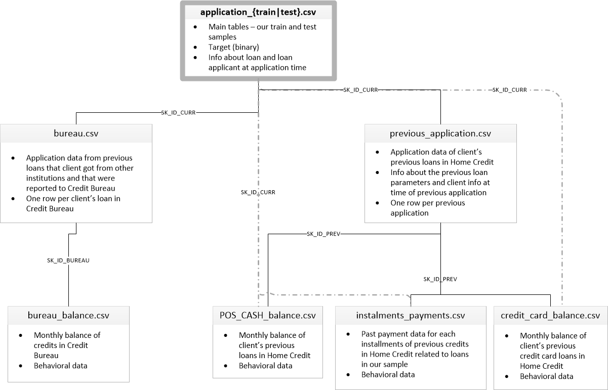

### 覆盖度统计

数据类型转换降级

```python
def optimize_int_and_float(df):
    df_int = df.select_dtypes(include=['int64'])
    df_int_converted = df_int.apply(pd.to_numeric, downcast='integer')
    df_float = df.select_dtypes(include=['float64'])
    df_float_converted = df_float.apply(pd.to_numeric, downcast='float')
    df_object = df.select_dtypes(include=['object'])
    return pd.concat([df_int_converted,df_float_converted,df_object],axis=1)
```

调用

```python
appliation_train = optimize_int_and_float(appliation_train)
```


申请数据记录在application表中, 我们建模时要依赖剩余6张表, 统计数据覆盖度, 目的是为了计算申请的用户中, 有多少人有历史用信数据。如果application表中大部分申请人在剩余6张表没有对应记录（覆盖度太低）, 那么我们无法使用其余6张表的历史用信数据进行建模。

#### 封装计算覆盖度函数

显示申请表的基本情况

```python
def show_application_detail(application, show_detail=False):
    """
    application: 申请数据
    show_detail: 是否显示详细数据
    """
    users = application['SK_ID_CURR'].nunique()
    default_users = len(application[application['TARGET'] == 1]['SK_ID_CURR'].unique())
    if show_detail:
        rows = application['SK_ID_CURR'].shape[0]
        print("# 申请表中数据条目数: ", rows)
        print("# 申请表中申请用户数量: ", users)
        print("# 申请表中违约用户数量: ", default_users)
        ratio = default_users / users
        print("% 的申请用户违约: ", ratio)
    return users, default_users
```

计算覆盖度

```python
def calc_coverage(application, right_table, table_name, key='SK_ID_CURR'):
    """
    application: 申请数据
    right_table: 用于计算覆盖度的表
    table_name: 表名
    key: 用于与申请表连接的字段
    """
    users, default_users = show_application_detail(application)
    # rows = len(right_table[key])
    # tab_users = len(right_table[key].unique())
    # print("# rows in", table_name, rows)
    # print("# users in", table_name, tab_users)
    joined_table = application.merge(right_table, on=key, how='inner')
    covered_users = len(joined_table[key].unique())
    print("# all users covered by", table_name, covered_users)
    covered_ratio = covered_users / users
    print("% all users covered by", table_name, covered_ratio)
    pos_covered_users = len(joined_table[joined_table['TARGET'] == 1][key].unique())
    print("# default users covered by", table_name, pos_covered_users)
    pos_covered_ratio = pos_covered_users / default_users
    print("% default users covered by", table_name, pos_covered_ratio)
```

#### 计算覆盖度

加载数据

```python
%load_ext autoreload 
%autoreload 2
#在执行代码前，重新装入 软件的扩展和模块
import sys
import os

sys.path.insert(0, os.path.abspath('../'))

%matplotlib inline

from preprocessor import *
from coverage import *

data_path = f"{os.path.abspath('.')}/home-credit-default-risk/"

application_train, bureau, bureau_balance, credit_card_balance, \
installment_payments, pos_cash_balance, previous_application = load_data(data_path)
```

基本统计

```python
application_train.dtypes
```

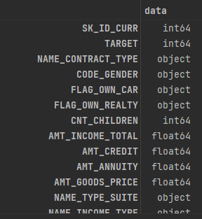

```python
application_train.describe()
```

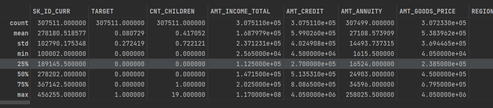

```python
application_train['TARGET'].plot.hist()
```

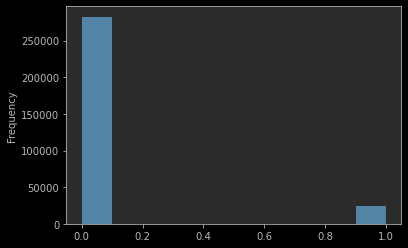

```python
_, _ = show_application_detail(application_train, show_detail=True)
```

>申请表中数据条目数:  307511
>申请表中申请用户数量:  307511
>申请表中违约用户数量:  24825
>申请表中用户违约率:  0.08072881945686496

统计覆盖度

```python
calc_coverage(application_train, bureau, 'bureau')
bureau_ = bureau.merge(bureau_balance, on='SK_ID_BUREAU', how='inner')
 (application_train, bureau_, 'bureau_balance')
calc_coverage(application_train, pos_cash_balance, 'pos_cash_balance')
calc_coverage(application_train, credit_card_balance, 'credit_card_balance')
calc_coverage(application_train, installment_payments, 'installment_payments')
calc_coverage(application_train, previous_application, 'previous_application')
```

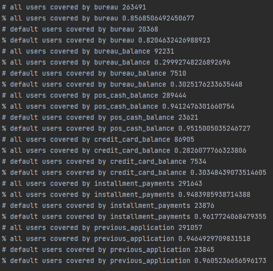

统计上次申请数据(previous_application)的覆盖度

```python
previous_application_ = previous_application[[x for x in previous_application.columns if x != 'SK_ID_CURR']]
pos_cash_balance_prev = previous_application_.merge(pos_cash_balance, on='SK_ID_PREV', how='inner')
credit_card_balance_prev = previous_application_.merge(credit_card_balance, on='SK_ID_PREV', how='inner')
installment_payments_prev = previous_application_.merge(installment_payments, on='SK_ID_PREV', how='inner')

calc_coverage(application_train, pos_cash_balance_prev, 'pos_cash_balance')
calc_coverage(application_train, credit_card_balance_prev, 'credit_card_balance')
calc_coverage(application_train, installment_payments_prev, 'installment_payments')
```

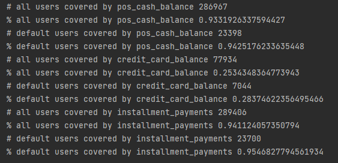

结论: 从计算出的覆盖度中看出，bureau_balance 和 credit card balance 覆盖度较低 (<30%)，其他表的覆盖度较高       

### 查看每张表的数据基本情况

这里我们只以 application 表为例

我们使用toad库提供的detect方法, 来查看数据的基本情况, 并着重查看各字段的IV值, IV值过小的字段在后续处理中需要过滤掉

```python
application_check = toad.detect(application_train)
application_check.head(10)
```

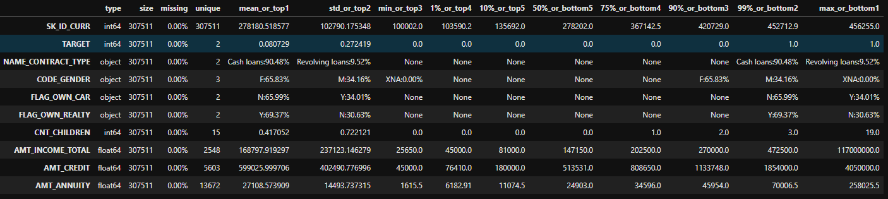

```python
print('top 10 features with high iv')
display(toad.quality(application_train.drop('SK_ID_CURR',axis=1),'TARGET',iv_only=True)[:10])  #display 保证数据一定会显示
print('last 10 features with low iv')
display(toad.quality(application_train.drop('SK_ID_CURR',axis=1),'TARGET',iv_only=True)[-10:])
```

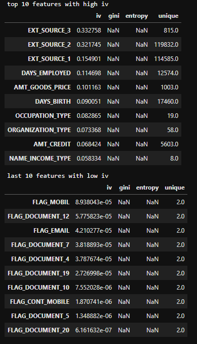

toad.quality(application_train.drop('SK_ID_CURR',axis=1),'TARGET',iv_only=True) 只计算iv值

从上面的结果中看出, 低IV的特征还是很多的, 后续特征处理时可以去掉

#### 结论


- 有些表中有缺失值很高的字段, 在实战中需要处理中高缺失值特征
- application(主表)中低IV的特征去掉

* 使用toad的quality  设置 iv_only = True来只计算IV

### 缺失和异常值处理

#### 处理 application表

application表为主要用到的申请数据表, 先查看数据基本情况

```python
application.shape
```

> (307511, 122)

从上面的结果中看出, 一共有122列, 我们通过info()方法查看详情

```python
application.info()
```

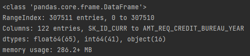

由于列数太多, info方法并没有显示出所有列的具体信息, 如果想显示所有列的数量和空值情况可以通过添加参数实现

```python
application.info(verbose=True,show_counts=True)
```

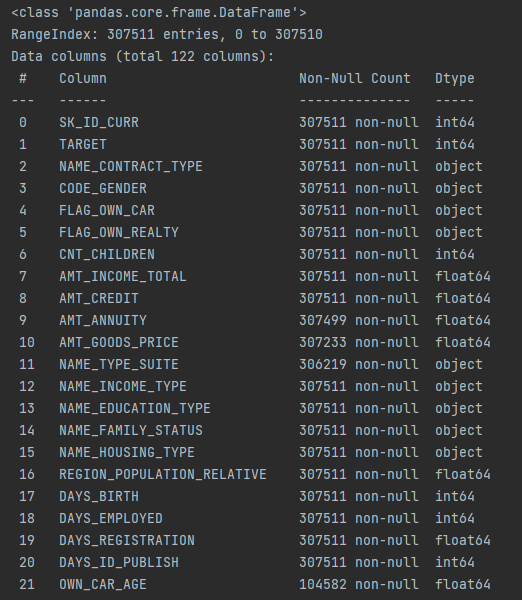


统计缺失列数量：

```python
count = 0
for column in application.columns:
    na_count = application[column][application[column].isna()].shape[0]
    if na_count>0:
        count = count+1
print('缺失列数量'+str(count))
```

> 缺失列数量67

在application表中, 还有一些字段中取值较为特殊, 我们也将其当作缺失处理

```python
application['CODE_GENDER'].unique() # 性别字段 XNA
```

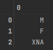

```python
# 连续工作时间字段 正常为负数(距今天数) 大于零的情况可以视为缺失
application['DAYS_EMPLOYED'][application['DAYS_EMPLOYED']>0].unique()
```

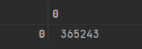

```python
# 上次修改电话距今时间 正常为负数(距今天数)  大于等于零的情况可视为缺失
application['DAYS_LAST_PHONE_CHANGE'][application['DAYS_LAST_PHONE_CHANGE']>=0].unique()
```

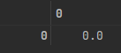

```python
# 婚姻状况字段, 也有缺失, Unknown可以视为缺失
application['NAME_FAMILY_STATUS'].unique()
```

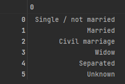

```python
#工作类型字段一共58总工作类型, 其中XNA 可以视为缺失值
application['ORGANIZATION_TYPE'].unique()
```

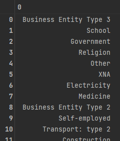

定义函数, 处理缺失值:

```python
def application_cleaning(df, fill_missing=False, fill_value=0):
    """
    df: 数据DataFrame
    fill_missing: 是否填充缺失值
    fill_value: 用来填充缺失值的数据
    """
    # ATM取款金额 <0 认为是缺失值 
    df['CODE_GENDER'].replace('XNA', np.nan, inplace=True)
    df['DAYS_EMPLOYED'].replace(365243, np.nan, inplace=True)
    df['DAYS_LAST_PHONE_CHANGE'].replace(0, np.nan, inplace=True)
    df['NAME_FAMILY_STATUS'].replace('Unknown', np.nan, inplace=True)
    df['ORGANIZATION_TYPE'].replace('XNA', np.nan, inplace=True)

    if fill_missing:
        df.fillna(fill_value, inplace=True)
    
    return df
```

调用函数填充缺失值

```python
application_cleaning_test = application.copy()
application_cleaned = application_cleaning(application_cleaning_test, fill_missing=True, fill_value=-1)
```

查看结果

```python
count = 0
for column in application_cleaned.columns:
    na_count = application_cleaned[column][application_cleaned[column].isna()].shape[0]
    if na_count>0:
        count = count+1
print('缺失列数量'+str(count))
```

>缺失列数量0

bureau 表, bureau_balance表, credit_card_balance表, installment_payments表, pos_cash_balance表,previous_application表 的缺失值异常值处理方式**参考application表处理方式, 自行处理**

**将处理缺失/异常值的过程封装成函数**


### 特征工程

#### 特征衍生

参考常规特征衍生套路, 包括用户ID分组聚合, 把数据转换成时序特征, 按照时序特征衍生处理, 也可以结合自己对业务的理解衍生出一些新的字段

**Application表**

申请表中主要记录了用户不同维度的基本信息，我们通过原始字段可以加工出一些于用户是否会违约相关的新字段来

- 受雇佣天数占比= 工作年限/年龄      (工作状态是否稳定)
- 收入和授信比例 = 收入/授信             (还款压力)
- 家庭人均收入 = 总收入/抚养人数     (家庭负担)
- 年金授信比例 = 年金(保险费、养老金等)/授信                (还款压力)

将加工新字段的代码进行封装：

```python
def fe_application(df):
    # 上班天数比例
    df['DAYS_EMPLOYED_PERC'] = df['DAYS_EMPLOYED'] / df['DAYS_BIRTH']
    # 收入和授信比例
    df['INCOME_CREDIT_PERC'] = df['AMT_INCOME_TOTAL'] / df['AMT_CREDIT']
    # 家庭人均收入   收入/家庭人口
    df['INCOME_PER_PERSON'] = df['AMT_INCOME_TOTAL'] / df['CNT_FAM_MEMBERS']
    # 年金/收入 比例
    df['ANNUITY_INCOME_PERC'] = df['AMT_ANNUITY'] / df['AMT_INCOME_TOTAL']
    # 年金/授信比例
    df['PAYMENT_RATE'] = df['AMT_ANNUITY'] / df['AMT_CREDIT']
    ft_list = ['income_per_person', 'DAYS_EMPLOYED_PERC', 'INCOME_CREDIT_PERC', 'INCOME_PER_PERSON',
               'ANNUITY_INCOME_PERC', 'PAYMENT_RATE']
    return df, ft_list
```

调用方法：

```python
application_train_ft, new_application_fts = fe_application(application_train_ft)
df_ft = application_train_ft
```

其余表的特征衍生自行处理, 特征衍生的过程需要封装成方法, 特征衍生之后的结果可以保存成pkl文件

**卡方分箱与WOE变换**

可以使用toad库进行卡方分箱, 相关API

```python
c = toad.transform.Combiner()
c.fit(train.drop(['SK_ID_CURR'], axis=1), y = 'TARGET', method = 'chi', min_samples = 0.05) 
transer = toad.transform.WOETransformer()
train_woe = transer.fit_transform(c.transform(train), train['TARGET'], exclude=['SK_ID_CURR','TARGET'])
```

#### 特征筛选

可以使用toad库的toad.selection.select 通过缺失值占比, IV值, 相关性进行特征筛选

也可以使用集成学习特征重要性进行特征筛选

### 模型训练

分别使用逻辑回归和集成学习模型进行训练, 使用交叉验证与网格搜索进行参数调整

模型AUC 需>= 0.75

