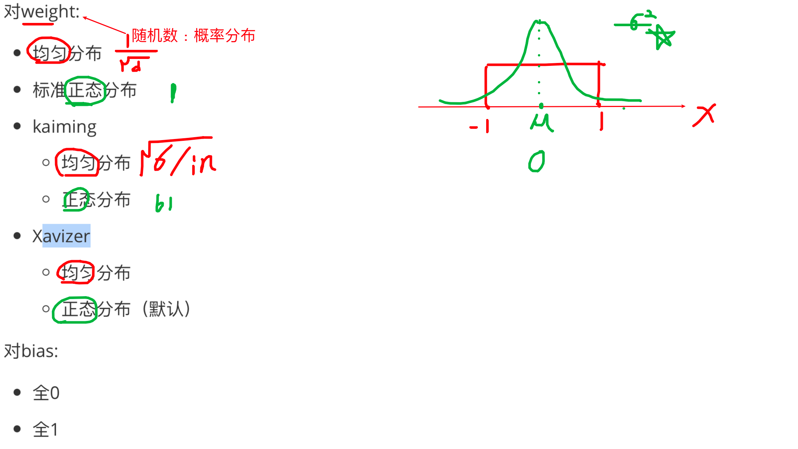
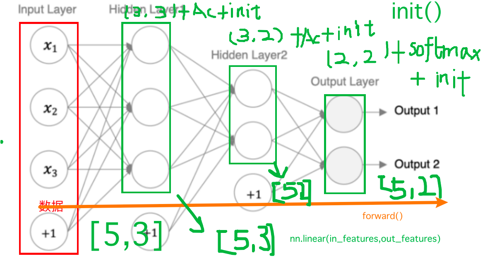
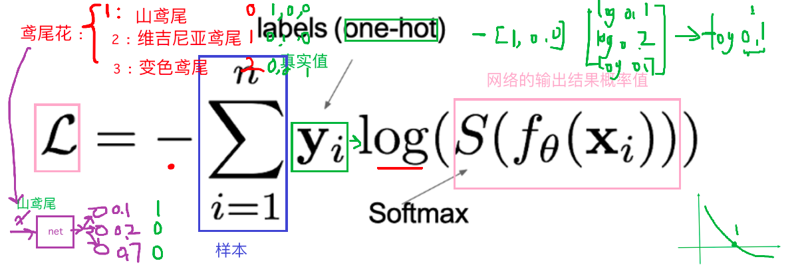
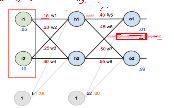
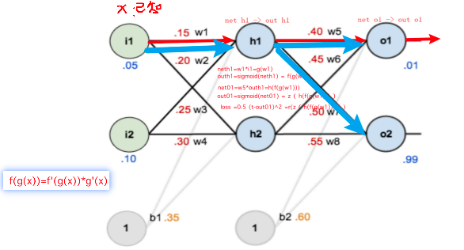

## 神经网络的构成

### 神经元：加权和+激活函数（非线性）

### 神经网络

将神经元串联起来->神经网络：

- 输入层：数据
- 输出层：目标（加权和）
- 隐藏层：加权和+激活

API：

- FC
- Linear

### 激活函数

向网络中添加非线性因素

#### sigmoid 

- 二分类输出层
- 【0,1】，概率值
- 梯度小，梯度消失（5层）

#### tanh

- 隐藏层中要使用指数型激活函数时，就选择tanh，不要使用sigmoid
- [-1,1],关于0对称
- 导数相对于sigmoid大，更新速度快，迭代次数少
- x远离0点时，梯度为0,梯度消失/弥散

#### relu

- 隐藏层使用，最多
- 小于0 ，取值为0 ；大于0 ，本身
- 导数：小于0 ，取值为0 ；大于0 ，为1
- 大于0 ：不会梯度消失
- 小于0：
  - 当某一部分神经元输出为0，神经元死亡，缓解过拟合
  - 当大部分神经元输出为0，从头开始或换激活函数leakyrelu
- 相对于sigmoid： 计算简单，计算量小（函数和求导）

#### softmax

- 多分类输出层
- 将输出层的加权和（scores/logits）转换概率值，概率值之和是1
- 选择概率最大的作为结果
- 多分类的目标值：类别标注的热编码结果

#### 激活函数选择

对于**隐藏层**:

1.优先选择ReLU激活函数

2.如果ReLu效果不好，那么尝试其他激活，如Leaky ReLu等。

3.如果你使用了ReLU， 需要注意一下Dead ReLU问题， 避免出现大的梯度从而导致过多的神经元死亡。

4.少用使用sigmoid激活函数，可以尝试使用tanh激活函数

对于**输出层**:

1.二分类问题选择sigmoid激活函数

2.多分类问题选择softmax激活函数

3.回归问题选择identity激活函数


### 参数初始化



对weight和bias进行初始化

对weight:

- 均匀分布
- 标准正态分布
- kaiming 
  - 均匀分布
  - 正态分布
- Xavizer
  - 均匀分布
  - 正态分布（默认）

对bias:

- 全0
- 全1

### 模型构建



```python
import torch.nn as nn
import torch

class Model(nn.Module):
    # 初始化
    def __init__(self):
        super(Model,self).__init__()
        self.layer1 = nn.Linear(3,3)
        self.layer2 = nn.Linear(3,2)
        self.output = nn.Linear(2,2)

    # 前向传播
    def forward(self,x):
        x =torch.relu(self.layer1(x))
        x =torch.relu(self.layer2(x))
        x =self.output(x) # scores/logits
        out =torch.softmax(x,dim=-1)
        return out


net = Model()
x = torch.randn(10,3)
out =net(x)
print(out.shape)
```

## 损失函数

### 多分类



交叉熵损失：

```python
y_true = torch.tensor([1, 2], dtype=torch.int64)
y_true = torch.tensor([[0, 1, 0], [0, 0, 1]], dtype=torch.float32)
y_pred = torch.tensor([[0.2, 6, 0.2], [0.1, 0.8, 10]], dtype=torch.float32)
loss = nn.CrossEntropyLoss()
print(loss(y_pred,y_true).numpy())
```

### 二分类交叉熵

```python
y_pred = torch.tensor([0.02, 0.8, 0.01], requires_grad=True)
y_true = torch.tensor([0, 1, 0], dtype=torch.float32)
loss = nn.BCELoss()
print(loss(y_pred,y_true))
```

### 回归损失

MAE：零点不可导

MSE：梯度爆炸

smoothl1 ：MAE+MSE 


## 优化方法


### 概念

Epoch

batch_size

iter

### 反向传播【了解】






### sgd

#### 动量法

优化梯度-》使用梯度的指数加权平均

使用最多 +学习率衰减策略

#### AdaGrad （知道）

优化学习率-》使用梯度平方和，随着迭代次数的增加减小

学习率下降过快


#### RMSProp

优化学习率-》使用梯度平方的指数加权平均，随着迭代次数的增加减小


#### Adam

adamw

动量+ RMsProp

优化梯度-》使用梯度的指数加权平均

优化学习率-》使用梯度平方的指数加权平均，随着迭代次数的增加减小

（当你对网络任务不熟悉的时候，可以选择）


### 学习率衰减

- 等间隔
- 指定间隔（常用+动量法）
- 指数
- 。。。。。


## 正则化

- 随机失活
- BN层

## 案例


```python
import torch
from torch.utils.data import TensorDataset
from torch.utils.data import DataLoader
import torch.nn as nn
import torch.optim as optim
from sklearn.datasets import make_regression
from sklearn.model_selection import train_test_split
import matplotlib.pyplot as plt
import numpy as np
import pandas as pd
import time
from torchsummary import summary

# 1.数据集
def create_dataset():
    data = pd.read_csv('/Users/mac/Desktop/AI 17期深度学习/02.code/02-神经网络/data/手机价格预测.csv')
    x = data.iloc[:,:-1]
    y = data.iloc[:,-1]
    x = x.astype(np.float32)
    y = y.astype(np.int64)
    x_train,x_test,y_train,y_test=train_test_split(x,y,test_size=0.2)
    train_dataset=TensorDataset(torch.from_numpy(x_train.values),torch.from_numpy(y_train.values))
    valid_dataset=TensorDataset(torch.from_numpy(x_test.values),torch.from_numpy(y_test.values))
    return train_dataset,valid_dataset,x_train.shape,x_test.shape

# 2.模型
class Model(nn.Module):
    def __init__(self):
        super(Model, self).__init__()
        self.layer1 = nn.Linear(20,64)
        self.layer2 = nn.Linear(64,32)
        self.layer3 = nn.Linear(32,4)

    def forward(self,x):
        x1 =self.layer1(x)
        x1_s=torch.relu(x1)
        x2 = self.layer2(x1_s)
        x2_s = torch.relu(x2)
        out =self.layer3(x2_s)
        return out


# 3.训练
def train():
    train_dataset, valid_dataset, train_shape, test_shape = create_dataset()
    model = Model()

    loss = nn.CrossEntropyLoss()

    opt = optim.SGD(model.parameters(),lr=0.001,momentum=0.9)

    for epoch in range(10):
        dataloader =DataLoader(train_dataset,shuffle=True,batch_size=16)
        loss_total = 0
        iter = 0
        for x,y in dataloader:
            pre =model(x)
            loss_values = loss(pre,y)
            loss_total += loss_values.item()
            iter+=1
            opt.zero_grad()
            loss_values.backward()
            opt.step()

        print(loss_total/(iter+0.01))


    torch.save(model.state_dict(),'/Users/mac/Desktop/AI 17期深度学习/02.code/02-神经网络/data/phone2.pth')


# 4.预测

def test():
    train_dataset, valid_dataset, train_shape, test_shape = create_dataset()
    model = Model()
    model.load_state_dict(torch.load('/Users/mac/Desktop/AI 17期深度学习/02.code/02-神经网络/data/phone2.pth'))

    dataloader =DataLoader(valid_dataset,batch_size=8,shuffle=False)

    c_num = 0
    for x,y in dataloader:
        out = model(x)
        y_pred =torch.argmax(out,dim=1)
        num = (y_pred==y).sum()
        c_num+=num

    print(c_num/len(valid_dataset))

if __name__ == '__main__':
    train_dataset,valid_dataset,train_shape,test_shape=create_dataset()
    # print(train_shape)
    # print(test_shape)

    # model = Model()
    # summary(model,input_size=(20,),batch_size=4,device='cpu')
    # train()
    test()
```

