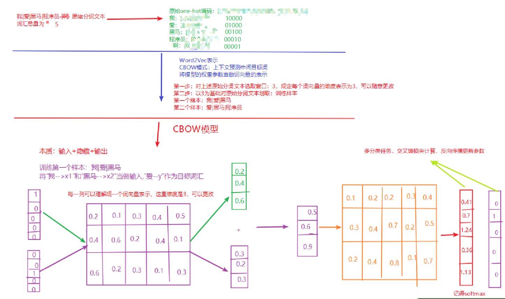
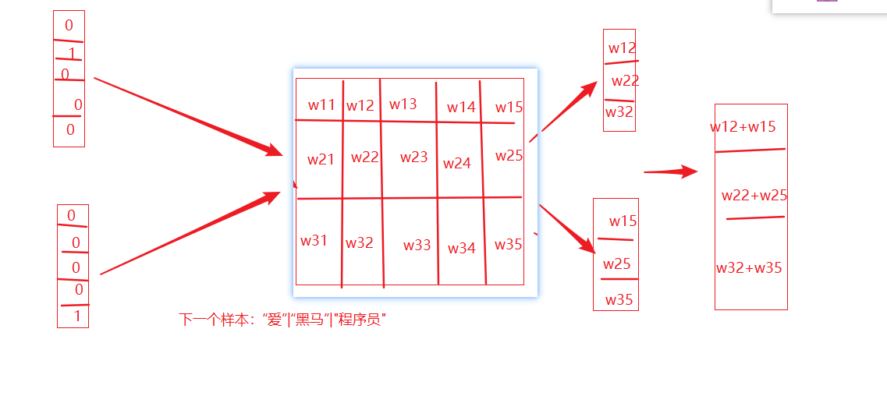

# Day01笔记

## 1 自然语言处理入门

### 1.1 NLP定义

```properties
NLP：让计算机去理解人类的语言
```

### 2.1 NLP发展简史

```properties
1950: 图灵提出：机器能够思考吗？划时代的话题
1957-1970: NLP领域形成两大阵营：规则+统计
1994-1999: 基于统计的方法占据上风
2000-2008: 机器学习占据领导地位
2015-2023: 深度学习技术改革NLP
2023年至今: 大模型AIGC时代
```

### 3.1 NLP应用场景

```properties
语音识别
机器翻译
搜素引擎
智能对话
。。。
```

## 2 文本预处理

### 2.1 认识文本预处理

- 文本预处理及作用:
  ```properties
  pandas第三方库:本质就是进行数据分析（之前就了解过数据分析）
  对中文文本进行数据预处理，来符合模型输入的要求
  ```

- 文本预处理的主要环节：
  ```properties
  1. 文本处理的基本方法: 分词、词性标注、命名实体识别
  2. 文本张量的表示方法: one-hot、 word2vec、wordEmbedding
  ...
  ```

### 2.2 文本处理的基本方法

- 分词
  - 分词的意义：

  ```properties
  定义: 将连续的字序列，按照一定的方式重新组合成词序列的过程
  原因: 1.模型训练之前，必须先分词，单词是我们理解语意的基本单元;2.英文具有天然的空格切分，但是中文没有
  ```

  - 常用分词工具：
    - jieba分词工具
      - 精确模式：就是按照人类擅长的表达词汇的习惯来分词

      ```python
      import jieba
      content = "传智教育是一家上市公司，旗下有黑马程序员品牌。我是在黑马这里学习人工智能"
      # 精确模型：试图将句子最精确地切开，适合文本分析。也属于默认模式
      jieba.cut(content, cut_all=False)  # cut_all默认为False
      
      # 将返回一个生成器对象
      <generator object Tokenizer.cut at 0x7f8d9053e650>
      
      # 若需直接返回列表内容, 使用jieba.lcut即可
      jieba.lcut(content, cut_all=False)
      ['传智', '教育', '是', '一家', '上市公司', '，', '旗下', '有', '黑马', '程序员', '品牌', '。', '我', '是', '在', '黑马', '这里', '学习', '人工智能']
      
      ```

      - 全模式分词：将尽可能成词的词汇分割出来

      ```python
      # 若需直接返回列表内容, 使用jieba.lcut即可
      jieba.lcut(content, cut_all=True)
      
      ['传', '智', '教育', '是', '一家', '上市', '上市公司', '公司', '', '', '旗下', '下有', '黑马', '程序', '程序员', '品牌', '', '', '我', '是', '在', '黑马', '这里', '学习', '人工', '人工智能', '智能']
      
      # 注意1：人工智能全模型分成三个词
      # 注意2：逗号和句号也给分成了词
      ```

      - 搜索引擎模式：在精确模式分词的基础上，将长粒度的词再次切分

      ```python
      import jieba
      content = "传智教育是一家上市公司，旗下有黑马程序员品牌。我是在黑马这里学习人工智能"
      jieba.cut_for_search(content)
      
      # 将返回一个生成器对象
      <generator object Tokenizer.cut_for_search at 0x7f8d90e5a550>
      
      # 若需直接返回列表内容, 使用jieba.lcut_for_search即可
      jieba.lcut_for_search(content)
      ['传智', '教育', '是', '一家', '上市', '公司', '上市公司', '，', '旗下', '有', '黑马', '程序', '程序员', '品牌', '。', '我', '是', '在', '黑马', '这里', '学习', '人工', '智能', '人工智能']
      
      # 对'无线电'等较长词汇都进行了再次分词.
      
      ```

      - 支持中文繁体分词

      ```python
      import jieba
      content = "煩惱即是菩提，我暫且不提"
      jieba.lcut(content)
      ['煩惱', '即', '是', '菩提', '，', '我', '暫且', '不', '提']
      ```

      - 支持用户自定义词典

        - 词典的意义：

        ```properties
        如果用户指定的词典，那么jieba优先根据词典里面的词进行分词
        词典的构造格式：
        每一行有3个元素：word 词频（省略） 词性（省略）
        # 格式：word1 freq1 word_type1
        黑马程序员 5 n
        传智教育 6 n
        人工智能 7 nz
        学习 3
        上市 3 
        ```

        - 代码实现：

        ```python
        import jieba
        
        sentence = '传智教育是一家上市公司，旗下有黑马程序员品牌。我是在黑马这里学习人工智能'
        # 1 没有使用用户自定义词典
        mydata = jieba.lcut(sentence, cut_all=False)
        print('mydata-->', mydata)
        
        # 2 使用用户自定义词典
        jieba.load_userdict("./userdict.txt")
        mydata2 = jieba.lcut(sentence, cut_all=False)
        print('mydata2-->', mydata2)
        
        # 没有使用用户自定义词典的分词效果
        mydata--> ['传智', '教育', '是', '一家', '上市公司', '，', '旗下', '有', '黑马', '程序员', '品牌', '。', '我', '是', '在', '黑马', '这里', '学习', '人工智能']
        
        # 使用用户自定义词典的分词效果
        mydata2--> ['传智教育', '是', '一家', '上市公司', '，', '旗下', '有', '黑马程序员', '品牌', '。', '我', '是', '在', '黑马', '这里', '学习', '人工智能']
        
        ```

命名实体识别(NER)

  - 定义：

  ```properties
  命名实体：通常指：人名、地名、机构名等专有名词
  NER：从一段文本中识别出上述描述的命名实体
  ```

  - 实现方式：

  ```properties
  模型训练（后续项目）
  ```

- 词性标注
  - 定义：

  ```properties
  对每个词语进行词性的标注：动词、名词、形容词等
  ```

  - 实现方式：

  ```python
  import jieba.posseg as pseg
  content = "我喜欢学习"
  pseg.lcut(content)
  ```

### 2.3 文本张量的表示方法

- 文本张量表示

  ```properties
  意义：将文本转换为向量（数字）的形式，使得模型能够识别进而实现训练，一般是进行词向量的表示
  实现的方式：
  one-hot
  word2Vec
  wordEmbedding
  ```

  One-Hot 词向量表示

  - 定义：

  ```properties
  针对每一个词汇，都会用一个向量表示，向量的长度是n,n代表去重之后的词汇总量，而且向量中只有0和1两种数字
  俗称：独热编码、01编码
  ```

  - 代码实现

    ```python
    import jieba
    # 导入keras中的词汇映射器Tokenizer
    from tensorflow.keras.preprocessing.text import Tokenizer
    # 导入用于对象保存与加载的joblib
    from sklearn.externals import joblib
    
    # 思路分析 生成onehot
    # 1 准备语料 vocabs
    # 2 实例化词汇映射器Tokenizer, 使用映射器拟合现有文本数据 (内部生成 index_word word_index)
    # 2-1 注意idx序号-1
    # 3 查询单词idx 赋值 zero_list，生成onehot
    # 4 使用joblib工具保存映射器 joblib.dump()
    def dm_onehot_gen():
    
        # 1 准备语料 vocabs
        vocabs = {"周杰伦", "陈奕迅", "王力宏", "李宗盛", "吴亦凡", "鹿晗"}
    
        # 2 实例化词汇映射器Tokenizer, 使用映射器拟合现有文本数据 (内部生成 index_word word_index)
        # 2-1 注意idx序号-1
        mytokenizer = Tokenizer()
        mytokenizer.fit_on_texts(vocabs)
    
        # 3 查询单词idx 赋值 zero_list，生成onehot
        for vocab in vocabs:
            zero_list = [0] * len(vocabs)
            idx = mytokenizer.word_index[vocab] - 1
            zero_list[idx] = 1
            print(vocab, '的onehot编码是', zero_list)
    
        # 4 使用joblib工具保存映射器 joblib.dump()
        mypath = './mytokenizer'
        joblib.dump(mytokenizer, mypath)
        print('保存mytokenizer End')
    
        # 注意5-1 字典没有顺序 onehot编码没有顺序 []-有序 {}-无序 区别
        # 注意5-2 字典有的单词才有idx idx从1开始
        # 注意5-3 查询没有注册的词会有异常 eg: 狗蛋
        print(mytokenizer.word_index)
        print(mytokenizer.index_word)
    
    ```

    - One-Hot的使用

    ```python
    # 思路分析
    # 1 加载已保存的词汇映射器Tokenizer joblib.load(mypath)
    # 2 查询单词idx 赋值zero_list，生成onehot 以token为'李宗盛'
    # 3 token = "狗蛋" 会出现异常
    def dm_onehot_use():
    
        vocabs = {"周杰伦", "陈奕迅", "王力宏", "李宗盛", "吴亦凡", "鹿晗"}
    
        # 1 加载已保存的词汇映射器Tokenizer joblib.load(mypath)
        mypath = './mytokenizer'
        mytokenizer = joblib.load(mypath)
    
        # 2 编码token为"李宗盛"  查询单词idx 赋值 zero_list，生成onehot
        token = "李宗盛"
        zero_list = [0] * len(vocabs)
        idx = mytokenizer.word_index[token] - 1
        zero_list[idx] = 1
        print(token, '的onehot编码是', zero_list)
    
    ```

- One-Hot编码的缺点：

  - 割裂了词与词之间的联系
  - 如果n过大，会导致占用大量的内存（维度爆炸）

- Word2Vec模型

  ```properties
  word2vec是一种无监督的训练方法，本质是训练一个模型，将模型的参数矩阵当作所有词汇的词向量表示
  两种训练方式：cbow、skipgram
  ```

- CBOW介绍

  ```properties
  给一段文本，选择一定的窗口，然后利用上下文预测中间目标词
  ```

  - 实现过程：

  

  - 