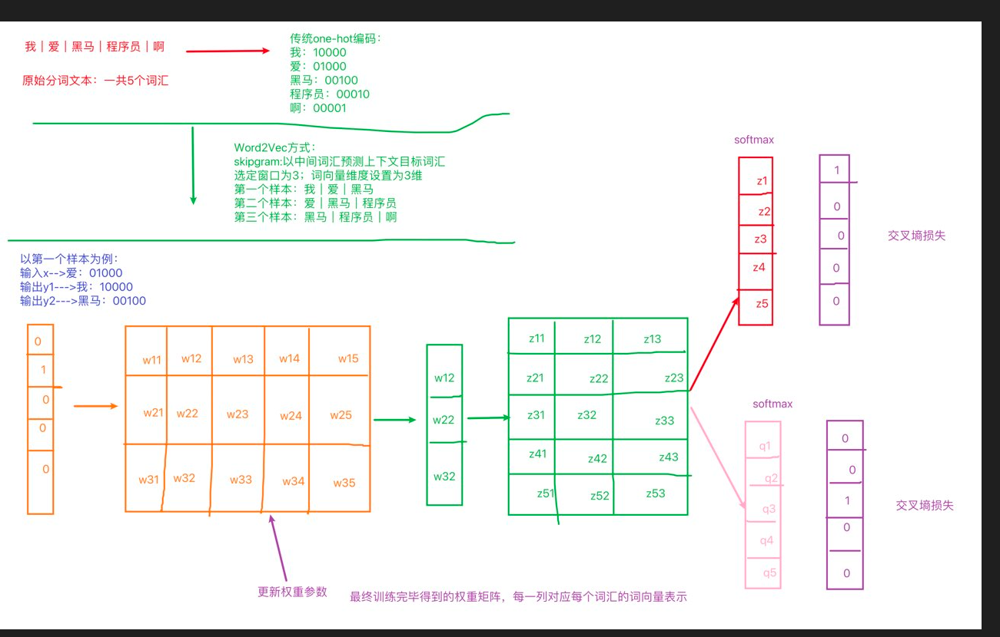
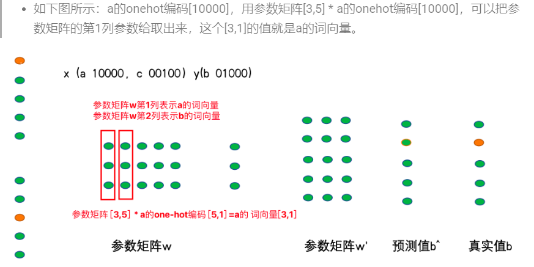

# 文本预处理-day02

## 1 词向量表示

### 1.1 word2vec之skipgram方式：

- 定义：给你一段文本，选定特定的窗口长度，然后利用中间词来预测上下文
- 实现过程：1、选定一个窗口长度：3、5、7等；2、指定词向量的维度：人为规定



- 获取词向量
- 

### 1.2 Fasttext实现word2vec的训练

- 基本过程：

  - 导包：fasttext
  - 获取数据集
  - 训练和保存
  - 加载使用

  ```python
  # 导入fasttext
  import fasttext
  
  def dm_fasttext_train_save_load():
      # 1 使用train_unsupervised(无监督训练方法) 训练词向量
      mymodel = fasttext.train_unsupervised('./data/fil9')
      print('训练词向量 ok')
  
      # 2 save_model()保存已经训练好词向量 
      # 注意，该行代码执行耗时很长 
      mymodel.save_model("./data/fil9.bin")
      print('保存词向量 ok')
  
      # 3 模型加载
      mymodel = fasttext.load_model('./data/fil9.bin')
      print('加载词向量 ok')
  
  
  # 步骤1运行效果如下：
  有效训练词汇量为124M, 共218316个单词
  Read 124M words
  Number of words:  218316
  Number of labels: 0
  Progress: 100.0% words/sec/thread:   53996 lr:  0.000000 loss:  0.734999 ETA:   0h 0m
  
  ```

### 1.3 WordEmbedding词向量

- 定义：将词映射到指定维度的空间：词向量的一种表示方法

- 实现过程

  ```python
  def dm02_nnembeding_show():
  
      # 1 对句子分词 word_list
      sentence1 = '传智教育是一家上市公司，旗下有黑马程序员品牌。我是在黑马这里学习人工智能'
      sentence2 = "我爱自然语言处理"
      sentences = [sentence1, sentence2]
  
      word_list = []
      for s in sentences:
          word_list.append(jieba.lcut(s))
      # print('word_list--->', word_list)
  
      # 2 对句子word2id求my_token_list，对句子文本数值化sentence2id
      mytokenizer = Tokenizer()
      mytokenizer.fit_on_texts(word_list)
      # print(mytokenizer.index_word, mytokenizer.word_index)
  
      # 打印my_token_list
      my_token_list = mytokenizer.index_word.values()
      print('my_token_list-->', my_token_list)
  
      # 打印文本数值化以后的句子
      sentence2id = mytokenizer.texts_to_sequences(word_list)
      print('sentence2id--->', sentence2id, len(sentence2id))
  
      # 3 创建nn.Embedding层
      embd = nn.Embedding(num_embeddings=len(my_token_list), embedding_dim=8)
      # print("embd--->", embd)
      # print('nn.Embedding层词向量矩阵-->', embd.weight.data, embd.weight.data.shape, type(embd.weight.data))
  
      # 4 创建SummaryWriter对象 词向量矩阵embd.weight.data 和 词向量单词列表my_token_list
      summarywriter = SummaryWriter()
      summarywriter.add_embedding(embd.weight.data, my_token_list)
      summarywriter.close()
  
      # 5 通过tensorboard观察词向量相似性
      # cd 程序的当前目录下执行下面的命令
      # 启动tensorboard服务 tensorboard --logdir=runs --host 0.0.0.0
      # 通过浏览器，查看词向量可视化效果 http://127.0.0.1:6006
  
      print('从nn.Embedding层中根据idx拿词向量')
      # # 6 从nn.Embedding层中根据idx拿词向量
      for idx in range(len(mytokenizer.index_word)):
          tmpvec = embd(torch.tensor(idx))
          print('%4s'%(mytokenizer.index_word[idx+1]), tmpvec.detach().numpy())
  ```

- 可视化：

  - 工具：tensorboard
  - 命令： tensorboard --logdir=runs --host 0.0.0.0

## 2 文件数据分析

定义：

```properties
文本数据分析能够有效帮助我们理解数据语料, 快速检查出语料可能存在的问题,
```

### 2.1 获取标签数量分布

作用

```properties
在深度学习模型评估中: 我们一般使用ACC作为评估指标, 若想将ACC的基线定义在50%左右, 则需要我们的正负样本比例维持在1:1左右, 否则就要进行必要的数据增强或数据删减. 上图中训练和验证集正负样本都稍有不均衡, 可以进行一些数据增强.
```

代码实现：

```python
def dm_label_sns_countplot():

    # 1 设置显示风格plt.style.use('fivethirtyeight')
    plt.style.use('fivethirtyeight')

    # 2 pd.read_csv 读训练集 验证集数据
    train_data = pd.read_csv(filepath_or_buffer = './cn_data/train.tsv', sep='\t')
    dev_data = pd.read_csv(filepath_or_buffer = './cn_data/dev.tsv', sep='\t')

    # 3 sns.countplot() 统计label标签的0、1分组数量
    sns.countplot(x='label', data = train_data)

    # 4 画图展示 plt.title() plt.show()
    plt.title('train_label')
    plt.show()

    # 验证集上标签的数量分布
    # 3-2 sns.countplot() 统计label标签的0、1分组数量
    sns.countplot(x='label', data = dev_data)

    # 4-2 画图展示 plt.title() plt.show()
    plt.title('dev_label')
    plt.show()
```

### 2.2 获取句子长度分布

作用

```properties
通过绘制句子长度分布图, 可以得知我们的语料中大部分句子长度的分布范围, 因为模型的输入要求为固定尺寸的张量，合理的长度范围对之后进行句子截断补齐(规范长度)起到关键的指导作用.
```

代码实现

```python
def dm_len_sns_countplot_distplot():
    # 1 设置显示风格plt.style.use('fivethirtyeight')
    plt.style.use('fivethirtyeight')

    # 2 pd.read_csv 读训练集 验证集数据
    train_data = pd.read_csv(filepath_or_buffer='./cn_data/train.tsv', sep='\t')
    dev_data = pd.read_csv(filepath_or_buffer='./cn_data/dev.tsv', sep='\t')

    # 3 求数据长度列 然后求数据长度的分布
    train_data['sentence_length'] =  list( map(lambda x: len(x), train_data['sentence']))

    # 4 绘制数据长度分布图-柱状图
    sns.countplot(x='sentence_length', data=train_data)
    # sns.countplot(x=train_data['sentence_length'])
    plt.xticks([]) # x轴上不要提示信息
    # plt.title('sentence_length countplot')
    plt.show()

    # 5 绘制数据长度分布图-曲线图
    sns.displot(x='sentence_length', data=train_data)
    # sns.displot(x=train_data['sentence_length'])
    plt.yticks([]) # y轴上不要提示信息
    plt.show()

    # 验证集
    # 3 求数据长度列 然后求数据长度的分布
    dev_data['sentence_length'] = list(map(lambda x: len(x), dev_data['sentence']))

    # 4 绘制数据长度分布图-柱状图
    sns.countplot(x='sentence_length', data=dev_data)
    # sns.countplot(x=dev_data['sentence_length'])
    plt.xticks([])  # x轴上不要提示信息
    # plt.title('sentence_length countplot')
    plt.show()

    # 5 绘制数据长度分布图-曲线图
    sns.displot(x='sentence_length', data=dev_data)
    # sns.displot(x=dev_data['sentence_length'])
    plt.yticks([])  # y轴上不要提示信息
    plt.show()
```

### 2.3 获取正负样本散点图分布

作用

```properties
通过查看正负样本长度散点图, 可以有效定位异常点的出现位置, 帮助我们更准确进行人工语料审查.
```

代码实现

```python
def dm03_sns_stripplot():
    # 1 设置显示风格plt.style.use('fivethirtyeight')
    plt.style.use('fivethirtyeight')

    # 2 pd.read_csv 读训练集 验证集数据
    train_data = pd.read_csv(filepath_or_buffer='./cn_data/train.tsv', sep='\t')
    dev_data = pd.read_csv(filepath_or_buffer='./cn_data/dev.tsv', sep='\t')

    # 3 求数据长度列 然后求数据长度的分布
    train_data['sentence_length'] = list(map(lambda x: len(x), train_data['sentence']))

    # 4 统计正负样本长度散点图 （对train_data数据，按照label进行分组，统计正样本散点图）
    sns.stripplot(y='sentence_length', x='label', data=train_data)
    plt.show()

    sns.stripplot(y='sentence_length', x='label', data=dev_data)
    plt.show()
```

### 2.4 获取不同词汇总数统计

代码实现

```python
# 导入jieba用于分词
# 导入chain方法用于扁平化列表
import jieba
from itertools import chain

# 进行训练集的句子进行分词, 并统计出不同词汇的总数
train_vocab = set(chain(*map(lambda x: jieba.lcut(x), train_data["sentence"])))
print("训练集共包含不同词汇总数为：", len(train_vocab))

# 进行验证集的句子进行分词, 并统计出不同词汇的总数
valid_vocab = set(chain(*map(lambda x: jieba.lcut(x), valid_data["sentence"])))
print("训练集共包含不同词汇总数为：", len(valid_vocab))

```

