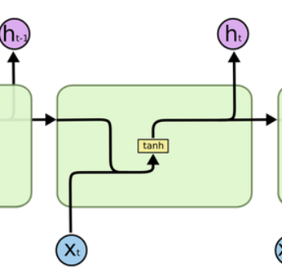
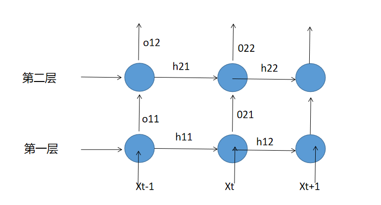

## Day02 课堂笔记

## 1. 文本预处理

### 1.1 获取数据集形容词词云

```python
# 使用jieba中的词性标注功能
import jieba.posseg as pseg
from wordcloud import WordCloud

# 每句话产生形容词列表
def get_a_list(text):
    r = []

    # 使用jieba的词性标注方法切分文本 找到形容词存入到列表中返回
    for g in pseg.lcut(text):
        if g.flag == "a":
            r.append(g.word)
    return r

# 根据词云列表产生词云
def  get_word_cloud(keywords_list):
    # 实例化词云生成器对象
    wordcloud = WordCloud(font_path="./SimHei.ttf", max_words=100, background_color='white')
    # 准备数据
    keywords_string = " ".join (keywords_list)
    # 产生词云
    wordcloud.generate(keywords_string)

    # 画图
    plt.figure()
    plt.imshow(wordcloud, interpolation="bilinear")
    plt.axis('off')
    plt.show()


# 思路分析 训练集正样本词云 训练集负样本词云
# 1 获得训练集上正样本 p_train_data
#   eg: 先使用逻辑==操作检索符合正样本 train_data[train_data['label'] == 1]
# 2 获取正样本的每个句子的形容词 p_a_train_vocab = chain(*map(a,b))
# 3 调用绘制词云函数
def dm_word_cloud():
    # 1 获得训练集上正样本p_train_data
    #   eg: 先使用逻辑==操作检索符合正样本 train_data[train_data['label'] == 1]
    train_data = pd.read_csv(filepath_or_buffer='./cn_data/train.tsv', sep='\t')
    p_train_data = train_data[train_data['label'] == 1 ]['sentence']

    # 2 获取正样本的每个句子的形容词 p_a_train_vocab = chain(*map(a,b))
    p_a_train_vocab = list(chain(*map(lambda x: get_a_list(x) , p_train_data)))
    # print(p_a_train_vocab)
    # print(list(p_a_train_vocab))

    # 3 调用绘制词云函数
    get_word_cloud(p_a_train_vocab)


    print('*' * 60 )
    # 训练集负样本词云
    n_train_data = train_data[train_data['label'] == 0 ]['sentence']

    # 2 获取正样本的每个句子的形容词 p_a_train_vocab = chain(*map(a,b))
    n_a_train_vocab = chain(*map(lambda x: get_a_list(x) , n_train_data)  )
    # print(n_a_dev_vocab)
    # print(list(n_a_dev_vocab))

    # 3 调用绘制词云函数
    get_word_cloud(n_a_train_vocab)
```

作用

```properties
根据高频形容词词云显示, 我们可以对当前语料质量进行简单评估, 同时对违反语料标签含义的词汇进行人工审查和修正, 来保证绝大多数语料符合训练标准
```

### 1.2 文本特征处理

文本特征处理的作用:

```python
文本特征处理包括为语料添加具有普适性的文本特征, 如:n-gram特征, 以及对加入特征之后的文本语料进行必要的处理, 如: 长度规范,这些特征处理工作能够有效的将重要的文本特征加入模型训练中, 增强模型评估指标.
```

- 常见的文本特征处理方法:
  - 添加n-gram特征
  - 文本长度规范

#### 1.2.1 添加N-gram特征

定义：

```python
给定一段文本序列, 其中n个词或字的相邻共现特征即n-gram特征, 常用的n-gram特征是bi-gram和tri-gram特征, 分别对应n为2和3.
```

代码：

```python
# 一般n-gram中的n取2或者3, 这里取2为例
ngram_range = 2

def create_ngram_set(input_list):
    """
    description: 从数值列表中提取所有的n-gram特征
    :param input_list: 输入的数值列表, 可以看作是词汇映射后的列表, 
                       里面每个数字的取值范围为[1, 25000]
    :return: n-gram特征组成的集合

    eg:
    >>> create_ngram_set([1, 3, 2, 1, 5, 3])
    {(3, 2), (1, 3), (2, 1), (1, 5), (5, 3)}
    """ 
    return set(zip(*[input_list[i:] for i in range(ngram_range)]))

```

#### 1.2.2 文本长度规范及其作用

作用:

```properties
一般模型的输入需要等尺寸大小的矩阵, 因此在进入模型前需要对每条文本数值映射后的长度进行规范, 此时将根据句子长度分布分析出覆盖绝大多数文本的合理长度, 对超长文本进行截断,
```

代码：

```python
from tensorflow.keras.preprocessing import sequence

# cutlen根据数据分析中句子长度分布，覆盖90%左右语料的最短长度.
# 这里假定cutlen为10
cutlen = 10

def padding(x_train):
    """
    description: 对输入文本张量进行长度规范
    :param x_train: 文本的张量表示, 形如: [[1, 32, 32, 61], [2, 54, 21, 7, 19]]
    :return: 进行截断补齐后的文本张量表示 
    """
    # 使用sequence.pad_sequences即可完成
    return sequence.pad_sequences(x_train, cutlen)

```

### 1.3 文本数据增强方法

定义:

```properties
回译数据增强目前是文本数据增强方面效果较好的增强方法, 一般基于google、有道等翻译接口, 将文本数据翻译成另外一种语言(一般选择小语种),之后再翻译回原语言, 即可认为得到与与原语料同标签的新语料, 新语料加入到原数据集中即可认为是对原数据集数据增强.
```

实现方式：

```properties
大模型
```

## 2. RNN模型

- 定义：
  - 循环神经网络：当前时间步的输出：当前时间步的输入+上一时间步的隐层输出
- 作用和应用场景：
  - 很好处理NLP各种任务：文本翻译、文本分类等等

### 2.1 RNN模型的分类

- 根据输入与输出结构
  - N vs N 
    - 特点：输入和输出是等长的
    - 范围：诗歌、对联
  - N vs 1
    - 特点：输入不限定长度，输出是唯一的
    - 范围：分类任务
  - 1 vs N
    - 特点：输入是唯一的，输出不限定长度
    - 范围：图片生成任务
  - N vs M（seq2seq架构）
    - 特点：输入和输出不等长
    - 范围：文本翻译任务等
- 根据RNN内部结构
  - 传统RNN
  - LSTM
  - Bi-LSTM
  - GRU
  - Bi-GRU

## 3. 传统RNN模型

- 内部结构

  

  - 多层num_layers理解：

  

  - 输入:

    - 当前时间步的输入xt
    - 上一时间步隐藏层的输出ht-1

  - 输出：

    - ht或则ot


  RNN模型实现

  ```python
  import torch 
  import torch.nn as nn
  def dm_rnn_base():
      # input_size:代表输入张量x的维度(词向量维度)
      # hidden_size:代表隐藏层的神经元个数
      # num_layers:代表隐藏层的数量，默认是1
      rnn = nn.RNN(input_size=5, hidden_size=6, num_layers=1)
      # 改变隐层个数：
      # rnn = nn.RNN(input_size=5, hidden_size=6, num_layers=2)
      # input各参数含义：
          #第一个参数：sequence_length输入序列的长度(一个句子词汇或者字符的个数)
          #第二个参数：batch_size:批次样本数量
          #第三个参数：input_size:输入张量x的维度
      # input = torch.randn(1, 3, 5)
      #改变输入数据的长度
      "what time is it"
      input = torch.randn(4, 3, 5)
      # h0各参数的含义
          # 第一个参数：num_layers*num_directions(num_layers、num_directions（网格方向）一般默认为1，)
          # 第二个参数：batch_size:批次样本数量
          # 第三个参数：hidden_size:隐藏层的神经元个数
      #h0 = torch.randn(1, 3, 6)
      # 该变隐藏层个数
      h0 = torch.randn(1, 3, 6)
  
      # 一次性输入文本
      output, hn = rnn(input, h0)
      print(f'一次性输入文本的output---->形状{output.shape},数值：{output}')
      print(f'一次性输入文本的hn---->形状{hn.shape},数值：{hn}')
      ##一个词一个词的输入文本
      s_len = input.shape[0]
      for idx in range(s_len):
          tmp = input[idx].unsqueeze(0)
          # print(f'tmp---->{tmp.shape},{tmp}')
          # break
          output, h0 = rnn(tmp, h0)
          print(f'第{idx+1}次output--->：{output.shape}, {output}')
          print(f'第{idx+1}次ho--->：{h0.shape}, {h0}')
  
  ```

  


